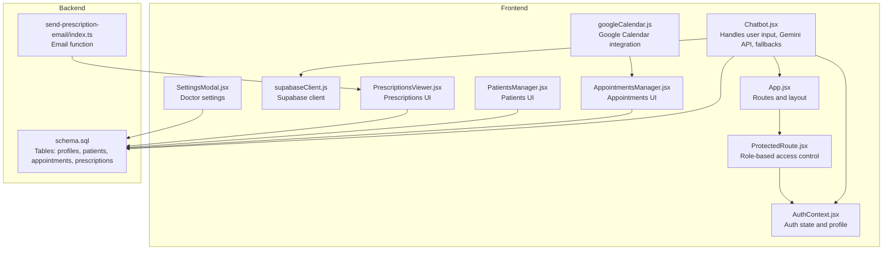
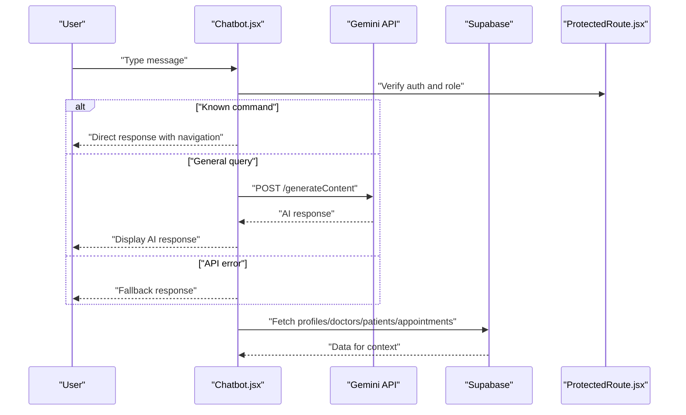
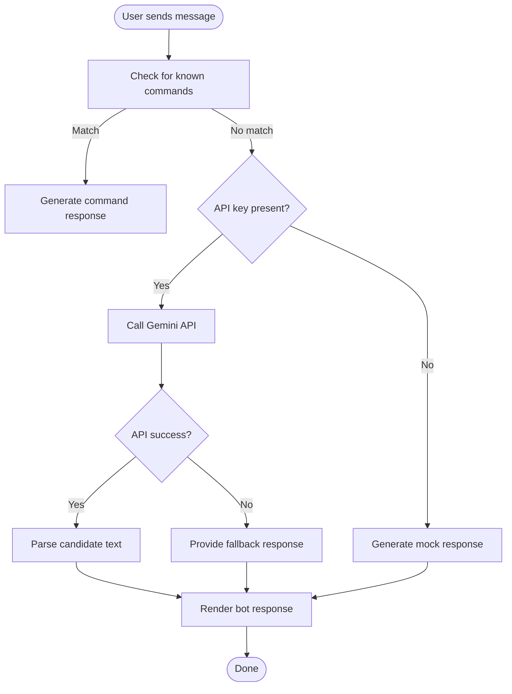
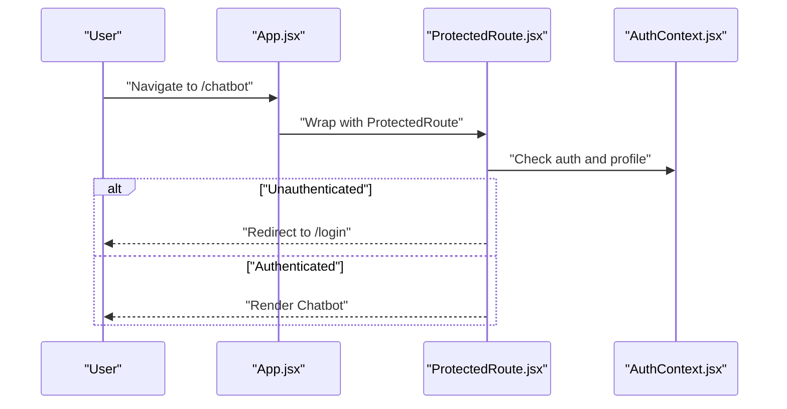
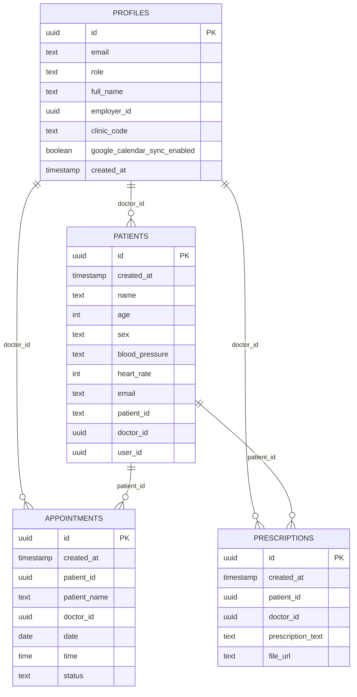
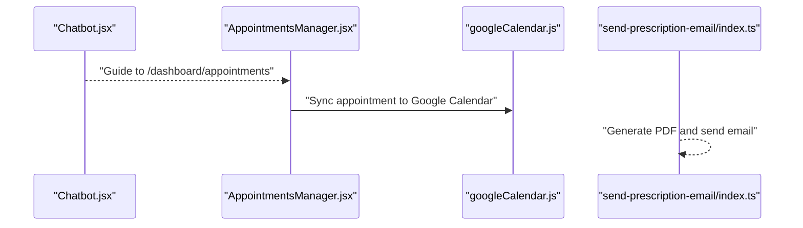
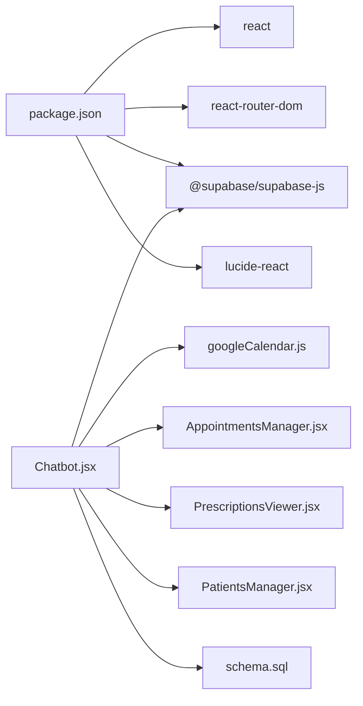

# AI Chatbot Integration

<cite>
**Referenced Files in This Document**
- [Chatbot.jsx](file://frontend/src/pages/Chatbot.jsx)
- [App.jsx](file://frontend/src/App.jsx)
- [AuthContext.jsx](file://frontend/src/context/AuthContext.jsx)
- [ProtectedRoute.jsx](file://frontend/src/components/ProtectedRoute.jsx)
- [supabaseClient.js](file://frontend/src/lib/supabaseClient.js)
- [schema.sql](file://backend/schema.sql)
- [googleCalendar.js](file://frontend/src/lib/googleCalendar.js)
- [AppointmentsManager.jsx](file://frontend/src/pages/AppointmentsManager.jsx)
- [PatientsManager.jsx](file://frontend/src/pages/PatientsManager.jsx)
- [PrescriptionsViewer.jsx](file://frontend/src/pages/PrescriptionsViewer.jsx)
- [SettingsModal.jsx](file://frontend/src/components/SettingsModal.jsx)
- [send-prescription-email/index.ts](file://supabase/functions/send-prescription-email/index.ts)
- [package.json](file://frontend/package.json)
</cite>

## Table of Contents
1. [Introduction](#introduction)
2. [Project Structure](#project-structure)
3. [Core Components](#core-components)
4. [Architecture Overview](#architecture-overview)
5. [Detailed Component Analysis](#detailed-component-analysis)
6. [Dependency Analysis](#dependency-analysis)
7. [Performance Considerations](#performance-considerations)
8. [Troubleshooting Guide](#troubleshooting-guide)
9. [Conclusion](#conclusion)
10. [Appendices](#appendices)

## Introduction
This document describes the AI chatbot integration for MedVita’s conversational assistance system. It covers the Gemini AI API integration, conversation management, and natural language processing capabilities. It also explains the chatbot architecture, including intent recognition, context management, and response generation; fallback mechanisms for unavailable AI responses; human agent handoff procedures; conversation logging; integration with patient information, appointment scheduling, and common healthcare inquiries; customization options for chatbot personality and response templates; and privacy and compliance considerations for handling health information securely.

## Project Structure
The chatbot resides in the frontend under the pages directory and integrates with Supabase for authentication and data access. It leverages environment variables for API keys and routes to protected dashboards. The backend schema defines the data model for profiles, patients, appointments, and prescriptions, enabling contextual responses and navigation.

**Diagram sources**
- [Chatbot.jsx](file://frontend/src/pages/Chatbot.jsx#L1-L201)
- [App.jsx](file://frontend/src/App.jsx#L1-L62)
- [AuthContext.jsx](file://frontend/src/context/AuthContext.jsx#L1-L108)
- [ProtectedRoute.jsx](file://frontend/src/components/ProtectedRoute.jsx#L1-L108)
- [supabaseClient.js](file://frontend/src/lib/supabaseClient.js#L1-L11)
- [googleCalendar.js](file://frontend/src/lib/googleCalendar.js#L1-L199)
- [AppointmentsManager.jsx](file://frontend/src/pages/AppointmentsManager.jsx#L1-L577)
- [PatientsManager.jsx](file://frontend/src/pages/PatientsManager.jsx#L1-L667)
- [PrescriptionsViewer.jsx](file://frontend/src/pages/PrescriptionsViewer.jsx#L1-L273)
- [SettingsModal.jsx](file://frontend/src/components/SettingsModal.jsx#L1-L672)
- [schema.sql](file://backend/schema.sql#L1-L274)
- [send-prescription-email/index.ts](file://supabase/functions/send-prescription-email/index.ts#L1-L193)

**Section sources**
- [Chatbot.jsx](file://frontend/src/pages/Chatbot.jsx#L1-L201)
- [App.jsx](file://frontend/src/App.jsx#L1-L62)
- [schema.sql](file://backend/schema.sql#L1-L274)

## Core Components
- Chatbot UI and logic: Manages messages, sends user input to Gemini, applies fallbacks, and renders responses with links to relevant dashboards.
- Authentication and routing: Protects routes and ensures only authenticated users with proper roles can access chatbot and related dashboards.
- Data access: Uses Supabase client to query profiles, patients, appointments, and prescriptions for contextual responses.
- External integrations: Google Calendar sync for appointments; email function for prescriptions.

**Section sources**
- [Chatbot.jsx](file://frontend/src/pages/Chatbot.jsx#L1-L201)
- [AuthContext.jsx](file://frontend/src/context/AuthContext.jsx#L1-L108)
- [ProtectedRoute.jsx](file://frontend/src/components/ProtectedRoute.jsx#L1-L108)
- [supabaseClient.js](file://frontend/src/lib/supabaseClient.js#L1-L11)
- [googleCalendar.js](file://frontend/src/lib/googleCalendar.js#L1-L199)

## Architecture Overview
The chatbot architecture combines a React UI with a Gemini API for NLP and a Supabase backend for data. The system supports role-based access control and integrates with healthcare workflows such as appointments and prescriptions.

**Diagram sources**
- [Chatbot.jsx](file://frontend/src/pages/Chatbot.jsx#L22-L103)
- [ProtectedRoute.jsx](file://frontend/src/components/ProtectedRoute.jsx#L53-L106)
- [supabaseClient.js](file://frontend/src/lib/supabaseClient.js#L1-L11)

## Detailed Component Analysis

### Chatbot Component
Responsibilities:
- Accepts user input and displays messages.
- Detects known commands (navigation, availability) and responds directly.
- Sends general queries to Gemini API with a tailored prompt.
- Applies fallbacks when API is unavailable or returns errors.
- Renders loading indicators and links to relevant dashboards.

Key behaviors:
- Command detection: Checks for keywords like “book appointment” and “doctor availability.”
- Gemini integration: Sends structured prompts with context and role instructions.
- Fallback logic: Provides helpful offline responses and guidance.
- Navigation: Embeds links to the Appointments page for seamless handoff.

**Diagram sources**
- [Chatbot.jsx](file://frontend/src/pages/Chatbot.jsx#L22-L103)

**Section sources**
- [Chatbot.jsx](file://frontend/src/pages/Chatbot.jsx#L1-L201)

### Authentication and Authorization
- AuthContext manages session state, profile retrieval, and exposes sign-in/sign-out.
- ProtectedRoute enforces role-based access control and redirects unauthorized users.
- Combined with Chatbot routing, only authenticated users can access the chatbot interface.

**Diagram sources**
- [App.jsx](file://frontend/src/App.jsx#L55-L56)
- [ProtectedRoute.jsx](file://frontend/src/components/ProtectedRoute.jsx#L53-L106)
- [AuthContext.jsx](file://frontend/src/context/AuthContext.jsx#L9-L107)

**Section sources**
- [AuthContext.jsx](file://frontend/src/context/AuthContext.jsx#L1-L108)
- [ProtectedRoute.jsx](file://frontend/src/components/ProtectedRoute.jsx#L1-L108)
- [App.jsx](file://frontend/src/App.jsx#L1-L62)

### Data Model and Contextual Responses
The backend schema defines tables for profiles, patients, appointments, and prescriptions. The chatbot uses these to tailor responses and provide navigation to relevant dashboards.

**Diagram sources**
- [schema.sql](file://backend/schema.sql#L4-L274)

**Section sources**
- [schema.sql](file://backend/schema.sql#L1-L274)

### External Integrations
- Google Calendar: The chatbot can guide users to the Appointments page; the appointments manager supports Google Calendar sync for automatic event creation.
- Email Function: A serverless function generates and emails prescriptions as PDFs, embedding health tips and branding.

**Diagram sources**
- [Chatbot.jsx](file://frontend/src/pages/Chatbot.jsx#L37-L46)
- [AppointmentsManager.jsx](file://frontend/src/pages/AppointmentsManager.jsx#L134-L180)
- [googleCalendar.js](file://frontend/src/lib/googleCalendar.js#L126-L178)
- [send-prescription-email/index.ts](file://supabase/functions/send-prescription-email/index.ts#L1-L193)

**Section sources**
- [googleCalendar.js](file://frontend/src/lib/googleCalendar.js#L1-L199)
- [send-prescription-email/index.ts](file://supabase/functions/send-prescription-email/index.ts#L1-L193)

## Dependency Analysis
- Frontend dependencies include React, React Router, Supabase JS client, Tailwind utilities, and Lucide icons.
- The chatbot depends on Supabase for authentication and data access and on environment variables for Gemini and Supabase credentials.
- The backend schema defines row-level security policies and foreign key relationships to support secure and contextual chatbot responses.

**Diagram sources**
- [package.json](file://frontend/package.json#L13-L31)
- [Chatbot.jsx](file://frontend/src/pages/Chatbot.jsx#L1-L201)
- [googleCalendar.js](file://frontend/src/lib/googleCalendar.js#L1-L199)
- [AppointmentsManager.jsx](file://frontend/src/pages/AppointmentsManager.jsx#L1-L577)
- [PrescriptionsViewer.jsx](file://frontend/src/pages/PrescriptionsViewer.jsx#L1-L273)
- [PatientsManager.jsx](file://frontend/src/pages/PatientsManager.jsx#L1-L667)
- [schema.sql](file://backend/schema.sql#L1-L274)

**Section sources**
- [package.json](file://frontend/package.json#L1-L50)
- [Chatbot.jsx](file://frontend/src/pages/Chatbot.jsx#L1-L201)

## Performance Considerations
- Gemini API latency: Implement request timeouts and caching for repeated queries to improve perceived responsiveness.
- Debouncing user input: Add debouncing to reduce unnecessary API calls during rapid typing.
- UI rendering: Virtualize long conversation lists and lazy-load images/logos to maintain smooth scrolling.
- Environment configuration: Ensure API keys are configured to avoid extra error handling overhead.

## Troubleshooting Guide
Common issues and resolutions:
- Missing Gemini API key: The chatbot falls back to a mock response and instructs to add the key. Verify environment variables and redeploy.
- Gemini API errors: The chatbot logs errors and returns a friendly fallback message; check network connectivity and quota limits.
- Authentication failures: ProtectedRoute redirects unauthenticated users to login; ensure session persistence and profile retrieval succeed.
- Data access errors: If Supabase queries fail, verify row-level security policies and table relationships defined in the schema.

Operational checks:
- Confirm environment variables for Gemini and Supabase are present in the runtime environment.
- Validate Supabase connection and policies for profiles, patients, appointments, and prescriptions.
- Test Google Calendar integration and email function for end-to-end flows.

**Section sources**
- [Chatbot.jsx](file://frontend/src/pages/Chatbot.jsx#L48-L93)
- [ProtectedRoute.jsx](file://frontend/src/components/ProtectedRoute.jsx#L76-L93)
- [schema.sql](file://backend/schema.sql#L30-L274)

## Conclusion
MedVita’s chatbot integrates Gemini AI with a secure, role-aware frontend and a well-defined backend schema. It provides contextual responses, graceful fallbacks, and seamless navigation to healthcare workflows such as appointments and prescriptions. With proper configuration and monitoring, the system delivers a reliable conversational assistant aligned with healthcare needs and user expectations.

## Appendices

### Customization Options
- Chatbot personality and prompts: Modify the prompt sent to Gemini in the chatbot component to adjust tone and capabilities.
- Response templates: Extend command handling to support templated responses for common queries.
- Domain-specific knowledge: Enhance the prompt with clinic-specific guidelines and disclaimers.
- Doctor customization: Use the Settings modal to personalize prescription branding and details.

**Section sources**
- [Chatbot.jsx](file://frontend/src/pages/Chatbot.jsx#L50-L71)
- [SettingsModal.jsx](file://frontend/src/components/SettingsModal.jsx#L1-L672)

### Privacy and Compliance Considerations
- Data minimization: Avoid requesting sensitive information unless necessary; rely on Supabase data for context.
- Secure transport: Ensure all API calls use HTTPS; configure environment variables securely.
- Access control: Enforce role-based access via ProtectedRoute and Supabase RLS policies.
- Logging: Avoid storing sensitive health information in logs; sanitize messages before logging.
- Consent and transparency: Provide clear messaging about AI assistance and data usage.

**Section sources**
- [ProtectedRoute.jsx](file://frontend/src/components/ProtectedRoute.jsx#L53-L106)
- [schema.sql](file://backend/schema.sql#L30-L274)

### Integration Examples
- Appointment booking: The chatbot detects intent and navigates to the Appointments page; the manager handles booking and optional Google Calendar sync.
- Prescriptions: The chatbot can guide users to the Prescriptions Viewer; the email function sends branded PDFs with health tips.

**Section sources**
- [Chatbot.jsx](file://frontend/src/pages/Chatbot.jsx#L37-L46)
- [AppointmentsManager.jsx](file://frontend/src/pages/AppointmentsManager.jsx#L134-L180)
- [PrescriptionsViewer.jsx](file://frontend/src/pages/PrescriptionsViewer.jsx#L1-L273)
- [send-prescription-email/index.ts](file://supabase/functions/send-prescription-email/index.ts#L1-L193)