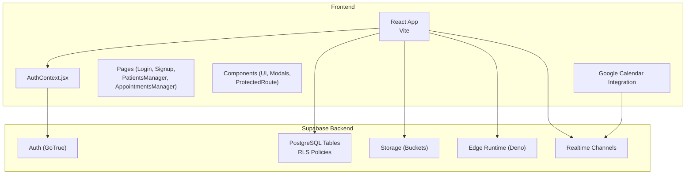
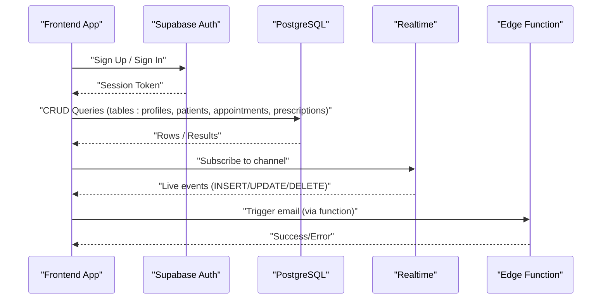
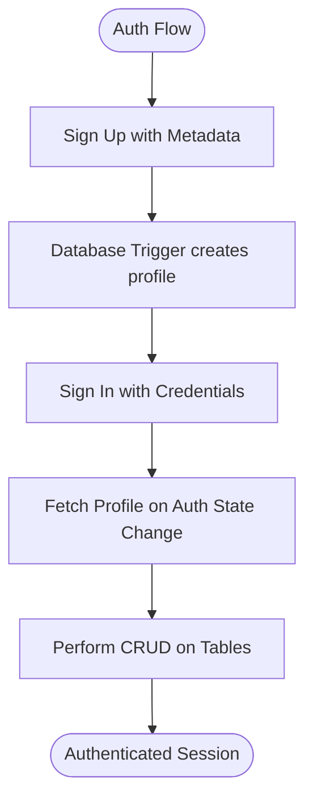
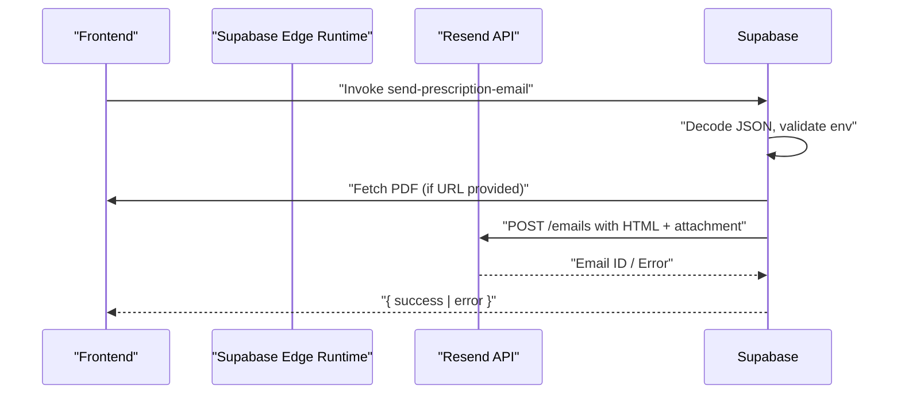
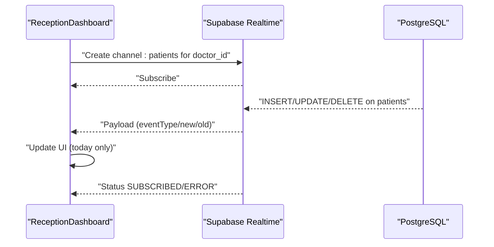
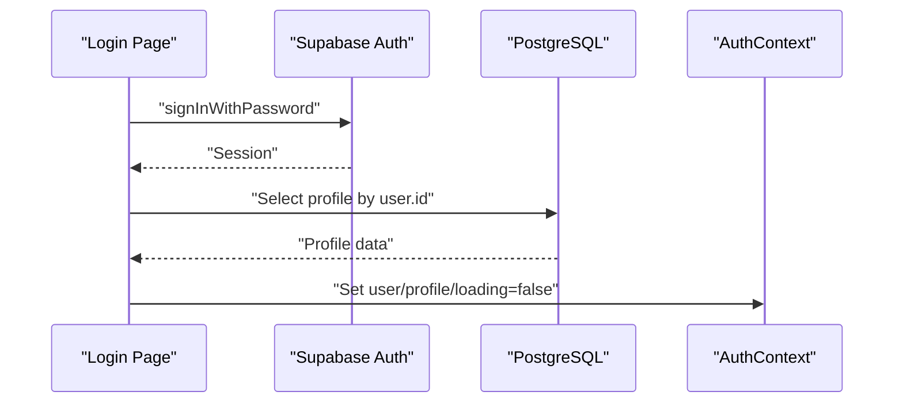
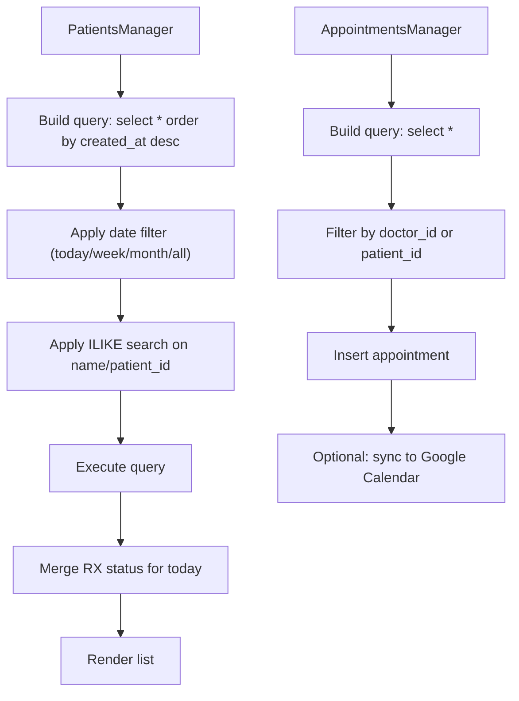
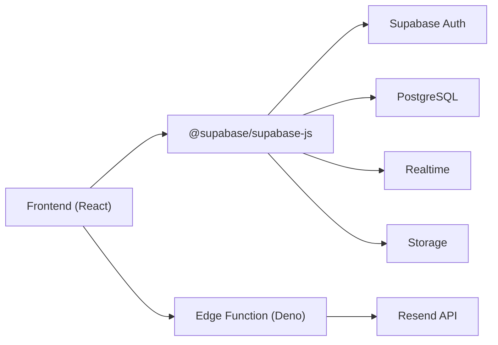

# API Reference

<cite>
**Referenced Files in This Document**
- [supabase/functions/send-prescription-email/index.ts](file://supabase/functions/send-prescription-email/index.ts)
- [supabase/config.toml](file://supabase/config.toml)
- [backend/schema.sql](file://backend/schema.sql)
- [frontend/src/lib/supabaseClient.js](file://frontend/src/lib/supabaseClient.js)
- [frontend/src/context/AuthContext.jsx](file://frontend/src/context/AuthContext.jsx)
- [frontend/src/pages/Login.jsx](file://frontend/src/pages/Login.jsx)
- [frontend/src/pages/Signup.jsx](file://frontend/src/pages/Signup.jsx)
- [frontend/src/pages/PatientsManager.jsx](file://frontend/src/pages/PatientsManager.jsx)
- [frontend/src/pages/AppointmentsManager.jsx](file://frontend/src/pages/AppointmentsManager.jsx)
- [frontend/src/pages/ReceptionDashboard.jsx](file://frontend/src/pages/ReceptionDashboard.jsx)
- [frontend/src/pages/ReceptionistSignup.jsx](file://frontend/src/pages/ReceptionistSignup.jsx)
- [frontend/src/lib/googleCalendar.js](file://frontend/src/lib/googleCalendar.js)
- [frontend/src/components/PatientDetails.jsx](file://frontend/src/components/PatientDetails.jsx)
- [frontend/src/components/PrescriptionCreator.jsx](file://frontend/src/components/PrescriptionCreator.jsx)
- [frontend/src/components/PrescriptionPreviewModal.jsx](file://frontend/src/components/PrescriptionPreviewModal.jsx)
- [frontend/src/components/ProtectedRoute.jsx](file://frontend/src/components/ProtectedRoute.jsx)
- [frontend/src/components/SettingsModal.jsx](file://frontend/src/components/SettingsModal.jsx)
- [frontend/src/components/Sidebar.jsx](file://frontend/src/components/Sidebar.jsx)
- [frontend/src/components/Header.jsx](file://frontend/src/components/Header.jsx)
- [frontend/src/components/Layout.jsx](file://frontend/src/components/Layout.jsx)
- [frontend/src/components/ui/Button.jsx](file://frontend/src/components/ui/Button.jsx)
- [frontend/src/components/ui/Card.jsx](file://frontend/src/components/ui/Card.jsx)
- [frontend/src/components/ui/Input.jsx](file://frontend/src/components/ui/Input.jsx)
- [frontend/src/components/ui/Badge.jsx](file://frontend/src/components/ui/Badge.jsx)
- [frontend/src/hooks/](file://frontend/src/hooks/)
- [frontend/src/test/](file://frontend/src/test/)
- [frontend/src/App.jsx](file://frontend/src/App.jsx)
- [frontend/src/main.jsx](file://frontend/src/main.jsx)
- [frontend/package.json](file://frontend/package.json)
- [frontend/.env.example](file://frontend/.env.example)
- [README.md](file://README.md)
- [frontend/testsprite_tests/standard_prd.json](file://frontend/testsprite_tests/standard_prd.json)
- [_trash/SUPABASE_SETUP.md](file://_trash/SUPABASE_SETUP.md)
</cite>

## Table of Contents
1. [Introduction](#introduction)
2. [Project Structure](#project-structure)
3. [Core Components](#core-components)
4. [Architecture Overview](#architecture-overview)
5. [Detailed Component Analysis](#detailed-component-analysis)
6. [Dependency Analysis](#dependency-analysis)
7. [Performance Considerations](#performance-considerations)
8. [Troubleshooting Guide](#troubleshooting-guide)
9. [Conclusion](#conclusion)
10. [Appendices](#appendices)

## Introduction
This document provides comprehensive API documentation for MedVita’s public interfaces and endpoints. It covers:
- Supabase REST API integration for authentication, CRUD operations, and query patterns
- Edge Functions API for email automation
- Supabase Realtime API for real-time data synchronization
- Authentication endpoints, session management, and user profile APIs
- Request/response schemas, parameter validation, and error codes
- Rate limiting, pagination strategies, and API versioning
- Practical examples, client implementation guidelines, and integration patterns
- Security considerations, CORS configuration, and monitoring approaches

## Project Structure
MedVita is a React + Vite frontend integrated with Supabase for authentication, database, storage, and edge functions. The backend schema defines tables, Row Level Security (RLS) policies, and triggers. Edge functions handle asynchronous tasks such as sending emails.

**Diagram sources**
- [frontend/src/lib/supabaseClient.js](file://frontend/src/lib/supabaseClient.js#L1-L11)
- [supabase/config.toml](file://supabase/config.toml#L1-L385)
- [backend/schema.sql](file://backend/schema.sql#L1-L274)

**Section sources**
- [README.md](file://README.md#L1-L89)
- [frontend/src/lib/supabaseClient.js](file://frontend/src/lib/supabaseClient.js#L1-L11)
- [supabase/config.toml](file://supabase/config.toml#L1-L385)
- [backend/schema.sql](file://backend/schema.sql#L1-L274)

## Core Components
- Supabase Client Initialization: Creates a Supabase client instance using environment variables for URL and anonymous key.
- Authentication Layer: Provides sign-up, sign-in, sign-out, and session state management with profile fetching.
- Database Operations: Uses Supabase ORM-style queries to perform CRUD on tables (profiles, patients, appointments, prescriptions).
- Realtime Subscriptions: Establishes channels for live updates on patient records for receptionists.
- Edge Functions: Implements a Deno-based function to send prescriptions via email using Resend.

**Section sources**
- [frontend/src/lib/supabaseClient.js](file://frontend/src/lib/supabaseClient.js#L1-L11)
- [frontend/src/context/AuthContext.jsx](file://frontend/src/context/AuthContext.jsx#L1-L108)
- [frontend/src/pages/PatientsManager.jsx](file://frontend/src/pages/PatientsManager.jsx#L1-L667)
- [frontend/src/pages/AppointmentsManager.jsx](file://frontend/src/pages/AppointmentsManager.jsx#L1-L577)
- [frontend/src/pages/ReceptionDashboard.jsx](file://frontend/src/pages/ReceptionDashboard.jsx#L76-L113)
- [supabase/functions/send-prescription-email/index.ts](file://supabase/functions/send-prescription-email/index.ts#L1-L193)

## Architecture Overview
The system integrates the frontend with Supabase services:
- Authentication via Supabase Auth
- Database access via Supabase REST and JS client
- Realtime subscriptions for live updates
- Edge functions for asynchronous email delivery

**Diagram sources**
- [frontend/src/context/AuthContext.jsx](file://frontend/src/context/AuthContext.jsx#L63-L90)
- [frontend/src/pages/PatientsManager.jsx](file://frontend/src/pages/PatientsManager.jsx#L56-L111)
- [frontend/src/pages/ReceptionDashboard.jsx](file://frontend/src/pages/ReceptionDashboard.jsx#L76-L113)
- [supabase/functions/send-prescription-email/index.ts](file://supabase/functions/send-prescription-email/index.ts#L25-L193)

## Detailed Component Analysis

### Supabase REST API Integration
- Authentication
  - Sign Up: Creates a new user with metadata (role, full_name). A database trigger auto-creates the profile.
  - Sign In: Authenticates with email/password and returns session data.
  - Session Management: Retrieves active session, listens for auth state changes, and fetches profile.
- Authorization
  - RLS policies restrict access to tables based on roles and ownership.
- CRUD Endpoints
  - Profiles: Select/update own profile; auto-insert on sign-up.
  - Patients: Doctors and receptionists can view/manage their patients; patients can view their own records by email.
  - Appointments: Doctors and patients can view; insertion allowed for patients; updates allowed for doctors.
  - Prescriptions: Doctors can manage; patients can view their own.
  - Storage: Authenticated users can upload/view files in a dedicated bucket.

**Diagram sources**
- [frontend/src/context/AuthContext.jsx](file://frontend/src/context/AuthContext.jsx#L14-L61)
- [backend/schema.sql](file://backend/schema.sql#L239-L274)

**Section sources**
- [frontend/src/context/AuthContext.jsx](file://frontend/src/context/AuthContext.jsx#L1-L108)
- [frontend/src/pages/Login.jsx](file://frontend/src/pages/Login.jsx#L20-L75)
- [frontend/src/pages/Signup.jsx](file://frontend/src/pages/Signup.jsx#L26-L57)
- [backend/schema.sql](file://backend/schema.sql#L1-L274)

### Edge Functions API (Email Automation)
- Endpoint: Deno edge function invoked via Supabase Edge Runtime.
- Purpose: Sends a prescription email with an attached PDF using Resend.
- CORS: Returns appropriate headers for cross-origin requests.
- Parameters:
  - patientName, patientEmail, pdfUrl, doctorName, clinicName
- Response:
  - On success: { success: true, id }
  - On error: { error: "<message>" }
- Error Handling:
  - Missing configuration key
  - PDF fetch failures
  - Resend API errors
  - General crash protection

**Diagram sources**
- [supabase/functions/send-prescription-email/index.ts](file://supabase/functions/send-prescription-email/index.ts#L25-L193)

**Section sources**
- [supabase/functions/send-prescription-email/index.ts](file://supabase/functions/send-prescription-email/index.ts#L1-L193)

### Supabase Realtime API (Real-time Data Synchronization)
- Receptionists subscribe to a channel scoped to their employer’s doctor ID.
- Filters events to today’s patients and updates the UI reactively.
- Graceful fallback if channel subscription fails.

**Diagram sources**
- [frontend/src/pages/ReceptionDashboard.jsx](file://frontend/src/pages/ReceptionDashboard.jsx#L76-L113)

**Section sources**
- [frontend/src/pages/ReceptionDashboard.jsx](file://frontend/src/pages/ReceptionDashboard.jsx#L76-L113)

### Authentication Endpoints, Session Management, and User Profile APIs
- Endpoints
  - Supabase Auth: sign_up, sign_in_with_password, sign_out
  - Supabase DB: select/update on profiles
- Session Management
  - getSession on startup
  - onAuthStateChange listener
  - fetchProfile after successful login
- Profile API
  - Single-row selection by user ID
  - Insert/update with RLS checks

**Diagram sources**
- [frontend/src/pages/Login.jsx](file://frontend/src/pages/Login.jsx#L20-L75)
- [frontend/src/context/AuthContext.jsx](file://frontend/src/context/AuthContext.jsx#L14-L61)

**Section sources**
- [frontend/src/pages/Login.jsx](file://frontend/src/pages/Login.jsx#L1-L204)
- [frontend/src/pages/Signup.jsx](file://frontend/src/pages/Signup.jsx#L1-L224)
- [frontend/src/context/AuthContext.jsx](file://frontend/src/context/AuthContext.jsx#L1-L108)

### CRUD Operations and Query Patterns
- Patients Manager
  - Fetch: select with ordering and optional filters (date range, search)
  - Insert/Update/Delete: controlled by roles and RLS
  - Real-time enhancement: merge prescription status for today
- Appointments Manager
  - Fetch: select with role-based filtering
  - Insert: create appointment with doctor/patient linkage
  - Google Calendar sync: optional integration for doctors

**Diagram sources**
- [frontend/src/pages/PatientsManager.jsx](file://frontend/src/pages/PatientsManager.jsx#L56-L121)
- [frontend/src/pages/AppointmentsManager.jsx](file://frontend/src/pages/AppointmentsManager.jsx#L67-L180)

**Section sources**
- [frontend/src/pages/PatientsManager.jsx](file://frontend/src/pages/PatientsManager.jsx#L1-L667)
- [frontend/src/pages/AppointmentsManager.jsx](file://frontend/src/pages/AppointmentsManager.jsx#L1-L577)

### Request/Response Schemas and Parameter Validation
- Authentication
  - Sign Up: email, password, options.data (role, full_name)
  - Sign In: email, password
- Patients
  - Insert/Update: name, age, sex, email, phone, blood_pressure, heart_rate, doctor_id
  - Select: supports ordering and ILIKE filters
- Appointments
  - Insert: date (YYYY-MM-DD), time (HH:MM), status (default scheduled)
  - Select: role-based filtering
- Prescriptions
  - Insert: patient_id, doctor_id, prescription_text, file_url
- Realtime
  - Channel: postgres_changes on public.patients filtered by doctor_id
  - Payload: eventType, new, old

**Section sources**
- [frontend/src/pages/Signup.jsx](file://frontend/src/pages/Signup.jsx#L32-L41)
- [frontend/src/pages/PatientsManager.jsx](file://frontend/src/pages/PatientsManager.jsx#L123-L160)
- [frontend/src/pages/AppointmentsManager.jsx](file://frontend/src/pages/AppointmentsManager.jsx#L134-L180)
- [frontend/src/pages/ReceptionDashboard.jsx](file://frontend/src/pages/ReceptionDashboard.jsx#L76-L113)
- [backend/schema.sql](file://backend/schema.sql#L4-L274)

### Rate Limiting, Pagination, and API Versioning
- Supabase Auth Rate Limits (local config)
  - Email sent per hour, SMS per hour, token refresh per 5 minutes, sign-ups/sign-ins per 5 minutes, OTP verification per 5 minutes
- Supabase API
  - max_rows = 1000 (limits response size)
  - TLS disabled locally
- Pagination
  - Implemented via query ordering and optional filters; no explicit offset/limit shown in current usage
- Versioning
  - Supabase uses service-specific libraries; no explicit API version header observed in current code

**Section sources**
- [supabase/config.toml](file://supabase/config.toml#L176-L191)
- [supabase/config.toml](file://supabase/config.toml#L16-L18)
- [frontend/src/pages/PatientsManager.jsx](file://frontend/src/pages/PatientsManager.jsx#L56-L121)

### Security Considerations, CORS, and Monitoring
- Security
  - RLS policies enforce row-level access controls
  - Authenticated session required for storage uploads
  - JWT expiry and refresh token rotation configured
- CORS
  - Edge function returns Access-Control-Allow-Origin and headers for cross-origin requests
- Monitoring
  - Console logs for edge function execution and errors
  - Auth state change logging
  - Realtime subscription status logging

**Section sources**
- [backend/schema.sql](file://backend/schema.sql#L30-L237)
- [supabase/config.toml](file://supabase/config.toml#L146-L191)
- [supabase/functions/send-prescription-email/index.ts](file://supabase/functions/send-prescription-email/index.ts#L3-L6)
- [frontend/src/pages/ReceptionDashboard.jsx](file://frontend/src/pages/ReceptionDashboard.jsx#L104-L110)

## Dependency Analysis
- Frontend depends on @supabase/supabase-js for client operations.
- Edge function depends on Deno runtime and Resend API.
- Database schema defines relationships and policies.

**Diagram sources**
- [frontend/package.json](file://frontend/package.json#L13-L31)
- [supabase/functions/send-prescription-email/index.ts](file://supabase/functions/send-prescription-email/index.ts#L1-L1)
- [supabase/config.toml](file://supabase/config.toml#L1-L385)

**Section sources**
- [frontend/package.json](file://frontend/package.json#L1-L50)
- [supabase/functions/send-prescription-email/index.ts](file://supabase/functions/send-prescription-email/index.ts#L1-L193)
- [supabase/config.toml](file://supabase/config.toml#L1-L385)

## Performance Considerations
- Use selective filters (date ranges, ILIKE) to limit result sets.
- Prefer indexing on frequently queried columns (e.g., created_at, doctor_id, patient_id).
- Batch operations where possible to reduce round trips.
- Monitor Realtime channel performance and implement fallbacks for degraded connectivity.

## Troubleshooting Guide
- Authentication Failures
  - Incorrect credentials or unconfirmed email
  - Rate limit exceeded (429)
- Realtime Issues
  - Channel subscription errors fall back to manual refresh
- Edge Function Errors
  - Missing RESEND_API_KEY
  - PDF fetch failures
  - Resend API errors

**Section sources**
- [frontend/src/pages/Login.jsx](file://frontend/src/pages/Login.jsx#L59-L75)
- [frontend/src/pages/ReceptionDashboard.jsx](file://frontend/src/pages/ReceptionDashboard.jsx#L104-L110)
- [supabase/functions/send-prescription-email/index.ts](file://supabase/functions/send-prescription-email/index.ts#L41-L46)
- [supabase/functions/send-prescription-email/index.ts](file://supabase/functions/send-prescription-email/index.ts#L174-L179)

## Conclusion
MedVita’s API stack leverages Supabase for secure, scalable authentication, database, storage, and edge computing. The documented endpoints, schemas, and patterns enable consistent client integrations with strong security and real-time capabilities.

## Appendices

### Appendix A: Environment Variables
- Frontend
  - VITE_SUPABASE_URL, VITE_SUPABASE_ANON_KEY
  - VITE_GOOGLE_CLIENT_ID, VITE_GOOGLE_API_KEY
- Edge Function
  - RESEND_API_KEY (required for email automation)

**Section sources**
- [frontend/.env.example](file://frontend/.env.example#L1-L9)
- [supabase/functions/send-prescription-email/index.ts](file://supabase/functions/send-prescription-email/index.ts#L31-L46)

### Appendix B: Example Workflows
- Patient Registration and Profile Creation
  - Sign Up -> Auth returns user -> Trigger inserts profile -> Fetch profile on Auth state change
- Booking an Appointment
  - Select doctor/patient -> Insert appointment -> Optional Google Calendar sync
- Real-time Updates for Receptionists
  - Subscribe to channel -> Receive INSERT/UPDATE/DELETE -> Update UI for today only

**Section sources**
- [frontend/src/pages/Signup.jsx](file://frontend/src/pages/Signup.jsx#L26-L57)
- [frontend/src/context/AuthContext.jsx](file://frontend/src/context/AuthContext.jsx#L14-L61)
- [frontend/src/pages/AppointmentsManager.jsx](file://frontend/src/pages/AppointmentsManager.jsx#L134-L180)
- [frontend/src/pages/ReceptionDashboard.jsx](file://frontend/src/pages/ReceptionDashboard.jsx#L76-L113)