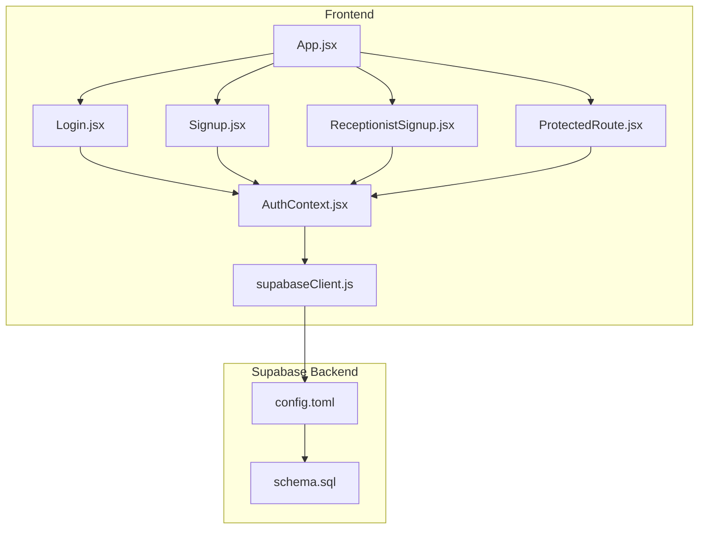
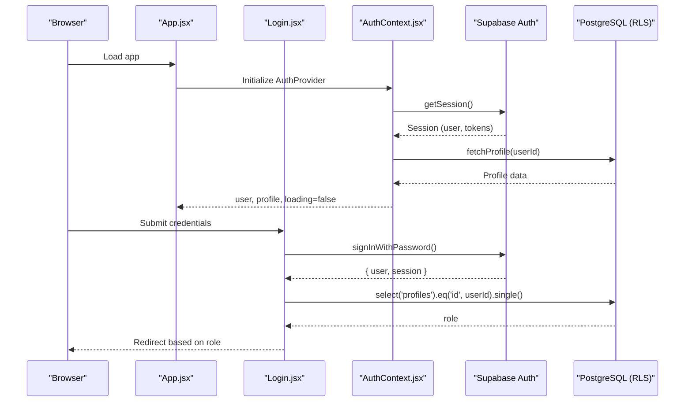
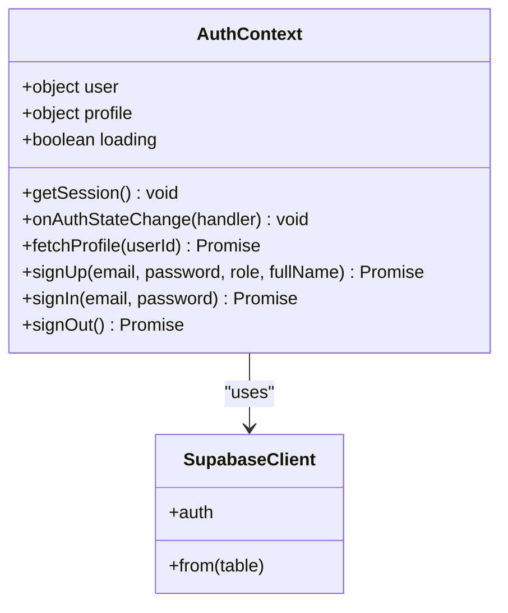
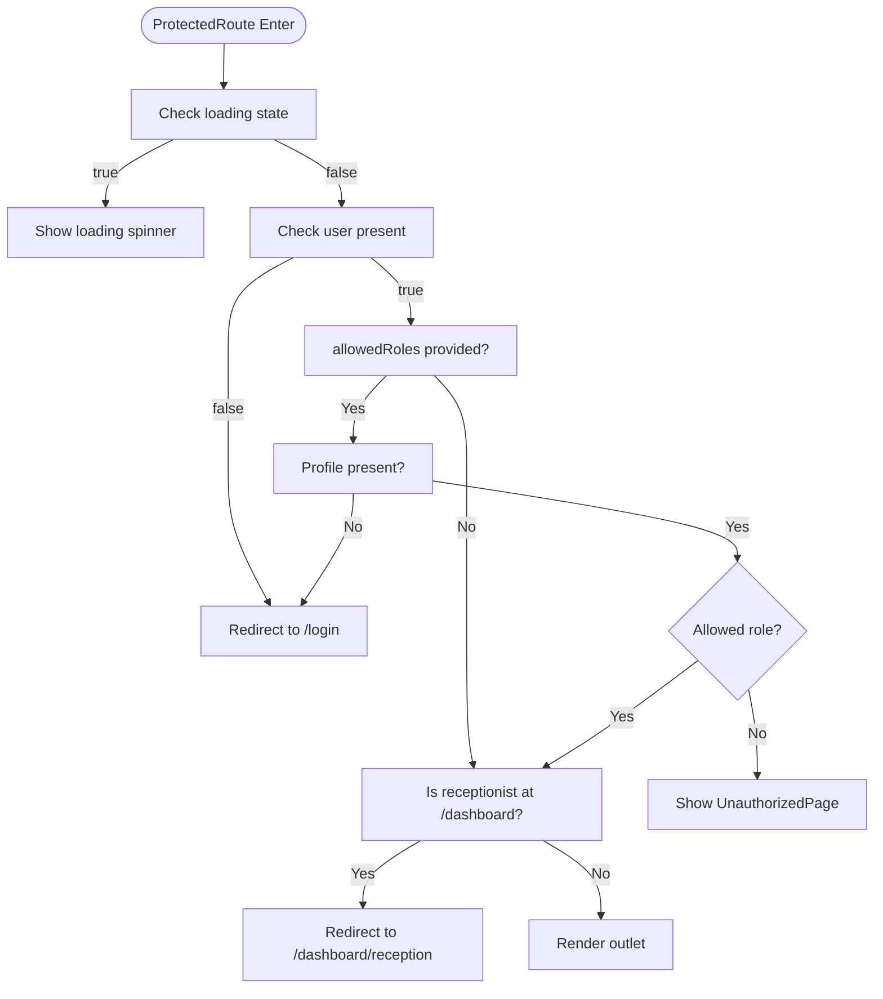
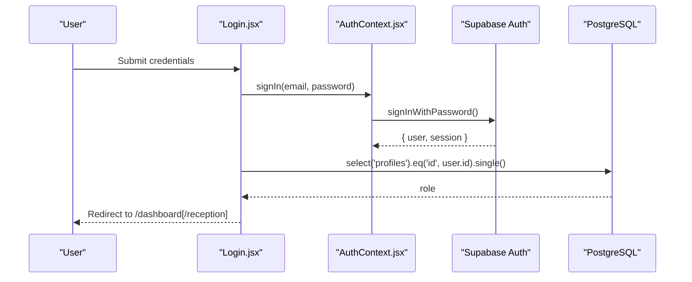
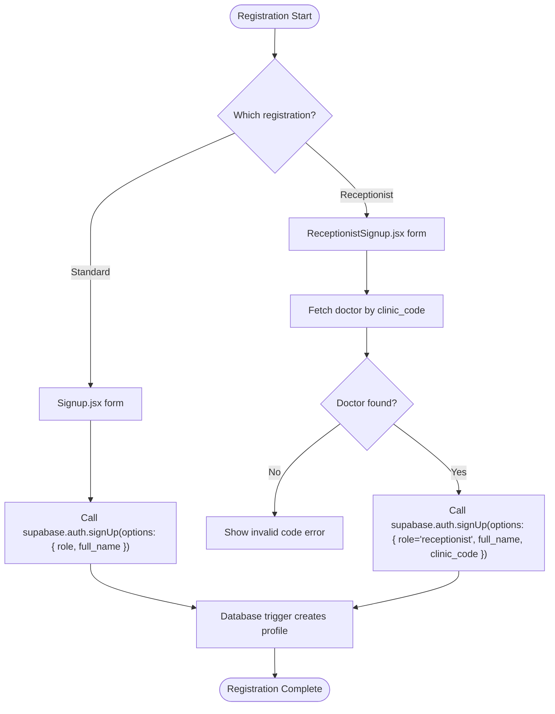
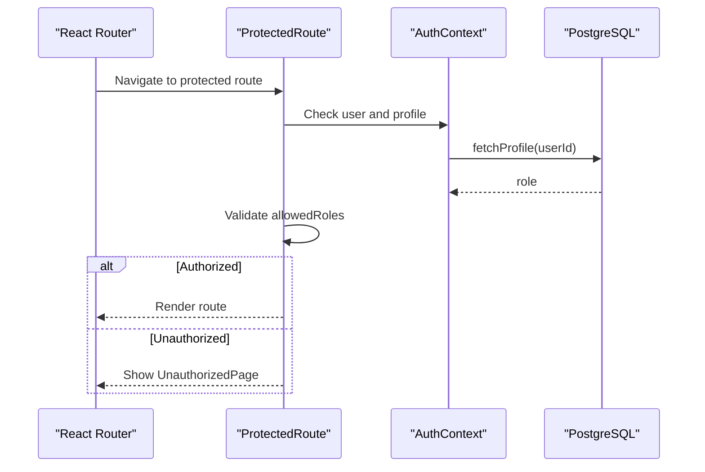
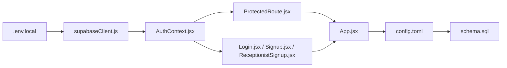

# Authentication API

<cite>
**Referenced Files in This Document**
- [AuthContext.jsx](file://frontend/src/context/AuthContext.jsx)
- [ProtectedRoute.jsx](file://frontend/src/components/ProtectedRoute.jsx)
- [Login.jsx](file://frontend/src/pages/Login.jsx)
- [Signup.jsx](file://frontend/src/pages/Signup.jsx)
- [ReceptionistSignup.jsx](file://frontend/src/pages/ReceptionistSignup.jsx)
- [supabaseClient.js](file://frontend/src/lib/supabaseClient.js)
- [App.jsx](file://frontend/src/App.jsx)
- [schema.sql](file://backend/schema.sql)
- [config.toml](file://supabase/config.toml)
- [.env.local](file://frontend/.env.local)
</cite>

## Table of Contents
1. [Introduction](#introduction)
2. [Project Structure](#project-structure)
3. [Core Components](#core-components)
4. [Architecture Overview](#architecture-overview)
5. [Detailed Component Analysis](#detailed-component-analysis)
6. [Dependency Analysis](#dependency-analysis)
7. [Performance Considerations](#performance-considerations)
8. [Troubleshooting Guide](#troubleshooting-guide)
9. [Conclusion](#conclusion)

## Introduction
This document provides comprehensive authentication API documentation for MedVita’s user authentication and authorization system built on Supabase Auth. It covers login/logout operations, session management, token handling, multi-role authentication (Doctor, Patient, Receptionist), user registration workflows, password reset procedures, account verification, JWT token structure and expiration, refresh mechanisms, role-based access control (RBAC), permission checking, route protection patterns, authentication state management, protected route implementation, user profile operations, and security considerations including CSRF protection, secure cookies, and session invalidation. It also documents integration with Supabase Row Level Security (RLS) policies and database access control.

## Project Structure
The authentication system spans the frontend React application and the Supabase backend:
- Frontend:
  - Supabase client initialization and environment configuration
  - Authentication context managing session state and profile data
  - Protected route component enforcing RBAC
  - Login, standard user signup, and receptionist-specific signup pages
  - Routing configuration with protected routes
- Backend:
  - Supabase configuration including JWT expiry, refresh token rotation, and rate limits
  - Database schema with profiles and RLS policies for access control

**Diagram sources**
- [supabaseClient.js](file://frontend/src/lib/supabaseClient.js#L1-L11)
- [AuthContext.jsx](file://frontend/src/context/AuthContext.jsx#L1-L107)
- [ProtectedRoute.jsx](file://frontend/src/components/ProtectedRoute.jsx#L1-L108)
- [Login.jsx](file://frontend/src/pages/Login.jsx#L1-L204)
- [Signup.jsx](file://frontend/src/pages/Signup.jsx#L1-L224)
- [ReceptionistSignup.jsx](file://frontend/src/pages/ReceptionistSignup.jsx#L1-L245)
- [App.jsx](file://frontend/src/App.jsx#L1-L62)
- [config.toml](file://supabase/config.toml#L146-L324)
- [schema.sql](file://backend/schema.sql#L1-L274)

**Section sources**
- [supabaseClient.js](file://frontend/src/lib/supabaseClient.js#L1-L11)
- [AuthContext.jsx](file://frontend/src/context/AuthContext.jsx#L1-L107)
- [ProtectedRoute.jsx](file://frontend/src/components/ProtectedRoute.jsx#L1-L108)
- [Login.jsx](file://frontend/src/pages/Login.jsx#L1-L204)
- [Signup.jsx](file://frontend/src/pages/Signup.jsx#L1-L224)
- [ReceptionistSignup.jsx](file://frontend/src/pages/ReceptionistSignup.jsx#L1-L245)
- [App.jsx](file://frontend/src/App.jsx#L1-L62)
- [config.toml](file://supabase/config.toml#L146-L324)
- [schema.sql](file://backend/schema.sql#L1-L274)

## Core Components
- Supabase client initialization with environment variables for URL and anon key
- Authentication context providing session state, profile data, and auth actions
- Protected route component implementing RBAC and session checks
- Login, signup, and receptionist signup pages orchestrating auth flows
- Routing configuration protecting routes and enforcing role-based navigation

Key responsibilities:
- Session lifecycle management and profile synchronization
- Role-aware routing and unauthorized access handling
- Multi-step registration flows with role-specific metadata
- Integration with Supabase Auth for JWT issuance and refresh token rotation

**Section sources**
- [supabaseClient.js](file://frontend/src/lib/supabaseClient.js#L1-L11)
- [AuthContext.jsx](file://frontend/src/context/AuthContext.jsx#L1-L107)
- [ProtectedRoute.jsx](file://frontend/src/components/ProtectedRoute.jsx#L1-L108)
- [Login.jsx](file://frontend/src/pages/Login.jsx#L1-L204)
- [Signup.jsx](file://frontend/src/pages/Signup.jsx#L1-L224)
- [ReceptionistSignup.jsx](file://frontend/src/pages/ReceptionistSignup.jsx#L1-L245)
- [App.jsx](file://frontend/src/App.jsx#L1-L62)

## Architecture Overview
The authentication architecture integrates frontend React components with Supabase Auth and database policies:
- Frontend initializes Supabase client using environment variables
- AuthContext listens for auth state changes and synchronizes profile data
- ProtectedRoute enforces RBAC and redirects unauthenticated or unauthorized users
- Pages coordinate login, signup, and redirection based on roles
- Supabase configuration controls JWT expiry, refresh token rotation, and rate limits
- Database schema defines profiles and RLS policies for access control

**Diagram sources**
- [App.jsx](file://frontend/src/App.jsx#L26-L59)
- [Login.jsx](file://frontend/src/pages/Login.jsx#L20-L75)
- [AuthContext.jsx](file://frontend/src/context/AuthContext.jsx#L14-L61)
- [schema.sql](file://backend/schema.sql#L4-L14)

## Detailed Component Analysis

### Authentication Context (AuthContext)
Responsibilities:
- Initialize and maintain session state
- Subscribe to auth state changes and synchronize profile data
- Provide sign-up, sign-in, and sign-out operations
- Expose loading state and profile data to consumers

Implementation highlights:
- Uses Supabase client to check active session and subscribe to auth state changes
- Fetches profile data from the profiles table upon session presence
- Exposes signUp, signIn, signOut, and fetchProfile functions
- Manages loading state until profile is resolved

**Diagram sources**
- [AuthContext.jsx](file://frontend/src/context/AuthContext.jsx#L9-L107)
- [supabaseClient.js](file://frontend/src/lib/supabaseClient.js#L1-L11)

**Section sources**
- [AuthContext.jsx](file://frontend/src/context/AuthContext.jsx#L1-L107)

### Protected Route Component (ProtectedRoute)
Responsibilities:
- Enforce role-based access control for routes
- Handle loading states while resolving auth and profile
- Redirect unauthenticated users to login
- Render unauthorized page for insufficient permissions
- Ensure correct role-specific dashboard routing

Behavior:
- Waits for both user session and profile resolution
- Redirects to login if user is absent
- Validates allowed roles against profile.role
- Handles default diversions for receptionist-specific dashboards

**Diagram sources**
- [ProtectedRoute.jsx](file://frontend/src/components/ProtectedRoute.jsx#L53-L106)

**Section sources**
- [ProtectedRoute.jsx](file://frontend/src/components/ProtectedRoute.jsx#L1-L108)

### Login Workflow
End-to-end login flow:
- Collects email and password
- Calls signIn with Supabase Auth
- Immediately fetches profile to determine role
- Redirects to role-specific dashboard

**Diagram sources**
- [Login.jsx](file://frontend/src/pages/Login.jsx#L20-L75)
- [AuthContext.jsx](file://frontend/src/context/AuthContext.jsx#L84-L86)
- [schema.sql](file://backend/schema.sql#L4-L14)

**Section sources**
- [Login.jsx](file://frontend/src/pages/Login.jsx#L1-L204)

### User Registration Workflows
Standard Patient/Doctor Registration:
- Collects full name, email, password, and role
- Calls Supabase Auth signUp with metadata including role and full_name
- Profile creation is handled by a database trigger

Receptionist Registration:
- Collects clinic code, full name, email, and password
- Validates clinic code by querying profiles for a doctor with matching code
- Creates receptionist user with metadata including role and clinic_code
- Automatically links receptionist to the doctor via employer_id

**Diagram sources**
- [Signup.jsx](file://frontend/src/pages/Signup.jsx#L26-L57)
- [ReceptionistSignup.jsx](file://frontend/src/pages/ReceptionistSignup.jsx#L17-L86)
- [schema.sql](file://backend/schema.sql#L239-L274)

**Section sources**
- [Signup.jsx](file://frontend/src/pages/Signup.jsx#L1-L224)
- [ReceptionistSignup.jsx](file://frontend/src/pages/ReceptionistSignup.jsx#L1-L245)
- [schema.sql](file://backend/schema.sql#L239-L274)

### JWT Token Handling and Refresh Mechanisms
Supabase configuration controls token behavior:
- JWT expiry: 3600 seconds (1 hour)
- Refresh token rotation: enabled
- Refresh token reuse interval: 10 seconds
- Rate limits for token refresh and sign-ups/verifications

Implications:
- Sessions expire after 1 hour; refresh tokens are rotated
- Clients rely on Supabase-managed refresh tokens for seamless renewal
- Rate limiting protects against abuse during authentication flows

**Section sources**
- [config.toml](file://supabase/config.toml#L153-L163)
- [config.toml](file://supabase/config.toml#L183-L190)

### Role-Based Access Control (RBAC) and Route Protection
Routing and protection:
- ProtectedRoute enforces allowedRoles and profile-based checks
- Default diversions ensure receptionists land on their specific dashboard
- Unauthorized access renders a dedicated unauthorized page

**Diagram sources**
- [App.jsx](file://frontend/src/App.jsx#L35-L53)
- [ProtectedRoute.jsx](file://frontend/src/components/ProtectedRoute.jsx#L53-L106)
- [AuthContext.jsx](file://frontend/src/context/AuthContext.jsx#L43-L61)

**Section sources**
- [App.jsx](file://frontend/src/App.jsx#L1-L62)
- [ProtectedRoute.jsx](file://frontend/src/components/ProtectedRoute.jsx#L1-L108)

### User Profile Operations
Profile retrieval and synchronization:
- AuthContext fetches profile on session presence and auth state changes
- Login page performs an immediate profile fetch to determine role-based redirection
- Profile data includes role, full_name, and other metadata

**Section sources**
- [AuthContext.jsx](file://frontend/src/context/AuthContext.jsx#L43-L61)
- [Login.jsx](file://frontend/src/pages/Login.jsx#L32-L47)

### Supabase Row Level Security (RLS) Integration
Database-level access control:
- Profiles table: select/update allowed for self; insert with check on auth.uid()
- Patients table: selective policies for doctors, receptionists, and patients
- Appointments table: comprehensive SELECT/INSERT/UPDATE policies considering doctor/patient relationships
- Prescriptions table: doctor management and patient view policies
- Storage: authenticated users can upload/view files in the configured bucket

These policies enforce fine-grained access based on auth.uid(), relationships (doctor_id, employer_id), and email matching.

**Section sources**
- [schema.sql](file://backend/schema.sql#L30-L43)
- [schema.sql](file://backend/schema.sql#L71-L115)
- [schema.sql](file://backend/schema.sql#L168-L198)
- [schema.sql](file://backend/schema.sql#L210-L224)
- [schema.sql](file://backend/schema.sql#L226-L237)

## Dependency Analysis
Frontend dependencies and integrations:
- Supabase client depends on environment variables for URL and anon key
- AuthContext depends on Supabase Auth and the profiles table
- ProtectedRoute depends on AuthContext and routing configuration
- Pages depend on AuthContext and Supabase Auth for authentication operations

**Diagram sources**
- [.env.local](file://frontend/.env.local#L1-L5)
- [supabaseClient.js](file://frontend/src/lib/supabaseClient.js#L1-L11)
- [AuthContext.jsx](file://frontend/src/context/AuthContext.jsx#L1-L107)
- [ProtectedRoute.jsx](file://frontend/src/components/ProtectedRoute.jsx#L1-L108)
- [Login.jsx](file://frontend/src/pages/Login.jsx#L1-L204)
- [Signup.jsx](file://frontend/src/pages/Signup.jsx#L1-L224)
- [ReceptionistSignup.jsx](file://frontend/src/pages/ReceptionistSignup.jsx#L1-L245)
- [App.jsx](file://frontend/src/App.jsx#L1-L62)
- [config.toml](file://supabase/config.toml#L146-L324)
- [schema.sql](file://backend/schema.sql#L1-L274)

**Section sources**
- [.env.local](file://frontend/.env.local#L1-L5)
- [supabaseClient.js](file://frontend/src/lib/supabaseClient.js#L1-L11)
- [AuthContext.jsx](file://frontend/src/context/AuthContext.jsx#L1-L107)
- [ProtectedRoute.jsx](file://frontend/src/components/ProtectedRoute.jsx#L1-L108)
- [Login.jsx](file://frontend/src/pages/Login.jsx#L1-L204)
- [Signup.jsx](file://frontend/src/pages/Signup.jsx#L1-L224)
- [ReceptionistSignup.jsx](file://frontend/src/pages/ReceptionistSignup.jsx#L1-L245)
- [App.jsx](file://frontend/src/App.jsx#L1-L62)
- [config.toml](file://supabase/config.toml#L146-L324)
- [schema.sql](file://backend/schema.sql#L1-L274)

## Performance Considerations
- Minimize redundant profile fetches by leveraging AuthContext’s synchronized state
- Use ProtectedRoute’s loading state to avoid unnecessary re-renders
- Keep JWT expiry aligned with application usage patterns; adjust Supabase config as needed
- Monitor rate limits for token refresh and sign-ups to prevent throttling

## Troubleshooting Guide
Common issues and resolutions:
- Missing Supabase URL or anon key: Verify environment variables are set correctly
- Profile not found after login: Ensure database trigger creates profiles on user creation
- Role mismatch or unauthorized access: Confirm allowedRoles match profile.role and RLS policies
- Too many attempts errors: Respect Supabase rate limits for sign-in/sign-up and token verifications
- Email confirmation required: Configure Supabase email confirmation settings if needed

**Section sources**
- [supabaseClient.js](file://frontend/src/lib/supabaseClient.js#L6-L8)
- [schema.sql](file://backend/schema.sql#L239-L274)
- [ProtectedRoute.jsx](file://frontend/src/components/ProtectedRoute.jsx#L82-L93)
- [config.toml](file://supabase/config.toml#L176-L190)

## Conclusion
MedVita’s authentication system leverages Supabase Auth for secure session management, JWT handling, and refresh token rotation, combined with a robust frontend context and protected routes for role-based access control. The backend schema and RLS policies enforce fine-grained access control at the database level. Together, these components provide a secure, scalable, and user-friendly authentication and authorization framework tailored to the needs of Doctors, Patients, and Receptionists.