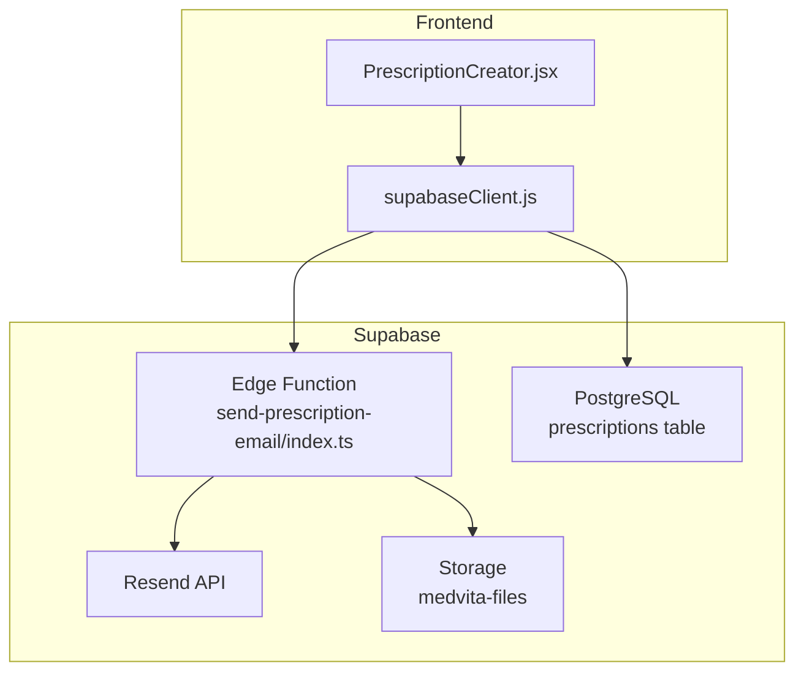
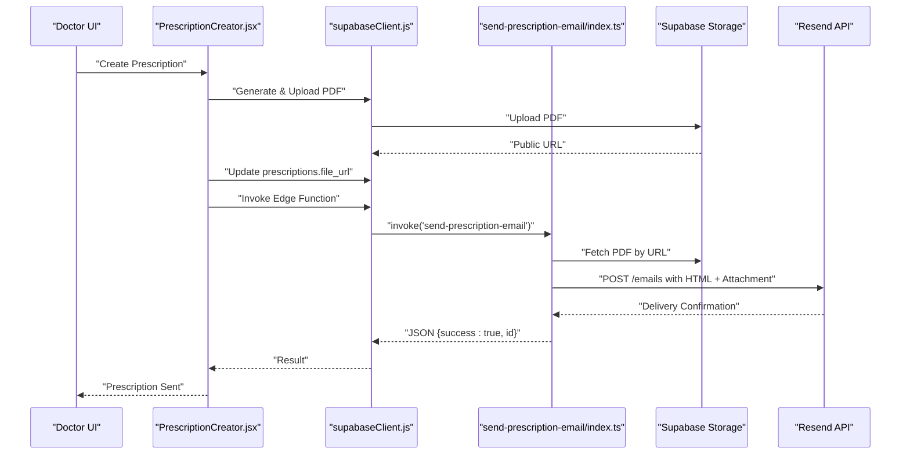
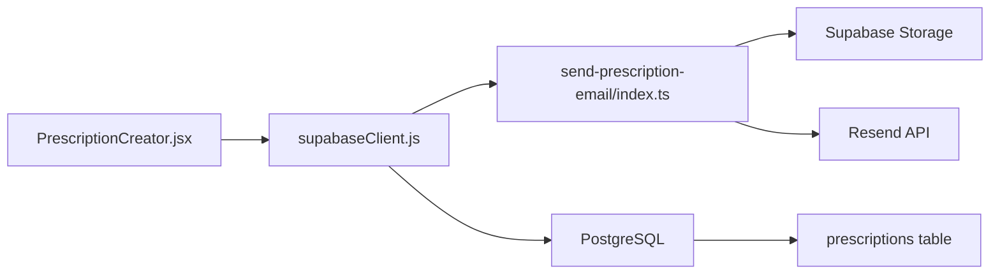

# Edge Functions API

<cite>
**Referenced Files in This Document**
- [index.ts](file://supabase/functions/send-prescription-email/index.ts)
- [config.toml](file://supabase/config.toml)
- [PrescriptionCreator.jsx](file://frontend/src/components/PrescriptionCreator.jsx)
- [supabaseClient.js](file://frontend/src/lib/supabaseClient.js)
- [schema.sql](file://backend/schema.sql)
- [README.md](file://README.md)
- [WIKI.md](file://WIKI.md)
</cite>

## Table of Contents
1. [Introduction](#introduction)
2. [Project Structure](#project-structure)
3. [Core Components](#core-components)
4. [Architecture Overview](#architecture-overview)
5. [Detailed Component Analysis](#detailed-component-analysis)
6. [Dependency Analysis](#dependency-analysis)
7. [Performance Considerations](#performance-considerations)
8. [Troubleshooting Guide](#troubleshooting-guide)
9. [Conclusion](#conclusion)
10. [Appendices](#appendices)

## Introduction
This document provides comprehensive API documentation for the Supabase edge functions in MedVita, with a focus on the send-prescription-email function. It covers function parameters, input validation, response formats, serverless architecture, deployment, execution environment, email workflow, triggers, integration patterns, error handling, security, and performance considerations.

## Project Structure
The MedVita project integrates a React frontend with Supabase backend services, including edge functions for asynchronous tasks like sending prescription emails. The edge function resides under the Supabase functions directory and is invoked by the frontend when a doctor creates a prescription.

**Diagram sources**
- [PrescriptionCreator.jsx](file://frontend/src/components/PrescriptionCreator.jsx#L154-L162)
- [index.ts](file://supabase/functions/send-prescription-email/index.ts#L152-L170)
- [schema.sql](file://backend/schema.sql#L200-L208)

**Section sources**
- [README.md](file://README.md#L1-L89)
- [WIKI.md](file://WIKI.md#L108-L169)

## Core Components
- Edge Function: send-prescription-email
  - Purpose: Fetch a PDF from storage, convert to Base64, and send via Resend API with an HTML email template.
  - Endpoint: Invoked via Supabase Edge Functions runtime.
  - Provider: Resend API.
- Frontend Integration: PrescriptionCreator component invokes the edge function after generating and uploading a PDF.
- Backend Data: prescriptions table stores the file_url for each prescription.

**Section sources**
- [index.ts](file://supabase/functions/send-prescription-email/index.ts#L1-L193)
- [PrescriptionCreator.jsx](file://frontend/src/components/PrescriptionCreator.jsx#L154-L168)
- [schema.sql](file://backend/schema.sql#L200-L208)

## Architecture Overview
The edge function follows a serverless execution model:
- The frontend generates a PDF, uploads it to Supabase Storage, updates the prescriptions table with the public URL, and invokes the edge function.
- The edge function validates configuration, fetches the PDF, builds an HTML email, attaches the PDF, and sends it via Resend.

**Diagram sources**
- [PrescriptionCreator.jsx](file://frontend/src/components/PrescriptionCreator.jsx#L142-L168)
- [index.ts](file://supabase/functions/send-prescription-email/index.ts#L48-L184)

## Detailed Component Analysis

### Edge Function: send-prescription-email
- Function signature: HTTP handler accepting JSON body.
- CORS: Enabled for development with wildcard origin and required headers.
- Environment: Uses Deno runtime with edge runtime configuration.
- Secret: Requires RESEND_API_KEY set in Supabase secrets.

Input Parameters (JSON body):
- patientName: string (fallback default if missing)
- patientEmail: string (required)
- pdfUrl: string (required)
- doctorName: string (fallback default if missing)
- clinicName: string (fallback default if missing)

Input Validation:
- Validates presence of RESEND_API_KEY.
- Attempts to fetch PDF from pdfUrl; logs failure if fetch fails.
- Uses safe defaults for names if not provided.

Processing Logic:
- Fetches PDF from storage and converts to Base64.
- Builds an HTML email with embedded styling and health tips.
- Sends via Resend API with attachments when available.
- Returns structured JSON response.

Response Formats:
- On success: { success: true, id: string }
- On Resend error: { error: string }
- On configuration error: { error: string }
- On unexpected crash: { error: string }

Error Handling:
- Checks for missing RESEND_API_KEY and returns error response.
- Catches exceptions and returns error response.
- Logs PDF fetch failures.

Security Considerations:
- CORS headers configured for development.
- Uses Supabase secrets for API key.
- No explicit input sanitization in function; rely on Resend API and Supabase Storage.

Execution Environment:
- Deno runtime version configured.
- Edge runtime policy supports hot reload during development.

**Section sources**
- [index.ts](file://supabase/functions/send-prescription-email/index.ts#L1-L193)
- [config.toml](file://supabase/config.toml#L353-L365)

### Frontend Integration: PrescriptionCreator
- Generates a PDF using html2canvas and jsPDF.
- Uploads to Supabase Storage bucket medvita-files.
- Updates prescriptions table with file_url.
- Invokes edge function with patientName, patientEmail, pdfUrl, doctorName, clinicName.

Trigger and Timing:
- Triggered immediately after successful PDF upload and database update.
- Asynchronous operation; UI shows progress states.

Result Processing:
- Handles errors from edge function invocation and displays user-friendly messages.
- Logs success and closes modal after completion.

**Section sources**
- [PrescriptionCreator.jsx](file://frontend/src/components/PrescriptionCreator.jsx#L53-L98)
- [PrescriptionCreator.jsx](file://frontend/src/components/PrescriptionCreator.jsx#L100-L188)

### Backend Data Model: prescriptions
- Stores patient_id, doctor_id, prescription_text, and file_url.
- RLS policies restrict access to authorized users.
- Used to persist the PDF URL after upload.

**Section sources**
- [schema.sql](file://backend/schema.sql#L200-L224)

### Email Workflow Details
- PDF Retrieval: The function fetches the PDF from the provided URL and converts to Base64 for attachment.
- Template Rendering: HTML email is constructed with embedded CSS and dynamic placeholders.
- Delivery Confirmation: Returns the Resend message id on success.
- Health Tips: Includes a curated list of tips rendered in the email.

**Section sources**
- [index.ts](file://supabase/functions/send-prescription-email/index.ts#L48-L149)
- [index.ts](file://supabase/functions/send-prescription-email/index.ts#L151-L184)

### API Definition

- Function Name: send-prescription-email
- Invocation Method: Supabase Edge Functions invoke
- Request Body Fields:
  - patientName: string (optional)
  - patientEmail: string (required)
  - pdfUrl: string (required)
  - doctorName: string (optional)
  - clinicName: string (optional)
- Response Fields:
  - success: boolean (present on success)
  - id: string (Resend message id on success)
  - error: string (present on error)

Example Invocation (paths only):
- Frontend invocation path: [PrescriptionCreator.jsx](file://frontend/src/components/PrescriptionCreator.jsx#L154-L162)
- Edge function implementation path: [index.ts](file://supabase/functions/send-prescription-email/index.ts#L25-L193)

**Section sources**
- [WIKI.md](file://WIKI.md#L379-L403)
- [PrescriptionCreator.jsx](file://frontend/src/components/PrescriptionCreator.jsx#L154-L168)
- [index.ts](file://supabase/functions/send-prescription-email/index.ts#L30-L193)

## Dependency Analysis
- Frontend depends on Supabase client for invoking edge functions and managing storage.
- Edge function depends on:
  - Supabase Storage for PDF retrieval
  - Resend API for email delivery
  - Supabase secrets for API key
- Backend database persists the PDF URL for later retrieval.

**Diagram sources**
- [PrescriptionCreator.jsx](file://frontend/src/components/PrescriptionCreator.jsx#L154-L168)
- [index.ts](file://supabase/functions/send-prescription-email/index.ts#L152-L170)
- [schema.sql](file://backend/schema.sql#L200-L208)

**Section sources**
- [PrescriptionCreator.jsx](file://frontend/src/components/PrescriptionCreator.jsx#L154-L168)
- [index.ts](file://supabase/functions/send-prescription-email/index.ts#L152-L170)
- [schema.sql](file://backend/schema.sql#L200-L208)

## Performance Considerations
- PDF Size: The frontend uses compression and scales for canvas generation to keep attachment sizes reasonable.
- Network Calls: Minimize redundant fetches; the edge function attempts to fetch the PDF once.
- Execution Time: Edge functions have cold start and execution limits; keep payloads small and avoid blocking operations.
- Storage: Use public URLs from Supabase Storage to reduce latency.

[No sources needed since this section provides general guidance]

## Troubleshooting Guide
Common Issues and Remedies:
- Missing RESEND_API_KEY:
  - Symptom: Function returns configuration error.
  - Resolution: Set secret via Supabase CLI or dashboard.
- PDF Fetch Failure:
  - Symptom: PDF attachment not included; function logs error.
  - Resolution: Verify storage URL and permissions.
- Edge Function Invocation Error:
  - Symptom: Frontend receives error from invoke.
  - Resolution: Check Supabase Edge Functions logs and function response.
- Rate Limiting:
  - Symptom: Frequent failures or throttling.
  - Resolution: Implement client-side backoff and respect provider limits.

**Section sources**
- [index.ts](file://supabase/functions/send-prescription-email/index.ts#L41-L46)
- [index.ts](file://supabase/functions/send-prescription-email/index.ts#L56-L58)
- [PrescriptionCreator.jsx](file://frontend/src/components/PrescriptionCreator.jsx#L164-L165)

## Conclusion
The send-prescription-email edge function provides a robust, serverless mechanism to deliver digitally generated prescriptions to patients. By integrating PDF generation, secure storage, and reliable email delivery, it enhances the clinical workflow while maintaining security and performance best practices.

[No sources needed since this section summarizes without analyzing specific files]

## Appendices

### Deployment and Environment
- Supabase Edge Runtime: Deno runtime configured with hot reload policy.
- Secrets: Set RESEND_API_KEY via Supabase secrets.
- Storage: Ensure medvita-files bucket exists and is accessible.

**Section sources**
- [config.toml](file://supabase/config.toml#L353-L365)
- [WIKI.md](file://WIKI.md#L421-L427)

### Security and Best Practices
- Use Supabase secrets for API keys.
- Validate inputs on the client and handle errors gracefully.
- Monitor edge function logs for failures.
- Apply rate limiting and retries on the client side.

**Section sources**
- [index.ts](file://supabase/functions/send-prescription-email/index.ts#L31-L46)
- [WIKI.md](file://WIKI.md#L558-L565)