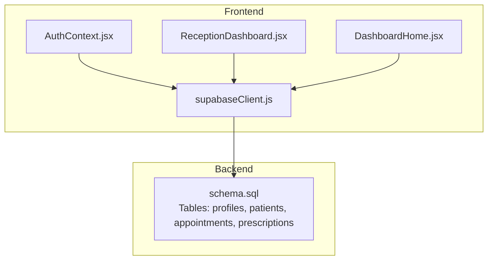
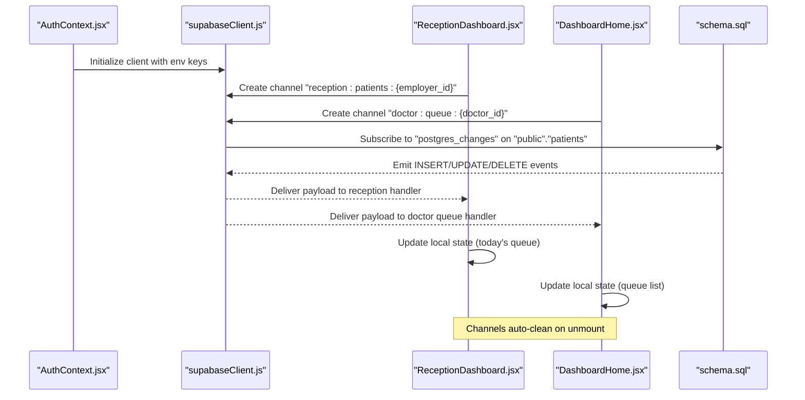
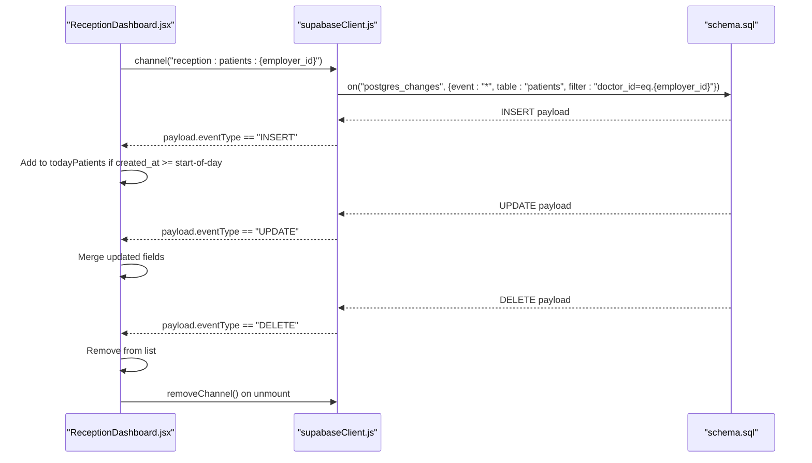
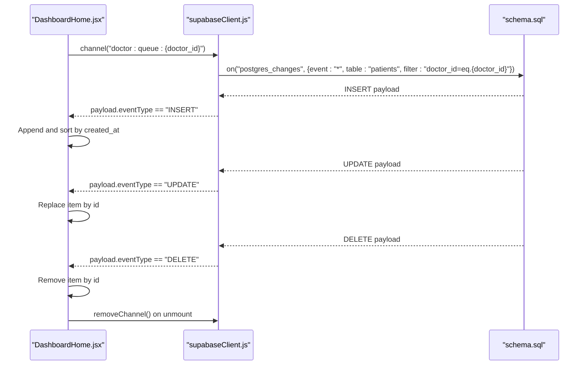
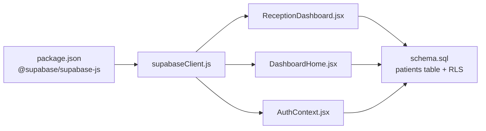

# Realtime API

<cite>
**Referenced Files in This Document**
- [supabaseClient.js](file://frontend/src/lib/supabaseClient.js)
- [ReceptionDashboard.jsx](file://frontend/src/pages/ReceptionDashboard.jsx)
- [DashboardHome.jsx](file://frontend/src/pages/DashboardHome.jsx)
- [AuthContext.jsx](file://frontend/src/context/AuthContext.jsx)
- [schema.sql](file://backend/schema.sql)
- [package.json](file://frontend/package.json)
</cite>

## Table of Contents
1. [Introduction](#introduction)
2. [Project Structure](#project-structure)
3. [Core Components](#core-components)
4. [Architecture Overview](#architecture-overview)
5. [Detailed Component Analysis](#detailed-component-analysis)
6. [Dependency Analysis](#dependency-analysis)
7. [Performance Considerations](#performance-considerations)
8. [Troubleshooting Guide](#troubleshooting-guide)
9. [Conclusion](#conclusion)

## Introduction
This document provides comprehensive Realtime API documentation for MedVita’s live data synchronization. It explains Supabase Realtime channels, subscription management, and event handling patterns across the application. It covers the live queue management system, real-time patient updates, and cross-module synchronization. You will learn how channels are created, how subscriptions are managed, and how events are filtered and processed. Event types covered include INSERT, UPDATE, and DELETE operations and their payloads. Practical examples demonstrate realtime subscriptions for dashboard components, queue management, and notification systems. Connection management, reconnection strategies, error recovery, performance considerations, bandwidth optimization, scalability patterns, and integration with React components using hooks and state management are also documented.

## Project Structure
MedVita’s frontend integrates Supabase Realtime via a shared client and multiple pages that subscribe to database changes. The backend schema defines the tables and Row Level Security (RLS) policies that govern access to data. Authentication state is managed centrally and drives Realtime subscriptions.

**Diagram sources**
- [supabaseClient.js](file://frontend/src/lib/supabaseClient.js#L1-L11)
- [ReceptionDashboard.jsx](file://frontend/src/pages/ReceptionDashboard.jsx#L1-L113)
- [DashboardHome.jsx](file://frontend/src/pages/DashboardHome.jsx#L1-L76)
- [AuthContext.jsx](file://frontend/src/context/AuthContext.jsx#L1-L41)
- [schema.sql](file://backend/schema.sql#L45-L111)

**Section sources**
- [supabaseClient.js](file://frontend/src/lib/supabaseClient.js#L1-L11)
- [ReceptionDashboard.jsx](file://frontend/src/pages/ReceptionDashboard.jsx#L1-L113)
- [DashboardHome.jsx](file://frontend/src/pages/DashboardHome.jsx#L1-L76)
- [AuthContext.jsx](file://frontend/src/context/AuthContext.jsx#L1-L41)
- [schema.sql](file://backend/schema.sql#L45-L111)

## Core Components
- Supabase client initialization and environment configuration
- Realtime channels for live queue updates
- Subscription lifecycle management and cleanup
- Event filtering and payload handling
- Cross-module synchronization via shared channels
- Authentication-driven subscription gating

**Section sources**
- [supabaseClient.js](file://frontend/src/lib/supabaseClient.js#L1-L11)
- [ReceptionDashboard.jsx](file://frontend/src/pages/ReceptionDashboard.jsx#L76-L113)
- [DashboardHome.jsx](file://frontend/src/pages/DashboardHome.jsx#L45-L76)
- [AuthContext.jsx](file://frontend/src/context/AuthContext.jsx#L14-L41)

## Architecture Overview
The Realtime architecture centers on Supabase’s Postgres change feed. Frontend components create channels scoped to roles and entities (e.g., reception queue per clinic, doctor queue). Subscriptions listen for INSERT, UPDATE, DELETE events on the patients table and apply optimistic updates to local state. Authentication state determines which channels to open and what data to display.

**Diagram sources**
- [AuthContext.jsx](file://frontend/src/context/AuthContext.jsx#L14-L41)
- [supabaseClient.js](file://frontend/src/lib/supabaseClient.js#L1-L11)
- [ReceptionDashboard.jsx](file://frontend/src/pages/ReceptionDashboard.jsx#L76-L113)
- [DashboardHome.jsx](file://frontend/src/pages/DashboardHome.jsx#L45-L76)
- [schema.sql](file://backend/schema.sql#L45-L111)

## Detailed Component Analysis

### Supabase Client Initialization
- Creates a Supabase client using Vite environment variables for URL and anon key.
- Validates presence of required keys and logs warnings if missing.

**Section sources**
- [supabaseClient.js](file://frontend/src/lib/supabaseClient.js#L1-L11)

### Reception Dashboard Realtime Channel
- Channel name pattern: reception:patients:{employer_id}
- Filters events to the current receptionist’s employer (clinic)
- Handles INSERT (add today’s patients), UPDATE (live refresh), DELETE (remove)
- Subscribes on mount and removes channel on unmount
- Logs connection status and falls back to manual refresh on channel errors

**Diagram sources**
- [ReceptionDashboard.jsx](file://frontend/src/pages/ReceptionDashboard.jsx#L76-L113)
- [schema.sql](file://backend/schema.sql#L45-L111)

**Section sources**
- [ReceptionDashboard.jsx](file://frontend/src/pages/ReceptionDashboard.jsx#L76-L113)

### Doctor Dashboard Realtime Channel
- Channel name pattern: doctor:queue:{doctor_id}
- Filters events to the logged-in doctor’s patients
- Handles INSERT (sort by created_at), UPDATE (replace), DELETE (filter)
- Uses a mutable ref to ensure callbacks always see the latest setter
- Subscribes on mount and removes channel on unmount

**Diagram sources**
- [DashboardHome.jsx](file://frontend/src/pages/DashboardHome.jsx#L45-L76)
- [schema.sql](file://backend/schema.sql#L45-L111)

**Section sources**
- [DashboardHome.jsx](file://frontend/src/pages/DashboardHome.jsx#L45-L76)

### Authentication-Driven Subscription Gating
- Auth provider initializes session and profile
- Subscriptions are created only when profile.employer_id or doctorId is available
- Auth state changes unsubscribe previous subscriptions and reset state

**Section sources**
- [AuthContext.jsx](file://frontend/src/context/AuthContext.jsx#L14-L41)
- [ReceptionDashboard.jsx](file://frontend/src/pages/ReceptionDashboard.jsx#L72-L113)
- [DashboardHome.jsx](file://frontend/src/pages/DashboardHome.jsx#L41-L76)

### Event Types and Payloads
- Event types: INSERT, UPDATE, DELETE
- Payload shape includes eventType and table-specific fields (e.g., new, old)
- Reception dashboard filters by created_at to show only today’s patients
- Doctor dashboard sorts incoming INSERTs by created_at to maintain queue order

**Section sources**
- [ReceptionDashboard.jsx](file://frontend/src/pages/ReceptionDashboard.jsx#L86-L102)
- [DashboardHome.jsx](file://frontend/src/pages/DashboardHome.jsx#L55-L67)

### Practical Examples
- Reception Dashboard: Realtime queue for walk-in patients
- Doctor Dashboard: Live queue list with seen/waiting status
- Notification systems: Toast messages for success/error feedback

**Section sources**
- [ReceptionDashboard.jsx](file://frontend/src/pages/ReceptionDashboard.jsx#L13-L21)
- [ReceptionDashboard.jsx](file://frontend/src/pages/ReceptionDashboard.jsx#L149-L189)
- [DashboardHome.jsx](file://frontend/src/pages/DashboardHome.jsx#L78-L88)

## Dependency Analysis
- Frontend depends on @supabase/supabase-js for Realtime and Postgres operations
- Realtime channels depend on backend tables and RLS policies
- Authentication state drives which channels are opened and what data is visible

**Diagram sources**
- [package.json](file://frontend/package.json#L13-L32)
- [supabaseClient.js](file://frontend/src/lib/supabaseClient.js#L1-L11)
- [ReceptionDashboard.jsx](file://frontend/src/pages/ReceptionDashboard.jsx#L1-L113)
- [DashboardHome.jsx](file://frontend/src/pages/DashboardHome.jsx#L1-L76)
- [AuthContext.jsx](file://frontend/src/context/AuthContext.jsx#L1-L41)
- [schema.sql](file://backend/schema.sql#L45-L111)

**Section sources**
- [package.json](file://frontend/package.json#L13-L32)
- [supabaseClient.js](file://frontend/src/lib/supabaseClient.js#L1-L11)
- [schema.sql](file://backend/schema.sql#L45-L111)

## Performance Considerations
- Filter early: Use filter expressions on channels to reduce event volume (e.g., doctor_id equality)
- Scope channels narrowly: Use per-user/per-clinic channel names to minimize cross-user noise
- Optimize UI updates: Apply minimal diffs (merge/update/delete) and avoid unnecessary re-renders
- Debounce or batch: For high-frequency updates, consider debouncing UI reactions
- Bandwidth: Prefer targeted filters and limit selected columns to only what is needed
- Scalability: Leverage channel scoping by role and entity to scale horizontally

[No sources needed since this section provides general guidance]

## Troubleshooting Guide
- Missing environment variables: The client warns if Supabase URL or anon key are missing
- Channel errors: Reception dashboard logs a warning and falls back to manual refresh
- Permission issues: RLS violations during inserts can surface as permission errors; ensure profile.employer_id matches the target doctor_id
- Cleanup: Always remove channels on component unmount to prevent memory leaks

**Section sources**
- [supabaseClient.js](file://frontend/src/lib/supabaseClient.js#L6-L8)
- [ReceptionDashboard.jsx](file://frontend/src/pages/ReceptionDashboard.jsx#L104-L110)
- [ReceptionDashboard.jsx](file://frontend/src/pages/ReceptionDashboard.jsx#L172-L178)

## Conclusion
MedVita’s Realtime API leverages Supabase channels to synchronize live queue updates across the reception and doctor dashboards. By scoping channels to roles and entities, filtering events at the source, and managing subscription lifecycles carefully, the system delivers responsive, scalable, and secure real-time experiences. Authentication state ensures proper access control, while robust error handling and cleanup practices improve reliability.