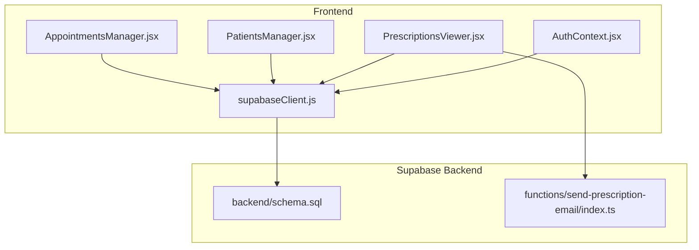
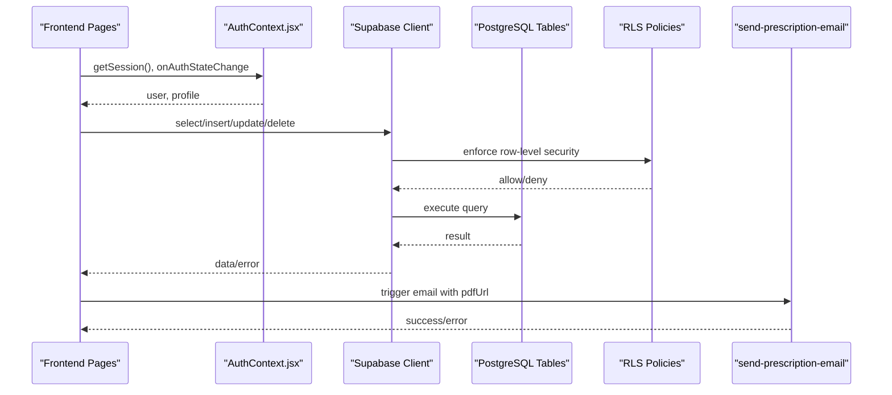
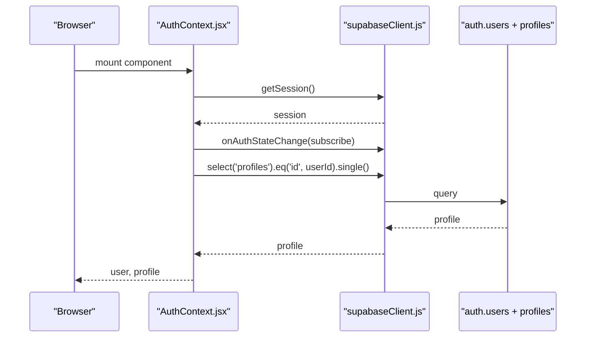
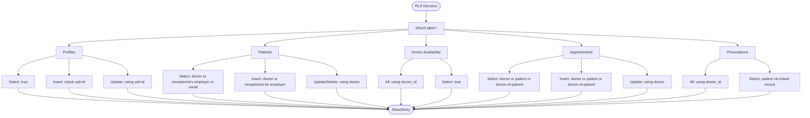
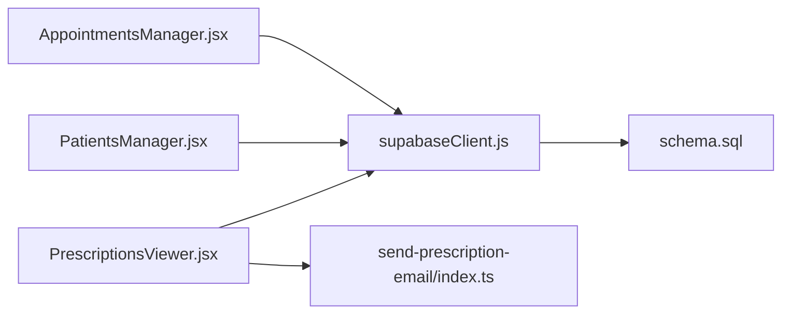
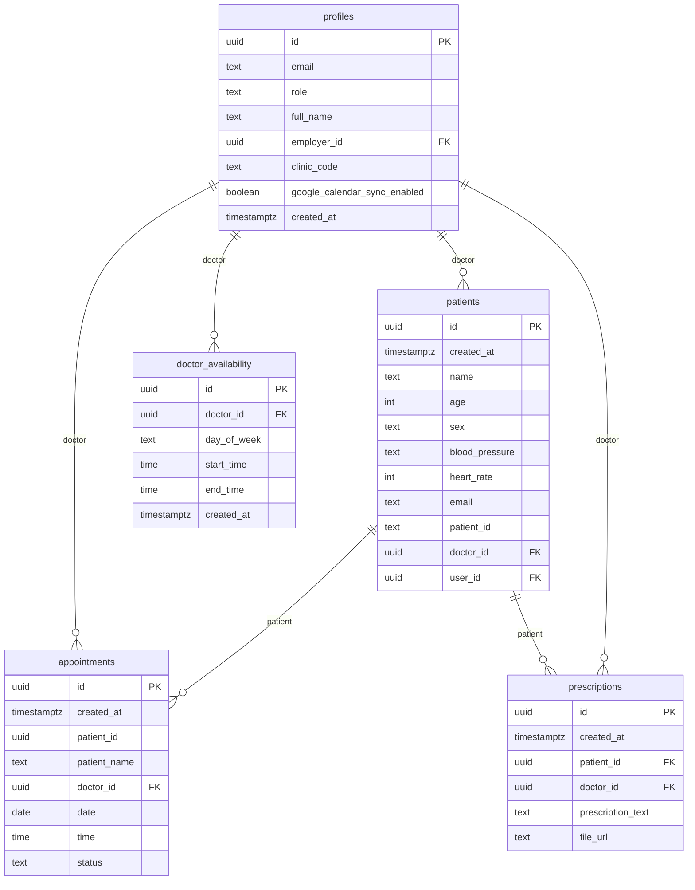

# Supabase REST API

<cite>
**Referenced Files in This Document**
- [schema.sql](file://backend/schema.sql)
- [supabaseClient.js](file://frontend/src/lib/supabaseClient.js)
- [AuthContext.jsx](file://frontend/src/context/AuthContext.jsx)
- [AppointmentsManager.jsx](file://frontend/src/pages/AppointmentsManager.jsx)
- [PatientsManager.jsx](file://frontend/src/pages/PatientsManager.jsx)
- [PrescriptionsViewer.jsx](file://frontend/src/pages/PrescriptionsViewer.jsx)
- [send-prescription-email/index.ts](file://supabase/functions/send-prescription-email/index.ts)
- [DEBUG_DISABLE_RLS.sql](file://_trash/DEBUG_DISABLE_RLS.sql)
- [FIX_APPOINTMENTS_FK.sql](file://_trash/FIX_APPOINTMENTS_FK.sql)
- [FIX_DOCTOR_VISIBILITY.sql](file://_trash/FIX_DOCTOR_VISIBILITY.sql)
</cite>

## Table of Contents
1. [Introduction](#introduction)
2. [Project Structure](#project-structure)
3. [Core Components](#core-components)
4. [Architecture Overview](#architecture-overview)
5. [Detailed Component Analysis](#detailed-component-analysis)
6. [Dependency Analysis](#dependency-analysis)
7. [Performance Considerations](#performance-considerations)
8. [Troubleshooting Guide](#troubleshooting-guide)
9. [Conclusion](#conclusion)
10. [Appendices](#appendices)

## Introduction
This document provides comprehensive REST API documentation for Supabase-backed database operations in MedVita. It covers CRUD endpoints for core entities (profiles, patients, appointments, prescriptions, doctor_availability), table schemas, query patterns, authentication and session management, request/response considerations, validation rules, error handling, pagination and filtering, and row-level security (RLS) policies.

## Project Structure
The Supabase schema defines tables and policies. Frontend pages use the Supabase client to perform queries. A serverless function handles sending prescription emails.

**Diagram sources**
- [schema.sql](file://backend/schema.sql#L1-L274)
- [supabaseClient.js](file://frontend/src/lib/supabaseClient.js#L1-L11)
- [AuthContext.jsx](file://frontend/src/context/AuthContext.jsx#L1-L108)
- [AppointmentsManager.jsx](file://frontend/src/pages/AppointmentsManager.jsx#L1-L577)
- [PatientsManager.jsx](file://frontend/src/pages/PatientsManager.jsx#L1-L667)
- [PrescriptionsViewer.jsx](file://frontend/src/pages/PrescriptionsViewer.jsx#L1-L273)
- [send-prescription-email/index.ts](file://supabase/functions/send-prescription-email/index.ts#L1-L193)

**Section sources**
- [schema.sql](file://backend/schema.sql#L1-L274)
- [supabaseClient.js](file://frontend/src/lib/supabaseClient.js#L1-L11)
- [AuthContext.jsx](file://frontend/src/context/AuthContext.jsx#L1-L108)
- [AppointmentsManager.jsx](file://frontend/src/pages/AppointmentsManager.jsx#L1-L577)
- [PatientsManager.jsx](file://frontend/src/pages/PatientsManager.jsx#L1-L667)
- [PrescriptionsViewer.jsx](file://frontend/src/pages/PrescriptionsViewer.jsx#L1-L273)
- [send-prescription-email/index.ts](file://supabase/functions/send-prescription-email/index.ts#L1-L193)

## Core Components
- Profiles: Extends Supabase Auth users; stores roles, clinic codes, and links for receptionists.
- Patients: Doctor-linked patient records with vitals and unique IDs.
- Doctor Availability: Weekly schedule entries per doctor.
- Appointments: Scheduling with patient and doctor linkage and status.
- Prescriptions: Doctor-authored documents linked to patients, optionally with file_url.
- Storage: Public bucket for file uploads with authenticated access policies.

**Section sources**
- [schema.sql](file://backend/schema.sql#L4-L274)

## Architecture Overview
The frontend authenticates via Supabase Auth and performs table queries. RLS policies restrict access based on user roles and relationships. A serverless function sends email notifications with attached PDFs.

**Diagram sources**
- [AuthContext.jsx](file://frontend/src/context/AuthContext.jsx#L14-L41)
- [supabaseClient.js](file://frontend/src/lib/supabaseClient.js#L1-L11)
- [schema.sql](file://backend/schema.sql#L30-L274)
- [send-prescription-email/index.ts](file://supabase/functions/send-prescription-email/index.ts#L25-L193)

## Detailed Component Analysis

### Profiles Table
- Purpose: Extend auth.users with role, clinic code, employer relationship, and sync flag.
- Key columns: id (PK, references auth.users), role, clinic_code, employer_id, google_calendar_sync_enabled, created_at.
- RLS:
  - Select: public.
  - Insert: with_check(auth.uid() = id).
  - Update: using(auth.uid() = id).

Common operations:
- GET /profiles?id=eq.{id}: fetch profile by user id.
- POST /profiles: insert profile on sign-up (handled by trigger).
- PATCH /profiles?id=eq.{id}: update profile.

Validation:
- role must be one of doctor, patient, receptionist.
- clinic_code is unique for doctors.

**Section sources**
- [schema.sql](file://backend/schema.sql#L4-L44)
- [AuthContext.jsx](file://frontend/src/context/AuthContext.jsx#L43-L61)

### Patients Table
- Purpose: Store doctor-linked patient records with vitals and unique identifiers.
- Key columns: id (PK), name, age, sex, blood_pressure, heart_rate, email, patient_id (unique), doctor_id, user_id.
- RLS:
  - Select: doctor’s patients, receptionist’s employer’s patients, or patient by email.
  - Insert: with_check(doctor or receptionist for employer).
  - Update/Delete: using(doctor).

Common operations:
- GET /patients?doctor_id=eq.{doctorId}&order=created_at.desc: list doctor’s patients.
- GET /patients?or=(email.eq.{userEmail},user_id.eq.{userId}): patient self-view.
- POST /patients: create patient (doctor or receptionist).
- PATCH /patients?id=eq.{id}: update patient.
- DELETE /patients?id=eq.{id}: remove patient.

Validation:
- doctor_id is required and must match the authenticated user for insert/update.
- patient_id is generated automatically.

**Section sources**
- [schema.sql](file://backend/schema.sql#L45-L115)
- [PatientsManager.jsx](file://frontend/src/pages/PatientsManager.jsx#L56-L121)

### Doctor Availability Table
- Purpose: Weekly availability schedule per doctor.
- Key columns: id (PK), doctor_id, day_of_week, start_time, end_time, created_at.
- RLS:
  - All: using(doctor_id = auth.uid()).
  - Select: true (public viewing).

Common operations:
- GET /doctor_availability?doctor_id=eq.{doctorId}: view schedule.
- POST /doctor_availability: create schedule.
- PATCH /doctor_availability?id=eq.{id}: update schedule.
- DELETE /doctor_availability?id=eq.{id}: remove schedule.

Validation:
- day_of_week and time range must be sensible.

**Section sources**
- [schema.sql](file://backend/schema.sql#L117-L136)

### Appointments Table
- Purpose: Schedule management with patient and doctor linkage and status.
- Key columns: id (PK), patient_id, patient_name, doctor_id, date, time, status.
- RLS:
  - Select: doctor, patient, or doctor of the patient.
  - Insert: doctor or patient or doctor of the patient.
  - Update: using(doctor_id = auth.uid()).

Notes:
- patient_id can reference either auth.users.id (registered user) or patients.id (doctor-managed).
- Foreign key constraints are intentionally flexible to support both cases.

Common operations:
- GET /appointments?or=(doctor_id.eq.{uid},patient_id.eq.{uid},patient_id.in.(...)): fetch relevant appointments.
- POST /appointments: create appointment (doctor or patient).
- PATCH /appointments?id=eq.{id}: update status (doctor only).

Validation:
- status must be one of scheduled, completed, cancelled.

**Section sources**
- [schema.sql](file://backend/schema.sql#L137-L200)
- [FIX_APPOINTMENTS_FK.sql](file://_trash/FIX_APPOINTMENTS_FK.sql#L1-L22)
- [AppointmentsManager.jsx](file://frontend/src/pages/AppointmentsManager.jsx#L67-L118)

### Prescriptions Table
- Purpose: Doctor-authored prescriptions linked to patients, optional file_url.
- Key columns: id (PK), patient_id, doctor_id, prescription_text, file_url.
- RLS:
  - All: using(doctor_id = auth.uid()).
  - Select: patient can view if linked via patient record.

Common operations:
- GET /prescriptions?doctor_id=eq.{doctorId}&order=created_at.desc: doctor view.
- GET /prescriptions?patient_id=eq.{patientId}&order=created_at.desc: patient view.
- POST /prescriptions: create prescription (doctor).
- PATCH /prescriptions?id=eq.{id}: update (doctor).
- DELETE /prescriptions?id=eq.{id}: remove (doctor).

Validation:
- doctor_id must match authenticated user.
- file_url is optional; when present, a PDF is attached to email.

**Section sources**
- [schema.sql](file://backend/schema.sql#L200-L225)
- [PrescriptionsViewer.jsx](file://frontend/src/pages/PrescriptionsViewer.jsx#L57-L131)

### Authentication and Session Management
- Supabase client initialization with environment variables.
- Auth state management with session persistence and real-time updates.
- Profile auto-creation on sign-up via database trigger.

**Diagram sources**
- [AuthContext.jsx](file://frontend/src/context/AuthContext.jsx#L14-L61)
- [supabaseClient.js](file://frontend/src/lib/supabaseClient.js#L1-L11)

**Section sources**
- [supabaseClient.js](file://frontend/src/lib/supabaseClient.js#L1-L11)
- [AuthContext.jsx](file://frontend/src/context/AuthContext.jsx#L14-L61)
- [schema.sql](file://backend/schema.sql#L239-L274)

### Query Patterns and Examples

#### SELECT with WHERE and ORDER
- Appointments: filter by doctor or patient; order by date/time.
- Patients: filter by doctor; optional date range and ILIKE search.
- Prescriptions: filter by doctor or patient; order by created_at desc.

**Section sources**
- [AppointmentsManager.jsx](file://frontend/src/pages/AppointmentsManager.jsx#L72-L86)
- [PatientsManager.jsx](file://frontend/src/pages/PatientsManager.jsx#L59-L79)
- [PrescriptionsViewer.jsx](file://frontend/src/pages/PrescriptionsViewer.jsx#L65-L72)

#### INSERT with RETURNING
- Appointments: insert with date, time, status; select newly inserted row.
- Patients: insert with personal/vital info; doctor_id set to authenticated user.
- Prescriptions: insert with text and optional file_url.

**Section sources**
- [AppointmentsManager.jsx](file://frontend/src/pages/AppointmentsManager.jsx#L160-L161)
- [PatientsManager.jsx](file://frontend/src/pages/PatientsManager.jsx#L144-L149)
- [PrescriptionsViewer.jsx](file://frontend/src/pages/PrescriptionsViewer.jsx#L65-L72)

#### UPDATE with WHERE
- Appointments: status update restricted to doctor.
- Patients: update personal/vital info; restricted to doctor.
- Prescriptions: update text; restricted to doctor.

**Section sources**
- [schema.sql](file://backend/schema.sql#L195-L198)
- [PatientsManager.jsx](file://frontend/src/pages/PatientsManager.jsx#L138-L144)
- [PrescriptionsViewer.jsx](file://frontend/src/pages/PrescriptionsViewer.jsx#L65-L72)

#### DELETE with WHERE
- Patients: delete by doctor.
- Prescriptions: delete by doctor.

**Section sources**
- [schema.sql](file://backend/schema.sql#L109-L111)
- [PatientsManager.jsx](file://frontend/src/pages/PatientsManager.jsx#L162-L175)
- [PrescriptionsViewer.jsx](file://frontend/src/pages/PrescriptionsViewer.jsx#L21-L34)

### Pagination, Filtering, Sorting, and Search
- Pagination: Not implemented in current frontend code; use LIMIT/OFFSET if needed.
- Filtering:
  - Appointments: by doctor_id or patient_id.
  - Patients: by doctor_id, date ranges (today/week/month/all), ILIKE on name/patient_id.
  - Prescriptions: by doctor_id or patient_id.
- Sorting: created_at DESC for most lists.
- Search: ILIKE with or-combined expressions for patients.

**Section sources**
- [AppointmentsManager.jsx](file://frontend/src/pages/AppointmentsManager.jsx#L72-L86)
- [PatientsManager.jsx](file://frontend/src/pages/PatientsManager.jsx#L64-L79)
- [PrescriptionsViewer.jsx](file://frontend/src/pages/PrescriptionsViewer.jsx#L65-L72)

### Row Level Security (RLS) and Access Control
- Profiles: insert/update by owner; select public.
- Patients: select by doctor, receptionist’s employer, or patient by email; insert/update/delete by doctor.
- Doctor Availability: all operations by doctor; select public.
- Appointments: select/update by doctor; insert by doctor/patient/doctors-of-managed-patients.
- Prescriptions: all by doctor; select by patient via linked record.
- Storage: authenticated users can upload/view bucket medvita-files.

**Diagram sources**
- [schema.sql](file://backend/schema.sql#L30-L225)

**Section sources**
- [schema.sql](file://backend/schema.sql#L30-L225)
- [DEBUG_DISABLE_RLS.sql](file://_trash/DEBUG_DISABLE_RLS.sql#L1-L9)
- [FIX_DOCTOR_VISIBILITY.sql](file://_trash/FIX_DOCTOR_VISIBILITY.sql#L1-L63)

### Practical Operation Examples

#### Patient Registration (Doctor or Receptionist)
- Endpoint: POST /patients
- Request payload: name, age, sex, email, phone, blood_pressure, heart_rate, doctor_id (authenticated user).
- Response: newly created patient record.

**Section sources**
- [PatientsManager.jsx](file://frontend/src/pages/PatientsManager.jsx#L123-L160)

#### Appointment Booking (Patient or Doctor)
- Endpoint: POST /appointments
- Request payload: date (YYYY-MM-DD), time (HH:MM), status (default scheduled), doctor_id (when doctor creates for a patient), patient_id (authenticated user or doctor’s patient), patient_name (cached).
- Response: inserted appointment.

**Section sources**
- [AppointmentsManager.jsx](file://frontend/src/pages/AppointmentsManager.jsx#L134-L180)

#### Prescription Retrieval (Doctor or Patient)
- Doctor view: GET /prescriptions?doctor_id=eq.{doctorId}&order=created_at.desc
- Patient view: Resolve patient record by email, then GET /prescriptions?patient_id=eq.{patientId}&order=created_at.desc
- Response: list of prescriptions with associated doctor or patient.

**Section sources**
- [PrescriptionsViewer.jsx](file://frontend/src/pages/PrescriptionsViewer.jsx#L57-L131)

### Request/Response Schemas

#### Profiles
- Request: insert/update with role, full_name, employer_id, clinic_code, google_calendar_sync_enabled.
- Response: single profile object.

**Section sources**
- [schema.sql](file://backend/schema.sql#L4-L14)
- [AuthContext.jsx](file://frontend/src/context/AuthContext.jsx#L43-L61)

#### Patients
- Request: insert with doctor_id, name, age, sex, email, phone, blood_pressure, heart_rate.
- Response: patient object.

**Section sources**
- [schema.sql](file://backend/schema.sql#L45-L58)
- [PatientsManager.jsx](file://frontend/src/pages/PatientsManager.jsx#L123-L160)

#### Doctor Availability
- Request: insert with doctor_id, day_of_week, start_time, end_time.
- Response: availability object.

**Section sources**
- [schema.sql](file://backend/schema.sql#L117-L125)

#### Appointments
- Request: insert with doctor_id, patient_id, date, time, status.
- Response: appointment object.

**Section sources**
- [schema.sql](file://backend/schema.sql#L137-L147)
- [AppointmentsManager.jsx](file://frontend/src/pages/AppointmentsManager.jsx#L134-L180)

#### Prescriptions
- Request: insert with doctor_id, patient_id, prescription_text, file_url.
- Response: prescription object.

**Section sources**
- [schema.sql](file://backend/schema.sql#L200-L208)
- [PrescriptionsViewer.jsx](file://frontend/src/pages/PrescriptionsViewer.jsx#L65-L72)

### Parameter Validation Rules
- role: enum doctor, patient, receptionist.
- status: enum scheduled, completed, cancelled.
- patient_id: UUID referencing auth.users.id or patients.id.
- doctor_id: UUID referencing auth.users.id.
- date: ISO date; time: HH:MM.
- ILIKE patterns: name.ilike.%term%, patient_id.ilike.%term%.

**Section sources**
- [schema.sql](file://backend/schema.sql#L8-L8)
- [schema.sql](file://backend/schema.sql#L146-L146)
- [PatientsManager.jsx](file://frontend/src/pages/PatientsManager.jsx#L75-L77)

### Error Handling Strategies
- Frontend: Alerts and console logs for query errors; loading states; graceful empty states.
- Supabase: RLS denies unauthorized access; errors returned to client.
- Email function: Returns structured JSON with error field on failure.

**Section sources**
- [PatientsManager.jsx](file://frontend/src/pages/PatientsManager.jsx#L105-L110)
- [AppointmentsManager.jsx](file://frontend/src/pages/AppointmentsManager.jsx#L113-L118)
- [PrescriptionsViewer.jsx](file://frontend/src/pages/PrescriptionsViewer.jsx#L125-L131)
- [send-prescription-email/index.ts](file://supabase/functions/send-prescription-email/index.ts#L174-L191)

## Dependency Analysis
- Frontend pages depend on the Supabase client for all database operations.
- RLS policies depend on auth.uid(), auth.email(), and relationships between tables.
- The email function depends on the prescriptions file_url and environment variable.

**Diagram sources**
- [AppointmentsManager.jsx](file://frontend/src/pages/AppointmentsManager.jsx#L1-L14)
- [PatientsManager.jsx](file://frontend/src/pages/PatientsManager.jsx#L1-L14)
- [PrescriptionsViewer.jsx](file://frontend/src/pages/PrescriptionsViewer.jsx#L1-L14)
- [supabaseClient.js](file://frontend/src/lib/supabaseClient.js#L1-L11)
- [schema.sql](file://backend/schema.sql#L1-L274)
- [send-prescription-email/index.ts](file://supabase/functions/send-prescription-email/index.ts#L1-L193)

**Section sources**
- [AppointmentsManager.jsx](file://frontend/src/pages/AppointmentsManager.jsx#L1-L14)
- [PatientsManager.jsx](file://frontend/src/pages/PatientsManager.jsx#L1-L14)
- [PrescriptionsViewer.jsx](file://frontend/src/pages/PrescriptionsViewer.jsx#L1-L14)
- [supabaseClient.js](file://frontend/src/lib/supabaseClient.js#L1-L11)
- [schema.sql](file://backend/schema.sql#L1-L274)
- [send-prescription-email/index.ts](file://supabase/functions/send-prescription-email/index.ts#L1-L193)

## Performance Considerations
- Use selective filters (doctor_id, patient_id) to minimize scans.
- Prefer ORDER BY created_at DESC with appropriate limits for recent-first views.
- Batch reads/writes when feasible (e.g., fetching patient vitals alongside lists).
- Avoid unnecessary joins; cache computed fields like patient_name when possible.

[No sources needed since this section provides general guidance]

## Troubleshooting Guide
- RLS prevents data visibility:
  - Temporarily disable RLS to verify data existence.
  - Re-enable and review policies for appointments, patients, and prescriptions.
- Appointments foreign key ambiguity:
  - patient_id can reference auth.users.id or patients.id; ensure correct linkage.
- Doctor visibility and booking:
  - Recreate comprehensive policies to allow doctor-of-patient access and booking.

**Section sources**
- [DEBUG_DISABLE_RLS.sql](file://_trash/DEBUG_DISABLE_RLS.sql#L1-L9)
- [FIX_APPOINTMENTS_FK.sql](file://_trash/FIX_APPOINTMENTS_FK.sql#L1-L22)
- [FIX_DOCTOR_VISIBILITY.sql](file://_trash/FIX_DOCTOR_VISIBILITY.sql#L1-L63)

## Conclusion
MedVita’s Supabase backend enforces strict access control via RLS and exposes straightforward CRUD endpoints through the frontend. The schema supports flexible appointment linkage, comprehensive patient and prescription workflows, and secure file handling. Following the documented patterns ensures predictable behavior across roles and reliable error handling.

[No sources needed since this section summarizes without analyzing specific files]

## Appendices

### Appendix A: Entity Relationship Model

**Diagram sources**
- [schema.sql](file://backend/schema.sql#L4-L225)