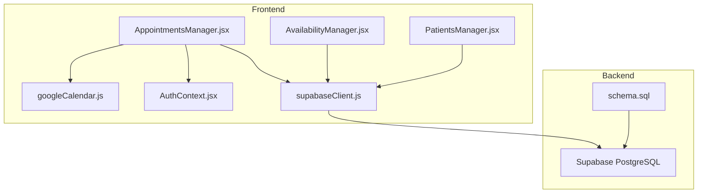
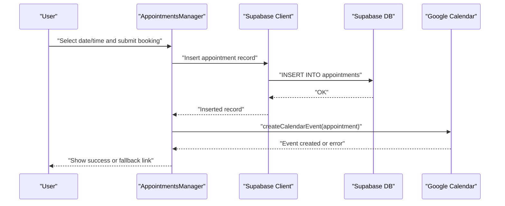
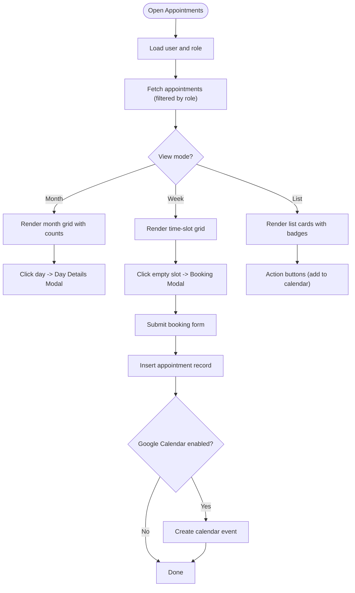
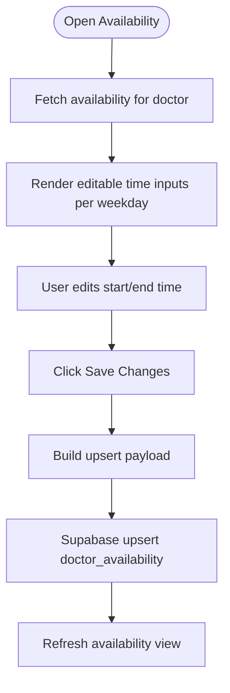
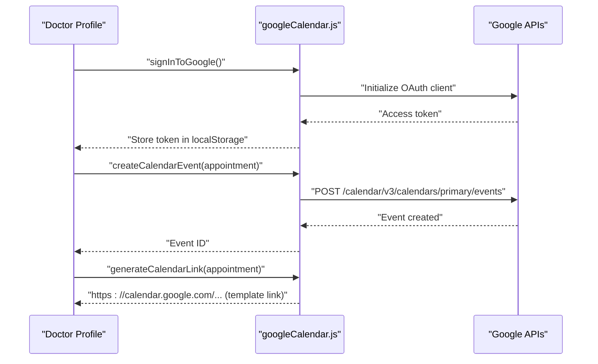
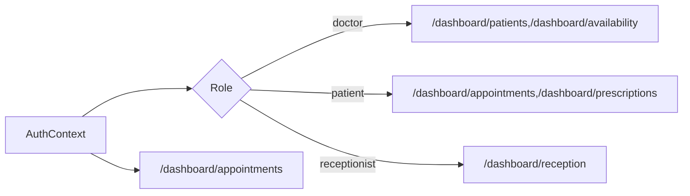
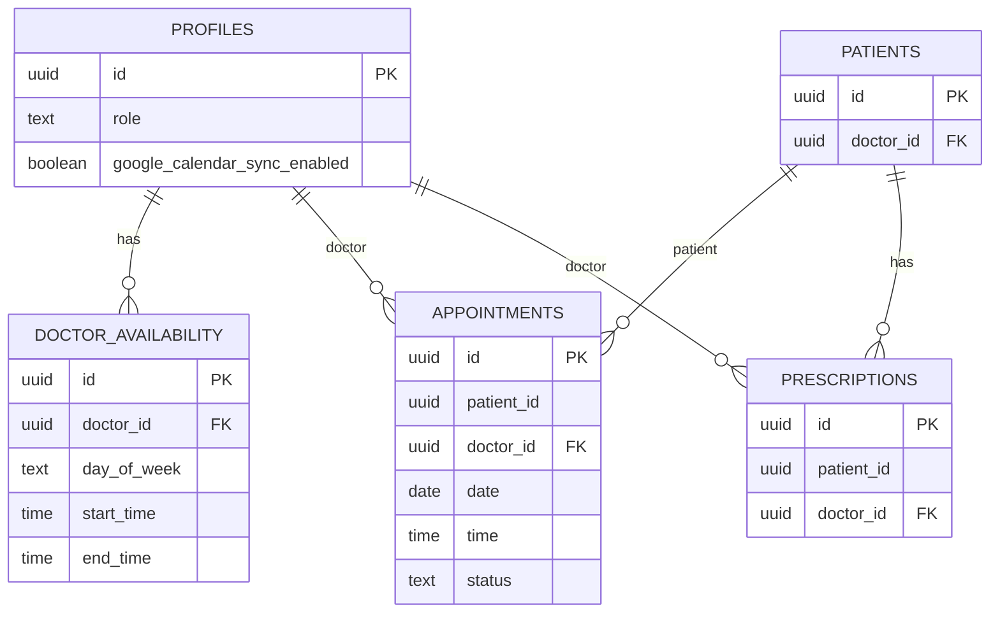
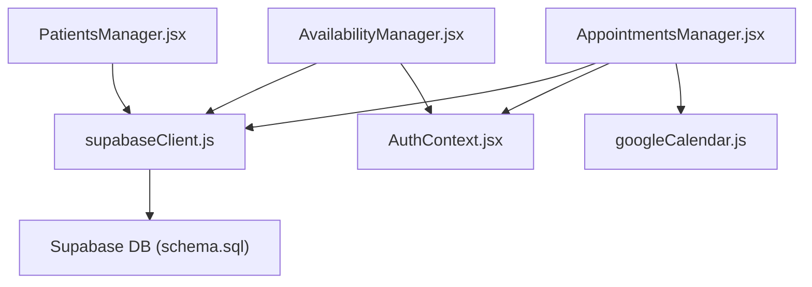

# Appointment Scheduling

<cite>
**Referenced Files in This Document**
- [AppointmentsManager.jsx](file://frontend/src/pages/AppointmentsManager.jsx)
- [AvailabilityManager.jsx](file://frontend/src/pages/AvailabilityManager.jsx)
- [googleCalendar.js](file://frontend/src/lib/googleCalendar.js)
- [supabaseClient.js](file://frontend/src/lib/supabaseClient.js)
- [schema.sql](file://backend/schema.sql)
- [AuthContext.jsx](file://frontend/src/context/AuthContext.jsx)
- [App.jsx](file://frontend/src/App.jsx)
- [PatientsManager.jsx](file://frontend/src/pages/PatientsManager.jsx)
- [GOOGLE_CALENDAR_SETUP.md](file://frontend/GOOGLE_CALENDAR_SETUP.md)
- [README.md](file://frontend/README.md)
</cite>

## Table of Contents
1. [Introduction](#introduction)
2. [Project Structure](#project-structure)
3. [Core Components](#core-components)
4. [Architecture Overview](#architecture-overview)
5. [Detailed Component Analysis](#detailed-component-analysis)
6. [Dependency Analysis](#dependency-analysis)
7. [Performance Considerations](#performance-considerations)
8. [Troubleshooting Guide](#troubleshooting-guide)
9. [Conclusion](#conclusion)
10. [Appendices](#appendices)

## Introduction
This document provides comprehensive documentation for MedVita’s appointment scheduling system. It covers the patient-facing booking interface, doctor availability management, real-time slot coordination, calendar integration with Google Calendar, availability configuration, appointment status tracking, rescheduling and cancellation procedures, integration with patient management and doctor scheduling, and practical guidance for capacity management, waitlist functionality, and resource allocation. It also includes examples of custom scheduling rules, bulk availability updates, and integration with external calendar systems.

## Project Structure
The appointment scheduling system spans the frontend React application and the Supabase backend:
- Frontend pages and libraries:
  - Appointments manager for viewing and booking appointments
  - Availability manager for configuring weekly working hours
  - Google Calendar integration library for OAuth and event creation
  - Authentication context for role-aware UI and data access
  - Supabase client for database operations
- Backend schema:
  - Profiles, patients, doctor availability, appointments, and prescriptions tables
  - Row-level security (RLS) policies governing access and operations

**Diagram sources**
- [AppointmentsManager.jsx](file://frontend/src/pages/AppointmentsManager.jsx#L1-L577)
- [AvailabilityManager.jsx](file://frontend/src/pages/AvailabilityManager.jsx#L1-L165)
- [googleCalendar.js](file://frontend/src/lib/googleCalendar.js#L1-L199)
- [AuthContext.jsx](file://frontend/src/context/AuthContext.jsx#L1-L108)
- [supabaseClient.js](file://frontend/src/lib/supabaseClient.js#L1-L11)
- [PatientsManager.jsx](file://frontend/src/pages/PatientsManager.jsx#L1-L667)
- [schema.sql](file://backend/schema.sql#L1-L274)

**Section sources**
- [App.jsx](file://frontend/src/App.jsx#L1-L62)
- [README.md](file://frontend/README.md#L1-L89)

## Core Components
- Appointments Manager
  - Provides month/week/list views, day details modal, and booking form
  - Supports role-aware filtering (doctor vs patient)
  - Integrates with Google Calendar for automatic sync and manual fallback links
- Availability Manager
  - Configures weekly working hours per day for doctors
  - Upserts availability records to the database
- Google Calendar Integration
  - Loads Google APIs, handles OAuth, stores tokens, creates events, and generates calendar links
- Authentication Context
  - Manages user session, profile, and role for access control
- Supabase Client
  - Initializes connection to Supabase for database operations
- Backend Schema
  - Defines tables and RLS policies for profiles, patients, doctor availability, appointments, and prescriptions

**Section sources**
- [AppointmentsManager.jsx](file://frontend/src/pages/AppointmentsManager.jsx#L1-L577)
- [AvailabilityManager.jsx](file://frontend/src/pages/AvailabilityManager.jsx#L1-L165)
- [googleCalendar.js](file://frontend/src/lib/googleCalendar.js#L1-L199)
- [AuthContext.jsx](file://frontend/src/context/AuthContext.jsx#L1-L108)
- [supabaseClient.js](file://frontend/src/lib/supabaseClient.js#L1-L11)
- [schema.sql](file://backend/schema.sql#L117-L200)

## Architecture Overview
The system follows a role-based architecture:
- Doctors can manage availability, view/manage their own patients, and update appointment statuses
- Patients can view upcoming appointments and book consultations
- Receptionists can manage patients for their employer doctor
- Google Calendar sync is controlled per profile and toggled by the doctor

**Diagram sources**
- [AppointmentsManager.jsx](file://frontend/src/pages/AppointmentsManager.jsx#L134-L180)
- [googleCalendar.js](file://frontend/src/lib/googleCalendar.js#L125-L178)
- [supabaseClient.js](file://frontend/src/lib/supabaseClient.js#L1-L11)
- [schema.sql](file://backend/schema.sql#L137-L147)

## Detailed Component Analysis

### Appointments Manager
- Responsibilities
  - Fetch and display appointments filtered by current user role
  - Provide month/week/list views with navigation controls
  - Allow booking new appointments with date/time selection
  - Integrate with Google Calendar for automatic sync and manual fallback
  - Show appointment details and status badges
- Key behaviors
  - Role-aware queries: doctors see their appointments; patients see theirs
  - Time slot generation for booking
  - Day details modal for viewing and adding appointments
  - Google Calendar sync toggle and fallback link generation
- Data model integration
  - Uses Supabase to query appointments and enrich with patient/doctor names
  - Inserts new appointment records with status defaults

**Diagram sources**
- [AppointmentsManager.jsx](file://frontend/src/pages/AppointmentsManager.jsx#L1-L577)
- [googleCalendar.js](file://frontend/src/lib/googleCalendar.js#L125-L178)
- [schema.sql](file://backend/schema.sql#L137-L147)

**Section sources**
- [AppointmentsManager.jsx](file://frontend/src/pages/AppointmentsManager.jsx#L1-L577)
- [schema.sql](file://backend/schema.sql#L168-L198)

### Availability Manager
- Responsibilities
  - Fetch doctor’s weekly availability
  - Allow editing start/end times per weekday
  - Upsert availability records to persist changes
- Key behaviors
  - Iterates over fixed weekdays and constructs upsert payload
  - Uses Supabase upsert to insert or update based on presence of ID
- Data model integration
  - Reads/writes to doctor_availability table with RLS policies for doctors

**Diagram sources**
- [AvailabilityManager.jsx](file://frontend/src/pages/AvailabilityManager.jsx#L1-L165)
- [schema.sql](file://backend/schema.sql#L117-L136)

**Section sources**
- [AvailabilityManager.jsx](file://frontend/src/pages/AvailabilityManager.jsx#L1-L165)
- [schema.sql](file://backend/schema.sql#L117-L136)

### Google Calendar Integration
- Capabilities
  - Load Google APIs and initialize client
  - Authenticate via OAuth 2.0 and store access token
  - Create calendar events with reminders and timezone awareness
  - Generate calendar links for manual addition
  - Toggle sync preference per profile
- Error handling
  - Graceful handling of missing token, API load failures, and HTTP errors
- Setup
  - Requires Google Cloud project, Calendar API enabled, OAuth client ID, and API key
  - Environment variables configured in frontend

**Diagram sources**
- [googleCalendar.js](file://frontend/src/lib/googleCalendar.js#L56-L178)
- [GOOGLE_CALENDAR_SETUP.md](file://frontend/GOOGLE_CALENDAR_SETUP.md#L1-L117)

**Section sources**
- [googleCalendar.js](file://frontend/src/lib/googleCalendar.js#L1-L199)
- [GOOGLE_CALENDAR_SETUP.md](file://frontend/GOOGLE_CALENDAR_SETUP.md#L1-L117)

### Authentication and Routing
- Authentication context
  - Maintains user session and profile
  - Role determines access to routes and UI elements
- Routing
  - Protected routes for doctors/patients/receptionists
  - Shared routes for appointments and prescriptions

**Diagram sources**
- [AuthContext.jsx](file://frontend/src/context/AuthContext.jsx#L1-L108)
- [App.jsx](file://frontend/src/App.jsx#L35-L55)

**Section sources**
- [AuthContext.jsx](file://frontend/src/context/AuthContext.jsx#L1-L108)
- [App.jsx](file://frontend/src/App.jsx#L1-L62)

### Backend Schema and Policies
- Tables and relationships
  - profiles: roles, sync preferences
  - patients: linked to doctor_id
  - doctor_availability: weekly schedule per doctor
  - appointments: scheduled/completed/cancelled
  - prescriptions: linked to patients/doctors
- Row-level security
  - Profiles: self-service CRUD
  - Patients: doctor/receptionist access based on employer relationship
  - Appointments: view/update policies based on role and ownership
  - Doctor availability: doctor-managed with public view

**Diagram sources**
- [schema.sql](file://backend/schema.sql#L4-L274)

**Section sources**
- [schema.sql](file://backend/schema.sql#L4-L274)

## Dependency Analysis
- Frontend dependencies
  - AppointmentsManager depends on Supabase client, AuthContext, and Google Calendar library
  - AvailabilityManager depends on Supabase client and AuthContext
  - Google Calendar library depends on environment variables and browser APIs
- Backend dependencies
  - All frontend operations depend on Supabase tables and policies
  - Google Calendar integration is independent of backend except for profile sync preferences

**Diagram sources**
- [AppointmentsManager.jsx](file://frontend/src/pages/AppointmentsManager.jsx#L1-L14)
- [AvailabilityManager.jsx](file://frontend/src/pages/AvailabilityManager.jsx#L1-L4)
- [googleCalendar.js](file://frontend/src/lib/googleCalendar.js#L1-L10)
- [supabaseClient.js](file://frontend/src/lib/supabaseClient.js#L1-L11)
- [schema.sql](file://backend/schema.sql#L1-L274)

**Section sources**
- [AppointmentsManager.jsx](file://frontend/src/pages/AppointmentsManager.jsx#L1-L14)
- [AvailabilityManager.jsx](file://frontend/src/pages/AvailabilityManager.jsx#L1-L4)
- [googleCalendar.js](file://frontend/src/lib/googleCalendar.js#L1-L10)
- [supabaseClient.js](file://frontend/src/lib/supabaseClient.js#L1-L11)
- [schema.sql](file://backend/schema.sql#L1-L274)

## Performance Considerations
- Minimize database round-trips by batching upserts for availability
- Use client-side caching for frequently accessed data (e.g., doctor’s availability)
- Debounce search/filter operations to reduce unnecessary queries
- Optimize calendar rendering by virtualizing large grids and limiting DOM nodes
- Avoid redundant name lookups by caching patient/doctor names in memory

## Troubleshooting Guide
- Google Calendar sync fails
  - Verify environment variables and API enablement
  - Confirm OAuth consent screen configuration and scopes
  - Check browser console for detailed error messages
  - Use manual calendar link as fallback
- Not authenticated with Google Calendar
  - Sign out and sign back in
  - Re-enable sync and grant permissions again
- Events not appearing in Google Calendar
  - Ensure sync is enabled in profile settings
  - Confirm correct Google account is signed in
- Conflicts during booking
  - The system prevents double-booking by relying on database constraints and UI checks
  - If conflicts occur, verify availability and appointment uniqueness constraints

**Section sources**
- [GOOGLE_CALENDAR_SETUP.md](file://frontend/GOOGLE_CALENDAR_SETUP.md#L83-L117)
- [AppointmentsManager.jsx](file://frontend/src/pages/AppointmentsManager.jsx#L134-L180)

## Conclusion
MedVita’s appointment scheduling system combines a user-friendly frontend with robust backend policies to support role-based workflows, real-time slot coordination, and seamless Google Calendar integration. The modular design allows for straightforward extensions such as capacity management, waitlist functionality, and advanced scheduling rules. By leveraging Supabase RLS and the provided components, teams can implement scalable scheduling solutions tailored to clinical needs.

## Appendices

### Appointment Status Tracking and Rescheduling
- Status lifecycle
  - Default status is scheduled upon booking
  - Doctors can update status to confirmed/completed/cancelled
- Rescheduling
  - Use the booking modal to select a new date/time and submit
  - Ensure the new slot is within doctor availability and not already booked
- Cancellation
  - Doctors can cancel appointments; UI reflects cancelled status

**Section sources**
- [schema.sql](file://backend/schema.sql#L146-L147)
- [AppointmentsManager.jsx](file://frontend/src/pages/AppointmentsManager.jsx#L134-L180)

### Capacity Management and Waitlist Functionality
- Current implementation
  - Weekly availability is managed per doctor
  - No explicit waitlist or capacity cap is implemented in the provided code
- Recommended approach
  - Extend doctor_availability to include capacity per time slot
  - Add a waitlist queue table with timestamps and status
  - Enforce capacity limits during booking and notify users for waitlist placement

[No sources needed since this section provides general guidance]

### Resource Allocation
- Patient management integration
  - Patients are linked to doctors; this enables targeted scheduling and billing workflows
- Notification systems
  - Google Calendar reminders are included in event creation
  - Consider adding in-app notifications and email triggers via Supabase functions

**Section sources**
- [PatientsManager.jsx](file://frontend/src/pages/PatientsManager.jsx#L1-L667)
- [googleCalendar.js](file://frontend/src/lib/googleCalendar.js#L148-L154)

### Examples of Custom Scheduling Rules
- Non-standard hours
  - Adjust daily start/end times in Availability Manager
- Break scheduling
  - Model breaks by excluding specific time ranges from availability
- Special appointment types
  - Extend appointment status or introduce a type field with custom UI and validation

**Section sources**
- [AvailabilityManager.jsx](file://frontend/src/pages/AvailabilityManager.jsx#L46-L51)
- [schema.sql](file://backend/schema.sql#L146-L147)

### Bulk Availability Updates
- Upsert pattern
  - AvailabilityManager iterates over weekdays and performs a single upsert operation
- Recommendations
  - For bulk updates across weeks/months, extend the UI to prefill templates and apply to multiple days

**Section sources**
- [AvailabilityManager.jsx](file://frontend/src/pages/AvailabilityManager.jsx#L53-L93)

### Integration with External Calendar Systems
- Google Calendar
  - OAuth-based sync and manual fallback links
- Other providers
  - Adapt the calendar integration library to use provider-specific APIs
  - Maintain a unified event model and status mapping

**Section sources**
- [googleCalendar.js](file://frontend/src/lib/googleCalendar.js#L125-L178)
- [GOOGLE_CALENDAR_SETUP.md](file://frontend/GOOGLE_CALENDAR_SETUP.md#L1-L117)