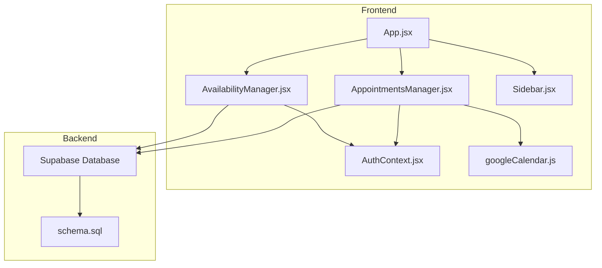
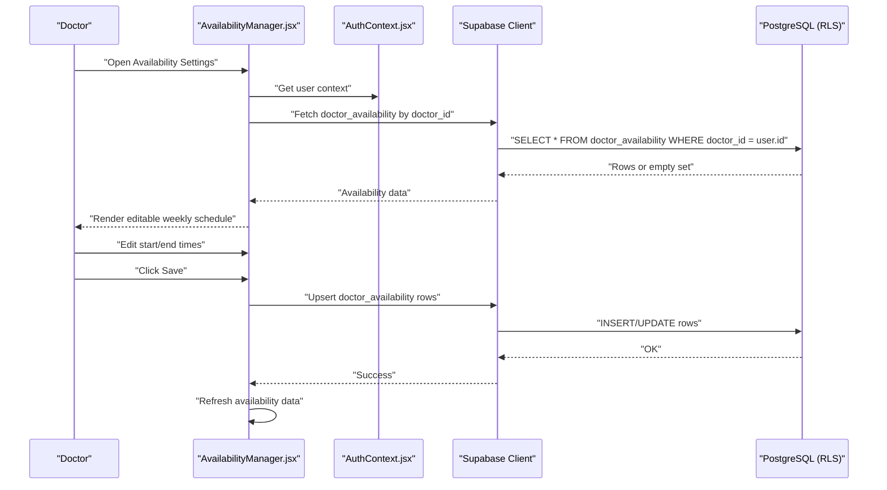
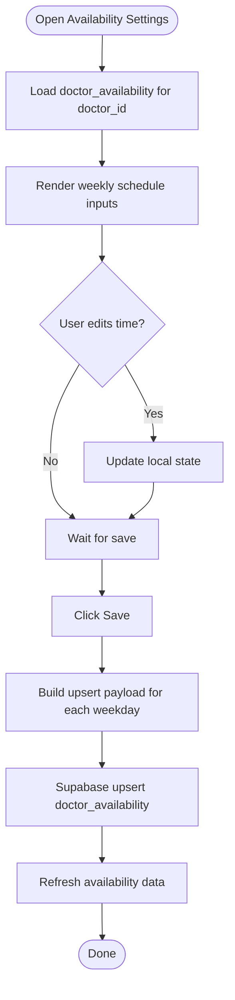
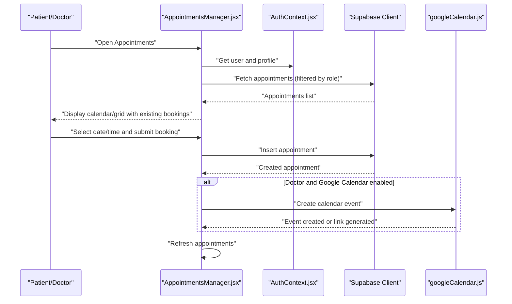
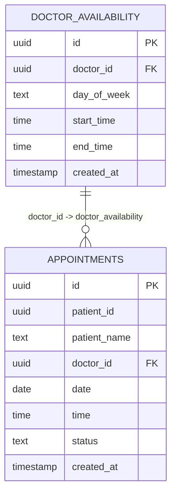
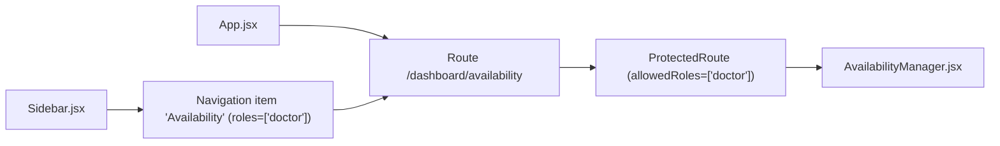
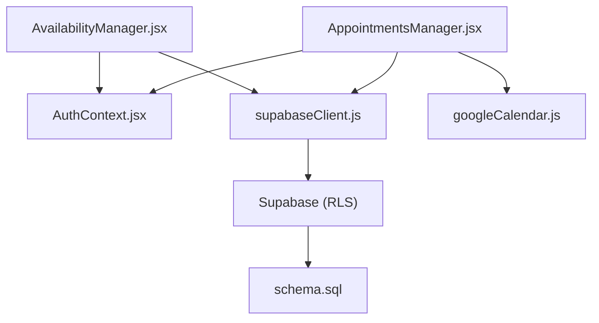

# Availability Management

<cite>
**Referenced Files in This Document**
- [AvailabilityManager.jsx](file://frontend/src/pages/AvailabilityManager.jsx)
- [AppointmentsManager.jsx](file://frontend/src/pages/AppointmentsManager.jsx)
- [schema.sql](file://backend/schema.sql)
- [supabaseClient.js](file://frontend/src/lib/supabaseClient.js)
- [AuthContext.jsx](file://frontend/src/context/AuthContext.jsx)
- [Sidebar.jsx](file://frontend/src/components/Sidebar.jsx)
- [App.jsx](file://frontend/src/App.jsx)
- [googleCalendar.js](file://frontend/src/lib/googleCalendar.js)
</cite>

## Table of Contents
1. [Introduction](#introduction)
2. [Project Structure](#project-structure)
3. [Core Components](#core-components)
4. [Architecture Overview](#architecture-overview)
5. [Detailed Component Analysis](#detailed-component-analysis)
6. [Dependency Analysis](#dependency-analysis)
7. [Performance Considerations](#performance-considerations)
8. [Troubleshooting Guide](#troubleshooting-guide)
9. [Conclusion](#conclusion)

## Introduction
This document describes the doctor availability management system within the MedVita healthcare scheduling platform. It covers how doctors configure their weekly working hours, how the booking calendar reflects these settings, and how the system prevents double-booking through database constraints and policies. It also documents the integration with Google Calendar for synchronization and outlines the current limitations around break schedules, special appointment types, and capacity limits per time slot.

## Project Structure
The availability management feature spans the frontend React application and the backend Supabase database schema. The key components are:
- Availability configuration UI for doctors
- Calendar-based booking interface for patients and doctors
- Database schema defining availability and appointment entities
- Authentication and routing integration

**Diagram sources**
- [AvailabilityManager.jsx](file://frontend/src/pages/AvailabilityManager.jsx#L1-L165)
- [AppointmentsManager.jsx](file://frontend/src/pages/AppointmentsManager.jsx#L1-L577)
- [AuthContext.jsx](file://frontend/src/context/AuthContext.jsx#L1-L108)
- [Sidebar.jsx](file://frontend/src/components/Sidebar.jsx#L1-L113)
- [App.jsx](file://frontend/src/App.jsx#L1-L62)
- [googleCalendar.js](file://frontend/src/lib/googleCalendar.js#L1-L199)
- [schema.sql](file://backend/schema.sql#L117-L147)

**Section sources**
- [AvailabilityManager.jsx](file://frontend/src/pages/AvailabilityManager.jsx#L1-L165)
- [AppointmentsManager.jsx](file://frontend/src/pages/AppointmentsManager.jsx#L1-L577)
- [schema.sql](file://backend/schema.sql#L117-L147)
- [App.jsx](file://frontend/src/App.jsx#L42-L45)
- [Sidebar.jsx](file://frontend/src/components/Sidebar.jsx#L28-L29)

## Core Components
- Availability Manager: Allows doctors to set daily start/end times for a fixed set of weekdays. Supports fetching, editing, and upserting availability records.
- Appointments Manager: Provides calendar views (month/week/list) and handles appointment booking. Uses a predefined time slot grid and displays existing bookings.
- Database Schema: Defines doctor_availability and appointments tables with Row Level Security (RLS) policies and foreign key constraints.
- Authentication Context: Manages user session and profile data used by both components.
- Google Calendar Integration: Optional synchronization of appointments to Google Calendar.

**Section sources**
- [AvailabilityManager.jsx](file://frontend/src/pages/AvailabilityManager.jsx#L6-L93)
- [AppointmentsManager.jsx](file://frontend/src/pages/AppointmentsManager.jsx#L47-L53)
- [schema.sql](file://backend/schema.sql#L117-L147)
- [AuthContext.jsx](file://frontend/src/context/AuthContext.jsx#L9-L61)
- [googleCalendar.js](file://frontend/src/lib/googleCalendar.js#L125-L178)

## Architecture Overview
The availability system follows a straightforward client-server architecture:
- Frontend components communicate with Supabase via the Supabase client.
- Backend enforces data integrity through RLS policies and constraints.
- Calendar views derive availability indirectly from the doctor’s configured weekly schedule.

**Diagram sources**
- [AvailabilityManager.jsx](file://frontend/src/pages/AvailabilityManager.jsx#L20-L93)
- [AuthContext.jsx](file://frontend/src/context/AuthContext.jsx#L9-L61)
- [supabaseClient.js](file://frontend/src/lib/supabaseClient.js#L1-L11)
- [schema.sql](file://backend/schema.sql#L117-L136)

## Detailed Component Analysis

### Availability Manager
The Availability Manager enables doctors to define their weekly working hours. It:
- Loads availability for a fixed set of weekdays (Monday–Friday).
- Displays start and end time inputs for each day.
- Persists changes using Supabase upsert operations.
- Refreshes data after save to reflect new IDs.

**Diagram sources**
- [AvailabilityManager.jsx](file://frontend/src/pages/AvailabilityManager.jsx#L20-L93)

**Section sources**
- [AvailabilityManager.jsx](file://frontend/src/pages/AvailabilityManager.jsx#L6-L93)

### Appointments Manager and Calendar Integration
The Appointments Manager provides:
- Month, week, and list views for appointments.
- A predefined time slot grid (e.g., 30-minute intervals).
- Booking modal allowing selection of date, time, and entity (doctor or patient).
- Google Calendar sync for doctor-created appointments.

**Diagram sources**
- [AppointmentsManager.jsx](file://frontend/src/pages/AppointmentsManager.jsx#L67-L180)
- [googleCalendar.js](file://frontend/src/lib/googleCalendar.js#L125-L178)
- [AuthContext.jsx](file://frontend/src/context/AuthContext.jsx#L9-L61)
- [supabaseClient.js](file://frontend/src/lib/supabaseClient.js#L1-L11)

**Section sources**
- [AppointmentsManager.jsx](file://frontend/src/pages/AppointmentsManager.jsx#L47-L53)
- [AppointmentsManager.jsx](file://frontend/src/pages/AppointmentsManager.jsx#L134-L180)
- [googleCalendar.js](file://frontend/src/lib/googleCalendar.js#L125-L178)

### Database Schema and Policies
The schema defines:
- doctor_availability: weekly schedule per doctor with day_of_week, start_time, end_time.
- appointments: scheduled visits with date, time, and status.
- RLS policies controlling who can view/update availability and appointments.
- Foreign key constraints ensuring referential integrity.

**Diagram sources**
- [schema.sql](file://backend/schema.sql#L117-L147)

**Section sources**
- [schema.sql](file://backend/schema.sql#L117-L147)
- [schema.sql](file://backend/schema.sql#L127-L136)
- [schema.sql](file://backend/schema.sql#L158-L198)

### Routing and Navigation
The availability page is protected and only accessible to doctors. It is integrated into the sidebar navigation.

**Diagram sources**
- [App.jsx](file://frontend/src/App.jsx#L42-L45)
- [Sidebar.jsx](file://frontend/src/components/Sidebar.jsx#L28-L29)

**Section sources**
- [App.jsx](file://frontend/src/App.jsx#L42-L45)
- [Sidebar.jsx](file://frontend/src/components/Sidebar.jsx#L28-L29)

## Dependency Analysis
- Availability Manager depends on:
  - AuthContext for user identification
  - Supabase client for database operations
  - Local state management for UI updates
- Appointments Manager depends on:
  - AuthContext for user and profile
  - Supabase client for appointments
  - Google Calendar integration for optional sync
- Database relies on:
  - RLS policies for access control
  - Constraints for referential integrity

**Diagram sources**
- [AvailabilityManager.jsx](file://frontend/src/pages/AvailabilityManager.jsx#L1-L4)
- [AppointmentsManager.jsx](file://frontend/src/pages/AppointmentsManager.jsx#L1-L12)
- [AuthContext.jsx](file://frontend/src/context/AuthContext.jsx#L1-L108)
- [supabaseClient.js](file://frontend/src/lib/supabaseClient.js#L1-L11)
- [googleCalendar.js](file://frontend/src/lib/googleCalendar.js#L1-L199)
- [schema.sql](file://backend/schema.sql#L117-L147)

**Section sources**
- [AvailabilityManager.jsx](file://frontend/src/pages/AvailabilityManager.jsx#L1-L4)
- [AppointmentsManager.jsx](file://frontend/src/pages/AppointmentsManager.jsx#L1-L12)
- [AuthContext.jsx](file://frontend/src/context/AuthContext.jsx#L1-L108)
- [supabaseClient.js](file://frontend/src/lib/supabaseClient.js#L1-L11)
- [googleCalendar.js](file://frontend/src/lib/googleCalendar.js#L1-L199)
- [schema.sql](file://backend/schema.sql#L117-L147)

## Performance Considerations
- Availability loading performs a single query per doctor and maps results to a fixed set of weekdays, minimizing overhead.
- Calendar grid rendering uses a predefined time slot array; consider virtualization for large datasets.
- Upsert operations batch multiple rows per save, reducing network round-trips.
- RLS policies are enforced server-side; ensure indexes on frequently filtered columns (e.g., doctor_id) for optimal query performance.

[No sources needed since this section provides general guidance]

## Troubleshooting Guide
Common issues and resolutions:
- Missing Supabase credentials: Ensure VITE_SUPABASE_URL and VITE_SUPABASE_ANON_KEY are set in the environment.
- RLS policy conflicts: Temporarily disabling RLS can help diagnose visibility issues; re-enable after verifying policies.
- Foreign key constraint errors: The backend migration script removes problematic constraints and adds required columns for appointments.
- Google Calendar sync failures: The integration requires OAuth consent and a stored access token; fallback links are provided.

**Section sources**
- [supabaseClient.js](file://frontend/src/lib/supabaseClient.js#L6-L8)
- [schema.sql](file://backend/schema.sql#L149-L156)
- [googleCalendar.js](file://frontend/src/lib/googleCalendar.js#L125-L178)

## Conclusion
The availability management system provides a focused interface for doctors to define their weekly working hours, which the calendar-based booking interface respects through the existing appointment data model. While the current implementation does not include break schedules, special appointment types, or per-slot capacity limits, it establishes a solid foundation for preventing double-booking via database constraints and policies. Future enhancements could introduce dedicated break slots and capacity controls while maintaining the existing calendar UX.