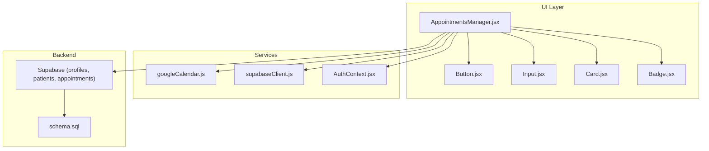
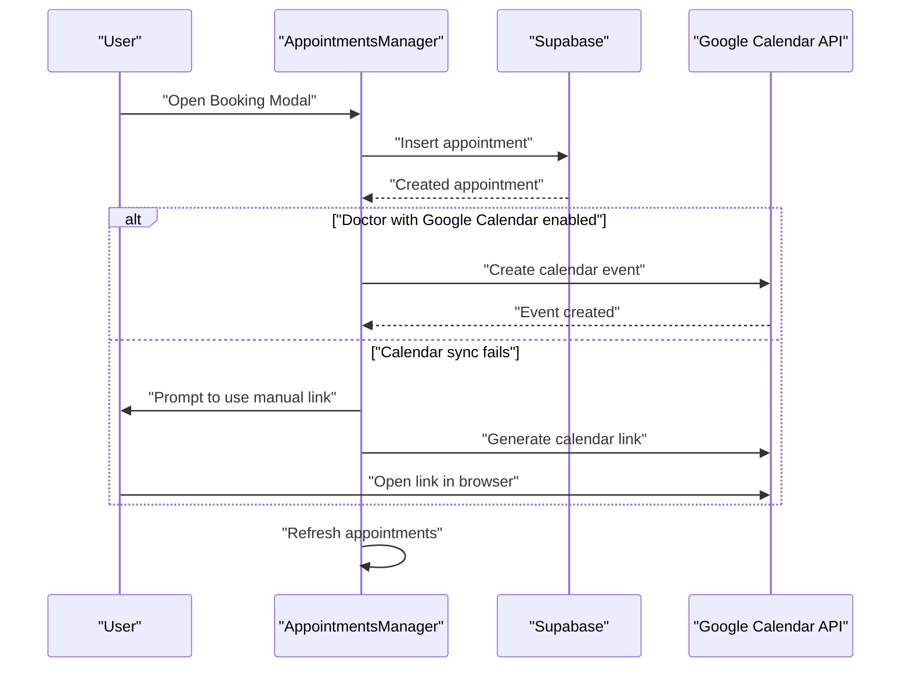
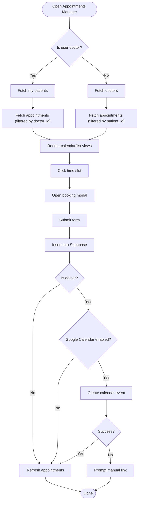
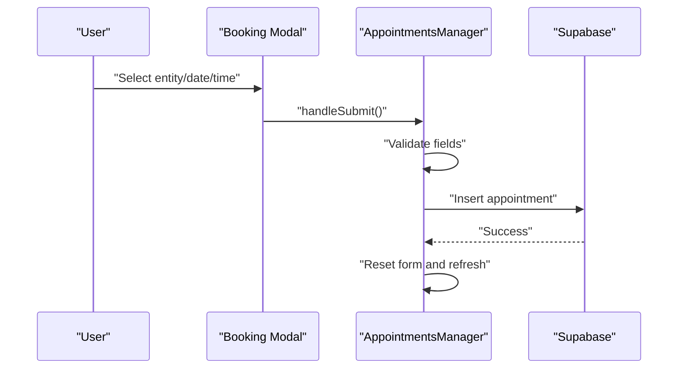
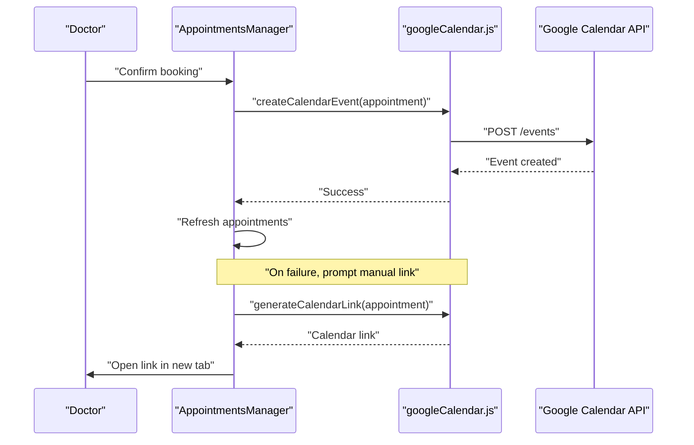
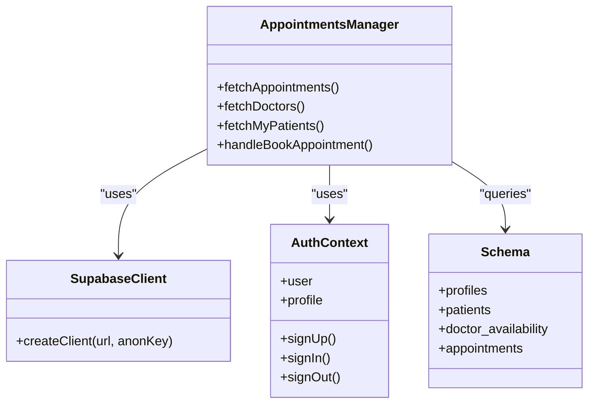
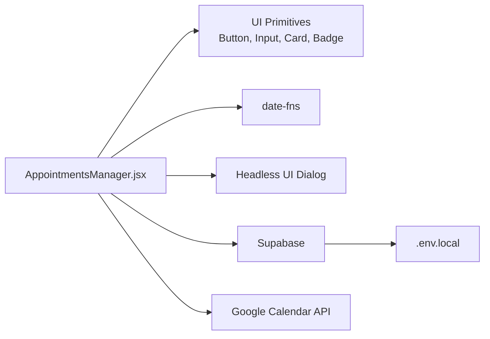

# Booking Interface

<cite>
**Referenced Files in This Document**
- [AppointmentsManager.jsx](file://frontend/src/pages/AppointmentsManager.jsx)
- [googleCalendar.js](file://frontend/src/lib/googleCalendar.js)
- [supabaseClient.js](file://frontend/src/lib/supabaseClient.js)
- [AuthContext.jsx](file://frontend/src/context/AuthContext.jsx)
- [Button.jsx](file://frontend/src/components/ui/Button.jsx)
- [Input.jsx](file://frontend/src/components/ui/Input.jsx)
- [Card.jsx](file://frontend/src/components/ui/Card.jsx)
- [Badge.jsx](file://frontend/src/components/ui/Badge.jsx)
- [.env.local](file://frontend/.env.local)
- [schema.sql](file://backend/schema.sql)
</cite>

## Table of Contents
1. [Introduction](#introduction)
2. [Project Structure](#project-structure)
3. [Core Components](#core-components)
4. [Architecture Overview](#architecture-overview)
5. [Detailed Component Analysis](#detailed-component-analysis)
6. [Dependency Analysis](#dependency-analysis)
7. [Performance Considerations](#performance-considerations)
8. [Troubleshooting Guide](#troubleshooting-guide)
9. [Conclusion](#conclusion)

## Introduction
This document describes the modal-based appointment booking interface used by both patients and doctors to schedule healthcare consultations. It covers the booking form, entity selection, date/time controls, responsive calendar views (month, week, list), Supabase integration for real-time data synchronization, and Google Calendar sync. It also documents user roles, booking workflows, error handling, and fallback mechanisms.

## Project Structure
The booking interface is implemented as a single-page manager component that renders a calendar grid, a booking modal, and a day-details panel. It integrates with Supabase for data persistence and Google APIs for calendar synchronization.

**Diagram sources**
- [AppointmentsManager.jsx](file://frontend/src/pages/AppointmentsManager.jsx#L1-L577)
- [googleCalendar.js](file://frontend/src/lib/googleCalendar.js#L1-L199)
- [supabaseClient.js](file://frontend/src/lib/supabaseClient.js#L1-L11)
- [AuthContext.jsx](file://frontend/src/context/AuthContext.jsx#L1-L108)
- [schema.sql](file://backend/schema.sql#L1-L274)

**Section sources**
- [AppointmentsManager.jsx](file://frontend/src/pages/AppointmentsManager.jsx#L1-L577)
- [googleCalendar.js](file://frontend/src/lib/googleCalendar.js#L1-L199)
- [supabaseClient.js](file://frontend/src/lib/supabaseClient.js#L1-L11)
- [AuthContext.jsx](file://frontend/src/context/AuthContext.jsx#L1-L108)
- [schema.sql](file://backend/schema.sql#L1-L274)

## Core Components
- Appointments Manager: orchestrates calendar views, modal forms, and data fetching/updating.
- Booking Modal: collects entity, date, and time; submits via Supabase; optionally syncs to Google Calendar.
- Day Details Panel: lists appointments for a selected day and supports quick booking.
- Calendar Views: month grid, week grid with time slots, and list view cards.
- UI primitives: Button, Input, Card, Badge for consistent UX.

**Section sources**
- [AppointmentsManager.jsx](file://frontend/src/pages/AppointmentsManager.jsx#L1-L577)
- [Button.jsx](file://frontend/src/components/ui/Button.jsx#L1-L51)
- [Input.jsx](file://frontend/src/components/ui/Input.jsx#L1-L63)
- [Card.jsx](file://frontend/src/components/ui/Card.jsx#L1-L54)
- [Badge.jsx](file://frontend/src/components/ui/Badge.jsx#L1-L32)

## Architecture Overview
The component relies on Supabase for authentication, profile retrieval, and CRUD on appointments and related entities. Google Calendar integration is optional and performed client-side via OAuth and the Calendar API, with a manual fallback link generator.

**Diagram sources**
- [AppointmentsManager.jsx](file://frontend/src/pages/AppointmentsManager.jsx#L134-L180)
- [googleCalendar.js](file://frontend/src/lib/googleCalendar.js#L125-L178)

## Detailed Component Analysis

### Appointments Manager
Responsibilities:
- Role-aware rendering: shows “Book Consultation” for patients and “New Appointment” for doctors.
- Entity selection: populates a dropdown with either doctors (for patients) or their own patients (for doctors).
- Calendar navigation: supports month and week modes with responsive day counts.
- Time slot grid: displays 30-minute intervals; clicking a slot opens the booking modal.
- List view: card-based display of upcoming appointments with status badges and calendar actions.
- Real-time data: fetches appointments filtered by current user role and updates on modal close.
- Google Calendar sync: attempts automatic sync for doctors who have enabled it; otherwise offers manual link.

Key behaviors:
- Loading state during initial fetch.
- Responsive layout detection for mobile-first adjustments.
- Day click opens a details panel with appointment list or quick-booking option.

**Diagram sources**
- [AppointmentsManager.jsx](file://frontend/src/pages/AppointmentsManager.jsx#L55-L65)
- [AppointmentsManager.jsx](file://frontend/src/pages/AppointmentsManager.jsx#L134-L180)

**Section sources**
- [AppointmentsManager.jsx](file://frontend/src/pages/AppointmentsManager.jsx#L14-L65)
- [AppointmentsManager.jsx](file://frontend/src/pages/AppointmentsManager.jsx#L134-L180)
- [AppointmentsManager.jsx](file://frontend/src/pages/AppointmentsManager.jsx#L200-L218)
- [AppointmentsManager.jsx](file://frontend/src/pages/AppointmentsManager.jsx#L220-L577)

### Booking Modal
Form fields:
- Entity selector: doctor (for patients) or patient (for doctors).
- Date picker: standard HTML date input bound to selected date.
- Time grid: 30-minute blocks; selection sets the chosen time.

Validation and submission:
- Prevents submission if any field is empty.
- Constructs appointment payload with status and role-appropriate IDs.
- Inserts into Supabase and triggers Google Calendar sync for eligible doctors.

**Diagram sources**
- [AppointmentsManager.jsx](file://frontend/src/pages/AppointmentsManager.jsx#L475-L511)
- [AppointmentsManager.jsx](file://frontend/src/pages/AppointmentsManager.jsx#L134-L180)

**Section sources**
- [AppointmentsManager.jsx](file://frontend/src/pages/AppointmentsManager.jsx#L475-L511)
- [AppointmentsManager.jsx](file://frontend/src/pages/AppointmentsManager.jsx#L134-L180)

### Day Details Panel
Purpose:
- Displays all appointments for a given day.
- Allows quick booking by selecting a date and opening the modal.
- Provides calendar sync action for doctors when enabled.

**Section sources**
- [AppointmentsManager.jsx](file://frontend/src/pages/AppointmentsManager.jsx#L513-L573)

### Calendar Views
- Month view: grid of days with appointment counts; clicking a day opens the day details panel.
- Week view: time-based grid with slots for each day; clicking an empty slot opens the booking modal; clicking an existing appointment opens the day details panel.
- List view: compact cards per appointment with status and calendar actions.

Responsive behavior:
- Mobile: reduced columns in week/month grids and alternate navigation increments.
- Desktop: full-width grids and standard navigation.

**Section sources**
- [AppointmentsManager.jsx](file://frontend/src/pages/AppointmentsManager.jsx#L200-L218)
- [AppointmentsManager.jsx](file://frontend/src/pages/AppointmentsManager.jsx#L326-L473)

### Google Calendar Integration
- OAuth and API initialization: loads Google APIs and initializes client.
- Authentication: obtains an access token via token client.
- Event creation: posts to Calendar API with formatted start/end times and reminders.
- Manual fallback: generates a Google Calendar link for manual addition.

**Diagram sources**
- [AppointmentsManager.jsx](file://frontend/src/pages/AppointmentsManager.jsx#L163-L171)
- [googleCalendar.js](file://frontend/src/lib/googleCalendar.js#L125-L178)
- [googleCalendar.js](file://frontend/src/lib/googleCalendar.js#L180-L198)

**Section sources**
- [googleCalendar.js](file://frontend/src/lib/googleCalendar.js#L1-L199)
- [AppointmentsManager.jsx](file://frontend/src/pages/AppointmentsManager.jsx#L163-L171)

### Supabase Integration
- Client initialization: reads Vite environment variables for Supabase URL and anon key.
- Authentication context: provides user and profile to the manager.
- Data access:
  - Appointments: filtered by current user’s role.
  - Doctors: for patients to choose.
  - My patients: for doctors to select.
- Backend schema: defines profiles, patients, doctor availability, and appointments with appropriate policies.

**Diagram sources**
- [supabaseClient.js](file://frontend/src/lib/supabaseClient.js#L1-L11)
- [AuthContext.jsx](file://frontend/src/context/AuthContext.jsx#L1-L108)
- [AppointmentsManager.jsx](file://frontend/src/pages/AppointmentsManager.jsx#L67-L132)
- [schema.sql](file://backend/schema.sql#L137-L147)

**Section sources**
- [supabaseClient.js](file://frontend/src/lib/supabaseClient.js#L1-L11)
- [AuthContext.jsx](file://frontend/src/context/AuthContext.jsx#L1-L108)
- [AppointmentsManager.jsx](file://frontend/src/pages/AppointmentsManager.jsx#L67-L132)
- [schema.sql](file://backend/schema.sql#L137-L147)

## Dependency Analysis
- Internal dependencies:
  - AppointmentsManager depends on UI primitives for consistent styling and behavior.
  - Uses date-fns for calendar calculations and formatting.
  - Integrates with Headless UI Dialog for modal overlays.
- External dependencies:
  - Supabase for authentication and data persistence.
  - Google APIs for calendar synchronization.
  - Environment variables for service keys.

**Diagram sources**
- [AppointmentsManager.jsx](file://frontend/src/pages/AppointmentsManager.jsx#L1-L12)
- [Button.jsx](file://frontend/src/components/ui/Button.jsx#L1-L51)
- [Input.jsx](file://frontend/src/components/ui/Input.jsx#L1-L63)
- [Card.jsx](file://frontend/src/components/ui/Card.jsx#L1-L54)
- [Badge.jsx](file://frontend/src/components/ui/Badge.jsx#L1-L32)
- [.env.local](file://frontend/.env.local#L1-L5)

**Section sources**
- [AppointmentsManager.jsx](file://frontend/src/pages/AppointmentsManager.jsx#L1-L12)
- [Button.jsx](file://frontend/src/components/ui/Button.jsx#L1-L51)
- [Input.jsx](file://frontend/src/components/ui/Input.jsx#L1-L63)
- [Card.jsx](file://frontend/src/components/ui/Card.jsx#L1-L54)
- [Badge.jsx](file://frontend/src/components/ui/Badge.jsx#L1-L32)
- [.env.local](file://frontend/.env.local#L1-L5)

## Performance Considerations
- Efficient filtering: appointment queries are scoped to the current user, minimizing dataset size.
- Minimal re-renders: state updates are granular (selected entity/date/time, view mode).
- Lazy loading: Google API scripts are loaded on demand.
- Responsive adjustments: mobile-specific grid layouts reduce DOM density.

[No sources needed since this section provides general guidance]

## Troubleshooting Guide
Common issues and resolutions:
- Missing Supabase credentials: verify environment variables are present and correct.
- Calendar sync failure: the component falls back to a manual link; prompt the user to open the generated link.
- Empty entity dropdown: ensure the relevant fetch function (doctors or patients) completes successfully.
- Conflicting appointments: the grid does not enforce uniqueness; prevent double-booking by checking existing appointments before insertion.
- Role mismatches: the manager filters data by role; verify the user profile role is accurate.

**Section sources**
- [.env.local](file://frontend/.env.local#L1-L5)
- [AppointmentsManager.jsx](file://frontend/src/pages/AppointmentsManager.jsx#L134-L180)
- [googleCalendar.js](file://frontend/src/lib/googleCalendar.js#L125-L178)

## Conclusion
The booking interface provides a cohesive, role-aware experience for scheduling appointments. It combines a flexible calendar with a straightforward modal form, integrates with Supabase for reliable data access, and offers optional Google Calendar synchronization with a robust manual fallback. The mobile-first responsive design ensures usability across devices.