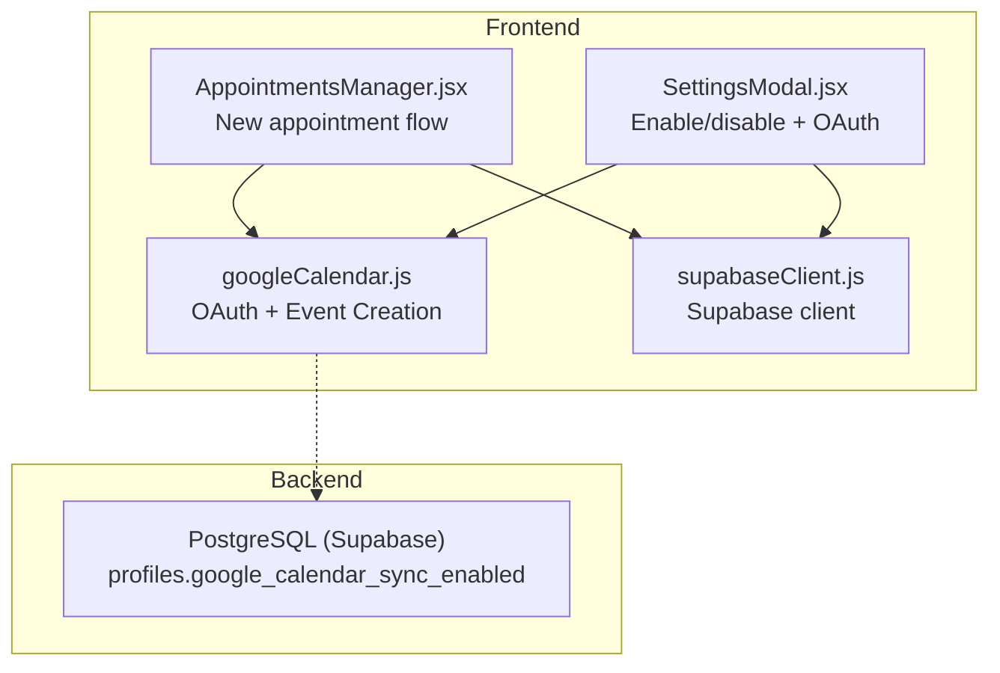
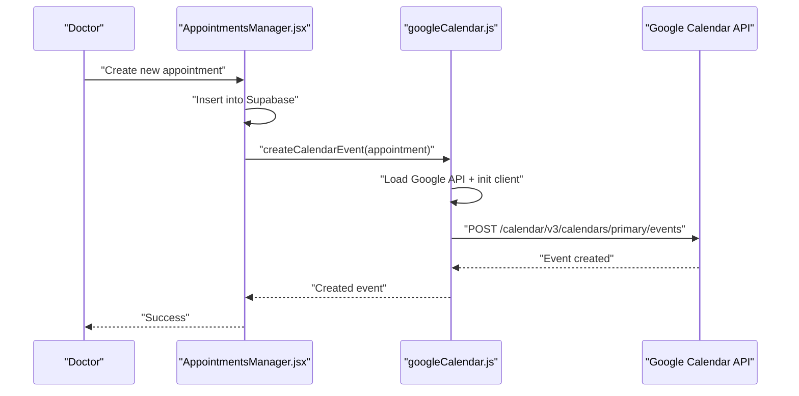
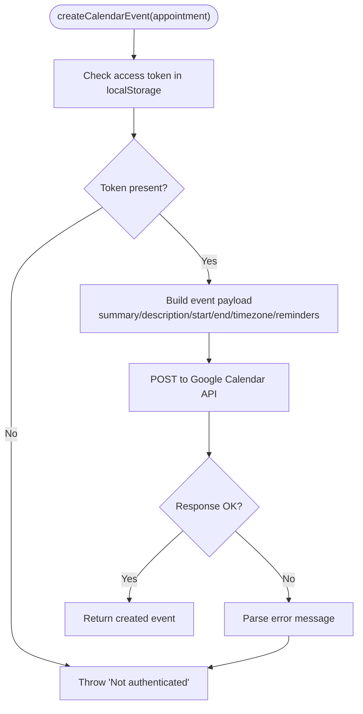
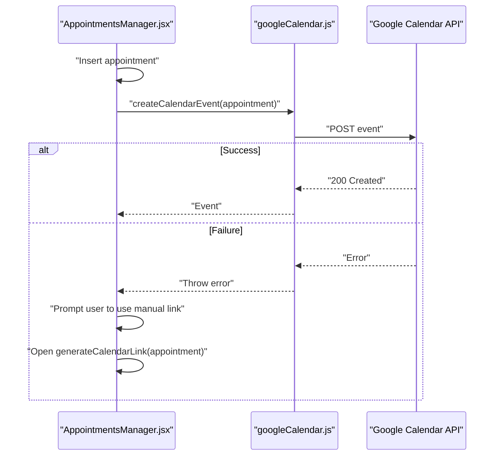
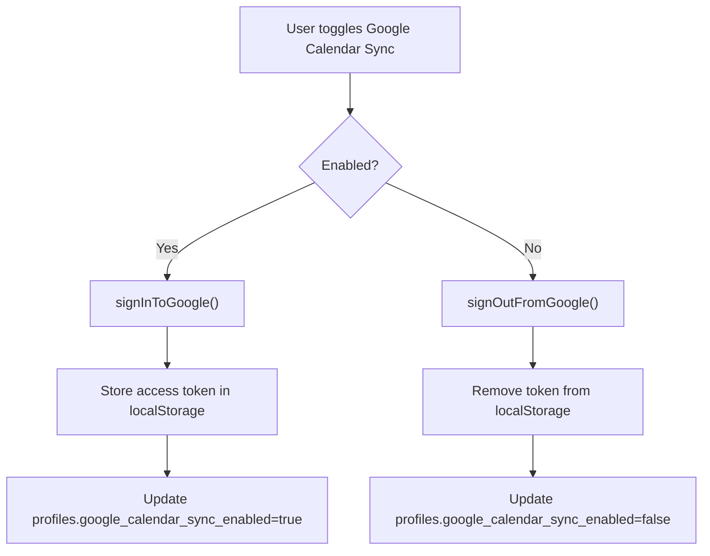
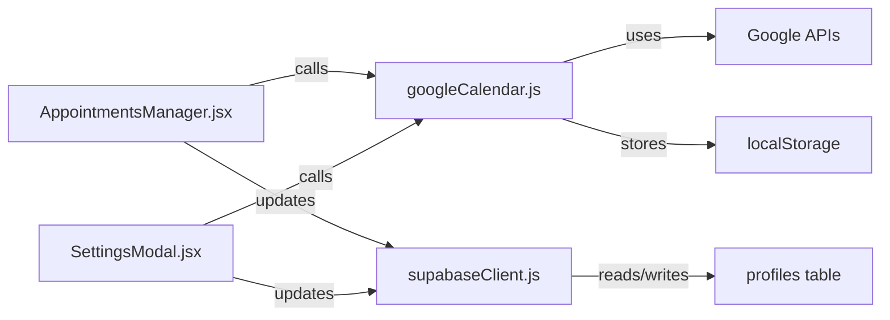

# Calendar Integration

<cite>
**Referenced Files in This Document**
- [googleCalendar.js](file://frontend/src/lib/googleCalendar.js)
- [AppointmentsManager.jsx](file://frontend/src/pages/AppointmentsManager.jsx)
- [SettingsModal.jsx](file://frontend/src/components/SettingsModal.jsx)
- [GOOGLE_CALENDAR_SETUP.md](file://frontend/GOOGLE_CALENDAR_SETUP.md)
- [supabaseClient.js](file://frontend/src/lib/supabaseClient.js)
- [schema.sql](file://backend/schema.sql)
</cite>

## Table of Contents
1. [Introduction](#introduction)
2. [Project Structure](#project-structure)
3. [Core Components](#core-components)
4. [Architecture Overview](#architecture-overview)
5. [Detailed Component Analysis](#detailed-component-analysis)
6. [Dependency Analysis](#dependency-analysis)
7. [Performance Considerations](#performance-considerations)
8. [Troubleshooting Guide](#troubleshooting-guide)
9. [Conclusion](#conclusion)
10. [Appendices](#appendices)

## Introduction
This document describes the Google Calendar integration for MedVita, covering the OAuth authentication flow, event creation and synchronization, manual fallback mechanisms, calendar link generation, error handling, setup requirements, API configuration, and security considerations. It also explains how MedVita appointments map to Google Calendar events, how metadata is preserved, and how update propagation works in the current implementation.

## Project Structure
The calendar integration spans three main areas:
- Frontend library for Google Calendar OAuth and event creation
- Appointments manager that triggers sync on new appointments
- Settings modal that manages user preferences and initiates OAuth

**Diagram sources**
- [googleCalendar.js](file://frontend/src/lib/googleCalendar.js#L1-L198)
- [AppointmentsManager.jsx](file://frontend/src/pages/AppointmentsManager.jsx#L1-L198)
- [SettingsModal.jsx](file://frontend/src/components/SettingsModal.jsx#L60-L91)
- [supabaseClient.js](file://frontend/src/lib/supabaseClient.js#L1-L11)
- [schema.sql](file://backend/schema.sql#L11-L14)

**Section sources**
- [googleCalendar.js](file://frontend/src/lib/googleCalendar.js#L1-L198)
- [AppointmentsManager.jsx](file://frontend/src/pages/AppointmentsManager.jsx#L1-L198)
- [SettingsModal.jsx](file://frontend/src/components/SettingsModal.jsx#L60-L91)
- [supabaseClient.js](file://frontend/src/lib/supabaseClient.js#L1-L11)
- [schema.sql](file://backend/schema.sql#L11-L14)

## Core Components
- Google Calendar service: Loads Google APIs, handles OAuth consent, stores tokens, creates events, and generates calendar links.
- Appointments manager: On new appointment creation, conditionally syncs to Google Calendar and falls back to manual link generation on failure.
- Settings modal: Allows doctors to enable/disable sync and initiate OAuth consent flow.
- Supabase client: Used to persist user preferences and fetch profile data.
- Backend schema: Adds a boolean flag to track whether Google Calendar sync is enabled per profile.

Key responsibilities:
- Authentication: OAuth 2.0 with Google Identity Services and Google APIs client initialization.
- Event creation: Builds event payload with summary, description, start/end times, and reminders; posts to Google Calendar API.
- Manual fallback: Generates a Google Calendar template link for manual addition.
- Preference persistence: Updates user profile to reflect sync preference.

**Section sources**
- [googleCalendar.js](file://frontend/src/lib/googleCalendar.js#L6-L123)
- [AppointmentsManager.jsx](file://frontend/src/pages/AppointmentsManager.jsx#L160-L171)
- [SettingsModal.jsx](file://frontend/src/components/SettingsModal.jsx#L64-L91)
- [schema.sql](file://backend/schema.sql#L11-L14)

## Architecture Overview
The integration follows a unidirectional sync pattern from MedVita to Google Calendar:
- When a doctor creates a new appointment, the system checks if sync is enabled.
- If enabled, it attempts to create a Google Calendar event using an OAuth access token.
- On failure, it prompts the user to use a generated calendar link to add the event manually.

**Diagram sources**
- [AppointmentsManager.jsx](file://frontend/src/pages/AppointmentsManager.jsx#L160-L171)
- [googleCalendar.js](file://frontend/src/lib/googleCalendar.js#L15-L53)
- [googleCalendar.js](file://frontend/src/lib/googleCalendar.js#L126-L178)

## Detailed Component Analysis

### Google Calendar Service
Responsibilities:
- Load Google APIs (gapi and Identity Services)
- Initialize Google API client with API key and discovery doc
- Handle OAuth consent and store access token in localStorage
- Create calendar events with metadata and reminders
- Generate calendar links for manual addition

Implementation highlights:
- Environment variables for client ID and API key
- OAuth scope for calendar events
- Event payload includes summary, description, start/end times, and reminders
- Fallback link uses Google Calendar’s template action

**Diagram sources**
- [googleCalendar.js](file://frontend/src/lib/googleCalendar.js#L126-L178)

**Section sources**
- [googleCalendar.js](file://frontend/src/lib/googleCalendar.js#L6-L123)
- [googleCalendar.js](file://frontend/src/lib/googleCalendar.js#L126-L178)
- [googleCalendar.js](file://frontend/src/lib/googleCalendar.js#L180-L198)

### Appointments Manager Integration
Behavior:
- After inserting a new appointment, checks if the doctor has sync enabled
- Attempts to create a Google Calendar event
- On failure, asks the user if they want to open the manual calendar link

**Diagram sources**
- [AppointmentsManager.jsx](file://frontend/src/pages/AppointmentsManager.jsx#L160-L171)
- [googleCalendar.js](file://frontend/src/lib/googleCalendar.js#L126-L178)
- [googleCalendar.js](file://frontend/src/lib/googleCalendar.js#L180-L198)

**Section sources**
- [AppointmentsManager.jsx](file://frontend/src/pages/AppointmentsManager.jsx#L160-L171)

### Settings Modal and OAuth Toggle
Behavior:
- Enables/disables Google Calendar sync for the doctor
- On enable: runs OAuth consent and updates profile
- On disable: clears stored token and updates profile

**Diagram sources**
- [SettingsModal.jsx](file://frontend/src/components/SettingsModal.jsx#L64-L91)
- [googleCalendar.js](file://frontend/src/lib/googleCalendar.js#L72-L113)
- [schema.sql](file://backend/schema.sql#L11-L14)

**Section sources**
- [SettingsModal.jsx](file://frontend/src/components/SettingsModal.jsx#L64-L91)
- [googleCalendar.js](file://frontend/src/lib/googleCalendar.js#L72-L113)
- [schema.sql](file://backend/schema.sql#L11-L14)

### Calendar Link Generation (Manual Fallback)
Purpose:
- Provide a direct link to Google Calendar’s template form for manual event creation
- Preserves appointment metadata (title, description, dates, location)

Implementation:
- Constructs a URL with action=TEMPLATE and required parameters
- Formats ISO timestamps without separators for Google’s expected format

**Section sources**
- [googleCalendar.js](file://frontend/src/lib/googleCalendar.js#L180-L198)

### Calendar Event Mapping and Metadata Preservation
Mapping:
- MedVita appointment fields mapped to Google Calendar event fields
- Summary includes appointment and patient name
- Description includes patient name and status
- Start/end derived from appointment date/time (+30 minutes default duration)
- Reminders configured as 24 hours before and 1 hour before
- Timezone set to the user’s local timezone

Propagation:
- Current implementation is write-only (MedVita -> Google Calendar)
- No two-way sync or conflict resolution is implemented

**Section sources**
- [googleCalendar.js](file://frontend/src/lib/googleCalendar.js#L133-L155)

## Dependency Analysis
- Frontend depends on:
  - Google Identity Services and Google APIs client libraries
  - Supabase client for profile updates
  - LocalStorage for token persistence
- Backend depends on:
  - PostgreSQL with Supabase RLS
  - A boolean flag in the profiles table to track sync preference

**Diagram sources**
- [googleCalendar.js](file://frontend/src/lib/googleCalendar.js#L6-L123)
- [AppointmentsManager.jsx](file://frontend/src/pages/AppointmentsManager.jsx#L1-L198)
- [SettingsModal.jsx](file://frontend/src/components/SettingsModal.jsx#L60-L91)
- [supabaseClient.js](file://frontend/src/lib/supabaseClient.js#L1-L11)
- [schema.sql](file://backend/schema.sql#L11-L14)

**Section sources**
- [googleCalendar.js](file://frontend/src/lib/googleCalendar.js#L6-L123)
- [AppointmentsManager.jsx](file://frontend/src/pages/AppointmentsManager.jsx#L1-L198)
- [SettingsModal.jsx](file://frontend/src/components/SettingsModal.jsx#L60-L91)
- [supabaseClient.js](file://frontend/src/lib/supabaseClient.js#L1-L11)
- [schema.sql](file://backend/schema.sql#L11-L14)

## Performance Considerations
- API latency: Network calls to Google Calendar API and Supabase introduce latency; consider showing loading indicators during sync.
- Redundant loads: Google API scripts are loaded once and reused; avoid repeated initialization.
- Token storage: Using localStorage avoids frequent re-authentication but requires careful cleanup on disable.
- Batch operations: No batching is implemented; future enhancements could batch multiple events.

## Troubleshooting Guide
Common issues and resolutions:
- Environment variables not set or incorrect:
  - Verify VITE_GOOGLE_CLIENT_ID and VITE_GOOGLE_API_KEY in the frontend environment.
- Google Calendar API not enabled:
  - Confirm the Google Calendar API is enabled in the Google Cloud project.
- OAuth consent screen misconfiguration:
  - Ensure the OAuth consent screen is configured with the correct scopes and authorized origins.
- Not authenticated with Google Calendar:
  - Re-enable sync and re-run OAuth consent; ensure permissions were granted.
- Events not appearing in Google Calendar:
  - Confirm sync is enabled in Settings; verify the correct Google account is used; check browser console for errors.
- Manual fallback does not work:
  - Ensure the generated calendar link opens in a browser; verify the appointment date/time formatting.

Security notes:
- Keep API keys restricted to specific APIs in production.
- Use environment-specific credentials for development, staging, and production.
- Never commit .env files to version control.

**Section sources**
- [GOOGLE_CALENDAR_SETUP.md](file://frontend/GOOGLE_CALENDAR_SETUP.md#L83-L117)

## Conclusion
MedVita’s Google Calendar integration provides a streamlined way for doctors to keep their calendars synchronized with new appointments. The system supports OAuth-based automatic sync, preserves essential metadata, and offers a reliable manual fallback via calendar links. Bidirectional synchronization and advanced conflict resolution are not currently implemented; future iterations can extend the integration to support updates and deletions while maintaining data consistency.

## Appendices

### Setup Requirements and Configuration
- Google Cloud project with Google Calendar API enabled
- OAuth 2.0 credentials with appropriate scopes and authorized origins
- API key (optionally restricted)
- Frontend environment variables configured
- Doctor profile with sync preference persisted in the database

**Section sources**
- [GOOGLE_CALENDAR_SETUP.md](file://frontend/GOOGLE_CALENDAR_SETUP.md#L10-L62)
- [schema.sql](file://backend/schema.sql#L11-L14)

### Example Scenarios
- Successful sync:
  - Doctor enables sync, completes OAuth consent, creates a new appointment, and sees the event appear in Google Calendar.
- Manual fallback:
  - Automatic sync fails; the system prompts to use the calendar link; the doctor opens the link and manually adds the event.
- Disabled sync:
  - Doctor disables sync; no events are created automatically; manual link remains available.

**Section sources**
- [AppointmentsManager.jsx](file://frontend/src/pages/AppointmentsManager.jsx#L160-L171)
- [googleCalendar.js](file://frontend/src/lib/googleCalendar.js#L180-L198)