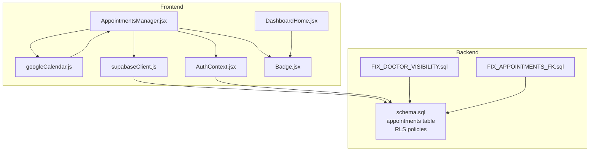
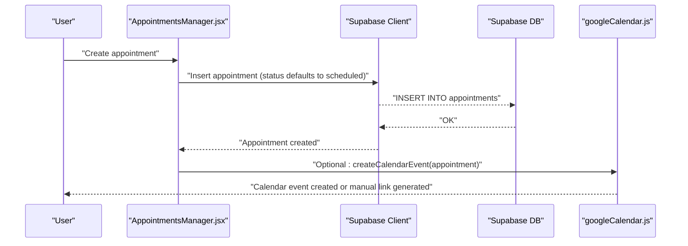
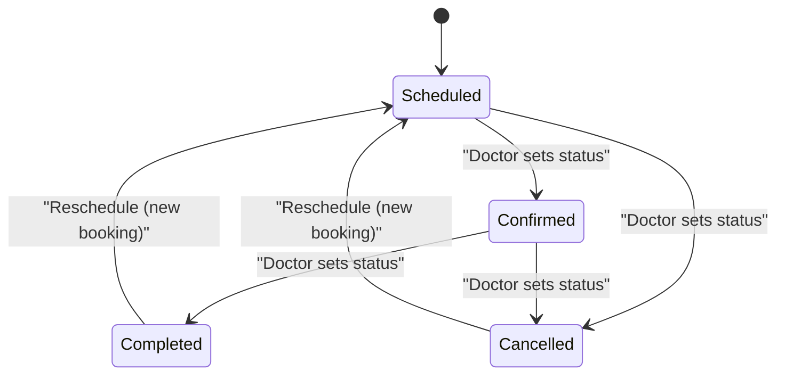
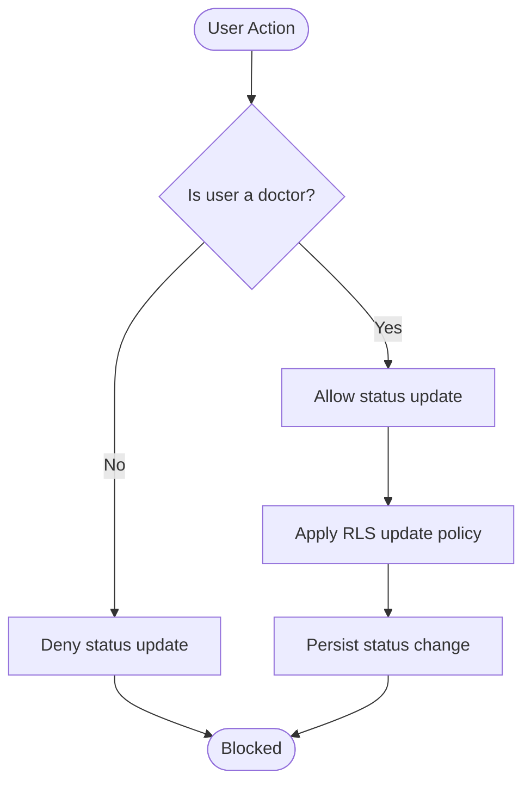
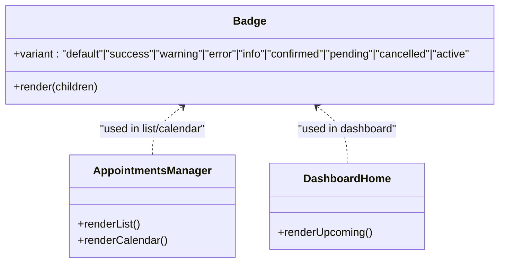
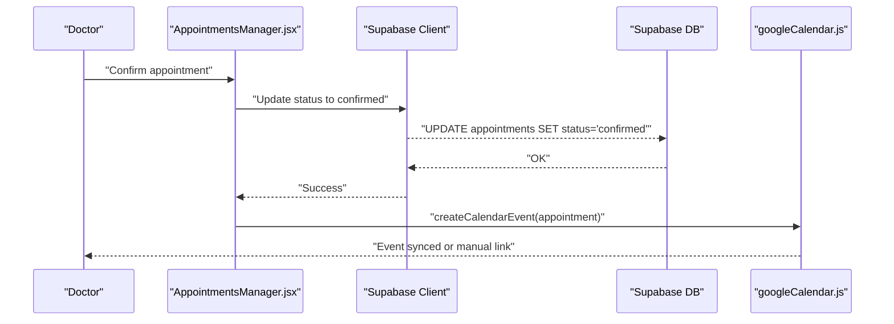
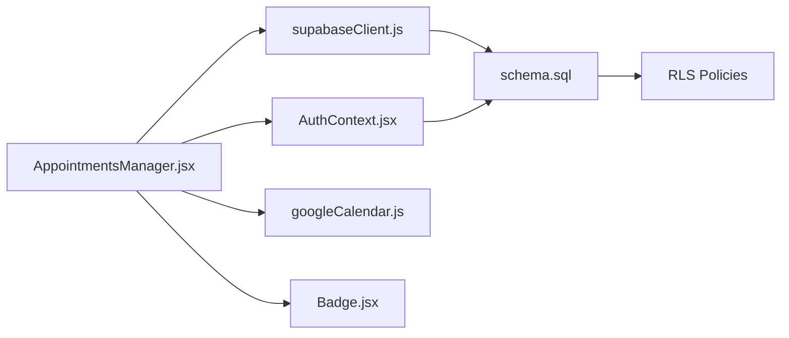

# Status Tracking & Management

<cite>
**Referenced Files in This Document**
- [AppointmentsManager.jsx](file://frontend/src/pages/AppointmentsManager.jsx)
- [googleCalendar.js](file://frontend/src/lib/googleCalendar.js)
- [supabaseClient.js](file://frontend/src/lib/supabaseClient.js)
- [AuthContext.jsx](file://frontend/src/context/AuthContext.jsx)
- [schema.sql](file://backend/schema.sql)
- [DashboardHome.jsx](file://frontend/src/pages/DashboardHome.jsx)
- [Badge.jsx](file://frontend/src/components/ui/Badge.jsx)
- [FIX_DOCTOR_VISIBILITY.sql](file://_trash/FIX_DOCTOR_VISIBILITY.sql)
- [FIX_APPOINTMENTS_FK.sql](file://_trash/FIX_APPOINTMENTS_FK.sql)
</cite>

## Table of Contents
1. [Introduction](#introduction)
2. [Project Structure](#project-structure)
3. [Core Components](#core-components)
4. [Architecture Overview](#architecture-overview)
5. [Detailed Component Analysis](#detailed-component-analysis)
6. [Dependency Analysis](#dependency-analysis)
7. [Performance Considerations](#performance-considerations)
8. [Troubleshooting Guide](#troubleshooting-guide)
9. [Conclusion](#conclusion)
10. [Appendices](#appendices)

## Introduction
This document describes the appointment status tracking and management system in MedVita. It explains the supported status lifecycle (scheduled, confirmed, completed, cancelled), who can modify statuses, how status changes are reflected in the UI (calendar and list views), and how status changes integrate with Google Calendar. It also outlines administrative controls, rescheduling procedures, cancellation policies, and the impact of status changes on capacity and scheduling conflicts.

## Project Structure
The status tracking system spans the frontend React application and the backend Supabase schema:
- Frontend: appointment listing, calendar/grid views, status badges, Google Calendar integration, and authentication context.
- Backend: Supabase tables and Row Level Security (RLS) policies governing who can view/update appointments.

**Diagram sources**
- [AppointmentsManager.jsx](file://frontend/src/pages/AppointmentsManager.jsx#L1-L577)
- [googleCalendar.js](file://frontend/src/lib/googleCalendar.js#L1-L199)
- [supabaseClient.js](file://frontend/src/lib/supabaseClient.js#L1-L11)
- [AuthContext.jsx](file://frontend/src/context/AuthContext.jsx#L1-L108)
- [Badge.jsx](file://frontend/src/components/ui/Badge.jsx#L1-L31)
- [DashboardHome.jsx](file://frontend/src/pages/DashboardHome.jsx#L460-L487)
- [schema.sql](file://backend/schema.sql#L137-L200)
- [FIX_DOCTOR_VISIBILITY.sql](file://_trash/FIX_DOCTOR_VISIBILITY.sql#L1-L63)
- [FIX_APPOINTMENTS_FK.sql](file://_trash/FIX_APPOINTMENTS_FK.sql#L1-L22)

**Section sources**
- [AppointmentsManager.jsx](file://frontend/src/pages/AppointmentsManager.jsx#L1-L577)
- [schema.sql](file://backend/schema.sql#L137-L200)

## Core Components
- Appointments Manager: Loads, renders, and interacts with appointments. Supports list and calendar views, and integrates with Google Calendar.
- Google Calendar Integration: Handles OAuth initialization, event creation, and generating calendar links.
- Supabase Client: Provides database connectivity and authentication state.
- Authentication Context: Supplies user and profile data, including role and calendar sync preferences.
- Badge Component: Renders status indicators with color-coded variants.
- Dashboard Home: Displays upcoming appointments with status badges.
- Backend Schema: Defines the appointments table and RLS policies controlling visibility and updates.

**Section sources**
- [AppointmentsManager.jsx](file://frontend/src/pages/AppointmentsManager.jsx#L1-L577)
- [googleCalendar.js](file://frontend/src/lib/googleCalendar.js#L1-L199)
- [supabaseClient.js](file://frontend/src/lib/supabaseClient.js#L1-L11)
- [AuthContext.jsx](file://frontend/src/context/AuthContext.jsx#L1-L108)
- [Badge.jsx](file://frontend/src/components/ui/Badge.jsx#L1-L31)
- [DashboardHome.jsx](file://frontend/src/pages/DashboardHome.jsx#L460-L487)
- [schema.sql](file://backend/schema.sql#L137-L200)

## Architecture Overview
The system follows a clear separation of concerns:
- Frontend renders UI and orchestrates user actions (book, view, sync).
- Backend enforces access control via RLS and stores appointment records.
- Google Calendar integration is optional and user-driven.

**Diagram sources**
- [AppointmentsManager.jsx](file://frontend/src/pages/AppointmentsManager.jsx#L134-L180)
- [googleCalendar.js](file://frontend/src/lib/googleCalendar.js#L125-L178)
- [supabaseClient.js](file://frontend/src/lib/supabaseClient.js#L1-L11)
- [schema.sql](file://backend/schema.sql#L137-L147)

## Detailed Component Analysis

### Status Lifecycle and Supported Values
- Status values are constrained to scheduled, completed, and cancelled.
- New appointments are created with status scheduled by default.
- Only authorized users (doctors) can update appointment status.

**Diagram sources**
- [schema.sql](file://backend/schema.sql#L146-L146)
- [AppointmentsManager.jsx](file://frontend/src/pages/AppointmentsManager.jsx#L142-L146)

**Section sources**
- [schema.sql](file://backend/schema.sql#L146-L146)
- [AppointmentsManager.jsx](file://frontend/src/pages/AppointmentsManager.jsx#L142-L146)

### Role-Based Status Modifications
- Doctors can update appointment status via the backend update policy.
- Patients and receptionists can view and book appointments but cannot directly update status.
- Receptionists can view patients linked to their employer doctor due to RLS joins.

**Diagram sources**
- [schema.sql](file://backend/schema.sql#L195-L199)
- [FIX_DOCTOR_VISIBILITY.sql](file://_trash/FIX_DOCTOR_VISIBILITY.sql#L43-L47)

**Section sources**
- [schema.sql](file://backend/schema.sql#L195-L199)
- [FIX_DOCTOR_VISIBILITY.sql](file://_trash/FIX_DOCTOR_VISIBILITY.sql#L43-L47)

### Visual Indicators for Statuses
- List view badges: status is rendered as a badge with color-coded variants.
- Dashboard widget: status badges use distinct colors for completed, cancelled, and others.
- Calendar/grid cells: appointments are visually differentiated by status colors.

**Diagram sources**
- [Badge.jsx](file://frontend/src/components/ui/Badge.jsx#L1-L31)
- [AppointmentsManager.jsx](file://frontend/src/pages/AppointmentsManager.jsx#L289-L289)
- [AppointmentsManager.jsx](file://frontend/src/pages/AppointmentsManager.jsx#L457-L462)
- [DashboardHome.jsx](file://frontend/src/pages/DashboardHome.jsx#L470-L477)

**Section sources**
- [Badge.jsx](file://frontend/src/components/ui/Badge.jsx#L1-L31)
- [AppointmentsManager.jsx](file://frontend/src/pages/AppointmentsManager.jsx#L289-L289)
- [AppointmentsManager.jsx](file://frontend/src/pages/AppointmentsManager.jsx#L457-L462)
- [DashboardHome.jsx](file://frontend/src/pages/DashboardHome.jsx#L470-L477)

### Status Filtering Capabilities
- The test plan indicates a status filter control exists in the UI and supports selecting “Pending” (mapped to scheduled in the system).
- While the filter UI is not shown in the provided file, the test steps demonstrate its presence and usage.

**Section sources**
- [testsprite_frontend_test_plan.json](file://frontend/testsprite_tests/testsprite_frontend_test_plan.json#L1130-L1151)

### Status-Based Notifications
- Notification toggles are present in the Settings modal, indicating notification preferences are configurable.
- No explicit status-change notification triggers are implemented in the provided files.

**Section sources**
- [SettingsModal.jsx](file://frontend/src/components/SettingsModal.jsx#L435-L446)

### Administrative Controls for Status Updates
- Doctors can update statuses via the backend update policy.
- Receptionists can view doctor-linked patients’ appointments due to RLS joins.

**Section sources**
- [schema.sql](file://backend/schema.sql#L195-L199)
- [schema.sql](file://backend/schema.sql#L168-L180)

### Rescheduling Procedures
- To reschedule, a doctor can cancel the current appointment (set status to cancelled) and create a new one with the desired date/time.
- The frontend inserts new appointments with status scheduled by default.

**Section sources**
- [AppointmentsManager.jsx](file://frontend/src/pages/AppointmentsManager.jsx#L134-L180)
- [schema.sql](file://backend/schema.sql#L146-L146)

### Cancellation Policies
- Cancellations are performed by setting the status to cancelled.
- The system does not enforce a separate cancellation reason field in the provided schema.

**Section sources**
- [schema.sql](file://backend/schema.sql#L146-L146)

### Integration with Notification Systems and Calendar Sync
- Google Calendar integration:
  - Optional OAuth-based event creation.
  - Manual calendar link generation for quick addition.
  - Doctor’s profile flag determines whether calendar sync is enabled.
- Notifications:
  - Notification preferences exist in settings; no explicit status-change notification logic is present in the provided files.

**Diagram sources**
- [AppointmentsManager.jsx](file://frontend/src/pages/AppointmentsManager.jsx#L134-L180)
- [googleCalendar.js](file://frontend/src/lib/googleCalendar.js#L125-L178)
- [schema.sql](file://backend/schema.sql#L146-L146)

**Section sources**
- [googleCalendar.js](file://frontend/src/lib/googleCalendar.js#L125-L178)
- [AppointmentsManager.jsx](file://frontend/src/pages/AppointmentsManager.jsx#L163-L171)

### Examples of Common Status Workflows
- Confirm an appointment:
  - Doctor updates status to confirmed; UI reflects green badge; optional calendar sync occurs.
- Cancel an appointment:
  - Doctor updates status to cancelled; UI reflects red badge; optional calendar sync occurs.
- Reschedule:
  - Doctor cancels current appointment, creates a new one with updated date/time.

**Section sources**
- [AppointmentsManager.jsx](file://frontend/src/pages/AppointmentsManager.jsx#L134-L180)
- [Badge.jsx](file://frontend/src/components/ui/Badge.jsx#L6-L14)

### Approval Processes
- The test plan references “Approve” or “Confirm” actions for pending/pending-like statuses, aligning with the system’s scheduled-to-confirmed workflow.

**Section sources**
- [testsprite_frontend_test_plan.json](file://frontend/testsprite_tests/testsprite_frontend_test_plan.json#L1140-L1151)

### Status Change Audit Trails
- The appointments table includes a created_at timestamp, enabling basic auditability by date.
- No dedicated audit log table is present in the provided schema.

**Section sources**
- [schema.sql](file://backend/schema.sql#L138-L141)

### Impact on Capacity Management and Scheduling Conflicts
- The frontend allows booking by clicking time slots in week view; unoccupied slots show a hover indicator for adding an appointment.
- The provided files do not reveal explicit capacity checks or conflict detection logic; conflicts may surface as errors during insertion.

**Section sources**
- [AppointmentsManager.jsx](file://frontend/src/pages/AppointmentsManager.jsx#L441-L445)

## Dependency Analysis
- Frontend depends on Supabase for data and authentication.
- RLS policies define who can view/update appointments.
- Google Calendar integration is optional and user-controlled.

**Diagram sources**
- [AppointmentsManager.jsx](file://frontend/src/pages/AppointmentsManager.jsx#L1-L577)
- [supabaseClient.js](file://frontend/src/lib/supabaseClient.js#L1-L11)
- [AuthContext.jsx](file://frontend/src/context/AuthContext.jsx#L1-L108)
- [googleCalendar.js](file://frontend/src/lib/googleCalendar.js#L1-L199)
- [Badge.jsx](file://frontend/src/components/ui/Badge.jsx#L1-L31)
- [schema.sql](file://backend/schema.sql#L137-L200)

**Section sources**
- [schema.sql](file://backend/schema.sql#L137-L200)
- [AppointmentsManager.jsx](file://frontend/src/pages/AppointmentsManager.jsx#L1-L577)

## Performance Considerations
- Calendar rendering iterates over time slots and days; ensure efficient filtering and memoization for large datasets.
- RLS adds minimal overhead; keep queries selective (by date and user) to reduce scan costs.
- Calendar sync requests are asynchronous; handle failures gracefully and provide fallback links.

## Troubleshooting Guide
- Missing appointment rows:
  - RLS policies may restrict visibility. Use the provided debug script to temporarily disable RLS for verification.
- Conflicts when booking:
  - If inserting an appointment fails, the system prevents double-booking; choose another slot or time.
- Google Calendar sync failures:
  - The frontend attempts to sync and falls back to a manual calendar link; re-authenticate or use the link.

**Section sources**
- [DEBUG_DISABLE_RLS.sql](file://_trash/DEBUG_DISABLE_RLS.sql#L1-L8)
- [AppointmentsManager.jsx](file://frontend/src/pages/AppointmentsManager.jsx#L163-L171)
- [googleCalendar.js](file://frontend/src/lib/googleCalendar.js#L125-L178)

## Conclusion
MedVita’s status tracking system centers on a simple lifecycle with role-based updates and strong access control via RLS. The UI clearly communicates status through badges, and optional Google Calendar integration enhances synchronization. While the system supports rescheduling and cancellation, explicit capacity management and conflict detection are not evident in the provided code; administrators should monitor bookings and guide users accordingly.

## Appendices

### Appendix A: Status Variants and Colors
- Confirmed: success/green
- Pending (mapped to scheduled): pending/orange
- Cancelled: cancelled/red
- Completed: completed/emerald

**Section sources**
- [Badge.jsx](file://frontend/src/components/ui/Badge.jsx#L6-L14)
- [DashboardHome.jsx](file://frontend/src/pages/DashboardHome.jsx#L470-L477)

### Appendix B: Backend Fixes and Constraints
- Doctor visibility fix ensures proper RLS for viewing doctor-linked patients’ appointments.
- Appointment foreign key adjustments accommodate dual identity for patient_id.

**Section sources**
- [FIX_DOCTOR_VISIBILITY.sql](file://_trash/FIX_DOCTOR_VISIBILITY.sql#L1-L63)
- [FIX_APPOINTMENTS_FK.sql](file://_trash/FIX_APPOINTMENTS_FK.sql#L1-L22)