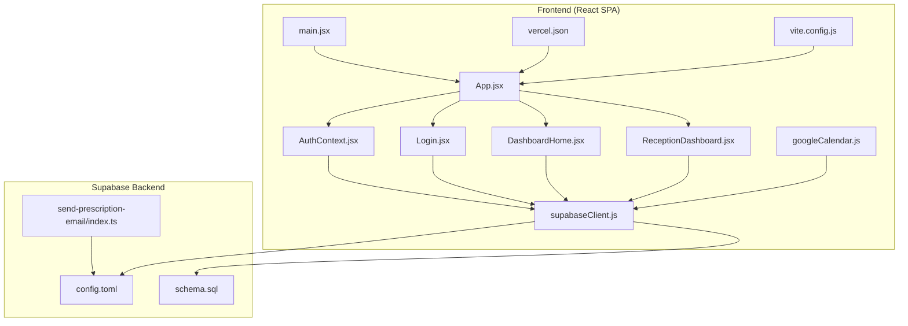
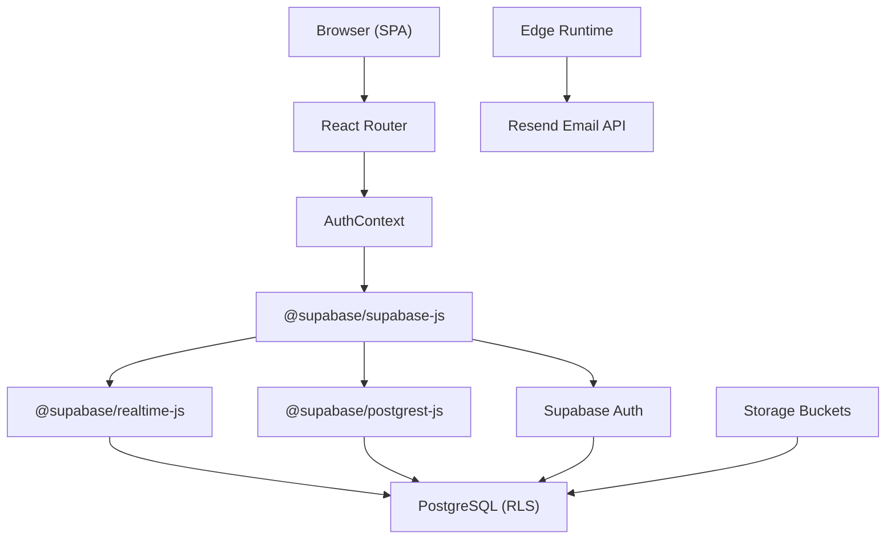
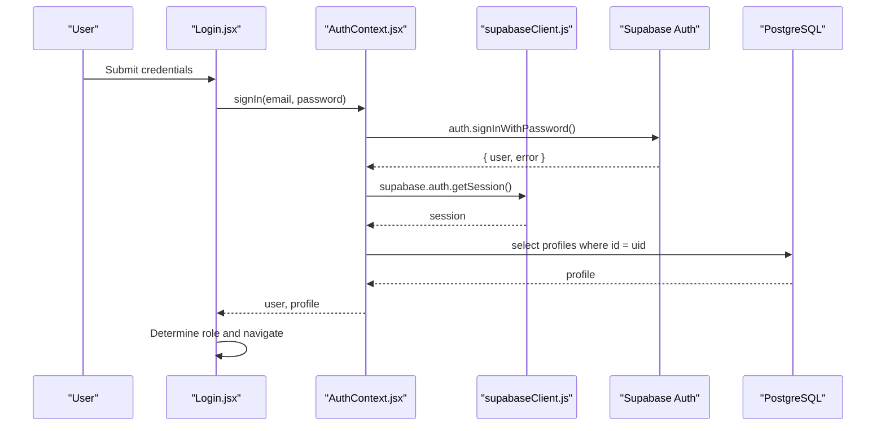
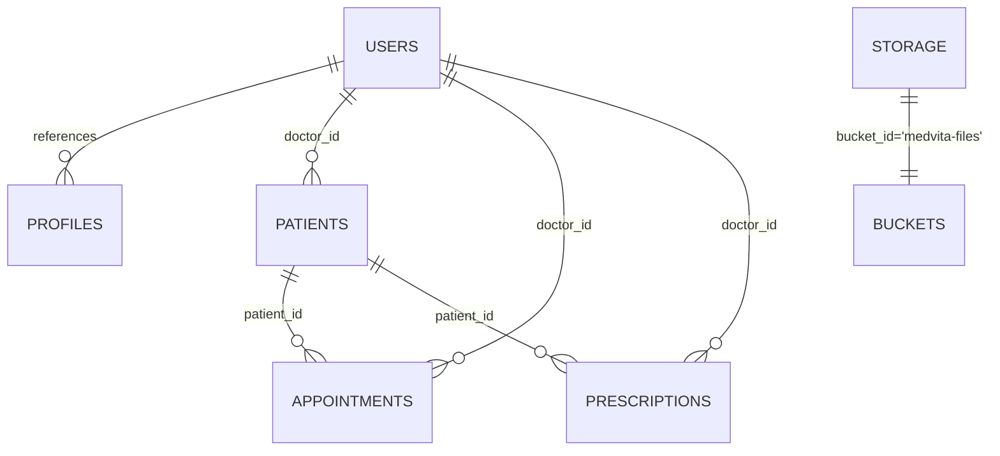
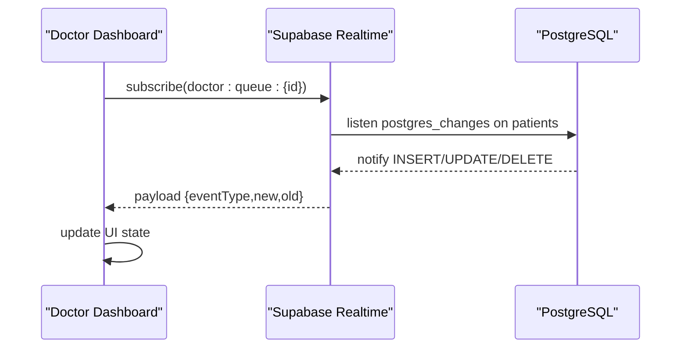
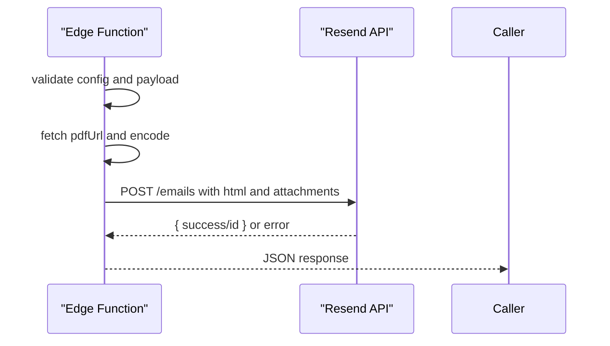
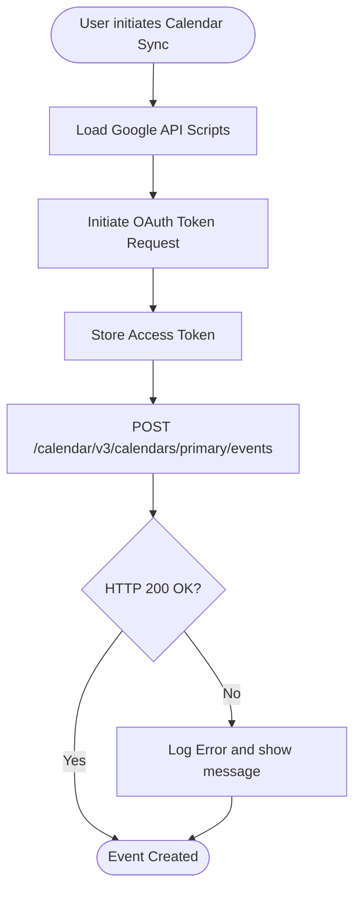
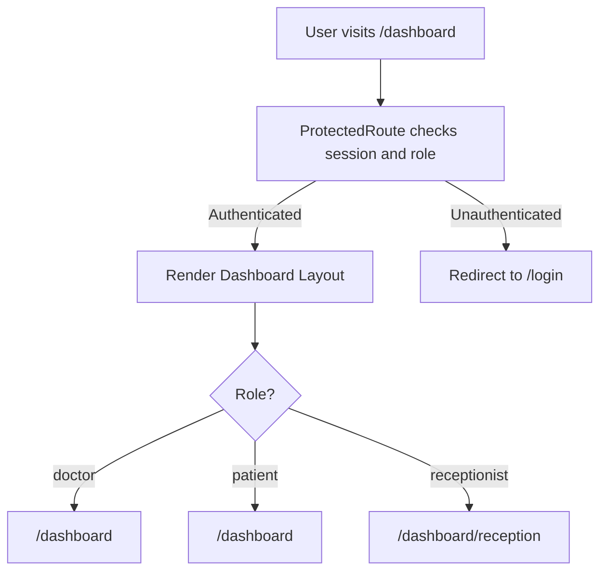
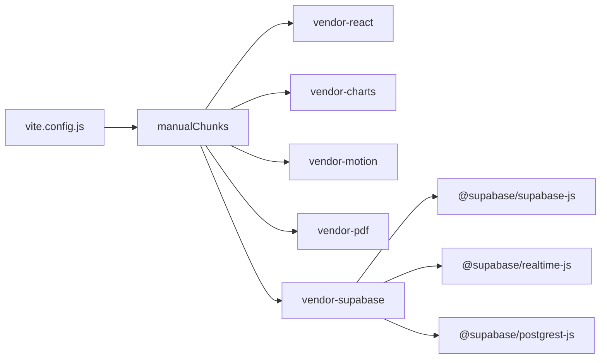

# Architecture Overview

<cite>
**Referenced Files in This Document**
- [frontend/src/lib/supabaseClient.js](file://frontend/src/lib/supabaseClient.js)
- [frontend/src/context/AuthContext.jsx](file://frontend/src/context/AuthContext.jsx)
- [frontend/src/pages/Login.jsx](file://frontend/src/pages/Login.jsx)
- [frontend/src/components/ProtectedRoute.jsx](file://frontend/src/components/ProtectedRoute.jsx)
- [frontend/src/pages/DashboardHome.jsx](file://frontend/src/pages/DashboardHome.jsx)
- [frontend/src/pages/ReceptionDashboard.jsx](file://frontend/src/pages/ReceptionDashboard.jsx)
- [frontend/src/lib/googleCalendar.js](file://frontend/src/lib/googleCalendar.js)
- [frontend/src/App.jsx](file://frontend/src/App.jsx)
- [frontend/src/main.jsx](file://frontend/src/main.jsx)
- [frontend/vercel.json](file://frontend/vercel.json)
- [frontend/vite.config.js](file://frontend/vite.config.js)
- [backend/schema.sql](file://backend/schema.sql)
- [supabase/functions/send-prescription-email/index.ts](file://supabase/functions/send-prescription-email/index.ts)
- [supabase/config.toml](file://supabase/config.toml)
</cite>

## Table of Contents
1. [Introduction](#introduction)
2. [Project Structure](#project-structure)
3. [Core Components](#core-components)
4. [Architecture Overview](#architecture-overview)
5. [Detailed Component Analysis](#detailed-component-analysis)
6. [Dependency Analysis](#dependency-analysis)
7. [Performance Considerations](#performance-considerations)
8. [Troubleshooting Guide](#troubleshooting-guide)
9. [Conclusion](#conclusion)

## Introduction
This document describes the system architecture of MedVita, a healthcare coordination platform built with a React frontend and a Supabase-powered backend. The architecture emphasizes:
- Clear separation of concerns: client-side rendering and routing in the React app, and server-side database operations and real-time events managed by Supabase.
- Authentication and authorization via Supabase Auth and Row Level Security (RLS).
- Real-time data synchronization using Supabase Realtime channels.
- Edge functions for email automation and external API integrations.
- Scalability, security, and deployment topology considerations.

## Project Structure
The repository is organized into three main areas:
- Frontend: React SPA with routing, context providers, UI components, and Supabase client initialization.
- Backend: SQL schema defining tables, policies, triggers, and storage configuration.
- Supabase Edge Functions: TypeScript-based functions for email automation and external service integrations.

**Diagram sources**
- [frontend/src/main.jsx](file://frontend/src/main.jsx#L1-L17)
- [frontend/src/App.jsx](file://frontend/src/App.jsx#L1-L62)
- [frontend/src/context/AuthContext.jsx](file://frontend/src/context/AuthContext.jsx#L1-L108)
- [frontend/src/pages/Login.jsx](file://frontend/src/pages/Login.jsx#L1-L204)
- [frontend/src/pages/DashboardHome.jsx](file://frontend/src/pages/DashboardHome.jsx#L1-L487)
- [frontend/src/pages/ReceptionDashboard.jsx](file://frontend/src/pages/ReceptionDashboard.jsx#L76-L113)
- [frontend/src/lib/supabaseClient.js](file://frontend/src/lib/supabaseClient.js#L1-L11)
- [frontend/src/lib/googleCalendar.js](file://frontend/src/lib/googleCalendar.js#L1-L199)
- [frontend/vercel.json](file://frontend/vercel.json#L1-L8)
- [frontend/vite.config.js](file://frontend/vite.config.js#L1-L33)
- [supabase/config.toml](file://supabase/config.toml#L1-L385)
- [backend/schema.sql](file://backend/schema.sql#L1-L274)
- [supabase/functions/send-prescription-email/index.ts](file://supabase/functions/send-prescription-email/index.ts#L1-L193)

**Section sources**
- [frontend/src/main.jsx](file://frontend/src/main.jsx#L1-L17)
- [frontend/src/App.jsx](file://frontend/src/App.jsx#L1-L62)
- [frontend/src/lib/supabaseClient.js](file://frontend/src/lib/supabaseClient.js#L1-L11)
- [supabase/config.toml](file://supabase/config.toml#L1-L385)
- [backend/schema.sql](file://backend/schema.sql#L1-L274)
- [supabase/functions/send-prescription-email/index.ts](file://supabase/functions/send-prescription-email/index.ts#L1-L193)

## Core Components
- Supabase client initialization and environment configuration for the frontend.
- Authentication context managing session state, profile retrieval, and sign-in/sign-out flows.
- Protected route enforcement with role-based access control.
- Real-time dashboards using Supabase channels for live updates.
- Edge function for automated email dispatch with PDF attachment.
- Google Calendar integration for external scheduling.

**Section sources**
- [frontend/src/lib/supabaseClient.js](file://frontend/src/lib/supabaseClient.js#L1-L11)
- [frontend/src/context/AuthContext.jsx](file://frontend/src/context/AuthContext.jsx#L1-L108)
- [frontend/src/components/ProtectedRoute.jsx](file://frontend/src/components/ProtectedRoute.jsx#L1-L108)
- [frontend/src/pages/DashboardHome.jsx](file://frontend/src/pages/DashboardHome.jsx#L1-L487)
- [frontend/src/pages/ReceptionDashboard.jsx](file://frontend/src/pages/ReceptionDashboard.jsx#L76-L113)
- [supabase/functions/send-prescription-email/index.ts](file://supabase/functions/send-prescription-email/index.ts#L1-L193)
- [frontend/src/lib/googleCalendar.js](file://frontend/src/lib/googleCalendar.js#L1-L199)

## Architecture Overview
The system follows a modern SPA pattern with Supabase as the backend-as-a-service:
- Frontend: React application bootstrapped with Vite, routed via React Router, and styled with Tailwind. It initializes the Supabase client and authenticates users via Supabase Auth.
- Backend: PostgreSQL-backed with Supabase Auth, RLS policies, and storage buckets. Triggers and policies enforce role-based visibility and data ownership.
- Realtime: Supabase Realtime channels power live dashboards for doctors and receptionists.
- Edge Functions: Supabase Edge Runtime executes TypeScript functions for email automation and external API integrations.
- Deployment: Static hosting via Vercel with SPA rewrites to index.html.

**Diagram sources**
- [frontend/src/main.jsx](file://frontend/src/main.jsx#L1-L17)
- [frontend/src/App.jsx](file://frontend/src/App.jsx#L1-L62)
- [frontend/src/context/AuthContext.jsx](file://frontend/src/context/AuthContext.jsx#L1-L108)
- [frontend/src/lib/supabaseClient.js](file://frontend/src/lib/supabaseClient.js#L1-L11)
- [supabase/config.toml](file://supabase/config.toml#L353-L362)
- [backend/schema.sql](file://backend/schema.sql#L1-L274)
- [supabase/functions/send-prescription-email/index.ts](file://supabase/functions/send-prescription-email/index.ts#L1-L193)

## Detailed Component Analysis

### Authentication and Authorization Flow
- Session management: The AuthContext checks the active session, subscribes to auth state changes, and loads the user’s profile from the profiles table.
- Sign-in: The Login page delegates authentication to Supabase and determines the role by querying the profile table to decide the redirect route.
- Role-based access control: ProtectedRoute enforces allowed roles and ensures users land on the correct home route based on role.

**Diagram sources**
- [frontend/src/pages/Login.jsx](file://frontend/src/pages/Login.jsx#L20-L75)
- [frontend/src/context/AuthContext.jsx](file://frontend/src/context/AuthContext.jsx#L14-L61)
- [frontend/src/lib/supabaseClient.js](file://frontend/src/lib/supabaseClient.js#L1-L11)
- [backend/schema.sql](file://backend/schema.sql#L4-L14)

**Section sources**
- [frontend/src/pages/Login.jsx](file://frontend/src/pages/Login.jsx#L1-L204)
- [frontend/src/context/AuthContext.jsx](file://frontend/src/context/AuthContext.jsx#L1-L108)
- [frontend/src/components/ProtectedRoute.jsx](file://frontend/src/components/ProtectedRoute.jsx#L1-L108)
- [backend/schema.sql](file://backend/schema.sql#L30-L44)

### Role-Based Access Control (RBAC) and Data Ownership
- Roles: doctor, patient, receptionist are defined in the profiles table and enforced by RLS policies.
- Policies:
  - Profiles: select is public; insert/update scoped to the authenticated user.
  - Patients: doctors can view/manage their own; receptionists can view/manage for their employer; patients can view by email.
  - Appointments: selective visibility for patients/doctors and controlled insert/update.
  - Prescriptions: doctors can manage; patients can view based on patient record linkage.
  - Storage: authenticated users can upload/view files in the medvita-files bucket.

**Diagram sources**
- [backend/schema.sql](file://backend/schema.sql#L4-L274)

**Section sources**
- [backend/schema.sql](file://backend/schema.sql#L30-L274)

### Real-Time Data Synchronization
- Doctor dashboard: Subscribes to a Realtime channel for the doctor’s queue and updates the UI on INSERT/UPDATE/DELETE events.
- Reception dashboard: Subscribes to a Realtime channel scoped to the employer doctor to track today’s patients.

**Diagram sources**
- [frontend/src/pages/DashboardHome.jsx](file://frontend/src/pages/DashboardHome.jsx#L45-L76)
- [frontend/src/pages/ReceptionDashboard.jsx](file://frontend/src/pages/ReceptionDashboard.jsx#L76-L113)

**Section sources**
- [frontend/src/pages/DashboardHome.jsx](file://frontend/src/pages/DashboardHome.jsx#L1-L487)
- [frontend/src/pages/ReceptionDashboard.jsx](file://frontend/src/pages/ReceptionDashboard.jsx#L76-L113)

### Edge Functions: Email Automation
- Function: send-prescription-email
  - Triggered via HTTP request with JSON payload containing patient and doctor details.
  - Downloads a PDF from a URL, encodes it, and sends an HTML email via Resend.
  - Returns structured JSON responses and logs errors.

**Diagram sources**
- [supabase/functions/send-prescription-email/index.ts](file://supabase/functions/send-prescription-email/index.ts#L25-L193)

**Section sources**
- [supabase/functions/send-prescription-email/index.ts](file://supabase/functions/send-prescription-email/index.ts#L1-L193)

### External API Integrations: Google Calendar
- The frontend integrates with Google Calendar via OAuth and the Calendar API.
- It supports sign-in, event creation, and generating calendar links without requiring server-side tokens.

**Diagram sources**
- [frontend/src/lib/googleCalendar.js](file://frontend/src/lib/googleCalendar.js#L15-L105)
- [frontend/src/lib/googleCalendar.js](file://frontend/src/lib/googleCalendar.js#L126-L178)

**Section sources**
- [frontend/src/lib/googleCalendar.js](file://frontend/src/lib/googleCalendar.js#L1-L199)

### Frontend Routing and SPA Deployment
- React Router manages protected routes and role-specific dashboards.
- Vercel rewrites all routes to index.html to support client-side routing.

**Diagram sources**
- [frontend/src/App.jsx](file://frontend/src/App.jsx#L26-L58)
- [frontend/src/components/ProtectedRoute.jsx](file://frontend/src/components/ProtectedRoute.jsx#L53-L106)
- [frontend/vercel.json](file://frontend/vercel.json#L1-L8)

**Section sources**
- [frontend/src/App.jsx](file://frontend/src/App.jsx#L1-L62)
- [frontend/src/components/ProtectedRoute.jsx](file://frontend/src/components/ProtectedRoute.jsx#L1-L108)
- [frontend/vercel.json](file://frontend/vercel.json#L1-L8)

## Dependency Analysis
- Frontend dependencies include @supabase/supabase-js, @supabase/realtime-js, @supabase/postgrest-js, React, React Router, and UI libraries.
- Build-time optimization groups vendor bundles for React, charts, motion, PDF generation, and Supabase client.
- Supabase configuration enables Edge Runtime, Realtime, and Studio for local development and runtime features.

**Diagram sources**
- [frontend/vite.config.js](file://frontend/vite.config.js#L11-L26)

**Section sources**
- [frontend/package.json](file://frontend/package.json#L13-L32)
- [frontend/vite.config.js](file://frontend/vite.config.js#L1-L33)
- [supabase/config.toml](file://supabase/config.toml#L353-L362)

## Performance Considerations
- Realtime subscriptions: Use targeted filters (e.g., doctor_id) to minimize payload and improve responsiveness.
- Client-side caching: Persist minimal user/session state in memory to reduce repeated queries.
- Chunking and lazy loading: Keep bundle sizes manageable with Vite’s manualChunks configuration.
- Edge function cold starts: Consider keeping the function warm or invoking periodically if latency-sensitive.
- Storage uploads: Use Supabase storage with appropriate limits and consider CDN caching for static assets.

## Troubleshooting Guide
- Missing environment variables: The Supabase client warns if URL or anon key are missing; ensure .env.local is configured.
- Auth state changes: The AuthContext listens for auth state changes; verify browser cookies/local storage and CORS settings.
- Realtime connectivity: Channels log connection status; if SUBSCRIBE fails, fall back to polling or refresh.
- Edge function errors: Inspect function logs for configuration errors (e.g., missing API key) or HTTP errors from external services.
- ProtectedRoute navigation: If redirected to unauthorized page, verify profile role and allowedRoles prop.

**Section sources**
- [frontend/src/lib/supabaseClient.js](file://frontend/src/lib/supabaseClient.js#L6-L8)
- [frontend/src/context/AuthContext.jsx](file://frontend/src/context/AuthContext.jsx#L25-L41)
- [frontend/src/pages/ReceptionDashboard.jsx](file://frontend/src/pages/ReceptionDashboard.jsx#L104-L110)
- [supabase/functions/send-prescription-email/index.ts](file://supabase/functions/send-prescription-email/index.ts#L41-L46)

## Conclusion
MedVita’s architecture cleanly separates client-side rendering and routing from server-side database operations and real-time updates. Supabase Auth and RLS provide robust authentication and fine-grained access control, while Supabase Realtime powers live dashboards. Edge functions encapsulate email automation and external integrations, and the frontend is optimized for performance and scalability. The deployment topology leverages Vercel for static hosting with SPA routing, ensuring a responsive and secure user experience.