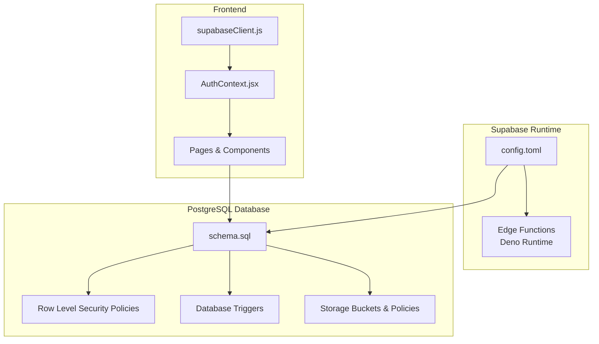
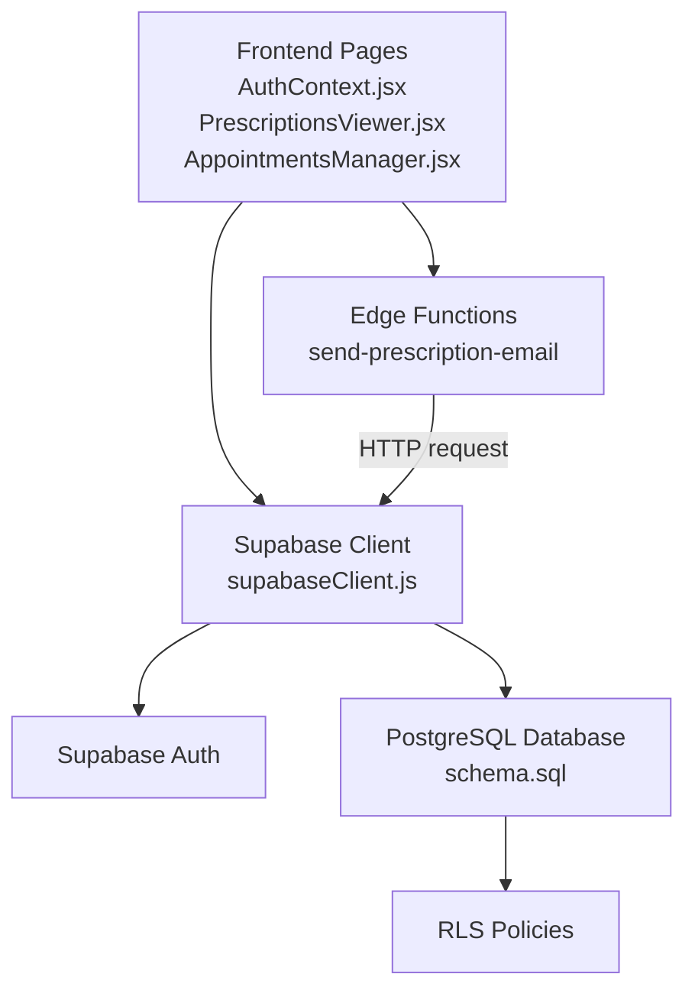
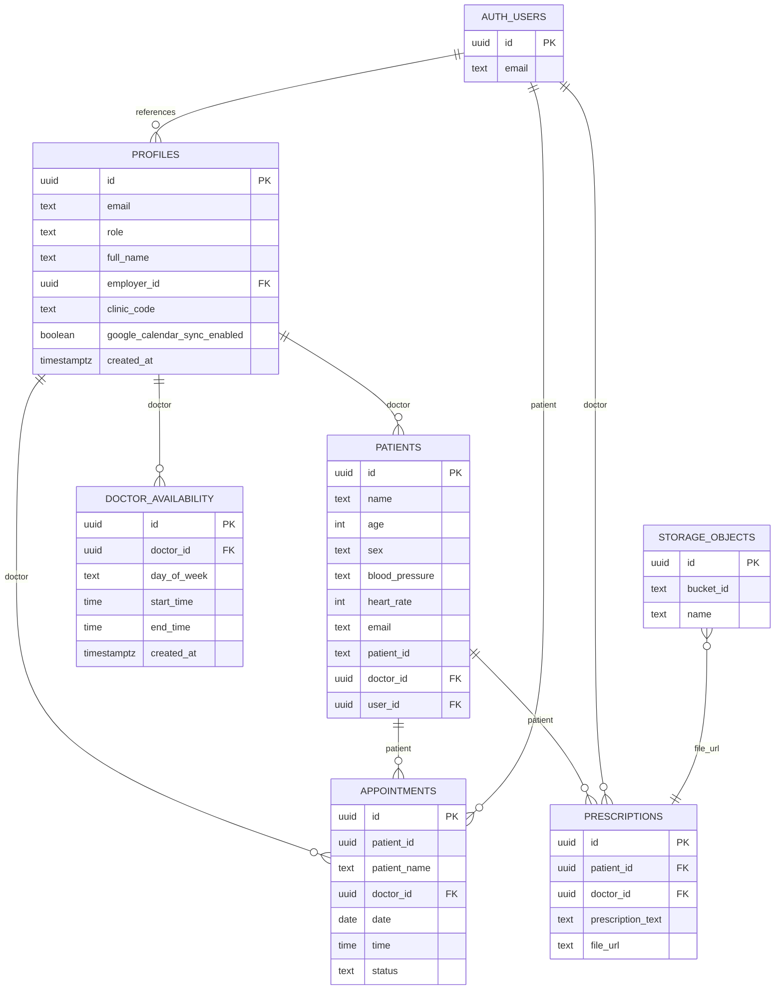
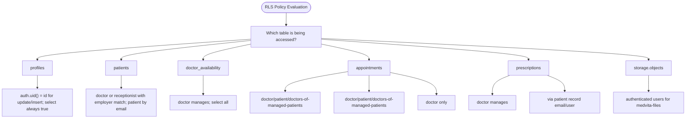
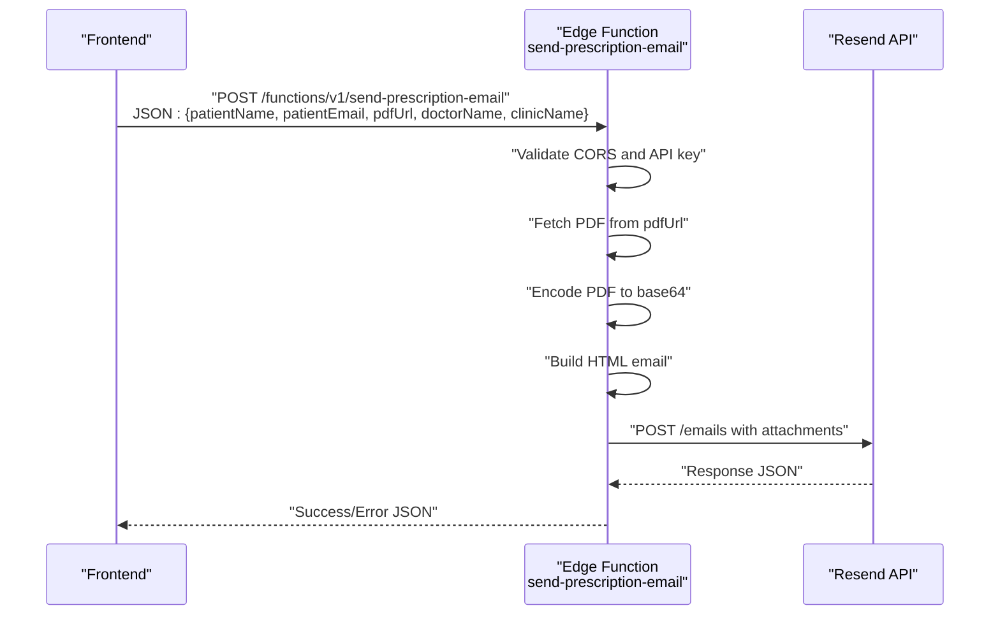
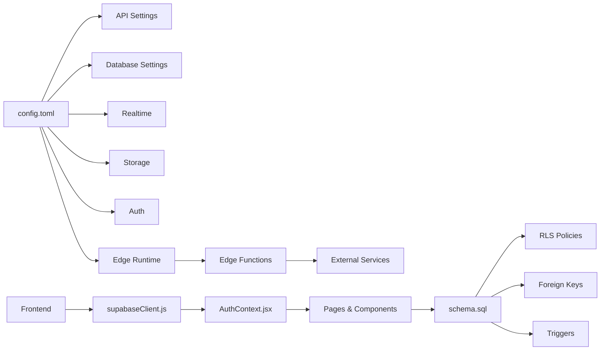

# Backend Architecture

<cite>
**Referenced Files in This Document**
- [config.toml](file://supabase/config.toml)
- [schema.sql](file://backend/schema.sql)
- [index.ts](file://supabase/functions/send-prescription-email/index.ts)
- [supabaseClient.js](file://frontend/src/lib/supabaseClient.js)
- [AuthContext.jsx](file://frontend/src/context/AuthContext.jsx)
- [PrescriptionsViewer.jsx](file://frontend/src/pages/PrescriptionsViewer.jsx)
- [AppointmentsManager.jsx](file://frontend/src/pages/AppointmentsManager.jsx)
- [DEBUG_DISABLE_RLS.sql](file://_trash/DEBUG_DISABLE_RLS.sql)
- [FIX_APPOINTMENTS_FK.sql](file://_trash/FIX_APPOINTMENTS_FK.sql)
- [FIX_DOCTOR_VISIBILITY.sql](file://_trash/FIX_DOCTOR_VISIBILITY.sql)
- [.env.local](file://frontend/.env.local)
</cite>

## Table of Contents
1. [Introduction](#introduction)
2. [Project Structure](#project-structure)
3. [Core Components](#core-components)
4. [Architecture Overview](#architecture-overview)
5. [Detailed Component Analysis](#detailed-component-analysis)
6. [Dependency Analysis](#dependency-analysis)
7. [Performance Considerations](#performance-considerations)
8. [Troubleshooting Guide](#troubleshooting-guide)
9. [Conclusion](#conclusion)
10. [Appendices](#appendices)

## Introduction
This document describes the backend architecture of MedVita’s Supabase-based system. It focuses on the database-first design with PostgreSQL schema, Row Level Security (RLS) policies, Supabase Edge Functions for serverless logic, Supabase configuration management, and the separation of client-side versus server-side logic. It also covers real-time capabilities, scalability, optimization strategies, backup/recovery, and deployment architecture.

## Project Structure
The backend is organized around:
- Supabase configuration and runtime settings
- PostgreSQL schema with tables, policies, and triggers
- Edge Functions for serverless tasks
- Frontend integration via Supabase client libraries

**Diagram sources**
- [config.toml](file://supabase/config.toml#L1-L385)
- [schema.sql](file://backend/schema.sql#L1-L274)
- [supabaseClient.js](file://frontend/src/lib/supabaseClient.js#L1-L11)
- [AuthContext.jsx](file://frontend/src/context/AuthContext.jsx#L1-L108)
- [PrescriptionsViewer.jsx](file://frontend/src/pages/PrescriptionsViewer.jsx#L1-L273)
- [AppointmentsManager.jsx](file://frontend/src/pages/AppointmentsManager.jsx#L1-L577)

**Section sources**
- [config.toml](file://supabase/config.toml#L1-L385)
- [schema.sql](file://backend/schema.sql#L1-L274)
- [supabaseClient.js](file://frontend/src/lib/supabaseClient.js#L1-L11)
- [AuthContext.jsx](file://frontend/src/context/AuthContext.jsx#L1-L108)
- [PrescriptionsViewer.jsx](file://frontend/src/pages/PrescriptionsViewer.jsx#L1-L273)
- [AppointmentsManager.jsx](file://frontend/src/pages/AppointmentsManager.jsx#L1-L577)

## Core Components
- Supabase configuration defines API, database, realtime, storage, auth, edge runtime, analytics, and experimental settings.
- PostgreSQL schema defines core entities (profiles, patients, doctor availability, appointments, prescriptions), foreign keys, and RLS policies.
- Edge Functions implement serverless logic (e.g., sending prescriptions via email).
- Frontend integrates with Supabase client for auth, queries, and real-time subscriptions.

**Section sources**
- [config.toml](file://supabase/config.toml#L7-L385)
- [schema.sql](file://backend/schema.sql#L4-L274)
- [index.ts](file://supabase/functions/send-prescription-email/index.ts#L1-L193)
- [supabaseClient.js](file://frontend/src/lib/supabaseClient.js#L1-L11)

## Architecture Overview
The system follows a database-first approach:
- PostgreSQL schema defines entities and access controls.
- Supabase Auth manages identities and sessions.
- Supabase Edge Functions process events and external integrations.
- Frontend uses Supabase client for secure, policy-enforced reads/writes.

**Diagram sources**
- [AuthContext.jsx](file://frontend/src/context/AuthContext.jsx#L1-L108)
- [PrescriptionsViewer.jsx](file://frontend/src/pages/PrescriptionsViewer.jsx#L1-L273)
- [AppointmentsManager.jsx](file://frontend/src/pages/AppointmentsManager.jsx#L1-L577)
- [supabaseClient.js](file://frontend/src/lib/supabaseClient.js#L1-L11)
- [schema.sql](file://backend/schema.sql#L4-L274)
- [index.ts](file://supabase/functions/send-prescription-email/index.ts#L1-L193)

## Detailed Component Analysis

### Database Schema and Relationships
The schema defines core entities and their relationships:
- profiles: Extends Supabase Auth users; roles include doctor, patient, receptionist; supports employer linkage for receptionists.
- patients: Linked to profiles and doctors; includes demographic and health metrics.
- doctor_availability: Per-doctor weekly schedule.
- appointments: Scheduling records with flexible patient identity; includes status and caching of names.
- prescriptions: Documents linked to patients and doctors; supports file_url for stored documents.
- storage: A bucket medvita-files with authenticated upload/view policies.

**Diagram sources**
- [schema.sql](file://backend/schema.sql#L4-L274)

**Section sources**
- [schema.sql](file://backend/schema.sql#L4-L274)

### Row Level Security (RLS) Policies
RLS ensures data access is enforced at the database level:
- profiles: Users can view all profiles; insert/update own profile.
- patients: Doctors and receptionists with matching employer can view/manage; patients can view by email.
- doctor_availability: Doctors manage; everyone can view.
- appointments: Select for doctor/patient/doctors-of-managed-patients; insert for doctor/patient/doctors-of-managed-patients; update restricted to doctor.
- prescriptions: Doctors manage; patients can view via patient record linkage.
- storage.objects: Authenticated users can upload/view in medvita-files bucket.

**Diagram sources**
- [schema.sql](file://backend/schema.sql#L30-L238)

**Section sources**
- [schema.sql](file://backend/schema.sql#L30-L238)

### Supabase Configuration (config.toml)
Key areas:
- API: exposed schemas, search_path, max rows.
- Database: ports, health timeout, major version, optional pooler.
- Realtime: enabled.
- Studio: port and API URL.
- Inbucket: local email testing UI.
- Storage: limits, S3 protocol enabled.
- Auth: site URL, redirect URLs, JWT expiry, refresh token rotation, rate limits, email/SMS toggles, external providers.
- Edge runtime: enabled, policy, inspector port, Deno version.
- Analytics: enabled, port, backend.

Security and operational implications:
- Restrict network access via allowed CIDRs if enabled.
- Use signed keys and environment substitution for secrets.
- Keep auth rate limits aligned with expected traffic.
- Enable edge runtime for serverless functions.

**Section sources**
- [config.toml](file://supabase/config.toml#L7-L385)

### Edge Functions: send-prescription-email
Purpose:
- Accepts a JSON payload with patient and doctor details and a PDF URL.
- Downloads the PDF, encodes it, composes an HTML email, and sends via Resend.
- Returns structured JSON responses and logs errors.

Processing logic:
- Validates CORS and presence of API key.
- Fetches and encodes PDF.
- Builds HTML email content.
- Sends to Resend and returns success/error.

**Diagram sources**
- [index.ts](file://supabase/functions/send-prescription-email/index.ts#L25-L192)

**Section sources**
- [index.ts](file://supabase/functions/send-prescription-email/index.ts#L1-L193)

### Frontend Integration and Separation of Concerns
- supabaseClient.js initializes the Supabase client with environment variables and guards missing keys.
- AuthContext.jsx manages auth state, listens to auth changes, and fetches profile data.
- PrescriptionsViewer.jsx and AppointmentsManager.jsx perform data access using Supabase client:
  - PrescriptionsViewer.jsx uses role-aware queries and joins to enrich data.
  - AppointmentsManager.jsx filters by user identity and handles doctor/patient views.

Security implications:
- Queries are executed under the authenticated session; RLS enforces access.
- Client code should not construct sensitive queries that bypass RLS.
- Environment variables are used for Supabase URL and anon key.

**Section sources**
- [supabaseClient.js](file://frontend/src/lib/supabaseClient.js#L1-L11)
- [AuthContext.jsx](file://frontend/src/context/AuthContext.jsx#L1-L108)
- [PrescriptionsViewer.jsx](file://frontend/src/pages/PrescriptionsViewer.jsx#L1-L273)
- [AppointmentsManager.jsx](file://frontend/src/pages/AppointmentsManager.jsx#L1-L577)
- [.env.local](file://frontend/.env.local#L1-L5)

### Realtime Capabilities
- Realtime is enabled in config.toml.
- Frontend components use Supabase client to subscribe to auth state and data streams.
- Typical pattern: subscribe to tables/channels, listen for inserts/updates/deletes, and update UI accordingly.

[No sources needed since this section provides general guidance]

### Database Optimization Strategies
- Indexes: Add indexes on frequently filtered columns (e.g., doctor_id, patient_id, email).
- Policies: Keep RLS policies efficient; avoid expensive subqueries in policies.
- Queries: Use targeted selects and joins; leverage foreign keys to minimize scans.
- Storage: Limit file sizes and enable compression where appropriate.

[No sources needed since this section provides general guidance]

### Backup and Recovery Procedures
- Use Supabase’s built-in backup/restore mechanisms for managed environments.
- For local development, export schema and data periodically.
- Maintain separate environments for dev/staging/prod with distinct credentials.

[No sources needed since this section provides general guidance]

## Dependency Analysis
Supabase configuration governs runtime behavior and security posture. The schema defines data dependencies and access control. Edge functions depend on environment variables and external APIs. Frontend depends on Supabase client initialization and environment variables.

**Diagram sources**
- [config.toml](file://supabase/config.toml#L7-L385)
- [schema.sql](file://backend/schema.sql#L4-L274)
- [supabaseClient.js](file://frontend/src/lib/supabaseClient.js#L1-L11)
- [AuthContext.jsx](file://frontend/src/context/AuthContext.jsx#L1-L108)
- [PrescriptionsViewer.jsx](file://frontend/src/pages/PrescriptionsViewer.jsx#L1-L273)
- [AppointmentsManager.jsx](file://frontend/src/pages/AppointmentsManager.jsx#L1-L577)
- [index.ts](file://supabase/functions/send-prescription-email/index.ts#L1-L193)

**Section sources**
- [config.toml](file://supabase/config.toml#L7-L385)
- [schema.sql](file://backend/schema.sql#L4-L274)
- [supabaseClient.js](file://frontend/src/lib/supabaseClient.js#L1-L11)
- [AuthContext.jsx](file://frontend/src/context/AuthContext.jsx#L1-L108)
- [PrescriptionsViewer.jsx](file://frontend/src/pages/PrescriptionsViewer.jsx#L1-L273)
- [AppointmentsManager.jsx](file://frontend/src/pages/AppointmentsManager.jsx#L1-L577)
- [index.ts](file://supabase/functions/send-prescription-email/index.ts#L1-L193)

## Performance Considerations
- Use targeted queries with equality filters on indexed columns.
- Minimize payload sizes; paginate and limit results.
- Prefer server-side joins and RLS over client-side filtering.
- Cache static data where appropriate; rely on Supabase cache for repeated reads.
- Monitor Edge Function cold starts and optimize initialization.

[No sources needed since this section provides general guidance]

## Troubleshooting Guide
Common issues and remedies:
- Appointments visibility problems:
  - Disable RLS temporarily to verify data existence.
  - Recreate comprehensive SELECT/INSERT/UPDATE policies.
  - Ensure foreign key constraints are correct and patient_name column exists.
- Auth/sign-up inconsistencies:
  - Confirm auth settings (site URL, redirect URLs, rate limits).
  - Verify environment variables for Supabase URL/anon key.
- Edge Function failures:
  - Check API key presence and network connectivity.
  - Inspect function logs and response payloads.

**Section sources**
- [DEBUG_DISABLE_RLS.sql](file://_trash/DEBUG_DISABLE_RLS.sql#L1-L9)
- [FIX_APPOINTMENTS_FK.sql](file://_trash/FIX_APPOINTMENTS_FK.sql#L1-L22)
- [FIX_DOCTOR_VISIBILITY.sql](file://_trash/FIX_DOCTOR_VISIBILITY.sql#L1-L63)
- [.env.local](file://frontend/.env.local#L1-L5)

## Conclusion
MedVita’s backend leverages a robust database-first design with Supabase. PostgreSQL schema and RLS enforce strict access control, while Edge Functions handle serverless tasks. Supabase configuration governs runtime behavior and security. Frontend components integrate securely with Supabase client, ensuring separation of concerns and strong data access patterns.

[No sources needed since this section summarizes without analyzing specific files]

## Appendices

### Deployment Architecture
- Local development: Supabase CLI with config.toml, local database, realtime, studio, and edge runtime.
- Production: Managed Supabase project with configured auth providers, storage, and external integrations.
- External services: Edge functions integrate with Resend for email delivery; optional Google Calendar sync from frontend.

[No sources needed since this section provides general guidance]