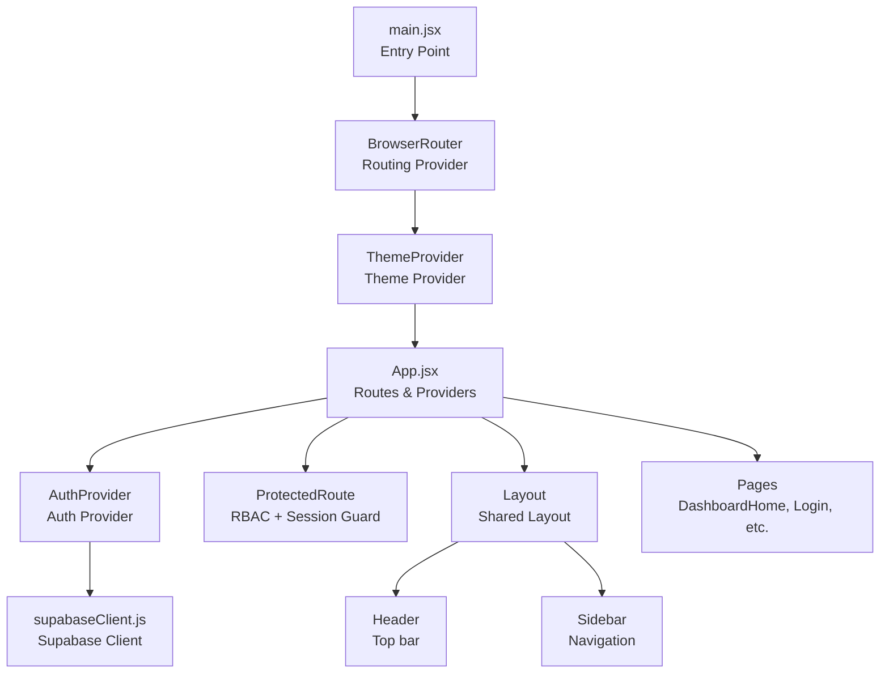
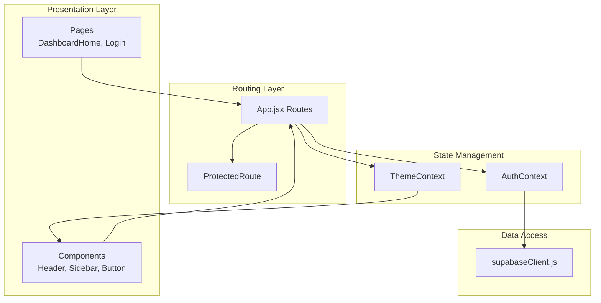
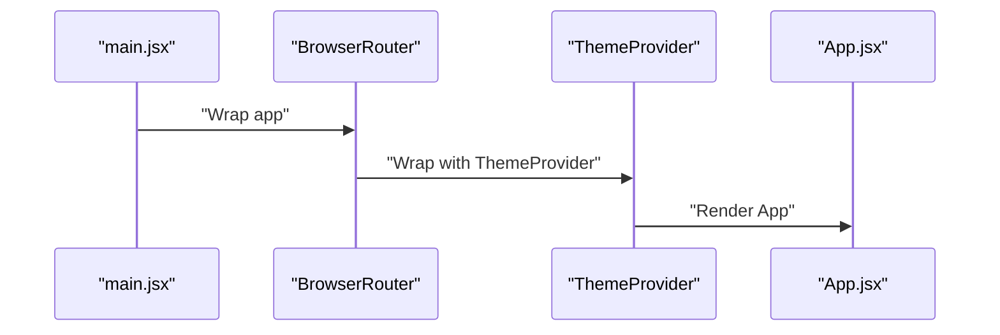
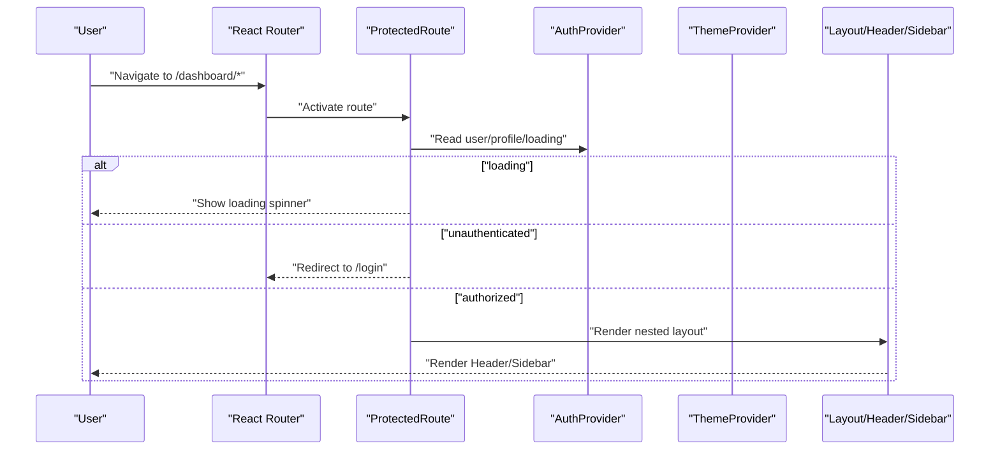
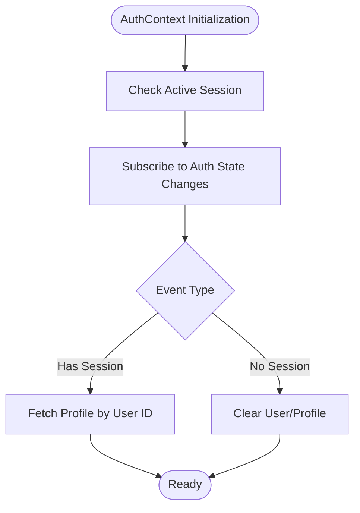
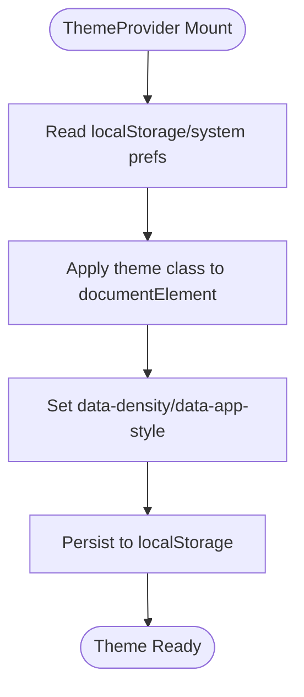
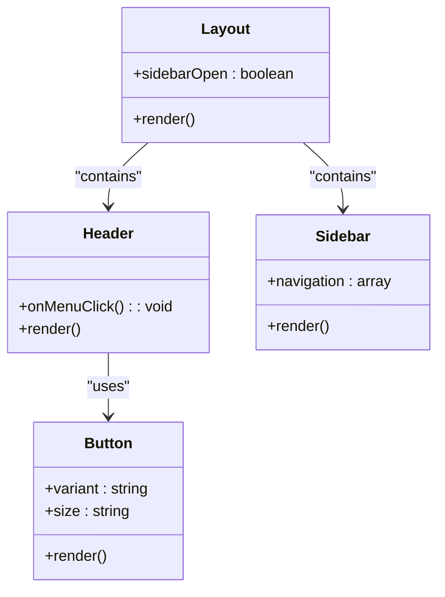
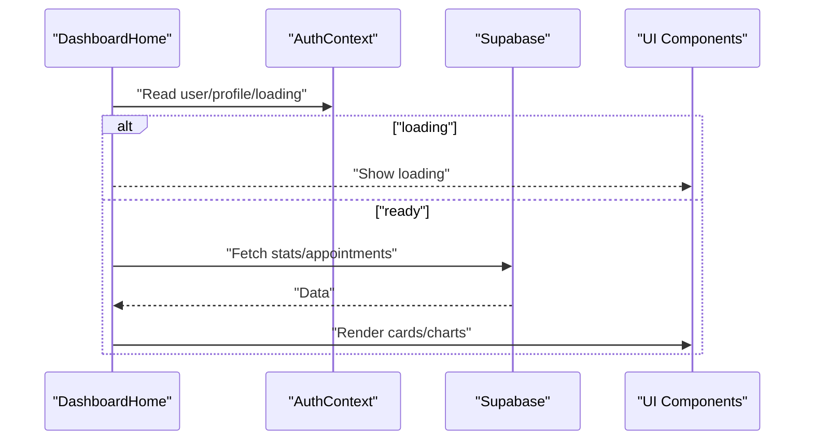
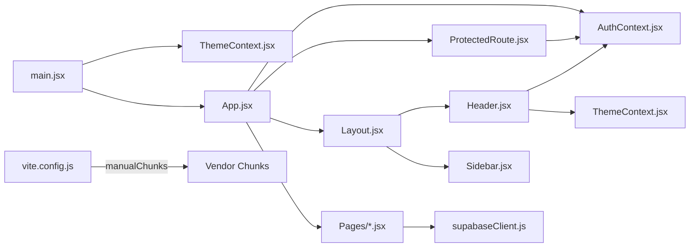

# Frontend Architecture

<cite>
**Referenced Files in This Document**
- [main.jsx](file://frontend/src/main.jsx)
- [App.jsx](file://frontend/src/App.jsx)
- [AuthContext.jsx](file://frontend/src/context/AuthContext.jsx)
- [ThemeContext.jsx](file://frontend/src/context/ThemeContext.jsx)
- [ProtectedRoute.jsx](file://frontend/src/components/ProtectedRoute.jsx)
- [Layout.jsx](file://frontend/src/components/Layout.jsx)
- [Header.jsx](file://frontend/src/components/Header.jsx)
- [Sidebar.jsx](file://frontend/src/components/Sidebar.jsx)
- [Button.jsx](file://frontend/src/components/ui/Button.jsx)
- [supabaseClient.js](file://frontend/src/lib/supabaseClient.js)
- [DashboardHome.jsx](file://frontend/src/pages/DashboardHome.jsx)
- [Login.jsx](file://frontend/src/pages/Login.jsx)
- [vite.config.js](file://frontend/vite.config.js)
</cite>

## Table of Contents
1. [Introduction](#introduction)
2. [Project Structure](#project-structure)
3. [Core Components](#core-components)
4. [Architecture Overview](#architecture-overview)
5. [Detailed Component Analysis](#detailed-component-analysis)
6. [Dependency Analysis](#dependency-analysis)
7. [Performance Considerations](#performance-considerations)
8. [Troubleshooting Guide](#troubleshooting-guide)
9. [Conclusion](#conclusion)

## Introduction
This document describes the frontend architecture of MedVita’s React application. It traces the initialization flow from the entry point through routing, authentication, theming, and page components. It also documents the context provider pattern for global state, the routing strategy with protected routes, reusable UI components, styling with Tailwind CSS, and integration with the Supabase client for authentication and database operations. Architectural patterns such as higher-order components, custom hooks, and state management strategies are explained, along with performance considerations and code-splitting opportunities.

## Project Structure
The frontend is organized around a clear separation of concerns:
- Entry point initializes providers and router.
- Routing defines public and protected routes with nested layouts.
- Context providers manage authentication and theme state.
- UI components are composed into shared layouts and page-specific views.
- Supabase client encapsulates database and auth operations.

**Diagram sources**
- [main.jsx](file://frontend/src/main.jsx#L1-L17)
- [App.jsx](file://frontend/src/App.jsx#L1-L62)
- [AuthContext.jsx](file://frontend/src/context/AuthContext.jsx#L1-L108)
- [ThemeContext.jsx](file://frontend/src/context/ThemeContext.jsx#L1-L79)
- [ProtectedRoute.jsx](file://frontend/src/components/ProtectedRoute.jsx#L1-L108)
- [Layout.jsx](file://frontend/src/components/Layout.jsx#L1-L43)
- [Header.jsx](file://frontend/src/components/Header.jsx#L1-L158)
- [Sidebar.jsx](file://frontend/src/components/Sidebar.jsx#L1-L113)
- [supabaseClient.js](file://frontend/src/lib/supabaseClient.js#L1-L11)

**Section sources**
- [main.jsx](file://frontend/src/main.jsx#L1-L17)
- [App.jsx](file://frontend/src/App.jsx#L1-L62)

## Core Components
- Entry point and providers:
  - Initializes React root, wraps the app in providers for routing, theming, and authentication, and mounts the root component.
- Routing and navigation:
  - Centralized route definitions with nested layouts and protected routes.
- Authentication and theme contexts:
  - Global state for user/session/profile and theme/density/app style preferences.
- Protected route guard:
  - Enforces role-based access control and redirects for unauthenticated or unauthorized users.
- Shared layout and UI:
  - Reusable Header, Sidebar, and Button components.

**Section sources**
- [main.jsx](file://frontend/src/main.jsx#L1-L17)
- [App.jsx](file://frontend/src/App.jsx#L1-L62)
- [AuthContext.jsx](file://frontend/src/context/AuthContext.jsx#L1-L108)
- [ThemeContext.jsx](file://frontend/src/context/ThemeContext.jsx#L1-L79)
- [ProtectedRoute.jsx](file://frontend/src/components/ProtectedRoute.jsx#L1-L108)
- [Layout.jsx](file://frontend/src/components/Layout.jsx#L1-L43)
- [Header.jsx](file://frontend/src/components/Header.jsx#L1-L158)
- [Sidebar.jsx](file://frontend/src/components/Sidebar.jsx#L1-L113)
- [Button.jsx](file://frontend/src/components/ui/Button.jsx#L1-L51)

## Architecture Overview
The application follows a layered architecture:
- Presentation layer: React components and pages.
- Routing layer: React Router DOM with nested routes and guards.
- State management layer: Context providers for auth and theme.
- Data access layer: Supabase client for auth and database operations.
- Styling layer: Tailwind CSS with theme-aware attributes.

**Diagram sources**
- [App.jsx](file://frontend/src/App.jsx#L1-L62)
- [ProtectedRoute.jsx](file://frontend/src/components/ProtectedRoute.jsx#L1-L108)
- [AuthContext.jsx](file://frontend/src/context/AuthContext.jsx#L1-L108)
- [ThemeContext.jsx](file://frontend/src/context/ThemeContext.jsx#L1-L79)
- [supabaseClient.js](file://frontend/src/lib/supabaseClient.js#L1-L11)

## Detailed Component Analysis

### Entry Point and Providers
- main.jsx sets up the React root, wraps the app in BrowserRouter and ThemeProvider, and renders App.
- ThemeProvider initializes theme, density, and app style from localStorage or system preferences and applies them to the document root.

**Diagram sources**
- [main.jsx](file://frontend/src/main.jsx#L1-L17)
- [ThemeContext.jsx](file://frontend/src/context/ThemeContext.jsx#L1-L79)
- [App.jsx](file://frontend/src/App.jsx#L1-L62)

**Section sources**
- [main.jsx](file://frontend/src/main.jsx#L1-L17)
- [ThemeContext.jsx](file://frontend/src/context/ThemeContext.jsx#L1-L79)

### Routing Strategy and Protected Routes
- App.jsx defines public routes (landing, login, signup, staff signup) and a protected dashboard with nested routes.
- ProtectedRoute enforces:
  - Loading until auth session and profile are resolved.
  - Redirect to login for unauthenticated users.
  - Role-based access checks against allowed roles.
  - Correct home route redirection for specific roles.
- Layout composes Header and Sidebar for authenticated views.

**Diagram sources**
- [App.jsx](file://frontend/src/App.jsx#L1-L62)
- [ProtectedRoute.jsx](file://frontend/src/components/ProtectedRoute.jsx#L1-L108)
- [AuthContext.jsx](file://frontend/src/context/AuthContext.jsx#L1-L108)
- [Layout.jsx](file://frontend/src/components/Layout.jsx#L1-L43)
- [Header.jsx](file://frontend/src/components/Header.jsx#L1-L158)
- [Sidebar.jsx](file://frontend/src/components/Sidebar.jsx#L1-L113)

**Section sources**
- [App.jsx](file://frontend/src/App.jsx#L1-L62)
- [ProtectedRoute.jsx](file://frontend/src/components/ProtectedRoute.jsx#L1-L108)
- [Layout.jsx](file://frontend/src/components/Layout.jsx#L1-L43)
- [Header.jsx](file://frontend/src/components/Header.jsx#L1-L158)
- [Sidebar.jsx](file://frontend/src/components/Sidebar.jsx#L1-L113)

### Authentication Context and Supabase Integration
- AuthProvider manages:
  - Session retrieval and listener for auth state changes.
  - Profile fetching by user ID.
  - Sign-up, sign-in, and sign-out operations via Supabase.
  - Loading state coordination to prevent rendering until session and profile are ready.
- supabaseClient.js creates the Supabase client using Vite environment variables and validates keys at runtime.

**Diagram sources**
- [AuthContext.jsx](file://frontend/src/context/AuthContext.jsx#L1-L108)
- [supabaseClient.js](file://frontend/src/lib/supabaseClient.js#L1-L11)

**Section sources**
- [AuthContext.jsx](file://frontend/src/context/AuthContext.jsx#L1-L108)
- [supabaseClient.js](file://frontend/src/lib/supabaseClient.js#L1-L11)

### Theme Context and Styling Strategy
- ThemeProvider:
  - Reads theme, density, and app style from localStorage or system defaults.
  - Applies theme class and data attributes to the document root.
  - Persists user choices to localStorage.
- Styling:
  - Tailwind CSS is integrated via Vite plugin.
  - Components use Tailwind utilities for responsive design and theme-aware variants.

**Diagram sources**
- [ThemeContext.jsx](file://frontend/src/context/ThemeContext.jsx#L1-L79)

**Section sources**
- [ThemeContext.jsx](file://frontend/src/context/ThemeContext.jsx#L1-L79)

### Component Composition and Reusable UI
- Layout composes Sidebar and Header with a main content area and optional overlay for mobile.
- Header integrates theme controls, notifications, and user menu.
- Sidebar provides role-filtered navigation items and settings/logout actions.
- Button offers multiple variants and sizes with consistent transitions and loading states.

**Diagram sources**
- [Layout.jsx](file://frontend/src/components/Layout.jsx#L1-L43)
- [Header.jsx](file://frontend/src/components/Header.jsx#L1-L158)
- [Sidebar.jsx](file://frontend/src/components/Sidebar.jsx#L1-L113)
- [Button.jsx](file://frontend/src/components/ui/Button.jsx#L1-L51)

**Section sources**
- [Layout.jsx](file://frontend/src/components/Layout.jsx#L1-L43)
- [Header.jsx](file://frontend/src/components/Header.jsx#L1-L158)
- [Sidebar.jsx](file://frontend/src/components/Sidebar.jsx#L1-L113)
- [Button.jsx](file://frontend/src/components/ui/Button.jsx#L1-L51)

### Page Components and Data Access Patterns
- DashboardHome:
  - Uses AuthContext to determine role and fetches dashboard metrics and real-time updates for doctors.
  - Renders role-specific panels and navigational links.
- Login:
  - Handles form submission, calls AuthContext signIn, fetches profile to determine role, and navigates accordingly.

**Diagram sources**
- [DashboardHome.jsx](file://frontend/src/pages/DashboardHome.jsx#L1-L487)
- [AuthContext.jsx](file://frontend/src/context/AuthContext.jsx#L1-L108)

**Section sources**
- [DashboardHome.jsx](file://frontend/src/pages/DashboardHome.jsx#L1-L487)
- [Login.jsx](file://frontend/src/pages/Login.jsx#L1-L204)

## Dependency Analysis
- Providers and routing:
  - main.jsx depends on ThemeProvider and App.jsx.
  - App.jsx depends on AuthProvider, ProtectedRoute, and Layout.
- ProtectedRoute depends on AuthContext and React Router.
- Layout depends on Header and Sidebar.
- Pages depend on AuthContext and Supabase client.
- Vite configuration groups vendor libraries into named chunks for code splitting.

**Diagram sources**
- [main.jsx](file://frontend/src/main.jsx#L1-L17)
- [App.jsx](file://frontend/src/App.jsx#L1-L62)
- [AuthContext.jsx](file://frontend/src/context/AuthContext.jsx#L1-L108)
- [ThemeContext.jsx](file://frontend/src/context/ThemeContext.jsx#L1-L79)
- [ProtectedRoute.jsx](file://frontend/src/components/ProtectedRoute.jsx#L1-L108)
- [Layout.jsx](file://frontend/src/components/Layout.jsx#L1-L43)
- [Header.jsx](file://frontend/src/components/Header.jsx#L1-L158)
- [Sidebar.jsx](file://frontend/src/components/Sidebar.jsx#L1-L113)
- [supabaseClient.js](file://frontend/src/lib/supabaseClient.js#L1-L11)
- [vite.config.js](file://frontend/vite.config.js#L1-L33)

**Section sources**
- [vite.config.js](file://frontend/vite.config.js#L1-L33)

## Performance Considerations
- Code splitting:
  - Manual chunks separate React, routing, charts, motion, PDF generation, and Supabase to optimize caching and load times.
- Build settings:
  - Sourcemaps disabled in production reduce bundle size.
  - Chunk size warnings configured to detect oversized bundles.
- Rendering:
  - ProtectedRoute defers rendering until auth and profile are ready to avoid unnecessary re-renders.
  - DashboardHome uses real-time channels and selective updates to minimize re-computation.
- Styling:
  - Tailwind purges unused styles at build time; ensure purge paths are configured in Tailwind config.

[No sources needed since this section provides general guidance]

## Troubleshooting Guide
- Auth initialization warnings:
  - If Supabase URL or anon key are missing, a warning is logged; ensure environment variables are present.
- Auth state change logs:
  - AuthProvider logs auth events; inspect console for session updates.
- ProtectedRoute behavior:
  - If users are redirected unexpectedly, verify profile role and allowed roles in route definitions.
- Theme persistence:
  - If theme does not persist, check localStorage availability and document root attributes.

**Section sources**
- [supabaseClient.js](file://frontend/src/lib/supabaseClient.js#L1-L11)
- [AuthContext.jsx](file://frontend/src/context/AuthContext.jsx#L1-L108)
- [ProtectedRoute.jsx](file://frontend/src/components/ProtectedRoute.jsx#L1-L108)
- [ThemeContext.jsx](file://frontend/src/context/ThemeContext.jsx#L1-L79)

## Conclusion
MedVita’s frontend employs a clean, layered architecture with clear separation between routing, state management, and presentation. The context provider pattern centralizes authentication and theme state, while ProtectedRoute ensures secure access to protected areas. Tailwind CSS enables rapid UI development with theme-aware styling. Supabase integration provides robust authentication and database capabilities. Vite’s code-splitting configuration supports scalable performance. Together, these patterns deliver a maintainable, extensible, and user-friendly frontend.