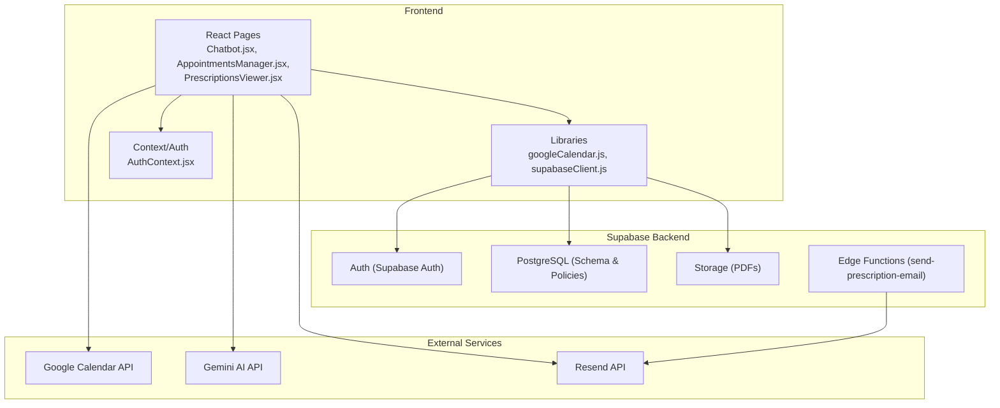
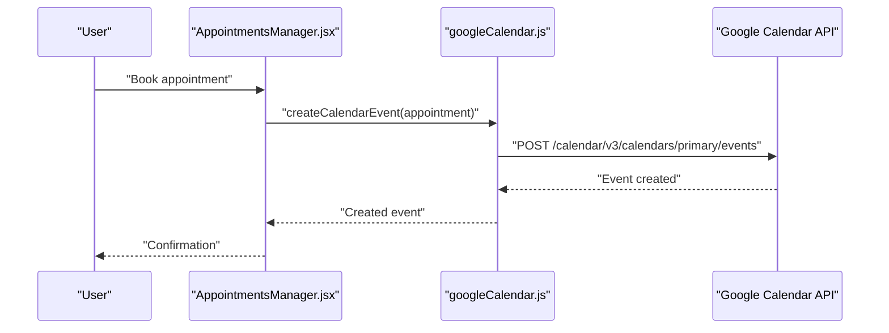
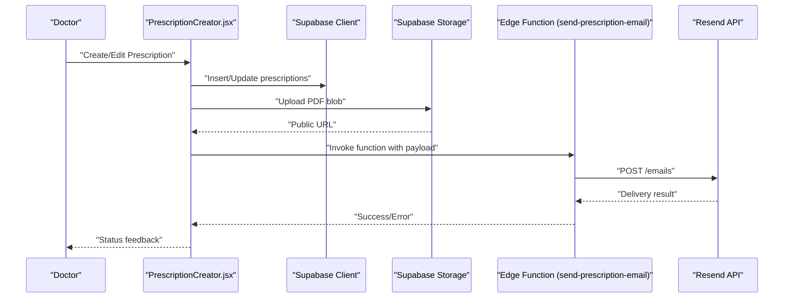
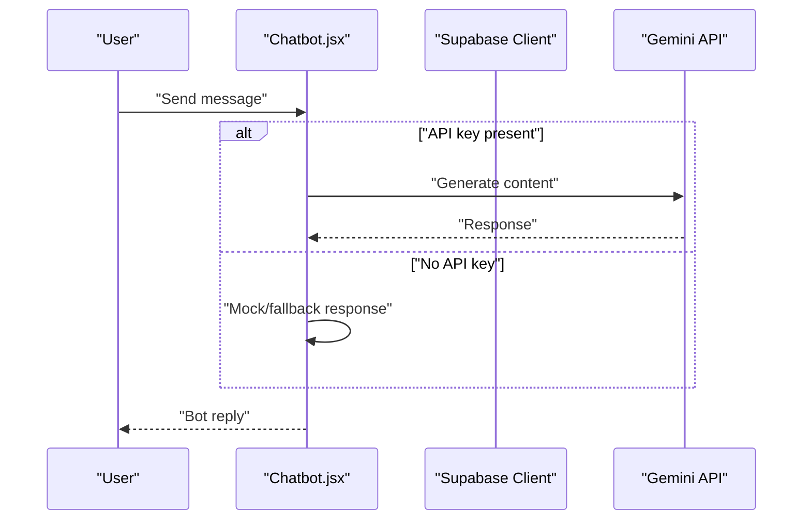
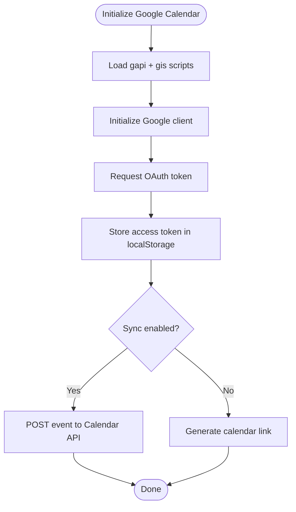
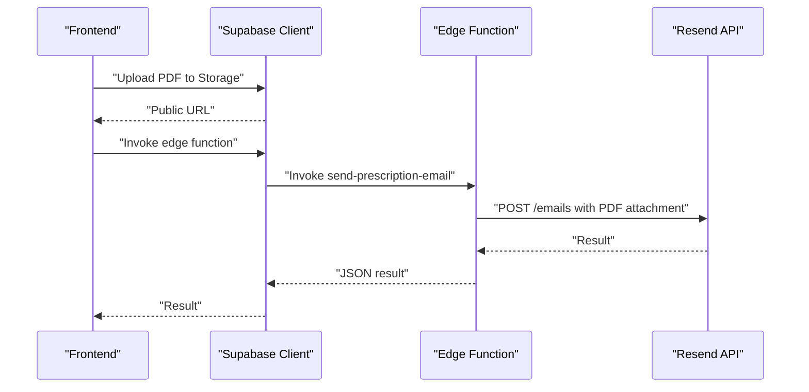
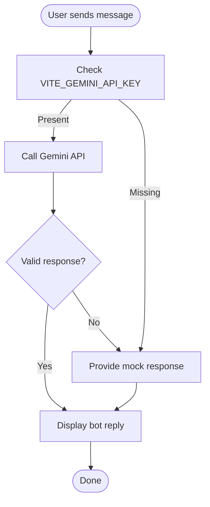
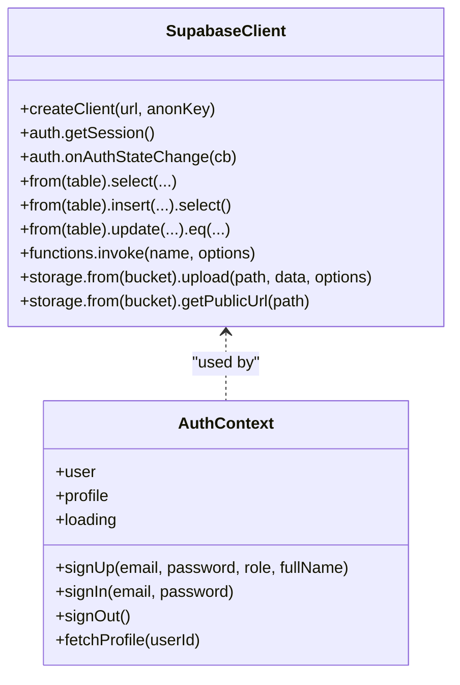
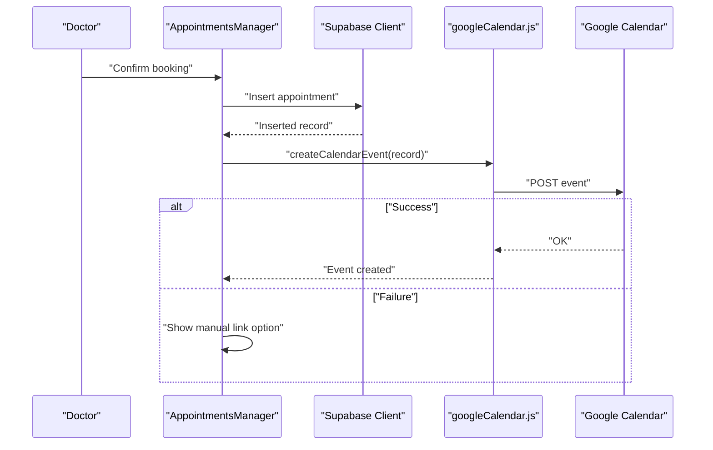
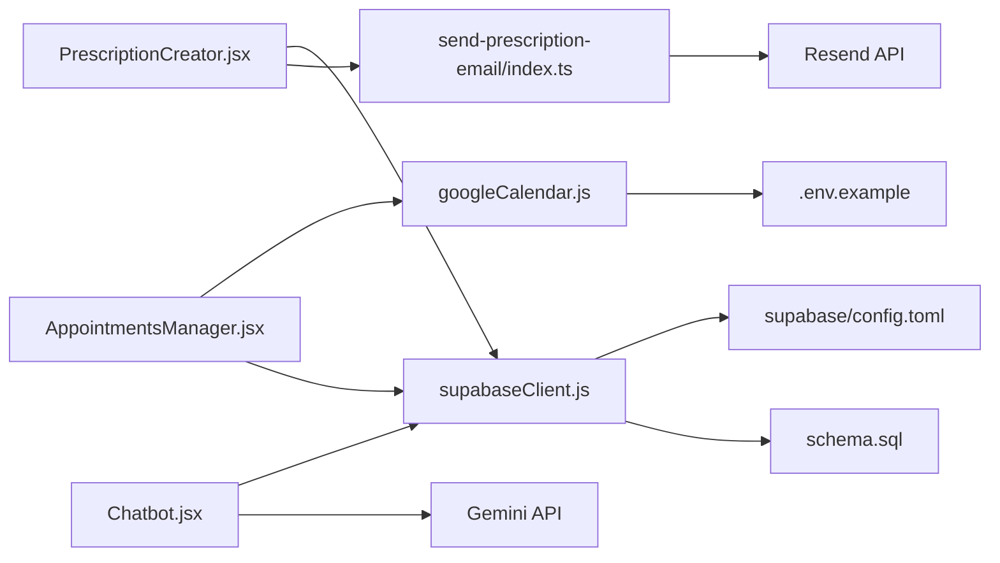

# Integration Patterns

<cite>
**Referenced Files in This Document**
- [googleCalendar.js](file://frontend/src/lib/googleCalendar.js)
- [supabaseClient.js](file://frontend/src/lib/supabaseClient.js)
- [index.ts](file://supabase/functions/send-prescription-email/index.ts)
- [Chatbot.jsx](file://frontend/src/pages/Chatbot.jsx)
- [AuthContext.jsx](file://frontend/src/context/AuthContext.jsx)
- [AppointmentsManager.jsx](file://frontend/src/pages/AppointmentsManager.jsx)
- [PrescriptionCreator.jsx](file://frontend/src/components/PrescriptionCreator.jsx)
- [PrescriptionsViewer.jsx](file://frontend/src/pages/PrescriptionsViewer.jsx)
- [schema.sql](file://backend/schema.sql)
- [.env.example](file://frontend/.env.example)
- [GOOGLE_CALENDAR_SETUP.md](file://frontend/GOOGLE_CALENDAR_SETUP.md)
- [config.toml](file://supabase/config.toml)
- [README.md](file://README.md)
</cite>

## Table of Contents
1. [Introduction](#introduction)
2. [Project Structure](#project-structure)
3. [Core Components](#core-components)
4. [Architecture Overview](#architecture-overview)
5. [Detailed Component Analysis](#detailed-component-analysis)
6. [Dependency Analysis](#dependency-analysis)
7. [Performance Considerations](#performance-considerations)
8. [Troubleshooting Guide](#troubleshooting-guide)
9. [Conclusion](#conclusion)
10. [Appendices](#appendices)

## Introduction
This document describes MedVita’s integration patterns for external services, focusing on:
- Google Calendar API integration for OAuth authentication, event creation, and synchronization strategies
- Email automation via Supabase edge functions triggered from the frontend
- Gemini AI API integration for chatbot functionality, including API key management and fallbacks
- Supabase client integration patterns for database operations, authentication flows, and real-time subscriptions
- Error handling, retry mechanisms, and circuit breaker patterns for external service failures
- Security considerations for API key management, rate limiting compliance, and data privacy
- Monitoring and logging patterns, performance optimization techniques, and troubleshooting

## Project Structure
MedVita is a React + Vite frontend integrated with Supabase for authentication, database, storage, and edge functions. External integrations include:
- Google Calendar for appointment synchronization
- Resend via a Supabase edge function for email delivery
- Gemini AI for chatbot assistance

**Diagram sources**
- [AppointmentsManager.jsx](file://frontend/src/pages/AppointmentsManager.jsx#L1-L577)
- [PrescriptionCreator.jsx](file://frontend/src/components/PrescriptionCreator.jsx#L1-L303)
- [Chatbot.jsx](file://frontend/src/pages/Chatbot.jsx#L1-L201)
- [googleCalendar.js](file://frontend/src/lib/googleCalendar.js#L1-L199)
- [supabaseClient.js](file://frontend/src/lib/supabaseClient.js#L1-L11)
- [index.ts](file://supabase/functions/send-prescription-email/index.ts#L1-L193)
- [schema.sql](file://backend/schema.sql#L1-L274)

**Section sources**
- [README.md](file://README.md#L1-L89)

## Core Components
- Google Calendar integration module for OAuth, event creation, and calendar links
- Supabase client initialization and environment-based configuration
- Supabase edge function for secure, serverless email delivery
- Gemini chatbot with API key management and fallback logic
- Supabase authentication context and database schema/policies
- Appointment and prescription workflows integrating external services

**Section sources**
- [googleCalendar.js](file://frontend/src/lib/googleCalendar.js#L1-L199)
- [supabaseClient.js](file://frontend/src/lib/supabaseClient.js#L1-L11)
- [index.ts](file://supabase/functions/send-prescription-email/index.ts#L1-L193)
- [Chatbot.jsx](file://frontend/src/pages/Chatbot.jsx#L1-L201)
- [AuthContext.jsx](file://frontend/src/context/AuthContext.jsx#L1-L108)
- [schema.sql](file://backend/schema.sql#L1-L274)

## Architecture Overview
The system integrates external services through controlled pathways:
- Frontend initializes Supabase client and authenticates users
- Authentication state changes trigger real-time updates and profile retrieval
- Appointment creation optionally syncs to Google Calendar using OAuth
- Prescription creation generates a PDF, uploads to Supabase Storage, and triggers an edge function to send via Resend
- Chatbot queries Gemini API with graceful fallback when API keys are missing

**Diagram sources**
- [AppointmentsManager.jsx](file://frontend/src/pages/AppointmentsManager.jsx#L134-L180)
- [googleCalendar.js](file://frontend/src/lib/googleCalendar.js#L125-L178)

**Diagram sources**
- [PrescriptionCreator.jsx](file://frontend/src/components/PrescriptionCreator.jsx#L100-L188)
- [index.ts](file://supabase/functions/send-prescription-email/index.ts#L25-L192)

**Diagram sources**
- [Chatbot.jsx](file://frontend/src/pages/Chatbot.jsx#L22-L103)

## Detailed Component Analysis

### Google Calendar Integration Pattern
- Initialization and lazy loading of Google API scripts
- OAuth 2.0 token acquisition via Google Identity Services
- Event creation using Google Calendar REST API with Bearer token
- Local preference toggles for enabling/disabling sync
- Fallback calendar link generation for manual addition

**Diagram sources**
- [googleCalendar.js](file://frontend/src/lib/googleCalendar.js#L14-L105)
- [googleCalendar.js](file://frontend/src/lib/googleCalendar.js#L125-L178)
- [GOOGLE_CALENDAR_SETUP.md](file://frontend/GOOGLE_CALENDAR_SETUP.md#L1-L117)

**Section sources**
- [googleCalendar.js](file://frontend/src/lib/googleCalendar.js#L1-L199)
- [GOOGLE_CALENDAR_SETUP.md](file://frontend/GOOGLE_CALENDAR_SETUP.md#L1-L117)
- [.env.example](file://frontend/.env.example#L1-L9)

### Email Automation Workflow Using Supabase Edge Functions
- PrescriptionCreator generates a PDF, uploads to Supabase Storage, and invokes the edge function
- Edge function securely retrieves API key from environment, downloads PDF, composes HTML, and sends via Resend
- Returns structured success/error responses for frontend handling

**Diagram sources**
- [PrescriptionCreator.jsx](file://frontend/src/components/PrescriptionCreator.jsx#L100-L188)
- [index.ts](file://supabase/functions/send-prescription-email/index.ts#L25-L192)

**Section sources**
- [PrescriptionCreator.jsx](file://frontend/src/components/PrescriptionCreator.jsx#L1-L303)
- [index.ts](file://supabase/functions/send-prescription-email/index.ts#L1-L193)

### Gemini AI Integration for Chatbot
- API key fetched from environment variables
- Requests sent to Gemini API with structured prompts
- Graceful fallback when API key is missing or request fails
- UI displays loading states and bot responses

**Diagram sources**
- [Chatbot.jsx](file://frontend/src/pages/Chatbot.jsx#L22-L103)

**Section sources**
- [Chatbot.jsx](file://frontend/src/pages/Chatbot.jsx#L1-L201)
- [.env.example](file://frontend/.env.example#L1-L9)

### Supabase Client Integration Patterns
- Client initialization with environment variables and validation
- Authentication state management with real-time subscription
- Database operations with role-based policies and RLS
- Storage uploads and public URL retrieval for PDFs

**Diagram sources**
- [supabaseClient.js](file://frontend/src/lib/supabaseClient.js#L1-L11)
- [AuthContext.jsx](file://frontend/src/context/AuthContext.jsx#L1-L108)

**Section sources**
- [supabaseClient.js](file://frontend/src/lib/supabaseClient.js#L1-L11)
- [AuthContext.jsx](file://frontend/src/context/AuthContext.jsx#L1-L108)
- [schema.sql](file://backend/schema.sql#L1-L274)

### Appointment Creation and Google Calendar Sync
- Appointment creation persists to database
- If doctor profile has sync enabled, attempts to create calendar event
- On failure, offers manual calendar link generation

**Diagram sources**
- [AppointmentsManager.jsx](file://frontend/src/pages/AppointmentsManager.jsx#L134-L180)
- [googleCalendar.js](file://frontend/src/lib/googleCalendar.js#L125-L178)

**Section sources**
- [AppointmentsManager.jsx](file://frontend/src/pages/AppointmentsManager.jsx#L1-L577)
- [googleCalendar.js](file://frontend/src/lib/googleCalendar.js#L1-L199)

## Dependency Analysis
- Frontend depends on Supabase client for auth, DB, storage, and edge functions
- Google Calendar integration depends on environment variables and Google Identity Services
- Edge function depends on Resend API key and PDF attachment logic
- Database schema defines RLS policies and triggers for profile creation

**Diagram sources**
- [googleCalendar.js](file://frontend/src/lib/googleCalendar.js#L1-L199)
- [.env.example](file://frontend/.env.example#L1-L9)
- [supabaseClient.js](file://frontend/src/lib/supabaseClient.js#L1-L11)
- [config.toml](file://supabase/config.toml#L1-L385)
- [PrescriptionCreator.jsx](file://frontend/src/components/PrescriptionCreator.jsx#L1-L303)
- [index.ts](file://supabase/functions/send-prescription-email/index.ts#L1-L193)
- [AppointmentsManager.jsx](file://frontend/src/pages/AppointmentsManager.jsx#L1-L577)
- [Chatbot.jsx](file://frontend/src/pages/Chatbot.jsx#L1-L201)
- [schema.sql](file://backend/schema.sql#L1-L274)

**Section sources**
- [schema.sql](file://backend/schema.sql#L1-L274)
- [config.toml](file://supabase/config.toml#L1-L385)

## Performance Considerations
- Debounce UI interactions (e.g., real-time search) to reduce unnecessary requests
- Minimize PDF rendering overhead by generating at appropriate sizes and compressing images
- Cache frequently accessed data (e.g., doctor availability) to reduce repeated queries
- Use pagination and limits for large lists (e.g., prescriptions, appointments)
- Avoid synchronous heavy operations in UI threads; offload to background tasks or edge functions

## Troubleshooting Guide
- Google Calendar
  - Verify environment variables and API enablement
  - Confirm OAuth consent screen configuration and authorized origins
  - Check browser console for script load and token errors
  - Ensure sync toggle is enabled and token is present in localStorage
- Email Delivery
  - Confirm Resend API key is set in edge function environment
  - Validate PDF upload succeeded and public URL is returned
  - Inspect edge function logs for request/response details
- Gemini Chatbot
  - Ensure API key is present in environment
  - Monitor network tab for request failures and fallback behavior
- Supabase
  - Check RLS policies and user roles
  - Verify auth state changes and real-time subscriptions
  - Confirm storage bucket permissions and public URL accessibility

**Section sources**
- [GOOGLE_CALENDAR_SETUP.md](file://frontend/GOOGLE_CALENDAR_SETUP.md#L83-L117)
- [index.ts](file://supabase/functions/send-prescription-email/index.ts#L41-L46)
- [Chatbot.jsx](file://frontend/src/pages/Chatbot.jsx#L79-L92)
- [AuthContext.jsx](file://frontend/src/context/AuthContext.jsx#L26-L40)
- [schema.sql](file://backend/schema.sql#L30-L274)

## Conclusion
MedVita’s integration patterns emphasize secure, modular, and resilient external service usage:
- Google Calendar sync is optional and gracefully degrades to manual links
- Email delivery is handled serverlessly with strict environment-based security
- Gemini chatbot provides intelligent assistance with robust fallbacks
- Supabase underpins authentication, data, and storage with strong RLS and real-time capabilities
Adhering to the outlined error handling, security, and performance recommendations ensures reliable operation across environments.

## Appendices
- Environment variables reference for Google Calendar and Supabase
- Supabase configuration and edge runtime settings
- Database schema and policies for access control

**Section sources**
- [.env.example](file://frontend/.env.example#L1-L9)
- [config.toml](file://supabase/config.toml#L1-L385)
- [schema.sql](file://backend/schema.sql#L1-L274)