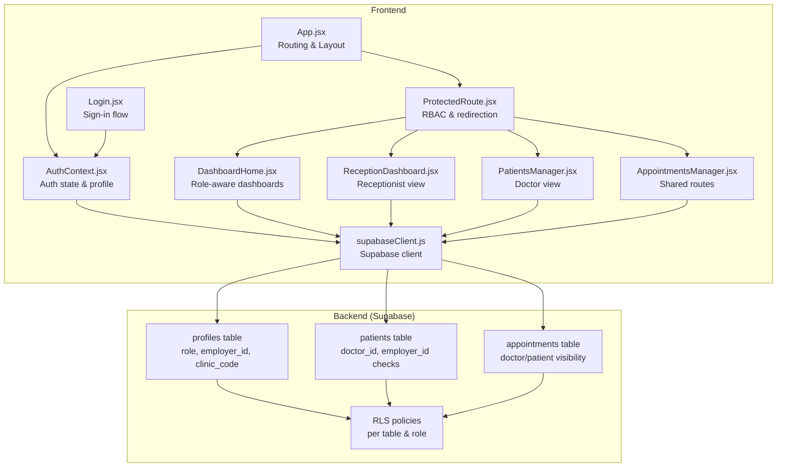
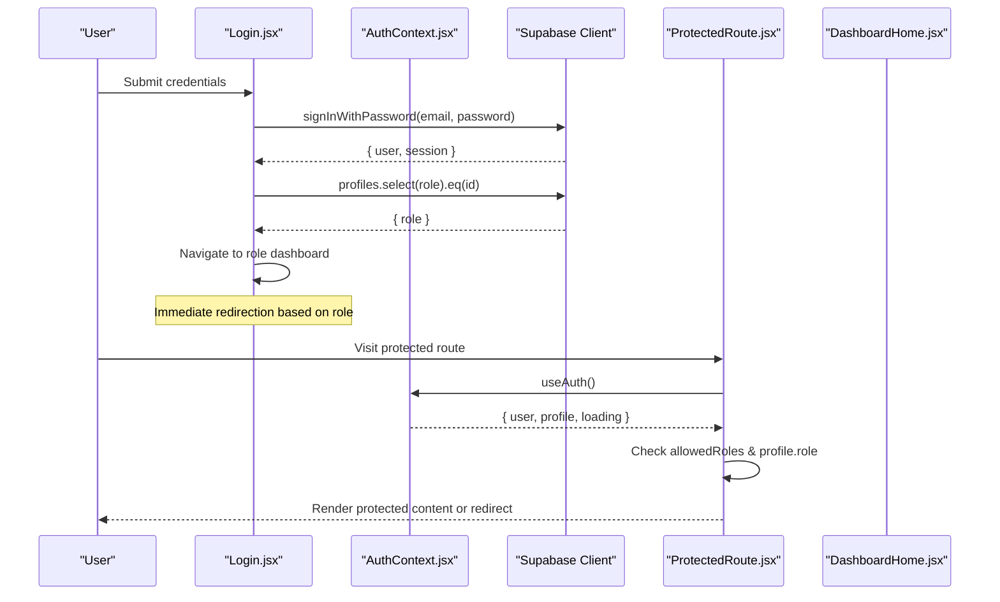
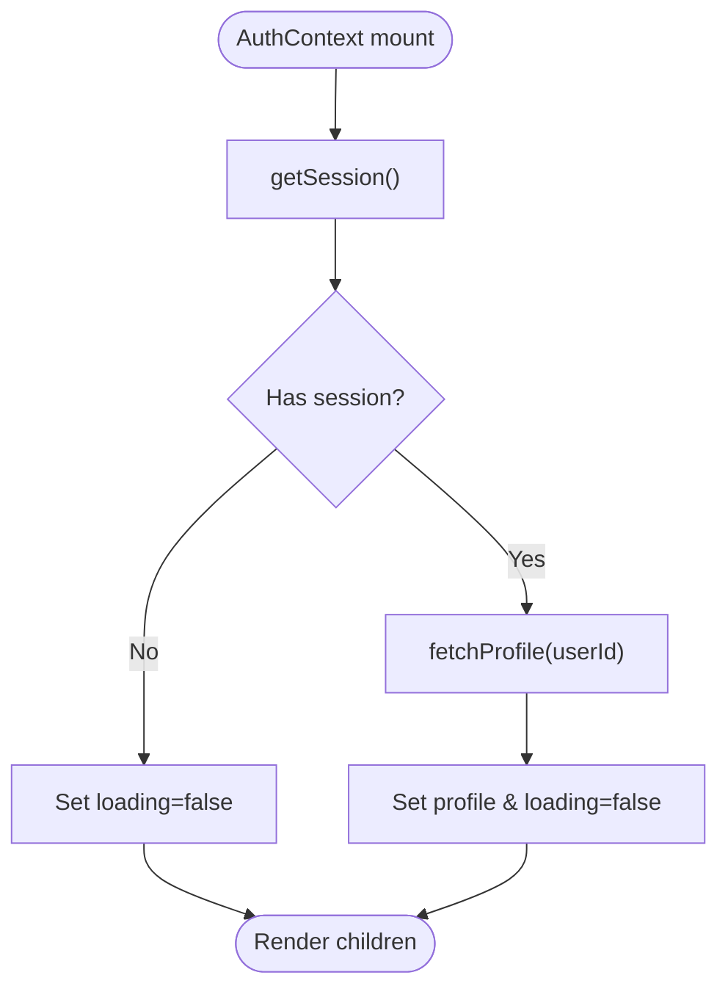
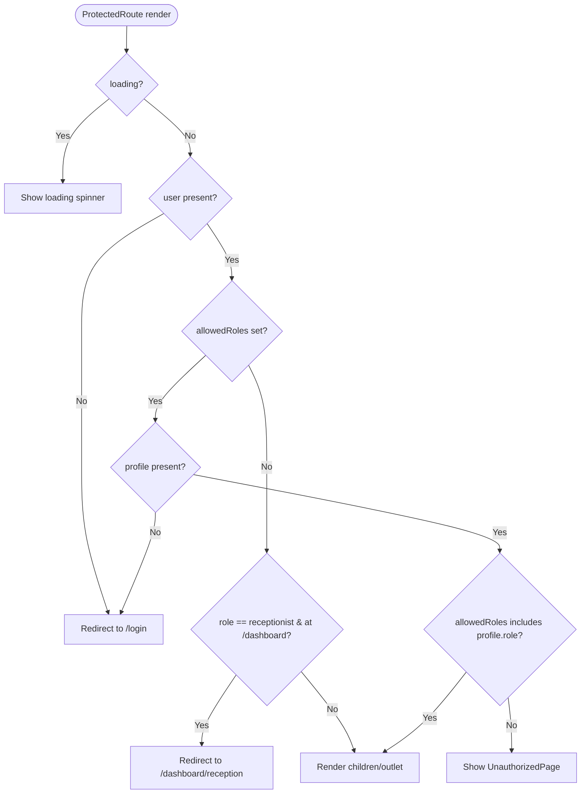
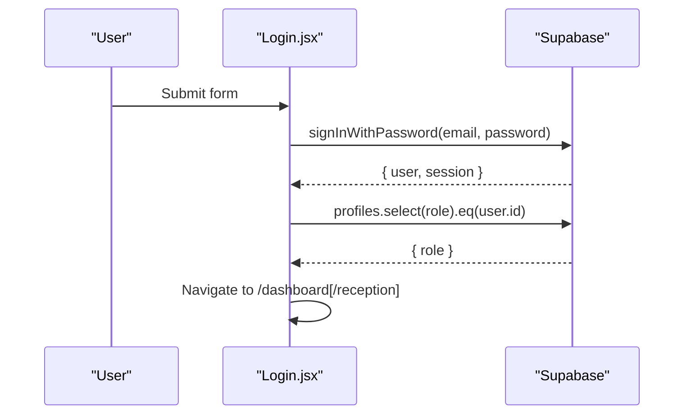
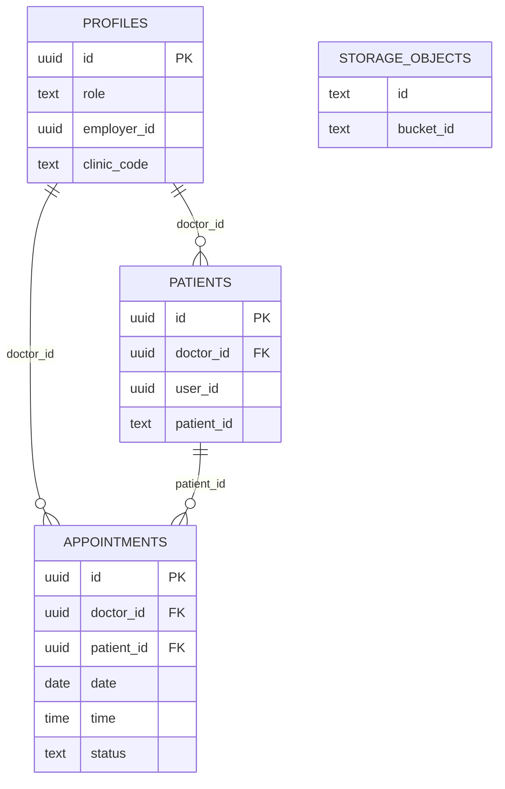
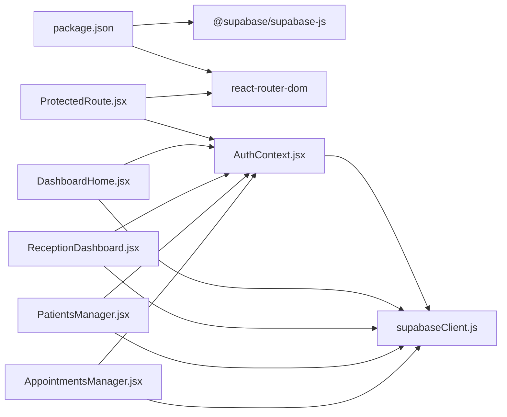

# Authentication & Authorization

<cite>
**Referenced Files in This Document**
- [AuthContext.jsx](file://frontend/src/context/AuthContext.jsx)
- [ProtectedRoute.jsx](file://frontend/src/components/ProtectedRoute.jsx)
- [Login.jsx](file://frontend/src/pages/Login.jsx)
- [App.jsx](file://frontend/src/App.jsx)
- [supabaseClient.js](file://frontend/src/lib/supabaseClient.js)
- [schema.sql](file://backend/schema.sql)
- [DashboardHome.jsx](file://frontend/src/pages/DashboardHome.jsx)
- [ReceptionDashboard.jsx](file://frontend/src/pages/ReceptionDashboard.jsx)
- [PatientsManager.jsx](file://frontend/src/pages/PatientsManager.jsx)
- [AppointmentsManager.jsx](file://frontend/src/pages/AppointmentsManager.jsx)
- [package.json](file://frontend/package.json)
</cite>

## Table of Contents
1. [Introduction](#introduction)
2. [Project Structure](#project-structure)
3. [Core Components](#core-components)
4. [Architecture Overview](#architecture-overview)
5. [Detailed Component Analysis](#detailed-component-analysis)
6. [Dependency Analysis](#dependency-analysis)
7. [Performance Considerations](#performance-considerations)
8. [Troubleshooting Guide](#troubleshooting-guide)
9. [Conclusion](#conclusion)
10. [Appendices](#appendices)

## Introduction
This document explains the authentication and authorization system for MedVita. It covers the multi-role authentication model (Doctor, Patient, Receptionist), the login and session lifecycle, JWT handling, profile creation, role-based access control via ProtectedRoute, integration with Supabase Row Level Security (RLS), session persistence and automatic logout behavior, and practical guidance for implementing role checks and managing permissions across components.

## Project Structure
MedVita’s frontend uses React with React Router and Supabase for authentication and real-time data. Authentication state is centralized in a context provider, protected routes enforce role-based access, and Supabase RLS policies govern data access per role.

**Diagram sources**
- [App.jsx](file://frontend/src/App.jsx#L26-L59)
- [AuthContext.jsx](file://frontend/src/context/AuthContext.jsx#L9-L107)
- [ProtectedRoute.jsx](file://frontend/src/components/ProtectedRoute.jsx#L53-L106)
- [Login.jsx](file://frontend/src/pages/Login.jsx#L10-L75)
- [DashboardHome.jsx](file://frontend/src/pages/DashboardHome.jsx#L275-L350)
- [ReceptionDashboard.jsx](file://frontend/src/pages/ReceptionDashboard.jsx#L37-L141)
- [PatientsManager.jsx](file://frontend/src/pages/PatientsManager.jsx#L15-L20)
- [AppointmentsManager.jsx](file://frontend/src/pages/AppointmentsManager.jsx#L14-L65)
- [supabaseClient.js](file://frontend/src/lib/supabaseClient.js#L1-L11)
- [schema.sql](file://backend/schema.sql#L4-L274)

**Section sources**
- [App.jsx](file://frontend/src/App.jsx#L26-L59)
- [AuthContext.jsx](file://frontend/src/context/AuthContext.jsx#L9-L107)
- [ProtectedRoute.jsx](file://frontend/src/components/ProtectedRoute.jsx#L53-L106)
- [Login.jsx](file://frontend/src/pages/Login.jsx#L10-L75)
- [supabaseClient.js](file://frontend/src/lib/supabaseClient.js#L1-L11)
- [schema.sql](file://backend/schema.sql#L4-L274)

## Core Components
- AuthContext: Centralizes authentication state, profile retrieval, sign-in/sign-up/sign-out, and session change handling.
- ProtectedRoute: Enforces role-based access control, handles loading/unauthenticated states, and redirects to appropriate dashboards.
- Login: Authenticates users, fetches profile to determine role, and navigates to role-specific dashboards.
- Supabase Client: Initializes the Supabase client using environment variables.
- Backend RLS: Defines policies on profiles, patients, appointments, and storage to enforce role-based data access.

Key responsibilities:
- AuthContext manages user session and profile data, listens for auth state changes, and exposes sign-in/sign-up/sign-out functions.
- ProtectedRoute ensures only authorized roles can access routes and enforces default routing for roles.
- Login performs authentication and role-aware redirection.
- Backend RLS policies restrict data access based on roles and relationships (e.g., receptionists linked to a doctor).

**Section sources**
- [AuthContext.jsx](file://frontend/src/context/AuthContext.jsx#L9-L107)
- [ProtectedRoute.jsx](file://frontend/src/components/ProtectedRoute.jsx#L53-L106)
- [Login.jsx](file://frontend/src/pages/Login.jsx#L10-L75)
- [supabaseClient.js](file://frontend/src/lib/supabaseClient.js#L1-L11)
- [schema.sql](file://backend/schema.sql#L4-L274)

## Architecture Overview
The authentication and authorization architecture combines client-side RBAC with server-side RLS:

- Client-side:
  - AuthContext initializes Supabase, subscribes to auth state changes, and loads the user’s profile.
  - ProtectedRoute checks auth state, profile presence, and role permissions before rendering protected content.
  - Login triggers Supabase authentication and determines role to route users appropriately.

- Server-side:
  - Supabase RLS policies define who can view/update/delete data based on roles and relationships.
  - The profiles table stores role and optional employer linkage for receptionists.
  - RLS policies on patients and appointments enforce visibility and mutability rules per role.

**Diagram sources**
- [Login.jsx](file://frontend/src/pages/Login.jsx#L20-L75)
- [AuthContext.jsx](file://frontend/src/context/AuthContext.jsx#L14-L41)
- [ProtectedRoute.jsx](file://frontend/src/components/ProtectedRoute.jsx#L53-L106)
- [DashboardHome.jsx](file://frontend/src/pages/DashboardHome.jsx#L347-L350)

## Detailed Component Analysis

### AuthContext: Session Management and Profile Loading
AuthContext centralizes authentication and profile retrieval:
- Initializes Supabase client and subscribes to auth state changes.
- On session change, sets user, loads profile, and handles unauthenticated state.
- Provides sign-in, sign-up, and sign-out functions.
- Exposes a fetchProfile helper for ad-hoc profile retrieval.

**Diagram sources**
- [AuthContext.jsx](file://frontend/src/context/AuthContext.jsx#L14-L61)

**Section sources**
- [AuthContext.jsx](file://frontend/src/context/AuthContext.jsx#L9-L107)

### ProtectedRoute: Role-Based Access Control
ProtectedRoute enforces role-based access and handles redirection:
- Loading state: Waits for both auth session and profile data before rendering.
- Unauthenticated state: Redirects to login with post-login return location.
- Role checks: Validates profile.role against allowedRoles; renders unauthorized page if mismatch.
- Default diversions: Ensures receptionists are routed to their dedicated dashboard.

**Diagram sources**
- [ProtectedRoute.jsx](file://frontend/src/components/ProtectedRoute.jsx#L53-L106)

**Section sources**
- [ProtectedRoute.jsx](file://frontend/src/components/ProtectedRoute.jsx#L53-L106)

### Login: Authentication and Role-Aware Redirection
Login performs authentication and immediate redirection:
- Calls sign-in with credentials.
- Fetches profile to determine role and navigates to the correct dashboard.
- Handles errors and displays user-friendly messages.

**Diagram sources**
- [Login.jsx](file://frontend/src/pages/Login.jsx#L20-L75)

**Section sources**
- [Login.jsx](file://frontend/src/pages/Login.jsx#L10-L75)

### Supabase Client Initialization
Supabase client is initialized using environment variables and shared across the app.

**Section sources**
- [supabaseClient.js](file://frontend/src/lib/supabaseClient.js#L1-L11)

### Backend RLS Policies and Roles
The backend defines roles and policies:
- profiles: role includes doctor, patient, receptionist; supports employer_id and clinic_code for receptionists.
- patients: receptionists can view/edit patients linked to their employer (doctor).
- appointments: visibility depends on whether the user is the doctor or patient, or linked via patient records.
- storage: authenticated users can upload/view files.

**Diagram sources**
- [schema.sql](file://backend/schema.sql#L4-L274)

**Section sources**
- [schema.sql](file://backend/schema.sql#L4-L274)

### Role-Specific Dashboards and Permissions
- Doctor dashboard: Uses profile.role to fetch doctor-specific data and lists patients and appointments.
- Receptionist dashboard: Uses employer_id to fetch patients under the linked doctor and adds patients to the queue.
- Shared routes: Appointments route is accessible to both patients and doctors; patients can view prescriptions.

**Section sources**
- [DashboardHome.jsx](file://frontend/src/pages/DashboardHome.jsx#L275-L350)
- [ReceptionDashboard.jsx](file://frontend/src/pages/ReceptionDashboard.jsx#L37-L141)
- [PatientsManager.jsx](file://frontend/src/pages/PatientsManager.jsx#L15-L20)
- [AppointmentsManager.jsx](file://frontend/src/pages/AppointmentsManager.jsx#L14-L65)

## Dependency Analysis
- Frontend dependencies include @supabase/supabase-js, react-router-dom, and UI libraries.
- AuthContext depends on supabaseClient.js for Supabase initialization.
- ProtectedRoute depends on AuthContext for user/profile state and on React Router for navigation.
- Pages depend on Supabase client for data queries and on AuthContext for role-aware logic.

**Diagram sources**
- [package.json](file://frontend/package.json#L13-L31)
- [AuthContext.jsx](file://frontend/src/context/AuthContext.jsx#L1-L3)
- [ProtectedRoute.jsx](file://frontend/src/components/ProtectedRoute.jsx#L1-L3)
- [supabaseClient.js](file://frontend/src/lib/supabaseClient.js#L1-L11)
- [DashboardHome.jsx](file://frontend/src/pages/DashboardHome.jsx#L1-L12)
- [ReceptionDashboard.jsx](file://frontend/src/pages/ReceptionDashboard.jsx#L1-L4)
- [PatientsManager.jsx](file://frontend/src/pages/PatientsManager.jsx#L1-L11)
- [AppointmentsManager.jsx](file://frontend/src/pages/AppointmentsManager.jsx#L1-L12)

**Section sources**
- [package.json](file://frontend/package.json#L13-L31)
- [AuthContext.jsx](file://frontend/src/context/AuthContext.jsx#L1-L3)
- [ProtectedRoute.jsx](file://frontend/src/components/ProtectedRoute.jsx#L1-L3)
- [supabaseClient.js](file://frontend/src/lib/supabaseClient.js#L1-L11)
- [DashboardHome.jsx](file://frontend/src/pages/DashboardHome.jsx#L1-L12)
- [ReceptionDashboard.jsx](file://frontend/src/pages/ReceptionDashboard.jsx#L1-L4)
- [PatientsManager.jsx](file://frontend/src/pages/PatientsManager.jsx#L1-L11)
- [AppointmentsManager.jsx](file://frontend/src/pages/AppointmentsManager.jsx#L1-L12)

## Performance Considerations
- Minimize redundant profile fetches: AuthContext already caches profile data; avoid repeated queries in components.
- Use optimistic UI for protected routes: ProtectedRoute shows a loading state while ensuring profile readiness.
- Debounce search/filter operations in data-heavy components to reduce Supabase calls.
- Prefer server-side filtering via Supabase queries to reduce payload sizes.

## Troubleshooting Guide
Common issues and resolutions:
- Profile missing after login: ProtectedRoute redirects to login if profile is absent; ensure the Supabase auth trigger creates profiles and that the client waits for profile readiness.
- Access denied errors: Verify allowedRoles match the user’s profile.role and that RLS policies permit access for the given route.
- Receptionist not linked: ReceptionDashboard checks employer_id; if missing, prompt to re-register with a valid clinic code.
- Email confirmation: Login handles “Email not confirmed” errors; guide users to confirm their email before logging in.
- Too many attempts: Login handles rate-limit errors; instruct users to retry later.

**Section sources**
- [ProtectedRoute.jsx](file://frontend/src/components/ProtectedRoute.jsx#L82-L93)
- [Login.jsx](file://frontend/src/pages/Login.jsx#L59-L75)
- [ReceptionDashboard.jsx](file://frontend/src/pages/ReceptionDashboard.jsx#L124-L141)

## Conclusion
MedVita’s authentication and authorization system combines a robust client-side RBAC layer with Supabase RLS policies to secure multi-role access. AuthContext centralizes session and profile management, ProtectedRoute enforces role-based access, and backend policies ensure data integrity and privacy. By following the patterns outlined here, teams can extend roles, add new protected routes, and maintain consistent security across the application.

## Appendices

### Practical Examples

- Role checking in components:
  - Doctor-only logic: Use profile.role to conditionally render doctor-specific UI and data queries.
  - Receptionist-only logic: Use employer_id to scope data to the linked doctor.
  - Shared access: Allow both patients and doctors to access shared routes like appointments and prescriptions.

- Protected route configuration:
  - Wrap routes with ProtectedRoute and specify allowedRoles.
  - Use default diversions to ensure receptionists land on their dedicated dashboard.

- User permission management:
  - Ensure profile.role is accurate during sign-up and that RLS policies reflect the intended access patterns.
  - For receptionists, validate clinic_code linkage to a doctor before granting access.

**Section sources**
- [DashboardHome.jsx](file://frontend/src/pages/DashboardHome.jsx#L275-L350)
- [ReceptionDashboard.jsx](file://frontend/src/pages/ReceptionDashboard.jsx#L37-L141)
- [App.jsx](file://frontend/src/App.jsx#L35-L55)
- [schema.sql](file://backend/schema.sql#L4-L274)