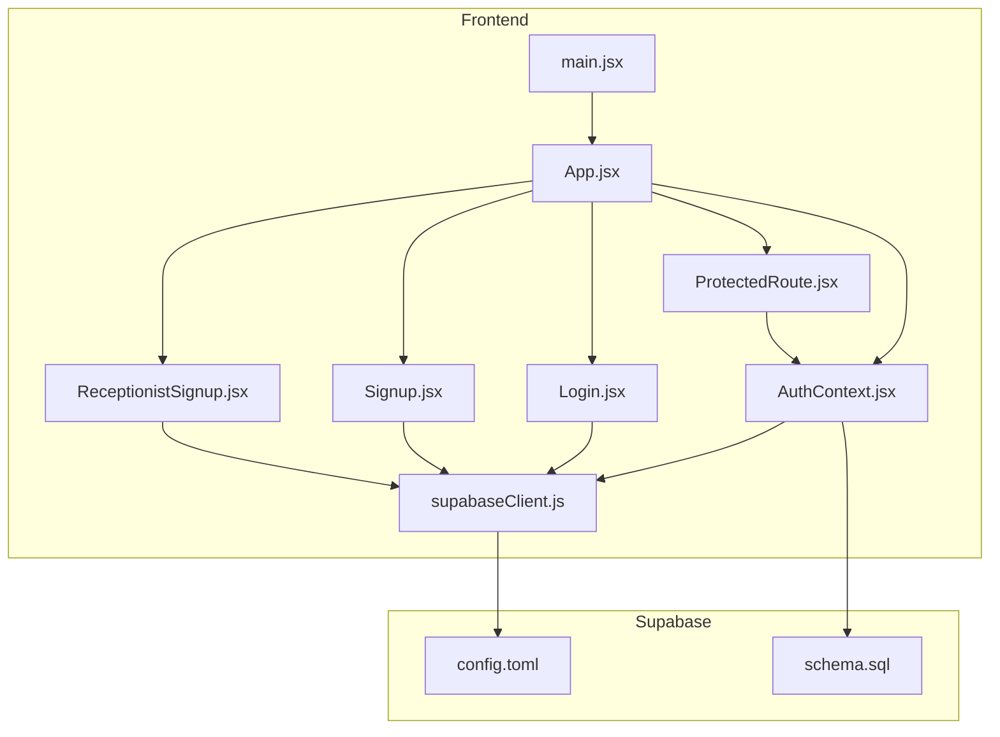
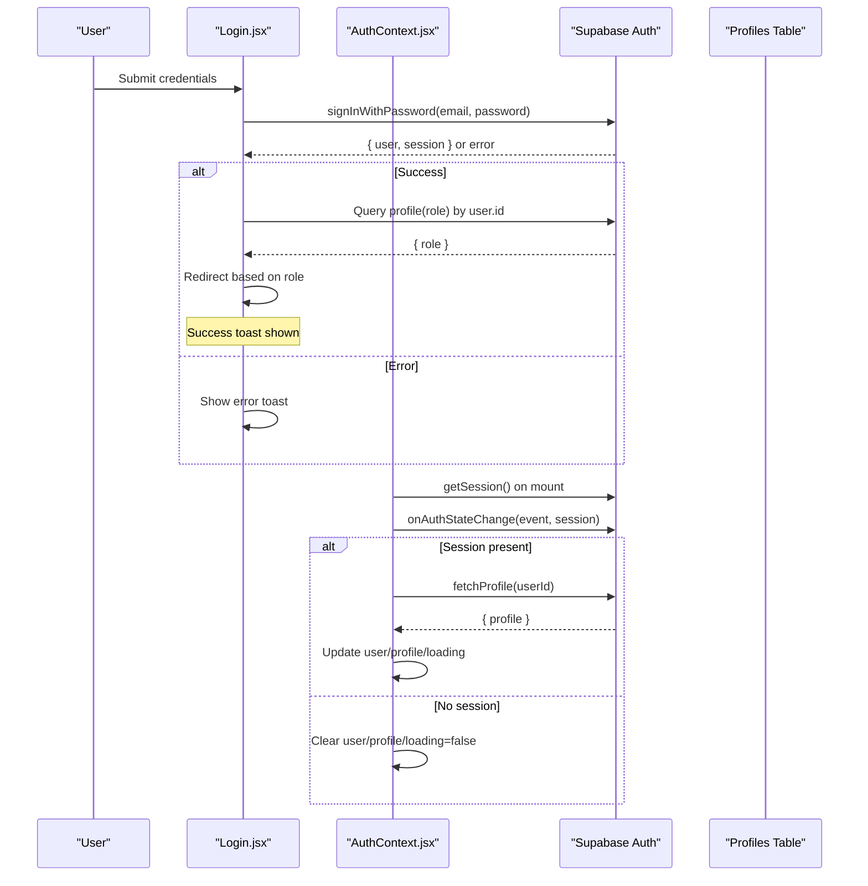
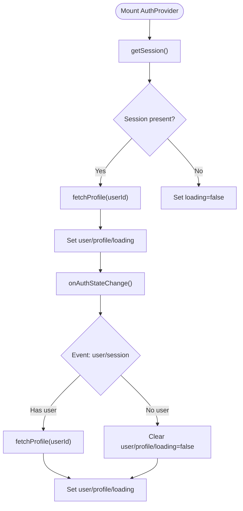
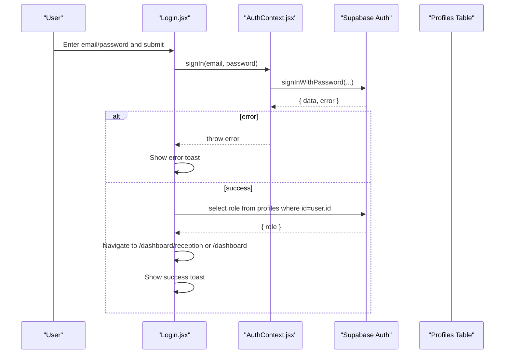
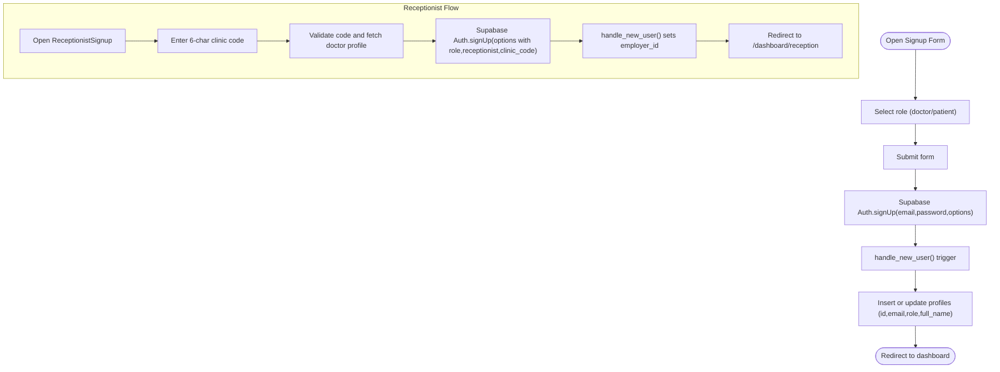
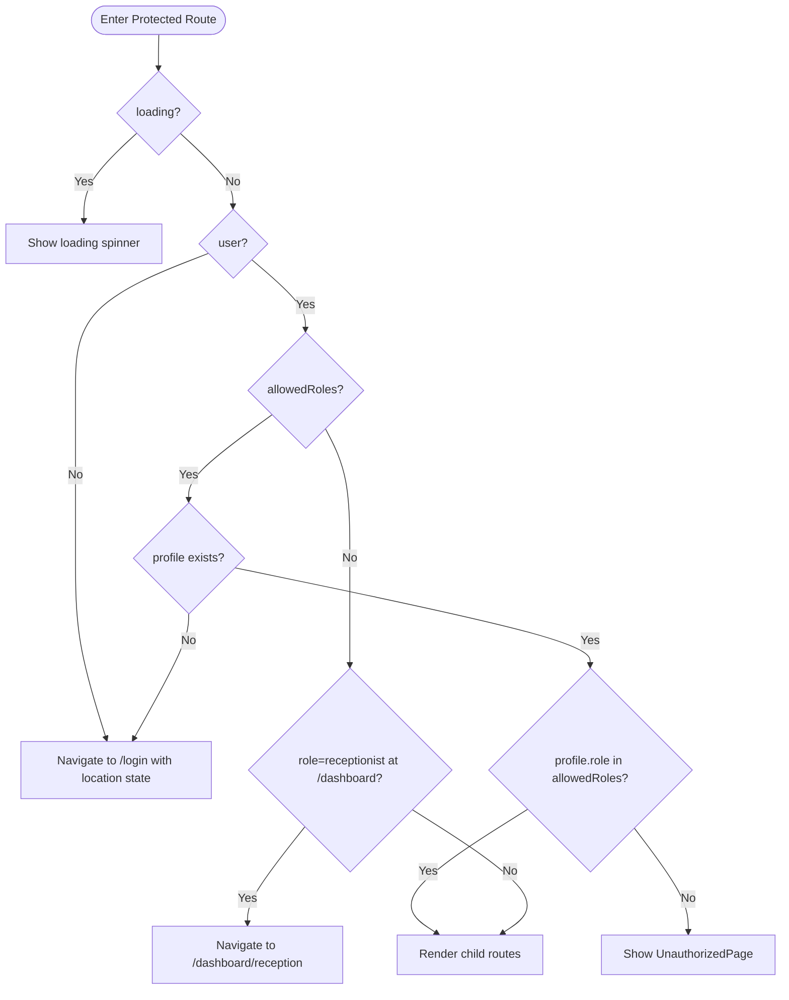
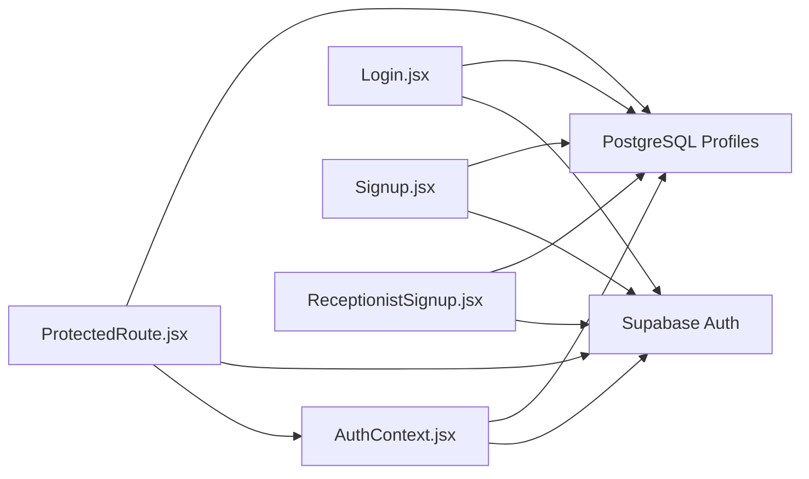

# Authentication Flow

<cite>
**Referenced Files in This Document**
- [AuthContext.jsx](file://frontend/src/context/AuthContext.jsx)
- [ProtectedRoute.jsx](file://frontend/src/components/ProtectedRoute.jsx)
- [Login.jsx](file://frontend/src/pages/Login.jsx)
- [Signup.jsx](file://frontend/src/pages/Signup.jsx)
- [ReceptionistSignup.jsx](file://frontend/src/pages/ReceptionistSignup.jsx)
- [supabaseClient.js](file://frontend/src/lib/supabaseClient.js)
- [App.jsx](file://frontend/src/App.jsx)
- [main.jsx](file://frontend/src/main.jsx)
- [schema.sql](file://backend/schema.sql)
- [.env.local](file://frontend/.env.local)
- [config.toml](file://supabase/config.toml)
</cite>

## Table of Contents
1. [Introduction](#introduction)
2. [Project Structure](#project-structure)
3. [Core Components](#core-components)
4. [Architecture Overview](#architecture-overview)
5. [Detailed Component Analysis](#detailed-component-analysis)
6. [Dependency Analysis](#dependency-analysis)
7. [Performance Considerations](#performance-considerations)
8. [Troubleshooting Guide](#troubleshooting-guide)
9. [Conclusion](#conclusion)

## Introduction
This document explains the complete authentication flow in MedVita, covering user registration, role selection, profile creation, login, session establishment, and real-time authentication state updates. It also documents Supabase Auth integration, automatic profile population via database triggers, role-based routing, and error handling patterns. The goal is to provide a clear, actionable guide for developers and stakeholders to understand how users move from sign-up to secure, role-aware access to the application.

## Project Structure
MedVita’s authentication spans three layers:
- Frontend React application with Supabase JS client
- Supabase Auth service (remote) and database (PostgreSQL)
- Local Supabase CLI configuration for development

**Diagram sources**
- [App.jsx](file://frontend/src/App.jsx#L26-L59)
- [main.jsx](file://frontend/src/main.jsx#L8-L16)
- [AuthContext.jsx](file://frontend/src/context/AuthContext.jsx#L1-L107)
- [ProtectedRoute.jsx](file://frontend/src/components/ProtectedRoute.jsx#L53-L106)
- [Login.jsx](file://frontend/src/pages/Login.jsx#L10-L75)
- [Signup.jsx](file://frontend/src/pages/Signup.jsx#L16-L57)
- [ReceptionistSignup.jsx](file://frontend/src/pages/ReceptionistSignup.jsx#L8-L86)
- [supabaseClient.js](file://frontend/src/lib/supabaseClient.js#L1-L11)
- [config.toml](file://supabase/config.toml#L146-L175)
- [schema.sql](file://backend/schema.sql#L1-L274)

**Section sources**
- [App.jsx](file://frontend/src/App.jsx#L26-L59)
- [main.jsx](file://frontend/src/main.jsx#L8-L16)
- [supabaseClient.js](file://frontend/src/lib/supabaseClient.js#L1-L11)

## Core Components
- AuthContext: Centralizes authentication state, session restoration, real-time state updates, profile fetching, and authentication actions (sign up, sign in, sign out).
- ProtectedRoute: Enforces role-based access control and ensures users land on the correct dashboard route.
- Login, Signup, ReceptionistSignup: UI flows for authentication, including role-aware redirection and error messaging.
- Supabase client: Provides the Supabase JS client configured from environment variables.
- Backend schema: Defines the profiles table and the database trigger that auto-populates profiles on new user creation.

**Section sources**
- [AuthContext.jsx](file://frontend/src/context/AuthContext.jsx#L9-L107)
- [ProtectedRoute.jsx](file://frontend/src/components/ProtectedRoute.jsx#L53-L106)
- [Login.jsx](file://frontend/src/pages/Login.jsx#L10-L75)
- [Signup.jsx](file://frontend/src/pages/Signup.jsx#L16-L57)
- [ReceptionistSignup.jsx](file://frontend/src/pages/ReceptionistSignup.jsx#L8-L86)
- [supabaseClient.js](file://frontend/src/lib/supabaseClient.js#L1-L11)
- [schema.sql](file://backend/schema.sql#L239-L274)

## Architecture Overview
The authentication architecture integrates React state management with Supabase Auth and PostgreSQL. It supports:
- Automatic session restoration on app load
- Real-time auth state change listeners
- Role-aware routing and profile-driven UI decisions
- Database-triggered profile creation to avoid race conditions

**Diagram sources**
- [Login.jsx](file://frontend/src/pages/Login.jsx#L20-L75)
- [AuthContext.jsx](file://frontend/src/context/AuthContext.jsx#L14-L41)
- [schema.sql](file://backend/schema.sql#L239-L274)

## Detailed Component Analysis

### AuthContext: Session Restoration, Real-Time Updates, and Profile Management
AuthContext initializes authentication state, restores sessions, subscribes to auth state changes, and fetches the user’s profile. It exposes sign-up, sign-in, and sign-out methods and prevents rendering until session and profile resolution is complete.

Key behaviors:
- Restores active session on mount and conditionally fetches profile
- Subscribes to Supabase auth state changes and updates user/profile/loading accordingly
- Prevents rendering until loading is resolved
- Provides helper to fetch profile by user ID

**Diagram sources**
- [AuthContext.jsx](file://frontend/src/context/AuthContext.jsx#L14-L41)

**Section sources**
- [AuthContext.jsx](file://frontend/src/context/AuthContext.jsx#L9-L107)

### Login Flow: Credential Validation, Role-Aware Redirection, and Error Handling
The Login page coordinates:
- Credential submission via AuthContext.signIn
- Immediate profile fetch to determine role
- Deterministic redirection to the appropriate dashboard
- Toast notifications for success and error scenarios

Error handling covers invalid credentials, unconfirmed email, and rate limits.

**Diagram sources**
- [Login.jsx](file://frontend/src/pages/Login.jsx#L20-L75)
- [AuthContext.jsx](file://frontend/src/context/AuthContext.jsx#L84-L86)

**Section sources**
- [Login.jsx](file://frontend/src/pages/Login.jsx#L10-L75)

### Sign-Up Flows: Role Selection and Automatic Profile Population
There are two sign-up experiences:
- Doctor/Patient sign-up: role selected on the form; Supabase Auth creates the user and passes metadata to the database trigger
- Receptionist sign-up: requires a valid 6-character clinic code; the backend resolves the doctor and sets employer_id

Both flows rely on the database trigger to populate the profiles table automatically, avoiding race conditions.

**Diagram sources**
- [Signup.jsx](file://frontend/src/pages/Signup.jsx#L26-L57)
- [ReceptionistSignup.jsx](file://frontend/src/pages/ReceptionistSignup.jsx#L17-L86)
- [schema.sql](file://backend/schema.sql#L239-L274)

**Section sources**
- [Signup.jsx](file://frontend/src/pages/Signup.jsx#L16-L57)
- [ReceptionistSignup.jsx](file://frontend/src/pages/ReceptionistSignup.jsx#L8-L86)
- [schema.sql](file://backend/schema.sql#L239-L274)

### ProtectedRoute: Role-Based Access Control and Correct Dashboard Routing
ProtectedRoute enforces:
- Loading state while waiting for auth session and profile resolution
- Redirect to login if unauthenticated
- Role checks against allowedRoles
- Correct dashboard routing based on role

**Diagram sources**
- [ProtectedRoute.jsx](file://frontend/src/components/ProtectedRoute.jsx#L53-L106)

**Section sources**
- [ProtectedRoute.jsx](file://frontend/src/components/ProtectedRoute.jsx#L53-L106)

### Supabase Client and Environment Configuration
The Supabase client is initialized from Vite environment variables and used across the app for authentication and profile queries. The Supabase CLI configuration controls local development behavior, including auth settings and rate limits.

- Supabase client initialization
- Environment variables for Supabase URL and anon key
- Supabase Auth configuration (JWT expiry, rate limits, email confirmations)

**Section sources**
- [supabaseClient.js](file://frontend/src/lib/supabaseClient.js#L1-L11)
- [.env.local](file://frontend/.env.local#L1-L5)
- [config.toml](file://supabase/config.toml#L146-L175)

## Dependency Analysis
Authentication depends on:
- Supabase Auth for user lifecycle (sign up, sign in, sign out, session restoration)
- Supabase client for authenticated queries
- Database trigger for profile creation
- ProtectedRoute for enforcing access control

**Diagram sources**
- [AuthContext.jsx](file://frontend/src/context/AuthContext.jsx#L1-L107)
- [Login.jsx](file://frontend/src/pages/Login.jsx#L10-L75)
- [Signup.jsx](file://frontend/src/pages/Signup.jsx#L16-L57)
- [ReceptionistSignup.jsx](file://frontend/src/pages/ReceptionistSignup.jsx#L8-L86)
- [ProtectedRoute.jsx](file://frontend/src/components/ProtectedRoute.jsx#L53-L106)
- [schema.sql](file://backend/schema.sql#L239-L274)

**Section sources**
- [AuthContext.jsx](file://frontend/src/context/AuthContext.jsx#L1-L107)
- [ProtectedRoute.jsx](file://frontend/src/components/ProtectedRoute.jsx#L53-L106)
- [schema.sql](file://backend/schema.sql#L239-L274)

## Performance Considerations
- Minimize redundant profile fetches: AuthContext fetches profile once per session; Login performs an immediate local fetch to optimize UX.
- Debounce or throttle repeated auth state changes to avoid unnecessary renders.
- Use lazy loading for route components to reduce initial bundle size.
- Keep JWT expiry aligned with user activity patterns to balance security and UX.

## Troubleshooting Guide
Common issues and resolutions:
- Invalid login credentials: Display a user-friendly message and prompt to retry.
- Unconfirmed email: Prompt the user to check their inbox for a confirmation link.
- Rate limiting: Inform users to wait before retrying; monitor Supabase rate limits.
- Missing profile after login: AuthContext logs a warning and redirects to login; ensure the database trigger is active.
- Session restoration failures: Verify environment variables and Supabase client initialization.

Operational checks:
- Confirm Supabase URL and anon key are set in environment variables.
- Verify Supabase Auth state change listener is active.
- Ensure the handle_new_user trigger is deployed and functioning.

**Section sources**
- [Login.jsx](file://frontend/src/pages/Login.jsx#L59-L75)
- [AuthContext.jsx](file://frontend/src/context/AuthContext.jsx#L14-L41)
- [schema.sql](file://backend/schema.sql#L239-L274)
- [.env.local](file://frontend/.env.local#L1-L5)

## Conclusion
MedVita’s authentication system combines Supabase Auth with a React context provider to deliver a seamless, role-aware user experience. Users can register as patients/doctors or link as receptionists using a clinic code. Sessions are restored automatically, and real-time auth state updates keep the UI synchronized. The database trigger ensures profiles are created reliably, and ProtectedRoute guarantees access control. Together, these components provide a robust foundation for secure, scalable authentication.