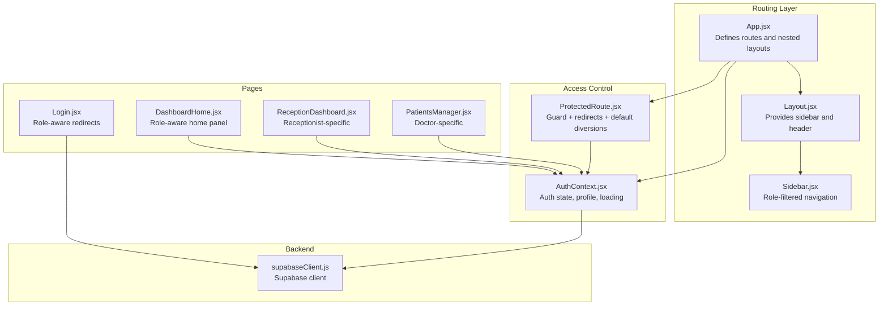
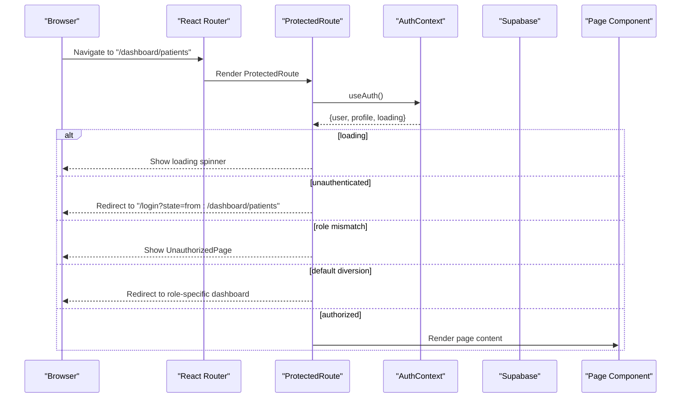
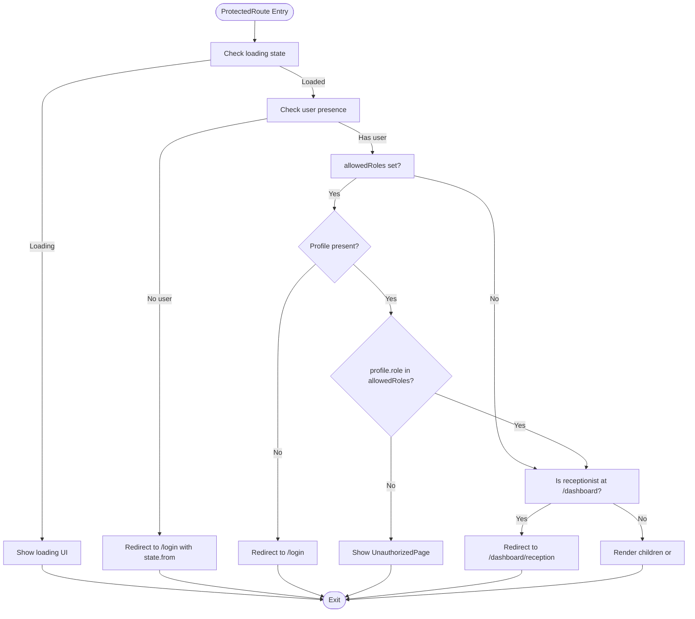
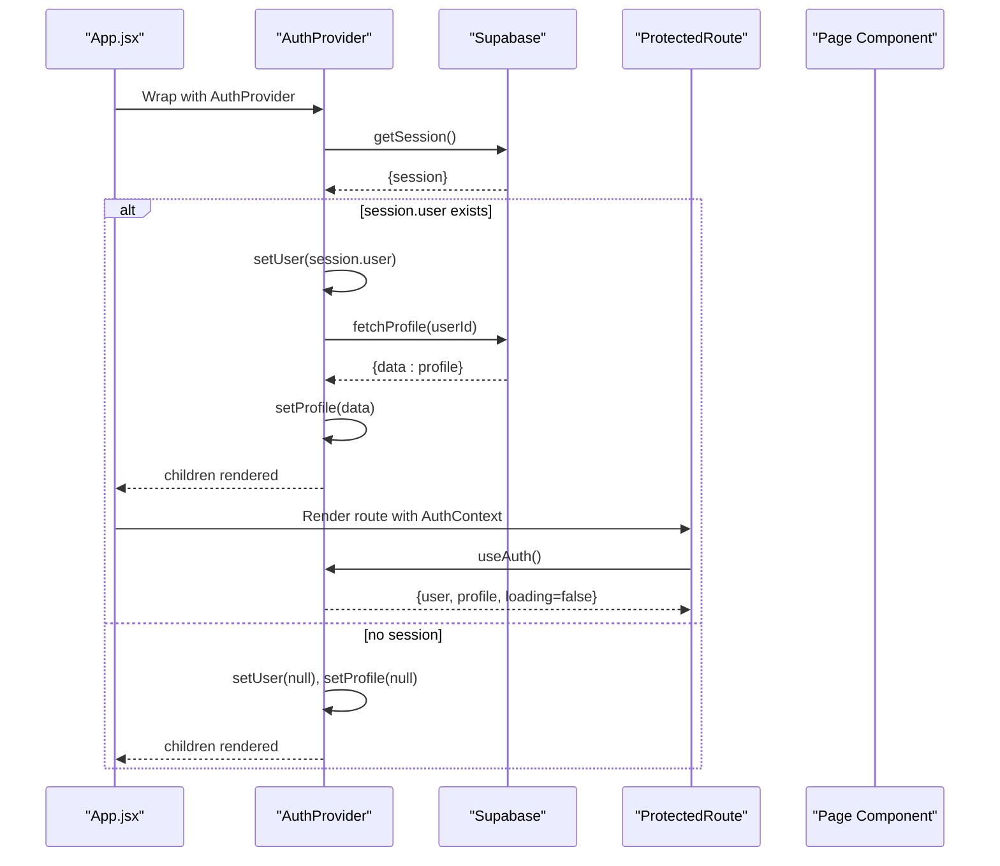
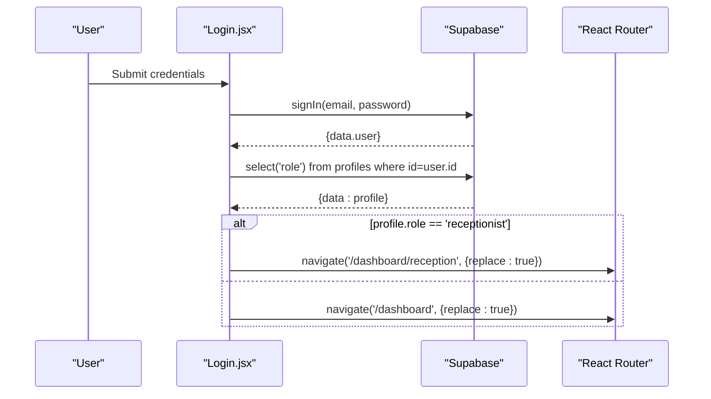
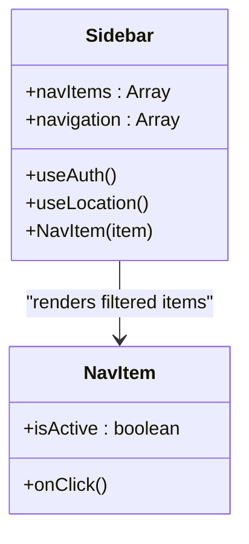
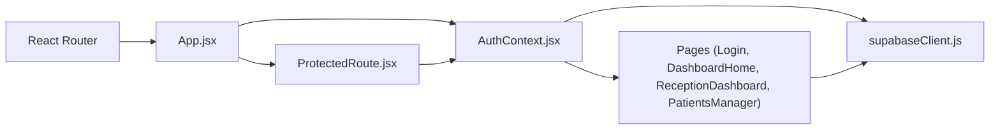

# Protected Routes & Access Control

<cite>
**Referenced Files in This Document**
- [ProtectedRoute.jsx](file://frontend/src/components/ProtectedRoute.jsx)
- [AuthContext.jsx](file://frontend/src/context/AuthContext.jsx)
- [App.jsx](file://frontend/src/App.jsx)
- [DashboardHome.jsx](file://frontend/src/pages/DashboardHome.jsx)
- [Login.jsx](file://frontend/src/pages/Login.jsx)
- [Sidebar.jsx](file://frontend/src/components/Sidebar.jsx)
- [Layout.jsx](file://frontend/src/components/Layout.jsx)
- [ReceptionDashboard.jsx](file://frontend/src/pages/ReceptionDashboard.jsx)
- [PatientsManager.jsx](file://frontend/src/pages/PatientsManager.jsx)
- [supabaseClient.js](file://frontend/src/lib/supabaseClient.js)
- [main.jsx](file://frontend/src/main.jsx)
</cite>

## Table of Contents
1. [Introduction](#introduction)
2. [Project Structure](#project-structure)
3. [Core Components](#core-components)
4. [Architecture Overview](#architecture-overview)
5. [Detailed Component Analysis](#detailed-component-analysis)
6. [Dependency Analysis](#dependency-analysis)
7. [Performance Considerations](#performance-considerations)
8. [Troubleshooting Guide](#troubleshooting-guide)
9. [Conclusion](#conclusion)

## Introduction
This document explains the protected routes and access control implementation in the frontend. It covers how ProtectedRoute enforces role-based access to dashboard pages, how AuthContext provides real-time authentication state, and how route protection integrates with dynamic navigation. It also documents redirect mechanisms for unauthorized users, dynamic menu generation based on roles, and security considerations for preventing direct URL access to protected resources.

## Project Structure
The access control system spans several frontend modules:
- Routing and layout: App.jsx defines nested routes and wraps the app with AuthProvider.
- Authentication state: AuthContext.jsx manages session, profile, and loading state.
- Route protection: ProtectedRoute.jsx checks authentication, profile presence, allowed roles, and default diversions.
- Dynamic navigation: Sidebar.jsx filters visible links by role.
- Role-specific dashboards: ReceptionDashboard.jsx and PatientsManager.jsx implement role-scoped logic.
- Supabase integration: supabaseClient.js provides the client used by AuthContext and pages.

**Diagram sources**
- [App.jsx](file://frontend/src/App.jsx#L26-L59)
- [Layout.jsx](file://frontend/src/components/Layout.jsx#L5-L42)
- [Sidebar.jsx](file://frontend/src/components/Sidebar.jsx#L19-L112)
- [AuthContext.jsx](file://frontend/src/context/AuthContext.jsx#L9-L107)
- [ProtectedRoute.jsx](file://frontend/src/components/ProtectedRoute.jsx#L53-L106)
- [Login.jsx](file://frontend/src/pages/Login.jsx#L10-L75)
- [DashboardHome.jsx](file://frontend/src/pages/DashboardHome.jsx#L275-L350)
- [ReceptionDashboard.jsx](file://frontend/src/pages/ReceptionDashboard.jsx#L37-L141)
- [PatientsManager.jsx](file://frontend/src/pages/PatientsManager.jsx#L15-L16)
- [supabaseClient.js](file://frontend/src/lib/supabaseClient.js#L1-L11)

**Section sources**
- [App.jsx](file://frontend/src/App.jsx#L26-L59)
- [main.jsx](file://frontend/src/main.jsx#L8-L16)

## Core Components
- ProtectedRoute: Enforces authentication, profile availability, allowed roles, and default diversions. It renders either a custom UnauthorizedPage, a redirect to login, or the child route content.
- AuthContext: Provides user, profile, loading state, and exposes sign-in/sign-out/profile fetch. It listens to Supabase auth state changes and updates profile accordingly.
- App routing: Declares nested routes under /dashboard with ProtectedRoute wrappers and role-specific pages.
- Sidebar: Filters navigation items by current user role and highlights active items.
- Login: Performs authentication and determines role-based redirect after successful sign-in.

**Section sources**
- [ProtectedRoute.jsx](file://frontend/src/components/ProtectedRoute.jsx#L53-L106)
- [AuthContext.jsx](file://frontend/src/context/AuthContext.jsx#L9-L107)
- [App.jsx](file://frontend/src/App.jsx#L35-L55)
- [Sidebar.jsx](file://frontend/src/components/Sidebar.jsx#L24-L35)
- [Login.jsx](file://frontend/src/pages/Login.jsx#L20-L57)

## Architecture Overview
The access control architecture combines client-side routing guards with server-backed authentication and profile retrieval.

**Diagram sources**
- [ProtectedRoute.jsx](file://frontend/src/components/ProtectedRoute.jsx#L53-L106)
- [AuthContext.jsx](file://frontend/src/context/AuthContext.jsx#L14-L41)
- [App.jsx](file://frontend/src/App.jsx#L39-L51)

## Detailed Component Analysis

### ProtectedRoute Component
ProtectedRoute orchestrates four protection stages:
1. Loading: Waits for auth session and profile resolution before deciding access.
2. Authentication: Redirects unauthenticated users to /login with the intended location preserved.
3. Role-based access: Validates profile.role against allowedRoles; otherwise shows UnauthorizedPage.
4. Default diversions: Ensures receptionists are directed to /dashboard/reception when landing on /dashboard.

**Diagram sources**
- [ProtectedRoute.jsx](file://frontend/src/components/ProtectedRoute.jsx#L53-L106)

**Section sources**
- [ProtectedRoute.jsx](file://frontend/src/components/ProtectedRoute.jsx#L53-L106)

### AuthContext Integration
AuthContext provides:
- Session and profile synchronization via Supabase auth state change listener.
- Profile fetching on session events.
- Sign-in/sign-out helpers and a fetchProfile utility.
- Provider wrapping that delays rendering children until loading completes.

**Diagram sources**
- [AuthContext.jsx](file://frontend/src/context/AuthContext.jsx#L14-L61)
- [ProtectedRoute.jsx](file://frontend/src/components/ProtectedRoute.jsx#L53-L74)

**Section sources**
- [AuthContext.jsx](file://frontend/src/context/AuthContext.jsx#L9-L107)

### Route Protection Logic and Redirect Mechanisms
- Login performs role-aware redirect after sign-in by fetching profile and navigating to /dashboard or /dashboard/reception depending on role.
- ProtectedRoute enforces:
  - Authentication redirect to /login with state.from.
  - Role mismatch redirect to UnauthorizedPage with contextual messaging.
  - Default diversion for receptionists to /dashboard/reception when landing on /dashboard.

**Diagram sources**
- [Login.jsx](file://frontend/src/pages/Login.jsx#L20-L57)

**Section sources**
- [Login.jsx](file://frontend/src/pages/Login.jsx#L20-L75)
- [ProtectedRoute.jsx](file://frontend/src/components/ProtectedRoute.jsx#L77-L103)

### Dynamic Menu Generation Based on Roles
Sidebar filters navigation items using a roles array per item and displays only those matching profile.role. It also highlights the active link based on location pathname.

**Diagram sources**
- [Sidebar.jsx](file://frontend/src/components/Sidebar.jsx#L24-L67)

**Section sources**
- [Sidebar.jsx](file://frontend/src/components/Sidebar.jsx#L19-L112)

### Role-Specific Navigation and Conditional Rendering
- App.jsx declares nested routes under /dashboard with ProtectedRoute wrappers and role-specific pages:
  - Shared routes: appointments accessible by patient and doctor.
  - Doctor-only routes: patients, availability, earnings.
  - Patient-only route: prescriptions.
  - Receptionist-only route: reception dashboard.
- DashboardHome.jsx conditionally redirects receptionists to /dashboard/reception and renders role-specific panels.

**Section sources**
- [App.jsx](file://frontend/src/App.jsx#L35-L55)
- [DashboardHome.jsx](file://frontend/src/pages/DashboardHome.jsx#L347-L349)

### Role-Specific Pages
- ReceptionDashboard.jsx:
  - Uses profile.employer_id to scope queries to the associated doctor’s patients.
  - Handles unlinked receptionist accounts with a contextual message.
  - Subscribes to Supabase realtime events for live updates.
- PatientsManager.jsx:
  - Doctor-only page that lists patients and supports actions like adding/editing and prescribing.

**Section sources**
- [ReceptionDashboard.jsx](file://frontend/src/pages/ReceptionDashboard.jsx#L37-L141)
- [PatientsManager.jsx](file://frontend/src/pages/PatientsManager.jsx#L15-L16)

## Dependency Analysis
The access control stack depends on:
- React Router for routing and navigation.
- AuthContext for centralized auth state and profile resolution.
- Supabase client for authentication and profile retrieval.
- ProtectedRoute as the single source of truth for access decisions.

**Diagram sources**
- [App.jsx](file://frontend/src/App.jsx#L26-L59)
- [AuthContext.jsx](file://frontend/src/context/AuthContext.jsx#L9-L107)
- [ProtectedRoute.jsx](file://frontend/src/components/ProtectedRoute.jsx#L53-L106)
- [supabaseClient.js](file://frontend/src/lib/supabaseClient.js#L1-L11)

**Section sources**
- [App.jsx](file://frontend/src/App.jsx#L26-L59)
- [AuthContext.jsx](file://frontend/src/context/AuthContext.jsx#L9-L107)
- [ProtectedRoute.jsx](file://frontend/src/components/ProtectedRoute.jsx#L53-L106)
- [supabaseClient.js](file://frontend/src/lib/supabaseClient.js#L1-L11)

## Performance Considerations
- Minimize blocking: AuthContext resolves loading only after profile fetch completes to avoid premature rendering.
- Real-time updates: Supabase auth state listener ensures immediate updates without polling.
- Conditional rendering: ProtectedRoute short-circuits early on loading/unauthenticated states to reduce unnecessary work.
- Sidebar filtering: Role-based filtering occurs client-side and is O(n) over navItems, negligible overhead.

## Troubleshooting Guide
Common issues and resolutions:
- Stuck on loading spinner:
  - Cause: AuthContext still resolving session/profile.
  - Action: Verify Supabase credentials and network connectivity.
- Redirect loop to /login:
  - Cause: Missing or invalid session; profile fetch failed.
  - Action: Clear browser cache/session, re-authenticate, and ensure profile exists.
- UnauthorizedPage shown unexpectedly:
  - Cause: profile.role not included in allowedRoles.
  - Action: Confirm user role and adjust route configuration.
- Receptionist redirected incorrectly:
  - Cause: Landing on /dashboard without allowedRoles.
  - Action: Ensure ProtectedRoute wrapper includes allowedRoles or rely on default diversion.

**Section sources**
- [ProtectedRoute.jsx](file://frontend/src/components/ProtectedRoute.jsx#L59-L103)
- [AuthContext.jsx](file://frontend/src/context/AuthContext.jsx#L14-L61)

## Conclusion
The access control system combines a robust ProtectedRoute guard with AuthContext-driven authentication and Supabase-backed profile resolution. It enforces role-based access, provides clear user feedback on unauthorized access, and dynamically adapts navigation and default routes based on user roles. Together with role-specific pages and dynamic menu generation, it delivers a secure and user-friendly experience across roles.