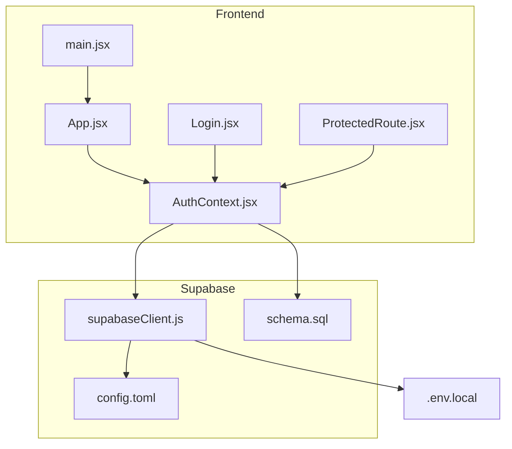
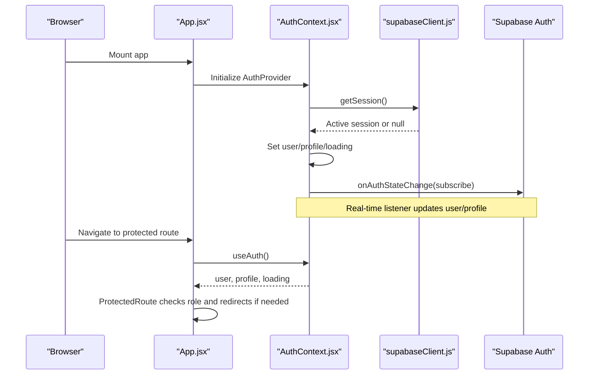
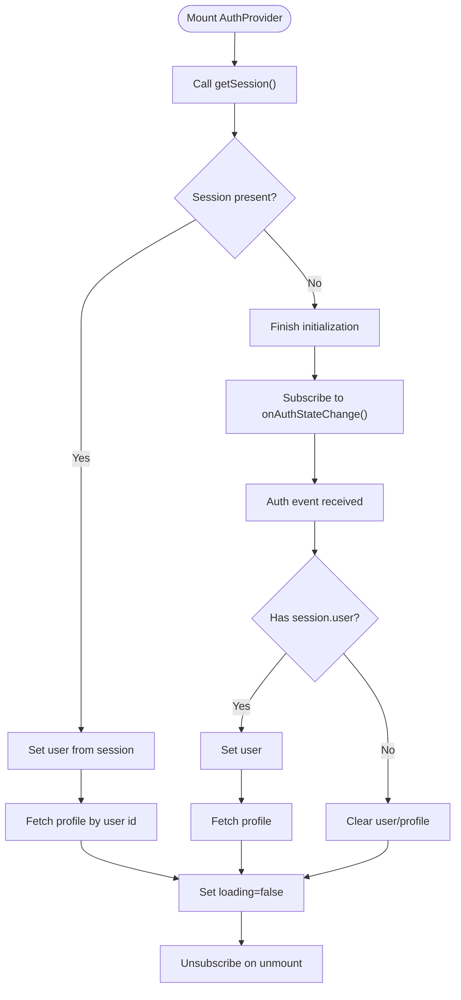
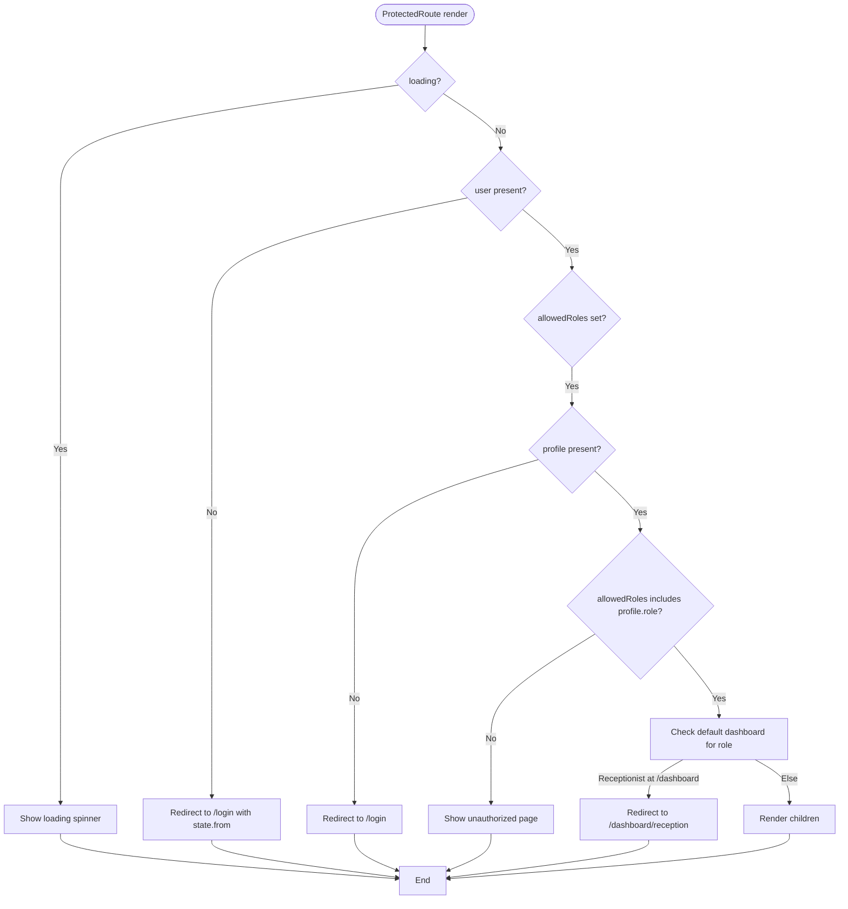
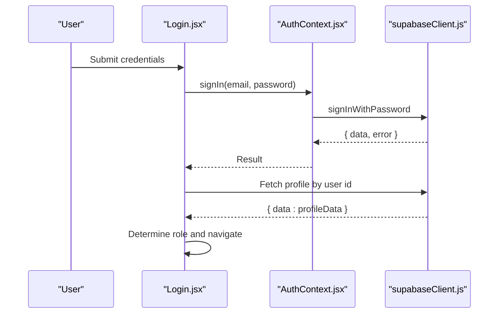
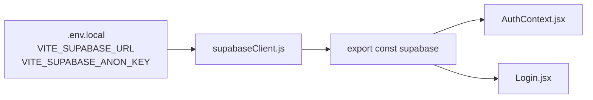
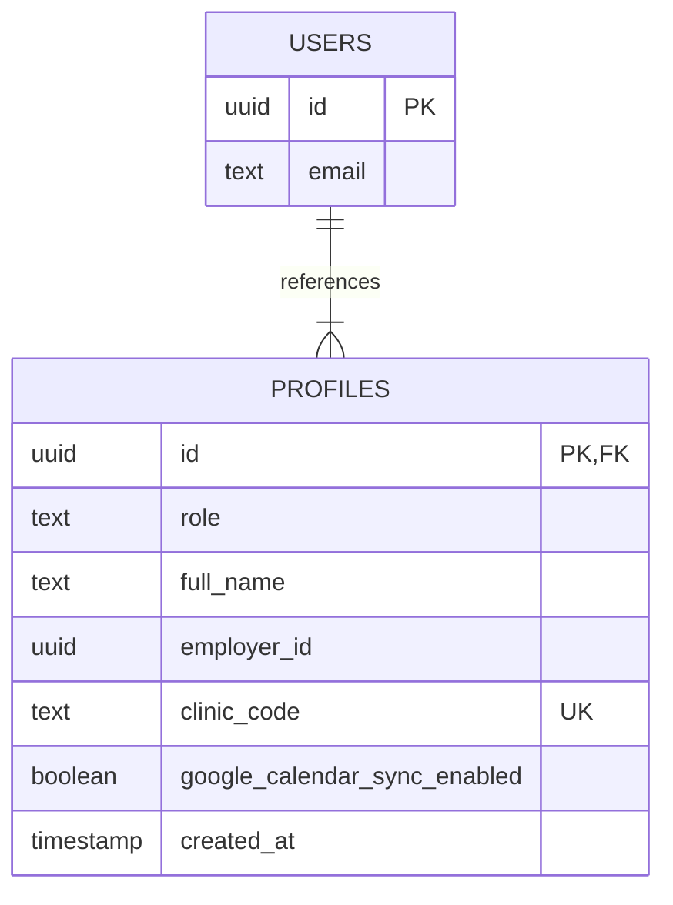
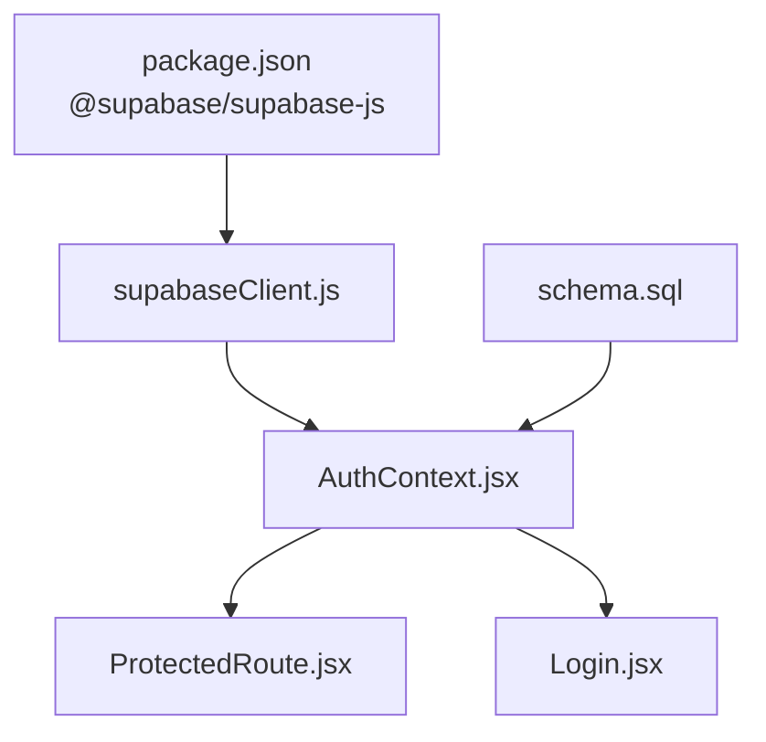

# Session Management & Security

<cite>
**Referenced Files in This Document**
- [AuthContext.jsx](file://frontend/src/context/AuthContext.jsx)
- [supabaseClient.js](file://frontend/src/lib/supabaseClient.js)
- [Login.jsx](file://frontend/src/pages/Login.jsx)
- [ProtectedRoute.jsx](file://frontend/src/components/ProtectedRoute.jsx)
- [App.jsx](file://frontend/src/App.jsx)
- [main.jsx](file://frontend/src/main.jsx)
- [schema.sql](file://backend/schema.sql)
- [config.toml](file://supabase/config.toml)
- [.env.local](file://frontend/.env.local)
- [package.json](file://frontend/package.json)
</cite>

## Table of Contents
1. [Introduction](#introduction)
2. [Project Structure](#project-structure)
3. [Core Components](#core-components)
4. [Architecture Overview](#architecture-overview)
5. [Detailed Component Analysis](#detailed-component-analysis)
6. [Dependency Analysis](#dependency-analysis)
7. [Performance Considerations](#performance-considerations)
8. [Troubleshooting Guide](#troubleshooting-guide)
9. [Conclusion](#conclusion)
10. [Appendices](#appendices)

## Introduction
This document explains how MedVita manages sessions and enforces security using Supabase Auth. It covers JWT lifecycle, session persistence across browser refreshes, automatic session restoration, real-time auth state synchronization, role-based access control, and security best practices. It also provides troubleshooting guidance for common session and authentication issues.

## Project Structure
MedVita’s frontend initializes routing and wraps the app with an authentication provider. Authentication state is managed centrally and consumed by protected routes and pages. Supabase client initialization is environment-driven and shared across modules.

**Diagram sources**
- [main.jsx](file://frontend/src/main.jsx#L1-L17)
- [App.jsx](file://frontend/src/App.jsx#L1-L62)
- [AuthContext.jsx](file://frontend/src/context/AuthContext.jsx#L1-L108)
- [Login.jsx](file://frontend/src/pages/Login.jsx#L1-L204)
- [ProtectedRoute.jsx](file://frontend/src/components/ProtectedRoute.jsx#L1-L108)
- [supabaseClient.js](file://frontend/src/lib/supabaseClient.js#L1-L11)
- [config.toml](file://supabase/config.toml#L146-L265)
- [schema.sql](file://backend/schema.sql#L1-L274)
- [.env.local](file://frontend/.env.local#L1-L5)

**Section sources**
- [main.jsx](file://frontend/src/main.jsx#L1-L17)
- [App.jsx](file://frontend/src/App.jsx#L1-L62)
- [AuthContext.jsx](file://frontend/src/context/AuthContext.jsx#L1-L108)
- [supabaseClient.js](file://frontend/src/lib/supabaseClient.js#L1-L11)
- [config.toml](file://supabase/config.toml#L146-L265)
- [schema.sql](file://backend/schema.sql#L1-L274)
- [.env.local](file://frontend/.env.local#L1-L5)

## Core Components
- AuthContext: Centralizes session retrieval, real-time auth state synchronization, profile loading, and sign-out. It initializes Supabase session on mount and subscribes to auth state changes.
- ProtectedRoute: Enforces role-based access control and ensures users are directed to correct dashboards based on role.
- Login: Handles credential-based sign-in, displays user-friendly errors, and redirects based on role.
- Supabase Client: Initializes Supabase with environment variables and exposes the Supabase client instance.
- Backend Schema: Defines profiles and row-level security policies that enforce access control and profile creation hooks.

Key responsibilities:
- Automatic session restoration on page load via getSession().
- Real-time auth state synchronization via onAuthStateChange().
- Role-aware routing and redirection.
- Profile-based access control enforcement.

**Section sources**
- [AuthContext.jsx](file://frontend/src/context/AuthContext.jsx#L9-L107)
- [ProtectedRoute.jsx](file://frontend/src/components/ProtectedRoute.jsx#L53-L106)
- [Login.jsx](file://frontend/src/pages/Login.jsx#L20-L75)
- [supabaseClient.js](file://frontend/src/lib/supabaseClient.js#L1-L11)
- [schema.sql](file://backend/schema.sql#L239-L274)

## Architecture Overview
The authentication flow integrates the frontend with Supabase Auth. On startup, the app retrieves the active session and subscribes to auth state changes. Protected routes rely on the context to gate access until both session and profile are resolved.

**Diagram sources**
- [App.jsx](file://frontend/src/App.jsx#L26-L59)
- [AuthContext.jsx](file://frontend/src/context/AuthContext.jsx#L14-L41)
- [supabaseClient.js](file://frontend/src/lib/supabaseClient.js#L1-L11)

**Section sources**
- [App.jsx](file://frontend/src/App.jsx#L26-L59)
- [AuthContext.jsx](file://frontend/src/context/AuthContext.jsx#L14-L41)
- [ProtectedRoute.jsx](file://frontend/src/components/ProtectedRoute.jsx#L53-L106)

## Detailed Component Analysis

### AuthContext: Session Management and Real-Time Sync
AuthContext centralizes session handling:
- Retrieves the active session on mount using getSession().
- Subscribes to onAuthStateChange to receive real-time updates (login/logout, token refresh).
- Loads profile data upon successful login and clears state on logout.
- Exposes sign-in, sign-up, and sign-out functions.

**Diagram sources**
- [AuthContext.jsx](file://frontend/src/context/AuthContext.jsx#L14-L41)

**Section sources**
- [AuthContext.jsx](file://frontend/src/context/AuthContext.jsx#L9-L107)

### ProtectedRoute: Role-Based Access Control and Redirection
ProtectedRoute enforces:
- Loading state until auth and profile are resolved.
- Redirects unauthenticated users to login with return location.
- Role checks against allowedRoles and profile.role.
- Correct dashboard redirection for receptionists landing on generic dashboard.

**Diagram sources**
- [ProtectedRoute.jsx](file://frontend/src/components/ProtectedRoute.jsx#L53-L106)

**Section sources**
- [ProtectedRoute.jsx](file://frontend/src/components/ProtectedRoute.jsx#L53-L106)

### Login: Credential-Based Authentication and Role-Based Redirect
Login performs:
- Credential validation via Supabase sign-in.
- Immediate profile fetch to determine role and redirect accordingly.
- User-friendly error messaging for common failure scenarios.

**Diagram sources**
- [Login.jsx](file://frontend/src/pages/Login.jsx#L20-L75)
- [AuthContext.jsx](file://frontend/src/context/AuthContext.jsx#L84-L86)

**Section sources**
- [Login.jsx](file://frontend/src/pages/Login.jsx#L20-L75)
- [AuthContext.jsx](file://frontend/src/context/AuthContext.jsx#L84-L86)

### Supabase Client Initialization and Environment Variables
Supabase client is initialized with Vite environment variables. The frontend reads Supabase URL and anon key from .env.local and creates a client instance for all authentication operations.

**Diagram sources**
- [.env.local](file://frontend/.env.local#L1-L5)
- [supabaseClient.js](file://frontend/src/lib/supabaseClient.js#L1-L11)

**Section sources**
- [.env.local](file://frontend/.env.local#L1-L5)
- [supabaseClient.js](file://frontend/src/lib/supabaseClient.js#L1-L11)

### Backend Schema: Profiles, Policies, and Profile Creation Hook
The backend schema defines:
- Profiles table extending Supabase Auth users with role, clinic code, and employer linkage.
- Row-level security policies enforcing access control.
- A PostgreSQL function and trigger to auto-create profiles on new user registration.

**Diagram sources**
- [schema.sql](file://backend/schema.sql#L4-L14)
- [schema.sql](file://backend/schema.sql#L239-L274)

**Section sources**
- [schema.sql](file://backend/schema.sql#L4-L14)
- [schema.sql](file://backend/schema.sql#L239-L274)

## Dependency Analysis
- Frontend depends on @supabase/supabase-js for authentication operations.
- AuthContext depends on Supabase client and the backend schema for profile resolution.
- ProtectedRoute depends on AuthContext for user and profile state.
- Login depends on AuthContext and Supabase client for authentication.

**Diagram sources**
- [package.json](file://frontend/package.json#L13-L31)
- [supabaseClient.js](file://frontend/src/lib/supabaseClient.js#L1-L11)
- [AuthContext.jsx](file://frontend/src/context/AuthContext.jsx#L1-L108)
- [ProtectedRoute.jsx](file://frontend/src/components/ProtectedRoute.jsx#L1-L108)
- [Login.jsx](file://frontend/src/pages/Login.jsx#L1-L204)
- [schema.sql](file://backend/schema.sql#L1-L274)

**Section sources**
- [package.json](file://frontend/package.json#L13-L31)
- [supabaseClient.js](file://frontend/src/lib/supabaseClient.js#L1-L11)
- [AuthContext.jsx](file://frontend/src/context/AuthContext.jsx#L1-L108)
- [ProtectedRoute.jsx](file://frontend/src/components/ProtectedRoute.jsx#L1-L108)
- [Login.jsx](file://frontend/src/pages/Login.jsx#L1-L204)
- [schema.sql](file://backend/schema.sql#L1-L274)

## Performance Considerations
- Minimize profile fetches: AuthContext fetches profile once per auth state change; avoid redundant queries elsewhere.
- Debounce or batch UI updates during rapid auth state transitions to reduce re-renders.
- Keep JWT expiry reasonable to balance security and user experience; monitor rate limits and adjust as needed.
- Use lazy loading for heavy dashboard components to improve perceived performance after authentication.

## Troubleshooting Guide
Common session and authentication issues:
- Session not restored after refresh:
  - Verify environment variables are present and correct.
  - Confirm Supabase client initialization occurs before AuthProvider mounts.
  - Check that onAuthStateChange subscription is active and not unsubscribed prematurely.

- Role-based redirect incorrect:
  - Ensure profile is fetched and role is set before ProtectedRoute renders.
  - Validate that profile.role matches expected values and that allowedRoles aligns with routes.

- Login fails with “Invalid login credentials” or “Email not confirmed”:
  - Review error handling in Login and display appropriate messages.
  - Confirm Supabase Auth settings and email confirmation requirements.

- Rate limit errors:
  - Respect Supabase rate limits for sign-ups and sign-ins.
  - Implement client-side throttling and user feedback.

- Real-time auth state not updating:
  - Ensure onAuthStateChange is subscribed and not disposed early.
  - Verify backend policies and triggers are intact.

Security best practices:
- Enforce role-based access control in both frontend and backend.
- Use RLS policies consistently across tables.
- Avoid storing sensitive data client-side; rely on Supabase Auth and server-side logic.
- Monitor and rotate secrets; avoid committing environment variables to version control.

Additional security layers:
- Two-Factor Authentication (2FA): Enable TOTP or Phone MFA in Supabase Auth configuration and integrate verification flows in the frontend.

**Section sources**
- [Login.jsx](file://frontend/src/pages/Login.jsx#L59-L75)
- [ProtectedRoute.jsx](file://frontend/src/components/ProtectedRoute.jsx#L77-L93)
- [AuthContext.jsx](file://frontend/src/context/AuthContext.jsx#L26-L38)
- [config.toml](file://supabase/config.toml#L146-L265)

## Conclusion
MedVita’s session management leverages Supabase Auth for robust, real-time authentication state synchronization. The AuthContext centralizes session retrieval and profile loading, while ProtectedRoute enforces role-based access control. The backend schema and RLS policies provide strong data-level protections. By following the troubleshooting steps and security best practices outlined, teams can maintain reliable, secure user sessions across browser refreshes and restore user contexts seamlessly.

## Appendices

### JWT and Token Lifecycle
- JWT expiry and refresh token rotation are configured in Supabase Auth settings.
- Refresh token rotation helps mitigate replay attacks and improves resilience against token theft.
- Ensure client-side logic respects token lifetimes and gracefully handles expiration.

**Section sources**
- [config.toml](file://supabase/config.toml#L153-L163)

### Logout Mechanisms and Session Cleanup
- Use the sign-out function exposed by AuthContext to terminate the current session.
- The onAuthStateChange listener will detect the logout event and clear user/profile state.
- Ensure cleanup subscriptions on component unmount to prevent memory leaks.

**Section sources**
- [AuthContext.jsx](file://frontend/src/context/AuthContext.jsx#L88-L90)
- [AuthContext.jsx](file://frontend/src/context/AuthContext.jsx#L40)

### Secure Token Storage
- Supabase SDK manages tokens securely; avoid manual token storage in client-side storage.
- Prefer short-lived JWTs with refresh token rotation enabled.
- Avoid exposing Supabase keys in client bundles; use environment variables and backend proxies where applicable.

**Section sources**
- [supabaseClient.js](file://frontend/src/lib/supabaseClient.js#L1-L11)
- [config.toml](file://supabase/config.toml#L153-L163)