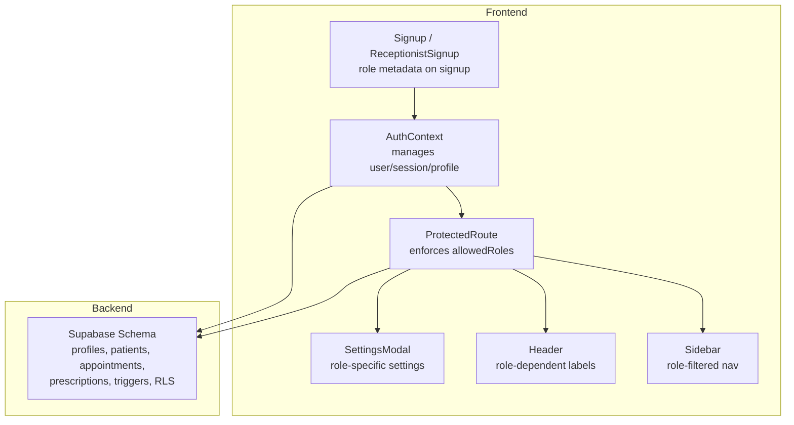
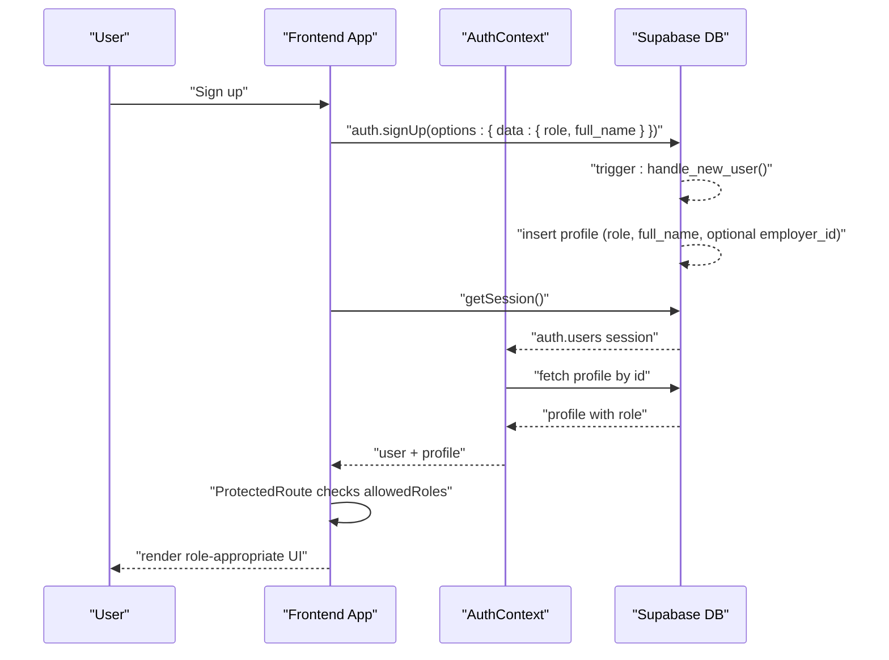
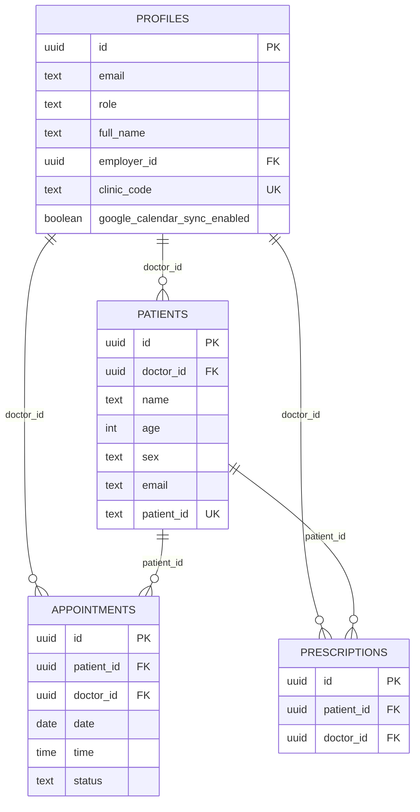
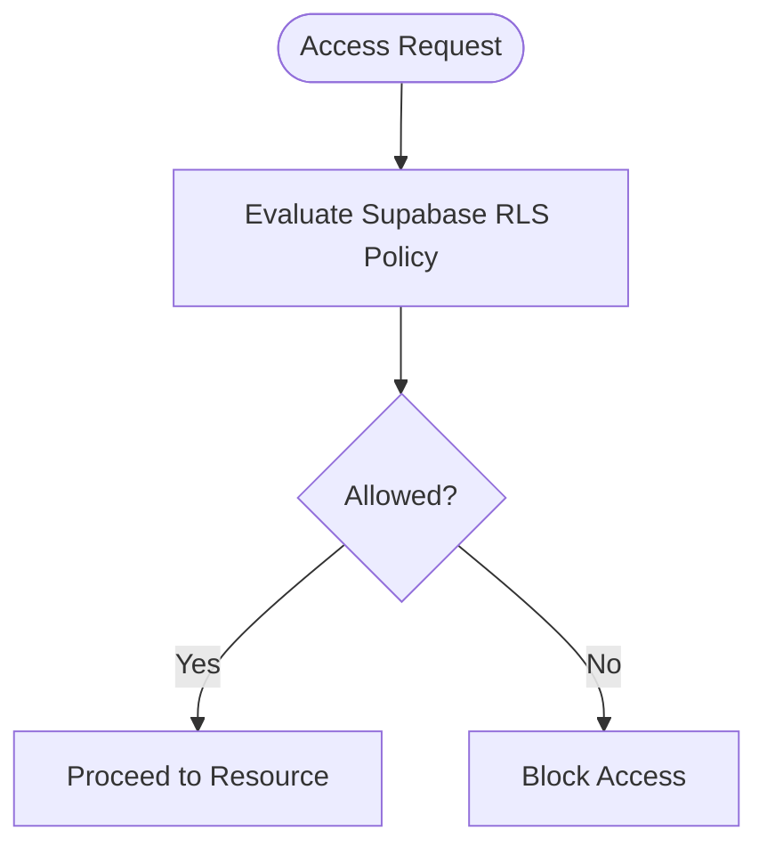
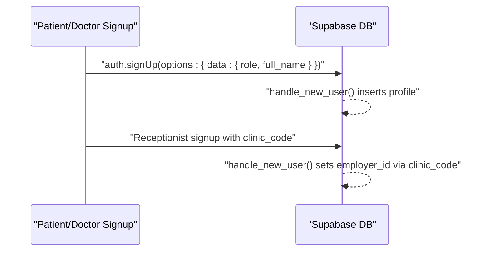
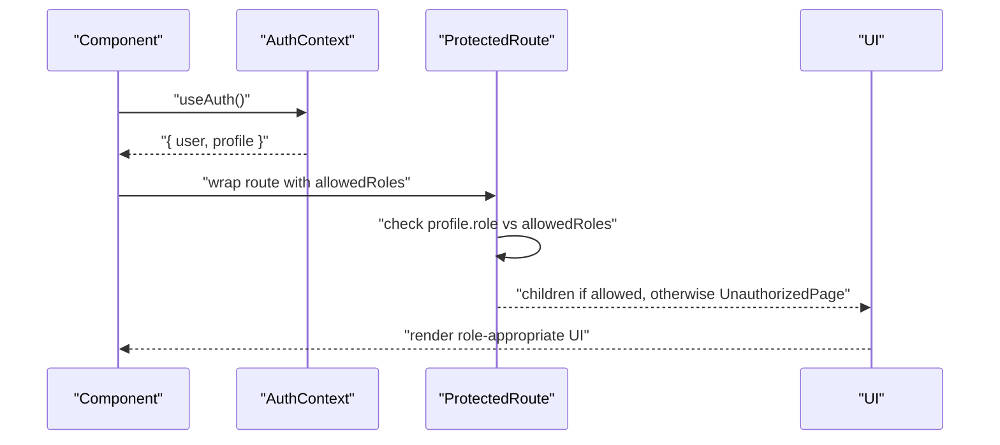
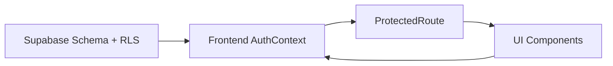

# User Roles & Permissions

<cite>
**Referenced Files in This Document**
- [schema.sql](file://backend/schema.sql)
- [AuthContext.jsx](file://frontend/src/context/AuthContext.jsx)
- [supabaseClient.js](file://frontend/src/lib/supabaseClient.js)
- [ProtectedRoute.jsx](file://frontend/src/components/ProtectedRoute.jsx)
- [Sidebar.jsx](file://frontend/src/components/Sidebar.jsx)
- [Header.jsx](file://frontend/src/components/Header.jsx)
- [SettingsModal.jsx](file://frontend/src/components/SettingsModal.jsx)
- [Signup.jsx](file://frontend/src/pages/Signup.jsx)
- [ReceptionistSignup.jsx](file://frontend/src/pages/ReceptionistSignup.jsx)
- [App.jsx](file://frontend/src/App.jsx)
- [DEBUG_DISABLE_RLS.sql](file://_trash/DEBUG_DISABLE_RLS.sql)
</cite>

## Table of Contents
1. [Introduction](#introduction)
2. [Project Structure](#project-structure)
3. [Core Components](#core-components)
4. [Architecture Overview](#architecture-overview)
5. [Detailed Component Analysis](#detailed-component-analysis)
6. [Dependency Analysis](#dependency-analysis)
7. [Performance Considerations](#performance-considerations)
8. [Troubleshooting Guide](#troubleshooting-guide)
9. [Conclusion](#conclusion)

## Introduction
This document explains how user roles and permissions are modeled and enforced in MedVita. The system defines three roles: Doctor, Patient, and Receptionist. Roles are stored in the database and enforced through Supabase Row Level Security (RLS) policies. On the frontend, authentication state and profile metadata are managed in a React context, and routing is protected by a role-aware ProtectedRoute wrapper. This guide covers the database schema, RLS policies, profile creation during registration, role-based UI rendering, and practical examples of enforcing permissions in components.

## Project Structure
The role and permission system spans the backend database schema and the frontend authentication and routing layers:
- Backend: Supabase SQL schema defines tables, RLS policies, and a trigger to auto-create profiles on user signup.
- Frontend: Authentication context manages session and profile, ProtectedRoute enforces role-based access, and UI components render conditionally based on role.

**Diagram sources**
- [schema.sql](file://backend/schema.sql#L1-L274)
- [AuthContext.jsx](file://frontend/src/context/AuthContext.jsx#L1-L108)
- [ProtectedRoute.jsx](file://frontend/src/components/ProtectedRoute.jsx#L53-L106)
- [Sidebar.jsx](file://frontend/src/components/Sidebar.jsx#L24-L35)
- [Header.jsx](file://frontend/src/components/Header.jsx#L23-L102)
- [SettingsModal.jsx](file://frontend/src/components/SettingsModal.jsx#L42-L56)
- [Signup.jsx](file://frontend/src/pages/Signup.jsx#L31-L41)
- [ReceptionistSignup.jsx](file://frontend/src/pages/ReceptionistSignup.jsx#L48-L58)

**Section sources**
- [schema.sql](file://backend/schema.sql#L1-L274)
- [AuthContext.jsx](file://frontend/src/context/AuthContext.jsx#L1-L108)
- [ProtectedRoute.jsx](file://frontend/src/components/ProtectedRoute.jsx#L53-L106)
- [Sidebar.jsx](file://frontend/src/components/Sidebar.jsx#L24-L35)
- [Header.jsx](file://frontend/src/components/Header.jsx#L23-L102)
- [SettingsModal.jsx](file://frontend/src/components/SettingsModal.jsx#L42-L56)
- [Signup.jsx](file://frontend/src/pages/Signup.jsx#L31-L41)
- [ReceptionistSignup.jsx](file://frontend/src/pages/ReceptionistSignup.jsx#L48-L58)

## Core Components
- Roles and metadata: The profiles table stores role and related fields. The role column is constrained to the three values and defaults to patient.
- Auto-profile creation: A database trigger reads raw_user_meta_data on auth.users insert and creates a matching profile, including special handling for receptionists who supply a clinic code to link to a doctor.
- RLS enforcement: Supabase policies govern access to profiles, patients, appointments, and prescriptions. These policies reference auth.uid(), auth.email(), and the role/employer relationship.
- Frontend auth and routing: AuthContext fetches and exposes the user’s profile. ProtectedRoute checks allowedRoles against profile.role and redirects appropriately. UI components render conditionally based on profile.role.

**Section sources**
- [schema.sql](file://backend/schema.sql#L5-L14)
- [schema.sql](file://backend/schema.sql#L239-L274)
- [schema.sql](file://backend/schema.sql#L30-L43)
- [schema.sql](file://backend/schema.sql#L71-L115)
- [schema.sql](file://backend/schema.sql#L158-L198)
- [schema.sql](file://backend/schema.sql#L209-L224)
- [AuthContext.jsx](file://frontend/src/context/AuthContext.jsx#L43-L61)
- [ProtectedRoute.jsx](file://frontend/src/components/ProtectedRoute.jsx#L81-L93)
- [Sidebar.jsx](file://frontend/src/components/Sidebar.jsx#L24-L35)

## Architecture Overview
The system enforces role-based access across two planes:
- Database plane: Supabase RLS policies restrict reads/writes based on identity and role relationships.
- Application plane: React components and routes gate access and render role-appropriate UI.

**Diagram sources**
- [Signup.jsx](file://frontend/src/pages/Signup.jsx#L31-L41)
- [ReceptionistSignup.jsx](file://frontend/src/pages/ReceptionistSignup.jsx#L48-L58)
- [schema.sql](file://backend/schema.sql#L239-L274)
- [AuthContext.jsx](file://frontend/src/context/AuthContext.jsx#L14-L61)
- [ProtectedRoute.jsx](file://frontend/src/components/ProtectedRoute.jsx#L53-L106)

## Detailed Component Analysis

### Database Schema and RLS Policies
- Profiles table
  - Columns include id (FK to auth.users), role (enum-like constraint), employer_id (for linking receptionists to a doctor), clinic_code (unique for doctors), and sync flag for Google Calendar.
  - RLS allows selecting any profile, inserting/updating only one’s own profile.
- Patients table
  - RLS grants doctors full CRUD on their own patients; receptionists can view/update/delete only patients linked to their employer doctor; patients can view their own record by email.
- Appointments table
  - RLS allows patients and doctors to view their own appointments; receptionists can also view if the appointment links to a patient they manage; insertion is permitted for the patient/doctor or via a join; updates are restricted to doctors.
- Prescriptions table
  - Doctors have full control; patients can view prescriptions linked to their own patient record.
- Storage
  - Files bucket policies allow authenticated users to upload/view files.

**Diagram sources**
- [schema.sql](file://backend/schema.sql#L5-L14)
- [schema.sql](file://backend/schema.sql#L45-L58)
- [schema.sql](file://backend/schema.sql#L137-L147)
- [schema.sql](file://backend/schema.sql#L200-L208)

**Section sources**
- [schema.sql](file://backend/schema.sql#L5-L14)
- [schema.sql](file://backend/schema.sql#L30-L43)
- [schema.sql](file://backend/schema.sql#L71-L115)
- [schema.sql](file://backend/schema.sql#L158-L198)
- [schema.sql](file://backend/schema.sql#L209-L224)
- [schema.sql](file://backend/schema.sql#L226-L237)

### Role-Based Access Control Implementation
- Doctor
  - Owns patients, appointments, and prescriptions; can manage availability; can view all doctor availability; can upload/view files.
- Patient
  - Owns their patient record; can view their own appointments and prescriptions; can view doctor availability.
- Receptionist
  - Links to a doctor via clinic_code; can view/manage only patients belonging to their employer doctor; can view their own appointments and prescriptions; cannot modify doctor-owned data.

**Diagram sources**
- [schema.sql](file://backend/schema.sql#L71-L115)
- [schema.sql](file://backend/schema.sql#L158-L198)
- [schema.sql](file://backend/schema.sql#L209-L224)

**Section sources**
- [schema.sql](file://backend/schema.sql#L71-L115)
- [schema.sql](file://backend/schema.sql#L158-L198)
- [schema.sql](file://backend/schema.sql#L209-L224)

### Profile Creation During Registration
- Non-staff signup
  - The signup page sends role and full_name in the sign-up options. The backend trigger creates a profile with role and full_name.
- Receptionist signup
  - The receptionist signup page validates a 6-character clinic code, verifies the doctor’s profile, then signs up the receptionist with role and clinic_code. The trigger resolves employer_id by matching the clinic code to a doctor’s profile.

**Diagram sources**
- [Signup.jsx](file://frontend/src/pages/Signup.jsx#L31-L41)
- [ReceptionistSignup.jsx](file://frontend/src/pages/ReceptionistSignup.jsx#L34-L60)
- [schema.sql](file://backend/schema.sql#L239-L274)

**Section sources**
- [Signup.jsx](file://frontend/src/pages/Signup.jsx#L31-L41)
- [ReceptionistSignup.jsx](file://frontend/src/pages/ReceptionistSignup.jsx#L34-L60)
- [schema.sql](file://backend/schema.sql#L239-L274)

### Role Metadata Storage and Management
- Role metadata is stored in the profiles table and is populated from raw_user_meta_data during auth.users insert.
- Receptionists carry an employer_id that ties them to a doctor’s clinic_code.
- Frontend AuthContext fetches the profile and exposes role to components.

**Section sources**
- [schema.sql](file://backend/schema.sql#L5-L14)
- [schema.sql](file://backend/schema.sql#L239-L274)
- [AuthContext.jsx](file://frontend/src/context/AuthContext.jsx#L43-L61)

### Practical Examples: Role Checking and Permission-Based UI
- ProtectedRoute enforces allowedRoles against profile.role and redirects unauthorised users to an access-denied page or back to the user’s home route.
- Sidebar renders navigation items only for the current role.
- Header displays role-dependent labels and conditionally initializes integrations (e.g., Google Calendar) based on role.
- SettingsModal exposes role-specific settings (e.g., clinic code generation and sharing) only to doctors.

**Diagram sources**
- [ProtectedRoute.jsx](file://frontend/src/components/ProtectedRoute.jsx#L53-L106)
- [Sidebar.jsx](file://frontend/src/components/Sidebar.jsx#L24-L35)
- [Header.jsx](file://frontend/src/components/Header.jsx#L23-L102)
- [SettingsModal.jsx](file://frontend/src/components/SettingsModal.jsx#L42-L56)

**Section sources**
- [ProtectedRoute.jsx](file://frontend/src/components/ProtectedRoute.jsx#L53-L106)
- [Sidebar.jsx](file://frontend/src/components/Sidebar.jsx#L24-L35)
- [Header.jsx](file://frontend/src/components/Header.jsx#L23-L102)
- [SettingsModal.jsx](file://frontend/src/components/SettingsModal.jsx#L42-L56)

### Role Transitions, Inheritance, and Security Implications
- Role transitions
  - Roles are set at signup and stored in the profile. There is no explicit migration path shown in the codebase; transitions would require backend changes to update profile.role and potentially adjust RLS policies.
- Permission inheritance
  - Receptionists inherit permissions scoped to their employer doctor via employer_id and clinic_code. This limits their access to only patients linked to that doctor.
- Security implications
  - RLS policies prevent cross-role data access. The profiles trigger ensures consistent metadata. Storage policies restrict file access to authenticated users.

**Section sources**
- [schema.sql](file://backend/schema.sql#L5-L14)
- [schema.sql](file://backend/schema.sql#L239-L274)
- [schema.sql](file://backend/schema.sql#L71-L115)
- [schema.sql](file://backend/schema.sql#L158-L198)
- [schema.sql](file://backend/schema.sql#L226-L237)

## Dependency Analysis
- Frontend depends on Supabase client and AuthContext for session and profile data.
- ProtectedRoute depends on AuthContext and profile.role to enforce allowedRoles.
- UI components depend on profile.role for conditional rendering.
- Backend depends on Supabase RLS policies and triggers to enforce access.

**Diagram sources**
- [schema.sql](file://backend/schema.sql#L1-L274)
- [AuthContext.jsx](file://frontend/src/context/AuthContext.jsx#L1-L108)
- [ProtectedRoute.jsx](file://frontend/src/components/ProtectedRoute.jsx#L53-L106)
- [Sidebar.jsx](file://frontend/src/components/Sidebar.jsx#L24-L35)
- [Header.jsx](file://frontend/src/components/Header.jsx#L23-L102)
- [SettingsModal.jsx](file://frontend/src/components/SettingsModal.jsx#L42-L56)

**Section sources**
- [schema.sql](file://backend/schema.sql#L1-L274)
- [AuthContext.jsx](file://frontend/src/context/AuthContext.jsx#L1-L108)
- [ProtectedRoute.jsx](file://frontend/src/components/ProtectedRoute.jsx#L53-L106)
- [Sidebar.jsx](file://frontend/src/components/Sidebar.jsx#L24-L35)
- [Header.jsx](file://frontend/src/components/Header.jsx#L23-L102)
- [SettingsModal.jsx](file://frontend/src/components/SettingsModal.jsx#L42-L56)

## Performance Considerations
- RLS evaluation occurs server-side; keep policies minimal and targeted to reduce overhead.
- Profile fetching is cached per session in AuthContext; avoid redundant queries.
- UI filtering by role (e.g., Sidebar) is client-side and lightweight.

## Troubleshooting Guide
- Access denied errors
  - Verify the user’s profile.role and that allowedRoles includes it in ProtectedRoute.
  - Confirm the user is on the correct home route for their role.
- Missing profile data
  - Ensure the handle_new_user trigger executed after signup and that the profile is fetched in AuthContext.
- Unexpected data visibility
  - Use the debug script to temporarily disable RLS on appointments to verify data presence and policy logic.

**Section sources**
- [ProtectedRoute.jsx](file://frontend/src/components/ProtectedRoute.jsx#L81-L93)
- [ProtectedRoute.jsx](file://frontend/src/components/ProtectedRoute.jsx#L95-L103)
- [AuthContext.jsx](file://frontend/src/context/AuthContext.jsx#L43-L61)
- [DEBUG_DISABLE_RLS.sql](file://_trash/DEBUG_DISABLE_RLS.sql#L1-L8)

## Conclusion
MedVita’s role and permission model combines a clean database schema with robust RLS policies and a frontend authentication layer. Roles are defined at signup, persisted in profiles, and enforced both server-side and client-side. UI components and routes adapt dynamically to the user’s role, ensuring secure and intuitive access patterns for Doctors, Patients, and Receptionists.