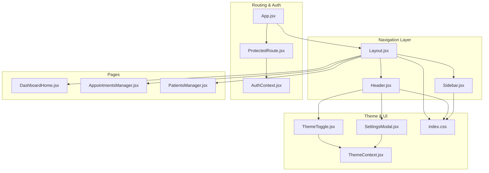
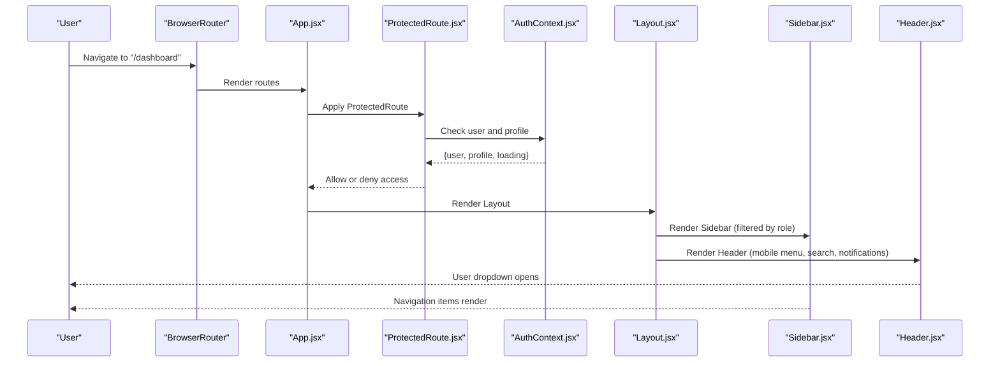
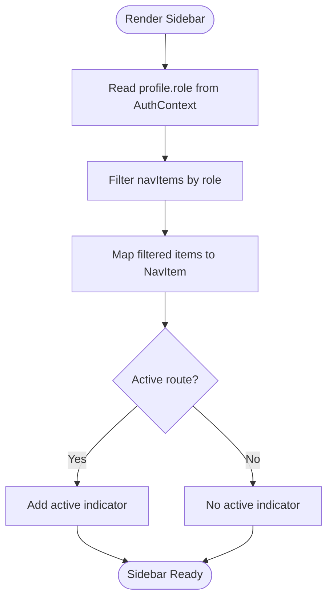
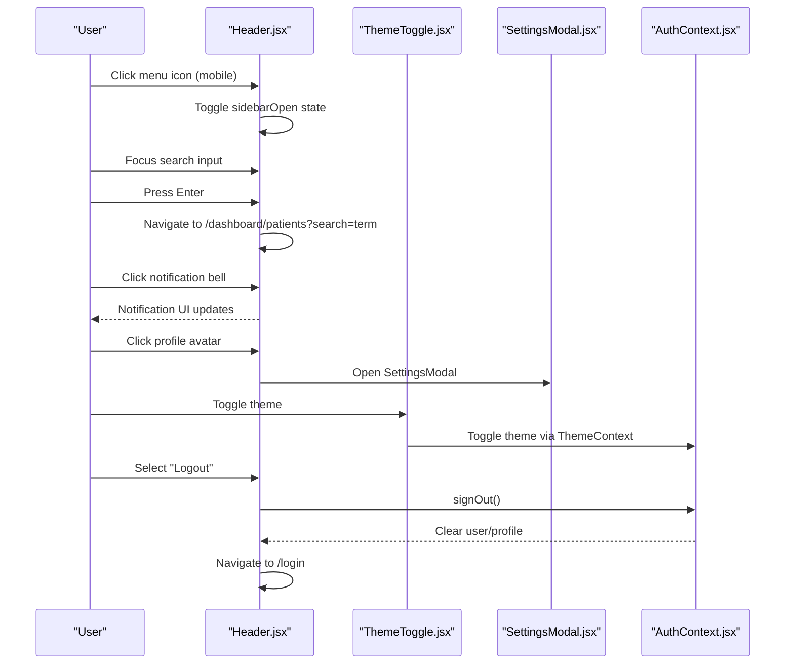
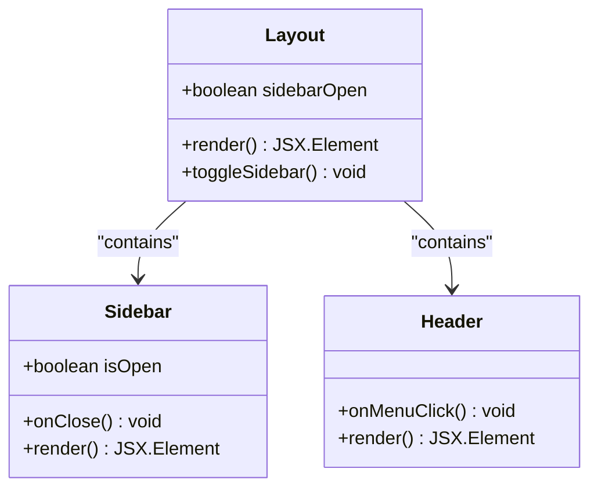
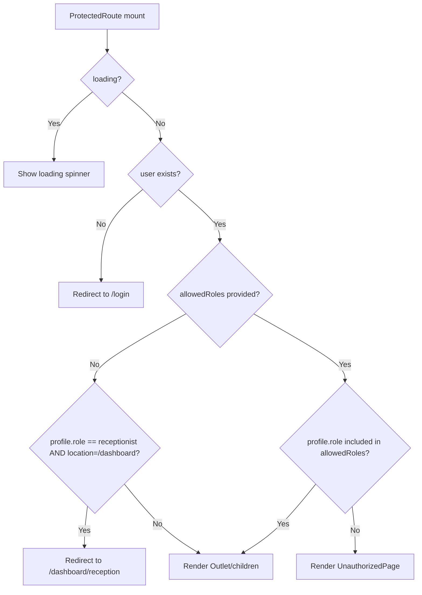
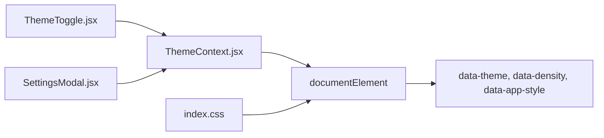
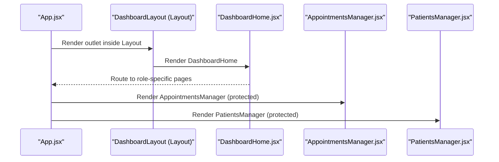
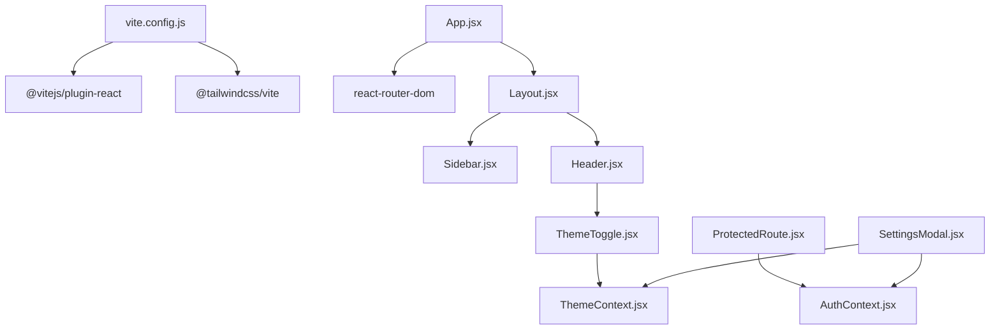

# Dashboard Navigation & Layout

<cite>
**Referenced Files in This Document**
- [Layout.jsx](file://frontend/src/components/Layout.jsx)
- [Sidebar.jsx](file://frontend/src/components/Sidebar.jsx)
- [Header.jsx](file://frontend/src/components/Header.jsx)
- [ProtectedRoute.jsx](file://frontend/src/components/ProtectedRoute.jsx)
- [AuthContext.jsx](file://frontend/src/context/AuthContext.jsx)
- [ThemeContext.jsx](file://frontend/src/context/ThemeContext.jsx)
- [ThemeToggle.jsx](file://frontend/src/components/ThemeToggle.jsx)
- [SettingsModal.jsx](file://frontend/src/components/SettingsModal.jsx)
- [App.jsx](file://frontend/src/App.jsx)
- [DashboardHome.jsx](file://frontend/src/pages/DashboardHome.jsx)
- [AppointmentsManager.jsx](file://frontend/src/pages/AppointmentsManager.jsx)
- [PatientsManager.jsx](file://frontend/src/pages/PatientsManager.jsx)
- [main.jsx](file://frontend/src/main.jsx)
- [index.css](file://frontend/src/index.css)
- [vite.config.js](file://frontend/vite.config.js)
</cite>

## Table of Contents
1. [Introduction](#introduction)
2. [Project Structure](#project-structure)
3. [Core Components](#core-components)
4. [Architecture Overview](#architecture-overview)
5. [Detailed Component Analysis](#detailed-component-analysis)
6. [Dependency Analysis](#dependency-analysis)
7. [Performance Considerations](#performance-considerations)
8. [Troubleshooting Guide](#troubleshooting-guide)
9. [Conclusion](#conclusion)

## Introduction
This document explains the dashboard navigation system and layout architecture in MedVita. It covers the responsive sidebar navigation with role-based menu items, the header with user profile dropdown and quick actions, the layout structure using CSS Grid and Flexbox, navigation guards and role-based access control, layout customization and theme integration, and the integration between navigation components and the overall routing system. It also addresses responsive design patterns, mobile navigation, and touch-friendly interface elements.

## Project Structure
The navigation and layout system centers around three primary components:
- Layout: orchestrates the sidebar, header, and main content area
- Sidebar: provides role-aware navigation items and persistent controls
- Header: hosts the mobile menu toggle, branding, search, notifications, and user profile dropdown

Routing and authentication are integrated through React Router and Supabase, with protected routes enforcing role-based access control.

**Diagram sources**
- [Layout.jsx](file://frontend/src/components/Layout.jsx#L1-L43)
- [Sidebar.jsx](file://frontend/src/components/Sidebar.jsx#L1-L113)
- [Header.jsx](file://frontend/src/components/Header.jsx#L1-L158)
- [App.jsx](file://frontend/src/App.jsx#L1-L62)
- [ProtectedRoute.jsx](file://frontend/src/components/ProtectedRoute.jsx#L1-L108)
- [AuthContext.jsx](file://frontend/src/context/AuthContext.jsx#L1-L108)
- [ThemeContext.jsx](file://frontend/src/context/ThemeContext.jsx#L1-L79)
- [ThemeToggle.jsx](file://frontend/src/components/ThemeToggle.jsx#L1-L31)
- [SettingsModal.jsx](file://frontend/src/components/SettingsModal.jsx#L1-L672)
- [DashboardHome.jsx](file://frontend/src/pages/DashboardHome.jsx#L1-L487)
- [AppointmentsManager.jsx](file://frontend/src/pages/AppointmentsManager.jsx#L1-L577)
- [PatientsManager.jsx](file://frontend/src/pages/PatientsManager.jsx#L1-L667)
- [index.css](file://frontend/src/index.css#L1-L781)

**Section sources**
- [Layout.jsx](file://frontend/src/components/Layout.jsx#L1-L43)
- [Sidebar.jsx](file://frontend/src/components/Sidebar.jsx#L1-L113)
- [Header.jsx](file://frontend/src/components/Header.jsx#L1-L158)
- [App.jsx](file://frontend/src/App.jsx#L1-L62)
- [index.css](file://frontend/src/index.css#L506-L781)

## Core Components
- Layout: Manages the sidebar visibility state, overlay for mobile, and main content area. Uses Tailwind classes for responsive positioning and transforms.
- Sidebar: Renders role-specific navigation items, active state indicators, and persistent controls (settings, logout).
- Header: Provides mobile hamburger menu, branding, search bar, notification bell, and user profile dropdown with settings and logout.
- ProtectedRoute: Enforces authentication, role-based access control, and redirects to appropriate dashboards or unauthorized page.
- AuthContext: Centralizes authentication state, profile retrieval, and sign-out logic.
- ThemeContext and ThemeToggle: Provide theme switching, density, and app style preferences persisted in localStorage.
- SettingsModal: Comprehensive settings panel for theme, density, integrations, and doctor-specific customization.

**Section sources**
- [Layout.jsx](file://frontend/src/components/Layout.jsx#L5-L42)
- [Sidebar.jsx](file://frontend/src/components/Sidebar.jsx#L19-L112)
- [Header.jsx](file://frontend/src/components/Header.jsx#L17-L157)
- [ProtectedRoute.jsx](file://frontend/src/components/ProtectedRoute.jsx#L53-L106)
- [AuthContext.jsx](file://frontend/src/context/AuthContext.jsx#L9-L107)
- [ThemeContext.jsx](file://frontend/src/context/ThemeContext.jsx#L5-L79)
- [ThemeToggle.jsx](file://frontend/src/components/ThemeToggle.jsx#L5-L31)
- [SettingsModal.jsx](file://frontend/src/components/SettingsModal.jsx#L10-L672)

## Architecture Overview
The navigation architecture follows a layered pattern:
- Presentation layer: Layout, Sidebar, Header
- Routing and access control: App routes, ProtectedRoute
- Authentication: AuthContext
- Theming and customization: ThemeContext, ThemeToggle, SettingsModal
- Styling: Tailwind utilities and CSS custom properties in index.css

**Diagram sources**
- [App.jsx](file://frontend/src/App.jsx#L26-L58)
- [ProtectedRoute.jsx](file://frontend/src/components/ProtectedRoute.jsx#L53-L106)
- [AuthContext.jsx](file://frontend/src/context/AuthContext.jsx#L9-L107)
- [Layout.jsx](file://frontend/src/components/Layout.jsx#L5-L42)
- [Sidebar.jsx](file://frontend/src/components/Sidebar.jsx#L19-L112)
- [Header.jsx](file://frontend/src/components/Header.jsx#L17-L157)

## Detailed Component Analysis

### Responsive Sidebar Navigation
The sidebar adapts across breakpoints:
- Mobile: Fixed position with transform transitions; overlay backdrop for dismissal
- Tablet/Desktop: Relative positioning with fixed width; stacked icon and label layout

Role-based filtering ensures each user sees only relevant navigation items. Active state highlighting uses a vertical indicator and icon scaling.

**Diagram sources**
- [Sidebar.jsx](file://frontend/src/components/Sidebar.jsx#L24-L67)
- [AuthContext.jsx](file://frontend/src/context/AuthContext.jsx#L10-L12)

**Section sources**
- [Sidebar.jsx](file://frontend/src/components/Sidebar.jsx#L19-L112)
- [index.css](file://frontend/src/index.css#L521-L595)

### Header Components and User Controls
The header includes:
- Mobile menu toggle for sidebar on small screens
- Branding with gradient icon and animated effects
- Search bar that navigates to a filtered patients route on Enter
- Notification bell with animated dot
- User profile dropdown with settings and logout actions

The dropdown leverages Headless UI Menu for accessibility and animations.

**Diagram sources**
- [Header.jsx](file://frontend/src/components/Header.jsx#L38-L157)
- [ThemeToggle.jsx](file://frontend/src/components/ThemeToggle.jsx#L5-L31)
- [SettingsModal.jsx](file://frontend/src/components/SettingsModal.jsx#L10-L672)
- [AuthContext.jsx](file://frontend/src/context/AuthContext.jsx#L88-L90)

**Section sources**
- [Header.jsx](file://frontend/src/components/Header.jsx#L17-L157)
- [ThemeToggle.jsx](file://frontend/src/components/ThemeToggle.jsx#L5-L31)
- [SettingsModal.jsx](file://frontend/src/components/SettingsModal.jsx#L10-L672)

### Layout Structure and Responsive Patterns
The layout uses Flexbox for the main content area and Tailwind utilities for responsive sidebar widths and transforms. The sidebar is fixed on mobile with a backdrop overlay and slides in/out with transforms. On tablet/desktop, it becomes a static column.

**Diagram sources**
- [Layout.jsx](file://frontend/src/components/Layout.jsx#L5-L42)
- [Sidebar.jsx](file://frontend/src/components/Sidebar.jsx#L19-L112)
- [Header.jsx](file://frontend/src/components/Header.jsx#L17-L157)

**Section sources**
- [Layout.jsx](file://frontend/src/components/Layout.jsx#L5-L42)
- [index.css](file://frontend/src/index.css#L506-L520)

### Navigation Guards and Role-Based Access Control
ProtectedRoute enforces:
- Loading state until auth session and profile are resolved
- Redirect to login if unauthenticated
- Role validation against allowedRoles
- Redirect to role-specific home when landing on wrong base route
- Unauthorized page rendering for disallowed roles

**Diagram sources**
- [ProtectedRoute.jsx](file://frontend/src/components/ProtectedRoute.jsx#L53-L106)
- [AuthContext.jsx](file://frontend/src/context/AuthContext.jsx#L9-L107)

**Section sources**
- [ProtectedRoute.jsx](file://frontend/src/components/ProtectedRoute.jsx#L53-L106)
- [AuthContext.jsx](file://frontend/src/context/AuthContext.jsx#L9-L107)

### Layout Customization, Theme Integration, and Accessibility
ThemeContext manages:
- Theme persistence and system preference detection
- Density and app style attributes applied to documentElement
- LocalStorage-backed preferences

ThemeToggle provides a visually distinct toggle with gradient backgrounds and smooth transitions.

SettingsModal centralizes:
- Theme selection (light/dark)
- App style (modern/minimal)
- Interface density (compact/normal/spacious)
- Doctor-specific settings (clinic code, prescription customization)
- Google Calendar integration toggle

Accessibility features include:
- Headless UI Menu for keyboard navigation and ARIA support
- Semantic icons and labels
- Focus-visible outlines and transitions

**Diagram sources**
- [ThemeContext.jsx](file://frontend/src/context/ThemeContext.jsx#L5-L79)
- [ThemeToggle.jsx](file://frontend/src/components/ThemeToggle.jsx#L5-L31)
- [SettingsModal.jsx](file://frontend/src/components/SettingsModal.jsx#L10-L672)
- [index.css](file://frontend/src/index.css#L320-L340)

**Section sources**
- [ThemeContext.jsx](file://frontend/src/context/ThemeContext.jsx#L5-L79)
- [ThemeToggle.jsx](file://frontend/src/components/ThemeToggle.jsx#L5-L31)
- [SettingsModal.jsx](file://frontend/src/components/SettingsModal.jsx#L10-L672)
- [index.css](file://frontend/src/index.css#L320-L340)

### Integration with Dashboard Pages and Routing
The routing integrates with the layout and navigation:
- App routes define nested layouts and protected routes
- DashboardHome renders role-specific panels and quick actions
- AppointmentsManager and PatientsManager adapt to role and device size

**Diagram sources**
- [App.jsx](file://frontend/src/App.jsx#L18-L58)
- [DashboardHome.jsx](file://frontend/src/pages/DashboardHome.jsx#L275-L486)
- [AppointmentsManager.jsx](file://frontend/src/pages/AppointmentsManager.jsx#L14-L577)
- [PatientsManager.jsx](file://frontend/src/pages/PatientsManager.jsx#L15-L667)

**Section sources**
- [App.jsx](file://frontend/src/App.jsx#L18-L58)
- [DashboardHome.jsx](file://frontend/src/pages/DashboardHome.jsx#L275-L486)
- [AppointmentsManager.jsx](file://frontend/src/pages/AppointmentsManager.jsx#L14-L577)
- [PatientsManager.jsx](file://frontend/src/pages/PatientsManager.jsx#L15-L667)

## Dependency Analysis
The navigation stack depends on:
- React Router for routing and nested layouts
- Headless UI for accessible dropdowns
- Tailwind CSS for responsive utilities and theming
- Supabase for authentication and profile data
- LocalStorage for persisting theme and preferences

**Diagram sources**
- [vite.config.js](file://frontend/vite.config.js#L1-L33)
- [App.jsx](file://frontend/src/App.jsx#L1-L62)
- [Layout.jsx](file://frontend/src/components/Layout.jsx#L1-L43)
- [Sidebar.jsx](file://frontend/src/components/Sidebar.jsx#L1-L113)
- [Header.jsx](file://frontend/src/components/Header.jsx#L1-L158)
- [ProtectedRoute.jsx](file://frontend/src/components/ProtectedRoute.jsx#L1-L108)
- [AuthContext.jsx](file://frontend/src/context/AuthContext.jsx#L1-L108)
- [ThemeToggle.jsx](file://frontend/src/components/ThemeToggle.jsx#L1-L31)
- [ThemeContext.jsx](file://frontend/src/context/ThemeContext.jsx#L1-L79)
- [SettingsModal.jsx](file://frontend/src/components/SettingsModal.jsx#L1-L672)

**Section sources**
- [vite.config.js](file://frontend/vite.config.js#L1-L33)
- [package.json](file://frontend/package.json#L13-L32)

## Performance Considerations
- Bundle splitting: Vite groups vendor libraries into chunks to optimize loading.
- CSS custom properties: Theme and density adjustments are applied via DOM attributes, minimizing re-renders.
- Conditional rendering: ProtectedRoute defers rendering until auth and profile are ready.
- Responsive utilities: Tailwind utilities reduce custom CSS and enable efficient breakpoint handling.

[No sources needed since this section provides general guidance]

## Troubleshooting Guide
Common issues and remedies:
- Sidebar not closing on mobile: Verify overlay click handler and sidebarOpen state management.
- Active navigation highlighting incorrect: Confirm pathname comparison logic and special-case for base dashboard route.
- ProtectedRoute infinite loading: Ensure Supabase session and profile fetch resolve; check AuthContext subscriptions.
- Theme not persisting: Confirm localStorage keys and ThemeContext effect runs on mount.
- Settings not applying: Validate data attributes on documentElement and CSS selectors in index.css.

**Section sources**
- [Layout.jsx](file://frontend/src/components/Layout.jsx#L32-L39)
- [Sidebar.jsx](file://frontend/src/components/Sidebar.jsx#L37-L49)
- [ProtectedRoute.jsx](file://frontend/src/components/ProtectedRoute.jsx#L57-L74)
- [ThemeContext.jsx](file://frontend/src/context/ThemeContext.jsx#L34-L51)
- [index.css](file://frontend/src/index.css#L35-L59)

## Conclusion
MedVita’s dashboard navigation system combines a responsive layout, role-aware sidebar, and robust access control. The architecture leverages React Router, Tailwind CSS, and context providers to deliver a cohesive, accessible, and customizable experience across devices. The integration of theme management, settings, and real-time data ensures a professional healthcare dashboard tailored to different user roles.