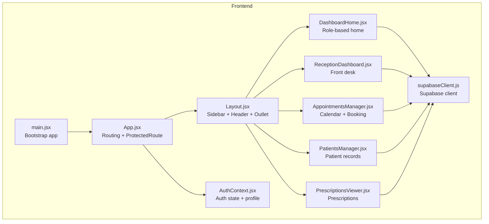
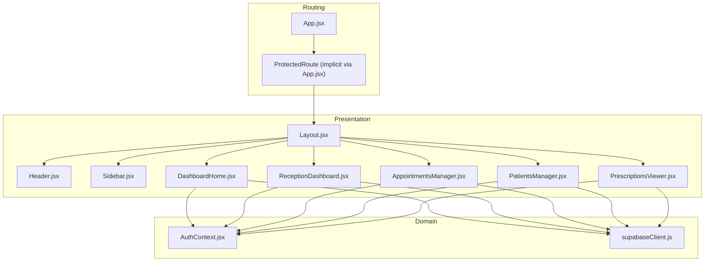
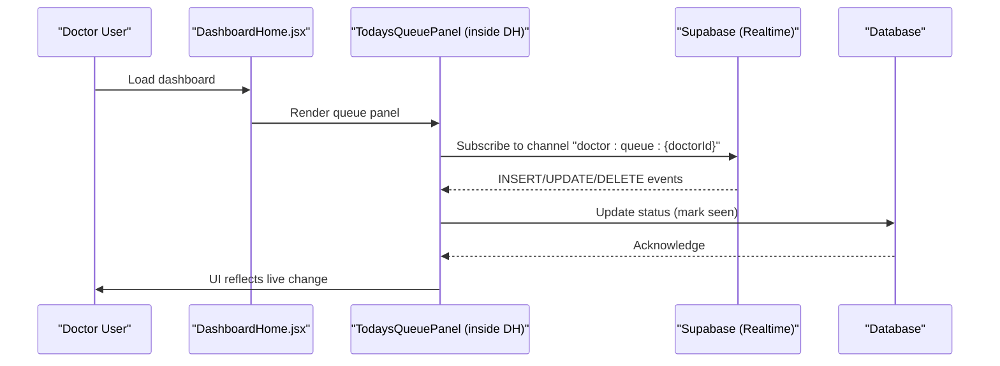
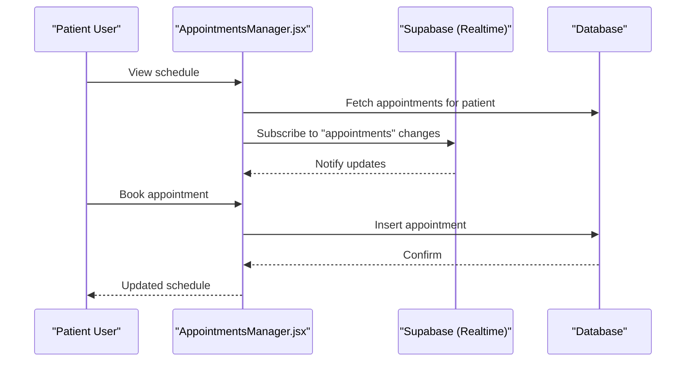
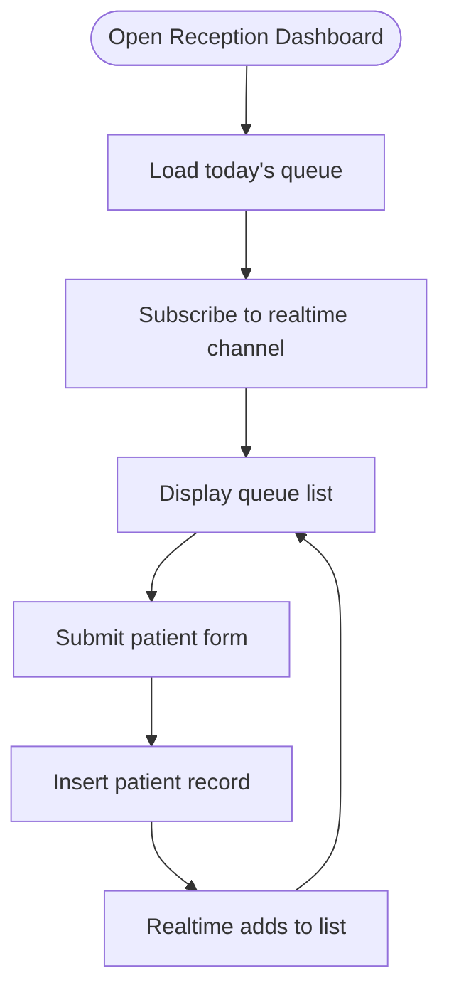
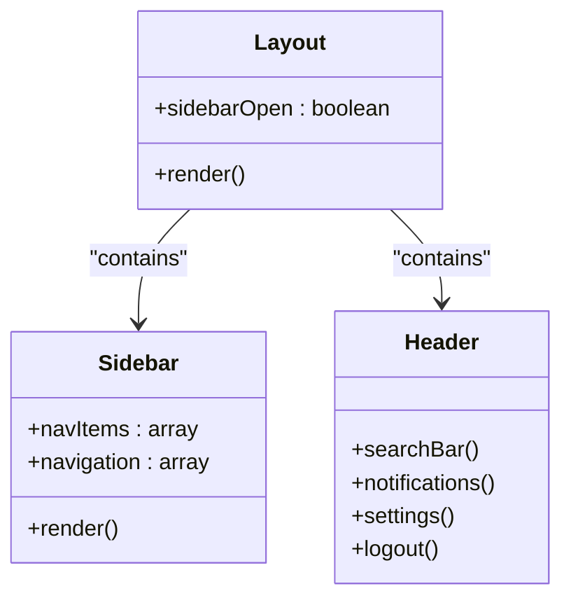
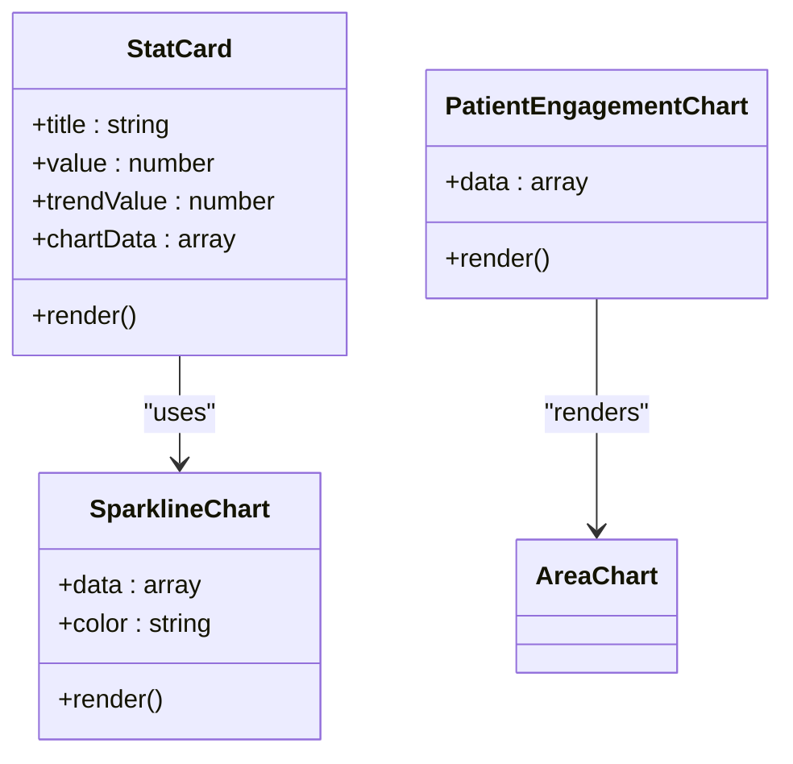
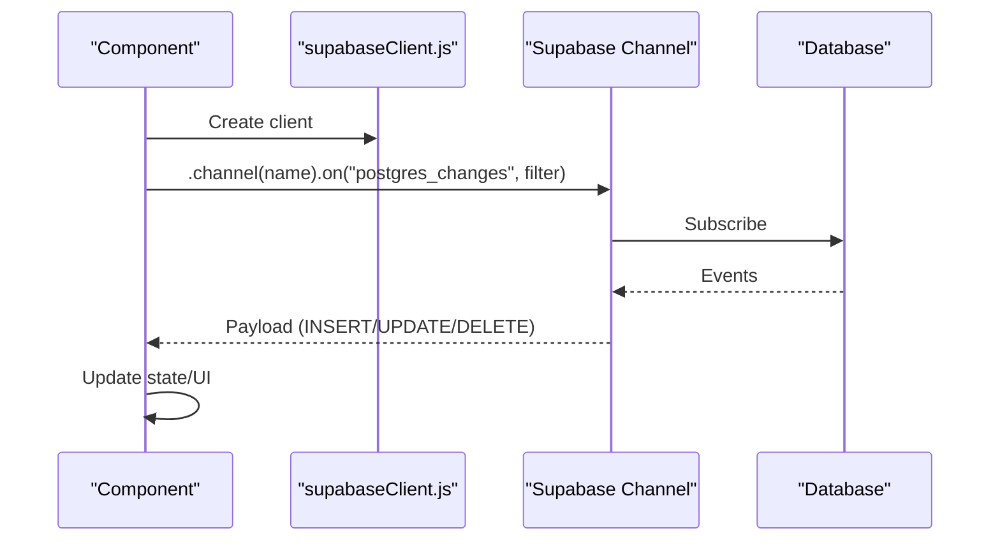
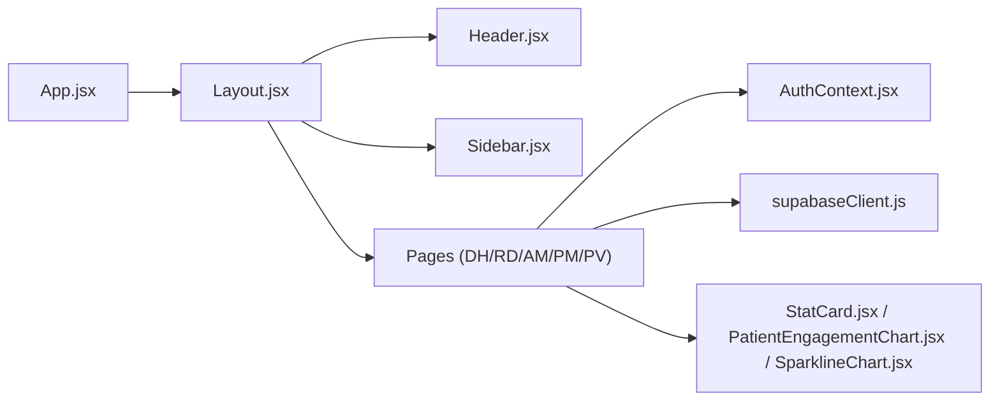

# Dashboard System

<cite>
**Referenced Files in This Document**
- [App.jsx](file://frontend/src/App.jsx)
- [main.jsx](file://frontend/src/main.jsx)
- [AuthContext.jsx](file://frontend/src/context/AuthContext.jsx)
- [Layout.jsx](file://frontend/src/components/Layout.jsx)
- [Header.jsx](file://frontend/src/components/Header.jsx)
- [Sidebar.jsx](file://frontend/src/components/Sidebar.jsx)
- [DashboardHome.jsx](file://frontend/src/pages/DashboardHome.jsx)
- [ReceptionDashboard.jsx](file://frontend/src/pages/ReceptionDashboard.jsx)
- [AppointmentsManager.jsx](file://frontend/src/pages/AppointmentsManager.jsx)
- [PatientsManager.jsx](file://frontend/src/pages/PatientsManager.jsx)
- [PrescriptionsViewer.jsx](file://frontend/src/pages/PrescriptionsViewer.jsx)
- [StatCard.jsx](file://frontend/src/components/StatCard.jsx)
- [PatientEngagementChart.jsx](file://frontend/src/components/PatientEngagementChart.jsx)
- [SparklineChart.jsx](file://frontend/src/components/SparklineChart.jsx)
- [supabaseClient.js](file://frontend/src/lib/supabaseClient.js)
</cite>

## Table of Contents
1. [Introduction](#introduction)
2. [Project Structure](#project-structure)
3. [Core Components](#core-components)
4. [Architecture Overview](#architecture-overview)
5. [Detailed Component Analysis](#detailed-component-analysis)
6. [Dependency Analysis](#dependency-analysis)
7. [Performance Considerations](#performance-considerations)
8. [Troubleshooting Guide](#troubleshooting-guide)
9. [Conclusion](#conclusion)
10. [Appendices](#appendices)

## Introduction
This document describes the MedVita dashboard system, focusing on role-based dashboards for Doctors, Patients, and Receptionists. It covers live queue management, patient tracking, appointment scheduling, check-in flows, and administrative capabilities. It also documents navigation structure, dashboard layouts, real-time synchronization, backend integration, data visualization, user interaction patterns, customization options, performance considerations, accessibility features, and extension guidelines.

## Project Structure
MedVita is a React single-page application with a Supabase backend. Routing is protected by role-aware guards, and dashboards are rendered inside a shared Layout with a dynamic Sidebar and Header. Real-time updates are powered by Supabase Postgres Realtime channels.

**Diagram sources**
- [main.jsx](file://frontend/src/main.jsx#L1-L17)
- [App.jsx](file://frontend/src/App.jsx#L1-L62)
- [Layout.jsx](file://frontend/src/components/Layout.jsx#L1-L43)
- [DashboardHome.jsx](file://frontend/src/pages/DashboardHome.jsx#L1-L487)
- [ReceptionDashboard.jsx](file://frontend/src/pages/ReceptionDashboard.jsx#L1-L455)
- [AppointmentsManager.jsx](file://frontend/src/pages/AppointmentsManager.jsx#L1-L577)
- [PatientsManager.jsx](file://frontend/src/pages/PatientsManager.jsx#L1-L667)
- [PrescriptionsViewer.jsx](file://frontend/src/pages/PrescriptionsViewer.jsx#L1-L273)
- [AuthContext.jsx](file://frontend/src/context/AuthContext.jsx#L1-L108)
- [supabaseClient.js](file://frontend/src/lib/supabaseClient.js#L1-L11)

**Section sources**
- [main.jsx](file://frontend/src/main.jsx#L1-L17)
- [App.jsx](file://frontend/src/App.jsx#L1-L62)
- [Layout.jsx](file://frontend/src/components/Layout.jsx#L1-L43)
- [AuthContext.jsx](file://frontend/src/context/AuthContext.jsx#L1-L108)

## Core Components
- Role-aware routing and protection: routes are gated by allowed roles and nested under a shared layout.
- Authentication and profile loading: centralized AuthContext manages session, profile, and role.
- Real-time data: Supabase channels subscribe to table changes for live updates.
- Data visualization: Recharts-based components for engagement and sparklines.
- UI primitives: reusable components for cards, charts, buttons, inputs, and modals.

**Section sources**
- [App.jsx](file://frontend/src/App.jsx#L35-L56)
- [AuthContext.jsx](file://frontend/src/context/AuthContext.jsx#L9-L61)
- [supabaseClient.js](file://frontend/src/lib/supabaseClient.js#L1-L11)
- [StatCard.jsx](file://frontend/src/components/StatCard.jsx#L1-L33)
- [PatientEngagementChart.jsx](file://frontend/src/components/PatientEngagementChart.jsx#L1-L89)
- [SparklineChart.jsx](file://frontend/src/components/SparklineChart.jsx#L1-L21)

## Architecture Overview
The system follows a layered pattern:
- Presentation Layer: React components and pages.
- Routing Layer: ProtectedRoute enforces role-based access.
- Domain Layer: Pages orchestrate data fetching and UI rendering.
- Data Access Layer: Supabase client encapsulated in a single module.
- Realtime Layer: Supabase Postgres Realtime subscriptions.

**Diagram sources**
- [App.jsx](file://frontend/src/App.jsx#L18-L56)
- [Layout.jsx](file://frontend/src/components/Layout.jsx#L1-L43)
- [Header.jsx](file://frontend/src/components/Header.jsx#L1-L158)
- [Sidebar.jsx](file://frontend/src/components/Sidebar.jsx#L1-L113)
- [DashboardHome.jsx](file://frontend/src/pages/DashboardHome.jsx#L1-L487)
- [ReceptionDashboard.jsx](file://frontend/src/pages/ReceptionDashboard.jsx#L1-L455)
- [AppointmentsManager.jsx](file://frontend/src/pages/AppointmentsManager.jsx#L1-L577)
- [PatientsManager.jsx](file://frontend/src/pages/PatientsManager.jsx#L1-L667)
- [PrescriptionsViewer.jsx](file://frontend/src/pages/PrescriptionsViewer.jsx#L1-L273)
- [AuthContext.jsx](file://frontend/src/context/AuthContext.jsx#L1-L108)
- [supabaseClient.js](file://frontend/src/lib/supabaseClient.js#L1-L11)

## Detailed Component Analysis

### Doctor Dashboard
The Doctor Dashboard centers around:
- Today’s Queue panel with live updates and actions (mark seen, prescribe).
- Upcoming appointments for the day.
- Engagement analytics card.
- Quick actions for managing patients, appointments, and prescriptions.

**Diagram sources**
- [DashboardHome.jsx](file://frontend/src/pages/DashboardHome.jsx#L14-L272)
- [supabaseClient.js](file://frontend/src/lib/supabaseClient.js#L1-L11)

Key behaviors:
- Real-time queue filtering by doctor and creation date.
- Status toggling with optimistic UI updates.
- Prescription modal integration for immediate care workflows.

**Section sources**
- [DashboardHome.jsx](file://frontend/src/pages/DashboardHome.jsx#L14-L272)
- [DashboardHome.jsx](file://frontend/src/pages/DashboardHome.jsx#L274-L487)

### Patient Dashboard
The Patient Dashboard focuses on:
- Upcoming visits for the day.
- Access to prescriptions and viewing/download capabilities.
- Appointment booking and calendar views.

**Diagram sources**
- [AppointmentsManager.jsx](file://frontend/src/pages/AppointmentsManager.jsx#L14-L118)
- [supabaseClient.js](file://frontend/src/lib/supabaseClient.js#L1-L11)

**Section sources**
- [AppointmentsManager.jsx](file://frontend/src/pages/AppointmentsManager.jsx#L14-L118)
- [PrescriptionsViewer.jsx](file://frontend/src/pages/PrescriptionsViewer.jsx#L1-L273)

### Receptionist Dashboard
The Receptionist Dashboard enables:
- Front desk check-in via a form that inserts patients into the queue.
- Real-time queue display with vitals and timestamps.
- Account linking guard for clinic association.

**Diagram sources**
- [ReceptionDashboard.jsx](file://frontend/src/pages/ReceptionDashboard.jsx#L37-L113)
- [supabaseClient.js](file://frontend/src/lib/supabaseClient.js#L1-L11)

**Section sources**
- [ReceptionDashboard.jsx](file://frontend/src/pages/ReceptionDashboard.jsx#L37-L113)

### Navigation and Layout
- Layout composes a responsive Sidebar and Header with a main content area.
- Sidebar items are filtered by role and link to relevant dashboards.
- Header includes search, notifications, theme toggle, and settings/logout.

**Diagram sources**
- [Layout.jsx](file://frontend/src/components/Layout.jsx#L1-L43)
- [Sidebar.jsx](file://frontend/src/components/Sidebar.jsx#L1-L113)
- [Header.jsx](file://frontend/src/components/Header.jsx#L1-L158)

**Section sources**
- [Layout.jsx](file://frontend/src/components/Layout.jsx#L1-L43)
- [Sidebar.jsx](file://frontend/src/components/Sidebar.jsx#L19-L113)
- [Header.jsx](file://frontend/src/components/Header.jsx#L17-L158)

### Data Visualization Components
- StatCard displays KPIs with sparkline trends.
- PatientEngagementChart renders area charts for weekly metrics.
- SparklineChart provides lightweight trend lines.

**Diagram sources**
- [StatCard.jsx](file://frontend/src/components/StatCard.jsx#L1-L33)
- [PatientEngagementChart.jsx](file://frontend/src/components/PatientEngagementChart.jsx#L1-L89)
- [SparklineChart.jsx](file://frontend/src/components/SparklineChart.jsx#L1-L21)

**Section sources**
- [StatCard.jsx](file://frontend/src/components/StatCard.jsx#L1-L33)
- [PatientEngagementChart.jsx](file://frontend/src/components/PatientEngagementChart.jsx#L1-L89)
- [SparklineChart.jsx](file://frontend/src/components/SparklineChart.jsx#L1-L21)

### Backend Integration and Real-Time Updates
- Supabase client initialization with environment variables.
- Realtime subscriptions scoped per role and entity (doctor queue, reception queue, appointments).
- AuthContext handles session and profile retrieval.

**Diagram sources**
- [supabaseClient.js](file://frontend/src/lib/supabaseClient.js#L1-L11)
- [DashboardHome.jsx](file://frontend/src/pages/DashboardHome.jsx#L45-L76)
- [ReceptionDashboard.jsx](file://frontend/src/pages/ReceptionDashboard.jsx#L76-L113)
- [AppointmentsManager.jsx](file://frontend/src/pages/AppointmentsManager.jsx#L14-L118)

**Section sources**
- [supabaseClient.js](file://frontend/src/lib/supabaseClient.js#L1-L11)
- [DashboardHome.jsx](file://frontend/src/pages/DashboardHome.jsx#L45-L76)
- [ReceptionDashboard.jsx](file://frontend/src/pages/ReceptionDashboard.jsx#L76-L113)
- [AppointmentsManager.jsx](file://frontend/src/pages/AppointmentsManager.jsx#L14-L118)

### User Interaction Patterns
- Role-based quick actions and navigation.
- Hover-triggered contextual actions (prescribe, edit, delete).
- Modal-driven workflows for bookings, prescriptions, and patient details.
- Responsive grid/list/calendar views for appointments.

**Section sources**
- [DashboardHome.jsx](file://frontend/src/pages/DashboardHome.jsx#L353-L384)
- [PatientsManager.jsx](file://frontend/src/pages/PatientsManager.jsx#L370-L394)
- [AppointmentsManager.jsx](file://frontend/src/pages/AppointmentsManager.jsx#L254-L258)
- [AppointmentsManager.jsx](file://frontend/src/pages/AppointmentsManager.jsx#L476-L511)

### Dashboard Customization Options
- Theming via ThemeContext and ThemeToggle.
- Dark/light mode support across components.
- Customizable stats and charts via props and data injection points.

**Section sources**
- [Header.jsx](file://frontend/src/components/Header.jsx#L82-L88)
- [StatCard.jsx](file://frontend/src/components/StatCard.jsx#L1-L33)
- [PatientEngagementChart.jsx](file://frontend/src/components/PatientEngagementChart.jsx#L1-L89)

### Accessibility Features
- Semantic HTML and focus management in dialogs/menus.
- Keyboard navigable menus and modals.
- Sufficient color contrast and readable typography.
- Screen-reader friendly labels and ARIA attributes where applicable.

[No sources needed since this section provides general guidance]

## Dependency Analysis
The dashboard system exhibits low coupling and high cohesion:
- Pages depend on Supabase client and AuthContext.
- UI components are reusable and self-contained.
- Real-time logic is centralized in page components.

**Diagram sources**
- [App.jsx](file://frontend/src/App.jsx#L1-L62)
- [Layout.jsx](file://frontend/src/components/Layout.jsx#L1-L43)
- [Header.jsx](file://frontend/src/components/Header.jsx#L1-L158)
- [Sidebar.jsx](file://frontend/src/components/Sidebar.jsx#L1-L113)
- [DashboardHome.jsx](file://frontend/src/pages/DashboardHome.jsx#L1-L487)
- [ReceptionDashboard.jsx](file://frontend/src/pages/ReceptionDashboard.jsx#L1-L455)
- [AppointmentsManager.jsx](file://frontend/src/pages/AppointmentsManager.jsx#L1-L577)
- [PatientsManager.jsx](file://frontend/src/pages/PatientsManager.jsx#L1-L667)
- [PrescriptionsViewer.jsx](file://frontend/src/pages/PrescriptionsViewer.jsx#L1-L273)
- [AuthContext.jsx](file://frontend/src/context/AuthContext.jsx#L1-L108)
- [supabaseClient.js](file://frontend/src/lib/supabaseClient.js#L1-L11)
- [StatCard.jsx](file://frontend/src/components/StatCard.jsx#L1-L33)
- [PatientEngagementChart.jsx](file://frontend/src/components/PatientEngagementChart.jsx#L1-L89)
- [SparklineChart.jsx](file://frontend/src/components/SparklineChart.jsx#L1-L21)

**Section sources**
- [App.jsx](file://frontend/src/App.jsx#L1-L62)
- [AuthContext.jsx](file://frontend/src/context/AuthContext.jsx#L1-L108)
- [supabaseClient.js](file://frontend/src/lib/supabaseClient.js#L1-L11)

## Performance Considerations
- Real-time subscriptions: Use targeted filters (doctor_id, employer_id) to minimize payload.
- Debounced search: PatientsManager debounces search input to reduce queries.
- Efficient rendering: AnimatePresence and layout animations are scoped to lists.
- Chart rendering: Recharts components are wrapped responsively; keep datasets small for weekly/monthly views.
- Pagination and slicing: DashboardHome slices daily appointment lists to limit DOM nodes.

**Section sources**
- [PatientsManager.jsx](file://frontend/src/pages/PatientsManager.jsx#L113-L121)
- [DashboardHome.jsx](file://frontend/src/pages/DashboardHome.jsx#L454-L481)

## Troubleshooting Guide
Common issues and remedies:
- Missing Supabase credentials: Check environment variables and console warnings.
- Realtime connection errors: Reception dashboard falls back to manual refresh when channel errors occur.
- Permission errors: Receptionist accounts must be linked to a clinic via employer_id; otherwise inserts fail with permission errors.
- Auth state changes: AuthContext listens for session changes and reloads profile.

**Section sources**
- [supabaseClient.js](file://frontend/src/lib/supabaseClient.js#L6-L8)
- [ReceptionDashboard.jsx](file://frontend/src/pages/ReceptionDashboard.jsx#L104-L110)
- [ReceptionDashboard.jsx](file://frontend/src/pages/ReceptionDashboard.jsx#L172-L178)
- [AuthContext.jsx](file://frontend/src/context/AuthContext.jsx#L25-L41)

## Conclusion
MedVita’s dashboard system provides role-specific, real-time, and accessible experiences across three primary personas. Its modular architecture, centralized auth and data access, and reusable UI components enable maintainability and extensibility. The system’s real-time updates, responsive layouts, and visualization components deliver a modern healthcare dashboard experience.

## Appendices

### Role-Based Navigation Reference
- Doctor: Dashboard, Patients, Availability, Earnings, Appointments, Prescriptions.
- Patient: Dashboard, Appointments, Prescriptions.
- Receptionist: Reception Desk.

**Section sources**
- [App.jsx](file://frontend/src/App.jsx#L35-L56)
- [Sidebar.jsx](file://frontend/src/components/Sidebar.jsx#L24-L33)

### Extension and Custom Widget Development Guidelines
- Create a new page component under pages/ and register it in App.jsx with appropriate role guards.
- Wrap data operations with Supabase client and subscribe to relevant channels for real-time updates.
- Build reusable UI components under components/ and compose them in pages.
- Respect accessibility standards: semantic markup, keyboard navigation, ARIA attributes, and sufficient contrast.
- Keep real-time subscriptions scoped and efficient; avoid broad filters.

[No sources needed since this section provides general guidance]