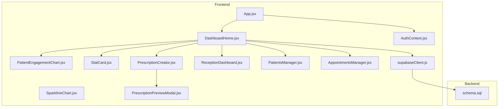
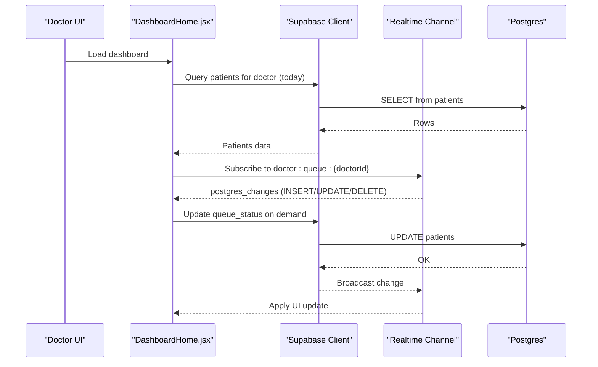
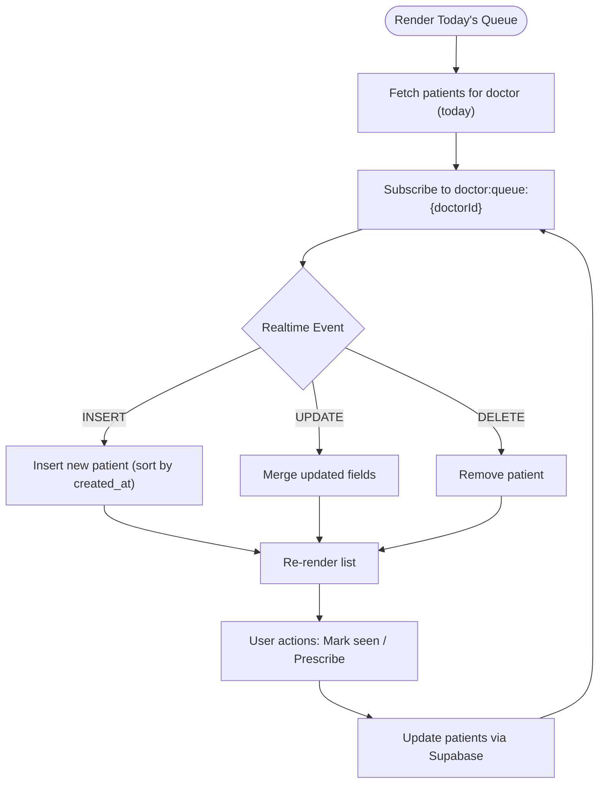
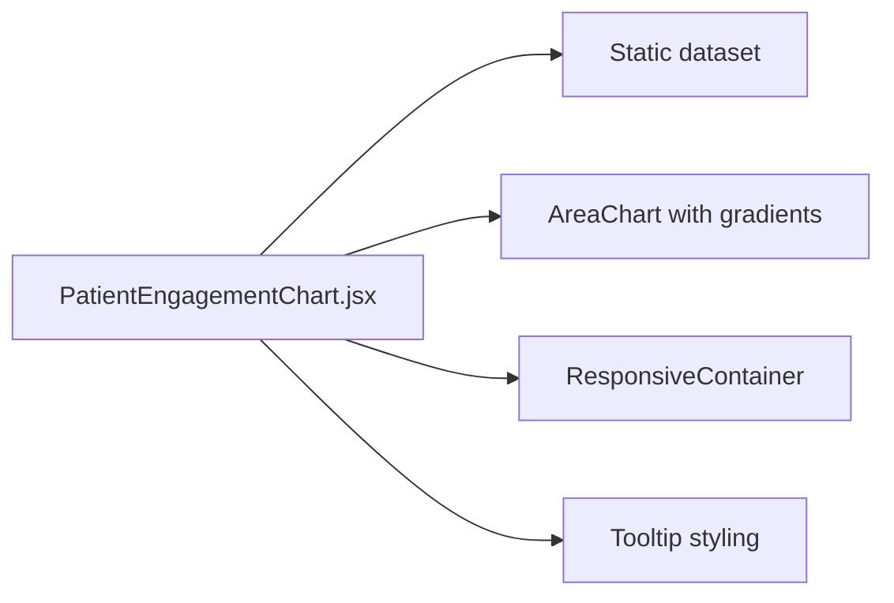
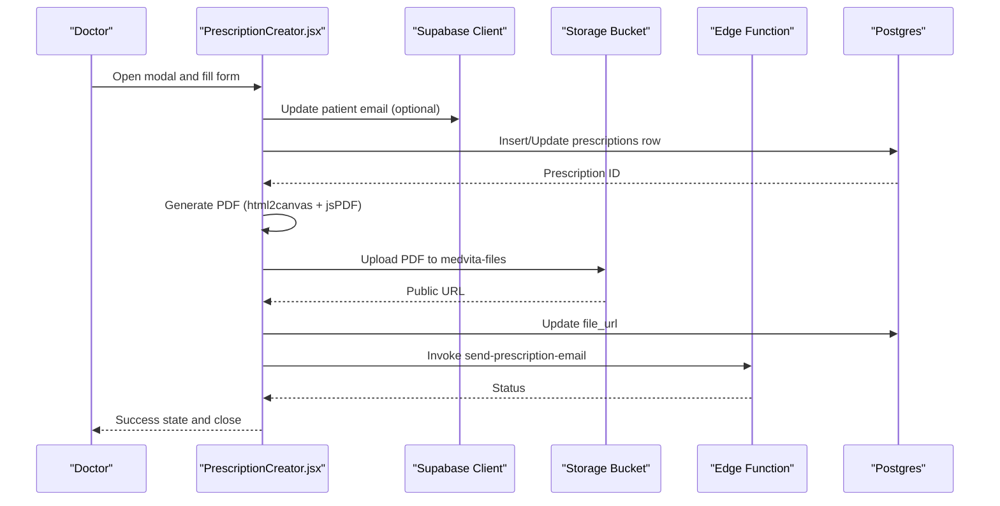
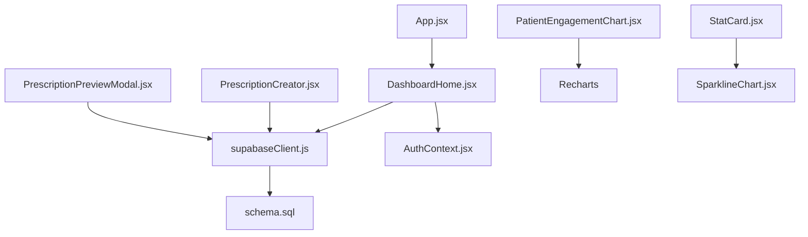

# Doctor Dashboard

<cite>
**Referenced Files in This Document**
- [DashboardHome.jsx](file://frontend/src/pages/DashboardHome.jsx)
- [PatientEngagementChart.jsx](file://frontend/src/components/PatientEngagementChart.jsx)
- [StatCard.jsx](file://frontend/src/components/StatCard.jsx)
- [SparklineChart.jsx](file://frontend/src/components/SparklineChart.jsx)
- [PrescriptionCreator.jsx](file://frontend/src/components/PrescriptionCreator.jsx)
- [PrescriptionPreviewModal.jsx](file://frontend/src/components/PrescriptionPreviewModal.jsx)
- [ReceptionDashboard.jsx](file://frontend/src/pages/ReceptionDashboard.jsx)
- [PatientsManager.jsx](file://frontend/src/pages/PatientsManager.jsx)
- [AppointmentsManager.jsx](file://frontend/src/pages/AppointmentsManager.jsx)
- [supabaseClient.js](file://frontend/src/lib/supabaseClient.js)
- [AuthContext.jsx](file://frontend/src/context/AuthContext.jsx)
- [App.jsx](file://frontend/src/App.jsx)
- [schema.sql](file://backend/schema.sql)
</cite>

## Table of Contents
1. [Introduction](#introduction)
2. [Project Structure](#project-structure)
3. [Core Components](#core-components)
4. [Architecture Overview](#architecture-overview)
5. [Detailed Component Analysis](#detailed-component-analysis)
6. [Dependency Analysis](#dependency-analysis)
7. [Performance Considerations](#performance-considerations)
8. [Troubleshooting Guide](#troubleshooting-guide)
9. [Conclusion](#conclusion)
10. [Appendices](#appendices)

## Introduction
This document describes the Doctor Dashboard functionality in MedVita, focusing on the live queue management system, real-time patient tracking, queue status updates, patient vitals display, Today’s Queue Panel, patient engagement analytics, quick actions, statistics cards, Supabase realtime integration, prescription creation workflow, doctor-specific navigation, performance considerations, accessibility, and widget customization options.

## Project Structure
The Doctor Dashboard is implemented as a React page with reusable UI components and integrates with Supabase for data and real-time updates. Key areas:
- Dashboard page orchestrates stats, charts, quick actions, and the Today’s Queue Panel
- Components encapsulate reusable UI elements like StatCard, SparklineChart, and PatientEngagementChart
- Real-time updates are powered by Supabase channels
- Prescription workflow spans a modal editor and a PDF generation pipeline
- Doctor-specific navigation routes are protected and role-aware

**Diagram sources**
- [DashboardHome.jsx](file://frontend/src/pages/DashboardHome.jsx#L275-L486)
- [PatientEngagementChart.jsx](file://frontend/src/components/PatientEngagementChart.jsx#L1-L89)
- [StatCard.jsx](file://frontend/src/components/StatCard.jsx#L1-L33)
- [SparklineChart.jsx](file://frontend/src/components/SparklineChart.jsx#L1-L21)
- [PrescriptionCreator.jsx](file://frontend/src/components/PrescriptionCreator.jsx#L1-L303)
- [PrescriptionPreviewModal.jsx](file://frontend/src/components/PrescriptionPreviewModal.jsx#L1-L331)
- [ReceptionDashboard.jsx](file://frontend/src/pages/ReceptionDashboard.jsx#L1-L455)
- [PatientsManager.jsx](file://frontend/src/pages/PatientsManager.jsx#L1-L667)
- [AppointmentsManager.jsx](file://frontend/src/pages/AppointmentsManager.jsx#L1-L577)
- [AuthContext.jsx](file://frontend/src/context/AuthContext.jsx#L1-L108)
- [App.jsx](file://frontend/src/App.jsx#L1-L62)
- [supabaseClient.js](file://frontend/src/lib/supabaseClient.js#L1-L11)
- [schema.sql](file://backend/schema.sql#L1-L274)

**Section sources**
- [DashboardHome.jsx](file://frontend/src/pages/DashboardHome.jsx#L275-L486)
- [App.jsx](file://frontend/src/App.jsx#L18-L56)

## Core Components
- Today’s Queue Panel: Doctor-only view displaying live queue, next-up highlight, waiting and seen lists, and actions to mark as seen and prescribe.
- Patient Engagement Chart: Weekly visit analytics with area charts for visits and satisfaction.
- Quick Actions: Role-aware shortcuts to add patients, create appointments, and generate prescriptions.
- Statistics Cards: Total patients, total appointments, and earnings metrics with sparkline trends.
- Real-time Updates: Supabase postgres_changes channels for patients table updates.
- Prescription Workflow: Modal editor with PDF generation, storage upload, and optional email dispatch.

**Section sources**
- [DashboardHome.jsx](file://frontend/src/pages/DashboardHome.jsx#L14-L272)
- [PatientEngagementChart.jsx](file://frontend/src/components/PatientEngagementChart.jsx#L13-L88)
- [StatCard.jsx](file://frontend/src/components/StatCard.jsx#L3-L32)
- [PrescriptionCreator.jsx](file://frontend/src/components/PrescriptionCreator.jsx#L11-L303)

## Architecture Overview
The Doctor Dashboard follows a layered architecture:
- Presentation Layer: DashboardHome renders panels and cards, delegates actions to child components
- Data Layer: Supabase client provides CRUD and real-time subscriptions
- Business Logic: AuthContext manages roles and permissions; components enforce doctor-specific views
- Backend: Supabase auth, RLS policies, and storage for files

**Diagram sources**
- [DashboardHome.jsx](file://frontend/src/pages/DashboardHome.jsx#L26-L98)
- [supabaseClient.js](file://frontend/src/lib/supabaseClient.js#L1-L11)

**Section sources**
- [DashboardHome.jsx](file://frontend/src/pages/DashboardHome.jsx#L14-L272)
- [AuthContext.jsx](file://frontend/src/context/AuthContext.jsx#L9-L107)
- [schema.sql](file://backend/schema.sql#L74-L115)

## Detailed Component Analysis

### Today’s Queue Panel
- Purpose: Display and manage the live queue for a doctor’s patients
- Features:
  - Today’s date filter and ascending sort by created_at
  - Real-time updates via Supabase channel for INSERT/UPDATE/DELETE
  - Next-up highlight with immediate actions
  - “Waiting” and “Seen” sections with animated transitions
  - Inline actions: Mark as seen, Prescribe
  - Patient vitals display (blood pressure, heart rate) in list view
- Real-time behavior:
  - Uses a stable ref to update state inside callbacks
  - Sorts newly inserted patients by arrival time
  - Updates seen/unseen counters and highlights next patient

**Diagram sources**
- [DashboardHome.jsx](file://frontend/src/pages/DashboardHome.jsx#L15-L98)

**Section sources**
- [DashboardHome.jsx](file://frontend/src/pages/DashboardHome.jsx#L15-L272)

### Patient Engagement Chart
- Purpose: Visualize weekly patient visits and satisfaction trends
- Features:
  - Area charts with gradient fills
  - Responsive container and tooltips
  - Period selector for last 7/30 days
- Data: Static dataset embedded in component for demonstration

**Diagram sources**
- [PatientEngagementChart.jsx](file://frontend/src/components/PatientEngagementChart.jsx#L13-L88)

**Section sources**
- [PatientEngagementChart.jsx](file://frontend/src/components/PatientEngagementChart.jsx#L1-L89)

### Quick Actions Panel
- Purpose: Provide role-aware shortcuts for rapid navigation
- Doctor actions:
  - Add Patient
  - New Appointment
  - Create Prescription
- Non-doctor actions differ by role (not covered in Doctor Dashboard)
- Navigation: Uses React Router to route to appropriate pages

**Section sources**
- [DashboardHome.jsx](file://frontend/src/pages/DashboardHome.jsx#L353-L360)
- [App.jsx](file://frontend/src/App.jsx#L35-L52)

### Statistics Cards
- Purpose: Show KPIs with trend indicators and sparklines
- Fields: Title, value, percentage trend, sparkline chart
- Data: Doctor dashboard sets values for patients, appointments, earnings

**Section sources**
- [StatCard.jsx](file://frontend/src/components/StatCard.jsx#L3-L32)
- [DashboardHome.jsx](file://frontend/src/pages/DashboardHome.jsx#L279-L330)

### Prescription Creation Workflow
- Purpose: Create, preview, generate PDF, upload to storage, optionally email
- Steps:
  1. Open PrescriptionCreator modal with selected patient
  2. Enter diagnosis and treatment
  3. Generate PDF using html2canvas and jsPDF
  4. Upload to Supabase storage bucket
  5. Update DB with file_url
  6. Invoke Supabase Edge Function to send email
  7. Show success state and close modal
- Preview: PrescriptionPreviewModal renders a printable A4 template

**Diagram sources**
- [PrescriptionCreator.jsx](file://frontend/src/components/PrescriptionCreator.jsx#L100-L188)
- [PrescriptionPreviewModal.jsx](file://frontend/src/components/PrescriptionPreviewModal.jsx#L134-L331)
- [schema.sql](file://backend/schema.sql#L226-L237)

**Section sources**
- [PrescriptionCreator.jsx](file://frontend/src/components/PrescriptionCreator.jsx#L1-L303)
- [PrescriptionPreviewModal.jsx](file://frontend/src/components/PrescriptionPreviewModal.jsx#L1-L331)

### Doctor-Specific Navigation Patterns
- Protected routing ensures only authorized users access dashboards
- Doctor routes include dashboard, patients, availability, earnings
- Receptionist routes include reception desk
- Appointments and prescriptions are shared based on roles

**Section sources**
- [App.jsx](file://frontend/src/App.jsx#L35-L52)
- [AuthContext.jsx](file://frontend/src/context/AuthContext.jsx#L9-L107)

### Reception Dashboard Integration
- While separate from the Doctor Dashboard, Reception Dashboard feeds the same patients table and real-time channel
- Receptionist adds patients who appear in the doctor’s live queue
- Real-time channel pattern mirrors the doctor’s queue channel

**Section sources**
- [ReceptionDashboard.jsx](file://frontend/src/pages/ReceptionDashboard.jsx#L71-L113)
- [schema.sql](file://backend/schema.sql#L46-L115)

## Dependency Analysis
- Frontend dependencies:
  - Supabase client for auth, DB, storage, and realtime
  - Recharts for charts and sparklines
  - Framer Motion for animations
  - Lucide icons for UI
- Backend dependencies:
  - Supabase auth and RLS policies
  - Storage bucket for PDFs
  - Edge Functions for email dispatch

**Diagram sources**
- [DashboardHome.jsx](file://frontend/src/pages/DashboardHome.jsx#L1-L12)
- [PrescriptionCreator.jsx](file://frontend/src/components/PrescriptionCreator.jsx#L1-L10)
- [PatientEngagementChart.jsx](file://frontend/src/components/PatientEngagementChart.jsx#L1-L1)
- [StatCard.jsx](file://frontend/src/components/StatCard.jsx#L1-L1)
- [SparklineChart.jsx](file://frontend/src/components/SparklineChart.jsx#L1-L1)
- [AuthContext.jsx](file://frontend/src/context/AuthContext.jsx#L1-L2)
- [App.jsx](file://frontend/src/App.jsx#L1-L3)
- [supabaseClient.js](file://frontend/src/lib/supabaseClient.js#L1-L11)
- [schema.sql](file://backend/schema.sql#L1-L274)

**Section sources**
- [DashboardHome.jsx](file://frontend/src/pages/DashboardHome.jsx#L1-L12)
- [PrescriptionCreator.jsx](file://frontend/src/components/PrescriptionCreator.jsx#L1-L10)
- [PatientEngagementChart.jsx](file://frontend/src/components/PatientEngagementChart.jsx#L1-L1)
- [StatCard.jsx](file://frontend/src/components/StatCard.jsx#L1-L1)
- [SparklineChart.jsx](file://frontend/src/components/SparklineChart.jsx#L1-L1)
- [AuthContext.jsx](file://frontend/src/context/AuthContext.jsx#L1-L2)
- [App.jsx](file://frontend/src/App.jsx#L1-L3)
- [supabaseClient.js](file://frontend/src/lib/supabaseClient.js#L1-L11)
- [schema.sql](file://backend/schema.sql#L1-L274)

## Performance Considerations
- Real-time queue updates:
  - Use stable refs to avoid stale closures in realtime callbacks
  - Sort newly inserted patients by created_at to maintain order
  - Debounce UI re-renders by updating arrays efficiently
- Rendering:
  - AnimatePresence and layout animations are applied only to queue items
  - Charts use responsive containers; keep datasets small for smooth rendering
- Network:
  - Batch queries where possible (e.g., fetch appointments and patients together)
  - Use pagination or time-range filters to limit result sets
- PDF generation:
  - Use fixed scales and sizes to reduce memory overhead
  - Debounce heavy operations like PDF generation and uploads

[No sources needed since this section provides general guidance]

## Troubleshooting Guide
- Realtime not connecting:
  - Verify doctorId is present and channel name matches pattern
  - Check console logs for subscription status
- Permission errors:
  - Ensure RLS policies allow doctor to select/update patients
  - Confirm user role and profile are loaded before rendering
- Prescription PDF/email failures:
  - Inspect upload errors and edge function response
  - Validate storage bucket policies and public URL retrieval
- Loading states:
  - Use loading flags to prevent concurrent operations
  - Provide user feedback during long-running tasks

**Section sources**
- [DashboardHome.jsx](file://frontend/src/pages/DashboardHome.jsx#L45-L76)
- [PrescriptionCreator.jsx](file://frontend/src/components/PrescriptionCreator.jsx#L100-L188)
- [schema.sql](file://backend/schema.sql#L74-L115)

## Conclusion
The Doctor Dashboard provides a comprehensive, real-time view of daily operations with live queue management, actionable insights, and integrated workflows. Supabase’s realtime channels and RLS policies underpin secure, responsive interactions, while the prescription workflow delivers a seamless digital health experience.

[No sources needed since this section summarizes without analyzing specific files]

## Appendices

### Accessibility Features
- Keyboard navigable modals and buttons
- Clear focus states and visible hover effects
- Sufficient color contrast for light/dark themes
- Semantic labels for inputs and buttons

[No sources needed since this section provides general guidance]

### Customization Options
- Widget grid: Adjust grid columns per role (doctor vs. others)
- Chart periods: Extend selector to include additional windows
- Stats trends: Swap sparkline data providers for dynamic metrics
- Realtime channels: Parameterize channel names by user context

[No sources needed since this section provides general guidance]