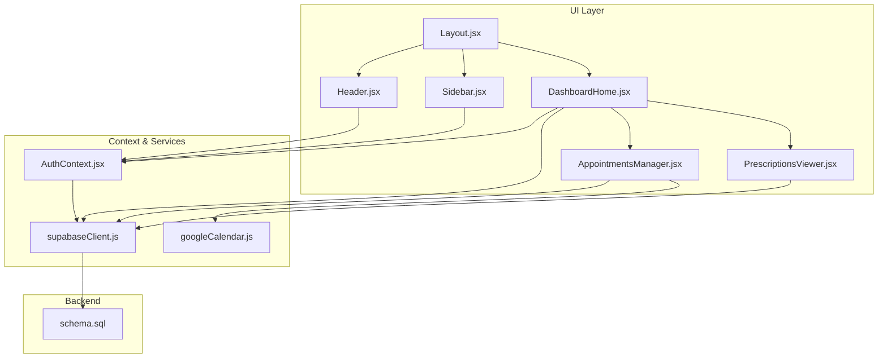
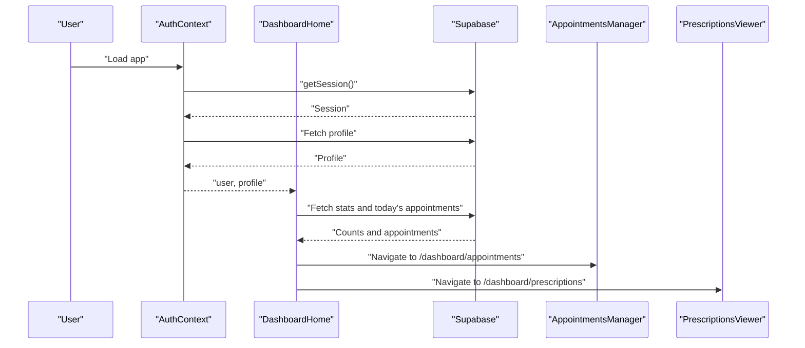
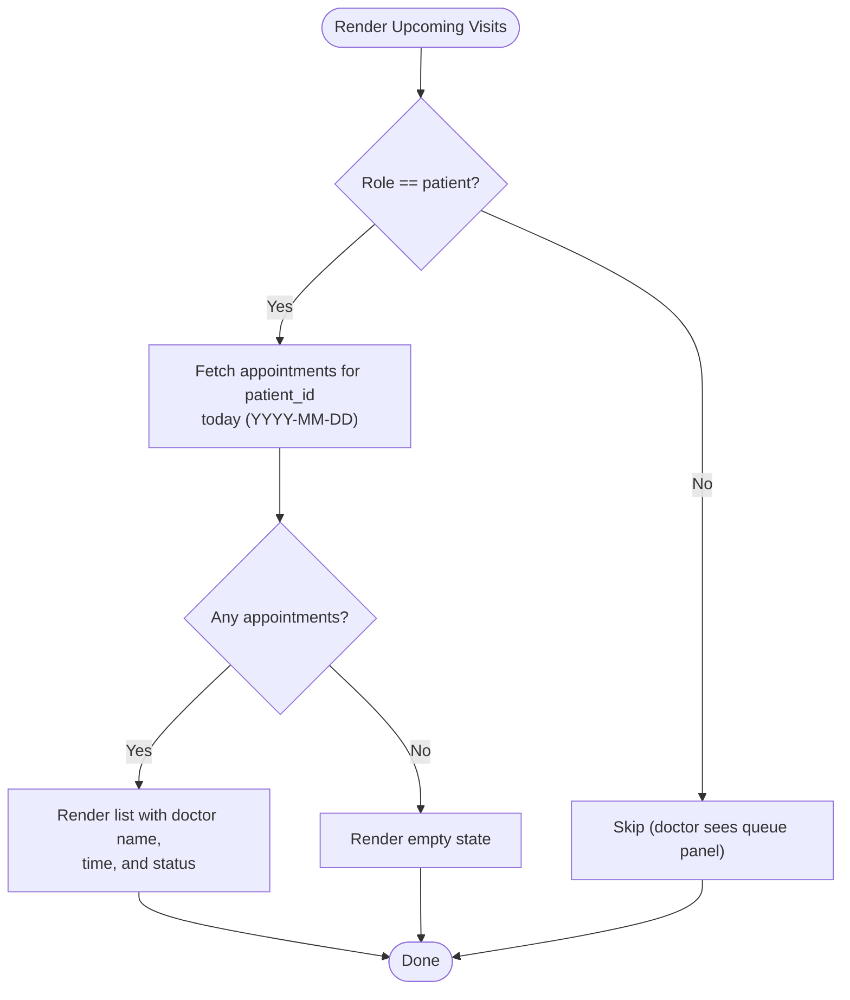
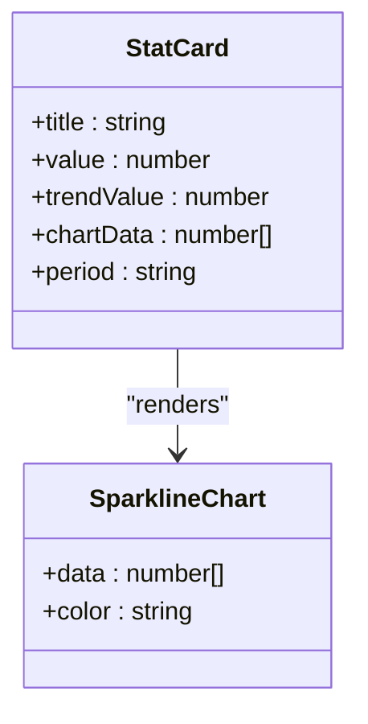
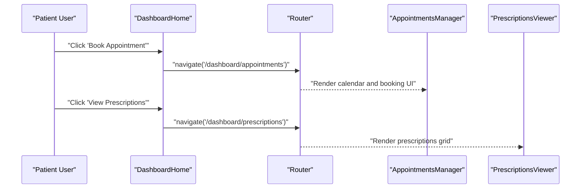
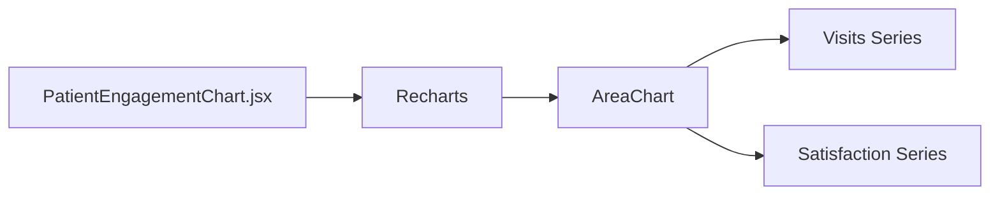
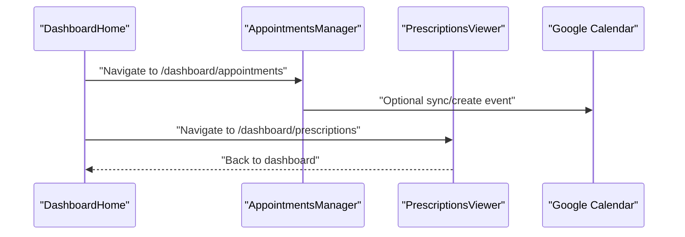
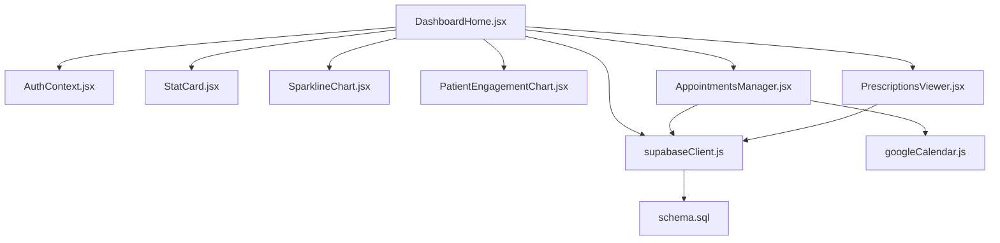

# Patient Dashboard

<cite>
**Referenced Files in This Document**
- [DashboardHome.jsx](file://frontend/src/pages/DashboardHome.jsx)
- [StatCard.jsx](file://frontend/src/components/StatCard.jsx)
- [PatientEngagementChart.jsx](file://frontend/src/components/PatientEngagementChart.jsx)
- [SparklineChart.jsx](file://frontend/src/components/SparklineChart.jsx)
- [AppointmentsManager.jsx](file://frontend/src/pages/AppointmentsManager.jsx)
- [PrescriptionsViewer.jsx](file://frontend/src/pages/PrescriptionsViewer.jsx)
- [AuthContext.jsx](file://frontend/src/context/AuthContext.jsx)
- [supabaseClient.js](file://frontend/src/lib/supabaseClient.js)
- [schema.sql](file://backend/schema.sql)
- [Layout.jsx](file://frontend/src/components/Layout.jsx)
- [Header.jsx](file://frontend/src/components/Header.jsx)
- [Sidebar.jsx](file://frontend/src/components/Sidebar.jsx)
- [ProtectedRoute.jsx](file://frontend/src/components/ProtectedRoute.jsx)
- [googleCalendar.js](file://frontend/src/lib/googleCalendar.js)
</cite>

## Table of Contents
1. [Introduction](#introduction)
2. [Project Structure](#project-structure)
3. [Core Components](#core-components)
4. [Architecture Overview](#architecture-overview)
5. [Detailed Component Analysis](#detailed-component-analysis)
6. [Dependency Analysis](#dependency-analysis)
7. [Performance Considerations](#performance-considerations)
8. [Troubleshooting Guide](#troubleshooting-guide)
9. [Conclusion](#conclusion)
10. [Appendices](#appendices)

## Introduction
This document describes the Patient Dashboard functionality in MedVita. It focuses on the patient-facing home screen that displays upcoming visits, statistics cards, quick actions, and a patient-specific visualization of engagement trends. It also documents the navigation flow from the dashboard to appointment booking and prescription viewing, responsive design adaptations, and how the system integrates with Supabase-backed data sources while maintaining privacy and security standards.

## Project Structure
The Patient Dashboard is implemented as a single-page application built with React and styled with Tailwind CSS. The dashboard is rendered under a protected route and uses Supabase for authentication and data persistence. The layout composes a header, sidebar, and main content area.

**Diagram sources**
- [Layout.jsx](file://frontend/src/components/Layout.jsx#L1-L43)
- [Header.jsx](file://frontend/src/components/Header.jsx#L1-L158)
- [Sidebar.jsx](file://frontend/src/components/Sidebar.jsx#L1-L113)
- [DashboardHome.jsx](file://frontend/src/pages/DashboardHome.jsx#L1-L487)
- [AppointmentsManager.jsx](file://frontend/src/pages/AppointmentsManager.jsx#L1-L577)
- [PrescriptionsViewer.jsx](file://frontend/src/pages/PrescriptionsViewer.jsx#L1-L273)
- [AuthContext.jsx](file://frontend/src/context/AuthContext.jsx#L1-L108)
- [supabaseClient.js](file://frontend/src/lib/supabaseClient.js#L1-L11)
- [googleCalendar.js](file://frontend/src/lib/googleCalendar.js#L1-L199)
- [schema.sql](file://backend/schema.sql#L1-L274)

**Section sources**
- [Layout.jsx](file://frontend/src/components/Layout.jsx#L1-L43)
- [Header.jsx](file://frontend/src/components/Header.jsx#L1-L158)
- [Sidebar.jsx](file://frontend/src/components/Sidebar.jsx#L1-L113)
- [DashboardHome.jsx](file://frontend/src/pages/DashboardHome.jsx#L1-L487)
- [AuthContext.jsx](file://frontend/src/context/AuthContext.jsx#L1-L108)
- [supabaseClient.js](file://frontend/src/lib/supabaseClient.js#L1-L11)
- [schema.sql](file://backend/schema.sql#L1-L274)

## Core Components
- DashboardHome: Renders the patient dashboard, including quick actions, stats cards, upcoming visits panel, and engagement visualization.
- StatCard: Displays KPIs with sparkline trends.
- PatientEngagementChart: Shows weekly visit analytics for the doctor’s panel; for patients, the engagement card is not shown.
- AppointmentsManager: Manages scheduling, calendar views, and booking flows.
- PrescriptionsViewer: Lists, previews, downloads, and manages prescriptions for the logged-in user.
- ProtectedRoute: Enforces role-based access and redirects unauthorized users.
- AuthContext: Provides authentication state and profile data.
- Supabase client: Centralized Supabase SDK initialization and usage.

**Section sources**
- [DashboardHome.jsx](file://frontend/src/pages/DashboardHome.jsx#L275-L487)
- [StatCard.jsx](file://frontend/src/components/StatCard.jsx#L1-L33)
- [PatientEngagementChart.jsx](file://frontend/src/components/PatientEngagementChart.jsx#L1-L89)
- [AppointmentsManager.jsx](file://frontend/src/pages/AppointmentsManager.jsx#L1-L577)
- [PrescriptionsViewer.jsx](file://frontend/src/pages/PrescriptionsViewer.jsx#L1-L273)
- [ProtectedRoute.jsx](file://frontend/src/components/ProtectedRoute.jsx#L53-L106)
- [AuthContext.jsx](file://frontend/src/context/AuthContext.jsx#L9-L107)
- [supabaseClient.js](file://frontend/src/lib/supabaseClient.js#L1-L11)

## Architecture Overview
The dashboard orchestrates data fetching and rendering for the patient. Authentication drives role-aware UI and navigation. Data is sourced from Supabase tables with Row Level Security policies ensuring access isolation.

**Diagram sources**
- [AuthContext.jsx](file://frontend/src/context/AuthContext.jsx#L14-L61)
- [DashboardHome.jsx](file://frontend/src/pages/DashboardHome.jsx#L282-L330)
- [AppointmentsManager.jsx](file://frontend/src/pages/AppointmentsManager.jsx#L67-L118)
- [PrescriptionsViewer.jsx](file://frontend/src/pages/PrescriptionsViewer.jsx#L57-L131)

## Detailed Component Analysis

### Upcoming Visits Section
- Purpose: Display today’s scheduled appointments for the patient.
- Data source: Appointments table filtered by patient_id and date range.
- Rendering: A scrollable list of appointments with doctor name, time, and status badges.
- Behavior: Empty state shows a friendly message; links to the full calendar view.

**Diagram sources**
- [DashboardHome.jsx](file://frontend/src/pages/DashboardHome.jsx#L318-L326)
- [DashboardHome.jsx](file://frontend/src/pages/DashboardHome.jsx#L428-L482)

**Section sources**
- [DashboardHome.jsx](file://frontend/src/pages/DashboardHome.jsx#L318-L326)
- [DashboardHome.jsx](file://frontend/src/pages/DashboardHome.jsx#L428-L482)

### Statistics Cards
- Purpose: Provide at-a-glance metrics for the patient.
- Cards:
  - Upcoming Visits: Count of today’s appointments.
  - Total Prescriptions: Count of prescriptions for the patient.
  - Total Appointments: Count of past and future appointments for the patient.
- Trend visualization: Sparkline charts embedded in StatCard.

**Diagram sources**
- [StatCard.jsx](file://frontend/src/components/StatCard.jsx#L3-L32)
- [SparklineChart.jsx](file://frontend/src/components/SparklineChart.jsx#L3-L20)

**Section sources**
- [DashboardHome.jsx](file://frontend/src/pages/DashboardHome.jsx#L395-L418)
- [StatCard.jsx](file://frontend/src/components/StatCard.jsx#L1-L33)
- [SparklineChart.jsx](file://frontend/src/components/SparklineChart.jsx#L1-L21)

### Quick Actions
- Purpose: Provide fast navigation to common tasks.
- Patient actions:
  - Book Appointment → navigates to AppointmentsManager.
  - View Prescriptions → navigates to PrescriptionsViewer.

**Diagram sources**
- [DashboardHome.jsx](file://frontend/src/pages/DashboardHome.jsx#L357-L360)
- [DashboardHome.jsx](file://frontend/src/pages/DashboardHome.jsx#L403-L410)
- [AppointmentsManager.jsx](file://frontend/src/pages/AppointmentsManager.jsx#L1-L577)
- [PrescriptionsViewer.jsx](file://frontend/src/pages/PrescriptionsViewer.jsx#L1-L273)

**Section sources**
- [DashboardHome.jsx](file://frontend/src/pages/DashboardHome.jsx#L357-L360)
- [DashboardHome.jsx](file://frontend/src/pages/DashboardHome.jsx#L403-L410)

### Patient-Specific Engagement Visualization
- Purpose: Show weekly visit analytics and satisfaction trends.
- Implementation: Area chart with two series (visits and satisfaction) using Recharts.
- Note: The engagement chart is included in the doctor’s dashboard panel; for patients, this card does not render.

**Diagram sources**
- [PatientEngagementChart.jsx](file://frontend/src/components/PatientEngagementChart.jsx#L27-L84)

**Section sources**
- [PatientEngagementChart.jsx](file://frontend/src/components/PatientEngagementChart.jsx#L1-L89)
- [DashboardHome.jsx](file://frontend/src/pages/DashboardHome.jsx#L426-L427)

### Navigation Flow: Dashboard to Booking and Prescriptions
- From Dashboard:
  - Quick Action “Book Appointment” navigates to AppointmentsManager.
  - Stat Card “Total Prescriptions” navigates to PrescriptionsViewer.
- AppointmentsManager:
  - Supports month/week/list views, time-slot selection, and modal booking.
  - Integrates with Google Calendar when enabled.
- PrescriptionsViewer:
  - Lists prescriptions, supports preview, download, and optional auto-download.

**Diagram sources**
- [DashboardHome.jsx](file://frontend/src/pages/DashboardHome.jsx#L438-L443)
- [AppointmentsManager.jsx](file://frontend/src/pages/AppointmentsManager.jsx#L134-L180)
- [googleCalendar.js](file://frontend/src/lib/googleCalendar.js#L125-L178)
- [PrescriptionsViewer.jsx](file://frontend/src/pages/PrescriptionsViewer.jsx#L51-L55)

**Section sources**
- [DashboardHome.jsx](file://frontend/src/pages/DashboardHome.jsx#L438-L443)
- [AppointmentsManager.jsx](file://frontend/src/pages/AppointmentsManager.jsx#L134-L180)
- [PrescriptionsViewer.jsx](file://frontend/src/pages/PrescriptionsViewer.jsx#L51-L55)
- [googleCalendar.js](file://frontend/src/lib/googleCalendar.js#L125-L178)

### Responsive Design Adaptations
- Grid layouts:
  - Stats grid adapts from 1 to 3 columns depending on viewport.
  - Main content switches from single-column to multi-column on larger screens.
- Scroll areas:
  - Custom scrollbars applied to lists and modals for consistent UX.
- Mobile-first interactions:
  - Sidebar collapses behind an overlay on small screens.
  - Calendar grid adjusts number of columns per breakpoint.
- Typography and spacing:
  - Relative units and clamp-like sizing for readability across devices.

**Section sources**
- [DashboardHome.jsx](file://frontend/src/pages/DashboardHome.jsx#L388-L425)
- [Layout.jsx](file://frontend/src/components/Layout.jsx#L1-L43)
- [AppointmentsManager.jsx](file://frontend/src/pages/AppointmentsManager.jsx#L34-L38)

### Patient Perspective: Access, Convenience, and Privacy
- Access:
  - Single sign-on via Supabase Auth; profile fetched on session change.
  - Role-based routing ensures patients land on the correct dashboard.
- Convenience:
  - One-click navigation to booking and prescriptions.
  - Clear status indicators and empty-state messaging.
- Privacy and security:
  - Supabase Row Level Security policies restrict data access to authorized users.
  - Authenticated routes enforce role checks.

**Section sources**
- [AuthContext.jsx](file://frontend/src/context/AuthContext.jsx#L14-L61)
- [ProtectedRoute.jsx](file://frontend/src/components/ProtectedRoute.jsx#L53-L106)
- [schema.sql](file://backend/schema.sql#L168-L224)

## Dependency Analysis
- DashboardHome depends on:
  - AuthContext for user and profile.
  - Supabase client for data queries.
  - StatCard and SparklineChart for metrics.
  - PatientEngagementChart for visualization (doctor panel).
  - Navigation to AppointmentsManager and PrescriptionsViewer.
- AppointmentsManager and PrescriptionsViewer depend on:
  - Supabase for CRUD operations.
  - Google Calendar integration for optional sync.
- Backend relies on:
  - Supabase Auth and Postgres.
  - RLS policies to protect data.

**Diagram sources**
- [DashboardHome.jsx](file://frontend/src/pages/DashboardHome.jsx#L1-L12)
- [AuthContext.jsx](file://frontend/src/context/AuthContext.jsx#L1-L108)
- [supabaseClient.js](file://frontend/src/lib/supabaseClient.js#L1-L11)
- [StatCard.jsx](file://frontend/src/components/StatCard.jsx#L1-L33)
- [SparklineChart.jsx](file://frontend/src/components/SparklineChart.jsx#L1-L21)
- [PatientEngagementChart.jsx](file://frontend/src/components/PatientEngagementChart.jsx#L1-L89)
- [AppointmentsManager.jsx](file://frontend/src/pages/AppointmentsManager.jsx#L1-L577)
- [PrescriptionsViewer.jsx](file://frontend/src/pages/PrescriptionsViewer.jsx#L1-L273)
- [googleCalendar.js](file://frontend/src/lib/googleCalendar.js#L1-L199)
- [schema.sql](file://backend/schema.sql#L1-L274)

**Section sources**
- [DashboardHome.jsx](file://frontend/src/pages/DashboardHome.jsx#L1-L12)
- [AppointmentsManager.jsx](file://frontend/src/pages/AppointmentsManager.jsx#L1-L13)
- [PrescriptionsViewer.jsx](file://frontend/src/pages/PrescriptionsViewer.jsx#L1-L8)
- [schema.sql](file://backend/schema.sql#L1-L274)

## Performance Considerations
- Efficient data fetching:
  - Dashboard queries counts and today’s appointments in parallel for patient role.
  - AppointmentsManager paginates and caches data to reduce re-renders.
- Rendering optimizations:
  - Conditional rendering avoids unnecessary components (e.g., engagement chart for patients).
  - Animations and transitions are scoped to interactive elements.
- Network hygiene:
  - Environment variables for Supabase keys and Google Calendar are validated at runtime.

[No sources needed since this section provides general guidance]

## Troubleshooting Guide
- Authentication issues:
  - Verify session and profile loading; errors are surfaced during auth state changes.
- Missing profile data:
  - ProtectedRoute handles missing profiles by redirecting to login.
- Supabase connectivity:
  - Missing environment variables produce warnings; ensure .env.local is configured.
- Calendar sync:
  - Google Calendar integration requires OAuth consent and tokens; handle failures gracefully.

**Section sources**
- [AuthContext.jsx](file://frontend/src/context/AuthContext.jsx#L14-L61)
- [ProtectedRoute.jsx](file://frontend/src/components/ProtectedRoute.jsx#L77-L93)
- [supabaseClient.js](file://frontend/src/lib/supabaseClient.js#L6-L8)
- [googleCalendar.js](file://frontend/src/lib/googleCalendar.js#L72-L104)

## Conclusion
The Patient Dashboard delivers a focused, secure, and convenient interface for patients to view upcoming visits, track health metrics, and manage appointments and prescriptions. Its responsive design and role-aware navigation ensure a smooth experience across devices, while Supabase-backed data sources and RLS policies uphold privacy and security.

## Appendices

### Data Model Notes Relevant to Dashboard
- Appointments: filtered by patient_id for the patient dashboard.
- Prescriptions: filtered by patient record derived from the authenticated user’s email.
- Profiles: role determines dashboard home and navigation.

**Section sources**
- [schema.sql](file://backend/schema.sql#L168-L224)
- [PrescriptionsViewer.jsx](file://frontend/src/pages/PrescriptionsViewer.jsx#L94-L121)