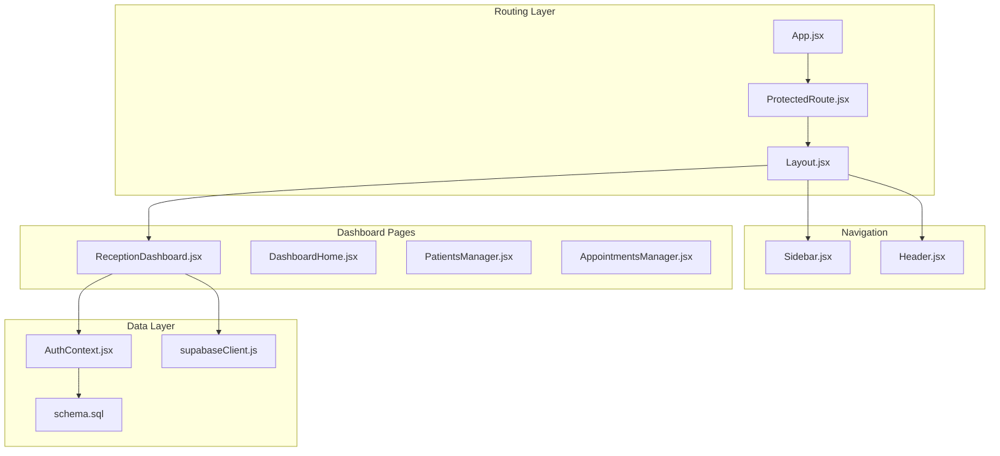
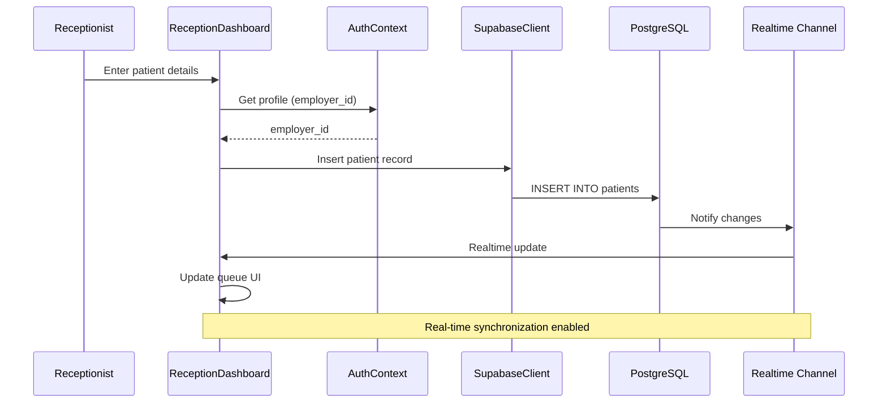
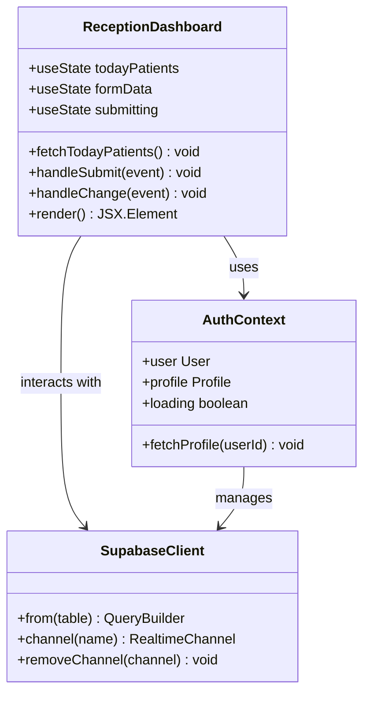
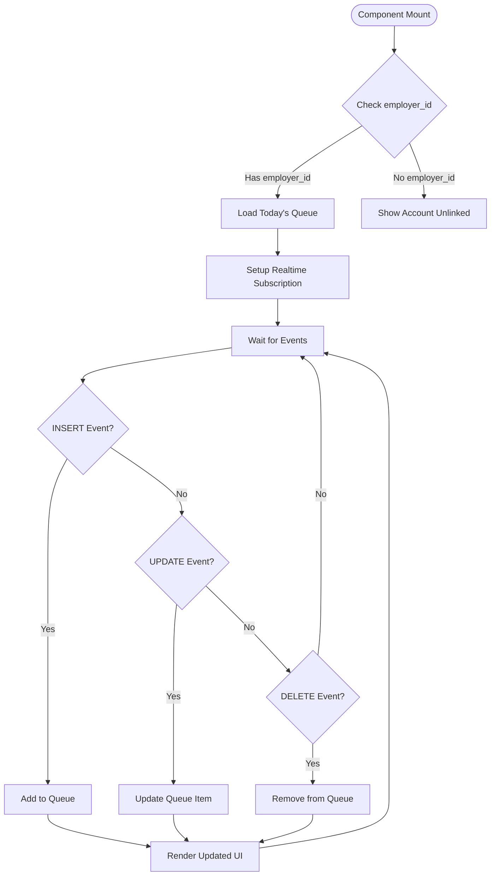
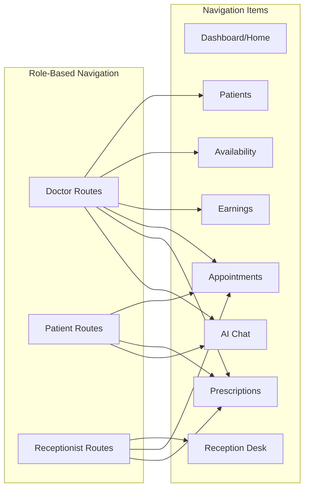
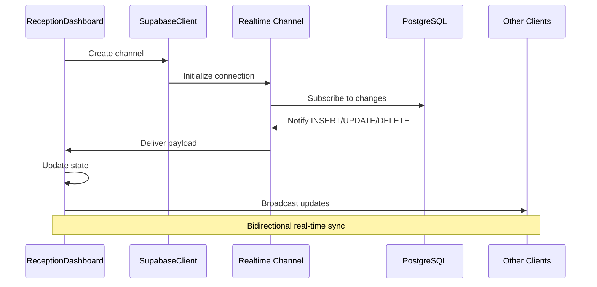
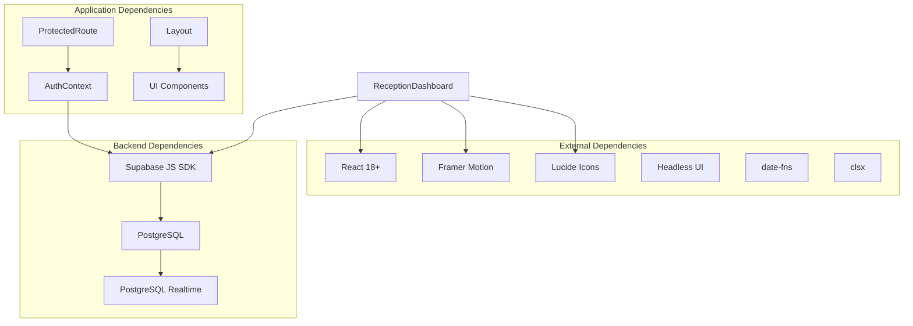

# Receptionist Dashboard

<cite>
**Referenced Files in This Document**
- [ReceptionDashboard.jsx](file://frontend/src/pages/ReceptionDashboard.jsx)
- [App.jsx](file://frontend/src/App.jsx)
- [Layout.jsx](file://frontend/src/components/Layout.jsx)
- [Sidebar.jsx](file://frontend/src/components/Sidebar.jsx)
- [Header.jsx](file://frontend/src/components/Header.jsx)
- [ProtectedRoute.jsx](file://frontend/src/components/ProtectedRoute.jsx)
- [DashboardHome.jsx](file://frontend/src/pages/DashboardHome.jsx)
- [PatientsManager.jsx](file://frontend/src/pages/PatientsManager.jsx)
- [AppointmentsManager.jsx](file://frontend/src/pages/AppointmentsManager.jsx)
- [AuthContext.jsx](file://frontend/src/context/AuthContext.jsx)
- [supabaseClient.js](file://frontend/src/lib/supabaseClient.js)
- [schema.sql](file://backend/schema.sql)
</cite>

## Table of Contents
1. [Introduction](#introduction)
2. [Project Structure](#project-structure)
3. [Core Components](#core-components)
4. [Architecture Overview](#architecture-overview)
5. [Detailed Component Analysis](#detailed-component-analysis)
6. [Dependency Analysis](#dependency-analysis)
7. [Performance Considerations](#performance-considerations)
8. [Troubleshooting Guide](#troubleshooting-guide)
9. [Conclusion](#conclusion)

## Introduction
The Receptionist Dashboard is the front desk operations interface for MedVita, designed to streamline patient check-in/out processes, manage walk-in queues, coordinate appointments, and support administrative tasks. It integrates seamlessly with the broader healthcare management system, enabling receptionists to efficiently manage patient flow, maintain clinic operations, and facilitate communication between front desk and clinical staff. The dashboard emphasizes real-time updates, quick access to frequently used functions, and a user-friendly interface optimized for front desk efficiency.

## Project Structure
The Receptionist Dashboard is part of the React-based frontend application with a clear separation of concerns:
- Routing and navigation are handled through React Router with protected routes
- Authentication and user context are managed via Supabase Auth
- Real-time data synchronization uses Supabase Realtime channels
- The dashboard follows a responsive grid layout with glass-morphism design elements

**Diagram sources**
- [App.jsx](file://frontend/src/App.jsx#L18-L57)
- [Layout.jsx](file://frontend/src/components/Layout.jsx#L5-L42)
- [Sidebar.jsx](file://frontend/src/components/Sidebar.jsx#L19-L112)
- [Header.jsx](file://frontend/src/components/Header.jsx#L17-L157)
- [ReceptionDashboard.jsx](file://frontend/src/pages/ReceptionDashboard.jsx#L37-L454)
- [AuthContext.jsx](file://frontend/src/context/AuthContext.jsx#L9-L107)
- [supabaseClient.js](file://frontend/src/lib/supabaseClient.js#L1-L11)
- [schema.sql](file://backend/schema.sql#L4-L274)

**Section sources**
- [App.jsx](file://frontend/src/App.jsx#L1-L61)
- [Layout.jsx](file://frontend/src/components/Layout.jsx#L1-L43)
- [Sidebar.jsx](file://frontend/src/components/Sidebar.jsx#L1-L113)
- [Header.jsx](file://frontend/src/components/Header.jsx#L1-L158)

## Core Components
The Receptionist Dashboard consists of several interconnected components that work together to provide a comprehensive front desk management solution:

### Primary Dashboard Components
- **ReceptionDashboard**: Main interface for patient queue management and check-in operations
- **Sidebar Navigation**: Role-based navigation with receptionist-specific links
- **ProtectedRoute**: Role-based access control and authentication enforcement
- **Real-time Data Synchronization**: PostgreSQL changes subscription for live updates

### Supporting Components
- **Header**: Application header with user profile and settings
- **AuthContext**: Authentication state management and user profile retrieval
- **SupabaseClient**: Database connection and real-time subscriptions
- **Schema Integration**: Backend data model supporting receptionist workflows

**Section sources**
- [ReceptionDashboard.jsx](file://frontend/src/pages/ReceptionDashboard.jsx#L37-L454)
- [Sidebar.jsx](file://frontend/src/components/Sidebar.jsx#L24-L35)
- [ProtectedRoute.jsx](file://frontend/src/components/ProtectedRoute.jsx#L53-L106)
- [AuthContext.jsx](file://frontend/src/context/AuthContext.jsx#L9-L107)

## Architecture Overview
The Receptionist Dashboard implements a modern, real-time architecture built on Supabase technology:

**Diagram sources**
- [ReceptionDashboard.jsx](file://frontend/src/pages/ReceptionDashboard.jsx#L48-L113)
- [AuthContext.jsx](file://frontend/src/context/AuthContext.jsx#L43-L61)
- [supabaseClient.js](file://frontend/src/lib/supabaseClient.js#L1-L11)

The architecture leverages Supabase's real-time capabilities to provide instant updates across all connected clients, ensuring that patient queue information remains synchronized between receptionists and doctors.

**Section sources**
- [ReceptionDashboard.jsx](file://frontend/src/pages/ReceptionDashboard.jsx#L71-L113)
- [supabaseClient.js](file://frontend/src/lib/supabaseClient.js#L1-L11)

## Detailed Component Analysis

### ReceptionDashboard Component
The main ReceptionDashboard component serves as the central hub for front desk operations:

**Diagram sources**
- [ReceptionDashboard.jsx](file://frontend/src/pages/ReceptionDashboard.jsx#L37-L454)
- [AuthContext.jsx](file://frontend/src/context/AuthContext.jsx#L92-L100)
- [supabaseClient.js](file://frontend/src/lib/supabaseClient.js#L1-L11)

#### Key Features
- **Real-time Patient Queue Management**: Live synchronization of patient arrivals and departures
- **Quick Check-in Form**: Streamlined patient registration with vitals capture
- **Responsive Design**: Optimized for both desktop and mobile front desk environments
- **Toast Notifications**: Non-blocking user feedback for operations
- **Employer Integration**: Links receptionist actions to specific clinic employers

#### Data Flow Implementation
The component implements a sophisticated data flow pattern:

**Diagram sources**
- [ReceptionDashboard.jsx](file://frontend/src/pages/ReceptionDashboard.jsx#L71-L113)

**Section sources**
- [ReceptionDashboard.jsx](file://frontend/src/pages/ReceptionDashboard.jsx#L37-L454)

### Navigation and Access Control
The system implements role-based navigation specifically tailored for receptionists:

**Diagram sources**
- [Sidebar.jsx](file://frontend/src/components/Sidebar.jsx#L24-L35)
- [App.jsx](file://frontend/src/App.jsx#L50-L51)

The navigation system ensures that receptionists have immediate access to their primary responsibilities while maintaining appropriate access controls.

**Section sources**
- [Sidebar.jsx](file://frontend/src/components/Sidebar.jsx#L24-L35)
- [App.jsx](file://frontend/src/App.jsx#L50-L51)

### Real-time Data Synchronization
The dashboard leverages Supabase's real-time capabilities for seamless data updates:

**Diagram sources**
- [ReceptionDashboard.jsx](file://frontend/src/pages/ReceptionDashboard.jsx#L76-L113)
- [supabaseClient.js](file://frontend/src/lib/supabaseClient.js#L1-L11)

**Section sources**
- [ReceptionDashboard.jsx](file://frontend/src/pages/ReceptionDashboard.jsx#L71-L113)

### Administrative Task Management
The dashboard supports various administrative functions essential for front desk operations:

#### Patient Registration Workflow
The system provides a streamlined patient registration process with vitals capture:

| Field | Type | Required | Purpose |
|-------|------|----------|---------|
| Name | Text | Yes | Patient identification |
| Age | Number | No | Demographic information |
| Gender | Select | No | Patient demographics |
| Phone | Tel | No | Contact information |
| Email | Email | No | Communication method |
| Blood Pressure | Text | No | Medical vitals |
| Heart Rate | Number | No | Medical vitals |

#### Queue Management Features
- **Live Queue Updates**: Real-time patient arrival notifications
- **Priority Handling**: Automatic sorting by arrival time
- **Status Tracking**: Visual indicators for patient status
- **Quick Actions**: One-click operations for common tasks

**Section sources**
- [ReceptionDashboard.jsx](file://frontend/src/pages/ReceptionDashboard.jsx#L246-L454)

## Dependency Analysis
The Receptionist Dashboard has a well-defined dependency structure that supports maintainability and scalability:

**Diagram sources**
- [ReceptionDashboard.jsx](file://frontend/src/pages/ReceptionDashboard.jsx#L1-L10)
- [AuthContext.jsx](file://frontend/src/context/AuthContext.jsx#L1-L2)
- [supabaseClient.js](file://frontend/src/lib/supabaseClient.js#L1-L2)

### Component Coupling Analysis
The dashboard demonstrates excellent separation of concerns with minimal coupling between components. Each component has a single responsibility and communicates through well-defined interfaces.

**Section sources**
- [ReceptionDashboard.jsx](file://frontend/src/pages/ReceptionDashboard.jsx#L1-L10)
- [AuthContext.jsx](file://frontend/src/context/AuthContext.jsx#L1-L2)

## Performance Considerations
The Receptionist Dashboard is optimized for performance in high-pressure front desk environments:

### Real-time Performance
- **Efficient Subscriptions**: Single channel per receptionist for optimal resource usage
- **Smart Filtering**: Database-side filtering reduces payload sizes
- **Batch Updates**: Animation library optimizes UI transitions

### Data Loading Strategies
- **Lazy Loading**: Queue data loads only when needed
- **Caching**: Local state caching minimizes database queries
- **Debouncing**: Input handling prevents excessive API calls

### Mobile Optimization
- **Responsive Design**: Adapts to various screen sizes
- **Touch-friendly**: Large touch targets for quick operations
- **Offline Resilience**: Graceful degradation when connectivity is poor

## Troubleshooting Guide

### Common Issues and Solutions

#### Authentication Problems
**Issue**: Receptionist cannot access dashboard
**Solution**: Verify clinic code and employer relationship in profile

#### Real-time Updates Not Working
**Issue**: Queue not updating in real-time
**Solution**: Check network connectivity and browser permissions

#### Data Synchronization Errors
**Issue**: Patient records not appearing
**Solution**: Verify employer_id assignment and database policies

#### Performance Issues
**Issue**: Slow loading or lagging interface
**Solution**: Clear browser cache and check for browser extensions interfering

**Section sources**
- [ProtectedRoute.jsx](file://frontend/src/components/ProtectedRoute.jsx#L16-L47)
- [ReceptionDashboard.jsx](file://frontend/src/pages/ReceptionDashboard.jsx#L104-L110)

## Conclusion
The Receptionist Dashboard represents a comprehensive solution for front desk operations in MedVita, combining real-time data synchronization, intuitive user interface design, and robust administrative capabilities. The system successfully addresses the unique needs of receptionists by providing quick access to essential functions while maintaining seamless integration with the broader healthcare management ecosystem.

Key strengths include:
- **Real-time synchronization** ensuring accurate, up-to-date information
- **Role-based access control** maintaining appropriate security boundaries
- **Streamlined workflows** optimizing front desk efficiency
- **Scalable architecture** supporting growth and additional features
- **Mobile optimization** enabling flexible deployment across various environments

The dashboard serves as a critical bridge between administrative and clinical systems, facilitating efficient patient flow management and supporting the overall operational effectiveness of medical practices using the MedVita platform.