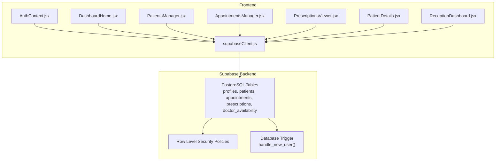
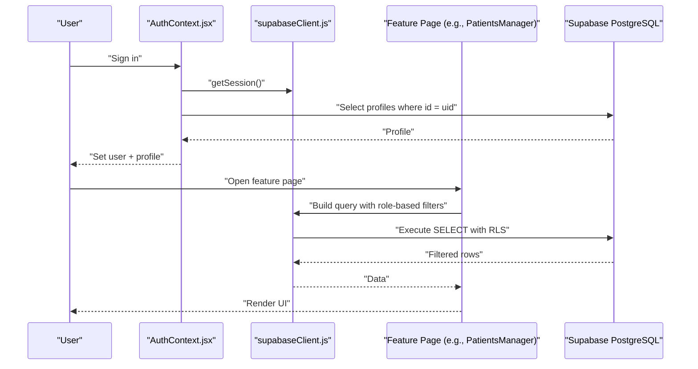
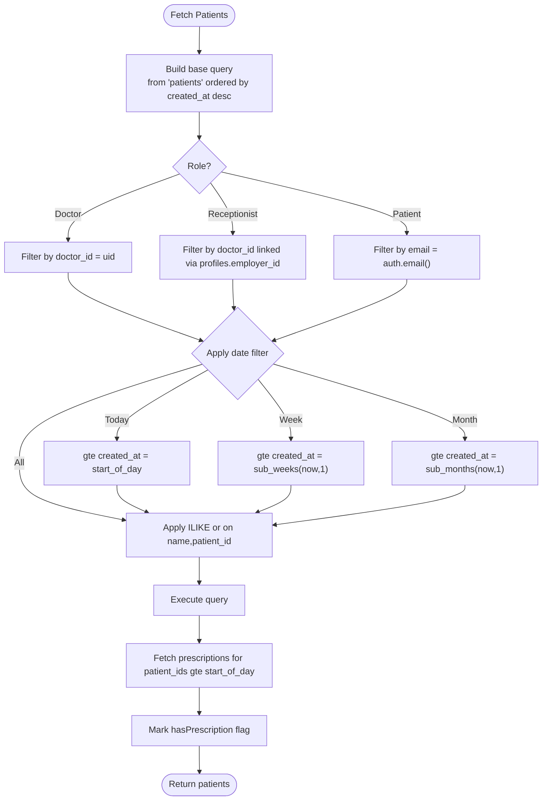
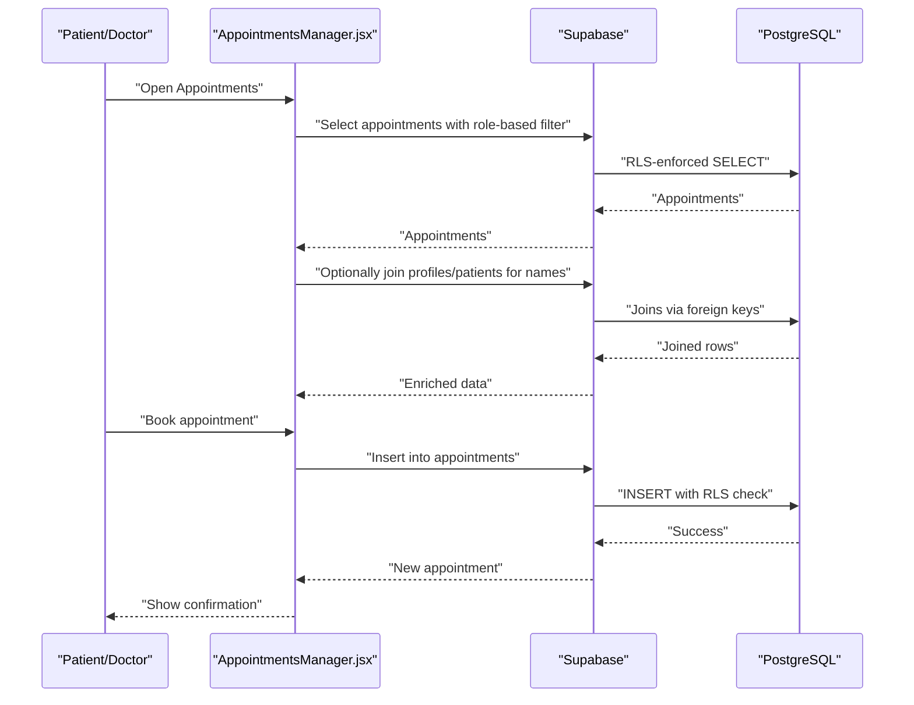
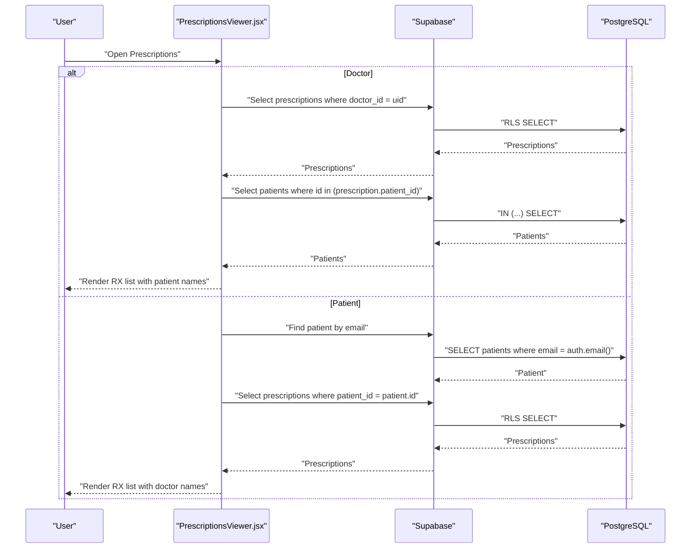
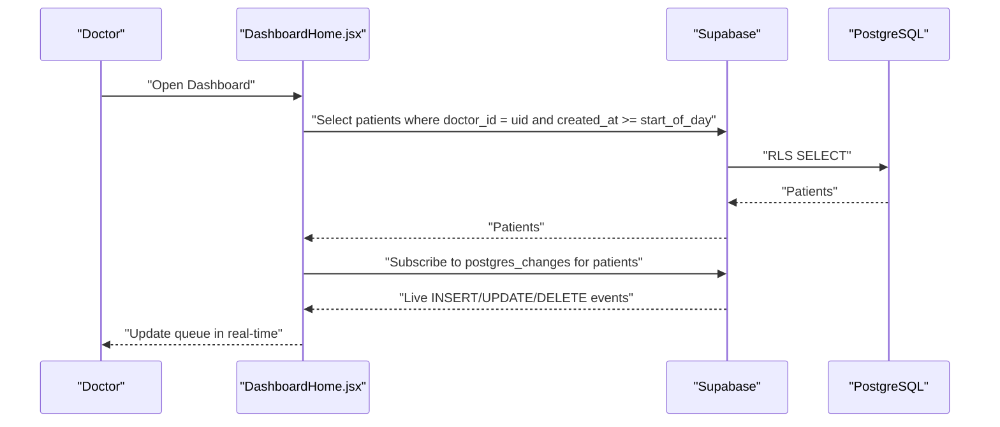
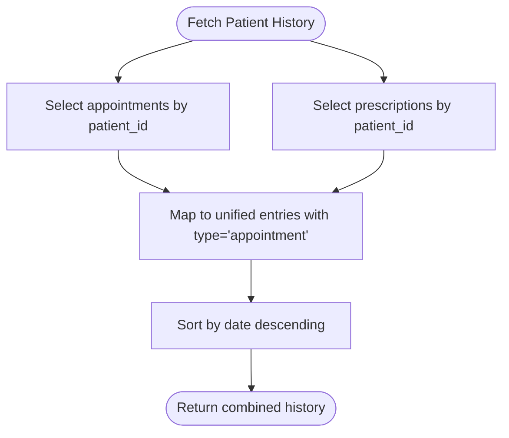
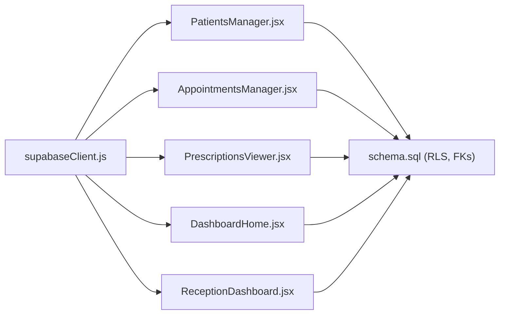

# Data Access Patterns & Queries

<cite>
**Referenced Files in This Document**
- [schema.sql](file://backend/schema.sql)
- [supabaseClient.js](file://frontend/src/lib/supabaseClient.js)
- [AuthContext.jsx](file://frontend/src/context/AuthContext.jsx)
- [DashboardHome.jsx](file://frontend/src/pages/DashboardHome.jsx)
- [PatientsManager.jsx](file://frontend/src/pages/PatientsManager.jsx)
- [AppointmentsManager.jsx](file://frontend/src/pages/AppointmentsManager.jsx)
- [PrescriptionsViewer.jsx](file://frontend/src/pages/PrescriptionsViewer.jsx)
- [PatientDetails.jsx](file://frontend/src/components/PatientDetails.jsx)
- [ReceptionDashboard.jsx](file://frontend/src/pages/ReceptionDashboard.jsx)
- [SUPABASE_SETUP.md](file://_trash/SUPABASE_SETUP.md)
</cite>

## Table of Contents
1. [Introduction](#introduction)
2. [Project Structure](#project-structure)
3. [Core Components](#core-components)
4. [Architecture Overview](#architecture-overview)
5. [Detailed Component Analysis](#detailed-component-analysis)
6. [Dependency Analysis](#dependency-analysis)
7. [Performance Considerations](#performance-considerations)
8. [Troubleshooting Guide](#troubleshooting-guide)
9. [Conclusion](#conclusion)

## Introduction
This document explains MedVita’s data access patterns and common query strategies across key features: patient lookup, appointment scheduling, prescription retrieval, and dashboard reporting. It covers role-based filtering via Row Level Security (RLS), real-time updates, cross-table joins, pagination and search patterns, and optimization techniques. The goal is to help developers implement efficient, secure, and maintainable data flows aligned with the existing frontend components and backend schema.

## Project Structure
MedVita uses Supabase (PostgreSQL) for persistence and authentication. The frontend interacts with Supabase through a typed client and applies role-aware filters and joins to present accurate views per user role.

**Diagram sources**
- [supabaseClient.js](file://frontend/src/lib/supabaseClient.js#L1-L11)
- [AuthContext.jsx](file://frontend/src/context/AuthContext.jsx#L14-L61)
- [schema.sql](file://backend/schema.sql#L4-L274)

**Section sources**
- [README.md](file://README.md#L16-L28)
- [supabaseClient.js](file://frontend/src/lib/supabaseClient.js#L1-L11)
- [schema.sql](file://backend/schema.sql#L1-L274)

## Core Components
- Supabase client initialization and environment configuration
- Role-aware data access via RLS policies
- Cross-table joins using Supabase’s foreign keys and relation selection
- Real-time subscriptions for live updates
- Pagination and search via range filters and ordering

Key implementation anchors:
- Supabase client creation and environment checks
- Auth context fetching and caching of user profile
- Feature-specific queries for patients, appointments, and prescriptions
- Real-time channels for queue and reception dashboards

**Section sources**
- [supabaseClient.js](file://frontend/src/lib/supabaseClient.js#L1-L11)
- [AuthContext.jsx](file://frontend/src/context/AuthContext.jsx#L14-L61)
- [PatientsManager.jsx](file://frontend/src/pages/PatientsManager.jsx#L56-L121)
- [AppointmentsManager.jsx](file://frontend/src/pages/AppointmentsManager.jsx#L67-L118)
- [PrescriptionsViewer.jsx](file://frontend/src/pages/PrescriptionsViewer.jsx#L57-L131)
- [DashboardHome.jsx](file://frontend/src/pages/DashboardHome.jsx#L26-L76)
- [ReceptionDashboard.jsx](file://frontend/src/pages/ReceptionDashboard.jsx#L48-L113)

## Architecture Overview
The frontend composes queries based on the authenticated user’s role and profile. RLS ensures that users only see permitted rows. Cross-table relations are resolved either via foreign keys or explicit joins.

**Diagram sources**
- [AuthContext.jsx](file://frontend/src/context/AuthContext.jsx#L14-L61)
- [PatientsManager.jsx](file://frontend/src/pages/PatientsManager.jsx#L56-L121)
- [schema.sql](file://backend/schema.sql#L71-L115)

## Detailed Component Analysis

### Patient Lookup and Search
Common patterns:
- Role-based filtering: doctors see only their patients; receptionists see patients linked to their employer’s doctor; patients see their own records via email.
- Date-range filtering for “today”, “week”, “month”, “all”.
- Full-text search across name and patient_id using ILIKE with OR composition.
- Cross-table join to enrich patient lists with prescription status for the current day.

**Diagram sources**
- [PatientsManager.jsx](file://frontend/src/pages/PatientsManager.jsx#L56-L121)
- [schema.sql](file://backend/schema.sql#L71-L115)

**Section sources**
- [PatientsManager.jsx](file://frontend/src/pages/PatientsManager.jsx#L56-L121)
- [schema.sql](file://backend/schema.sql#L71-L115)

### Appointment Scheduling and Management
Patterns:
- Role-aware visibility: patients see their own appointments; doctors see their appointments and those linked by patient.doctor_id.
- Booking flow: select doctor or patient, choose date/time, insert appointment with status defaults.
- Cross-table enrichment: resolve cached names or fetch from profiles/patients when missing.
- Real-time sync with Google Calendar for doctors who have enabled sync.

**Diagram sources**
- [AppointmentsManager.jsx](file://frontend/src/pages/AppointmentsManager.jsx#L67-L118)
- [schema.sql](file://backend/schema.sql#L137-L200)

**Section sources**
- [AppointmentsManager.jsx](file://frontend/src/pages/AppointmentsManager.jsx#L67-L118)
- [schema.sql](file://backend/schema.sql#L137-L200)

### Prescription Retrieval and Cross-Table Joins
Patterns:
- Doctors: list their prescriptions and enrich with patient names via a join on patients.id.
- Patients: find their patient record by email and list prescriptions joined with doctor profile.
- File-based storage via Supabase Storage with bucket policies.

**Diagram sources**
- [PrescriptionsViewer.jsx](file://frontend/src/pages/PrescriptionsViewer.jsx#L57-L131)
- [schema.sql](file://backend/schema.sql#L200-L225)

**Section sources**
- [PrescriptionsViewer.jsx](file://frontend/src/pages/PrescriptionsViewer.jsx#L57-L131)
- [schema.sql](file://backend/schema.sql#L200-L225)

### Dashboard Reporting and Real-Time Updates
Patterns:
- Doctor dashboard: counts of patients and appointments, today’s schedule, and queue panel with real-time updates.
- Reception dashboard: today’s queue for the employer doctor with real-time updates.
- Real-time channels subscribe to PostgreSQL changes for the relevant doctor_id.

**Diagram sources**
- [DashboardHome.jsx](file://frontend/src/pages/DashboardHome.jsx#L26-L76)
- [ReceptionDashboard.jsx](file://frontend/src/pages/ReceptionDashboard.jsx#L48-L113)
- [schema.sql](file://backend/schema.sql#L45-L115)

**Section sources**
- [DashboardHome.jsx](file://frontend/src/pages/DashboardHome.jsx#L26-L76)
- [ReceptionDashboard.jsx](file://frontend/src/pages/ReceptionDashboard.jsx#L48-L113)
- [schema.sql](file://backend/schema.sql#L45-L115)

### Patient History Tracking
Patterns:
- Combine appointments and prescriptions for a single patient into a unified timeline sorted by date/time.
- Use patient_id as the link to resolve both appointment and prescription records.

**Diagram sources**
- [PatientDetails.jsx](file://frontend/src/components/PatientDetails.jsx#L44-L73)

**Section sources**
- [PatientDetails.jsx](file://frontend/src/components/PatientDetails.jsx#L44-L73)

## Dependency Analysis
- Frontend depends on Supabase client for all data operations.
- Supabase enforces RLS policies defined in the backend schema.
- Cross-table relationships are defined by foreign keys; joins are performed implicitly via Supabase’s relation selection.
- Real-time updates rely on Supabase postgres_changes channels scoped by doctor_id.

**Diagram sources**
- [supabaseClient.js](file://frontend/src/lib/supabaseClient.js#L1-L11)
- [schema.sql](file://backend/schema.sql#L45-L225)

**Section sources**
- [supabaseClient.js](file://frontend/src/lib/supabaseClient.js#L1-L11)
- [schema.sql](file://backend/schema.sql#L45-L225)

## Performance Considerations
- Indexing strategies
  - Primary keys are UUIDs; ensure appropriate indexing on frequently filtered columns:
    - patients(doctor_id)
    - patients(created_at)
    - appointments(doctor_id), appointments(patient_id), appointments(date, time)
    - prescriptions(doctor_id), prescriptions(patient_id)
    - profiles(id) and profiles(role), profiles(employer_id)
  - Consider composite indexes for frequent filters (e.g., appointments(doctor_id, date), patients(doctor_id, created_at)).
- Query optimization
  - Prefer equality filters over expensive LIKE patterns when possible.
  - Use range filters (gte/lte) for dates to leverage indexes effectively.
  - Minimize SELECT *; request only needed columns to reduce payload size.
  - Batch secondary queries (e.g., fetch patient names for a list) using IN clauses.
- Pagination and search
  - For large lists, implement server-side pagination using limits and offsets or cursor-based pagination.
  - Debounce search inputs to avoid excessive requests.
- Real-time updates
  - Subscribe to narrow channels (e.g., doctor_id) to minimize event volume.
  - Avoid unnecessary re-renders by normalizing data and updating only changed fields.
- Storage
  - Use bucket policies to restrict uploads/selects to authenticated users and the medvita-files bucket.

[No sources needed since this section provides general guidance]

## Troubleshooting Guide
- Missing Supabase URL or Anon Key
  - Symptom: Warning in console about missing credentials.
  - Action: Verify environment variables in the frontend.
  - Section sources
    - [supabaseClient.js](file://frontend/src/lib/supabaseClient.js#L6-L8)
- Role-based access denied
  - Symptom: Empty lists or permission errors.
  - Action: Confirm user role and profile doctor_id/employer_id; verify RLS policies.
  - Section sources
    - [schema.sql](file://backend/schema.sql#L71-L115)
    - [schema.sql](file://backend/schema.sql#L168-L200)
    - [schema.sql](file://backend/schema.sql#L210-L225)
- Patients not visible to receptionists
  - Symptom: Receptionist cannot see patients.
  - Action: Ensure profiles.employer_id matches the target doctor’s id; verify RLS policy for receptionists.
  - Section sources
    - [schema.sql](file://backend/schema.sql#L78-L87)
- Appointments not showing for patients
  - Symptom: Patient sees no appointments despite having records.
  - Action: Confirm SELECT policy allows patients to view appointments via patient_id or patient.doctor_id linkage.
  - Section sources
    - [schema.sql](file://backend/schema.sql#L168-L180)
- Slow queries
  - Symptom: Delayed UI rendering.
  - Action: Add indexes on filtered columns; switch to range filters; reduce payload size; implement pagination; avoid N+1 selects.
  - Section sources
    - [PatientsManager.jsx](file://frontend/src/pages/PatientsManager.jsx#L82-L101)
    - [AppointmentsManager.jsx](file://frontend/src/pages/AppointmentsManager.jsx#L89-L110)
- Real-time not updating
  - Symptom: Queue does not reflect changes immediately.
  - Action: Verify channel subscription and doctor_id filter; check console logs for channel status.
  - Section sources
    - [DashboardHome.jsx](file://frontend/src/pages/DashboardHome.jsx#L45-L76)
    - [ReceptionDashboard.jsx](file://frontend/src/pages/ReceptionDashboard.jsx#L76-L113)

## Conclusion
MedVita’s data access relies on a clean separation between role-aware queries in the frontend and enforced permissions in the backend via Supabase RLS. By leveraging foreign keys, targeted filters, and real-time channels, the system delivers responsive dashboards and accurate views for doctors, receptionists, and patients. Following the recommended indexing and query strategies will further improve performance and scalability.