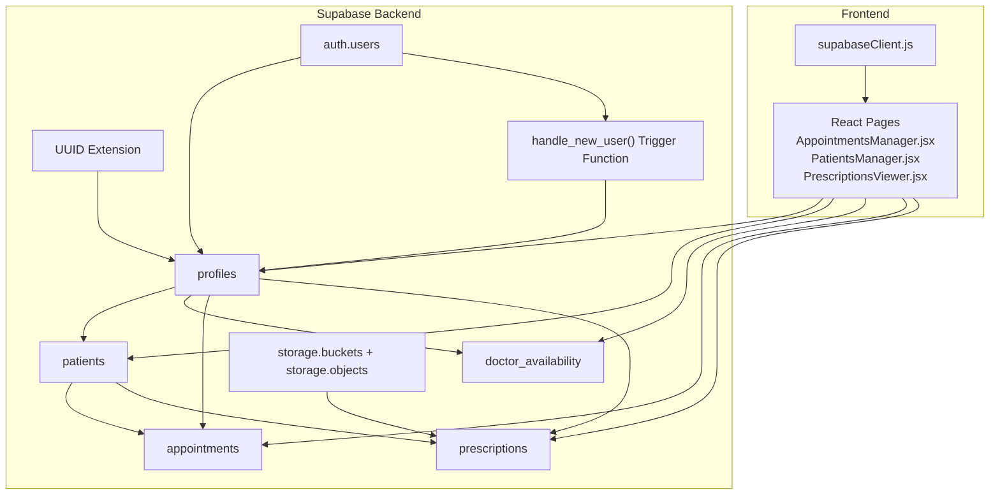
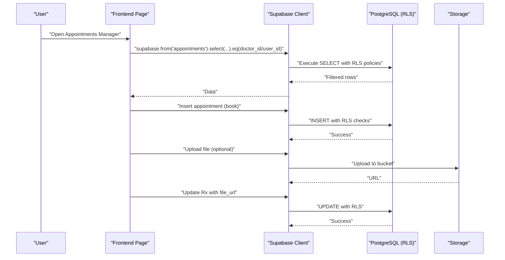
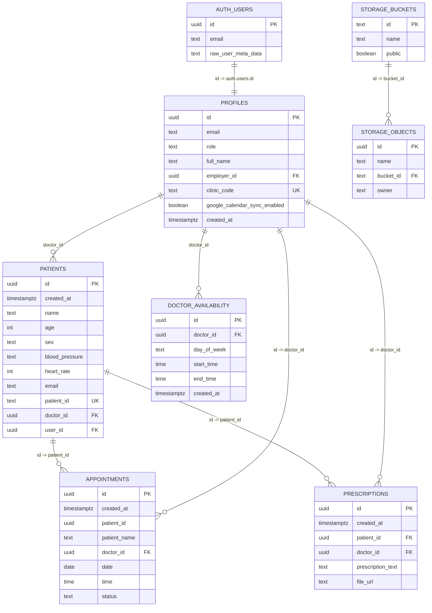
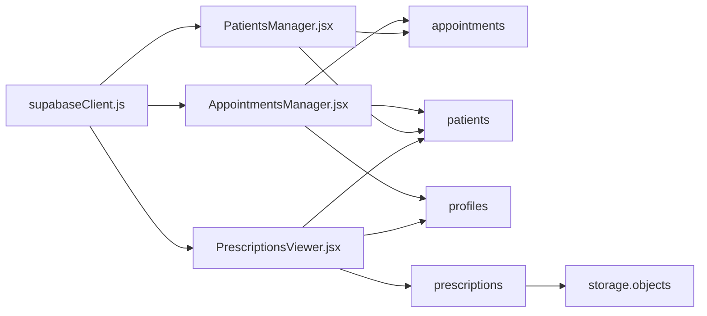

# Database Design

<cite>
**Referenced Files in This Document**
- [schema.sql](file://backend/schema.sql)
- [config.toml](file://supabase/config.toml)
- [SUPABASE_SETUP.md](file://_trash/SUPABASE_SETUP.md)
- [FIX_APPOINTMENTS_FK.sql](file://_trash/FIX_APPOINTMENTS_FK.sql)
- [FIX_DOCTOR_VISIBILITY.sql](file://_trash/FIX_DOCTOR_VISIBILITY.sql)
- [DEBUG_DISABLE_RLS.sql](file://_trash/DEBUG_DISABLE_RLS.sql)
- [AppointmentsManager.jsx](file://frontend/src/pages/AppointmentsManager.jsx)
- [PatientsManager.jsx](file://frontend/src/pages/PatientsManager.jsx)
- [PrescriptionsViewer.jsx](file://frontend/src/pages/PrescriptionsViewer.jsx)
- [supabaseClient.js](file://frontend/src/lib/supabaseClient.js)
</cite>

## Table of Contents
1. [Introduction](#introduction)
2. [Project Structure](#project-structure)
3. [Core Components](#core-components)
4. [Architecture Overview](#architecture-overview)
5. [Detailed Component Analysis](#detailed-component-analysis)
6. [Dependency Analysis](#dependency-analysis)
7. [Performance Considerations](#performance-considerations)
8. [Troubleshooting Guide](#troubleshooting-guide)
9. [Conclusion](#conclusion)
10. [Appendices](#appendices)

## Introduction
This document provides comprehensive database design documentation for MedVita’s PostgreSQL schema implemented on Supabase. It details all entities (profiles, patients, doctor_availability, appointments, prescriptions), their relationships, constraints, indexes, and Row Level Security (RLS) policies. It also explains data access patterns, query optimization strategies, data lifecycle management, backup strategies, and schema migration approaches, with practical examples of common queries and operations.

## Project Structure
The database schema is defined centrally and deployed via Supabase. The frontend interacts with the database through Supabase’s client library, leveraging RLS and real-time subscriptions.

**Diagram sources**
- [schema.sql](file://backend/schema.sql#L1-L274)
- [supabaseClient.js](file://frontend/src/lib/supabaseClient.js#L1-L11)
- [AppointmentsManager.jsx](file://frontend/src/pages/AppointmentsManager.jsx#L1-L200)
- [PatientsManager.jsx](file://frontend/src/pages/PatientsManager.jsx#L1-L200)
- [PrescriptionsViewer.jsx](file://frontend/src/pages/PrescriptionsViewer.jsx#L1-L200)

**Section sources**
- [schema.sql](file://backend/schema.sql#L1-L274)
- [config.toml](file://supabase/config.toml#L1-L385)
- [supabaseClient.js](file://frontend/src/lib/supabaseClient.js#L1-L11)

## Core Components
This section documents each entity, including primary keys, foreign keys, indexes, constraints, and RLS policies.

- Profiles
  - Purpose: Extends Supabase Auth with role-based metadata and clinic code for doctor onboarding.
  - Primary Key: id (UUID, references auth.users on delete cascade).
  - Columns: id, email, role (check constraint: 'doctor','patient','receptionist'), full_name, employer_id (UUID references auth.users), clinic_code (unique), google_calendar_sync_enabled (boolean), created_at.
  - Indexes: None declared; unique constraint on clinic_code.
  - RLS: Enabled; policies allow inserting/updating own profile; selecting profiles is public.

- Patients
  - Purpose: Stores patient demographics and links to a doctor and optional auth user.
  - Primary Key: id (UUID).
  - Columns: id, created_at, name, age, sex, blood_pressure, heart_rate, email, patient_id (unique text), doctor_id (UUID references auth.users), user_id (UUID references auth.users).
  - Indexes: None declared.
  - RLS: Enabled; policies restrict visibility and modifications to owning doctor and receptionists linked to that doctor; patients can view their own records via email.

- Doctor Availability
  - Purpose: Weekly availability slots per doctor.
  - Primary Key: id (UUID).
  - Columns: id, doctor_id (UUID references auth.users), day_of_week, start_time, end_time, created_at.
  - Indexes: None declared.
  - RLS: Enabled; doctors can manage; everyone can view.

- Appointments
  - Purpose: Scheduling records; supports booking by patients and management by doctors; accommodates both auth users and doctor-managed patients.
  - Primary Key: id (UUID).
  - Columns: id, created_at, patient_id (UUID), patient_name (text), doctor_id (UUID references auth.users), date, time, status (check constraint: 'scheduled','completed','cancelled').
  - Constraints: patient_id is intentionally not a foreign key to auth.users or patients to support dual identity; a safety check removes any conflicting FK; patient_name caching is supported.
  - Indexes: None declared.
  - RLS: Enabled; comprehensive policies allow viewing by doctor/patient/doctors-of-managed-patients; insertion by patient/doctor/doctors-of-managed-patients; updates only by doctor.

- Prescriptions
  - Purpose: Digital prescriptions with optional file storage.
  - Primary Key: id (UUID).
  - Columns: id, created_at, patient_id (UUID), doctor_id (UUID references auth.users), prescription_text, file_url.
  - Indexes: None declared.
  - RLS: Enabled; doctors can manage; patients can view their own prescriptions via email or user_id linkage.

- Storage
  - Purpose: File uploads for prescriptions.
  - Bucket: medvita-files (public).
  - Policies: Authenticated users can upload and view files in the bucket.

**Section sources**
- [schema.sql](file://backend/schema.sql#L4-L274)
- [SUPABASE_SETUP.md](file://_trash/SUPABASE_SETUP.md#L1-L194)

## Architecture Overview
The database architecture centers around Supabase’s PostgreSQL with RLS and storage. Frontend pages query tables directly through the Supabase client, applying filters and joins as needed. Triggers auto-create profiles upon user signup.

**Diagram sources**
- [AppointmentsManager.jsx](file://frontend/src/pages/AppointmentsManager.jsx#L67-L118)
- [PrescriptionsViewer.jsx](file://frontend/src/pages/PrescriptionsViewer.jsx#L57-L131)
- [schema.sql](file://backend/schema.sql#L137-L238)

## Detailed Component Analysis

### Entity Relationship Diagram

**Diagram sources**
- [schema.sql](file://backend/schema.sql#L4-L274)

### Profiles
- Purpose: Role-based identity and onboarding for doctors and receptionists.
- Key constraints:
  - role check constraint limits values to 'doctor','patient','receptionist'.
  - employer_id links receptionists to a doctor (clinic hierarchy).
  - clinic_code is unique for doctor onboarding.
- RLS:
  - Insert/update own profile; select is public.
- Triggers:
  - handle_new_user() creates profiles on auth.user creation, honoring role and clinic_code.

**Section sources**
- [schema.sql](file://backend/schema.sql#L4-L274)

### Patients
- Purpose: Demographics and doctor linkage; supports optional direct user linkage.
- Key constraints:
  - Unique patient_id generated with prefix and random suffix.
  - doctor_id required; optional user_id for direct auth linkage.
- RLS:
  - Doctors can view/manage own patients; receptionists can view/manage patients linked to their employer doctor; patients can view own record via email.

**Section sources**
- [schema.sql](file://backend/schema.sql#L45-L116)

### Doctor Availability
- Purpose: Weekly schedule configuration per doctor.
- RLS:
  - Doctors can manage; select is public.

**Section sources**
- [schema.sql](file://backend/schema.sql#L117-L136)

### Appointments
- Purpose: Scheduling with flexible patient identity (auth user or doctor-managed patient).
- Key constraints:
  - patient_id intentionally not a foreign key to support dual identity; safety checks remove conflicting FKs; patient_name caching supported.
  - status check constraint limits values to 'scheduled','completed','cancelled'.
- RLS:
  - Select: doctor, patient, or doctor of managed patient; Insert: patient, doctor, or doctor of managed patient; Update: doctor only.

**Section sources**
- [schema.sql](file://backend/schema.sql#L137-L200)
- [FIX_APPOINTMENTS_FK.sql](file://_trash/FIX_APPOINTMENTS_FK.sql#L1-L22)
- [FIX_DOCTOR_VISIBILITY.sql](file://_trash/FIX_DOCTOR_VISIBILITY.sql#L1-L63)

### Prescriptions
- Purpose: Digital prescriptions with optional file URL.
- RLS:
  - Doctors can manage; patients can view their own prescriptions via email or user_id linkage.

**Section sources**
- [schema.sql](file://backend/schema.sql#L200-L225)

### Storage
- Purpose: File uploads for prescriptions.
- Policies:
  - Authenticated users can upload and view files in bucket 'medvita-files'.

**Section sources**
- [schema.sql](file://backend/schema.sql#L226-L238)

## Dependency Analysis
- Supabase client dependency:
  - Frontend pages import the Supabase client and perform queries against tables.
- Internal dependencies:
  - Appointments rely on Patients and Profiles for identity resolution.
  - Prescriptions rely on Patients and Profiles for doctor/patient linkage.
  - Storage depends on bucket policies for access control.

**Diagram sources**
- [supabaseClient.js](file://frontend/src/lib/supabaseClient.js#L1-L11)
- [AppointmentsManager.jsx](file://frontend/src/pages/AppointmentsManager.jsx#L1-L200)
- [PatientsManager.jsx](file://frontend/src/pages/PatientsManager.jsx#L1-L200)
- [PrescriptionsViewer.jsx](file://frontend/src/pages/PrescriptionsViewer.jsx#L1-L200)

**Section sources**
- [supabaseClient.js](file://frontend/src/lib/supabaseClient.js#L1-L11)
- [AppointmentsManager.jsx](file://frontend/src/pages/AppointmentsManager.jsx#L1-L200)
- [PatientsManager.jsx](file://frontend/src/pages/PatientsManager.jsx#L1-L200)
- [PrescriptionsViewer.jsx](file://frontend/src/pages/PrescriptionsViewer.jsx#L1-L200)

## Performance Considerations
- Indexes
  - No explicit indexes are defined in the schema. Consider adding indexes on frequently filtered columns:
    - patients(doctor_id), patients(email), patients(patient_id)
    - appointments(doctor_id), appointments(patient_id), appointments(date,time,status)
    - prescriptions(doctor_id), prescriptions(patient_id)
    - profiles(role), profiles(clinic_code), profiles(employer_id)
- Query patterns
  - Frontend commonly filters by doctor_id or patient_id and orders by created_at/date/time. Adding composite indexes on (doctor_id, created_at) and (patient_id, created_at) can improve performance.
- RLS overhead
  - RLS adds minimal overhead; ensure policies remain selective to avoid scanning entire tables.
- Real-time subscriptions
  - Frontend uses real-time channels on patients and profiles; ensure appropriate filters to minimize payload.
- Storage
  - Limit file sizes and use bucket policies to prevent abuse.

[No sources needed since this section provides general guidance]

## Troubleshooting Guide
- Appointments visibility issues
  - Use the debug script to temporarily disable RLS and verify data presence.
  - Reapply comprehensive policies to ensure doctors, patients, and doctors-of-managed-patients can view.
- Appointments foreign key constraint
  - Remove conflicting FK constraints and ensure patient_name column exists for caching.
- Profiles auto-creation
  - Ensure the trigger handle_new_user() exists and runs after auth.user creation.

**Section sources**
- [DEBUG_DISABLE_RLS.sql](file://_trash/DEBUG_DISABLE_RLS.sql#L1-L9)
- [FIX_DOCTOR_VISIBILITY.sql](file://_trash/FIX_DOCTOR_VISIBILITY.sql#L1-L63)
- [FIX_APPOINTMENTS_FK.sql](file://_trash/FIX_APPOINTMENTS_FK.sql#L1-L22)
- [schema.sql](file://backend/schema.sql#L239-L274)

## Conclusion
MedVita’s database design leverages Supabase’s PostgreSQL with robust RLS policies to enforce role-based access across profiles, patients, doctor availability, appointments, and prescriptions. The schema supports flexible patient identity, real-time subscriptions, and secure file storage. By adding targeted indexes and maintaining concise RLS policies, the system can achieve strong performance and clear data isolation.

[No sources needed since this section summarizes without analyzing specific files]

## Appendices

### Practical Query Examples
- Fetch doctor’s patients for today
  - Example path: [PatientsManager.jsx](file://frontend/src/pages/PatientsManager.jsx#L56-L111)
- Book an appointment
  - Example path: [AppointmentsManager.jsx](file://frontend/src/pages/AppointmentsManager.jsx#L134-L180)
- View doctor’s prescriptions
  - Example path: [PrescriptionsViewer.jsx](file://frontend/src/pages/PrescriptionsViewer.jsx#L63-L93)
- View patient’s prescriptions
  - Example path: [PrescriptionsViewer.jsx](file://frontend/src/pages/PrescriptionsViewer.jsx#L94-L131)

### Data Lifecycle and Backup Strategies
- Migrations
  - Use Supabase CLI to apply schema.sql and manage migrations.
  - Seed data via seed.sql if enabled.
- Backups
  - Use Supabase project snapshots for point-in-time recovery.
- Monitoring
  - Enable logging and alerts for critical operations.

**Section sources**
- [config.toml](file://supabase/config.toml#L53-L65)

### Schema Migration Approaches
- Incremental changes
  - Add columns with default values and conditional migrations (as seen in profiles and patients).
- Policy updates
  - Drop and recreate policies to resolve conflicts (as seen in appointments).
- Trigger maintenance
  - Ensure handle_new_user() remains aligned with schema changes.

**Section sources**
- [schema.sql](file://backend/schema.sql#L16-L28)
- [schema.sql](file://backend/schema.sql#L60-L69)
- [schema.sql](file://backend/schema.sql#L149-L167)
- [schema.sql](file://backend/schema.sql#L239-L274)