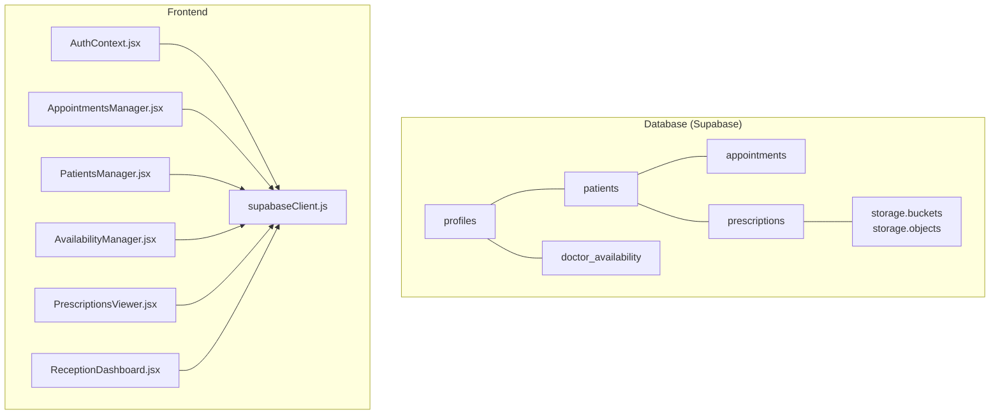
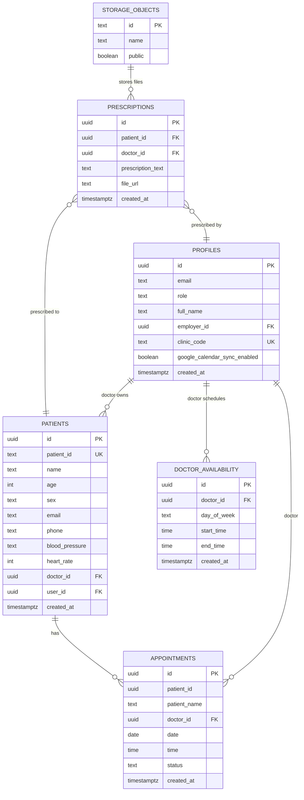
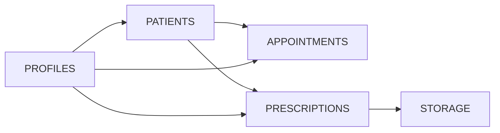
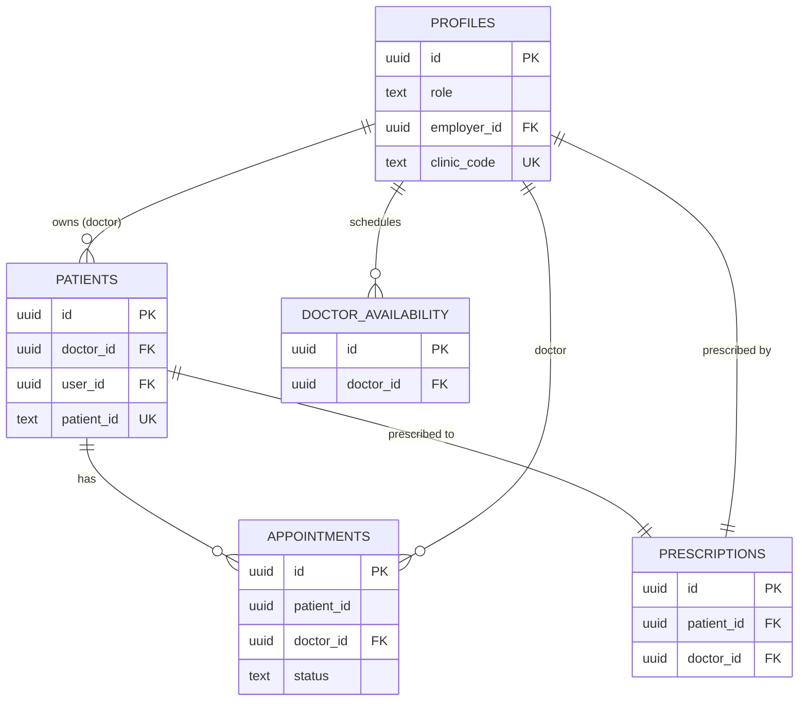

# Entity Relationships

<cite>
**Referenced Files in This Document**
- [schema.sql](file://backend/schema.sql)
- [AppointmentsManager.jsx](file://frontend/src/pages/AppointmentsManager.jsx)
- [PatientsManager.jsx](file://frontend/src/pages/PatientsManager.jsx)
- [AvailabilityManager.jsx](file://frontend/src/pages/AvailabilityManager.jsx)
- [PrescriptionsViewer.jsx](file://frontend/src/pages/PrescriptionsViewer.jsx)
- [ReceptionDashboard.jsx](file://frontend/src/pages/ReceptionDashboard.jsx)
- [AuthContext.jsx](file://frontend/src/context/AuthContext.jsx)
- [supabaseClient.js](file://frontend/src/lib/supabaseClient.js)
- [FIX_APPOINTMENTS_FK.sql](file://_trash/FIX_APPOINTMENTS_FK.sql)
- [FIX_DOCTOR_VISIBILITY.sql](file://_trash/FIX_DOCTOR_VISIBILITY.sql)
- [SUPABASE_SETUP.md](file://_trash/SUPABASE_SETUP.md)
</cite>

## Table of Contents
1. [Introduction](#introduction)
2. [Project Structure](#project-structure)
3. [Core Components](#core-components)
4. [Architecture Overview](#architecture-overview)
5. [Detailed Component Analysis](#detailed-component-analysis)
6. [Dependency Analysis](#dependency-analysis)
7. [Performance Considerations](#performance-considerations)
8. [Troubleshooting Guide](#troubleshooting-guide)
9. [Conclusion](#conclusion)
10. [Appendices](#appendices)

## Introduction
This document provides comprehensive entity relationship documentation for MedVita’s database schema. It details all table relationships among profiles, patients, appointments, prescriptions, and doctor_availability, including primary keys, foreign keys, referential integrity rules, and Row Level Security (RLS) policies. It explains how the multi-role system (doctor, patient, receptionist) affects data access patterns and describes the patient-doctor relationship, receptionist-employer relationship, and appointment-patient linkage mechanisms. Practical examples of common JOIN operations and query patterns used in the application are included.

## Project Structure
The database schema is defined in a single SQL file and is consumed by the frontend through Supabase client libraries. The frontend components demonstrate real-world usage of these relationships in queries and joins.

**Diagram sources**
- [schema.sql](file://backend/schema.sql#L4-L274)
- [supabaseClient.js](file://frontend/src/lib/supabaseClient.js#L1-L11)
- [AuthContext.jsx](file://frontend/src/context/AuthContext.jsx#L1-L108)
- [AppointmentsManager.jsx](file://frontend/src/pages/AppointmentsManager.jsx#L1-L577)
- [PatientsManager.jsx](file://frontend/src/pages/PatientsManager.jsx#L1-L667)
- [AvailabilityManager.jsx](file://frontend/src/pages/AvailabilityManager.jsx#L1-L165)
- [PrescriptionsViewer.jsx](file://frontend/src/pages/PrescriptionsViewer.jsx#L1-L131)
- [ReceptionDashboard.jsx](file://frontend/src/pages/ReceptionDashboard.jsx#L1-L455)

**Section sources**
- [schema.sql](file://backend/schema.sql#L1-L274)
- [supabaseClient.js](file://frontend/src/lib/supabaseClient.js#L1-L11)

## Core Components
- profiles: Extends Supabase Auth users; stores role, employer_id for receptionists, clinic_code for doctors, and sync preferences.
- patients: Doctor-owned patient records with vitals and optional direct user link.
- doctor_availability: Weekly schedule per doctor.
- appointments: Scheduled meetings with flexible patient linkage and status tracking.
- prescriptions: Medical documents linked to patients and doctors, with optional file storage.

**Section sources**
- [schema.sql](file://backend/schema.sql#L4-L274)

## Architecture Overview
The system enforces multi-role access via Supabase RLS policies and uses Supabase client libraries for secure CRUD operations. The frontend composes queries and joins to present role-appropriate views.

**Diagram sources**
- [schema.sql](file://backend/schema.sql#L4-L274)

## Detailed Component Analysis

### Profiles Table
- Purpose: Extends Supabase Auth users with role and organizational metadata.
- Primary key: id (UUID, references auth.users).
- Foreign keys:
  - employer_id references auth.users (for receptionists linking to a doctor).
- Unique constraints:
  - clinic_code (for doctor invitation code).
- RLS policies:
  - Selectable by everyone.
  - Insert/update/delete restricted to the user themselves.

Access patterns:
- Receptionists link to a doctor via clinic_code during sign-up; employer_id is populated by a database trigger.
- Doctors can generate a clinic_code for receptionist onboarding.

**Section sources**
- [schema.sql](file://backend/schema.sql#L4-L31)
- [schema.sql](file://backend/schema.sql#L240-L274)

### Patients Table
- Purpose: Stores doctor-owned patient records with optional vitals and direct user link.
- Primary key: id (UUID).
- Foreign keys:
  - doctor_id references auth.users (owner/attending physician).
  - user_id references auth.users (optional direct link to authenticated user).
- Unique constraints:
  - patient_id (auto-generated display ID).
- RLS policies:
  - Doctors can view/update/delete their own patients.
  - Receptionists can view/edit patients under their employer’s doctor.
  - Patients can view their own record by email.

Access patterns:
- Receptionists add walk-in patients to the employer’s queue; doctor_id is set to employer_id.
- Frontend queries patients filtered by doctor_id for receptionist dashboards.

**Section sources**
- [schema.sql](file://backend/schema.sql#L45-L116)
- [ReceptionDashboard.jsx](file://frontend/src/pages/ReceptionDashboard.jsx#L47-L69)

### Doctor Availability Table
- Purpose: Defines weekly working hours per doctor.
- Primary key: id (UUID).
- Foreign key:
  - doctor_id references auth.users.
- RLS policies:
  - Doctors can manage their own availability.
  - Everyone can view availability.

Access patterns:
- Frontend fetches availability by doctor_id and performs upserts per day.

**Section sources**
- [schema.sql](file://backend/schema.sql#L117-L136)
- [AvailabilityManager.jsx](file://frontend/src/pages/AvailabilityManager.jsx#L20-L44)

### Appointments Table
- Purpose: Schedules consultations with flexible patient linkage and status tracking.
- Primary key: id (UUID).
- Columns:
  - patient_id: can be either a registered user UUID or a doctor-managed patient UUID.
  - patient_name: cached display name.
  - doctor_id: references auth.users.
  - date/time/status: scheduling metadata.
- RLS policies:
  - Select: doctor, patient, or doctor of managed patient.
  - Insert: patient, doctor, or doctor of managed patient.
  - Update: only doctor.

Foreign key constraints:
- doctor_id references auth.users.
- patient_id intentionally does not have a foreign key to support dual linkage (registered user or doctor-managed patient).

Fixes and notes:
- A prior foreign key constraint on patient_id was removed to accommodate dual linkage.
- Additional scripts ensure presence of patient_name and correct doctor_id FK.

**Section sources**
- [schema.sql](file://backend/schema.sql#L137-L199)
- [FIX_APPOINTMENTS_FK.sql](file://_trash/FIX_APPOINTMENTS_FK.sql#L1-L21)
- [FIX_DOCTOR_VISIBILITY.sql](file://_trash/FIX_DOCTOR_VISIBILITY.sql#L1-L62)
- [AppointmentsManager.jsx](file://frontend/src/pages/AppointmentsManager.jsx#L67-L118)

### Prescriptions Table
- Purpose: Stores medical documents linked to patients and doctors, with optional file URL.
- Primary key: id (UUID).
- Foreign keys:
  - patient_id references patients.id.
  - doctor_id references auth.users.
- RLS policies:
  - Doctors can manage prescriptions.
  - Patients can view their own prescriptions via a join with patients.

Storage:
- File URLs reference Supabase Storage bucket medvita-files.

**Section sources**
- [schema.sql](file://backend/schema.sql#L200-L225)
- [PrescriptionsViewer.jsx](file://frontend/src/pages/PrescriptionsViewer.jsx#L81-L131)

### Multi-Role System and Access Patterns
- Doctor:
  - Owns patients (doctor_id).
  - Manages availability and appointments.
  - Creates and manages prescriptions.
- Patient:
  - Can view their own record and prescriptions.
  - Books appointments via patient_id linkage.
- Receptionist:
  - Links to a doctor via clinic_code during sign-up.
  - Adds walk-in patients to the employer’s queue (doctor_id = employer_id).
  - Cannot directly manage patients; access is mediated by doctor ownership.

**Section sources**
- [schema.sql](file://backend/schema.sql#L4-L14)
- [schema.sql](file://backend/schema.sql#L45-L116)
- [schema.sql](file://backend/schema.sql#L117-L136)
- [schema.sql](file://backend/schema.sql#L200-L225)
- [ReceptionDashboard.jsx](file://frontend/src/pages/ReceptionDashboard.jsx#L47-L69)
- [AuthContext.jsx](file://frontend/src/context/AuthContext.jsx#L43-L61)

### Appointment-Patient Linkage Mechanisms
- Dual linkage:
  - patient_id can be a registered user UUID (auth.users.id).
  - patient_id can be a doctor-managed patient UUID (patients.id).
- Frontend logic:
  - AppointmentsManager fetches appointments and enriches missing names by joining patients and profiles.
  - RLS allows doctors to view appointments of their managed patients indirectly.

**Section sources**
- [schema.sql](file://backend/schema.sql#L137-L199)
- [AppointmentsManager.jsx](file://frontend/src/pages/AppointmentsManager.jsx#L67-L118)

### Practical JOIN Operations and Query Patterns
Common patterns observed in the frontend:

- Prescriptions with doctor profile:
  - Join prescriptions with profiles on doctor_id to display doctor full_name.
  - Filter by patient_id and optionally by patient email/user_id.

- Appointments with patient/profile enrichment:
  - Fetch appointments and enrich patient_name by joining patients or profiles.
  - Filter by doctor_id or patient_id depending on role.

- Patients with prescriptions:
  - Fetch patients and annotate whether they had prescriptions created today by joining prescriptions.

- Receptionist queue:
  - Fetch patients filtered by doctor_id (employer_id) and created_at date range.

- Availability:
  - Upsert doctor_availability rows per day for a given doctor.

These patterns reflect the multi-role access and dual linkage design.

**Section sources**
- [PrescriptionsViewer.jsx](file://frontend/src/pages/PrescriptionsViewer.jsx#L81-L131)
- [AppointmentsManager.jsx](file://frontend/src/pages/AppointmentsManager.jsx#L67-L118)
- [PatientsManager.jsx](file://frontend/src/pages/PatientsManager.jsx#L56-L111)
- [ReceptionDashboard.jsx](file://frontend/src/pages/ReceptionDashboard.jsx#L47-L69)
- [AvailabilityManager.jsx](file://frontend/src/pages/AvailabilityManager.jsx#L53-L93)

## Dependency Analysis
- Profiles drive multi-role access and employer relationships.
- Patients depend on profiles (doctor ownership) and are central to appointments and prescriptions.
- Appointments depend on patients (dual linkage) and profiles (doctor).
- Prescriptions depend on patients and profiles (doctor).
- Storage integrates with prescriptions via file_url.

**Diagram sources**
- [schema.sql](file://backend/schema.sql#L4-L274)

**Section sources**
- [schema.sql](file://backend/schema.sql#L4-L274)

## Performance Considerations
- Indexing recommendations (conceptual):
  - Add indexes on frequently queried columns: patients(doctor_id), appointments(doctor_id, patient_id, date), prescriptions(patient_id, doctor_id).
  - Consider partial indexes for RLS-filtered queries (e.g., doctor_id = auth.uid()).
- Query optimization tips:
  - Prefer targeted selects with filters to minimize payload.
  - Use pagination for large lists (e.g., patients, prescriptions).
  - Batch upserts for availability to reduce round-trips.

[No sources needed since this section provides general guidance]

## Troubleshooting Guide
Common issues and resolutions:

- Appointment booking fails due to foreign key constraint:
  - Cause: patient_id can be either a registered user UUID or a doctor-managed patient UUID.
  - Resolution: Remove conflicting foreign key and ensure patient_name column exists.

- Appointments not visible to doctors:
  - Cause: RLS policies restrict visibility.
  - Resolution: Ensure SELECT policy allows doctor to view appointments of managed patients.

- Receptionist cannot add walk-in patients:
  - Cause: employer_id is null (invalid clinic code).
  - Resolution: Verify clinic_code and re-link receptionist profile.

- Prescription file uploads failing:
  - Cause: Storage bucket or policies misconfiguration.
  - Resolution: Confirm medvita-files bucket exists and authenticated user policies are enabled.

**Section sources**
- [FIX_APPOINTMENTS_FK.sql](file://_trash/FIX_APPOINTMENTS_FK.sql#L1-L21)
- [FIX_DOCTOR_VISIBILITY.sql](file://_trash/FIX_DOCTOR_VISIBILITY.sql#L1-L62)
- [ReceptionDashboard.jsx](file://frontend/src/pages/ReceptionDashboard.jsx#L124-L141)
- [schema.sql](file://backend/schema.sql#L226-L237)

## Conclusion
MedVita’s schema cleanly models a multi-role healthcare ecosystem with flexible appointment linkage and strong access controls via RLS. The relationships emphasize doctor ownership of patients and prescriptions, receptionist support through employer-linked queues, and doctor-controlled availability. The frontend demonstrates robust query patterns that respect role boundaries and dual appointment linkage, ensuring secure and efficient data access across roles.

[No sources needed since this section summarizes without analyzing specific files]

## Appendices

### Entity Relationship Diagram with Cardinality and Participation

**Diagram sources**
- [schema.sql](file://backend/schema.sql#L4-L274)

### Example Query Patterns (paths)
- Prescriptions with doctor profile:
  - [PrescriptionsViewer.jsx](file://frontend/src/pages/PrescriptionsViewer.jsx#L110-L120)
- Appointments enrichment:
  - [AppointmentsManager.jsx](file://frontend/src/pages/AppointmentsManager.jsx#L89-L110)
- Patients with prescriptions annotation:
  - [PatientsManager.jsx](file://frontend/src/pages/PatientsManager.jsx#L82-L101)
- Receptionist queue:
  - [ReceptionDashboard.jsx](file://frontend/src/pages/ReceptionDashboard.jsx#L47-L69)
- Availability upsert:
  - [AvailabilityManager.jsx](file://frontend/src/pages/AvailabilityManager.jsx#L53-L93)