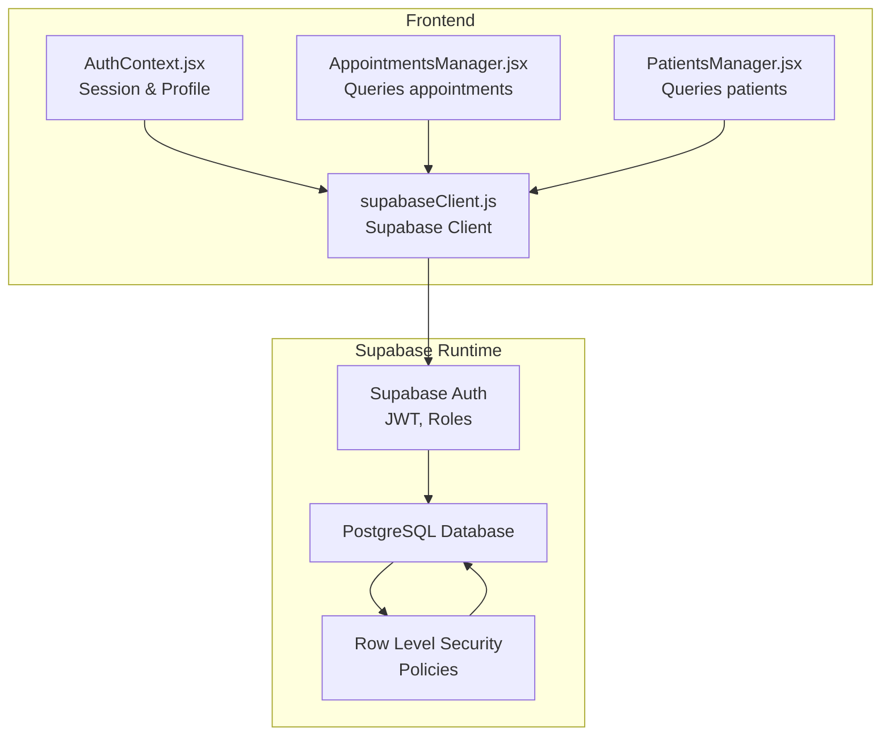
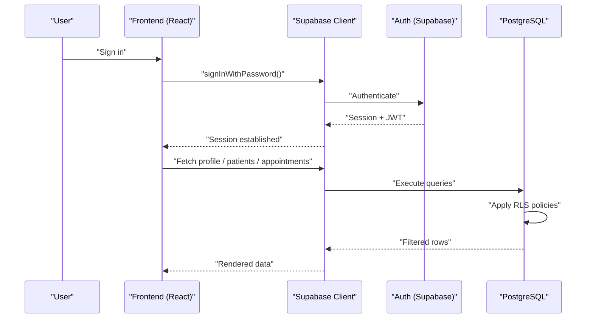
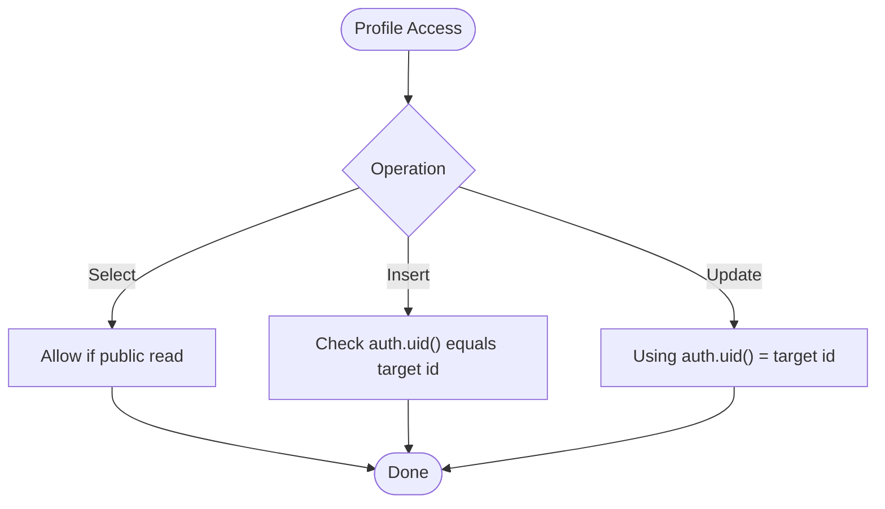
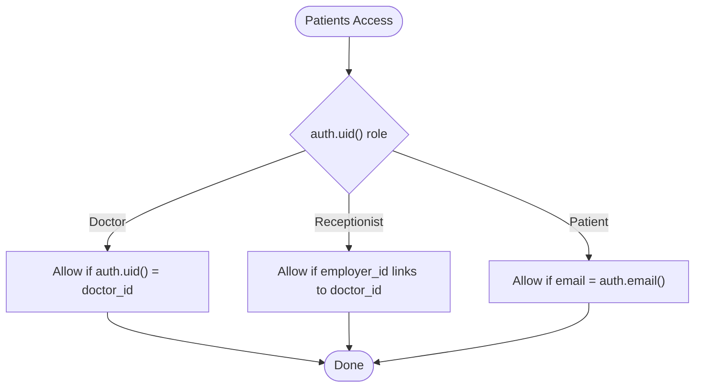
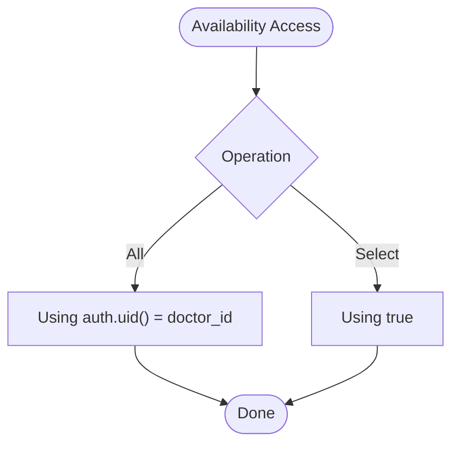
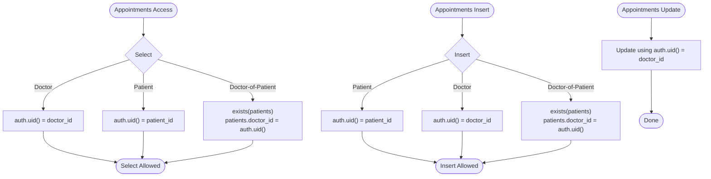
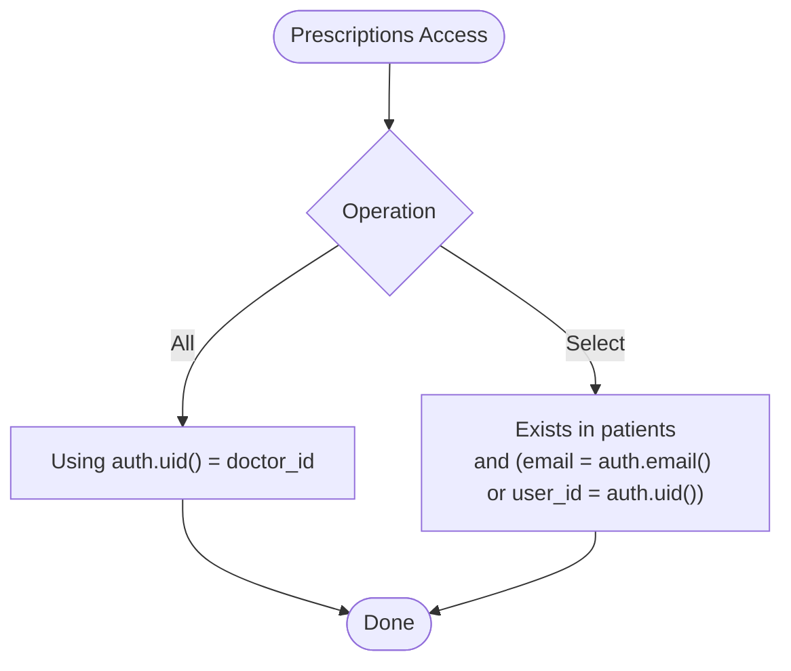
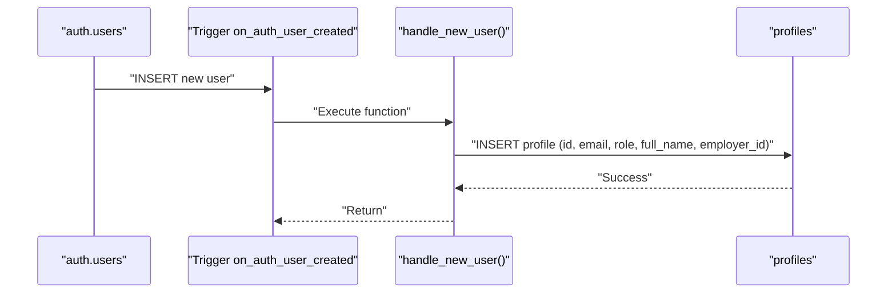
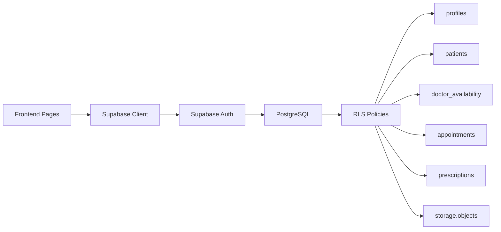
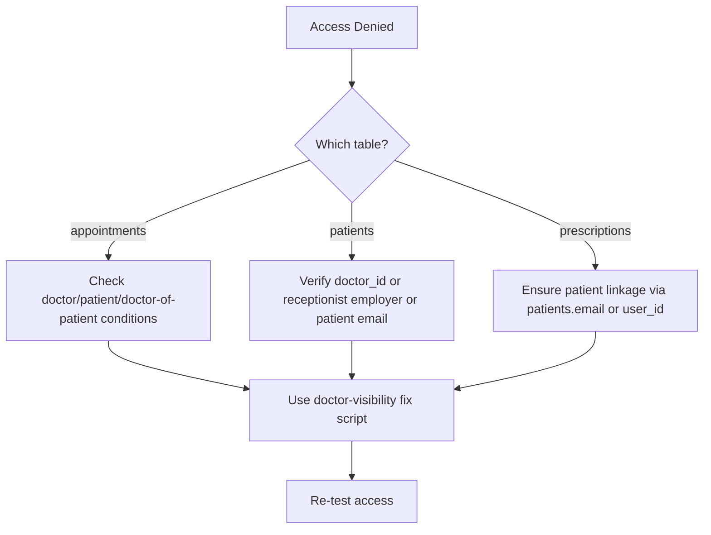

# Row Level Security Policies

<cite>
**Referenced Files in This Document**
- [schema.sql](file://backend/schema.sql)
- [DEBUG_DISABLE_RLS.sql](file://_trash/DEBUG_DISABLE_RLS.sql)
- [FIX_DOCTOR_VISIBILITY.sql](file://_trash/FIX_DOCTOR_VISIBILITY.sql)
- [FIX_APPOINTMENTS_FK.sql](file://_trash/FIX_APPOINTMENTS_FK.sql)
- [SUPABASE_SETUP.md](file://_trash/SUPABASE_SETUP.md)
- [AuthContext.jsx](file://frontend/src/context/AuthContext.jsx)
- [supabaseClient.js](file://frontend/src/lib/supabaseClient.js)
- [AppointmentsManager.jsx](file://frontend/src/pages/AppointmentsManager.jsx)
- [PatientsManager.jsx](file://frontend/src/pages/PatientsManager.jsx)
- [config.toml](file://supabase/config.toml)
</cite>

## Table of Contents
1. [Introduction](#introduction)
2. [Project Structure](#project-structure)
3. [Core Components](#core-components)
4. [Architecture Overview](#architecture-overview)
5. [Detailed Component Analysis](#detailed-component-analysis)
6. [Dependency Analysis](#dependency-analysis)
7. [Performance Considerations](#performance-considerations)
8. [Troubleshooting Guide](#troubleshooting-guide)
9. [Conclusion](#conclusion)

## Introduction
This document explains MedVita’s Row Level Security (RLS) implementation across key tables: profiles, patients, doctor_availability, appointments, and prescriptions. It details the policies, role-based access controls, and data isolation mechanisms. It also covers the auto-generated profile creation trigger, authentication and authorization logic, and practical troubleshooting guidance for common RLS conflicts and access-denied scenarios.

## Project Structure
The RLS policies are defined in the backend schema and enforced by Supabase. The frontend interacts with Supabase to authenticate users and query protected data. The Supabase configuration defines service-level behavior such as auth and limits.

**Diagram sources**
- [AuthContext.jsx](file://frontend/src/context/AuthContext.jsx#L1-L108)
- [supabaseClient.js](file://frontend/src/lib/supabaseClient.js#L1-L11)
- [AppointmentsManager.jsx](file://frontend/src/pages/AppointmentsManager.jsx#L1-L577)
- [PatientsManager.jsx](file://frontend/src/pages/PatientsManager.jsx#L1-L667)
- [config.toml](file://supabase/config.toml#L146-L324)

**Section sources**
- [schema.sql](file://backend/schema.sql#L1-L274)
- [config.toml](file://supabase/config.toml#L146-L324)

## Core Components
- Profiles table: Extends Supabase Auth with role-based metadata and enforces profile privacy and ownership.
- Patients table: Doctor-centric data with receptionist visibility via employer relationship; patient self-service via email.
- Doctor availability: Doctor-owned records with public read.
- Appointments: Multi-role access with cross-table joins for doctor-of-patient visibility; strict write controls.
- Prescriptions: Doctor-owned with patient-view access via patient linkage.
- Storage: Bucket-level policies for authenticated uploads/views.
- Auto-profile creation: Trigger on auth user creation to bootstrap profiles with role and optional employer linkage.

**Section sources**
- [schema.sql](file://backend/schema.sql#L4-L14)
- [schema.sql](file://backend/schema.sql#L45-L115)
- [schema.sql](file://backend/schema.sql#L117-L135)
- [schema.sql](file://backend/schema.sql#L137-L208)
- [schema.sql](file://backend/schema.sql#L226-L237)
- [schema.sql](file://backend/schema.sql#L239-L274)

## Architecture Overview
The frontend authenticates via Supabase Auth and queries Supabase SQL/functions. Supabase enforces RLS policies server-side. The auto-generated profile ensures every user has a profile record for role-aware UI and DB access.

**Diagram sources**
- [AuthContext.jsx](file://frontend/src/context/AuthContext.jsx#L84-L90)
- [supabaseClient.js](file://frontend/src/lib/supabaseClient.js#L1-L11)
- [schema.sql](file://backend/schema.sql#L30-L43)
- [schema.sql](file://backend/schema.sql#L71-L115)
- [schema.sql](file://backend/schema.sql#L158-L208)

## Detailed Component Analysis

### Profiles Table
- Purpose: Extend auth.users with role, employer linkage, and clinic code for receptionists.
- RLS policies:
  - Select: Public read.
  - Insert: Own profile only.
  - Update: Own profile only.
- Security implications: Prevents unauthorized profile tampering; ensures ownership semantics.

**Diagram sources**
- [schema.sql](file://backend/schema.sql#L30-L43)

**Section sources**
- [schema.sql](file://backend/schema.sql#L4-L14)
- [schema.sql](file://backend/schema.sql#L30-L43)

### Patients Table
- Ownership: doctor_id ties records to a doctor.
- RLS policies:
  - Select: Doctor owns; receptionist can view employer’s patients; patient can view own via email.
  - Insert: Doctor or receptionist for employer; with-check enforces doctor_id.
  - Update/Delete: Doctor owns.
- Security implications: Strong separation of duties; receptionists act on behalf of a doctor; patients see only their own record.

**Diagram sources**
- [schema.sql](file://backend/schema.sql#L71-L115)

**Section sources**
- [schema.sql](file://backend/schema.sql#L45-L115)

### Doctor Availability Table
- Ownership: doctor_id.
- RLS policies:
  - All operations: Doctor-owned.
  - Select: Public read.
- Security implications: Doctors control their availability; public visibility for scheduling.

**Diagram sources**
- [schema.sql](file://backend/schema.sql#L117-L135)

**Section sources**
- [schema.sql](file://backend/schema.sql#L117-L135)

### Appointments Table
- Ownership: doctor_id and patient_id (patient may be auth.users id or patients.id).
- RLS policies:
  - Select: Doctor owns; patient owns; or doctor-of-patient via patients join.
  - Insert: Patient or doctor; or doctor-of-patient via patients join.
  - Update: Doctor-owned (status updates).
- Security implications: Ensures patients, doctors, and doctor-of-patient can view; only doctors can update; prevents unauthorized writes.

**Diagram sources**
- [schema.sql](file://backend/schema.sql#L137-L208)

**Section sources**
- [schema.sql](file://backend/schema.sql#L137-L208)
- [FIX_DOCTOR_VISIBILITY.sql](file://_trash/FIX_DOCTOR_VISIBILITY.sql#L1-L63)
- [FIX_APPOINTMENTS_FK.sql](file://_trash/FIX_APPOINTMENTS_FK.sql#L1-L22)

### Prescriptions Table
- Ownership: doctor_id; patient access via patient linkage.
- RLS policies:
  - All: Doctor-owned.
  - Select: Exists in patients where patient belongs to requesting user (email or user_id).
- Security implications: Prescriptions remain doctor-controlled; patients can view only their own.

**Diagram sources**
- [schema.sql](file://backend/schema.sql#L200-L224)

**Section sources**
- [schema.sql](file://backend/schema.sql#L200-L224)

### Storage (Bucket-level)
- Bucket: medvita-files (public).
- Policies:
  - Insert: Authenticated user and bucket_id.
  - Select: Authenticated user and bucket_id.
- Security implications: Files are publicly accessible via the bucket; access controlled by authenticated session.

**Section sources**
- [schema.sql](file://backend/schema.sql#L226-L237)

### Auto-Generated Profile Creation Trigger
- Trigger: on_auth_user_created after insert on auth.users.
- Behavior: Creates profile with role from raw_user_meta_data; receptionists may include clinic_code to link to a doctor via employer_id.
- Security considerations:
  - Uses security definer function to ensure execution with database privileges.
  - Prevents race conditions by relying on auth metadata rather than immediate frontend inserts.
  - Validates role and optional clinic_code to derive employer_id.

**Diagram sources**
- [schema.sql](file://backend/schema.sql#L239-L274)

**Section sources**
- [schema.sql](file://backend/schema.sql#L239-L274)
- [SUPABASE_SETUP.md](file://_trash/SUPABASE_SETUP.md#L165-L183)

## Dependency Analysis
- Frontend depends on Supabase client for auth and queries.
- Supabase enforces RLS policies server-side.
- Appointments references patients indirectly via patient_id; a standard FK cannot span two tables, so policies rely on existence checks rather than referential integrity.
- Doctor visibility fix ensures consistent SELECT/INSERT/UPDATE policies and optional FK enforcement.

**Diagram sources**
- [AppointmentsManager.jsx](file://frontend/src/pages/AppointmentsManager.jsx#L67-L118)
- [PatientsManager.jsx](file://frontend/src/pages/PatientsManager.jsx#L56-L111)
- [schema.sql](file://backend/schema.sql#L30-L43)
- [schema.sql](file://backend/schema.sql#L71-L115)
- [schema.sql](file://backend/schema.sql#L117-L135)
- [schema.sql](file://backend/schema.sql#L158-L208)
- [schema.sql](file://backend/schema.sql#L200-L224)
- [schema.sql](file://backend/schema.sql#L226-L237)

**Section sources**
- [AppointmentsManager.jsx](file://frontend/src/pages/AppointmentsManager.jsx#L67-L118)
- [PatientsManager.jsx](file://frontend/src/pages/PatientsManager.jsx#L56-L111)
- [schema.sql](file://backend/schema.sql#L137-L208)
- [FIX_APPOINTMENTS_FK.sql](file://_trash/FIX_APPOINTMENTS_FK.sql#L1-L22)

## Performance Considerations
- RLS adds minimal overhead; keep filters selective (e.g., auth.uid() equality) to leverage indexes.
- Appointments queries should include doctor_id or patient_id filters to reduce scans.
- Consider adding indexes on frequently filtered columns (e.g., patients(doctor_id), appointments(doctor_id, patient_id)) if not present by default.

## Troubleshooting Guide
Common symptoms and resolutions:
- Access Denied (403-like behavior):
  - Verify the active session and that auth.uid() matches expected ownership.
  - Confirm the user’s role and profile metadata (especially receptionist employer linkage).
- Appointments not visible:
  - Ensure the user is either the doctor, the patient, or the doctor-of-patient via patients join.
  - Use the doctor-visibility fix script to normalize policies and optionally enforce FK to profiles.
- Debugging RLS:
  - Temporarily disable RLS on appointments to verify data presence, then re-enable and inspect policies.
- Conflicts or regressions:
  - Drop conflicting legacy policies and recreate normalized ones as shown in the doctor-visibility fix script.
- Appointments FK anomalies:
  - patient_id can be either auth.users.id or patients.id; standard FKs cannot span tables. Use existence checks in policies and ensure patient_name caching where needed.

**Section sources**
- [DEBUG_DISABLE_RLS.sql](file://_trash/DEBUG_DISABLE_RLS.sql#L1-L9)
- [FIX_DOCTOR_VISIBILITY.sql](file://_trash/FIX_DOCTOR_VISIBILITY.sql#L1-L63)
- [FIX_APPOINTMENTS_FK.sql](file://_trash/FIX_APPOINTMENTS_FK.sql#L1-L22)

## Conclusion
MedVita’s RLS enforces strong, role-based data isolation across profiles, patients, availability, appointments, and prescriptions. The auto-generated profile trigger ensures consistent identity and role propagation. The frontend leverages Supabase Auth and RLS to deliver secure, real-time experiences. Use the provided scripts and troubleshooting steps to maintain policy correctness and resolve visibility/access issues.