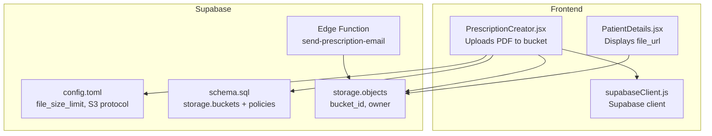
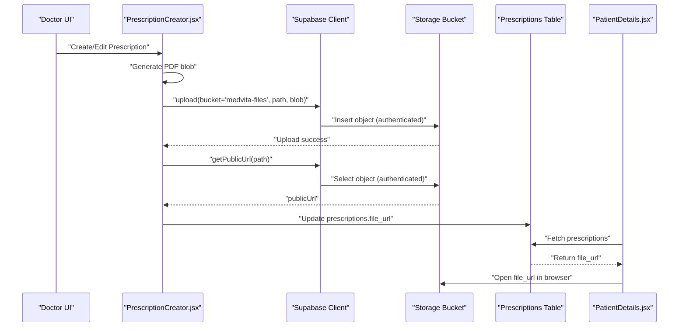
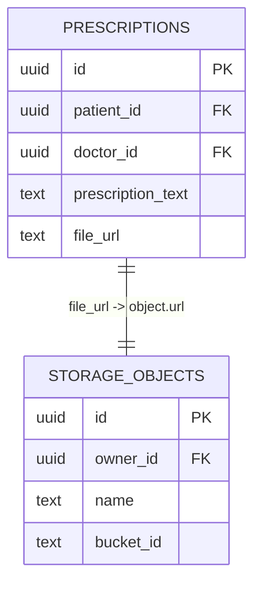
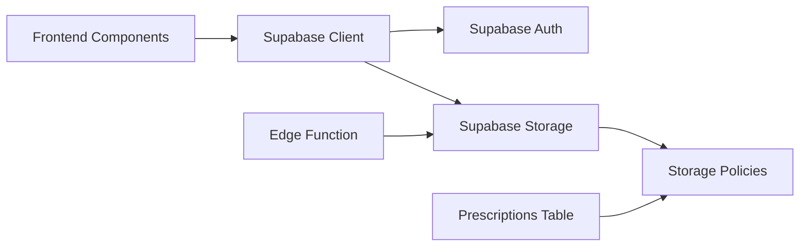

# Storage Integration & Policies

<cite>
**Referenced Files in This Document**
- [config.toml](file://supabase/config.toml)
- [schema.sql](file://backend/schema.sql)
- [supabaseClient.js](file://frontend/src/lib/supabaseClient.js)
- [PrescriptionCreator.jsx](file://frontend/src/components/PrescriptionCreator.jsx)
- [PatientDetails.jsx](file://frontend/src/components/PatientDetails.jsx)
- [index.ts](file://supabase/functions/send-prescription-email/index.ts)
- [WIKI.md](file://WIKI.md)
- [README.md](file://README.md)
</cite>

## Table of Contents
1. [Introduction](#introduction)
2. [Project Structure](#project-structure)
3. [Core Components](#core-components)
4. [Architecture Overview](#architecture-overview)
5. [Detailed Component Analysis](#detailed-component-analysis)
6. [Dependency Analysis](#dependency-analysis)
7. [Performance Considerations](#performance-considerations)
8. [Troubleshooting Guide](#troubleshooting-guide)
9. [Conclusion](#conclusion)
10. [Appendices](#appendices)

## Introduction
This document explains how MedVita integrates with Supabase Storage to securely manage medical documents such as prescriptions. It covers the storage bucket configuration, file upload policies, access control mechanisms, and the end-to-end workflow for storing, retrieving, and delivering PDFs. It also outlines security posture, file naming conventions, and operational considerations for managing sensitive medical data.

## Project Structure
The storage integration spans three layers:
- Supabase configuration defines the storage bucket and limits.
- Database schema defines the bucket and object policies for authenticated access.
- Frontend components upload PDFs and present public URLs to users.
- Edge functions deliver PDFs via email.

**Diagram sources**
- [config.toml](file://supabase/config.toml#L105-L124)
- [schema.sql](file://backend/schema.sql#L226-L237)
- [PrescriptionCreator.jsx](file://frontend/src/components/PrescriptionCreator.jsx#L84-L97)
- [PatientDetails.jsx](file://frontend/src/components/PatientDetails.jsx#L333-L344)
- [index.ts](file://supabase/functions/send-prescription-email/index.ts#L48-L58)

**Section sources**
- [README.md](file://README.md#L1-L89)
- [WIKI.md](file://WIKI.md#L108-L169)

## Core Components
- Storage bucket: medvita-files (public)
- Policies:
  - Insert: authenticated users can upload to medvita-files
  - Select: authenticated users can view objects in medvita-files
- Frontend upload flow: generate PDF, upload to bucket, derive public URL, persist URL in prescriptions
- Access control: prescriptions table enforces who can view a given prescription; storage policies enforce who can upload/view files

**Section sources**
- [schema.sql](file://backend/schema.sql#L226-L237)
- [PrescriptionCreator.jsx](file://frontend/src/components/PrescriptionCreator.jsx#L84-L97)
- [PatientDetails.jsx](file://frontend/src/components/PatientDetails.jsx#L333-L344)

## Architecture Overview
The storage architecture centers on a single public bucket with strict object-level policies. The frontend generates PDFs and uploads them to the bucket under a structured path. The prescriptions table stores the public URL for later retrieval and display.

**Diagram sources**
- [PrescriptionCreator.jsx](file://frontend/src/components/PrescriptionCreator.jsx#L53-L97)
- [schema.sql](file://backend/schema.sql#L226-L237)
- [PatientDetails.jsx](file://frontend/src/components/PatientDetails.jsx#L333-L344)

## Detailed Component Analysis

### Storage Bucket Configuration
- Bucket: medvita-files
- Public: true
- File size limit: 50 MiB
- S3 protocol enabled

These settings allow:
- Public access to uploaded files via signed or public URLs
- Uploading via Supabase Storage SDK
- Optional S3-compatible access

**Section sources**
- [config.toml](file://supabase/config.toml#L105-L124)
- [schema.sql](file://backend/schema.sql#L226-L229)

### Object Policies for Authenticated Access
- Insert policy: authenticated users can insert into storage.objects where bucket_id equals medvita-files
- Select policy: authenticated users can select from storage.objects where bucket_id equals medvita-files

Implications:
- Only authenticated users can upload or view files
- Files remain within the medvita-files bucket
- Access is enforced at the object level

**Section sources**
- [schema.sql](file://backend/schema.sql#L231-L237)

### File Naming Conventions and Upload Workflow
- Path pattern: user.id/prescriptions/{prescriptionId}_{timestamp}.pdf
- Content type: application/pdf
- Cache control: 3600 seconds
- Upload occurs before updating the prescriptions record with the public URL

Benefits:
- Clear ownership by doctor’s user ID
- Predictable filenames for auditability
- Short-lived caching for freshness

**Section sources**
- [PrescriptionCreator.jsx](file://frontend/src/components/PrescriptionCreator.jsx#L81-L89)
- [PrescriptionCreator.jsx](file://frontend/src/components/PrescriptionCreator.jsx#L142-L149)

### URL Generation and Retrieval
- After upload succeeds, the frontend requests a public URL for the stored object
- The URL is persisted in the prescriptions.file_url field
- PatientDetails displays a link to the PDF using the stored URL

Security note:
- Since the bucket is public, the URL grants direct access to the PDF
- Access control relies on the prescriptions table policies and the requirement for authenticated users to upload/view

**Section sources**
- [PrescriptionCreator.jsx](file://frontend/src/components/PrescriptionCreator.jsx#L93-L97)
- [PatientDetails.jsx](file://frontend/src/components/PatientDetails.jsx#L333-L344)

### Relationship Between Prescriptions and Stored Files
- prescriptions.file_url holds the public URL of the PDF
- Access to the PDF is governed by:
  - Storage policies (authenticated users)
  - Prescriptions policies (who can view a given prescription)

**Diagram sources**
- [schema.sql](file://backend/schema.sql#L200-L224)
- [schema.sql](file://backend/schema.sql#L226-L237)

**Section sources**
- [schema.sql](file://backend/schema.sql#L200-L224)

### Email Delivery of PDFs
- The edge function fetches the PDF from storage using the provided URL
- Encodes the PDF as Base64 and attaches it to an HTML email
- Uses Resend API for delivery

Operational notes:
- Requires RESEND_API_KEY secret
- PDF is attached with a descriptive filename
- HTML includes branding and health tips

**Section sources**
- [index.ts](file://supabase/functions/send-prescription-email/index.ts#L31-L46)
- [index.ts](file://supabase/functions/send-prescription-email/index.ts#L48-L58)
- [index.ts](file://supabase/functions/send-prescription-email/index.ts#L151-L170)

### Access Control Mechanisms
- Storage-level:
  - Insert/select restricted to authenticated users for bucket medvita-files
- Database-level:
  - Prescriptions select policy ensures only authorized users can view a given prescription
- Frontend-level:
  - Supabase client requires authentication for uploads and URL retrieval

**Section sources**
- [schema.sql](file://backend/schema.sql#L231-L237)
- [schema.sql](file://backend/schema.sql#L216-L224)
- [supabaseClient.js](file://frontend/src/lib/supabaseClient.js#L1-L11)

## Dependency Analysis
- Frontend depends on Supabase client for storage operations
- Supabase client depends on Supabase project configuration (URL, anon key)
- Storage policies depend on Supabase Auth roles
- Edge function depends on storage URL and Resend API

**Diagram sources**
- [supabaseClient.js](file://frontend/src/lib/supabaseClient.js#L1-L11)
- [schema.sql](file://backend/schema.sql#L231-L237)
- [index.ts](file://supabase/functions/send-prescription-email/index.ts#L31-L46)

**Section sources**
- [supabaseClient.js](file://frontend/src/lib/supabaseClient.js#L1-L11)
- [schema.sql](file://backend/schema.sql#L231-L237)

## Performance Considerations
- File size limit: 50 MiB prevents oversized uploads
- Cache control: 3600 seconds balances freshness and CDN efficiency
- PDF generation: client-side canvas-to-PDF reduces server CPU load
- Edge function fetches PDF once per email dispatch

Recommendations:
- Monitor bucket usage and consider retention policies for older files
- Consider compressing images within PDFs to reduce size
- Use CDN-backed public URLs for faster global delivery

[No sources needed since this section provides general guidance]

## Troubleshooting Guide
Common issues and resolutions:
- Upload fails with unauthorized error
  - Ensure user is authenticated before uploading
  - Verify storage policies allow insert for bucket medvita-files
- Cannot retrieve public URL
  - Confirm object exists and bucket is public
  - Ensure authenticated session is active
- PDF not delivered via email
  - Check RESEND_API_KEY secret is set
  - Verify pdfUrl passed to edge function is accessible
- Access denied to PDF
  - Confirm user meets prescriptions select policy criteria
  - Ensure storage select policy permits authenticated access

**Section sources**
- [schema.sql](file://backend/schema.sql#L231-L237)
- [schema.sql](file://backend/schema.sql#L216-L224)
- [index.ts](file://supabase/functions/send-prescription-email/index.ts#L31-L46)

## Conclusion
MedVita’s storage integration leverages a public bucket with strict authenticated access policies to securely store and deliver medical documents. The frontend generates PDFs, uploads them to the bucket, persists the public URL in the database, and presents it to authorized users. Edge functions enable automated email delivery while maintaining security through role-based policies and authenticated access controls.

[No sources needed since this section summarizes without analyzing specific files]

## Appendices

### Appendix A: Storage.buckets Table Setup
- Creates bucket medvita-files with public=true
- Ensures id uniqueness on conflict

**Section sources**
- [schema.sql](file://backend/schema.sql#L226-L229)

### Appendix B: Object Policies Summary
- Insert: authenticated users can upload to medvita-files
- Select: authenticated users can view objects in medvita-files

**Section sources**
- [schema.sql](file://backend/schema.sql#L231-L237)

### Appendix C: Frontend Upload Flow (Step-by-step)
- Generate PDF blob from rendered content
- Upload to storage.medvita-files with cacheControl and contentType
- Retrieve public URL
- Update prescriptions.record with file_url

**Section sources**
- [PrescriptionCreator.jsx](file://frontend/src/components/PrescriptionCreator.jsx#L53-L97)
- [PrescriptionCreator.jsx](file://frontend/src/components/PrescriptionCreator.jsx#L142-L149)

### Appendix D: Security Policy Matrix
- Storage: authenticated users can upload/view in medvita-files
- Database: prescriptions select policy restricts who can view a record
- Frontend: authenticated session required for all storage operations

**Section sources**
- [schema.sql](file://backend/schema.sql#L231-L237)
- [schema.sql](file://backend/schema.sql#L216-L224)
- [supabaseClient.js](file://frontend/src/lib/supabaseClient.js#L1-L11)