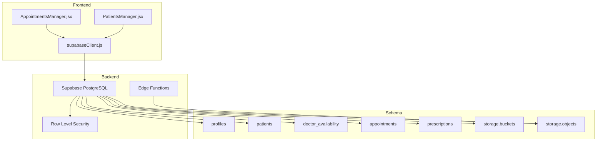
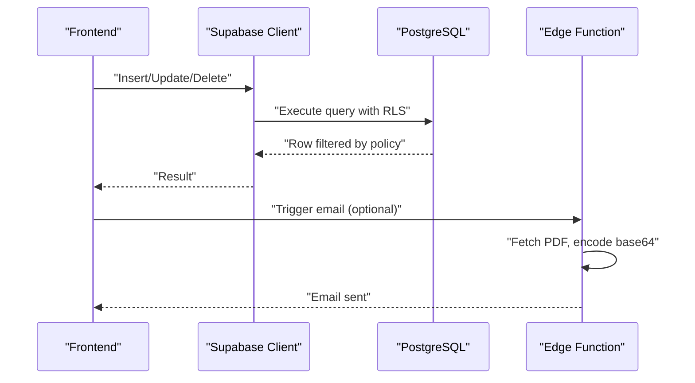
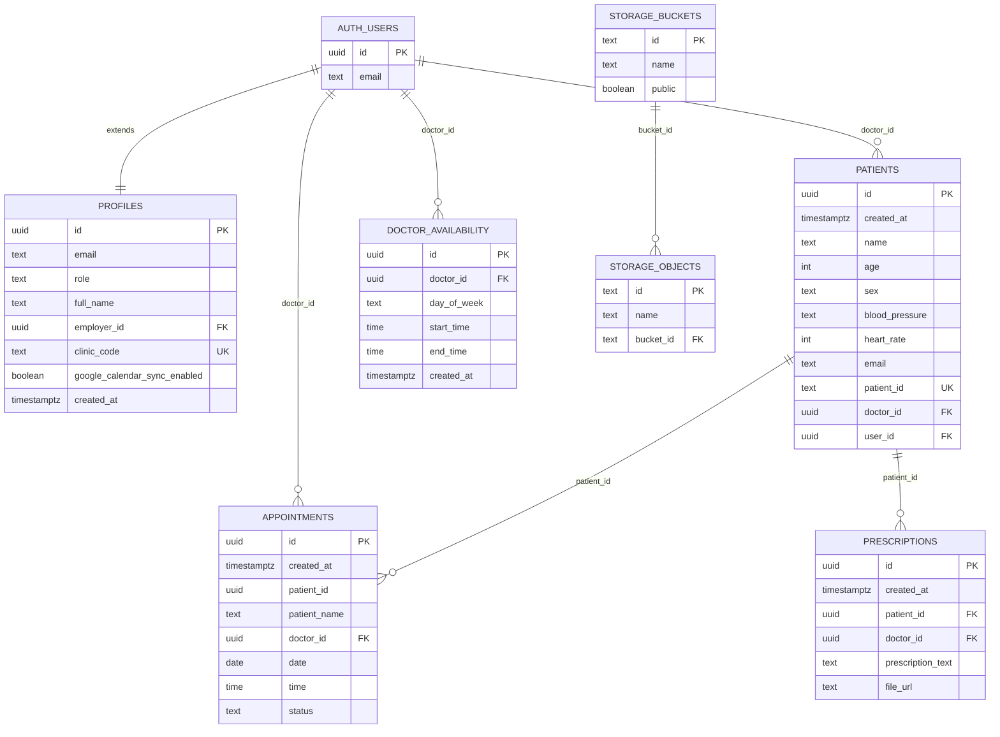

# Table Schemas & Constraints

<cite>
**Referenced Files in This Document**
- [schema.sql](file://backend/schema.sql)
- [SUPABASE_SETUP.md](file://_trash/SUPABASE_SETUP.md)
- [FIX_APPOINTMENTS_FK.sql](file://_trash/FIX_APPOINTMENTS_FK.sql)
- [FIX_DOCTOR_VISIBILITY.sql](file://_trash/FIX_DOCTOR_VISIBILITY.sql)
- [DEBUG_DISABLE_RLS.sql](file://_trash/DEBUG_DISABLE_RLS.sql)
- [AppointmentsManager.jsx](file://frontend/src/pages/AppointmentsManager.jsx)
- [PatientsManager.jsx](file://frontend/src/pages/PatientsManager.jsx)
- [supabaseClient.js](file://frontend/src/lib/supabaseClient.js)
- [index.ts](file://supabase/functions/send-prescription-email/index.ts)
</cite>

## Table of Contents
1. [Introduction](#introduction)
2. [Project Structure](#project-structure)
3. [Core Components](#core-components)
4. [Architecture Overview](#architecture-overview)
5. [Detailed Component Analysis](#detailed-component-analysis)
6. [Dependency Analysis](#dependency-analysis)
7. [Performance Considerations](#performance-considerations)
8. [Troubleshooting Guide](#troubleshooting-guide)
9. [Conclusion](#conclusion)
10. [Appendices](#appendices)

## Introduction
This document provides comprehensive table schema documentation for the MedVita healthcare management system. It details the structure and constraints of core database tables including profiles, patients, doctor_availability, appointments, and prescriptions. It explains primary keys, foreign keys, unique constraints, check constraints, generated identifiers, timestamps, and business rules. It also covers Row Level Security (RLS) policies, migration scripts for schema evolution, and practical examples of constraint violations with resolution strategies.

## Project Structure
The database schema is defined centrally and deployed via Supabase. The frontend interacts with the database through Supabase client APIs, while edge functions handle asynchronous tasks such as sending prescription emails.

**Diagram sources**
- [AppointmentsManager.jsx](file://frontend/src/pages/AppointmentsManager.jsx#L1-L200)
- [PatientsManager.jsx](file://frontend/src/pages/PatientsManager.jsx#L1-L200)
- [supabaseClient.js](file://frontend/src/lib/supabaseClient.js#L1-L11)
- [schema.sql](file://backend/schema.sql#L1-L274)

**Section sources**
- [schema.sql](file://backend/schema.sql#L1-L274)
- [AppointmentsManager.jsx](file://frontend/src/pages/AppointmentsManager.jsx#L1-L200)
- [PatientsManager.jsx](file://frontend/src/pages/PatientsManager.jsx#L1-L200)
- [supabaseClient.js](file://frontend/src/lib/supabaseClient.js#L1-L11)

## Core Components
This section documents each table’s structure, constraints, defaults, and business rules.

- profiles
  - Purpose: Extends Supabase Auth with role-based metadata and clinic-related fields.
  - Primary Key: id (uuid) referencing auth.users on delete cascade.
  - Columns and Constraints:
    - id: uuid, PK, FK to auth.users
    - email: text
    - role: text, check in ('doctor','patient','receptionist'), default 'patient'
    - full_name: text
    - employer_id: uuid, FK to auth.users (for receptionists linking to a doctor)
    - clinic_code: text, unique (for doctor invite code)
    - google_calendar_sync_enabled: boolean, default false
    - created_at: timestamp with time zone, default UTC now(), not null
  - Generated Identifiers: None (uses auth.users id).
  - Business Rules:
    - Receptionists can link to a doctor via employer_id using a clinic_code.
    - RLS allows users to view all profiles but only update their own.

- patients
  - Purpose: Stores patient medical records and identifiers.
  - Primary Key: id (uuid).
  - Columns and Constraints:
    - id: uuid, PK, default uuid_generate_v4()
    - created_at: timestamp with time zone, default UTC now(), not null
    - name: text, not null
    - age: integer
    - sex: text
    - blood_pressure: text (format example: "120/80")
    - heart_rate: integer (BPM)
    - email: text (contact email)
    - patient_id: text, unique, default generated prefix plus random 6 chars
    - doctor_id: uuid, FK to auth.users, not null
    - user_id: uuid, FK to auth.users (optional direct auth link)
  - Generated Identifiers:
    - id: uuid_generate_v4()
    - patient_id: deterministic prefix with random suffix
  - Business Rules:
    - Each patient belongs to a doctor (doctor_id).
    - Receptionists can manage employer's patients; doctors can manage their own; patients can view their own by email.

- doctor_availability
  - Purpose: Configures doctor working hours.
  - Primary Key: id (uuid).
  - Columns and Constraints:
    - id: uuid, PK, default uuid_generate_v4()
    - doctor_id: uuid, FK to auth.users, not null
    - day_of_week: text, not null
    - start_time: time, not null
    - end_time: time, not null
    - created_at: timestamp with time zone, default UTC now(), not null
  - Generated Identifiers: id uuid_generate_v4().
  - Business Rules:
    - Only the doctor can manage their availability; public can view.

- appointments
  - Purpose: Manages scheduled visits.
  - Primary Key: id (uuid).
  - Columns and Constraints:
    - id: uuid, PK, default uuid_generate_v4()
    - created_at: timestamp with time zone, default UTC now(), not null
    - patient_id: uuid (supports both auth.users.id and patients.id)
    - patient_name: text (cached display name)
    - doctor_id: uuid, FK to auth.users, not null
    - date: date, not null
    - time: time, not null
    - status: text, default 'scheduled', check in ('scheduled','completed','cancelled')
  - Generated Identifiers: id uuid_generate_v4().
  - Business Rules:
    - patient_id can reference either a registered user or a doctor-managed patient.
    - RLS grants visibility to doctor, patient, or the doctor of the managed patient.
    - Insertion allowed by patient or doctor; updates restricted to doctor.

- prescriptions
  - Purpose: Stores digital prescriptions with optional file URL.
  - Primary Key: id (uuid).
  - Columns and Constraints:
    - id: uuid, PK, default uuid_generate_v4()
    - created_at: timestamp with time zone, default UTC now(), not null
    - patient_id: uuid, FK to patients.id, not null
    - doctor_id: uuid, FK to auth.users, not null
    - prescription_text: text
    - file_url: text
  - Generated Identifiers: id uuid_generate_v4().
  - Business Rules:
    - Doctors manage all prescriptions; patients can view their own via join with patients.

**Section sources**
- [schema.sql](file://backend/schema.sql#L4-L274)

## Architecture Overview
The system integrates frontend components with Supabase PostgreSQL and edge functions. The database enforces RLS policies and uses UUIDs for identifiers. Migrations and fixes ensure robustness across schema evolution.

**Diagram sources**
- [AppointmentsManager.jsx](file://frontend/src/pages/AppointmentsManager.jsx#L134-L180)
- [PatientsManager.jsx](file://frontend/src/pages/PatientsManager.jsx#L123-L160)
- [schema.sql](file://backend/schema.sql#L226-L274)
- [index.ts](file://supabase/functions/send-prescription-email/index.ts#L1-L193)

## Detailed Component Analysis

### Profiles Table
- Purpose: Role-based metadata extending auth.users.
- Constraints:
  - PK: id uuid -> auth.users
  - employer_id uuid -> auth.users (receptionists link to doctor)
  - clinic_code unique
  - role check constraint
- Defaults:
  - role default 'patient'
  - google_calendar_sync_enabled default false
- RLS:
  - Select: true
  - Insert: with_check auth.uid() = id
  - Update: using auth.uid() = id

**Section sources**
- [schema.sql](file://backend/schema.sql#L4-L44)

### Patients Table
- Purpose: Medical records and identifiers.
- Constraints:
  - PK: id uuid
  - doctor_id uuid -> auth.users
  - user_id uuid -> auth.users (optional)
  - unique: patient_id
  - check: role-based access via RLS
- Defaults:
  - id default uuid_generate_v4()
  - patient_id default generated
- RLS:
  - Select: doctor sees own; receptionist sees employer's; patient by email
  - Insert/Update/Delete: doctor only
  - Insert: receptionist can insert for employer

**Section sources**
- [schema.sql](file://backend/schema.sql#L45-L111)

### Doctor Availability Table
- Purpose: Weekly working hours.
- Constraints:
  - PK: id uuid
  - doctor_id uuid -> auth.users
- Defaults:
  - id default uuid_generate_v4()
- RLS:
  - All: using auth.uid() = doctor_id
  - Select: true

**Section sources**
- [schema.sql](file://backend/schema.sql#L117-L136)

### Appointments Table
- Purpose: Scheduled visits with flexible patient reference.
- Constraints:
  - PK: id uuid
  - doctor_id uuid -> auth.users
  - patient_id uuid (supports auth.users.id or patients.id)
  - status check constraint
- Defaults:
  - id default uuid_generate_v4()
  - status default 'scheduled'
- RLS:
  - Select: doctor, patient, or doctor of managed patient
  - Insert: patient or doctor or doctor of managed patient
  - Update: using auth.uid() = doctor_id

**Section sources**
- [schema.sql](file://backend/schema.sql#L137-L200)

### Prescriptions Table
- Purpose: Digital prescriptions with optional file URL.
- Constraints:
  - PK: id uuid
  - patient_id uuid -> patients.id
  - doctor_id uuid -> auth.users
- Defaults:
  - id default uuid_generate_v4()
- RLS:
  - All: using auth.uid() = doctor_id
  - Select: via join with patients (email or user_id match)

**Section sources**
- [schema.sql](file://backend/schema.sql#L200-L225)

### Storage and Edge Functions
- Storage bucket: medvita-files (public)
- Policies:
  - Insert: authenticated users, bucket medvita-files
  - Select: authenticated users, bucket medvita-files
- Edge Function: send-prescription-email
  - Fetches PDF, encodes base64, sends HTML email via Resend API

**Section sources**
- [schema.sql](file://backend/schema.sql#L226-L238)
- [index.ts](file://supabase/functions/send-prescription-email/index.ts#L1-L193)

## Dependency Analysis
The tables form a cohesive relational model with explicit foreign keys and RLS policies. The appointments table accommodates dual patient references via a non-standard foreign key pattern, requiring careful policy design.

**Diagram sources**
- [schema.sql](file://backend/schema.sql#L4-L274)

**Section sources**
- [schema.sql](file://backend/schema.sql#L4-L274)

## Performance Considerations
- Indexes: The schema does not define explicit indexes. Consider adding indexes on frequently queried columns:
  - patients(doctor_id, created_at)
  - appointments(doctor_id, date, time)
  - appointments(patient_id, date)
  - prescriptions(patient_id, created_at)
  - profiles(role, employer_id)
- RLS Overhead: RLS policies add runtime filtering; keep filters selective to minimize overhead.
- UUIDs: Using UUIDs ensures distributed uniqueness but can increase storage and index sizes compared to serial integers.

[No sources needed since this section provides general guidance]

## Troubleshooting Guide
Common issues and resolutions during schema deployment and operation:

- Missing profiles table
  - Symptom: Error indicating missing public.profiles.
  - Resolution: Run the Supabase setup script to create tables and policies.
  - Section sources
    - [SUPABASE_SETUP.md](file://_trash/SUPABASE_SETUP.md#L1-L194)

- Appointments foreign key constraint conflicts
  - Symptom: Error about appointments.patient_id foreign key referencing two tables.
  - Resolution: Drop existing problematic constraint and ensure patient_name column exists.
  - Section sources
    - [FIX_APPOINTMENTS_FK.sql](file://_trash/FIX_APPOINTMENTS_FK.sql#L1-L22)

- Appointments visibility issues
  - Symptom: Users cannot see appointments despite data existing.
  - Resolution: Recreate comprehensive RLS policies for select, insert, and update.
  - Section sources
    - [FIX_DOCTOR_VISIBILITY.sql](file://_trash/FIX_DOCTOR_VISIBILITY.sql#L1-L63)

- Temporarily disabling RLS for debugging
  - Symptom: Need to verify raw data presence.
  - Resolution: Disable RLS on appointments to confirm data existence.
  - Section sources
    - [DEBUG_DISABLE_RLS.sql](file://_trash/DEBUG_DISABLE_RLS.sql#L1-L9)

- Frontend environment configuration
  - Symptom: Supabase client warnings about missing keys.
  - Resolution: Ensure VITE_SUPABASE_URL and VITE_SUPABASE_ANON_KEY are set in .env.local.
  - Section sources
    - [supabaseClient.js](file://frontend/src/lib/supabaseClient.js#L1-L11)

## Conclusion
MedVita’s database schema is designed around role-based access control, flexible patient references in appointments, and secure storage integration. The provided scripts and policies ensure robust initialization, ongoing maintenance, and reliable data access across roles. Adhering to the documented constraints and using the included migration scripts will help maintain backward compatibility and prevent common constraint violations.

[No sources needed since this section summarizes without analyzing specific files]

## Appendices

### Table Creation Scripts with Constraints and Indexes
- Enable UUID extension and create tables with constraints and defaults.
- Add RLS policies per table.
- Create storage bucket and policies.
- Create trigger for auto-populating profiles on new user signup.

**Section sources**
- [schema.sql](file://backend/schema.sql#L1-L274)

### Migration Scripts for Schema Evolution
- Profiles migration: Adds new columns with defaults and unique constraints.
- Patients migration: Adds clinical fields with defaults.
- Appointments fix: Drops conflicting FK and ensures patient_name column.
- Doctor visibility fix: Recreates comprehensive RLS policies and attempts FK addition.

**Section sources**
- [schema.sql](file://backend/schema.sql#L16-L28)
- [schema.sql](file://backend/schema.sql#L60-L69)
- [FIX_APPOINTMENTS_FK.sql](file://_trash/FIX_APPOINTMENTS_FK.sql#L1-L22)
- [FIX_DOCTOR_VISIBILITY.sql](file://_trash/FIX_DOCTOR_VISIBILITY.sql#L1-L63)

### Example Relationships and Constraint Violations
- Relationship: patients(doctor_id) -> auth.users(id)
- Relationship: doctor_availability(doctor_id) -> auth.users(id)
- Relationship: appointments(doctor_id) -> auth.users(id)
- Relationship: appointments(patient_id) -> patients(id) or auth.users(id)
- Relationship: prescriptions(patient_id) -> patients(id)
- Constraint violation examples:
  - Inserting an appointment with patient_id referencing neither auth.users nor patients.id.
  - Updating an appointment status by a non-doctor user.
  - Creating a prescription without a valid patient_id.
- Resolution strategies:
  - Ensure patient_id references a valid patient or user.
  - Enforce RLS policies and role checks.
  - Validate foreign keys before insert/update.

**Section sources**
- [schema.sql](file://backend/schema.sql#L137-L225)
- [AppointmentsManager.jsx](file://frontend/src/pages/AppointmentsManager.jsx#L134-L180)
- [PatientsManager.jsx](file://frontend/src/pages/PatientsManager.jsx#L123-L160)