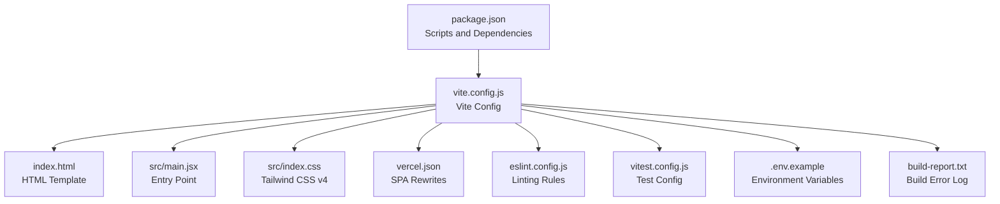
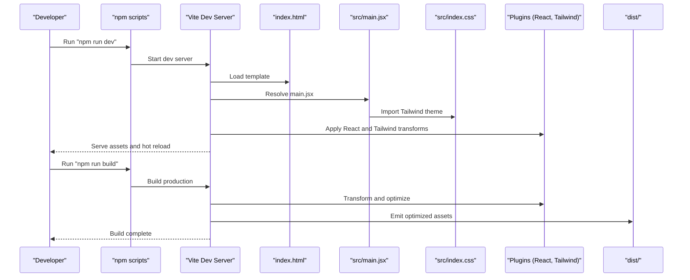
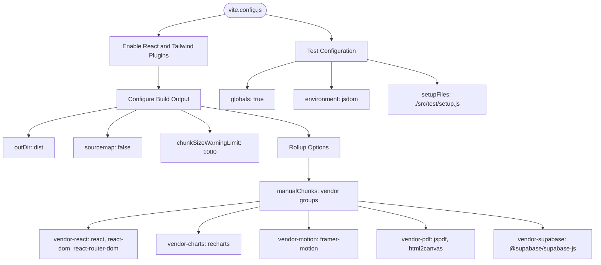
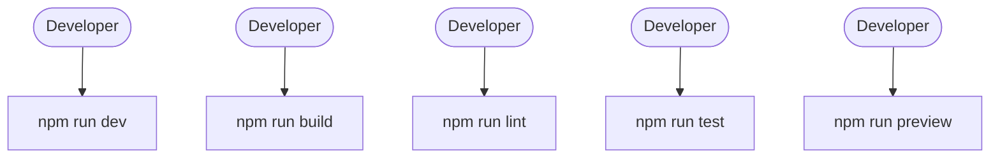
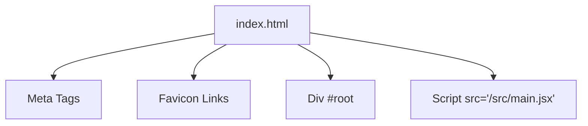
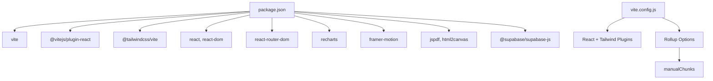

# Build Configuration

<cite>
**Referenced Files in This Document**
- [vite.config.js](file://frontend/vite.config.js)
- [package.json](file://frontend/package.json)
- [index.html](file://frontend/index.html)
- [.env.example](file://frontend/.env.example)
- [build-report.txt](file://frontend/build-report.txt)
- [vercel.json](file://frontend/vercel.json)
- [eslint.config.js](file://frontend/eslint.config.js)
- [vitest.config.js](file://frontend/vitest.config.js)
- [src/index.css](file://frontend/src/index.css)
- [src/main.jsx](file://frontend/src/main.jsx)
- [src/test/setup.js](file://frontend/src/test/setup.js)
- [README.md](file://frontend/README.md)
</cite>

## Table of Contents
1. [Introduction](#introduction)
2. [Project Structure](#project-structure)
3. [Core Components](#core-components)
4. [Architecture Overview](#architecture-overview)
5. [Detailed Component Analysis](#detailed-component-analysis)
6. [Dependency Analysis](#dependency-analysis)
7. [Performance Considerations](#performance-considerations)
8. [Troubleshooting Guide](#troubleshooting-guide)
9. [Conclusion](#conclusion)
10. [Appendices](#appendices)

## Introduction
This document provides comprehensive build configuration documentation for MedVita's frontend application. It covers the Vite build system configuration, development and production settings, asset optimization, bundle analysis, package.json scripts, HTML template configuration, public asset management, static file handling, build optimization techniques (code splitting, tree shaking, minification), environment variable handling during build time, asset fingerprinting for cache busting, build performance monitoring, and troubleshooting guidance for common build issues.

## Project Structure
The frontend build system centers around Vite with React and Tailwind CSS. Key configuration files and their roles:
- vite.config.js: Defines Vite plugins, build outputs, Rollup options, and test configuration.
- package.json: Contains scripts for development, building, linting, testing, and previewing.
- index.html: The HTML template with meta tags, favicon links, and the root div for React.
- .env.example: Example environment variables for Google Calendar and Supabase.
- vercel.json: Next.js-style rewrites for SPA routing on Vercel.
- src/index.css: Tailwind CSS v4 configuration and custom theme tokens.
- src/main.jsx: Application entry point mounting the React root with routing and theming providers.
- Additional configs: eslint.config.js for linting, vitest.config.js for unit testing, and build-report.txt for historical build errors.

**Diagram sources**
- [package.json](file://frontend/package.json#L1-L50)
- [vite.config.js](file://frontend/vite.config.js#L1-L33)
- [index.html](file://frontend/index.html#L1-L16)
- [src/main.jsx](file://frontend/src/main.jsx#L1-L17)
- [src/index.css](file://frontend/src/index.css#L1-L781)
- [vercel.json](file://frontend/vercel.json#L1-L8)
- [eslint.config.js](file://frontend/eslint.config.js#L1-L30)
- [vitest.config.js](file://frontend/vitest.config.js#L1-L19)
- [.env.example](file://frontend/.env.example#L1-L9)
- [build-report.txt](file://frontend/build-report.txt#L1-L22)

**Section sources**
- [package.json](file://frontend/package.json#L1-L50)
- [vite.config.js](file://frontend/vite.config.js#L1-L33)
- [index.html](file://frontend/index.html#L1-L16)
- [src/index.css](file://frontend/src/index.css#L1-L781)
- [src/main.jsx](file://frontend/src/main.jsx#L1-L17)
- [vercel.json](file://frontend/vercel.json#L1-L8)
- [eslint.config.js](file://frontend/eslint.config.js#L1-L30)
- [vitest.config.js](file://frontend/vitest.config.js#L1-L19)
- [.env.example](file://frontend/.env.example#L1-L9)
- [build-report.txt](file://frontend/build-report.txt#L1-L22)

## Core Components
- Vite Configuration
  - Plugins: React and Tailwind CSS plugins are enabled.
  - Build Output: Outputs to dist with sourcemaps disabled by default.
  - Chunk Splitting: Manual chunks group vendor libraries for better caching and load performance.
  - Test Configuration: Vitest globals, jsdom environment, and setup file.
- Package Scripts
  - dev: Starts Vite dev server.
  - build: Produces optimized production bundles.
  - lint: Runs ESLint across the project.
  - test: Executes Vitest unit tests.
  - preview: Serves the production build locally.
- HTML Template
  - Provides meta tags, viewport, description, and links to favicons.
  - Mounts the React app at #root and loads the module script.
- Environment Variables
  - Example variables include Google Calendar and Supabase keys prefixed with VITE_.
- Static Assets and Public Directory
  - Public assets (favicon.svg, vite.svg) are served from the public directory.
  - The HTML template references /favicon.svg and /vite.svg.

**Section sources**
- [vite.config.js](file://frontend/vite.config.js#L6-L32)
- [package.json](file://frontend/package.json#L6-L12)
- [index.html](file://frontend/index.html#L3-L15)
- [.env.example](file://frontend/.env.example#L1-L9)

## Architecture Overview
The build pipeline integrates Vite, React, and Tailwind CSS. The flow begins with the HTML template, proceeds through Vite's plugin chain, and produces optimized static assets in dist.

**Diagram sources**
- [package.json](file://frontend/package.json#L6-L12)
- [index.html](file://frontend/index.html#L1-L16)
- [src/main.jsx](file://frontend/src/main.jsx#L1-L17)
- [src/index.css](file://frontend/src/index.css#L1-L781)
- [vite.config.js](file://frontend/vite.config.js#L6-L32)

## Detailed Component Analysis

### Vite Configuration
Key aspects:
- Plugins: React and Tailwind CSS plugins enable JSX transforms and CSS processing.
- Build Options:
  - outDir: dist
  - sourcemap: disabled for smaller production builds
  - chunkSizeWarningLimit: increased to avoid early warnings for larger chunks
  - rollupOptions.output.manualChunks: groups vendor libraries into named chunks for improved caching and load performance.
- Test Configuration:
  - globals: true
  - environment: jsdom
  - setupFiles: ./src/test/setup.js

**Diagram sources**
- [vite.config.js](file://frontend/vite.config.js#L6-L32)

**Section sources**
- [vite.config.js](file://frontend/vite.config.js#L6-L32)

### Package Scripts
- dev: Starts Vite development server.
- build: Builds the production application.
- lint: Runs ESLint for code quality checks.
- test: Executes Vitest unit tests.
- preview: Serves the production build locally for verification.

**Diagram sources**
- [package.json](file://frontend/package.json#L6-L12)

**Section sources**
- [package.json](file://frontend/package.json#L6-L12)

### HTML Template Configuration
- Meta tags: charset, viewport, description, and title.
- Favicon links: SVG and alternate icon.
- Root element: #root for React to mount.
- Script: Loads src/main.jsx as a module.

**Diagram sources**
- [index.html](file://frontend/index.html#L3-L15)

**Section sources**
- [index.html](file://frontend/index.html#L1-L16)

### Public Asset Management and Static Files
- Public directory: Assets placed here are served at the app root (e.g., favicon.svg, vite.svg).
- HTML template references public assets via /favicon.svg and /vite.svg.
- These assets are not processed by Vite’s module system and are copied as-is.

**Section sources**
- [index.html](file://frontend/index.html#L5-L6)

### Environment Variable Handling
- Example variables include VITE_GOOGLE_CLIENT_ID, VITE_GOOGLE_API_KEY, VITE_SUPABASE_URL, and VITE_SUPABASE_ANON_KEY.
- Vite exposes environment variables prefixed with VITE_ to the browser at build time.
- For runtime secrets, keep them server-side; only expose frontend-safe keys.

**Section sources**
- [.env.example](file://frontend/.env.example#L1-L9)

### Asset Optimization and Bundle Analysis
- Code Splitting:
  - manualChunks groups major vendor libraries into separate chunks to improve caching and reduce initial payload.
- Tree Shaking:
  - Enabled by default in Vite with ES modules; ensure libraries export ES modules for optimal dead-code elimination.
- Minification:
  - Terser minification is applied in production builds by default.
- Sourcemaps:
  - Disabled in production to reduce bundle size; enable for debugging if needed.

**Section sources**
- [vite.config.js](file://frontend/vite.config.js#L11-L26)

### Tailwind CSS Integration and CSS Processing
- Tailwind CSS v4 is configured via @import and custom theme tokens.
- The CSS defines brand colors, animations, glassmorphism utilities, and responsive variants.
- Build-time errors indicate invalid Tailwind utilities; ensure all classes used in components are valid.

**Section sources**
- [src/index.css](file://frontend/src/index.css#L1-L781)
- [build-report.txt](file://frontend/build-report.txt#L10-L10)

### SPA Routing on Vercel
- Rewrites route all paths to index.html, enabling client-side routing for single-page applications.

**Section sources**
- [vercel.json](file://frontend/vercel.json#L2-L7)

### Testing Configuration
- Vitest runs in jsdom environment with React globals and a setup file for DOM extensions.
- Excludes dist, build, node_modules, and trash directories from test coverage.

**Section sources**
- [vitest.config.js](file://frontend/vitest.config.js#L4-L18)
- [src/test/setup.js](file://frontend/src/test/setup.js#L1-L2)

### Linting Configuration
- ESLint recommended rules extended with React Hooks and React Refresh plugins.
- Ignores dist directory to prevent linting generated files.

**Section sources**
- [eslint.config.js](file://frontend/eslint.config.js#L7-L29)

## Dependency Analysis
The build system relies on Vite, React, and Tailwind CSS. Dependencies are declared in package.json. The Vite configuration references these plugins and sets Rollup options for bundling.

**Diagram sources**
- [package.json](file://frontend/package.json#L13-L47)
- [vite.config.js](file://frontend/vite.config.js#L6-L32)

**Section sources**
- [package.json](file://frontend/package.json#L13-L47)
- [vite.config.js](file://frontend/vite.config.js#L6-L32)

## Performance Considerations
- Code Splitting: Use manualChunks to split vendor-heavy libraries into separate bundles for better caching.
- Tree Shaking: Prefer ES modules and avoid importing entire libraries; configure bundler to eliminate unused exports.
- Minification: Keep minification enabled in production; disable sourcemaps to reduce bundle size.
- Asset Size Monitoring: Track chunk sizes and warn thresholds; adjust manualChunks as needed.
- Lazy Loading: Dynamically import heavy routes or components to defer loading until needed.
- CDN and Caching: Serve static assets via CDN and leverage long-term caching with cache-busting filenames.

[No sources needed since this section provides general guidance]

## Troubleshooting Guide
Common build issues and resolutions:
- Tailwind Unknown Utility Classes
  - Symptom: Build fails due to unknown Tailwind utility classes.
  - Cause: Using a class not recognized by Tailwind CSS v4.
  - Resolution: Remove or replace the invalid class; ensure all component classes are valid Tailwind utilities.
  - Evidence: build-report.txt indicates failure due to unknown utility class "glass".
- Missing PostCSS Configuration
  - Observation: No postcss.config.js found; Tailwind CSS v4 plugin handles CSS processing.
  - Action: Ensure Tailwind plugin is installed and configured; verify Tailwind directives in CSS.
- Environment Variables Not Applied
  - Symptom: Runtime errors due to missing VITE_* variables.
  - Resolution: Provide .env.local with required variables; confirm prefix VITE_.
- Large Chunk Warnings
  - Symptom: Warning about chunk size exceeding limit.
  - Resolution: Review manualChunks and split additional vendor libraries; analyze bundle composition.
- SPA Routing on Vercel
  - Symptom: 404 on refresh or deep link.
  - Resolution: Ensure vercel.json rewrites all paths to index.html.

**Section sources**
- [build-report.txt](file://frontend/build-report.txt#L10-L10)
- [vite.config.js](file://frontend/vite.config.js#L14-L14)
- [vercel.json](file://frontend/vercel.json#L2-L7)
- [.env.example](file://frontend/.env.example#L1-L9)

## Conclusion
MedVita’s frontend build configuration leverages Vite with React and Tailwind CSS to deliver a modern, optimized application. The configuration emphasizes code splitting, tree shaking, and minification while maintaining a straightforward development experience. By following the troubleshooting steps and performance recommendations, teams can maintain a reliable and fast build pipeline.

[No sources needed since this section summarizes without analyzing specific files]

## Appendices

### Appendix A: Build Commands Reference
- Development: npm run dev
- Production Build: npm run build
- Linting: npm run lint
- Unit Tests: npm run test
- Preview Production: npm run preview

**Section sources**
- [package.json](file://frontend/package.json#L6-L12)

### Appendix B: Environment Variables Reference
- VITE_GOOGLE_CLIENT_ID
- VITE_GOOGLE_API_KEY
- VITE_SUPABASE_URL
- VITE_SUPABASE_ANON_KEY

**Section sources**
- [.env.example](file://frontend/.env.example#L1-L9)

### Appendix C: Tailwind CSS v4 Notes
- Uses @import and @theme directives.
- Defines custom tokens for brand colors, animations, and glassmorphism utilities.
- Ensure all component classes are valid Tailwind utilities to avoid build failures.

**Section sources**
- [src/index.css](file://frontend/src/index.css#L1-L781)
- [build-report.txt](file://frontend/build-report.txt#L10-L10)