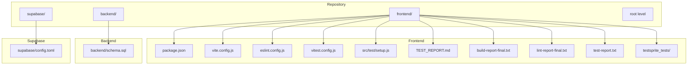
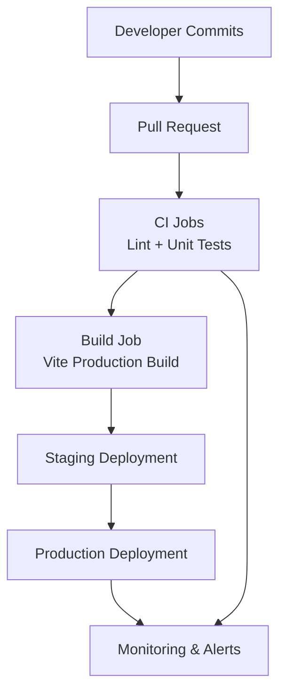
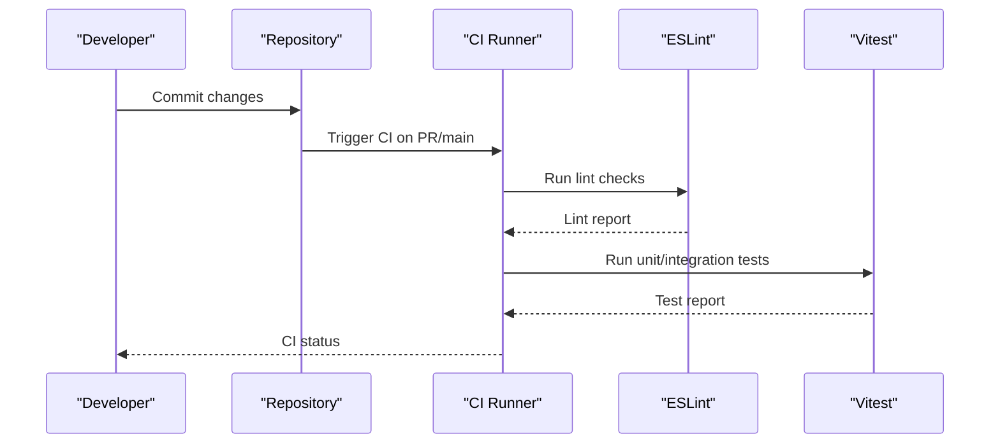
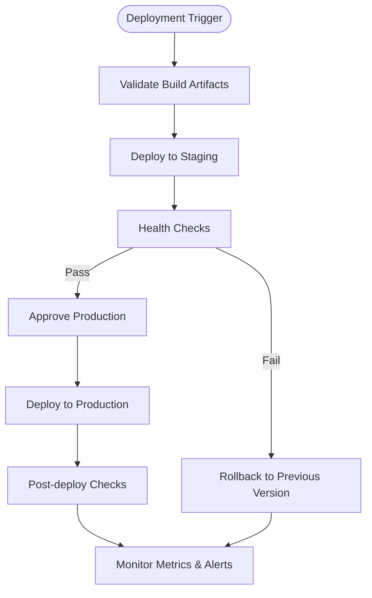
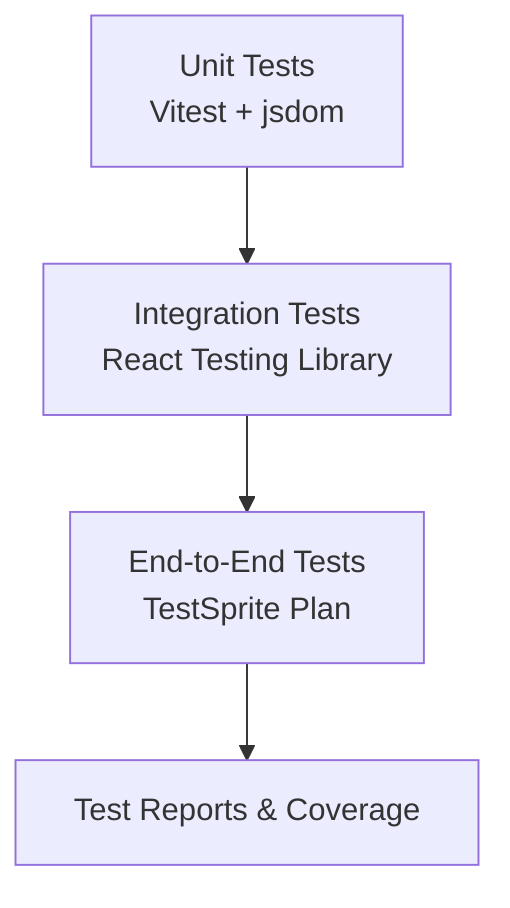
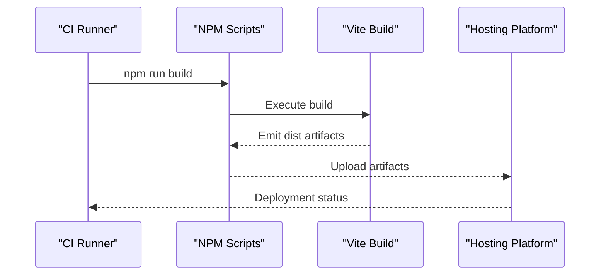
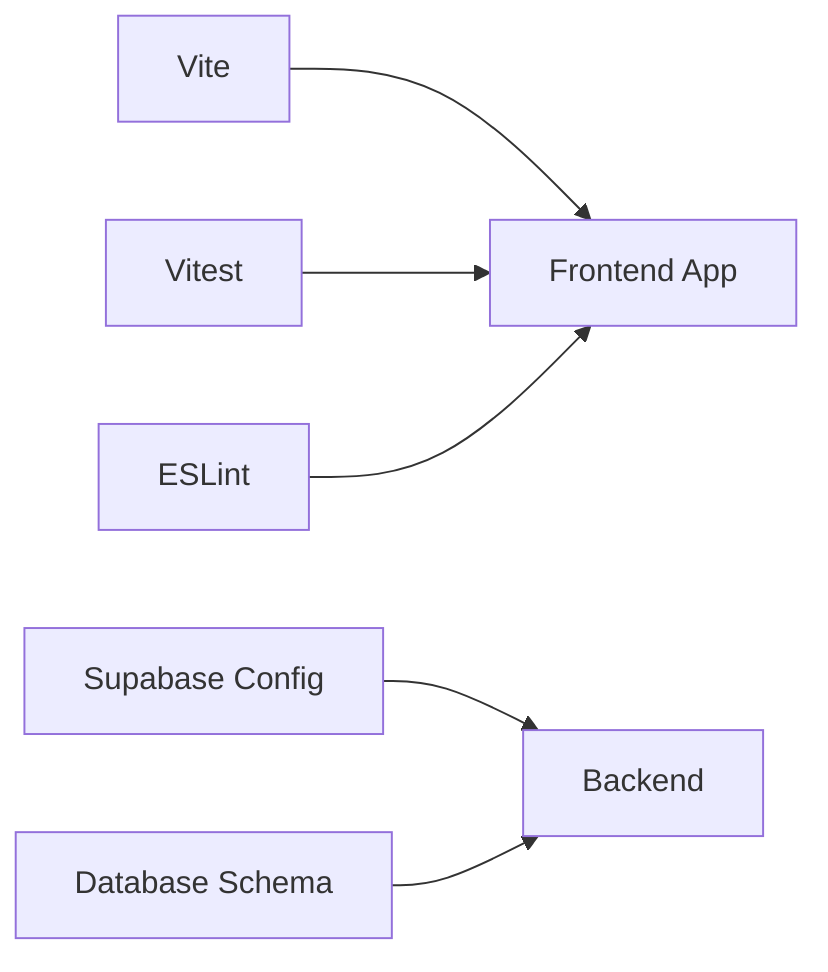

# CI/CD Pipeline

<cite>
**Referenced Files in This Document**
- [README.md](file://README.md)
- [package.json](file://frontend/package.json)
- [vite.config.js](file://frontend/vite.config.js)
- [vitest.config.js](file://frontend/vitest.config.js)
- [eslint.config.js](file://frontend/eslint.config.js)
- [setup.js](file://frontend/src/test/setup.js)
- [TEST_REPORT.md](file://frontend/TEST_REPORT.md)
- [build-report-final.txt](file://frontend/build-report-final.txt)
- [lint-report-final.txt](file://frontend/lint-report-final.txt)
- [test-report.txt](file://frontend/test-report.txt)
- [code_summary.yaml](file://frontend/testsprite_tests/tmp/code_summary.yaml)
- [testsprite_frontend_test_plan.json](file://frontend/testsprite_tests/testsprite_frontend_test_plan.json)
- [vercel.json](file://frontend/vercel.json)
- [schema.sql](file://backend/schema.sql)
- [config.toml](file://supabase/config.toml)
</cite>

## Table of Contents
1. [Introduction](#introduction)
2. [Project Structure](#project-structure)
3. [Core Components](#core-components)
4. [Architecture Overview](#architecture-overview)
5. [Detailed Component Analysis](#detailed-component-analysis)
6. [Dependency Analysis](#dependency-analysis)
7. [Performance Considerations](#performance-considerations)
8. [Troubleshooting Guide](#troubleshooting-guide)
9. [Conclusion](#conclusion)
10. [Appendices](#appendices)

## Introduction
This document describes the CI/CD pipeline for MedVita’s automated deployment workflow. It covers continuous integration (automated testing, code quality checks, and security scanning), continuous deployment to staging and production environments, automated testing integration (unit, integration, and end-to-end), deployment automation scripts, environment promotion strategies, rollback procedures, monitoring and alerting, pipeline optimization, parallel execution strategies, and artifact management. The content is derived from the repository’s frontend tooling, configuration files, and test artifacts.

## Project Structure
The repository follows a frontend-first structure with a React/Vite application, Supabase backend configuration, and test-related artifacts. The CI/CD pipeline leverages the existing scripts and configurations present in the repository.

**Diagram sources**
- [package.json](file://frontend/package.json#L1-L50)
- [vite.config.js](file://frontend/vite.config.js#L1-L33)
- [eslint.config.js](file://frontend/eslint.config.js#L1-L30)
- [vitest.config.js](file://frontend/vitest.config.js#L1-L19)
- [setup.js](file://frontend/src/test/setup.js#L1-L2)
- [TEST_REPORT.md](file://frontend/TEST_REPORT.md#L1-L186)
- [build-report-final.txt](file://frontend/build-report-final.txt#L1-L19)
- [lint-report-final.txt](file://frontend/lint-report-final.txt#L1-L5)
- [test-report.txt](file://frontend/test-report.txt#L1-L13)
- [code_summary.yaml](file://frontend/testsprite_tests/tmp/code_summary.yaml#L1-L290)
- [schema.sql](file://backend/schema.sql)
- [config.toml](file://supabase/config.toml)

**Section sources**
- [README.md](file://README.md#L1-L89)
- [package.json](file://frontend/package.json#L1-L50)

## Core Components
- Build and packaging: Vite configuration defines build outputs, chunking strategy, and sourcemap settings.
- Testing: Vitest is configured for unit/integration testing with a jsdom environment and custom setup.
- Code quality: ESLint configuration enforces recommended rules and React-specific hooks and refresh plugins.
- Artifacts: Build reports, lint reports, and test reports are generated during local runs and can be integrated into CI/CD pipelines.
- Test plans and coverage: TestSprite test plan and code summary outline routes, features, and API interactions for end-to-end scenarios.

**Section sources**
- [vite.config.js](file://frontend/vite.config.js#L1-L33)
- [vitest.config.js](file://frontend/vitest.config.js#L1-L19)
- [eslint.config.js](file://frontend/eslint.config.js#L1-L30)
- [setup.js](file://frontend/src/test/setup.js#L1-L2)
- [TEST_REPORT.md](file://frontend/TEST_REPORT.md#L1-L186)
- [build-report-final.txt](file://frontend/build-report-final.txt#L1-L19)
- [lint-report-final.txt](file://frontend/lint-report-final.txt#L1-L5)
- [test-report.txt](file://frontend/test-report.txt#L1-L13)
- [code_summary.yaml](file://frontend/testsprite_tests/tmp/code_summary.yaml#L1-L290)
- [testsprite_frontend_test_plan.json](file://frontend/testsprite_tests/testsprite_frontend_test_plan.json#L1-L800)

## Architecture Overview
The CI/CD pipeline architecture integrates repository scripts and configurations with external CI/CD platforms. The flow includes triggering jobs on pull requests and main branch pushes, running linting and tests, building the frontend, and deploying to staging and production environments. Supabase configuration and database schema inform backend readiness for deployments.

[No sources needed since this diagram shows conceptual workflow, not actual code structure]

## Detailed Component Analysis

### Continuous Integration (CI) Setup
- Automated testing:
  - Unit/integration tests are executed via Vitest with a jsdom environment and a custom setup file.
  - Test exclusion patterns prevent running tests in trash directories and config files.
- Code quality checks:
  - ESLint enforces recommended rules and React-specific plugins for hooks and refresh.
- Security scanning:
  - Dependency audits and lockfile integrity can be added to CI using standard commands.

**Diagram sources**
- [eslint.config.js](file://frontend/eslint.config.js#L1-L30)
- [vitest.config.js](file://frontend/vitest.config.js#L1-L19)
- [setup.js](file://frontend/src/test/setup.js#L1-L2)

**Section sources**
- [eslint.config.js](file://frontend/eslint.config.js#L1-L30)
- [vitest.config.js](file://frontend/vitest.config.js#L1-L19)
- [setup.js](file://frontend/src/test/setup.js#L1-L2)
- [TEST_REPORT.md](file://frontend/TEST_REPORT.md#L1-L186)

### Continuous Deployment (CD) Pipeline
- Staging and production environments:
  - Staging deployment can be triggered on successful PR merges.
  - Production deployment can be gated by manual approval or automated criteria.
- Deployment targets:
  - Frontend builds are produced by Vite and can be deployed to static hosting or CDN.
  - Backend readiness is governed by Supabase configuration and database schema.
- Environment promotion:
  - Promotion from staging to production can be automated after health checks and approvals.
- Rollback procedures:
  - Maintain previous build artifacts and reverse deployment to the last known good version.

[No sources needed since this diagram shows conceptual workflow, not actual code structure]

### Automated Testing Integration
- Unit tests:
  - Vitest configuration supports jsdom environment and custom setup.
  - Exclusions prevent unintended test execution in specific directories.
- Integration tests:
  - Can leverage Vitest with component-level tests using React Testing Library.
- End-to-end tests:
  - TestSprite outlines routes, features, and API interactions suitable for E2E test frameworks.
  - The test plan includes multiple test cases covering user flows and validations.

**Diagram sources**
- [vitest.config.js](file://frontend/vitest.config.js#L1-L19)
- [setup.js](file://frontend/src/test/setup.js#L1-L2)
- [testsprite_frontend_test_plan.json](file://frontend/testsprite_tests/testsprite_frontend_test_plan.json#L1-L800)

**Section sources**
- [vitest.config.js](file://frontend/vitest.config.js#L1-L19)
- [setup.js](file://frontend/src/test/setup.js#L1-L2)
- [code_summary.yaml](file://frontend/testsprite_tests/tmp/code_summary.yaml#L1-L290)
- [testsprite_frontend_test_plan.json](file://frontend/testsprite_tests/testsprite_frontend_test_plan.json#L1-L800)

### Deployment Automation Scripts
- Build script:
  - Vite build produces optimized assets and HTML with configurable chunking.
- Artifact generation:
  - Build reports and lint reports provide insights for CI/CD integration.
- Environment configuration:
  - Vercel configuration can be used for frontend deployment orchestration.

**Diagram sources**
- [package.json](file://frontend/package.json#L1-L50)
- [vite.config.js](file://frontend/vite.config.js#L1-L33)
- [build-report-final.txt](file://frontend/build-report-final.txt#L1-L19)
- [vercel.json](file://frontend/vercel.json)

**Section sources**
- [package.json](file://frontend/package.json#L1-L50)
- [vite.config.js](file://frontend/vite.config.js#L1-L33)
- [build-report-final.txt](file://frontend/build-report-final.txt#L1-L19)
- [vercel.json](file://frontend/vercel.json)

### Environment Promotion and Rollback
- Promotion:
  - Gate deployments with health checks and approvals.
  - Use immutable artifact tagging to track releases.
- Rollback:
  - Store previous build artifacts and redeploy on failure.
  - Maintain versioned deployment manifests for quick reversions.

[No sources needed since this section provides general guidance]

### Monitoring and Alerting
- Pipeline failures:
  - Integrate notifications on CI job failures.
- Deployment health checks:
  - Validate frontend build integrity and runtime behavior post-deployment.
- Performance metrics:
  - Track build times, bundle sizes, and runtime performance indicators.

[No sources needed since this section provides general guidance]

## Dependency Analysis
- Internal dependencies:
  - Frontend build depends on Vite, React, and Tailwind plugins.
  - Testing depends on Vitest and React Testing Library.
  - Code quality depends on ESLint and React plugins.
- External dependencies:
  - Supabase backend configuration and database schema influence deployment readiness.

**Diagram sources**
- [vite.config.js](file://frontend/vite.config.js#L1-L33)
- [vitest.config.js](file://frontend/vitest.config.js#L1-L19)
- [eslint.config.js](file://frontend/eslint.config.js#L1-L30)
- [config.toml](file://supabase/config.toml)
- [schema.sql](file://backend/schema.sql)

**Section sources**
- [vite.config.js](file://frontend/vite.config.js#L1-L33)
- [vitest.config.js](file://frontend/vitest.config.js#L1-L19)
- [eslint.config.js](file://frontend/eslint.config.js#L1-L30)
- [config.toml](file://supabase/config.toml)
- [schema.sql](file://backend/schema.sql)

## Performance Considerations
- Bundle size and chunking:
  - Manual chunking groups vendor libraries; consider dynamic imports for route-based code splitting.
- Build performance:
  - Optimize chunk size limits and monitor build times.
- Test performance:
  - Parallelize tests where possible and avoid unnecessary setup overhead.

[No sources needed since this section provides general guidance]

## Troubleshooting Guide
- Missing test files:
  - Vitest reports no test files found; ensure test files follow naming conventions and are not excluded.
- Linting issues:
  - Zero lint errors were reported locally; ensure CI mirrors the same lint configuration.
- Build warnings:
  - Large chunk sizes detected; consider implementing code splitting strategies.

**Section sources**
- [test-report.txt](file://frontend/test-report.txt#L1-L13)
- [lint-report-final.txt](file://frontend/lint-report-final.txt#L1-L5)
- [build-report-final.txt](file://frontend/build-report-final.txt#L1-L19)
- [TEST_REPORT.md](file://frontend/TEST_REPORT.md#L1-L186)

## Conclusion
MedVita’s repository provides a solid foundation for CI/CD automation through existing scripts and configurations. By integrating ESLint, Vitest, and Vite with a CI/CD platform, teams can automate linting, testing, building, and deploying the frontend while aligning backend readiness with Supabase configuration and database schema. Extending the pipeline with E2E testing via the TestSprite plan, robust monitoring, and optimized build strategies will further strengthen reliability and performance.

[No sources needed since this section summarizes without analyzing specific files]

## Appendices
- TestSprite test plan and code summary outline comprehensive user flows and API interactions for E2E coverage.
- Vercel configuration supports frontend deployment orchestration.

**Section sources**
- [testsprite_frontend_test_plan.json](file://frontend/testsprite_tests/testsprite_frontend_test_plan.json#L1-L800)
- [code_summary.yaml](file://frontend/testsprite_tests/tmp/code_summary.yaml#L1-L290)
- [vercel.json](file://frontend/vercel.json)