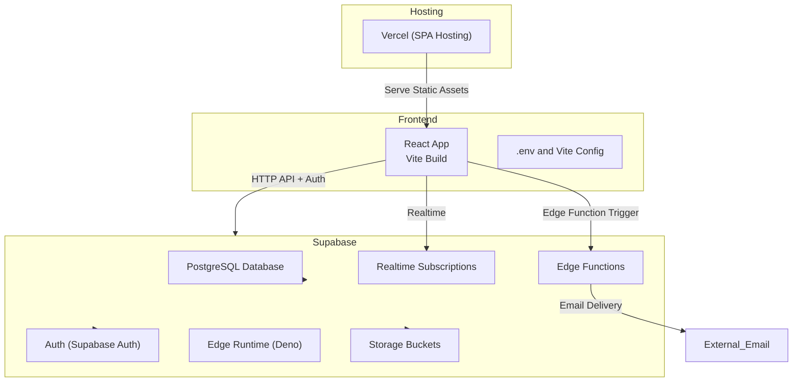
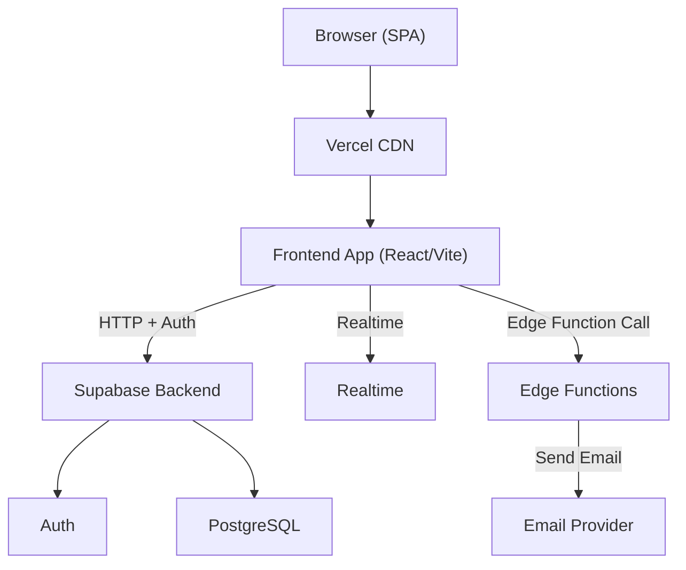
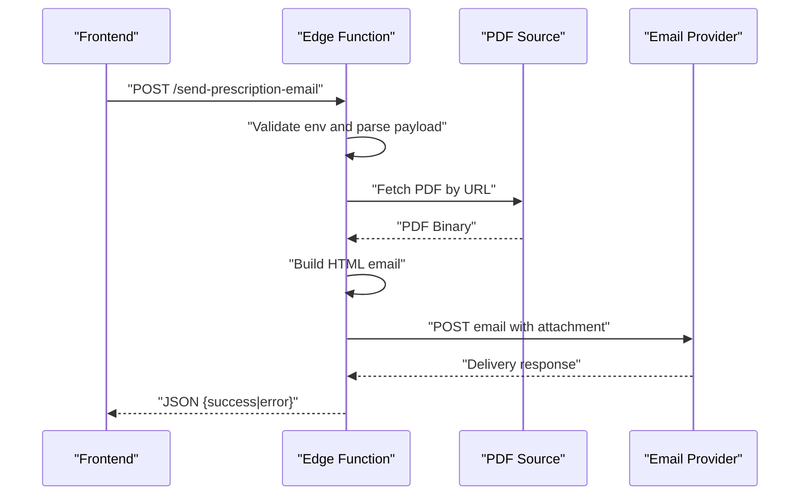
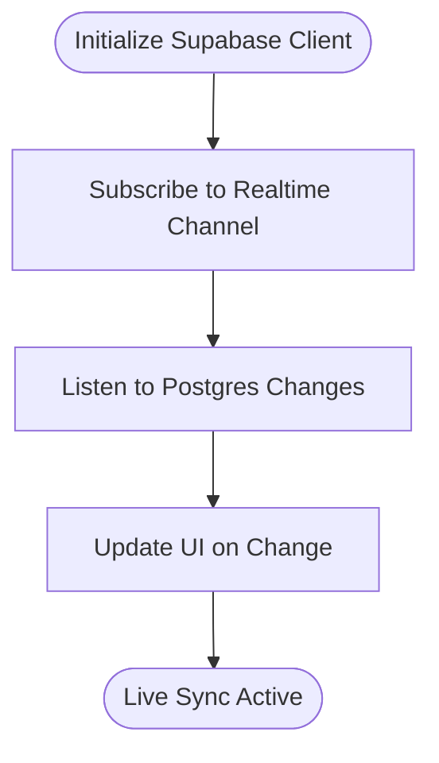
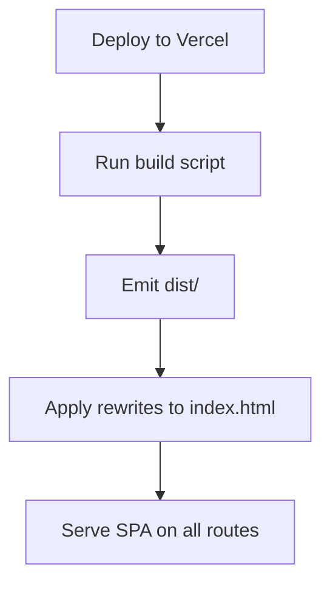
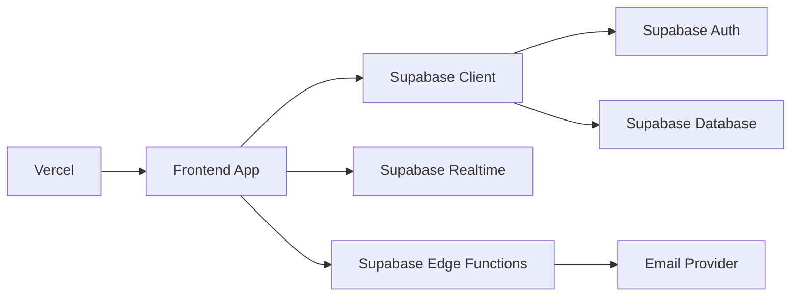

# Cloud Deployment

<cite>
**Referenced Files in This Document**
- [README.md](file://README.md)
- [supabase/config.toml](file://supabase/config.toml)
- [supabase/functions/send-prescription-email/index.ts](file://supabase/functions/send-prescription-email/index.ts)
- [backend/schema.sql](file://backend/schema.sql)
- [_trash/SUPABASE_SETUP.md](file://_trash/SUPABASE_SETUP.md)
- [frontend/vercel.json](file://frontend/vercel.json)
- [frontend/package.json](file://frontend/package.json)
- [frontend/vite.config.js](file://frontend/vite.config.js)
- [frontend/src/lib/supabaseClient.js](file://frontend/src/lib/supabaseClient.js)
- [frontend/.env.example](file://frontend/.env.example)
- [frontend/GOOGLE_CALENDAR_SETUP.md](file://frontend/GOOGLE_CALENDAR_SETUP.md)
</cite>

## Table of Contents
1. [Introduction](#introduction)
2. [Project Structure](#project-structure)
3. [Core Components](#core-components)
4. [Architecture Overview](#architecture-overview)
5. [Detailed Component Analysis](#detailed-component-analysis)
6. [Dependency Analysis](#dependency-analysis)
7. [Performance Considerations](#performance-considerations)
8. [Troubleshooting Guide](#troubleshooting-guide)
9. [Conclusion](#conclusion)
10. [Appendices](#appendices)

## Introduction
This document provides comprehensive cloud deployment guidance for MedVita’s multi-cloud architecture. It covers:
- Supabase deployment: database provisioning, edge function deployment, and Realtime subscription setup
- Vercel deployment configuration: environment variables, custom domains, and SPA routing
- Edge function deployment workflow for email automation and serverless processing
- Environment variable management across stages, SSL and CDN considerations
- Deployment verification, health checks, and rollback mechanisms
- Cost optimization, monitoring, and scaling recommendations for production

## Project Structure
MedVita is organized into three primary areas:
- Frontend (React + Vite) with Supabase client integration
- Backend (PostgreSQL schema and policies)
- Supabase Edge Functions (Deno runtime)

**Diagram sources**
- [frontend/vite.config.js](file://frontend/vite.config.js#L1-L33)
- [supabase/config.toml](file://supabase/config.toml#L1-L385)
- [supabase/functions/send-prescription-email/index.ts](file://supabase/functions/send-prescription-email/index.ts#L1-L193)

**Section sources**
- [README.md](file://README.md#L16-L28)
- [frontend/vite.config.js](file://frontend/vite.config.js#L1-L33)
- [supabase/config.toml](file://supabase/config.toml#L1-L385)

## Core Components
- Supabase configuration defines API, database, realtime, studio, storage, auth, edge runtime, and analytics settings.
- Edge function implements a prescription email automation service using a third-party email delivery API.
- Frontend integrates with Supabase client and uses Vite for building and serving static assets.
- Vercel configuration enables SPA routing via rewrite rules.

Key deployment-relevant configurations:
- Supabase project ID and service toggles
- Edge runtime policy and inspector port
- Auth site URL and redirect URLs
- Realtime enabled flag
- Storage bucket creation and policies
- Vercel rewrites for SPA behavior

**Section sources**
- [supabase/config.toml](file://supabase/config.toml#L5-L385)
- [supabase/functions/send-prescription-email/index.ts](file://supabase/functions/send-prescription-email/index.ts#L1-L193)
- [frontend/vercel.json](file://frontend/vercel.json#L1-L8)
- [frontend/src/lib/supabaseClient.js](file://frontend/src/lib/supabaseClient.js#L1-L11)

## Architecture Overview
The deployment architecture combines Supabase-managed backend services with Vercel-hosted frontend assets. The frontend communicates with Supabase for authentication, database queries, and Realtime subscriptions. Edge functions handle serverless tasks such as email delivery.

**Diagram sources**
- [frontend/vercel.json](file://frontend/vercel.json#L1-L8)
- [supabase/config.toml](file://supabase/config.toml#L77-L82)
- [supabase/functions/send-prescription-email/index.ts](file://supabase/functions/send-prescription-email/index.ts#L152-L170)

## Detailed Component Analysis

### Supabase Database Provisioning
- Project identity and service toggles are defined in the Supabase configuration.
- Database schema and policies are defined in the backend SQL script.
- Supabase setup instructions provide step-by-step guidance for initializing tables, policies, and triggers.

Recommended steps:
- Initialize Supabase project and apply schema via SQL Editor or migration tooling.
- Enable Row Level Security (RLS) and enforce policies for tables.
- Seed data if applicable using seed configuration.

Verification:
- Confirm tables, policies, and triggers exist in the database.
- Test authentication and authorization flows.

**Section sources**
- [supabase/config.toml](file://supabase/config.toml#L27-L76)
- [backend/schema.sql](file://backend/schema.sql#L1-L274)
- [_trash/SUPABASE_SETUP.md](file://_trash/SUPABASE_SETUP.md#L1-L194)

### Supabase Edge Function Deployment (Email Automation)
The edge function implements a prescription email automation workflow:
- Accepts JSON payload with patient and doctor details and a PDF URL.
- Validates configuration and fetches the PDF.
- Builds a modern HTML email and sends it via a third-party email API.
- Returns structured success or error responses.

**Diagram sources**
- [supabase/functions/send-prescription-email/index.ts](file://supabase/functions/send-prescription-email/index.ts#L25-L192)

Operational notes:
- Environment variables include the email API key.
- CORS headers are configured for cross-origin requests.
- PDF attachment is optional; the function logs failures but still returns a 200-style response for idempotency.

**Section sources**
- [supabase/functions/send-prescription-email/index.ts](file://supabase/functions/send-prescription-email/index.ts#L1-L193)

### Supabase Realtime Subscription Setup
- Realtime is enabled in the Supabase configuration.
- The frontend initializes the Supabase client and subscribes to channels for live updates.

**Diagram sources**
- [supabase/config.toml](file://supabase/config.toml#L77-L82)
- [frontend/src/lib/supabaseClient.js](file://frontend/src/lib/supabaseClient.js#L1-L11)

**Section sources**
- [supabase/config.toml](file://supabase/config.toml#L77-L82)
- [frontend/src/lib/supabaseClient.js](file://frontend/src/lib/supabaseClient.js#L1-L11)

### Vercel Deployment Configuration
- SPA routing is handled via a rewrite rule that serves index.html for all routes.
- Build script and output directory are defined in the frontend package configuration.

**Diagram sources**
- [frontend/vercel.json](file://frontend/vercel.json#L1-L8)
- [frontend/package.json](file://frontend/package.json#L6-L12)

**Section sources**
- [frontend/vercel.json](file://frontend/vercel.json#L1-L8)
- [frontend/package.json](file://frontend/package.json#L6-L12)

### Environment Variable Management
- Frontend environment variables include Supabase URL and anonymous key, plus Google Calendar credentials.
- Supabase configuration supports environment variable substitution for secrets and external integrations.

Guidelines:
- Define environment variables per stage (development, staging, production).
- Use Vercel environment variables for frontend and Supabase project variables for backend.
- Keep sensitive keys out of version control.

**Section sources**
- [frontend/.env.example](file://frontend/.env.example#L1-L9)
- [supabase/config.toml](file://supabase/config.toml#L378-L384)
- [frontend/GOOGLE_CALENDAR_SETUP.md](file://frontend/GOOGLE_CALENDAR_SETUP.md#L44-L54)

### SSL Certificate Configuration and CDN Optimization
- Supabase manages backend TLS internally; ensure frontend is served over HTTPS.
- Vercel provides CDN and HTTPS termination; configure custom domains and SSL certificates through Vercel.
- Optimize asset delivery with Vercel’s global CDN and cache headers.

[No sources needed since this section provides general guidance]

### Deployment Verification, Health Checks, and Rollback
Verification checklist:
- Frontend loads and authenticates against Supabase.
- Realtime subscriptions receive updates.
- Edge function responds to requests and delivers emails.
- Storage bucket uploads succeed.

Health checks:
- Monitor Supabase dashboard metrics and logs.
- Use Vercel’s deployment logs and uptime monitoring.
- Implement basic endpoint checks for critical paths.

Rollback mechanisms:
- Vercel: redeploy previous successful commit or use branch protection.
- Supabase: revert migrations or restore from backups if available.

[No sources needed since this section provides general guidance]

## Dependency Analysis
The frontend depends on Supabase for authentication, database, and Realtime. Edge functions depend on Supabase project configuration and environment variables. Vercel hosts the frontend and proxies SPA routing.

**Diagram sources**
- [frontend/src/lib/supabaseClient.js](file://frontend/src/lib/supabaseClient.js#L1-L11)
- [supabase/config.toml](file://supabase/config.toml#L77-L82)
- [supabase/functions/send-prescription-email/index.ts](file://supabase/functions/send-prescription-email/index.ts#L152-L170)
- [frontend/vercel.json](file://frontend/vercel.json#L1-L8)

**Section sources**
- [frontend/src/lib/supabaseClient.js](file://frontend/src/lib/supabaseClient.js#L1-L11)
- [supabase/config.toml](file://supabase/config.toml#L77-L82)
- [supabase/functions/send-prescription-email/index.ts](file://supabase/functions/send-prescription-email/index.ts#L1-L193)
- [frontend/vercel.json](file://frontend/vercel.json#L1-L8)

## Performance Considerations
- Frontend bundling: Vite’s manual chunking separates vendor libraries to improve caching.
- Edge function cold starts: minimize initialization overhead; reuse connections where possible.
- Realtime: subscribe only to necessary channels and tables to reduce bandwidth.
- Storage: leverage Supabase Storage CDN and optimize image sizes.

**Section sources**
- [frontend/vite.config.js](file://frontend/vite.config.js#L11-L26)

## Troubleshooting Guide
Common issues and resolutions:
- Missing Supabase URL or anonymous key in the frontend: ensure environment variables are set and loaded.
- Edge function crashes: inspect function logs for runtime errors and validate environment variables.
- Realtime not updating: verify channel subscriptions and network connectivity.
- Vercel SPA routing: confirm rewrite rules are applied and index.html is served for all routes.

**Section sources**
- [frontend/src/lib/supabaseClient.js](file://frontend/src/lib/supabaseClient.js#L6-L8)
- [supabase/functions/send-prescription-email/index.ts](file://supabase/functions/send-prescription-email/index.ts#L186-L191)
- [frontend/vercel.json](file://frontend/vercel.json#L2-L7)

## Conclusion
MedVita’s cloud deployment leverages Supabase for backend services and Vercel for frontend hosting. By following the outlined procedures for database provisioning, edge function deployment, Realtime setup, environment management, and CDN optimization, teams can achieve reliable, scalable, and secure operations across environments.

[No sources needed since this section summarizes without analyzing specific files]

## Appendices

### Appendix A: Supabase Configuration Reference Highlights
- Project ID and service toggles
- Edge runtime policy and inspector port
- Auth site URL and redirect URLs
- Realtime enabled flag
- Storage bucket creation and policies
- Analytics and experimental S3 settings

**Section sources**
- [supabase/config.toml](file://supabase/config.toml#L5-L385)

### Appendix B: Frontend Build and Environment Variables
- Build script and output directory
- Manual chunking for vendor libraries
- Environment variable placeholders for Supabase and Google Calendar

**Section sources**
- [frontend/package.json](file://frontend/package.json#L6-L12)
- [frontend/vite.config.js](file://frontend/vite.config.js#L11-L26)
- [frontend/.env.example](file://frontend/.env.example#L1-L9)