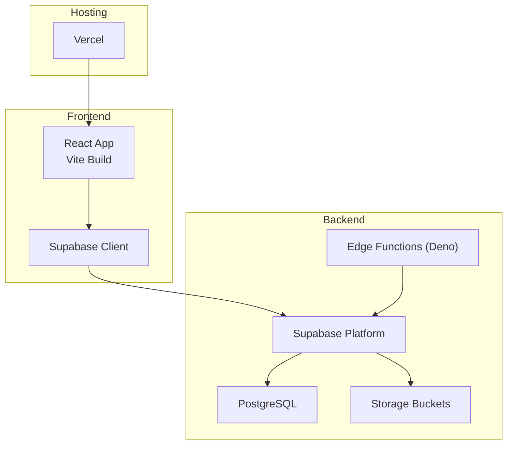
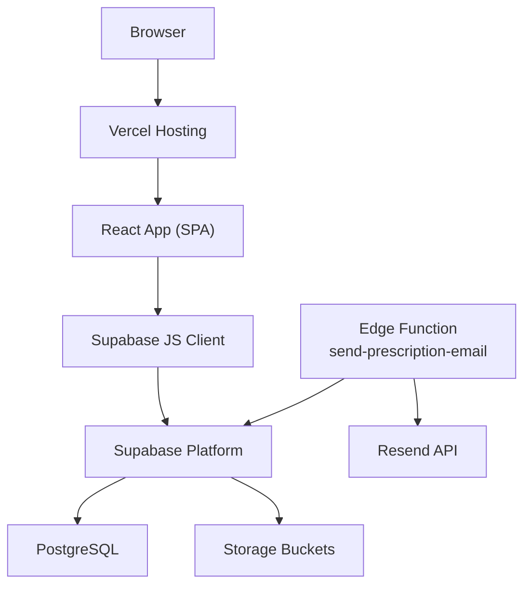
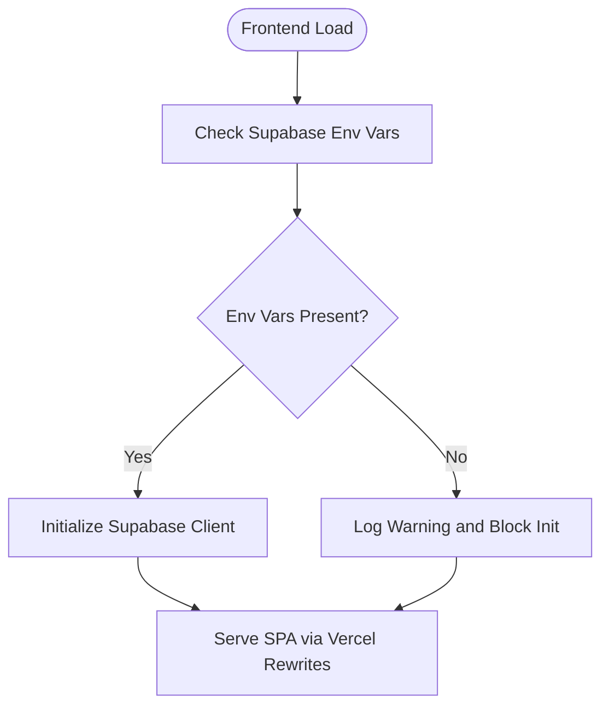
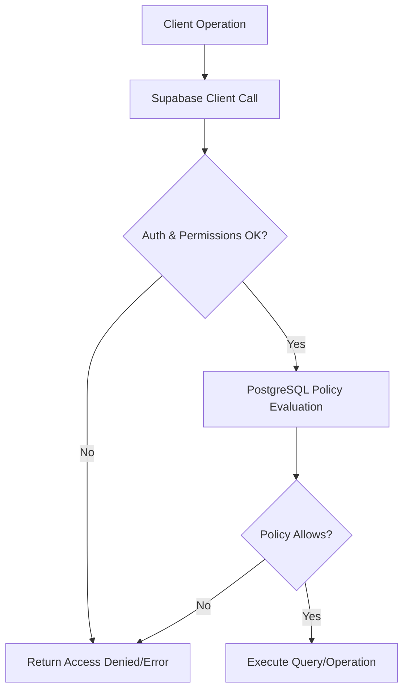
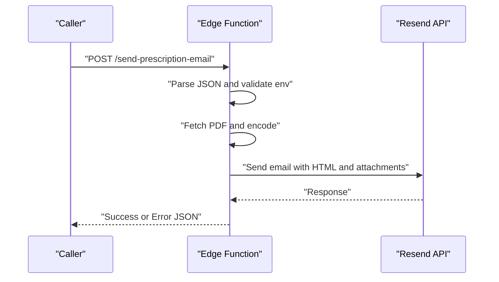
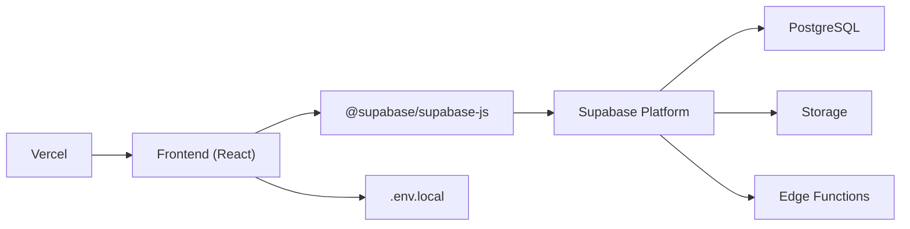

# Deployment Monitoring

<cite>
**Referenced Files in This Document**
- [README.md](file://README.md)
- [WIKI.md](file://WIKI.md)
- [package.json](file://frontend/package.json)
- [vite.config.js](file://frontend/vite.config.js)
- [eslint.config.js](file://frontend/eslint.config.js)
- [vercel.json](file://frontend/vercel.json)
- [supabaseClient.js](file://frontend/src/lib/supabaseClient.js)
- [config.toml](file://supabase/config.toml)
- [send-prescription-email/index.ts](file://supabase/functions/send-prescription-email/index.ts)
- [schema.sql](file://backend/schema.sql)
</cite>

## Table of Contents
1. [Introduction](#introduction)
2. [Project Structure](#project-structure)
3. [Core Components](#core-components)
4. [Architecture Overview](#architecture-overview)
5. [Detailed Component Analysis](#detailed-component-analysis)
6. [Dependency Analysis](#dependency-analysis)
7. [Performance Considerations](#performance-considerations)
8. [Troubleshooting Guide](#troubleshooting-guide)
9. [Conclusion](#conclusion)
10. [Appendices](#appendices)

## Introduction
This document provides comprehensive deployment monitoring guidance for the MedVita healthcare platform. It covers health checks, performance metrics, logging, alerting, dashboards, troubleshooting, and compliance considerations tailored to the current stack: React/Vite frontend, Supabase backend, and Vercel hosting. It also documents edge function execution monitoring and frontend performance metrics, and outlines strategies for robust observability and incident response.

## Project Structure
The project follows a clear separation of concerns:
- Frontend (React + Vite) with Supabase client integration
- Supabase configuration and edge functions
- Database schema and RLS policies
- Vercel deployment configuration

**Diagram sources**
- [WIKI.md](file://WIKI.md#L32-L68)
- [supabaseClient.js](file://frontend/src/lib/supabaseClient.js#L1-L11)
- [config.toml](file://supabase/config.toml#L1-L385)
- [vercel.json](file://frontend/vercel.json#L1-L8)

**Section sources**
- [WIKI.md](file://WIKI.md#L108-L169)
- [README.md](file://README.md#L16-L28)

## Core Components
- Frontend health and performance:
  - Build artifacts and chunking strategy
  - Environment variables for Supabase connectivity
  - Routing and SPA behavior for Vercel
- Backend health and edge functions:
  - Supabase configuration for edge runtime and analytics
  - Edge function for sending prescriptions via email
  - Database schema and RLS policies
- Deployment pipeline:
  - Vercel build and deploy commands
  - Supabase CLI for edge function deployments

**Section sources**
- [package.json](file://frontend/package.json#L1-L50)
- [vite.config.js](file://frontend/vite.config.js#L1-L33)
- [vercel.json](file://frontend/vercel.json#L1-L8)
- [supabaseClient.js](file://frontend/src/lib/supabaseClient.js#L1-L11)
- [config.toml](file://supabase/config.toml#L353-L362)
- [send-prescription-email/index.ts](file://supabase/functions/send-prescription-email/index.ts#L1-L193)
- [schema.sql](file://backend/schema.sql#L1-L274)

## Architecture Overview
The system architecture integrates a React frontend with Supabase backend services, including PostgreSQL, Auth, Edge Functions, and Storage. Edge functions execute in a Deno runtime and can be monitored for health and performance. Vercel hosts the static frontend assets and handles routing.

**Diagram sources**
- [WIKI.md](file://WIKI.md#L32-L68)
- [supabaseClient.js](file://frontend/src/lib/supabaseClient.js#L1-L11)
- [send-prescription-email/index.ts](file://supabase/functions/send-prescription-email/index.ts#L1-L193)
- [config.toml](file://supabase/config.toml#L353-L362)

## Detailed Component Analysis

### Frontend Health Checks and Performance Metrics
- Build and bundle health:
  - Manual chunks for vendor libraries improve caching and CDN efficiency.
  - Chunk size warnings are tuned to avoid premature alerts.
- Runtime health:
  - Supabase client initialization validates presence of required environment variables and logs warnings on missing values.
  - Vercel rewrites ensure SPA routing resolves to index.html for all routes.
- Performance metrics:
  - Track build sizes, chunk counts, and asset sizes via Vite build outputs.
  - Monitor runtime performance using browser developer tools and Lighthouse.
  - Use SPA routing metrics to detect broken deep links.

**Diagram sources**
- [supabaseClient.js](file://frontend/src/lib/supabaseClient.js#L6-L8)
- [vercel.json](file://frontend/vercel.json#L2-L7)

**Section sources**
- [vite.config.js](file://frontend/vite.config.js#L11-L26)
- [supabaseClient.js](file://frontend/src/lib/supabaseClient.js#L6-L8)
- [vercel.json](file://frontend/vercel.json#L1-L8)

### Database Connectivity Checks and RLS Health
- Connectivity:
  - Supabase client requires URL and anon key; missing values produce warnings.
  - Database connectivity is managed by Supabase; monitor via platform dashboards.
- RLS health:
  - Comprehensive RLS policies are defined for profiles, patients, appointments, and prescriptions.
  - Policies enforce role-based access and visibility rules.

**Diagram sources**
- [schema.sql](file://backend/schema.sql#L30-L43)
- [schema.sql](file://backend/schema.sql#L71-L115)
- [schema.sql](file://backend/schema.sql#L158-L198)
- [schema.sql](file://backend/schema.sql#L210-L224)

**Section sources**
- [supabaseClient.js](file://frontend/src/lib/supabaseClient.js#L6-L8)
- [schema.sql](file://backend/schema.sql#L30-L43)
- [schema.sql](file://backend/schema.sql#L71-L115)
- [schema.sql](file://backend/schema.sql#L158-L198)
- [schema.sql](file://backend/schema.sql#L210-L224)

### Edge Function Execution Monitoring (send-prescription-email)
- Function behavior:
  - Handles CORS preflight and JSON parsing.
  - Validates required secrets and returns structured errors.
  - Fetches PDF, encodes to base64, composes HTML, and sends via Resend.
  - Returns success or error responses with appropriate status codes.
- Monitoring signals:
  - Logs indicate function execution and PDF attachment attempts.
  - Error responses include human-readable messages for quick diagnosis.
  - Health tip data is embedded for content validation.

**Diagram sources**
- [send-prescription-email/index.ts](file://supabase/functions/send-prescription-email/index.ts#L25-L192)

**Section sources**
- [send-prescription-email/index.ts](file://supabase/functions/send-prescription-email/index.ts#L1-L193)

### Logging Strategies
- Supabase edge functions:
  - Use console logging for operational insights (e.g., PDF attachment attempts).
  - Centralize logs in Supabase Edge Functions logs and correlate with platform metrics.
- Vercel deployment logs:
  - Review build logs, output artifacts, and deployment status.
  - Use Vercel dashboard to inspect recent builds and errors.
- Application error tracking:
  - Integrate client-side error reporting (e.g., Sentry) to capture unhandled exceptions and performance issues.
  - Log frontend errors alongside backend errors for end-to-end correlation.

[No sources needed since this section provides general guidance]

### Alerting Mechanisms
- Deployment failures:
  - Monitor Vercel deployment status and build logs for failure events.
  - Alert on failed deploys or build timeouts.
- Performance degradation:
  - Track frontend bundle sizes and build warnings.
  - Monitor edge function latency and error rates.
- Security incidents:
  - Watch for anomalies in Supabase Auth rate limits and edge function access.
  - Alert on repeated failures or unusual request patterns.

[No sources needed since this section provides general guidance]

### Monitoring Dashboard Setup
- Supabase dashboards:
  - Use Supabase Analytics for database and edge function metrics.
  - Monitor edge runtime performance and error rates.
- Vercel dashboards:
  - Track deployment health, build times, and error rates.
- Custom metrics:
  - Export edge function durations and error counts to external monitoring systems.
  - Aggregate frontend performance metrics (LCP, FID, CLS) via browser instrumentation.

[No sources needed since this section provides general guidance]

### Automated Health Checks
- Frontend:
  - Implement SPA health checks (e.g., fetch index.html and verify critical assets).
  - Validate Supabase client initialization and environment readiness.
- Backend:
  - Use Supabase platform health checks for database and Auth.
  - Monitor edge function cold starts and warm-up patterns.
- CI/CD:
  - Add pre-deploy checks for linting, tests, and build success.

[No sources needed since this section provides general guidance]

### Troubleshooting Procedures
- Common deployment issues:
  - Missing environment variables: Verify Supabase URL and anon key in frontend.
  - Vercel routing: Confirm rewrite rules for SPA.
  - Edge function secrets: Ensure required secrets are set in Supabase.
- Rollback mechanisms:
  - Vercel: Roll back to previous successful deployment.
  - Supabase: Revert edge function changes or restore database from backups.
- Incident response workflows:
  - Isolate issue (frontend vs backend vs edge function).
  - Collect logs from Supabase, Vercel, and client-side error reporting.
  - Escalate based on severity and impact.

**Section sources**
- [supabaseClient.js](file://frontend/src/lib/supabaseClient.js#L6-L8)
- [vercel.json](file://frontend/vercel.json#L2-L7)
- [WIKI.md](file://WIKI.md#L568-L585)

### Performance Optimization Monitoring
- Frontend:
  - Monitor bundle sizes and chunk counts; optimize vendor chunking.
  - Track runtime performance using browser tools and synthetic monitoring.
- Backend:
  - Observe edge function execution time and memory usage.
  - Tune database queries and RLS policies for performance.
- Capacity planning:
  - Track edge function invocation rates and latency trends.
  - Plan Supabase resources based on concurrent users and data volume.

**Section sources**
- [vite.config.js](file://frontend/vite.config.js#L11-L26)
- [config.toml](file://supabase/config.toml#L353-L362)

### Compliance Monitoring (Healthcare Applications)
- Audit logging:
  - Maintain logs for access and modifications to protected health information.
  - Ensure logs are retained per regulatory requirements.
- Data protection metrics:
  - Monitor encryption at rest and in transit.
  - Track access patterns and enforce RBAC and RLS policies.
- Security controls:
  - Enforce strong authentication and authorization.
  - Regularly review and update policies and configurations.

[No sources needed since this section provides general guidance]

## Dependency Analysis
The frontend depends on Supabase client libraries and environment variables. Supabase manages backend services including PostgreSQL, Auth, Storage, and Edge Functions. Vercel hosts the frontend and applies SPA routing.

**Diagram sources**
- [package.json](file://frontend/package.json#L13-L31)
- [supabaseClient.js](file://frontend/src/lib/supabaseClient.js#L1-L11)
- [vercel.json](file://frontend/vercel.json#L1-L8)

**Section sources**
- [package.json](file://frontend/package.json#L13-L31)
- [supabaseClient.js](file://frontend/src/lib/supabaseClient.js#L1-L11)
- [vercel.json](file://frontend/vercel.json#L1-L8)

## Performance Considerations
- Optimize frontend bundles and chunking to reduce load times.
- Minimize edge function cold starts by keeping functions small and avoiding unnecessary dependencies.
- Monitor database query performance and refine RLS policies for efficiency.
- Use CDN and caching strategies for static assets.

[No sources needed since this section provides general guidance]

## Troubleshooting Guide
- Frontend issues:
  - Missing Supabase credentials cause initialization warnings; fix environment variables.
  - SPA routing issues resolved by verifying Vercel rewrites.
- Backend issues:
  - Edge function crashes return structured error messages; inspect logs for root cause.
  - Database permission errors indicate RLS policy misconfiguration.
- Deployment issues:
  - Vercel build failures require reviewing build logs and fixing configuration.
  - Roll back to previous deployment if necessary.

**Section sources**
- [supabaseClient.js](file://frontend/src/lib/supabaseClient.js#L6-L8)
- [vercel.json](file://frontend/vercel.json#L2-L7)
- [send-prescription-email/index.ts](file://supabase/functions/send-prescription-email/index.ts#L186-L191)
- [schema.sql](file://backend/schema.sql#L30-L43)

## Conclusion
By combining frontend health checks, backend connectivity validations, edge function monitoring, and platform-specific dashboards, MedVita can achieve robust deployment observability. Integrating logging, alerting, and compliance-focused auditing ensures reliable operations and rapid incident response.

[No sources needed since this section summarizes without analyzing specific files]

## Appendices
- Deployment commands and environment setup are documented in the project wiki and README.

**Section sources**
- [WIKI.md](file://WIKI.md#L568-L585)
- [README.md](file://README.md#L50-L75)