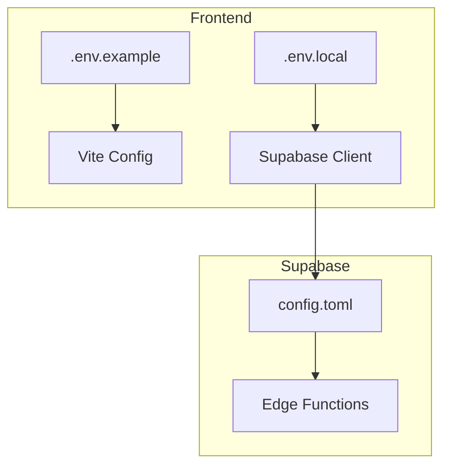
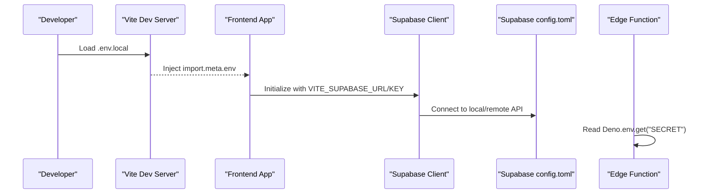
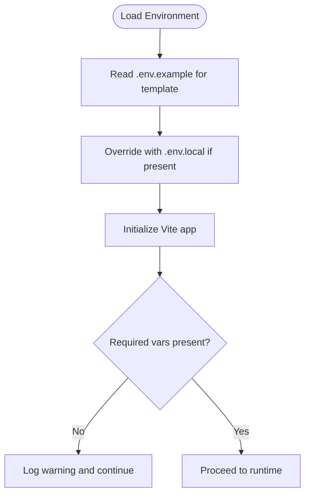
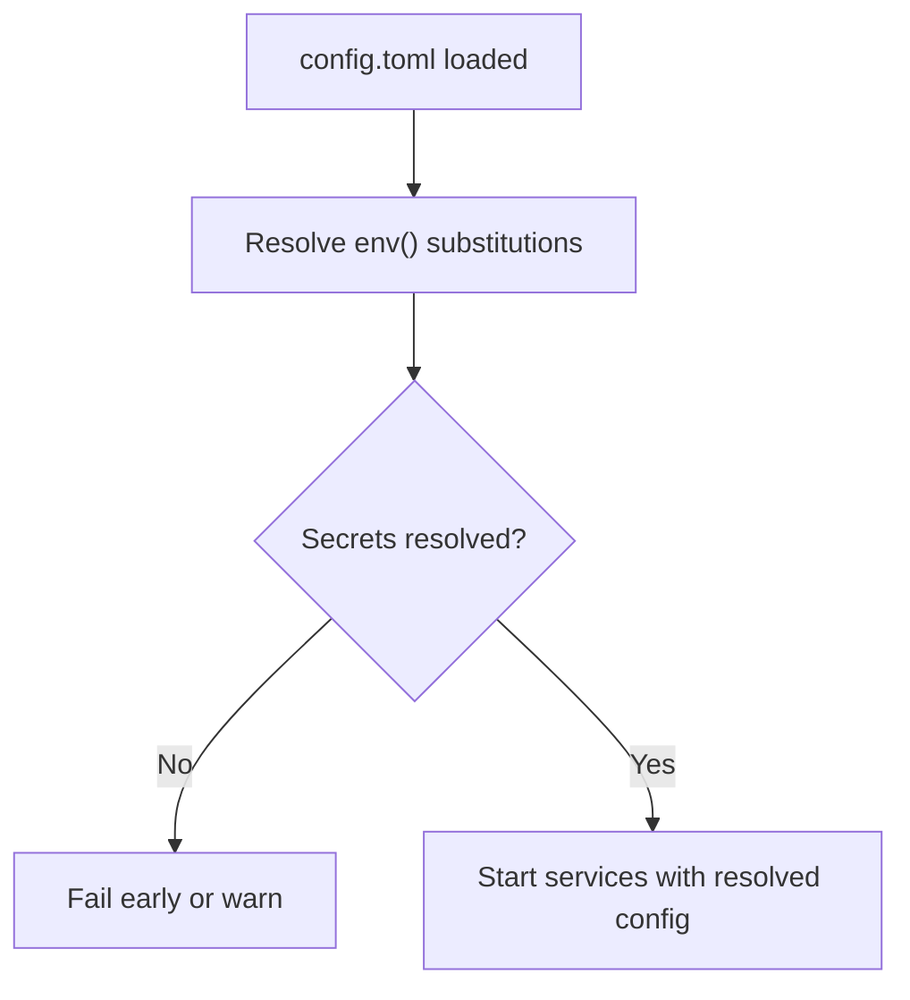
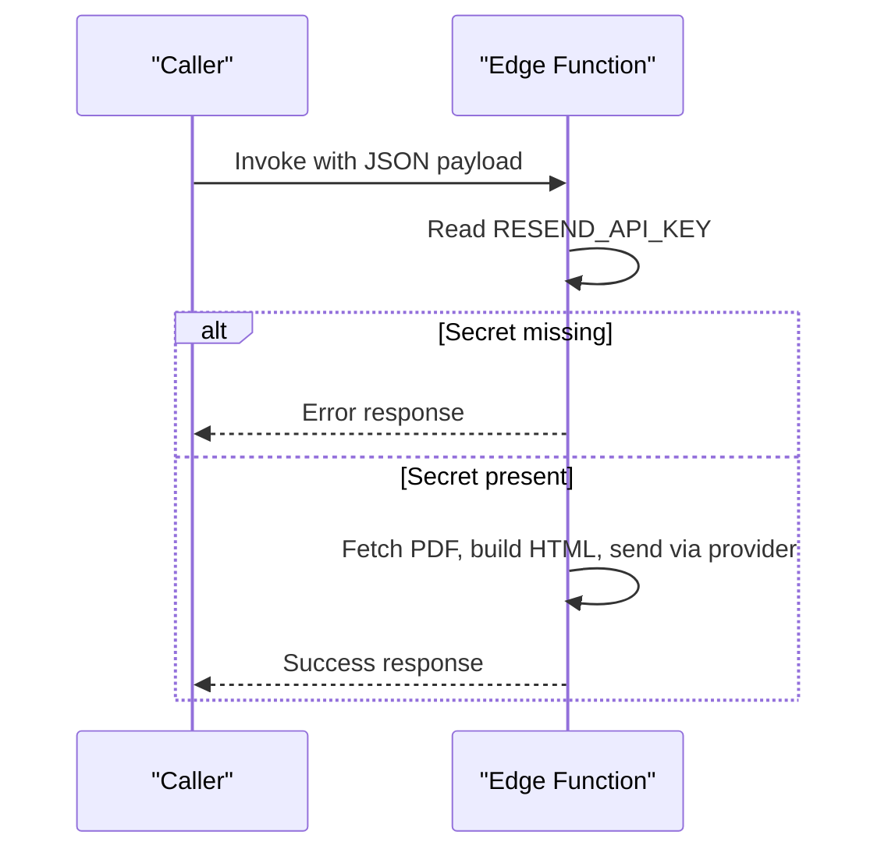
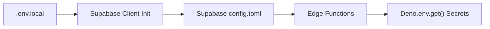

# Environment Management

<cite>
**Referenced Files in This Document**
- [frontend/.env.example](file://frontend/.env.example)
- [frontend/.env.local](file://frontend/.env.local)
- [frontend/src/lib/supabaseClient.js](file://frontend/src/lib/supabaseClient.js)
- [frontend/package.json](file://frontend/package.json)
- [frontend/vite.config.js](file://frontend/vite.config.js)
- [frontend/vercel.json](file://frontend/vercel.json)
- [supabase/config.toml](file://supabase/config.toml)
- [supabase/functions/send-prescription-email/index.ts](file://supabase/functions/send-prescription-email/index.ts)
- [frontend/testsprite_tests/tmp/code_summary.yaml](file://frontend/testsprite_tests/tmp/code_summary.yaml)
</cite>

## Table of Contents
1. [Introduction](#introduction)
2. [Project Structure](#project-structure)
3. [Core Components](#core-components)
4. [Architecture Overview](#architecture-overview)
5. [Detailed Component Analysis](#detailed-component-analysis)
6. [Dependency Analysis](#dependency-analysis)
7. [Performance Considerations](#performance-considerations)
8. [Troubleshooting Guide](#troubleshooting-guide)
9. [Conclusion](#conclusion)
10. [Appendices](#appendices)

## Introduction
This document provides comprehensive environment management guidance for the MedVita application across development, staging, and production environments. It covers frontend and backend environment variable structures, Supabase configuration, environment-specific database connections, API endpoints, and service credentials. It also details secure handling of sensitive data, secrets management, environment validation, configuration testing, feature flags, environment drift detection, and compliance considerations for healthcare data management.

## Project Structure
The environment configuration spans three primary areas:
- Frontend environment variables for Vite and Supabase client initialization
- Supabase configuration for local development and runtime behavior
- Edge/runtime secrets and environment variable substitution for Supabase Edge Functions

**Diagram sources**
- [frontend/.env.example](file://frontend/.env.example#L1-L9)
- [frontend/.env.local](file://frontend/.env.local#L1-L5)
- [frontend/vite.config.js](file://frontend/vite.config.js#L1-L33)
- [frontend/src/lib/supabaseClient.js](file://frontend/src/lib/supabaseClient.js#L1-L11)
- [supabase/config.toml](file://supabase/config.toml#L1-L385)
- [supabase/functions/send-prescription-email/index.ts](file://supabase/functions/send-prescription-email/index.ts#L1-L193)

**Section sources**
- [frontend/.env.example](file://frontend/.env.example#L1-L9)
- [frontend/.env.local](file://frontend/.env.local#L1-L5)
- [frontend/src/lib/supabaseClient.js](file://frontend/src/lib/supabaseClient.js#L1-L11)
- [supabase/config.toml](file://supabase/config.toml#L1-L385)

## Core Components
- Frontend environment variables
  - Google Calendar credentials and Supabase client keys are loaded via Vite’s import.meta.env mechanism.
  - Example variables are defined in .env.example; environment-specific overrides are placed in .env.local for local development.
- Supabase configuration
  - Local development ports, API schemas, database settings, Studio URL, and Edge Runtime settings are configured in config.toml.
  - Environment variable substitution is used for secrets such as SMTP keys, OAuth secrets, and cloud storage credentials.
- Edge Functions
  - Supabase Edge Functions can read secrets via Deno.env.get(), enabling secure access to provider APIs without embedding credentials in source.

**Section sources**
- [frontend/.env.example](file://frontend/.env.example#L1-L9)
- [frontend/.env.local](file://frontend/.env.local#L1-L5)
- [frontend/src/lib/supabaseClient.js](file://frontend/src/lib/supabaseClient.js#L1-L11)
- [supabase/config.toml](file://supabase/config.toml#L1-L385)
- [supabase/functions/send-prescription-email/index.ts](file://supabase/functions/send-prescription-email/index.ts#L31-L46)

## Architecture Overview
The environment architecture ties frontend configuration to Supabase runtime behavior and Edge Function secrets.

**Diagram sources**
- [frontend/.env.local](file://frontend/.env.local#L1-L5)
- [frontend/src/lib/supabaseClient.js](file://frontend/src/lib/supabaseClient.js#L3-L10)
- [supabase/config.toml](file://supabase/config.toml#L84-L91)
- [supabase/functions/send-prescription-email/index.ts](file://supabase/functions/send-prescription-email/index.ts#L31-L46)

## Detailed Component Analysis

### Frontend Environment Variables (.env.example and .env.local)
- Purpose
  - Define non-sensitive configuration for development and sensitive overrides for local use.
- Structure
  - Google Calendar client ID and API key for calendar integrations.
  - Supabase URL and anonymous key for client initialization.
- Best Practices
  - Keep .env.local out of version control; use .env.example as the authoritative template.
  - Validate presence of required variables at startup and log warnings if missing.

**Diagram sources**
- [frontend/.env.example](file://frontend/.env.example#L1-L9)
- [frontend/.env.local](file://frontend/.env.local#L1-L5)
- [frontend/src/lib/supabaseClient.js](file://frontend/src/lib/supabaseClient.js#L6-L8)

**Section sources**
- [frontend/.env.example](file://frontend/.env.example#L1-L9)
- [frontend/.env.local](file://frontend/.env.local#L1-L5)
- [frontend/src/lib/supabaseClient.js](file://frontend/src/lib/supabaseClient.js#L1-L11)

### Supabase Configuration (config.toml)
- Purpose
  - Centralized configuration for local development, including API ports, database settings, Studio URL, and Edge Runtime behavior.
- Secrets Management
  - Uses environment variable substitution for secrets such as SMTP credentials, OAuth provider secrets, and cloud storage keys.
- Edge Runtime Secrets
  - Edge Runtime supports a dedicated secrets section for secure function secrets.

**Diagram sources**
- [supabase/config.toml](file://supabase/config.toml#L91-L91)
- [supabase/config.toml](file://supabase/config.toml#L273-L273)
- [supabase/config.toml](file://supabase/config.toml#L382-L384)

**Section sources**
- [supabase/config.toml](file://supabase/config.toml#L1-L385)

### Edge Function Secrets (send-prescription-email)
- Purpose
  - Demonstrate secure retrieval of secrets via Deno.env.get() for provider APIs.
- Validation
  - Validates presence of required secrets and returns structured error responses if missing.

**Diagram sources**
- [supabase/functions/send-prescription-email/index.ts](file://supabase/functions/send-prescription-email/index.ts#L31-L46)
- [supabase/functions/send-prescription-email/index.ts](file://supabase/functions/send-prescription-email/index.ts#L152-L170)

**Section sources**
- [supabase/functions/send-prescription-email/index.ts](file://supabase/functions/send-prescription-email/index.ts#L1-L193)

### Environment-Specific Database Connections and API Endpoints
- Frontend
  - Supabase client initializes using VITE_SUPABASE_URL and VITE_SUPABASE_ANON_KEY.
- Backend (Supabase)
  - API ports and Studio URL are configurable; Studio api_url can be overridden for local development.
- CI/CD
  - Environment variables are typically injected by CI/CD systems; ensure parity with local .env.local and config.toml.

**Section sources**
- [frontend/src/lib/supabaseClient.js](file://frontend/src/lib/supabaseClient.js#L3-L10)
- [supabase/config.toml](file://supabase/config.toml#L84-L91)

### Feature Flags and Environment Switching
- Feature flags can be toggled via environment variables or centralized configuration.
- Recommended approach:
  - Define flags in .env.example and override per environment in .env.local or CI/CD secrets.
  - Gate feature activation in code using environment checks.

**Section sources**
- [frontend/.env.example](file://frontend/.env.example#L1-L9)
- [frontend/.env.local](file://frontend/.env.local#L1-L5)

### Local Development Setup
- Steps
  - Copy .env.example to .env.local and populate values.
  - Start Supabase locally using config.toml; confirm Studio URL and ports.
  - Launch Vite dev server; verify Supabase client initialization logs.
- Validation
  - Confirm Supabase URL and key presence; check for warnings if missing.

**Section sources**
- [frontend/.env.local](file://frontend/.env.local#L1-L5)
- [frontend/src/lib/supabaseClient.js](file://frontend/src/lib/supabaseClient.js#L6-L8)
- [supabase/config.toml](file://supabase/config.toml#L84-L91)

### CI/CD Pipeline Environment Configuration
- Guidance
  - Inject environment variables at build and deploy stages.
  - Use separate secrets for each environment (development, staging, production).
  - Ensure Vite build-time variables are properly substituted during build.
- Static Hosting
  - Vercel rewrites are configured for SPA routing; ensure environment variables are available at runtime.

**Section sources**
- [frontend/package.json](file://frontend/package.json#L6-L11)
- [frontend/vercel.json](file://frontend/vercel.json#L1-L8)

### Environment Validation and Configuration Testing
- Frontend
  - Validate required variables at startup; log warnings if missing.
- Supabase
  - Use config.toml to validate service ports and Studio URL.
- Edge Functions
  - Validate presence of required secrets before proceeding with operations.

**Section sources**
- [frontend/src/lib/supabaseClient.js](file://frontend/src/lib/supabaseClient.js#L6-L8)
- [supabase/config.toml](file://supabase/config.toml#L84-L91)
- [supabase/functions/send-prescription-email/index.ts](file://supabase/functions/send-prescription-email/index.ts#L41-L46)

### Secrets Management, Rotation, and Access Control
- Secrets Management
  - Use environment variable substitution in config.toml for secrets.
  - Store provider API keys in Edge Function secrets via Deno.env.get().
- Rotation
  - Rotate secrets in CI/CD secrets stores; update config.toml and Edge Function secrets accordingly.
- Access Control
  - Restrict access to secrets to authorized personnel and CI/CD roles only.

**Section sources**
- [supabase/config.toml](file://supabase/config.toml#L221-L221)
- [supabase/config.toml](file://supabase/config.toml#L305-L305)
- [supabase/config.toml](file://supabase/config.toml#L382-L384)
- [supabase/functions/send-prescription-email/index.ts](file://supabase/functions/send-prescription-email/index.ts#L31-L46)

### Environment Drift Detection and Configuration Auditing
- Drift Detection
  - Compare .env.local across environments against .env.example.
  - Audit config.toml across environments for port and URL changes.
- Auditing
  - Maintain change logs for environment variables and secrets.
  - Review CI/CD deployment logs for environment variable usage.

**Section sources**
- [frontend/.env.example](file://frontend/.env.example#L1-L9)
- [frontend/.env.local](file://frontend/.env.local#L1-L5)
- [supabase/config.toml](file://supabase/config.toml#L1-L385)

### Compliance Requirements for Healthcare Data Management
- HIPAA and Similar Regulations
  - Encrypt at rest and in transit; restrict access to PHI.
  - Maintain audit logs for data access and modifications.
  - Use secure secrets management and avoid logging sensitive data.
- Recommendations
  - Enforce HTTPS endpoints in config.toml and API configurations.
  - Limit exposure of database and API ports; use network restrictions where available.
  - Regularly review and rotate secrets; enforce least privilege access.

**Section sources**
- [supabase/config.toml](file://supabase/config.toml#L20-L25)
- [supabase/config.toml](file://supabase/config.toml#L67-L75)

## Dependency Analysis
The frontend depends on environment variables for Supabase client initialization, while Supabase services depend on config.toml and environment variable substitution. Edge Functions depend on secrets injected at runtime.

**Diagram sources**
- [frontend/.env.local](file://frontend/.env.local#L1-L5)
- [frontend/src/lib/supabaseClient.js](file://frontend/src/lib/supabaseClient.js#L3-L10)
- [supabase/config.toml](file://supabase/config.toml#L1-L385)
- [supabase/functions/send-prescription-email/index.ts](file://supabase/functions/send-prescription-email/index.ts#L31-L46)

**Section sources**
- [frontend/src/lib/supabaseClient.js](file://frontend/src/lib/supabaseClient.js#L1-L11)
- [supabase/config.toml](file://supabase/config.toml#L1-L385)
- [supabase/functions/send-prescription-email/index.ts](file://supabase/functions/send-prescription-email/index.ts#L1-L193)

## Performance Considerations
- Minimize environment variable overhead by consolidating configuration and avoiding excessive runtime checks.
- Prefer static configuration for non-sensitive values; keep secrets in environment variables only.
- Use CDN and caching appropriately; ensure environment-specific endpoints are optimized.

## Troubleshooting Guide
- Missing Supabase URL or Key
  - Symptom: Warning logs during client initialization.
  - Action: Populate .env.local with VITE_SUPABASE_URL and VITE_SUPABASE_ANON_KEY.
- Edge Function Secret Missing
  - Symptom: Function returns configuration error indicating missing secret.
  - Action: Set the required secret in Edge Function secrets and redeploy.
- Supabase Studio URL Misconfiguration
  - Symptom: Studio unreachable or incorrect routing.
  - Action: Verify studio.api_url and port in config.toml.

**Section sources**
- [frontend/src/lib/supabaseClient.js](file://frontend/src/lib/supabaseClient.js#L6-L8)
- [supabase/functions/send-prescription-email/index.ts](file://supabase/functions/send-prescription-email/index.ts#L41-L46)
- [supabase/config.toml](file://supabase/config.toml#L84-L91)

## Conclusion
Effective environment management in MedVita requires clear separation of sensitive data from code, robust secrets handling, and strict validation across environments. By leveraging .env.example and .env.local for frontend configuration, config.toml for Supabase runtime behavior, and Edge Function secrets for provider credentials, teams can maintain secure, auditable, and compliant deployments across development, staging, and production.

## Appendices
- Environment Variable Reference
  - Frontend: VITE_SUPABASE_URL, VITE_SUPABASE_ANON_KEY, VITE_GOOGLE_CLIENT_ID, VITE_GOOGLE_API_KEY, VITE_GEMINI_API_KEY
  - Supabase: SMTP, OAuth provider secrets, cloud storage keys via env() substitution
  - Edge Functions: Provider API keys via Deno.env.get()

**Section sources**
- [frontend/.env.example](file://frontend/.env.example#L1-L9)
- [frontend/.env.local](file://frontend/.env.local#L1-L5)
- [supabase/config.toml](file://supabase/config.toml#L221-L221)
- [supabase/config.toml](file://supabase/config.toml#L305-L305)
- [supabase/config.toml](file://supabase/config.toml#L382-L384)
- [supabase/functions/send-prescription-email/index.ts](file://supabase/functions/send-prescription-email/index.ts#L31-L46)