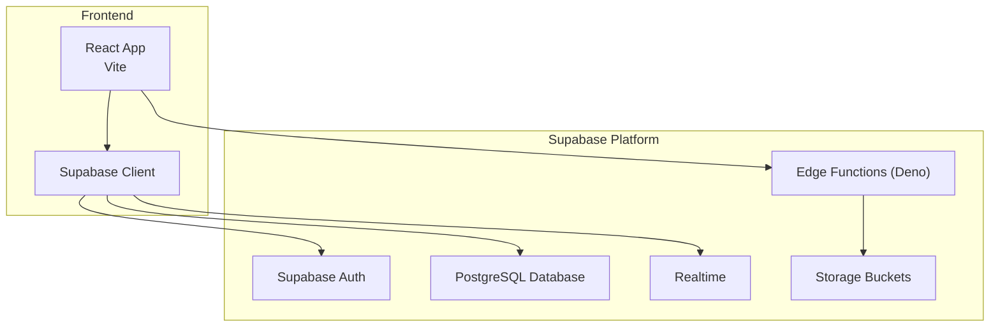
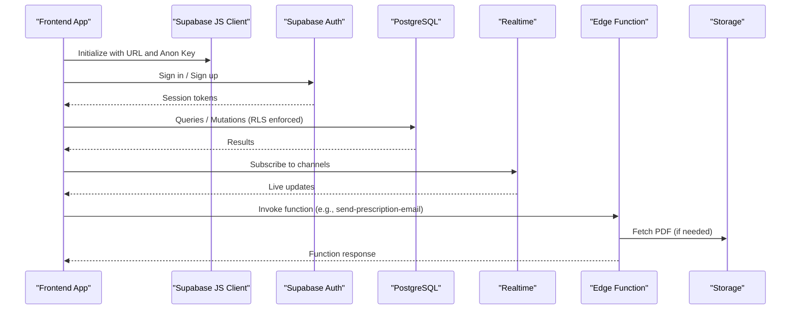
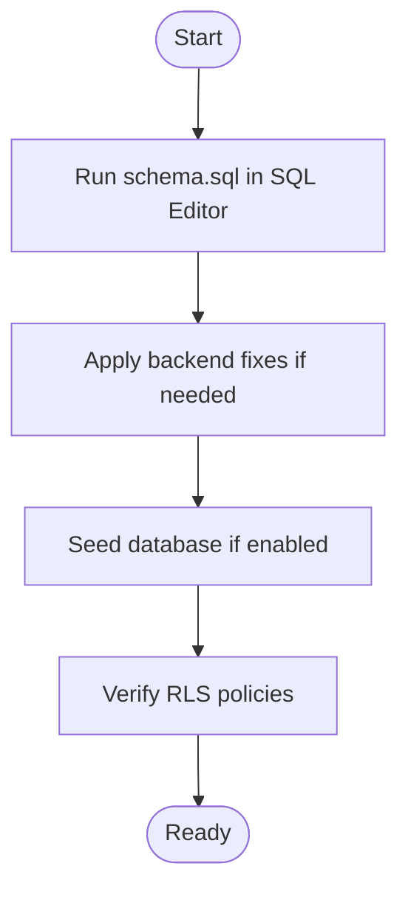
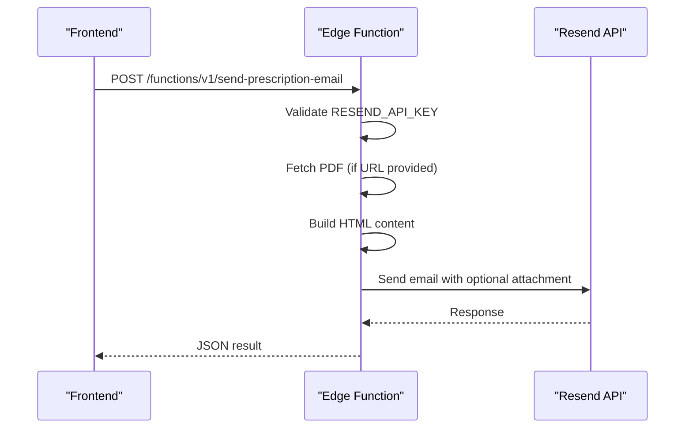
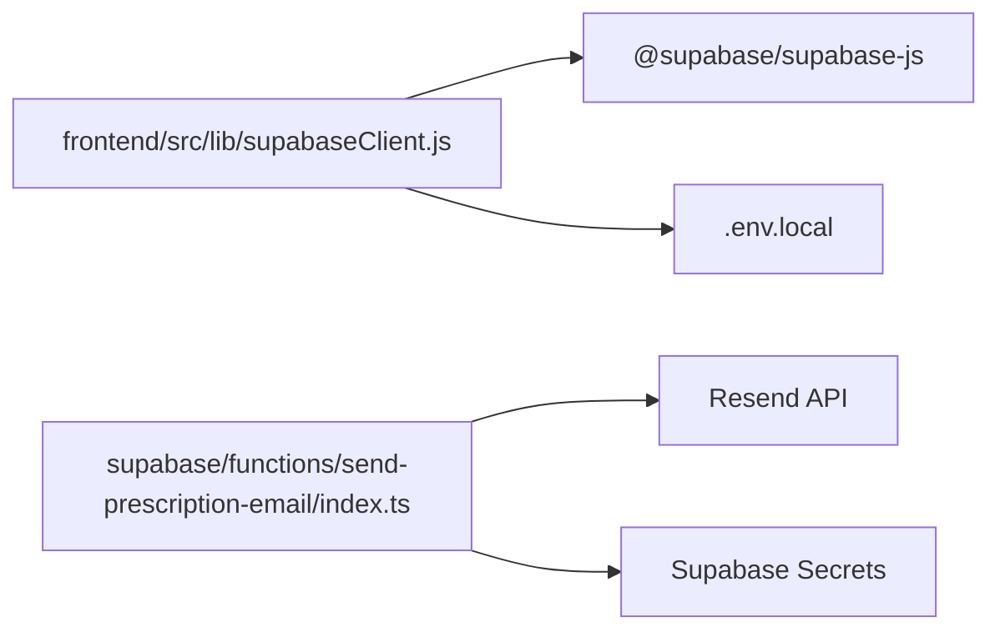

# Supabase Deployment

<cite>
**Referenced Files in This Document**
- [README.md](file://README.md)
- [WIKI.md](file://WIKI.md)
- [supabase/config.toml](file://supabase/config.toml)
- [supabase/functions/send-prescription-email/index.ts](file://supabase/functions/send-prescription-email/index.ts)
- [backend/schema.sql](file://backend/schema.sql)
- [_trash/BACKEND_FIX.md](file://_trash/BACKEND_FIX.md)
- [_trash/SUPABASE_SETUP.md](file://_trash/SUPABASE_SETUP.md)
- [frontend/src/lib/supabaseClient.js](file://frontend/src/lib/supabaseClient.js)
- [frontend/.env.example](file://frontend/.env.example)
- [frontend/package.json](file://frontend/package.json)
- [frontend/vite.config.js](file://frontend/vite.config.js)
- [supabase/.gitignore](file://supabase/.gitignore)
</cite>

## Table of Contents
1. [Introduction](#introduction)
2. [Project Structure](#project-structure)
3. [Core Components](#core-components)
4. [Architecture Overview](#architecture-overview)
5. [Detailed Component Analysis](#detailed-component-analysis)
6. [Dependency Analysis](#dependency-analysis)
7. [Performance Considerations](#performance-considerations)
8. [Troubleshooting Guide](#troubleshooting-guide)
9. [Conclusion](#conclusion)
10. [Appendices](#appendices)

## Introduction
This document provides comprehensive guidance for deploying the MedVita healthcare management platform using Supabase. It covers database provisioning, edge function deployment, real-time subscriptions, environment variable configuration, and operational best practices for production. The goal is to enable reliable, secure, and scalable deployments across development, staging, and production environments.

## Project Structure
The repository is organized into three primary areas:
- Frontend: React + Vite application that integrates with Supabase for authentication, database access, and real-time updates.
- Backend: SQL schema and policies defining the database model and access controls.
- Supabase: Local CLI configuration, edge functions, and environment management.

**Diagram sources**
- [frontend/src/lib/supabaseClient.js](file://frontend/src/lib/supabaseClient.js#L1-L11)
- [supabase/config.toml](file://supabase/config.toml#L1-L385)

**Section sources**
- [README.md](file://README.md#L16-L28)
- [frontend/package.json](file://frontend/package.json#L1-L50)

## Core Components
- Supabase configuration: Defines API ports, database settings, edge runtime, realtime, and analytics.
- Edge function: A Deno-based function to send prescription emails via Resend.
- Database schema: PostgreSQL schema with row level security (RLS) policies and storage policies.
- Frontend client: Supabase client initialized with environment variables for URL and anon key.

Key configuration highlights:
- Supabase project ID and service ports are defined in the Supabase configuration.
- Edge runtime is enabled with Deno v2 and inspector port for debugging.
- Realtime is enabled for live updates.
- Frontend reads Supabase URL and anon key from environment variables.

**Section sources**
- [supabase/config.toml](file://supabase/config.toml#L5-L385)
- [frontend/src/lib/supabaseClient.js](file://frontend/src/lib/supabaseClient.js#L1-L11)
- [frontend/.env.example](file://frontend/.env.example#L1-L9)

## Architecture Overview
The system architecture integrates the frontend with Supabase services:
- Authentication and authorization handled by Supabase Auth.
- Data persistence and access control via PostgreSQL with RLS.
- Realtime subscriptions for reactive UI updates.
- Edge functions for serverless tasks such as sending emails.
- Storage for file uploads and retrieval.

**Diagram sources**
- [frontend/src/lib/supabaseClient.js](file://frontend/src/lib/supabaseClient.js#L1-L11)
- [supabase/config.toml](file://supabase/config.toml#L77-L82)
- [supabase/functions/send-prescription-email/index.ts](file://supabase/functions/send-prescription-email/index.ts#L25-L193)

## Detailed Component Analysis

### Database Provisioning and Schema Management
- Provisioning: Use the Supabase SQL Editor to run the schema and policies.
- Schema: Includes profiles, patients, doctor availability, appointments, prescriptions, and storage buckets.
- Policies: Enforce role-based access and visibility rules using RLS.
- Storage: Creates a public bucket and sets policies for authenticated uploads and downloads.
- Triggers: Auto-creation of profiles on new user signup.

Recommended steps:
1. Log into the Supabase dashboard and open the SQL Editor.
2. Paste and run the schema SQL to create tables and policies.
3. Apply any backend fixes for foreign key constraints if needed.
4. Seed the database if applicable.

**Diagram sources**
- [backend/schema.sql](file://backend/schema.sql#L1-L274)
- [_trash/SUPABASE_SETUP.md](file://_trash/SUPABASE_SETUP.md#L1-L194)
- [_trash/BACKEND_FIX.md](file://_trash/BACKEND_FIX.md#L1-L22)

**Section sources**
- [backend/schema.sql](file://backend/schema.sql#L1-L274)
- [_trash/SUPABASE_SETUP.md](file://_trash/SUPABASE_SETUP.md#L1-L194)
- [_trash/BACKEND_FIX.md](file://_trash/BACKEND_FIX.md#L1-L22)

### Edge Function Deployment (send-prescription-email)
- Location: supabase/functions/send-prescription-email/index.ts
- Runtime: Deno (configured in Supabase config).
- Purpose: Accepts a JSON payload, validates configuration, fetches a PDF, builds an HTML email, and sends it via Resend.
- CORS: Configured for cross-origin requests.
- Secrets: Requires RESEND_API_KEY set via Supabase secrets.

Deployment workflow:
1. Ensure Supabase CLI is installed and authenticated.
2. Navigate to the supabase directory.
3. Set edge function secrets (e.g., RESEND_API_KEY).
4. Deploy functions using the Supabase CLI.
5. Test the deployed function endpoint.

**Diagram sources**
- [supabase/functions/send-prescription-email/index.ts](file://supabase/functions/send-prescription-email/index.ts#L25-L193)
- [supabase/config.toml](file://supabase/config.toml#L353-L365)

**Section sources**
- [supabase/functions/send-prescription-email/index.ts](file://supabase/functions/send-prescription-email/index.ts#L1-L193)
- [WIKI.md](file://WIKI.md#L377-L404)

### Real-Time Subscriptions Setup
- Realtime is enabled in the Supabase configuration.
- The frontend initializes the Supabase client and can subscribe to channels for live updates.
- Typical subscriptions include patients, appointments, and prescriptions.

Operational guidance:
- Confirm realtime is enabled in the Supabase config.
- Initialize the client in the frontend and subscribe to relevant tables or channels.
- Monitor subscription events and handle reconnections gracefully.

**Section sources**
- [supabase/config.toml](file://supabase/config.toml#L77-L82)
- [frontend/src/lib/supabaseClient.js](file://frontend/src/lib/supabaseClient.js#L1-L11)

### Environment Variable Configuration
- Frontend variables:
  - VITE_SUPABASE_URL: Supabase project URL.
  - VITE_SUPABASE_ANON_KEY: Supabase anon key for unauthenticated access.
  - Optional: VITE_GOOGLE_CLIENT_ID for Google Calendar integration.
- Supabase secrets:
  - RESEND_API_KEY: Required by the edge function for sending emails.
- Git safety:
  - The Supabase directory ignores local env files to prevent secrets from being committed.

Best practices:
- Store secrets in Supabase secrets, not in the repository.
- Use .env.local for local development and ensure it is gitignored.
- Validate environment variables at startup and log warnings if missing.

**Section sources**
- [frontend/.env.example](file://frontend/.env.example#L1-L9)
- [frontend/src/lib/supabaseClient.js](file://frontend/src/lib/supabaseClient.js#L1-L11)
- [supabase/.gitignore](file://supabase/.gitignore#L1-L9)
- [WIKI.md](file://WIKI.md#L406-L429)

### Supabase CLI Deployment Process
- Project initialization: Use the Supabase CLI to initialize and manage the project.
- Database schema migration: Apply schema.sql via the SQL Editor or via Supabase’s migration tooling.
- Edge function compilation and deployment: Use the Supabase CLI to deploy functions.
- Secrets management: Set edge function secrets via the CLI.

Note: The repository includes a Supabase config file and an edge function. Use the CLI to push these configurations and deploy functions.

**Section sources**
- [supabase/config.toml](file://supabase/config.toml#L1-L385)
- [supabase/functions/send-prescription-email/index.ts](file://supabase/functions/send-prescription-email/index.ts#L1-L193)

### Deployment Verification Procedures
- Database connectivity:
  - Confirm the database is healthy and reachable.
  - Run basic queries to verify RLS policies and table access.
- Function execution:
  - Invoke the edge function with a test payload.
  - Inspect logs for errors and verify successful delivery.
- Frontend integration:
  - Initialize the Supabase client and perform read/write operations.
  - Verify realtime subscriptions receive updates.

**Section sources**
- [supabase/config.toml](file://supabase/config.toml#L32-L36)
- [supabase/functions/send-prescription-email/index.ts](file://supabase/functions/send-prescription-email/index.ts#L30-L60)
- [frontend/src/lib/supabaseClient.js](file://frontend/src/lib/supabaseClient.js#L1-L11)

### Supabase Dashboard Configuration, Custom Domains, and SSL
- Dashboard configuration:
  - Enable and configure services such as Auth, Storage, Realtime, and Edge Functions.
  - Manage secrets and environment variables in the dashboard.
- Custom domains:
  - Configure custom domains in the Supabase dashboard for production URLs.
- SSL certificates:
  - Supabase manages SSL for project URLs; ensure DNS records point to Supabase-provided endpoints.

[No sources needed since this section provides general guidance]

### Backup Strategies, Database Optimization, and Performance Monitoring
- Backups:
  - Use Supabase’s managed backups for point-in-time recovery.
  - Schedule regular snapshots for critical data.
- Database optimization:
  - Index frequently queried columns (e.g., doctor_id, patient_id).
  - Normalize data to reduce redundancy while maintaining query performance.
  - Use RLS judiciously; ensure policies are selective and efficient.
- Performance monitoring:
  - Monitor query performance using Supabase metrics.
  - Track edge function latency and error rates.
  - Observe realtime subscription traffic and adjust scaling as needed.

[No sources needed since this section provides general guidance]

## Dependency Analysis
The frontend depends on the Supabase client libraries and environment variables. The edge function depends on Supabase secrets and external APIs.

**Diagram sources**
- [frontend/src/lib/supabaseClient.js](file://frontend/src/lib/supabaseClient.js#L1-L11)
- [frontend/package.json](file://frontend/package.json#L13-L31)
- [supabase/functions/send-prescription-email/index.ts](file://supabase/functions/send-prescription-email/index.ts#L31-L46)

**Section sources**
- [frontend/package.json](file://frontend/package.json#L13-L31)
- [frontend/src/lib/supabaseClient.js](file://frontend/src/lib/supabaseClient.js#L1-L11)
- [supabase/functions/send-prescription-email/index.ts](file://supabase/functions/send-prescription-email/index.ts#L1-L193)

## Performance Considerations
- Minimize payload sizes by limiting returned rows and using pagination.
- Optimize RLS policies to avoid expensive joins or subqueries.
- Cache static assets and leverage Supabase Storage CDN.
- Use chunking and lazy loading in the frontend to improve perceived performance.

[No sources needed since this section provides general guidance]

## Troubleshooting Guide
Common issues and resolutions:
- Missing Supabase URL or anon key:
  - Ensure environment variables are present and loaded.
  - Check .env.local and gitignore rules.
- Edge function crashes:
  - Validate RESEND_API_KEY is set in Supabase secrets.
  - Inspect function logs for runtime errors.
- Database connectivity:
  - Confirm database health timeout and major version match.
  - Re-run schema and policies if tables are missing.
- Foreign key constraints:
  - Apply backend fixes to resolve constraint issues.

**Section sources**
- [frontend/src/lib/supabaseClient.js](file://frontend/src/lib/supabaseClient.js#L6-L8)
- [supabase/functions/send-prescription-email/index.ts](file://supabase/functions/send-prescription-email/index.ts#L41-L46)
- [supabase/config.toml](file://supabase/config.toml#L32-L36)
- [_trash/BACKEND_FIX.md](file://_trash/BACKEND_FIX.md#L1-L22)

## Conclusion
This guide outlines a complete deployment strategy for MedVita on Supabase, covering database provisioning, edge function deployment, real-time subscriptions, environment configuration, and operational best practices. By following these steps and leveraging the provided references, teams can achieve reliable, secure, and scalable deployments across environments.

## Appendices
- Additional resources:
  - Supabase CLI documentation for project initialization and deployment.
  - Supabase dashboard guides for managing Auth, Storage, Realtime, and Edge Functions.
  - Frontend build and deployment instructions for Vercel.

[No sources needed since this section provides general guidance]