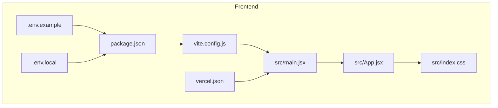
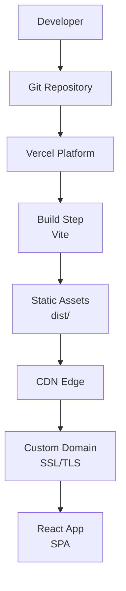
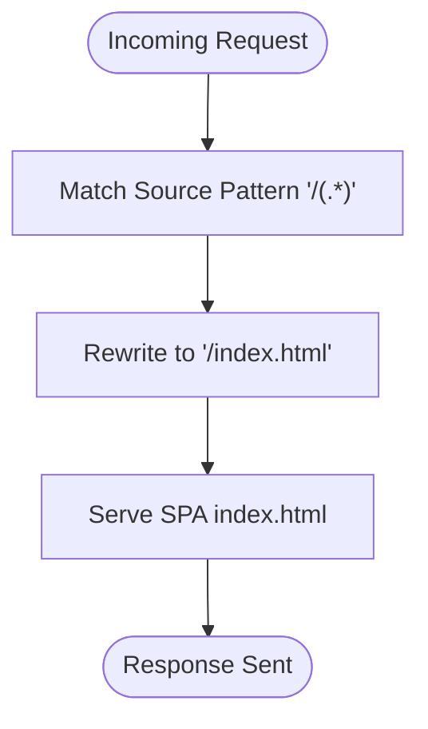
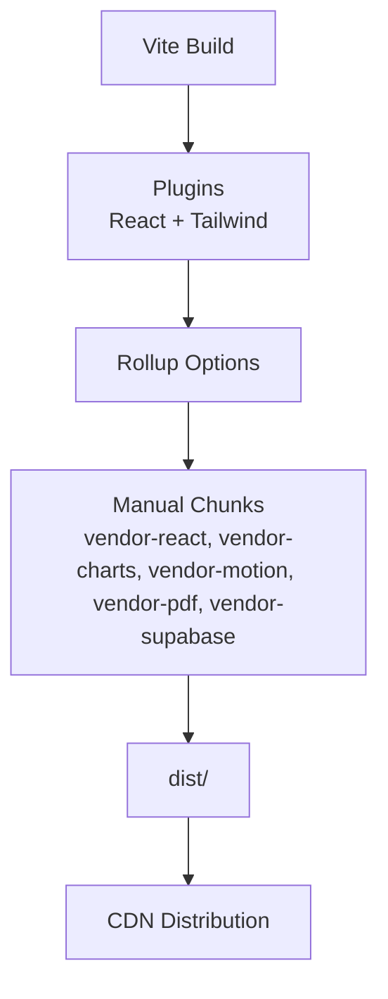
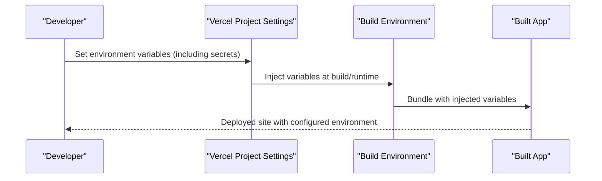
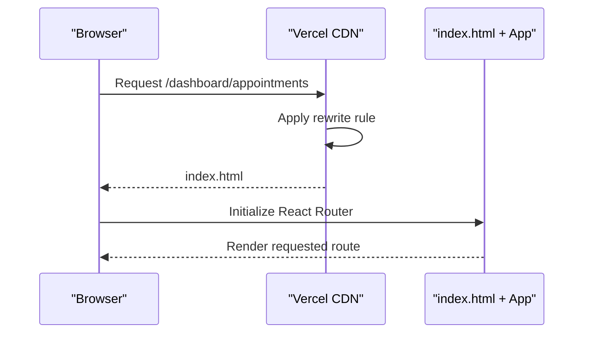
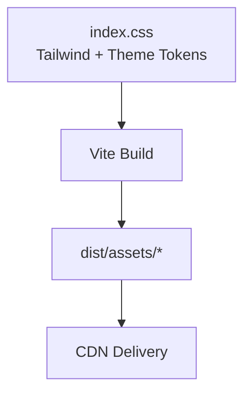
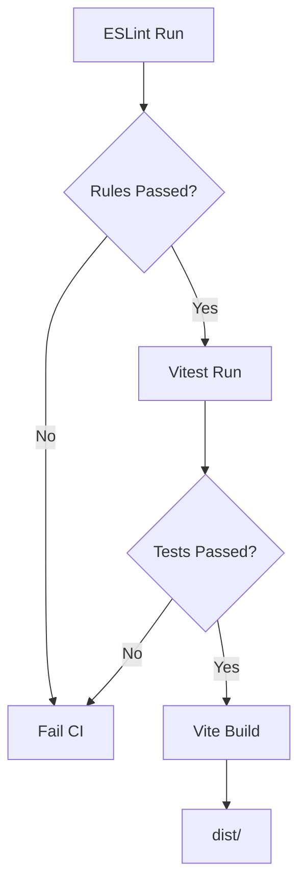
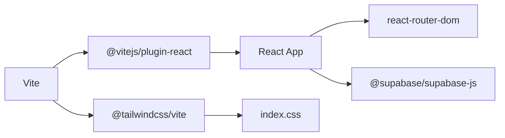

# Vercel Deployment

<cite>
**Referenced Files in This Document**
- [package.json](file://frontend/package.json)
- [vercel.json](file://frontend/vercel.json)
- [.env.example](file://frontend/.env.example)
- [.env.local](file://frontend/.env.local)
- [vite.config.js](file://frontend/vite.config.js)
- [README.md](file://frontend/README.md)
- [index.css](file://frontend/src/index.css)
- [main.jsx](file://frontend/src/main.jsx)
- [App.jsx](file://frontend/src/App.jsx)
- [GOOGLE_CALENDAR_SETUP.md](file://frontend/GOOGLE_CALENDAR_SETUP.md)
- [eslint.config.js](file://frontend/eslint.config.js)
</cite>

## Table of Contents
1. [Introduction](#introduction)
2. [Project Structure](#project-structure)
3. [Core Components](#core-components)
4. [Architecture Overview](#architecture-overview)
5. [Detailed Component Analysis](#detailed-component-analysis)
6. [Dependency Analysis](#dependency-analysis)
7. [Performance Considerations](#performance-considerations)
8. [Troubleshooting Guide](#troubleshooting-guide)
9. [Conclusion](#conclusion)
10. [Appendices](#appendices)

## Introduction
This document provides comprehensive guidance for deploying the React frontend application to Vercel. It covers Vercel project configuration, build settings, environment variables, custom domains, and redirects. It also explains deployment via Vercel CLI and GitHub integration, environment variable management, build optimization, static asset handling, CDN distribution, preview and production workflows, analytics and monitoring, rollback procedures, log analysis, troubleshooting, and cost optimization strategies.

## Project Structure
The frontend is a React application built with Vite. Key deployment-related files include the Vite configuration, environment variable templates, Vercel rewrite rules, and the React application entry points.

**Diagram sources**
- [package.json](file://frontend/package.json#L1-L50)
- [vite.config.js](file://frontend/vite.config.js#L1-L33)
- [.env.example](file://frontend/.env.example#L1-L9)
- [.env.local](file://frontend/.env.local#L1-L5)
- [vercel.json](file://frontend/vercel.json#L1-L8)
- [main.jsx](file://frontend/src/main.jsx#L1-L17)
- [App.jsx](file://frontend/src/App.jsx#L1-L62)
- [index.css](file://frontend/src/index.css#L1-L781)

**Section sources**
- [package.json](file://frontend/package.json#L1-L50)
- [vite.config.js](file://frontend/vite.config.js#L1-L33)
- [vercel.json](file://frontend/vercel.json#L1-L8)
- [main.jsx](file://frontend/src/main.jsx#L1-L17)
- [App.jsx](file://frontend/src/App.jsx#L1-L62)
- [index.css](file://frontend/src/index.css#L1-L781)
- [.env.example](file://frontend/.env.example#L1-L9)
- [.env.local](file://frontend/.env.local#L1-L5)

## Core Components
- Build and bundling: Vite configuration defines output directory, chunk splitting, and test setup.
- Routing: React Router DOM routes are defined in the application entry.
- Static assets: Public assets are served from the public directory; Vite builds into dist.
- Rewrites: A single-page application rewrite ensures all routes render index.html.

Key deployment-relevant configurations:
- Build script and output directory
- Manual chunking strategy for vendor libraries
- Test configuration for Vitest
- SPA rewrite for client-side routing

**Section sources**
- [package.json](file://frontend/package.json#L6-L12)
- [vite.config.js](file://frontend/vite.config.js#L11-L26)
- [App.jsx](file://frontend/src/App.jsx#L1-L62)
- [vercel.json](file://frontend/vercel.json#L2-L7)

## Architecture Overview
The deployment pipeline integrates Vercel’s platform with the React application and environment variables. Vercel reads the Vercel configuration for rewrites, uses the Vite build output, and injects environment variables at build and runtime.

**Diagram sources**
- [package.json](file://frontend/package.json#L6-L12)
- [vite.config.js](file://frontend/vite.config.js#L11-L26)
- [vercel.json](file://frontend/vercel.json#L2-L7)

## Detailed Component Analysis

### Vercel Configuration (vercel.json)
- Purpose: Defines a rewrite rule so all routes fall back to index.html for client-side routing.
- Behavior: Ensures deep links and refreshes work correctly in a SPA.

**Diagram sources**
- [vercel.json](file://frontend/vercel.json#L2-L7)

**Section sources**
- [vercel.json](file://frontend/vercel.json#L1-L8)

### Build Configuration (Vite)
- Output directory: dist
- Source maps disabled for production
- Chunk size warning limit increased
- Manual chunking strategy separates major vendor libraries into named chunks
- Test configuration uses jsdom and a setup file

**Diagram sources**
- [vite.config.js](file://frontend/vite.config.js#L7-L26)

**Section sources**
- [vite.config.js](file://frontend/vite.config.js#L1-L33)

### Environment Variables and Secrets
- Local development variables: Supabase and Gemini API keys are defined in .env.local.
- Example template: .env.example documents Google Calendar and Supabase variables.
- Vercel project settings: Environment variables are managed in Vercel’s dashboard per project and per deployment branch.
- Secret management: Store sensitive values as secrets in Vercel; avoid committing to version control.

**Diagram sources**
- [.env.local](file://frontend/.env.local#L1-L5)
- [.env.example](file://frontend/.env.example#L1-L9)
- [README.md](file://frontend/README.md#L64-L76)

**Section sources**
- [.env.local](file://frontend/.env.local#L1-L5)
- [.env.example](file://frontend/.env.example#L1-L9)
- [README.md](file://frontend/README.md#L64-L76)

### Routing and SPA Behavior
- React Router DOM manages client-side routes.
- The rewrite rule ensures all routes render index.html, enabling deep linking without server-side route handling.

**Diagram sources**
- [vercel.json](file://frontend/vercel.json#L2-L7)
- [App.jsx](file://frontend/src/App.jsx#L18-L58)

**Section sources**
- [App.jsx](file://frontend/src/App.jsx#L1-L62)
- [vercel.json](file://frontend/vercel.json#L1-L8)

### Styling and Asset Pipeline
- Tailwind CSS is integrated via the Tailwind Vite plugin.
- The stylesheet defines glassmorphism utilities and theme tokens used across components.
- Ensure Tailwind utilities referenced in components are recognized by the build.

**Diagram sources**
- [index.css](file://frontend/src/index.css#L1-L781)
- [vite.config.js](file://frontend/vite.config.js#L7-L10)

**Section sources**
- [index.css](file://frontend/src/index.css#L1-L781)
- [vite.config.js](file://frontend/vite.config.js#L1-L33)

### Testing and Quality Gates
- ESLint configuration enforces recommended rules and ignores the dist directory.
- Vitest is configured for unit testing with jsdom and a setup file.

**Diagram sources**
- [eslint.config.js](file://frontend/eslint.config.js#L1-L30)
- [package.json](file://frontend/package.json#L10-L11)
- [vite.config.js](file://frontend/vite.config.js#L27-L31)

**Section sources**
- [eslint.config.js](file://frontend/eslint.config.js#L1-L30)
- [package.json](file://frontend/package.json#L10-L11)
- [vite.config.js](file://frontend/vite.config.js#L27-L31)

## Dependency Analysis
- Build-time dependencies: Vite, React plugin, Tailwind Vite plugin.
- Runtime dependencies: React, React DOM, React Router DOM, Supabase client, charting and motion libraries.
- Environment variables are consumed at runtime via Vite’s prefix for frontend variables.

**Diagram sources**
- [package.json](file://frontend/package.json#L13-L31)
- [vite.config.js](file://frontend/vite.config.js#L7-L10)
- [main.jsx](file://frontend/src/main.jsx#L1-L17)
- [App.jsx](file://frontend/src/App.jsx#L1-L62)

**Section sources**
- [package.json](file://frontend/package.json#L13-L31)
- [vite.config.js](file://frontend/vite.config.js#L1-L33)
- [main.jsx](file://frontend/src/main.jsx#L1-L17)
- [App.jsx](file://frontend/src/App.jsx#L1-L62)

## Performance Considerations
- Build optimization
  - Manual chunking reduces initial bundle size and improves caching.
  - Source maps disabled for production to reduce bundle size.
  - Increased chunk size warning limit to anticipate larger vendor bundles.
- Static assets
  - Vite outputs to dist; ensure no unnecessary assets are included.
  - Leverage CDN distribution for fast global delivery.
- Routing
  - Single-page application with client-side routing minimizes server overhead.
- Observability
  - Integrate Vercel Analytics for performance insights.
  - Use error monitoring tools to track runtime issues.

[No sources needed since this section provides general guidance]

## Troubleshooting Guide
Common deployment issues and resolutions:
- Build failures due to Tailwind utilities
  - Symptom: Unknown utility class errors during build.
  - Resolution: Ensure Tailwind is properly configured and all utility classes are valid.
- Environment variables not applied
  - Symptom: Missing API keys or incorrect configuration in production.
  - Resolution: Confirm variables are set in Vercel project settings and marked as production secrets when needed.
- SPA routing issues
  - Symptom: 404 on refresh or deep links.
  - Resolution: Verify the rewrite rule exists and matches all routes.
- Google Calendar integration
  - Symptom: Authentication or sync failures.
  - Resolution: Confirm OAuth client ID and API key are correctly set and restricted appropriately.

**Section sources**
- [build-report.txt](file://frontend/build-report.txt#L10-L22)
- [GOOGLE_CALENDAR_SETUP.md](file://frontend/GOOGLE_CALENDAR_SETUP.md#L83-L117)
- [vercel.json](file://frontend/vercel.json#L2-L7)

## Conclusion
Deploying the React frontend to Vercel involves configuring Vite for optimized builds, setting up environment variables in Vercel, and ensuring SPA routing works with a rewrite rule. Integrating with GitHub enables automated deployments, while Vercel Analytics and error monitoring provide operational insights. Following the outlined procedures ensures reliable preview and production deployments, along with robust troubleshooting and cost optimization strategies.

[No sources needed since this section summarizes without analyzing specific files]

## Appendices

### A. Vercel Project Configuration Checklist
- Build settings
  - Framework preset: None (custom build)
  - Build command: npm run build
  - Output directory: dist
- Environment variables
  - Define Supabase and Gemini keys as project variables
  - Mark secrets appropriately for production
- Custom domains
  - Add domain and configure DNS records
  - Enable automatic SSL provisioning
- Redirects and rewrites
  - Ensure SPA rewrite rule is present

**Section sources**
- [package.json](file://frontend/package.json#L6-L12)
- [vite.config.js](file://frontend/vite.config.js#L11-L26)
- [vercel.json](file://frontend/vercel.json#L2-L7)

### B. Deployment Workflows
- Preview deployments
  - Push to feature branches; Vercel auto-deploys with preview URL
- Production deployments
  - Merge to production branch; Vercel auto-deploys to production URL
- Manual deployments
  - Use Vercel CLI to deploy current working directory

**Section sources**
- [README.md](file://frontend/README.md#L50-L76)

### C. Environment Variable Reference
- Supabase
  - VITE_SUPABASE_URL
  - VITE_SUPABASE_ANON_KEY
- Gemini
  - VITE_GEMINI_API_KEY
- Google Calendar
  - VITE_GOOGLE_CLIENT_ID
  - VITE_GOOGLE_API_KEY

**Section sources**
- [.env.example](file://frontend/.env.example#L1-L9)
- [.env.local](file://frontend/.env.local#L1-L5)