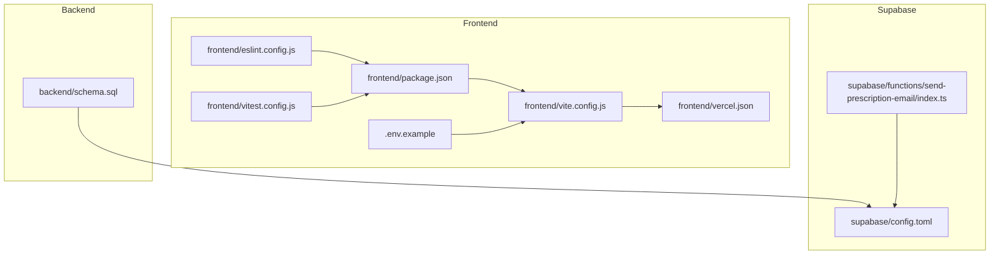
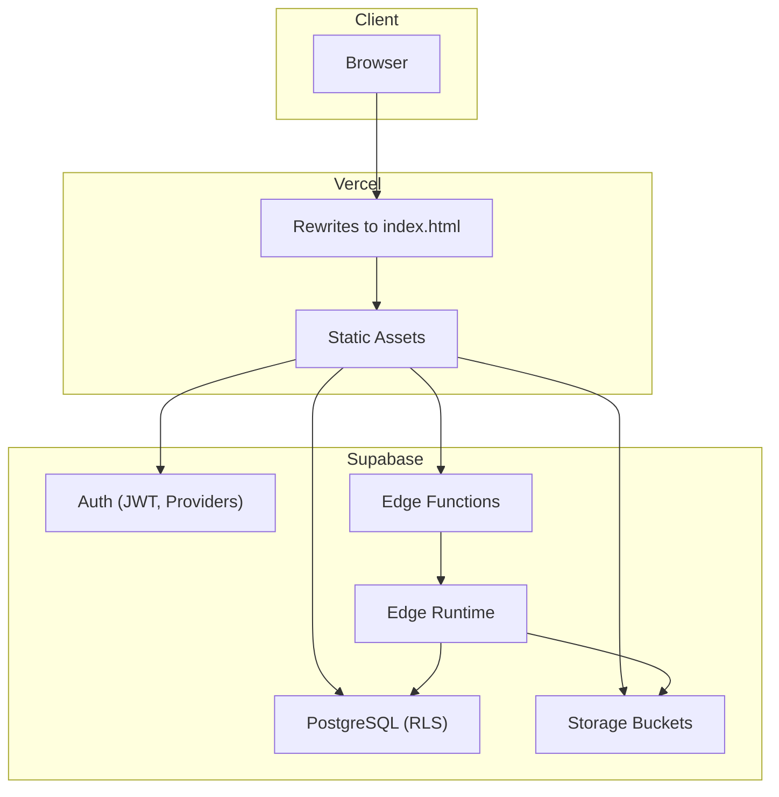
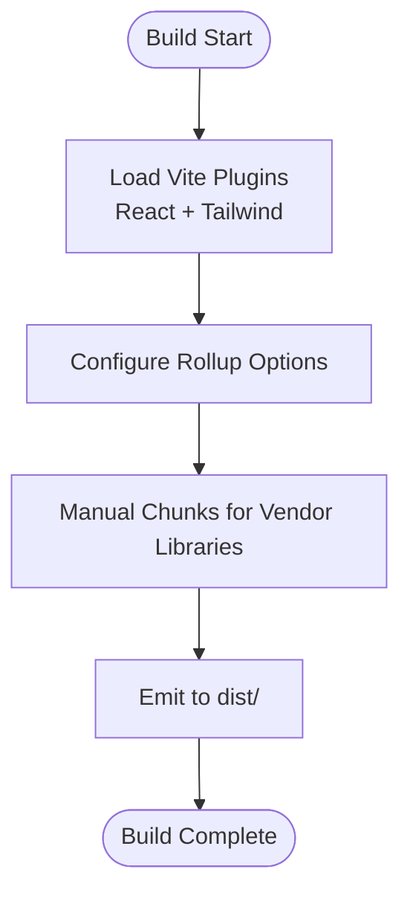
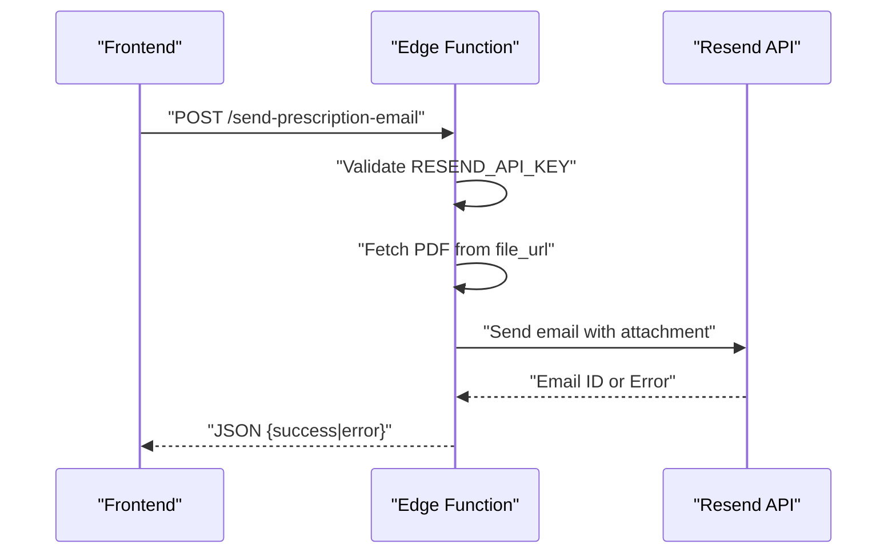
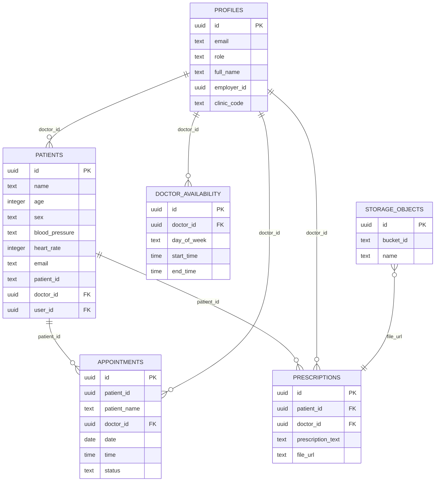
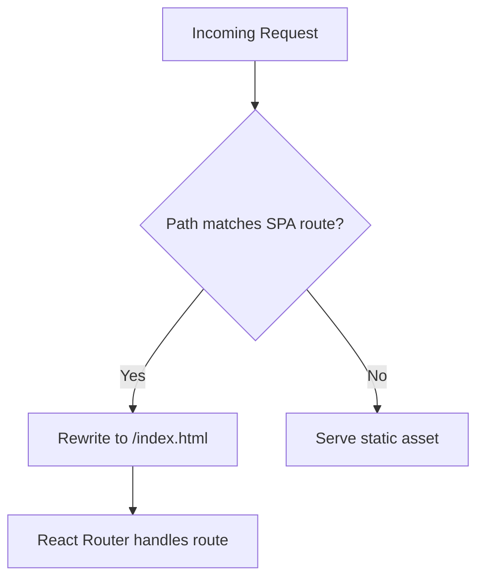
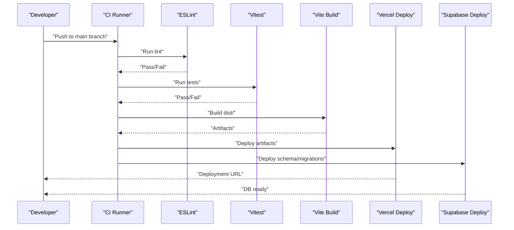
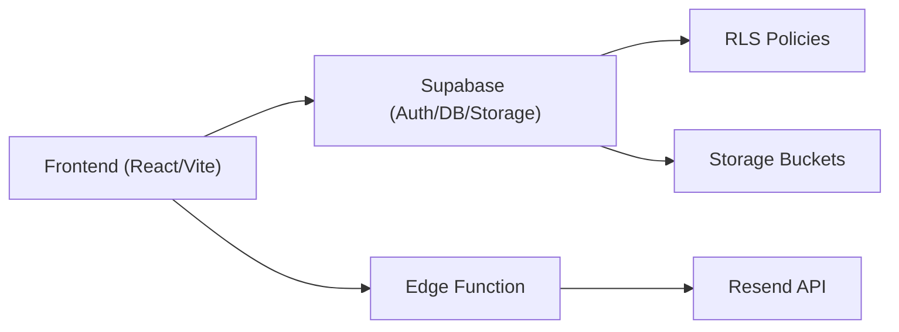

# Deployment & DevOps

<cite>
**Referenced Files in This Document**
- [package.json](file://frontend/package.json)
- [vite.config.js](file://frontend/vite.config.js)
- [vercel.json](file://frontend/vercel.json)
- [eslint.config.js](file://frontend/eslint.config.js)
- [vitest.config.js](file://frontend/vitest.config.js)
- [.env.example](file://frontend/.env.example)
- [config.toml](file://supabase/config.toml)
- [index.ts](file://supabase/functions/send-prescription-email/index.ts)
- [schema.sql](file://backend/schema.sql)
- [README.md](file://README.md)
</cite>

## Table of Contents
1. [Introduction](#introduction)
2. [Project Structure](#project-structure)
3. [Core Components](#core-components)
4. [Architecture Overview](#architecture-overview)
5. [Detailed Component Analysis](#detailed-component-analysis)
6. [Dependency Analysis](#dependency-analysis)
7. [Performance Considerations](#performance-considerations)
8. [Troubleshooting Guide](#troubleshooting-guide)
9. [Conclusion](#conclusion)
10. [Appendices](#appendices)

## Introduction
This document provides comprehensive deployment and DevOps guidance for MedVita’s production pipeline. It covers frontend build configuration with Vite, asset optimization, and deployment preparation; Supabase deployment and configuration including database migrations, edge function deployment, and environment secrets; Vercel deployment setup including environment variables, custom domains, and routing; CI/CD pipeline configuration, automated testing, and deployment automation; production environment setup, monitoring, and rollback procedures; security considerations including SSL and performance optimization; and troubleshooting and scaling guidance.

## Project Structure
MedVita is a frontend-first application using React and Vite, with Supabase powering backend services and authentication. The repository is organized into:
- frontend: React application with Vite build, Tailwind CSS, and unit/integration tests
- backend: PostgreSQL schema and policies for Supabase
- supabase: Supabase CLI configuration and Edge Functions
- root: project documentation and top-level configuration

**Diagram sources**
- [package.json](file://frontend/package.json#L1-L50)
- [vite.config.js](file://frontend/vite.config.js#L1-L33)
- [eslint.config.js](file://frontend/eslint.config.js#L1-L30)
- [vitest.config.js](file://frontend/vitest.config.js#L1-L19)
- [.env.example](file://frontend/.env.example#L1-L9)
- [vercel.json](file://frontend/vercel.json#L1-L8)
- [schema.sql](file://backend/schema.sql#L1-L274)
- [config.toml](file://supabase/config.toml#L1-L385)
- [index.ts](file://supabase/functions/send-prescription-email/index.ts#L1-L193)

**Section sources**
- [README.md](file://README.md#L16-L28)

## Core Components
- Frontend build and optimization: Vite configuration with manual chunking for vendor libraries and test setup
- Routing and SPA behavior: Vercel rewrites to index.html for client-side routing
- Supabase configuration: Local CLI configuration, migrations, seeding, and edge runtime settings
- Edge Function: TypeScript-based Edge Function for sending prescription emails via Resend
- Database schema and policies: Role-based access control and Row Level Security (RLS) policies
- Testing and linting: ESLint and Vitest configurations

**Section sources**
- [package.json](file://frontend/package.json#L6-L12)
- [vite.config.js](file://frontend/vite.config.js#L11-L26)
- [vercel.json](file://frontend/vercel.json#L2-L7)
- [config.toml](file://supabase/config.toml#L53-L65)
- [index.ts](file://supabase/functions/send-prescription-email/index.ts#L31-L46)
- [schema.sql](file://backend/schema.sql#L30-L274)
- [eslint.config.js](file://frontend/eslint.config.js#L7-L29)
- [vitest.config.js](file://frontend/vitest.config.js#L4-L18)

## Architecture Overview
The production deployment architecture comprises:
- Frontend built with Vite and deployed via Vercel with SPA routing
- Supabase managed service for authentication, database, storage, and Edge Functions
- Edge Function invoked by the frontend to send email notifications with PDF attachments

**Diagram sources**
- [vercel.json](file://frontend/vercel.json#L2-L7)
- [config.toml](file://supabase/config.toml#L353-L362)
- [index.ts](file://supabase/functions/send-prescription-email/index.ts#L25-L46)

## Detailed Component Analysis

### Frontend Build and Asset Optimization
- Build script and plugins: React and Tailwind plugins configured in Vite
- Output directory and source maps: Production builds output to dist with source maps disabled
- Chunk splitting: Vendor libraries grouped into named chunks for caching and performance
- Test configuration: Vitest with jsdom environment and setup file
- Linting: ESLint flat config with recommended rules and React-specific plugins

**Diagram sources**
- [vite.config.js](file://frontend/vite.config.js#L7-L26)

**Section sources**
- [package.json](file://frontend/package.json#L6-L12)
- [vite.config.js](file://frontend/vite.config.js#L11-L26)
- [eslint.config.js](file://frontend/eslint.config.js#L7-L29)
- [vitest.config.js](file://frontend/vitest.config.js#L4-L18)

### Supabase Deployment and Configuration
- Project identity and ports: Project ID and service ports configured for local development
- Database: Major version aligned with remote, migrations enabled, seed file configured
- Auth: Site URL, redirect URLs, JWT expiry, rate limits, and external provider placeholders
- Edge runtime: Enabled with Deno 2 and inspector port for debugging
- Analytics: Backend configured for analytics ingestion
- Edge Function: TypeScript Edge Function for sending emails with PDF attachments via Resend

**Diagram sources**
- [index.ts](file://supabase/functions/send-prescription-email/index.ts#L31-L46)
- [index.ts](file://supabase/functions/send-prescription-email/index.ts#L152-L170)

**Section sources**
- [config.toml](file://supabase/config.toml#L5-L36)
- [config.toml](file://supabase/config.toml#L53-L65)
- [config.toml](file://supabase/config.toml#L146-L191)
- [config.toml](file://supabase/config.toml#L353-L362)
- [index.ts](file://supabase/functions/send-prescription-email/index.ts#L31-L46)

### Database Schema and Policies
- Roles and tables: Profiles, Patients, Doctor Availability, Appointments, Prescriptions
- RLS policies: Fine-grained access control per role and relationship
- Storage: Public bucket creation and policies for authenticated uploads and views
- Trigger and function: Automatic profile creation on new user signup

**Diagram sources**
- [schema.sql](file://backend/schema.sql#L4-L274)

**Section sources**
- [schema.sql](file://backend/schema.sql#L30-L274)

### Vercel Deployment Setup
- SPA routing: Rewrites to index.html for all routes to support client-side navigation
- Environment variables: Supabase URL and anonymous key configured via Vercel project settings
- Custom domains: Configure DNS and SSL in Vercel dashboard for production domains

**Diagram sources**
- [vercel.json](file://frontend/vercel.json#L2-L7)

**Section sources**
- [vercel.json](file://frontend/vercel.json#L1-L8)
- [.env.example](file://frontend/.env.example#L6-L9)

### CI/CD Pipeline Configuration
Recommended pipeline stages:
- Build: Install dependencies and run Vite build
- Test: Run ESLint and Vitest
- Deploy: Deploy frontend to Vercel and Supabase (via CLI or dashboard)
- Notify: Slack/Teams webhook on failure/success

[No sources needed since this diagram shows conceptual workflow, not actual code structure]

## Dependency Analysis
- Frontend depends on Supabase client and React ecosystem
- Edge Function depends on Supabase Edge Runtime and Resend API
- Database depends on Supabase-managed PostgreSQL with RLS and storage policies

**Diagram sources**
- [package.json](file://frontend/package.json#L13-L31)
- [index.ts](file://supabase/functions/send-prescription-email/index.ts#L31-L46)
- [schema.sql](file://backend/schema.sql#L30-L274)

**Section sources**
- [package.json](file://frontend/package.json#L13-L31)
- [index.ts](file://supabase/functions/send-prescription-email/index.ts#L31-L46)
- [schema.sql](file://backend/schema.sql#L30-L274)

## Performance Considerations
- Bundle splitting: Use Vite’s manualChunks to separate vendor libraries for improved caching
- Source maps: Disabled in production builds to reduce bundle size
- Redirect warnings: Increase warning threshold if needed for large bundles
- Edge runtime: Keep Edge Functions small and cacheable; offload heavy work to serverless or backend
- Storage: Use Supabase Storage with appropriate bucket policies and signed URLs for secure delivery

[No sources needed since this section provides general guidance]

## Troubleshooting Guide
Common deployment issues and resolutions:
- Vercel rewrite not working: Verify rewrites configuration and ensure trailing slash handling
- Supabase auth redirect errors: Confirm site URL and additional redirect URLs match deployment domain
- Edge Function failures: Check Resend API key presence and function logs in Supabase dashboard
- Database migration errors: Validate SQL syntax and RLS policy conflicts before applying
- Build failures: Review lint errors and test failures before deploying

**Section sources**
- [vercel.json](file://frontend/vercel.json#L2-L7)
- [config.toml](file://supabase/config.toml#L146-L152)
- [index.ts](file://supabase/functions/send-prescription-email/index.ts#L31-L46)
- [schema.sql](file://backend/schema.sql#L30-L274)

## Conclusion
MedVita’s production deployment leverages a modern frontend stack with Vite and React, deployed via Vercel, backed by Supabase for authentication, database, storage, and Edge Functions. The provided configurations and diagrams outline a robust, scalable, and secure deployment pipeline suitable for production environments.

[No sources needed since this section summarizes without analyzing specific files]

## Appendices

### A. Environment Variables Reference
- Frontend variables: Supabase URL and anonymous key
- Edge Function variables: Resend API key

**Section sources**
- [.env.example](file://frontend/.env.example#L6-L9)
- [index.ts](file://supabase/functions/send-prescription-email/index.ts#L31-L33)

### B. Supabase Secrets and Configuration
- Use environment variable substitution for sensitive values in Supabase config
- Configure edge runtime secrets and inspector port for local debugging

**Section sources**
- [config.toml](file://supabase/config.toml#L364-L365)
- [config.toml](file://supabase/config.toml#L359-L360)

### C. Monitoring and Rollback Procedures
- Monitor Vercel deployment logs and health checks
- Track Supabase metrics and Edge Function invocations
- Maintain versioned database migrations and keep a rollback plan for schema changes

[No sources needed since this section provides general guidance]