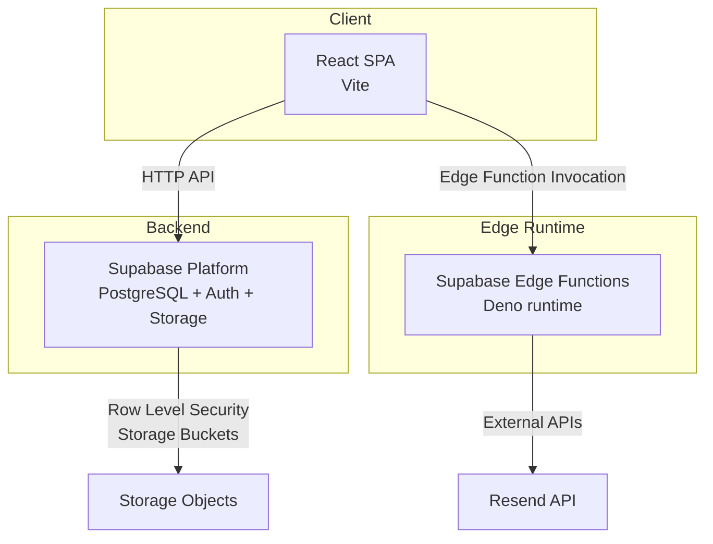
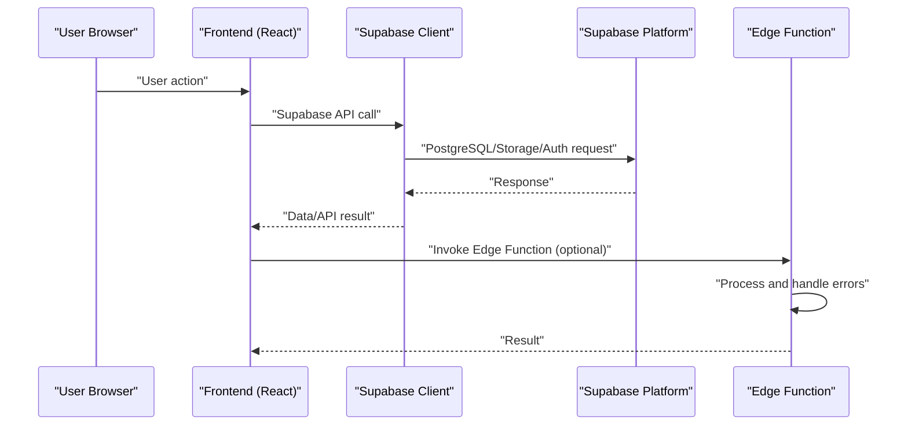
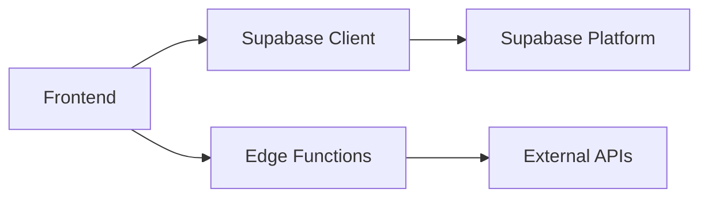

# Production Monitoring

<cite>
**Referenced Files in This Document**
- [README.md](file://README.md)
- [WIKI.md](file://WIKI.md)
- [supabase/config.toml](file://supabase/config.toml)
- [backend/schema.sql](file://backend/schema.sql)
- [supabase/functions/send-prescription-email/index.ts](file://supabase/functions/send-prescription-email/index.ts)
- [frontend/src/lib/supabaseClient.js](file://frontend/src/lib/supabaseClient.js)
- [frontend/vite.config.js](file://frontend/vite.config.js)
- [frontend/vercel.json](file://frontend/vercel.json)
- [frontend/package.json](file://frontend/package.json)
- [frontend/.env.example](file://frontend/.env.example)
</cite>

## Table of Contents
1. [Introduction](#introduction)
2. [Project Structure](#project-structure)
3. [Core Components](#core-components)
4. [Architecture Overview](#architecture-overview)
5. [Detailed Component Analysis](#detailed-component-analysis)
6. [Dependency Analysis](#dependency-analysis)
7. [Performance Considerations](#performance-considerations)
8. [Troubleshooting Guide](#troubleshooting-guide)
9. [Conclusion](#conclusion)
10. [Appendices](#appendices)

## Introduction
This document defines a production monitoring framework for MedVita’s Operational Excellence program. It covers application performance monitoring (APM), infrastructure monitoring, logging and alerting, health checks and uptime, capacity planning, performance optimization, scalability monitoring, and security and compliance. The guidance is grounded in the repository’s current stack and configuration, including Supabase-managed backend, React/Vite frontend, and Supabase Edge Functions.

## Project Structure
MedVita follows a clear separation of concerns:
- Frontend: React + Vite, served via static hosting (Vercel rewrite rules)
- Backend: Supabase-managed PostgreSQL, Auth, Edge Functions, Storage
- Edge Functions: Serverless functions written in Deno for specialized tasks (e.g., email notifications)

**Diagram sources**
- [WIKI.md](file://WIKI.md#L34-L68)
- [supabase/config.toml](file://supabase/config.toml#L353-L362)
- [frontend/vercel.json](file://frontend/vercel.json#L1-L8)

**Section sources**
- [README.md](file://README.md#L1-L89)
- [WIKI.md](file://WIKI.md#L17-L68)
- [frontend/vercel.json](file://frontend/vercel.json#L1-L8)

## Core Components
- Frontend (React + Vite): Single-page application with routing and Supabase client integration.
- Supabase Client: Centralized client initialization and environment variable validation.
- Edge Functions: Deno-based functions for serverless tasks (e.g., email notifications).
- Supabase Platform: Managed PostgreSQL, Auth, Storage, and Edge Functions runtime.

Key implementation references:
- Supabase client initialization and environment checks
- Edge function invocation flow and error handling
- Build configuration and chunking strategy

**Section sources**
- [frontend/src/lib/supabaseClient.js](file://frontend/src/lib/supabaseClient.js#L1-L11)
- [supabase/functions/send-prescription-email/index.ts](file://supabase/functions/send-prescription-email/index.ts#L25-L192)
- [frontend/vite.config.js](file://frontend/vite.config.js#L11-L26)

## Architecture Overview
The runtime architecture ties the frontend to Supabase and Edge Functions. Requests flow from the browser to Supabase (via the Supabase client) and may invoke Edge Functions for specialized operations.

**Diagram sources**
- [WIKI.md](file://WIKI.md#L62-L68)
- [frontend/src/lib/supabaseClient.js](file://frontend/src/lib/supabaseClient.js#L1-L11)
- [supabase/functions/send-prescription-email/index.ts](file://supabase/functions/send-prescription-email/index.ts#L25-L192)

## Detailed Component Analysis

### Application Performance Monitoring (APM)
- Frontend responsiveness and user experience:
  - Monitor bundle sizes and chunking via Vite configuration.
  - Track first contentful paint (FCP), largest contentful paint (LCP), and interactive metrics using browser monitoring tools.
  - Measure API latency from the Supabase client to Supabase endpoints.
- Edge Function performance:
  - Track invocation latency, cold start behavior, and throughput.
  - Observe external API call durations (e.g., Resend) within Edge Functions.

Recommended metrics:
- Latency: p50/p90/p95 of API calls and Edge Function invocations
- Error rate: HTTP 4xx/5xx from client and Edge Function failures
- User experience: FCP, LCP, INP

Implementation anchors:
- Vite build configuration and manual chunks
- Supabase client usage
- Edge Function request/response handling

**Section sources**
- [frontend/vite.config.js](file://frontend/vite.config.js#L11-L26)
- [frontend/src/lib/supabaseClient.js](file://frontend/src/lib/supabaseClient.js#L1-L11)
- [supabase/functions/send-prescription-email/index.ts](file://supabase/functions/send-prescription-email/index.ts#L25-L192)

### Infrastructure Monitoring
- Database performance:
  - Supabase-managed PostgreSQL; monitor query performance, slow queries, and connection usage via Supabase dashboard and logs.
  - Row Level Security (RLS) policies impact query plans; track policy-related anomalies.
- Edge Function execution:
  - Monitor function invocation counts, duration, and error rates.
  - Inspect Deno runtime logs and inspector port usage.
- Cloud resource utilization:
  - Frontend hosted on Vercel; monitor build artifacts, bandwidth, and origin latency.
  - Edge Functions consume CPU/time; watch for throttling and timeouts.

Operational levers:
- Supabase configuration for Edge Runtime and inspector port
- Vercel rewrites for SPA routing

**Section sources**
- [supabase/config.toml](file://supabase/config.toml#L353-L362)
- [frontend/vercel.json](file://frontend/vercel.json#L1-L8)
- [backend/schema.sql](file://backend/schema.sql#L30-L44)

### Logging Strategies, Log Aggregation, and Alerting
- Edge Function logs:
  - Use console logging for structured events and errors.
  - Aggregate logs from Supabase Edge Functions and Vercel logs.
- Frontend error tracking:
  - Integrate browser error collection (e.g., Sentry) to capture unhandled exceptions and performance issues.
- Backend logs:
  - Leverage Supabase logs for database and Auth activity.
- Alerting:
  - Alert on elevated error rates, increased latency, failed Edge Function invocations, and storage quota thresholds.

Note: Current codebase uses console logging in Edge Functions and environment warnings in the Supabase client. Extend with centralized logging and alerting integrations in production.

**Section sources**
- [supabase/functions/send-prescription-email/index.ts](file://supabase/functions/send-prescription-email/index.ts#L39-L58)
- [frontend/src/lib/supabaseClient.js](file://frontend/src/lib/supabaseClient.js#L6-L8)

### Health Checks, Uptime Monitoring, and Incident Response
- Health checks:
  - Implement lightweight GET endpoints for uptime and readiness probes (e.g., “/health” returning service status).
  - Validate connectivity to Supabase and external services (e.g., Resend).
- Uptime monitoring:
  - Use synthetic monitoring (e.g., UptimeRobot, StatusCake) to probe homepage and critical flows.
- Incident response:
  - Define escalation paths for database outages, Edge Function failures, and email delivery issues.
  - Maintain runbooks for restoring from Supabase snapshots and redeploying Edge Functions.

[No sources needed since this section provides general guidance]

### Capacity Planning, Performance Optimization, and Scalability Monitoring
- Frontend:
  - Optimize chunk sizes and lazy-load heavy components.
  - Minimize third-party dependencies and monitor bundle growth.
- Database:
  - Plan indexes and query patterns aligned with RLS policies.
  - Monitor storage growth and optimize retention for prescriptions and files.
- Edge Functions:
  - Right-size function memory/timeouts; avoid long-running operations.
  - Offload heavy work to background jobs or batch processing.
- Scalability:
  - Track concurrent users, API request volume, and Edge Function concurrency.
  - Prepare for spikes during peak appointment booking periods.

**Section sources**
- [frontend/vite.config.js](file://frontend/vite.config.js#L11-L26)
- [backend/schema.sql](file://backend/schema.sql#L226-L238)

### Security Monitoring, Audit Logging, and Compliance Reporting
- Security monitoring:
  - Monitor Auth anomalies (failed sign-ins, rate limits), suspicious RLS bypass attempts, and Edge Function misconfigurations.
- Audit logging:
  - Capture key actions (e.g., prescription creation, appointment updates) for compliance.
- Compliance:
  - Align logging retention with regulatory requirements (e.g., HIPAA).
  - Ensure secrets management for Edge Function secrets and environment variables.

**Section sources**
- [backend/schema.sql](file://backend/schema.sql#L30-L44)
- [WIKI.md](file://WIKI.md#L558-L566)

## Dependency Analysis
The system exhibits clear boundaries:
- Frontend depends on Supabase client and Edge Functions.
- Edge Functions depend on Supabase secrets and external APIs.
- Supabase manages database, Auth, and Storage.

**Diagram sources**
- [frontend/src/lib/supabaseClient.js](file://frontend/src/lib/supabaseClient.js#L1-L11)
- [supabase/functions/send-prescription-email/index.ts](file://supabase/functions/send-prescription-email/index.ts#L31-L46)

**Section sources**
- [frontend/src/lib/supabaseClient.js](file://frontend/src/lib/supabaseClient.js#L1-L11)
- [supabase/functions/send-prescription-email/index.ts](file://supabase/functions/send-prescription-email/index.ts#L31-L46)

## Performance Considerations
- Reduce frontend payload:
  - Keep chunk sizes reasonable; avoid unnecessary polyfills.
- Optimize Supabase queries:
  - Use targeted selects and filters; leverage indexes suggested by query plans.
- Edge Function efficiency:
  - Cache external API tokens, minimize retries, and handle errors gracefully.
- Observability:
  - Instrument critical paths with tracing and metrics.

[No sources needed since this section provides general guidance]

## Troubleshooting Guide
Common issues and remediation steps:
- Missing Supabase credentials:
  - Verify environment variables and ensure they are present at runtime.
- Edge Function failures:
  - Check console logs for configuration errors and external API failures.
- Frontend routing:
  - Confirm SPA rewrites are applied by the hosting platform.

Action references:
- Environment variable validation in Supabase client
- Edge Function error handling and logging
- Vercel rewrites for SPA

**Section sources**
- [frontend/src/lib/supabaseClient.js](file://frontend/src/lib/supabaseClient.js#L6-L8)
- [supabase/functions/send-prescription-email/index.ts](file://supabase/functions/send-prescription-email/index.ts#L41-L46)
- [frontend/vercel.json](file://frontend/vercel.json#L1-L8)

## Conclusion
This monitoring framework aligns MedVita’s stack with production-grade observability. By instrumenting the frontend, Edge Functions, and Supabase platform, teams can achieve strong visibility into performance, reliability, and security. The recommendations emphasize incremental adoption of centralized logging, alerting, and capacity planning to support operational excellence.

[No sources needed since this section summarizes without analyzing specific files]

## Appendices

### Appendix A: Environment Variables
- Supabase configuration for frontend
- Optional Google Calendar integration

**Section sources**
- [frontend/.env.example](file://frontend/.env.example#L1-L9)
- [WIKI.md](file://WIKI.md#L406-L428)

### Appendix B: Edge Function Secrets
- Set and manage secrets via Supabase CLI or dashboard

**Section sources**
- [WIKI.md](file://WIKI.md#L421-L428)