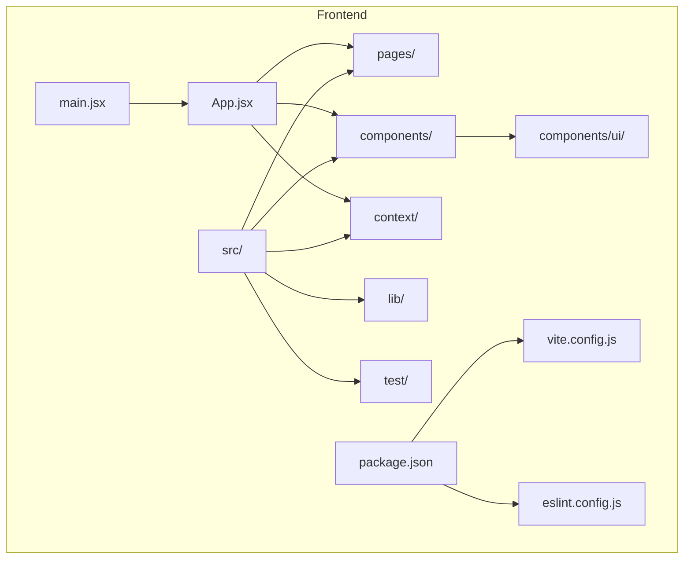
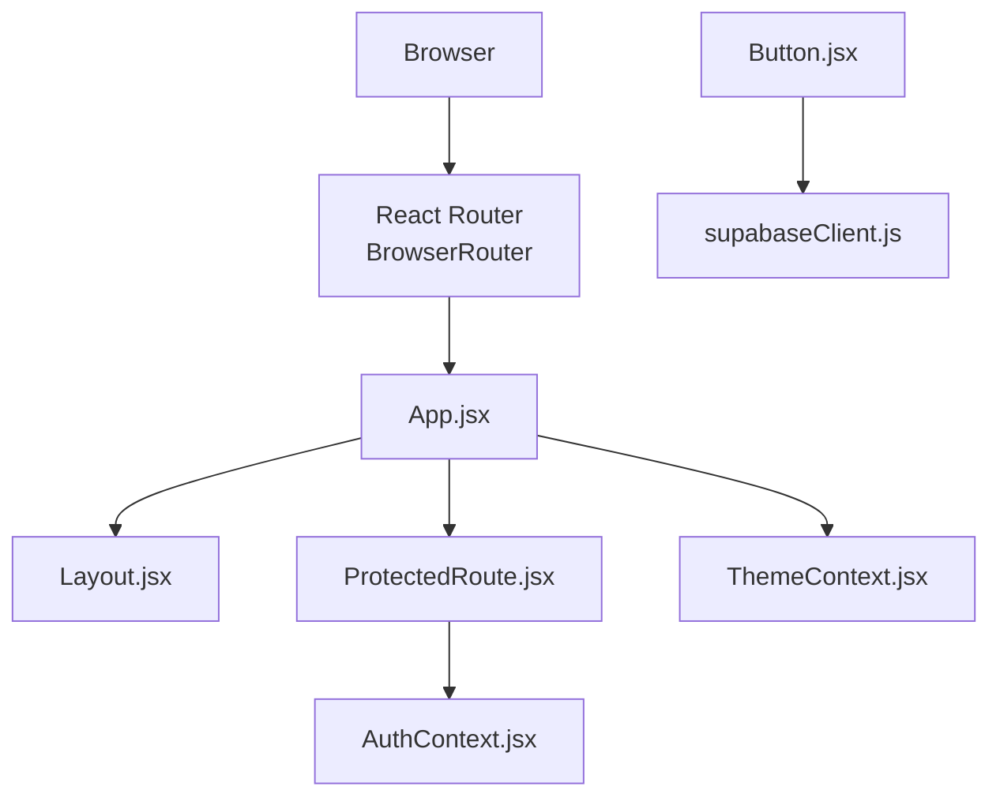
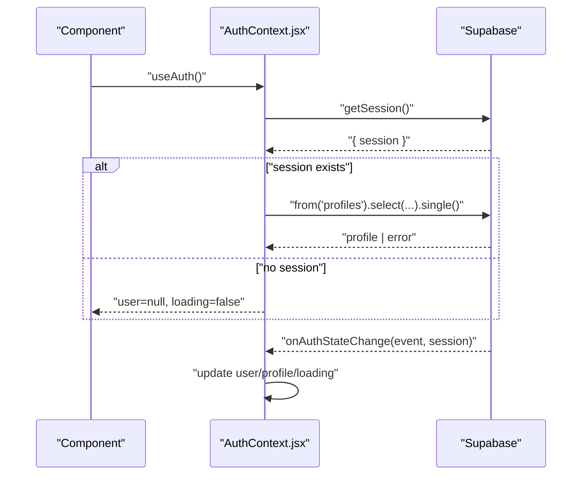
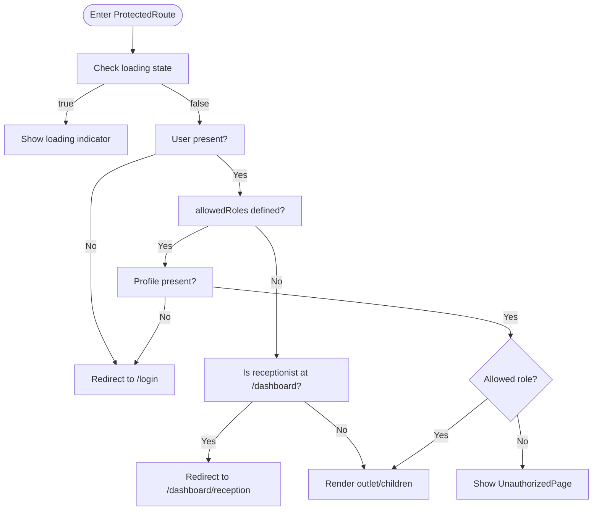
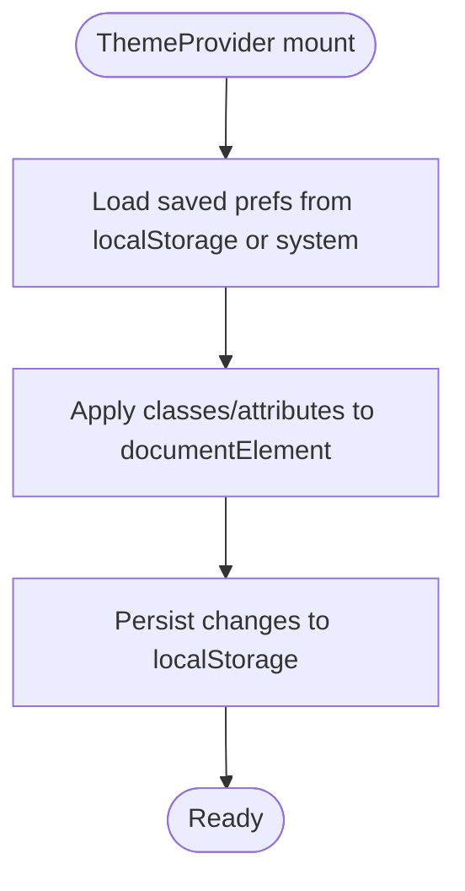
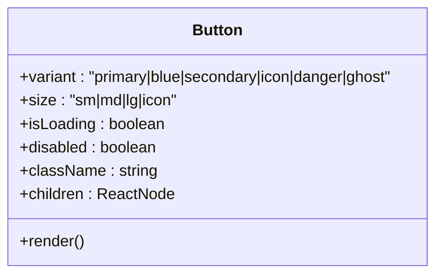
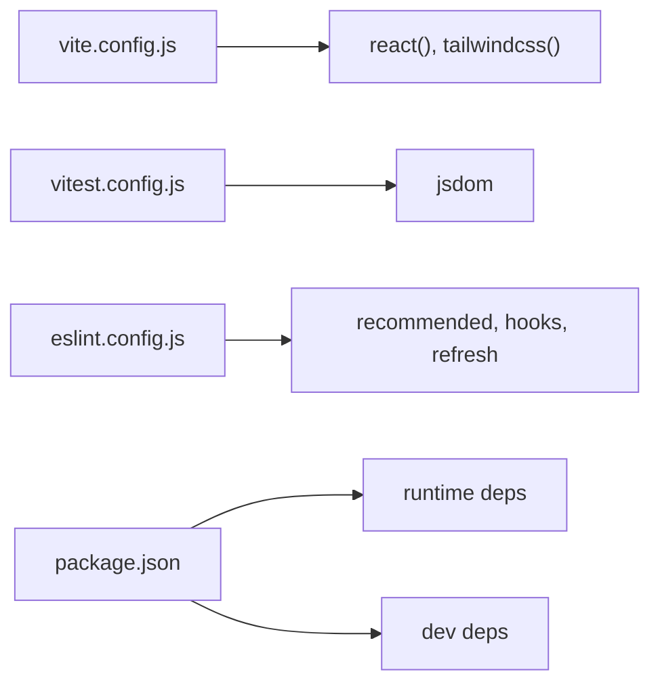

# Development Guidelines

<cite>
**Referenced Files in This Document**
- [package.json](file://frontend/package.json)
- [eslint.config.js](file://frontend/eslint.config.js)
- [vite.config.js](file://frontend/vite.config.js)
- [vitest.config.js](file://frontend/vitest.config.js)
- [setup.js](file://frontend/src/test/setup.js)
- [.gitignore](file://frontend/.gitignore)
- [README.md](file://frontend/README.md)
- [App.jsx](file://frontend/src/App.jsx)
- [main.jsx](file://frontend/src/main.jsx)
- [AuthContext.jsx](file://frontend/src/context/AuthContext.jsx)
- [ThemeContext.jsx](file://frontend/src/context/ThemeContext.jsx)
- [ProtectedRoute.jsx](file://frontend/src/components/ProtectedRoute.jsx)
- [Button.jsx](file://frontend/src/components/ui/Button.jsx)
- [supabaseClient.js](file://frontend/src/lib/supabaseClient.js)
</cite>

## Table of Contents
1. [Introduction](#introduction)
2. [Project Structure](#project-structure)
3. [Core Components](#core-components)
4. [Architecture Overview](#architecture-overview)
5. [Detailed Component Analysis](#detailed-component-analysis)
6. [Dependency Analysis](#dependency-analysis)
7. [Performance Considerations](#performance-considerations)
8. [Troubleshooting Guide](#troubleshooting-guide)
9. [Conclusion](#conclusion)
10. [Appendices](#appendices)

## Introduction
This document defines MedVita’s development guidelines for consistent, maintainable, and secure React development. It covers code formatting standards (ESLint), component naming conventions, file organization patterns, development workflow, testing requirements, commit conventions, documentation standards, dependency management, version control practices, security scanning, React best practices, performance optimization, accessibility compliance, debugging and profiling, environment setup, contribution processes, issue reporting, and the feature development lifecycle.

## Project Structure
The frontend is a React application built with Vite, styled with Tailwind CSS v4, and powered by Supabase for authentication and data. The repository follows a feature-based organization under src with clear separation of concerns:
- src/components: Reusable UI components and page-level components
- src/context: React Context providers for authentication and theme
- src/hooks: Custom hooks (if added)
- src/lib: Utility libraries (e.g., Supabase client)
- src/pages: Route-level page components
- src/test: Test setup and unit tests
- Root configs: Vite, Vitest, ESLint, package scripts

**Diagram sources**
- [main.jsx](file://frontend/src/main.jsx#L1-L17)
- [App.jsx](file://frontend/src/App.jsx#L1-L62)
- [vite.config.js](file://frontend/vite.config.js#L1-L33)
- [eslint.config.js](file://frontend/eslint.config.js#L1-L30)
- [package.json](file://frontend/package.json#L1-L50)

**Section sources**
- [README.md](file://frontend/README.md#L16-L28)
- [main.jsx](file://frontend/src/main.jsx#L1-L17)
- [App.jsx](file://frontend/src/App.jsx#L1-L62)
- [vite.config.js](file://frontend/vite.config.js#L1-L33)
- [eslint.config.js](file://frontend/eslint.config.js#L1-L30)
- [package.json](file://frontend/package.json#L1-L50)

## Core Components
- Authentication and routing are wired via React Router and protected by a role-aware ProtectedRoute wrapper.
- Theme and density are managed via a ThemeProvider that persists preferences to localStorage and applies attributes to the document root.
- Supabase client is initialized from environment variables and exposed as a singleton for use across the app.
- UI primitives like Button are centralized in components/ui for consistent styling and behavior.

**Section sources**
- [App.jsx](file://frontend/src/App.jsx#L1-L62)
- [ProtectedRoute.jsx](file://frontend/src/components/ProtectedRoute.jsx#L53-L106)
- [ThemeContext.jsx](file://frontend/src/context/ThemeContext.jsx#L1-L79)
- [AuthContext.jsx](file://frontend/src/context/AuthContext.jsx#L1-L108)
- [supabaseClient.js](file://frontend/src/lib/supabaseClient.js#L1-L11)
- [Button.jsx](file://frontend/src/components/ui/Button.jsx#L1-L51)

## Architecture Overview
The runtime architecture integrates routing, context providers, and UI components with Supabase for auth and data.

**Diagram sources**
- [main.jsx](file://frontend/src/main.jsx#L1-L17)
- [App.jsx](file://frontend/src/App.jsx#L1-L62)
- [ProtectedRoute.jsx](file://frontend/src/components/ProtectedRoute.jsx#L53-L106)
- [AuthContext.jsx](file://frontend/src/context/AuthContext.jsx#L1-L108)
- [ThemeContext.jsx](file://frontend/src/context/ThemeContext.jsx#L1-L79)
- [Button.jsx](file://frontend/src/components/ui/Button.jsx#L1-L51)
- [supabaseClient.js](file://frontend/src/lib/supabaseClient.js#L1-L11)

## Detailed Component Analysis

### Authentication and Session Management
- Initializes Supabase client from environment variables.
- Provides sign-up, sign-in, sign-out, and profile fetching.
- Ensures loading state until session and profile are resolved.
- Subscribes to auth state changes and updates context accordingly.

**Diagram sources**
- [AuthContext.jsx](file://frontend/src/context/AuthContext.jsx#L14-L61)
- [supabaseClient.js](file://frontend/src/lib/supabaseClient.js#L1-L11)

**Section sources**
- [AuthContext.jsx](file://frontend/src/context/AuthContext.jsx#L1-L108)
- [supabaseClient.js](file://frontend/src/lib/supabaseClient.js#L1-L11)

### Protected Routing and Role-Based Access Control
- Enforces role-based access via allowedRoles prop.
- Handles loading, unauthenticated, unauthorized, and default redirection scenarios.
- Redirects receptionists to their dashboard when landing on the generic dashboard route.

**Diagram sources**
- [ProtectedRoute.jsx](file://frontend/src/components/ProtectedRoute.jsx#L53-L106)

**Section sources**
- [ProtectedRoute.jsx](file://frontend/src/components/ProtectedRoute.jsx#L1-L108)

### Theme Provider and Preferences
- Persists theme, density, and app style to localStorage.
- Applies CSS classes and attributes to the document root.
- Supports light/dark mode and responsive density.

**Diagram sources**
- [ThemeContext.jsx](file://frontend/src/context/ThemeContext.jsx#L5-L51)

**Section sources**
- [ThemeContext.jsx](file://frontend/src/context/ThemeContext.jsx#L1-L79)

### UI Primitive: Button
- Centralized variants and sizes with clsx for conditional classes.
- Supports loading state with spinner and disabled states.
- Uses Lucide icons for loading visuals.

**Diagram sources**
- [Button.jsx](file://frontend/src/components/ui/Button.jsx#L5-L49)

**Section sources**
- [Button.jsx](file://frontend/src/components/ui/Button.jsx#L1-L51)

## Dependency Analysis
- Build and bundling: Vite with React plugin and Tailwind CSS v4 integration.
- Testing: Vitest with JSDOM environment and a setup file for @testing-library/jest-dom.
- Linting: ESLint flat config with recommended rules, React Hooks plugin, and React Refresh plugin.
- Runtime dependencies include React, React Router DOM, Supabase JS client, Tailwind utilities, date-fns, Framer Motion, Recharts, and PDF generation utilities.

**Diagram sources**
- [vite.config.js](file://frontend/vite.config.js#L1-L33)
- [vitest.config.js](file://frontend/vitest.config.js#L1-L19)
- [eslint.config.js](file://frontend/eslint.config.js#L1-L30)
- [package.json](file://frontend/package.json#L1-L50)

**Section sources**
- [vite.config.js](file://frontend/vite.config.js#L1-L33)
- [vitest.config.js](file://frontend/vitest.config.js#L1-L19)
- [eslint.config.js](file://frontend/eslint.config.js#L1-L30)
- [package.json](file://frontend/package.json#L1-L50)

## Performance Considerations
- Code splitting: Manual chunks separate vendor libraries (React, Recharts, Framer Motion, PDF libs, Supabase) to improve caching and initial load.
- Source maps: Disabled in production builds to reduce bundle size and protect source information.
- Chunk size warnings: Elevated warning threshold to accommodate large vendor bundles.
- Lazy loading: Consider lazy-loading heavy pages and modals to further optimize initial render.

Practical steps:
- Monitor bundle composition using Vite’s build report.
- Keep manualChunks minimal and aligned with vendor boundaries.
- Prefer lightweight alternatives for rarely-used features.

**Section sources**
- [vite.config.js](file://frontend/vite.config.js#L11-L26)

## Troubleshooting Guide
Common issues and resolutions:
- Missing Supabase credentials: The client warns if URL or anon key are missing. Ensure .env.local is configured with VITE_SUPABASE_URL and VITE_SUPABASE_ANON_KEY.
- Auth state not resolving: ProtectedRoute waits for both session and profile; if profile is missing, it redirects to login.
- Theme not persisting: Theme provider reads/writes localStorage; verify browser storage is enabled.
- Tests failing in CI: Ensure jsdom environment and setup file are configured in Vitest.

**Section sources**
- [supabaseClient.js](file://frontend/src/lib/supabaseClient.js#L6-L8)
- [ProtectedRoute.jsx](file://frontend/src/components/ProtectedRoute.jsx#L83-L87)
- [ThemeContext.jsx](file://frontend/src/context/ThemeContext.jsx#L48-L50)
- [vitest.config.js](file://frontend/vitest.config.js#L6-L17)

## Conclusion
These guidelines establish a consistent foundation for building, testing, and maintaining MedVita. By adhering to ESLint rules, component naming conventions, file organization, and the documented workflow, contributors can collaborate effectively while ensuring performance, accessibility, and security.

## Appendices

### Code Formatting Standards (ESLint)
- Use the provided flat config for recommended rules, React Hooks, and React Refresh.
- Unused variables starting with uppercase are ignored per configured pattern.
- Run the linter via the project script and fix reported issues.

**Section sources**
- [eslint.config.js](file://frontend/eslint.config.js#L25-L27)
- [package.json](file://frontend/package.json#L9-L9)

### Component Naming Conventions
- File names: PascalCase for components (e.g., Button.jsx).
- Export: Default export for page components; named exports for reusable UI primitives.
- Directory placement: Place UI primitives under components/ui; page components under pages; shared logic under context or lib.

**Section sources**
- [Button.jsx](file://frontend/src/components/ui/Button.jsx#L1-L51)
- [App.jsx](file://frontend/src/App.jsx#L1-L62)

### File Organization Patterns
- Feature-based grouping: components/, pages/, context/, lib/.
- Tests colocated with source files under src/_trash/__tests__ or src/test.
- Global test setup under src/test/setup.js.

**Section sources**
- [README.md](file://frontend/README.md#L16-L28)
- [setup.js](file://frontend/src/test/setup.js#L1-L2)

### Development Workflow
- Branching: Use feature branches prefixed with feature/, fix/, chore/, docs/.
- Commit messages: Use imperative mood; prefix with type(scope): summary (e.g., feat(auth): add ProtectedRoute).
- Pull requests: Open against develop or main; include screenshots for UI changes; link related issues.
- Code review: Require at least one reviewer; address comments promptly; ensure passing tests and lint.

[No sources needed since this section provides general guidance]

### Testing Requirements
- Unit tests: Use Vitest with jsdom; enable globals and setup file.
- Coverage: Aim for meaningful coverage; focus on critical logic (hooks, contexts, utils).
- Test locations: Place tests alongside source files or under src/test.

**Section sources**
- [vitest.config.js](file://frontend/vitest.config.js#L6-L17)
- [setup.js](file://frontend/src/test/setup.js#L1-L2)

### Commit Message Conventions
- Types: feat, fix, docs, style, refactor, perf, test, build, ci, chore, revert.
- Scope: module or feature (e.g., auth, ui, build).
- Example: feat(auth): add ProtectedRoute with role checks.

[No sources needed since this section provides general guidance]

### Documentation Standards
- Inline comments: Explain “why” for complex logic; keep public APIs documented.
- README updates: Reflect changes to setup, features, and architecture.
- Diagrams: Use Mermaid for architecture and flow diagrams within docs.

**Section sources**
- [README.md](file://frontend/README.md#L82-L89)

### Dependency Management
- Lock file: Commit package-lock.json to ensure reproducible installs.
- Updates: Review breaking changes; run tests after updates.
- Security scanning: Integrate npm audit or Snyk; resolve critical/high severity issues.

**Section sources**
- [package.json](file://frontend/package.json#L1-L50)

### Version Control Practices
- Branch protection: Protect main/develop; require reviews and checks.
- Merge strategy: Prefer squash merges for feature branches; rebase if needed.
- Changelog: Maintain a changelog or release notes for notable changes.

[No sources needed since this section provides general guidance]

### Security Scanning Procedures
- Static analysis: Run ESLint and TypeScript checks (if added).
- Secrets: Never commit secrets; use .env.local and .gitignore exclusions.
- Dependency audits: Regularly audit dependencies; remove unused packages.

**Section sources**
- [.gitignore](file://frontend/.gitignore#L15-L21)
- [package.json](file://frontend/package.json#L13-L47)

### Best Practices for React Development
- Prefer functional components with hooks.
- Keep components small and focused; extract reusable UI primitives.
- Use React Router for navigation; enforce permissions via ProtectedRoute.
- Centralize external integrations (e.g., Supabase) in lib/.

**Section sources**
- [App.jsx](file://frontend/src/App.jsx#L1-L62)
- [ProtectedRoute.jsx](file://frontend/src/components/ProtectedRoute.jsx#L53-L106)
- [supabaseClient.js](file://frontend/src/lib/supabaseClient.js#L1-L11)

### Accessibility Compliance
- Semantic HTML: Use proper headings, buttons, and landmarks.
- Color contrast: Ensure WCAG AA+ compliant color pairs.
- Focus management: Provide visible focus styles and keyboard navigation.
- ARIA: Use aria-* attributes sparingly and only when native semantics are insufficient.

[No sources needed since this section provides general guidance]

### Debugging Techniques and Profiling Tools
- Console logging: Use structured logs in AuthContext and ProtectedRoute for state transitions.
- React DevTools: Inspect component tree, hooks, and context providers.
- Profiling: Use React Profiler to identify expensive renders; optimize heavy components.
- Network tab: Monitor Supabase API calls and response times.

**Section sources**
- [AuthContext.jsx](file://frontend/src/context/AuthContext.jsx#L26-L38)
- [ProtectedRoute.jsx](file://frontend/src/components/ProtectedRoute.jsx#L59-L74)

### Development Environment Setup
- Install dependencies in the frontend directory.
- Configure environment variables (.env.local) with Supabase credentials.
- Start the dev server and open http://localhost:5173.

**Section sources**
- [README.md](file://frontend/README.md#L64-L75)
- [supabaseClient.js](file://frontend/src/lib/supabaseClient.js#L3-L8)

### Contributing, Issue Reporting, and Feature Lifecycle
- Contributing: Fork, branch, commit, and open a PR with a clear description.
- Issues: Use templates for bug reports and feature requests; label appropriately.
- Feature lifecycle: Plan → implement → test → document → review → merge.

**Section sources**
- [README.md](file://frontend/README.md#L82-L89)