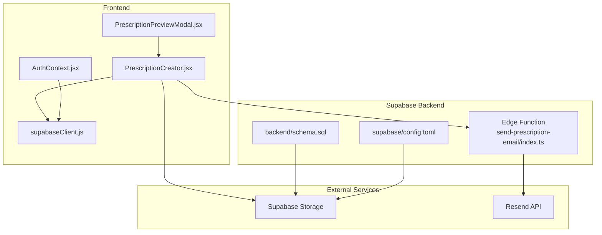
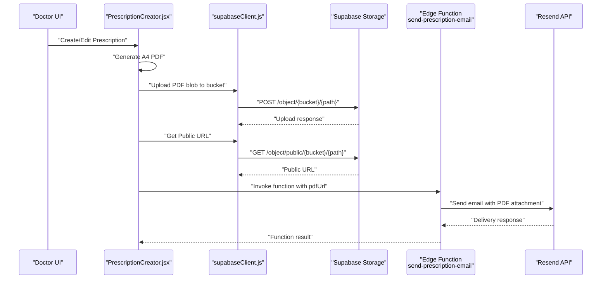
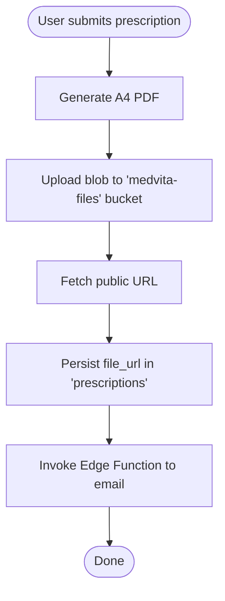
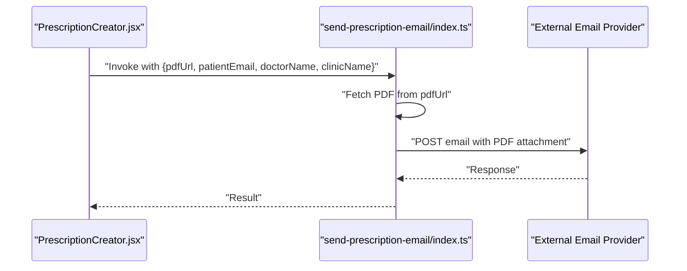
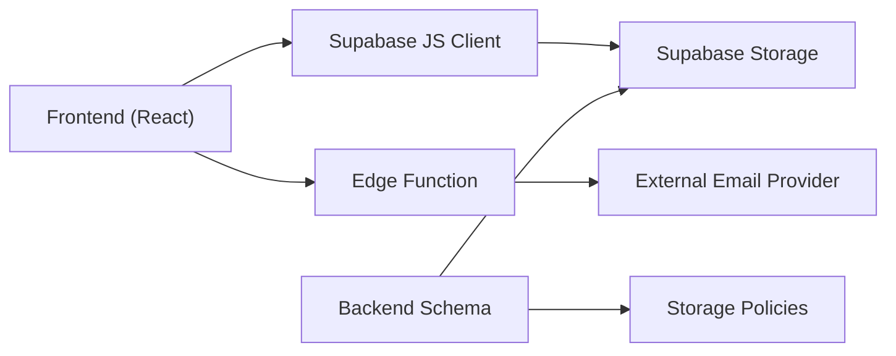

# Cloud Storage Integration

<cite>
**Referenced Files in This Document**
- [supabase/config.toml](file://supabase/config.toml)
- [supabase/functions/send-prescription-email/index.ts](file://supabase/functions/send-prescription-email/index.ts)
- [frontend/src/lib/supabaseClient.js](file://frontend/src/lib/supabaseClient.js)
- [backend/schema.sql](file://backend/schema.sql)
- [frontend/src/components/PrescriptionCreator.jsx](file://frontend/src/components/PrescriptionCreator.jsx)
- [frontend/src/components/PrescriptionPreviewModal.jsx](file://frontend/src/components/PrescriptionPreviewModal.jsx)
- [frontend/src/pages/PrescriptionsViewer.jsx](file://frontend/src/pages/PrescriptionsViewer.jsx)
- [frontend/src/context/AuthContext.jsx](file://frontend/src/context/AuthContext.jsx)
- [frontend/.env.local](file://frontend/.env.local)
- [frontend/package.json](file://frontend/package.json)
</cite>

## Table of Contents
1. [Introduction](#introduction)
2. [Project Structure](#project-structure)
3. [Core Components](#core-components)
4. [Architecture Overview](#architecture-overview)
5. [Detailed Component Analysis](#detailed-component-analysis)
6. [Dependency Analysis](#dependency-analysis)
7. [Performance Considerations](#performance-considerations)
8. [Troubleshooting Guide](#troubleshooting-guide)
9. [Conclusion](#conclusion)
10. [Appendices](#appendices)

## Introduction
This document explains the cloud storage integration for MedVita’s document management system with Supabase Storage. It covers secure file handling for prescription documents, including upload, retrieval, access control, metadata management, and the relationship with email automation. It also documents bucket configuration, access permissions, lifecycle considerations, security measures, and troubleshooting guidance.

## Project Structure
The cloud storage integration spans three layers:
- Frontend React application that generates PDFs, uploads to Supabase Storage, and triggers email delivery.
- Supabase Edge Function that attaches the PDF to an email and sends it via an external provider.
- Supabase backend with Row Level Security (RLS) and storage policies governing access.

**Diagram sources**
- [frontend/src/components/PrescriptionCreator.jsx](file://frontend/src/components/PrescriptionCreator.jsx#L1-L303)
- [frontend/src/components/PrescriptionPreviewModal.jsx](file://frontend/src/components/PrescriptionPreviewModal.jsx#L1-L331)
- [frontend/src/lib/supabaseClient.js](file://frontend/src/lib/supabaseClient.js#L1-L11)
- [frontend/src/context/AuthContext.jsx](file://frontend/src/context/AuthContext.jsx#L1-L108)
- [supabase/config.toml](file://supabase/config.toml#L105-L120)
- [backend/schema.sql](file://backend/schema.sql#L226-L238)
- [supabase/functions/send-prescription-email/index.ts](file://supabase/functions/send-prescription-email/index.ts#L1-L193)

**Section sources**
- [frontend/src/components/PrescriptionCreator.jsx](file://frontend/src/components/PrescriptionCreator.jsx#L1-L303)
- [frontend/src/components/PrescriptionPreviewModal.jsx](file://frontend/src/components/PrescriptionPreviewModal.jsx#L1-L331)
- [frontend/src/lib/supabaseClient.js](file://frontend/src/lib/supabaseClient.js#L1-L11)
- [frontend/src/context/AuthContext.jsx](file://frontend/src/context/AuthContext.jsx#L1-L108)
- [supabase/config.toml](file://supabase/config.toml#L105-L120)
- [backend/schema.sql](file://backend/schema.sql#L226-L238)
- [supabase/functions/send-prescription-email/index.ts](file://supabase/functions/send-prescription-email/index.ts#L1-L193)

## Core Components
- Supabase Storage bucket medvita-files configured as public with size limits and S3-compatible protocol enabled.
- Supabase Edge Function to fetch the PDF from the storage URL, encode it, and send it via an external email service.
- Frontend components that generate A4-compliant PDFs, upload to storage, and invoke the Edge Function to email the document.
- Backend schema with storage bucket initialization and RLS policies for storage.objects.
- Authentication context that provides user/session context for uploads and access checks.

**Section sources**
- [supabase/config.toml](file://supabase/config.toml#L105-L120)
- [supabase/functions/send-prescription-email/index.ts](file://supabase/functions/send-prescription-email/index.ts#L1-L193)
- [frontend/src/components/PrescriptionCreator.jsx](file://frontend/src/components/PrescriptionCreator.jsx#L53-L98)
- [backend/schema.sql](file://backend/schema.sql#L226-L238)
- [frontend/src/context/AuthContext.jsx](file://frontend/src/context/AuthContext.jsx#L14-L41)

## Architecture Overview
The system integrates the frontend, Supabase Storage, and an external email provider through an Edge Function. The flow ensures secure, auditable document handling with access controls enforced by Supabase.

**Diagram sources**
- [frontend/src/components/PrescriptionCreator.jsx](file://frontend/src/components/PrescriptionCreator.jsx#L53-L98)
- [frontend/src/lib/supabaseClient.js](file://frontend/src/lib/supabaseClient.js#L1-L11)
- [supabase/functions/send-prescription-email/index.ts](file://supabase/functions/send-prescription-email/index.ts#L152-L170)

## Detailed Component Analysis

### Supabase Storage Bucket Configuration
- Bucket name: medvita-files
- Public: true
- File size limit: 50 MiB
- S3-compatible protocol enabled
- Objects path not set (defaults to in-repo storage for local dev)

Security and access:
- RLS policies restrict storage.objects access to authenticated users for the medvita-files bucket.
- Insert/select policies enforce that only authenticated users can upload and view objects in this bucket.

Lifecycle and retention:
- No explicit lifecycle rules configured in the referenced files. Consider setting up versioning and expiration policies at the bucket level if needed.

**Section sources**
- [supabase/config.toml](file://supabase/config.toml#L105-L120)
- [backend/schema.sql](file://backend/schema.sql#L226-L238)

### Frontend PDF Generation and Upload
- PrescriptionCreator.jsx:
  - Generates an A4 PDF from a rendered template.
  - Uploads the PDF blob to the medvita-files bucket under a path scoped to the doctor’s user ID.
  - Sets cache-control and content-type for the uploaded object.
  - Retrieves the public URL for later use.
- PrescriptionPreviewModal.jsx:
  - Provides a high-fidelity A4 preview and supports direct PDF download/print.

**Diagram sources**
- [frontend/src/components/PrescriptionCreator.jsx](file://frontend/src/components/PrescriptionCreator.jsx#L53-L98)
- [frontend/src/components/PrescriptionPreviewModal.jsx](file://frontend/src/components/PrescriptionPreviewModal.jsx#L186-L224)

**Section sources**
- [frontend/src/components/PrescriptionCreator.jsx](file://frontend/src/components/PrescriptionCreator.jsx#L53-L98)
- [frontend/src/components/PrescriptionPreviewModal.jsx](file://frontend/src/components/PrescriptionPreviewModal.jsx#L186-L224)

### Edge Function for Email Automation
- The Edge Function fetches the PDF from the provided URL, encodes it, and sends it via an external provider using a bearer token from environment configuration.
- It constructs a branded HTML email and attaches the PDF.
- Returns success or error responses.

**Diagram sources**
- [supabase/functions/send-prescription-email/index.ts](file://supabase/functions/send-prescription-email/index.ts#L25-L60)
- [supabase/functions/send-prescription-email/index.ts](file://supabase/functions/send-prescription-email/index.ts#L152-L170)

**Section sources**
- [supabase/functions/send-prescription-email/index.ts](file://supabase/functions/send-prescription-email/index.ts#L1-L193)

### Access Control and Metadata
- Access control:
  - Authenticated users can insert and select objects in the medvita-files bucket.
  - RLS policies on prescriptions ensure only authorized users can view or manage documents.
- Metadata:
  - The prescriptions table stores file_url returned by the storage public URL endpoint.
  - The frontend sets cache-control and content-type during upload.

**Section sources**
- [backend/schema.sql](file://backend/schema.sql#L226-L238)
- [frontend/src/components/PrescriptionCreator.jsx](file://frontend/src/components/PrescriptionCreator.jsx#L84-L98)

### Relationship Between Cloud Storage and Email Automation
- The frontend obtains a public URL for the uploaded PDF and passes it to the Edge Function.
- The Edge Function retrieves the PDF and attaches it to an email sent to the patient.
- This decouples storage from email delivery and centralizes transport logic in the Edge Function.

**Section sources**
- [frontend/src/components/PrescriptionCreator.jsx](file://frontend/src/components/PrescriptionCreator.jsx#L152-L168)
- [supabase/functions/send-prescription-email/index.ts](file://supabase/functions/send-prescription-email/index.ts#L48-L58)

## Dependency Analysis
- Frontend depends on Supabase JS client and local environment variables for Supabase URL and anon key.
- Edge Function depends on environment configuration for the external email provider.
- Backend schema defines storage bucket and RLS policies.

**Diagram sources**
- [frontend/src/lib/supabaseClient.js](file://frontend/src/lib/supabaseClient.js#L1-L11)
- [frontend/.env.local](file://frontend/.env.local#L1-L5)
- [supabase/functions/send-prescription-email/index.ts](file://supabase/functions/send-prescription-email/index.ts#L31-L46)
- [backend/schema.sql](file://backend/schema.sql#L226-L238)

**Section sources**
- [frontend/src/lib/supabaseClient.js](file://frontend/src/lib/supabaseClient.js#L1-L11)
- [frontend/.env.local](file://frontend/.env.local#L1-L5)
- [supabase/functions/send-prescription-email/index.ts](file://supabase/functions/send-prescription-email/index.ts#L31-L46)
- [backend/schema.sql](file://backend/schema.sql#L226-L238)

## Performance Considerations
- PDF generation:
  - Uses html2canvas with moderate scale and JPEG compression to balance quality and size.
  - A4 dimensions are fixed to minimize rendering overhead.
- Upload:
  - Content type set to application/pdf; cache-control set to 1 hour.
  - File size limit of 50 MiB applies to uploads.
- Retrieval:
  - Public URL access is fast; consider CDN caching at the bucket level if traffic increases.
- Edge Function:
  - Fetches PDF and performs base64 encoding; keep PDFs within the configured size limit to avoid timeouts.

[No sources needed since this section provides general guidance]

## Troubleshooting Guide

Common issues and resolutions:
- Upload failures
  - Verify Supabase URL and anon key are present in environment variables.
  - Confirm the medvita-files bucket exists and is public.
  - Ensure the authenticated user is logged in; storage policies require authenticated access.
  - Check file size against the configured 50 MiB limit.
- Access denied errors
  - Ensure RLS policies are satisfied: authenticated user and correct bucket_id.
  - Verify the user role and session state.
- Storage quota management
  - Monitor total bucket usage; consider enabling versioning and lifecycle policies at the bucket level.
- Email delivery failures
  - Confirm the external provider API key is set in the Edge Function environment.
  - Inspect function logs for decoding or HTTP errors.
- Document visibility
  - Public URL requires the object to be readable by authenticated users and the bucket to be public.

**Section sources**
- [frontend/.env.local](file://frontend/.env.local#L1-L5)
- [supabase/config.toml](file://supabase/config.toml#L105-L120)
- [backend/schema.sql](file://backend/schema.sql#L226-L238)
- [frontend/src/context/AuthContext.jsx](file://frontend/src/context/AuthContext.jsx#L14-L41)
- [supabase/functions/send-prescription-email/index.ts](file://supabase/functions/send-prescription-email/index.ts#L41-L46)

## Conclusion
MedVita’s cloud storage integration leverages Supabase Storage for secure, authenticated document handling and integrates seamlessly with an Edge Function for automated email delivery. The system enforces access control via RLS and storage policies, manages metadata through the prescriptions table, and provides a robust pipeline for generating, uploading, retrieving, and sharing clinical documents.

[No sources needed since this section summarizes without analyzing specific files]

## Appendices

### Storage Bucket Configuration Reference
- Bucket: medvita-files
- Public: true
- File size limit: 50 MiB
- S3-compatible protocol: enabled

**Section sources**
- [supabase/config.toml](file://supabase/config.toml#L105-L120)

### Document Types and Metadata
- Document type: Prescription PDFs
- Metadata stored: file_url in the prescriptions table
- Additional metadata: cache-control and content-type set during upload

**Section sources**
- [frontend/src/components/PrescriptionCreator.jsx](file://frontend/src/components/PrescriptionCreator.jsx#L84-L98)
- [backend/schema.sql](file://backend/schema.sql#L200-L208)

### Security Measures
- Transport security: HTTPS endpoints and external provider communication over TLS.
- At-rest security: Managed by Supabase Storage; consider enabling encryption at the bucket level if required.
- Access control: Authenticated-only access to the bucket; RLS on prescriptions.
- Audit logging: Use Supabase logs and Edge Function logs for tracking uploads and email deliveries.

**Section sources**
- [supabase/functions/send-prescription-email/index.ts](file://supabase/functions/send-prescription-email/index.ts#L152-L170)
- [backend/schema.sql](file://backend/schema.sql#L226-L238)

### Backup and Recovery Procedures
- Back up the prescriptions table and associated file_url references regularly.
- For critical documents, maintain off-site copies and versioning at the bucket level.
- Test restore procedures periodically to ensure compliance with medical record retention requirements.

[No sources needed since this section provides general guidance]