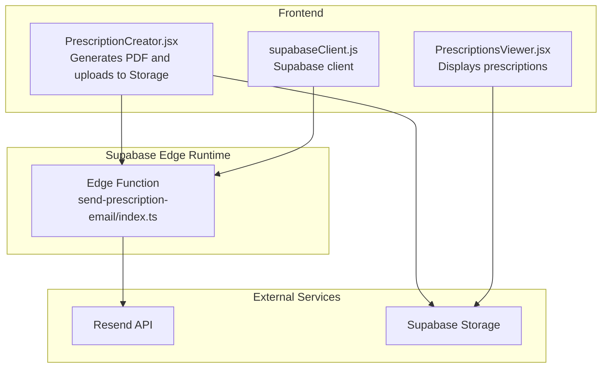
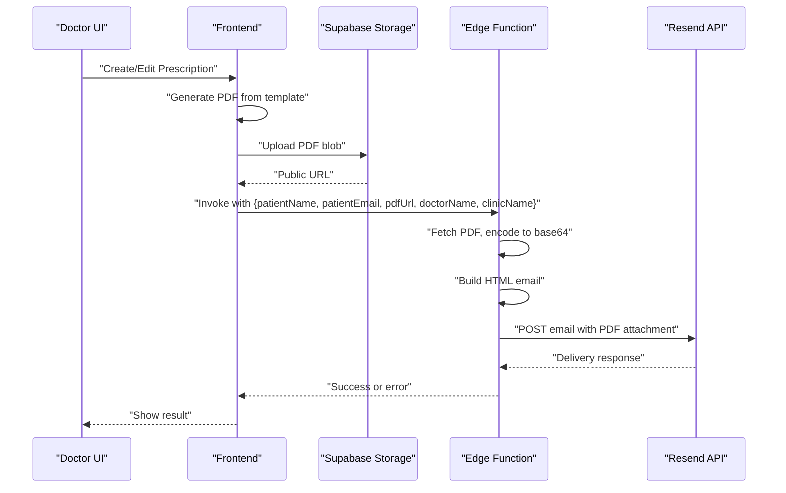
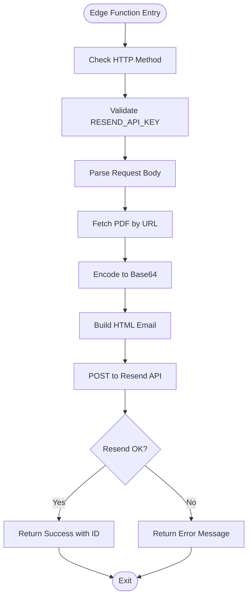
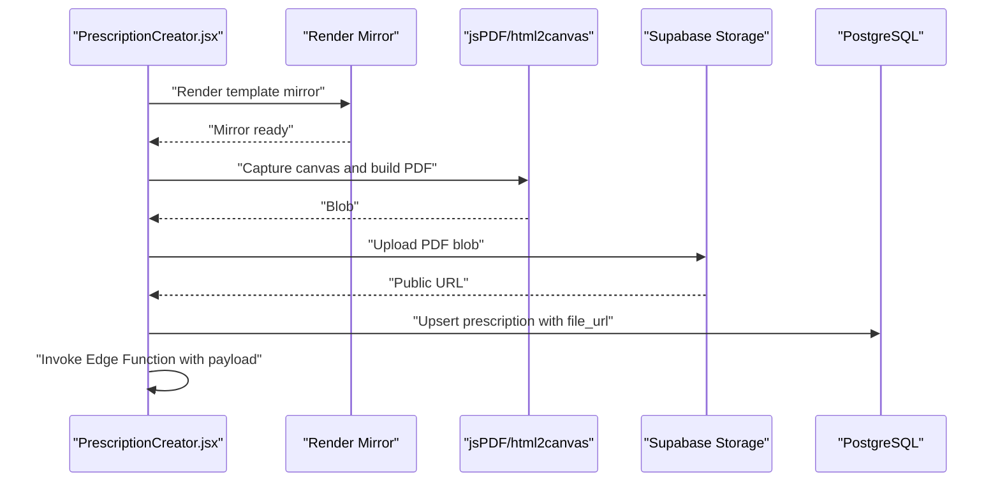
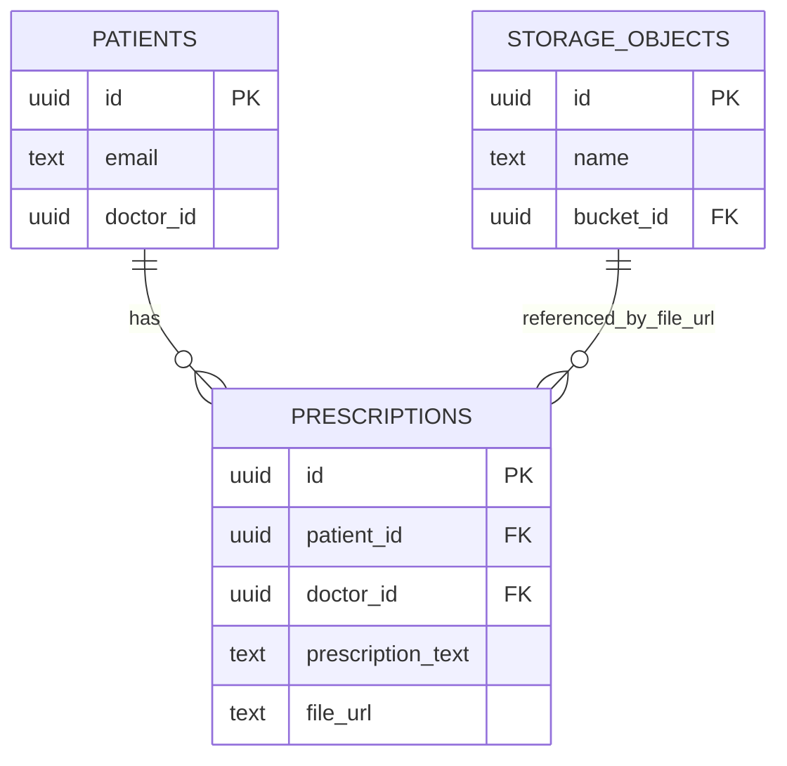
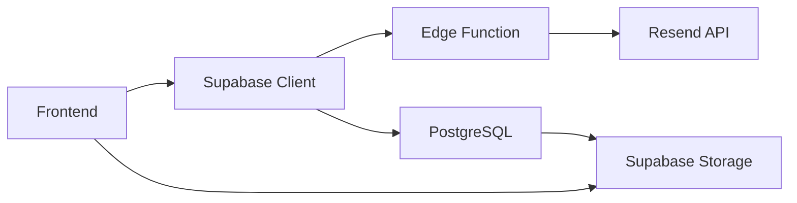

# Email Automation System

<cite>
**Referenced Files in This Document**
- [index.ts](file://supabase/functions/send-prescription-email/index.ts)
- [config.toml](file://supabase/config.toml)
- [schema.sql](file://backend/schema.sql)
- [PrescriptionCreator.jsx](file://frontend/src/components/PrescriptionCreator.jsx)
- [PrescriptionsViewer.jsx](file://frontend/src/pages/PrescriptionsViewer.jsx)
- [supabaseClient.js](file://frontend/src/lib/supabaseClient.js)
- [.env.local](file://frontend/.env.local)
</cite>

## Table of Contents
1. [Introduction](#introduction)
2. [Project Structure](#project-structure)
3. [Core Components](#core-components)
4. [Architecture Overview](#architecture-overview)
5. [Detailed Component Analysis](#detailed-component-analysis)
6. [Dependency Analysis](#dependency-analysis)
7. [Performance Considerations](#performance-considerations)
8. [Troubleshooting Guide](#troubleshooting-guide)
9. [Conclusion](#conclusion)
10. [Appendices](#appendices)

## Introduction
This document describes MedVita’s email automation system for the prescription delivery workflow. It covers the Supabase edge function that generates and sends HTML emails with PDF attachments, the frontend integration that creates and uploads PDFs, the database schema supporting secure document storage, and operational guidance for authentication, rate limiting, monitoring, and troubleshooting.

## Project Structure
The email automation spans three areas:
- Frontend: Generates a printable PDF from a prescription template and uploads it to Supabase Storage.
- Backend (Supabase Edge Function): Receives a payload, fetches the PDF, builds a modern HTML email, and sends it via the Resend API.
- Database: Stores prescriptions and integrates with Supabase Storage for secure file access.

**Diagram sources**
- [PrescriptionCreator.jsx](file://frontend/src/components/PrescriptionCreator.jsx#L53-L98)
- [PrescriptionCreator.jsx](file://frontend/src/components/PrescriptionCreator.jsx#L100-L188)
- [index.ts](file://supabase/functions/send-prescription-email/index.ts#L25-L193)
- [schema.sql](file://backend/schema.sql#L200-L238)

**Section sources**
- [PrescriptionCreator.jsx](file://frontend/src/components/PrescriptionCreator.jsx#L1-L303)
- [PrescriptionsViewer.jsx](file://frontend/src/pages/PrescriptionsViewer.jsx#L1-L273)
- [index.ts](file://supabase/functions/send-prescription-email/index.ts#L1-L193)
- [schema.sql](file://backend/schema.sql#L200-L238)

## Core Components
- Prescription PDF generation and upload (frontend):
  - Uses a hidden DOM mirror to render the prescription content, captures it as a canvas, converts to PDF, and uploads to Supabase Storage under a structured path.
- Edge function for email delivery:
  - Accepts a JSON payload with patient and doctor details, fetches the PDF from Storage, encodes it, constructs an HTML email, and posts to the Resend API.
- Database and storage policies:
  - Prescriptions table stores metadata and the public URL to the PDF.
  - Storage bucket and Row Level Security (RLS) policies restrict access to authenticated users.

**Section sources**
- [PrescriptionCreator.jsx](file://frontend/src/components/PrescriptionCreator.jsx#L53-L98)
- [PrescriptionCreator.jsx](file://frontend/src/components/PrescriptionCreator.jsx#L100-L188)
- [index.ts](file://supabase/functions/send-prescription-email/index.ts#L25-L193)
- [schema.sql](file://backend/schema.sql#L200-L238)

## Architecture Overview
The end-to-end flow:
1. Doctor creates or updates a prescription in the frontend.
2. The frontend generates a PDF and uploads it to Supabase Storage, returning a public URL.
3. The frontend invokes the Supabase Edge Function with the patient and doctor details plus the PDF URL.
4. The edge function fetches the PDF, builds HTML, and sends via Resend.
5. The system logs and returns results; the frontend displays success or error.

**Diagram sources**
- [PrescriptionCreator.jsx](file://frontend/src/components/PrescriptionCreator.jsx#L53-L98)
- [PrescriptionCreator.jsx](file://frontend/src/components/PrescriptionCreator.jsx#L100-L188)
- [index.ts](file://supabase/functions/send-prescription-email/index.ts#L25-L193)

## Detailed Component Analysis

### Edge Function: send-prescription-email
Responsibilities:
- Validate configuration and request payload.
- Fetch and encode the PDF from the provided URL.
- Construct a modern HTML email with dynamic content injection.
- Send via Resend API with optional PDF attachment.
- Return structured success/error responses.

Key behaviors:
- CORS handling for preflight requests.
- Safe defaults for missing doctor/clinic/patient names.
- Base64 encoding for PDF attachment.
- Resend API Authorization header and JSON body construction.
- Error handling for PDF fetch failures and Resend errors.

**Diagram sources**
- [index.ts](file://supabase/functions/send-prescription-email/index.ts#L25-L193)

**Section sources**
- [index.ts](file://supabase/functions/send-prescription-email/index.ts#L1-L193)

### Frontend: Prescription Creation and PDF Upload
Responsibilities:
- Capture user inputs (diagnosis, treatment), auto-fill patient email if available.
- Render a hidden mirror of the prescription template, capture as canvas, convert to PDF, and upload to Supabase Storage.
- Persist the prescription record and update with the generated PDF URL.
- Invoke the edge function with the payload for email delivery.

Processing logic highlights:
- Canvas rendering with fixed A4 dimensions and compression.
- Uploading to a bucket with authenticated access policies.
- Generating a public URL for the PDF.
- Invoking the Supabase Edge Function with patient and doctor details.

**Diagram sources**
- [PrescriptionCreator.jsx](file://frontend/src/components/PrescriptionCreator.jsx#L53-L98)
- [PrescriptionCreator.jsx](file://frontend/src/components/PrescriptionCreator.jsx#L100-L188)

**Section sources**
- [PrescriptionCreator.jsx](file://frontend/src/components/PrescriptionCreator.jsx#L1-L303)

### Database and Storage Integration
- Prescriptions table stores:
  - Patient and doctor identifiers.
  - Human-readable prescription text.
  - Public URL to the uploaded PDF.
- Storage bucket:
  - Bucket named for file organization.
  - RLS policies allow authenticated users to upload and view files.
- Access control:
  - Row-level policies ensure only authorized users can view or modify prescriptions.

**Diagram sources**
- [schema.sql](file://backend/schema.sql#L200-L238)

**Section sources**
- [schema.sql](file://backend/schema.sql#L200-L238)

### Email Template System and Dynamic Content Injection
- HTML email is constructed dynamically using injected values:
  - Patient name, doctor name, clinic name.
  - PDF URL for viewing/download.
- The template includes:
  - Modern header and footer.
  - A “glassmorphism” card for the PDF.
  - Health tips section.
- Dynamic content is inserted safely with fallbacks for missing fields.

**Section sources**
- [index.ts](file://supabase/functions/send-prescription-email/index.ts#L61-L149)

### Integration with Resend API
- Authentication:
  - Uses a Bearer token from the Supabase edge runtime environment variable.
- Delivery:
  - Sends a POST request with from, to, subject, HTML body, and optional attachments.
- Error handling:
  - Returns structured error messages if the Resend API responds with non-OK status.

**Section sources**
- [index.ts](file://supabase/functions/send-prescription-email/index.ts#L151-L184)

### Trigger Conditions and Invocation Flow
- Triggered by the frontend when the doctor clicks “Create & Send Email” or “Update & Email.”
- The frontend:
  - Updates the patient email if changed.
  - Upserts the prescription record.
  - Uploads the PDF and obtains a public URL.
  - Invokes the Supabase Edge Function with the payload.

**Section sources**
- [PrescriptionCreator.jsx](file://frontend/src/components/PrescriptionCreator.jsx#L100-L188)

### Error Handling and Retry Mechanisms
- PDF fetch failure:
  - Logs and continues without an attachment.
- Resend API error:
  - Parses and returns the error message.
- Function crash:
  - Catches exceptions and returns a structured error response.
- Retry guidance:
  - Not implemented in the current function; consider idempotent invocation and exponential backoff at the caller level if needed.

**Section sources**
- [index.ts](file://supabase/functions/send-prescription-email/index.ts#L48-L58)
- [index.ts](file://supabase/functions/send-prescription-email/index.ts#L174-L191)

### Configuration Examples
- Supabase Edge Function environment:
  - RESEND_API_KEY must be configured in the Supabase project secrets.
- Supabase Storage:
  - Ensure the bucket exists and RLS policies permit authenticated uploads/views.
- Frontend environment:
  - Supabase URL and anon key are loaded from environment variables.

**Section sources**
- [index.ts](file://supabase/functions/send-prescription-email/index.ts#L31-L46)
- [schema.sql](file://backend/schema.sql#L226-L238)
- [.env.local](file://frontend/.env.local#L1-L5)
- [supabaseClient.js](file://frontend/src/lib/supabaseClient.js#L1-L10)

## Dependency Analysis
- Frontend depends on:
  - Supabase client for database and edge function invocations.
  - Storage SDK for uploads and public URL retrieval.
- Edge function depends on:
  - Supabase runtime environment for secrets.
  - Resend API for transactional email delivery.
- Database and storage depend on:
  - RLS policies and bucket policies for access control.

**Diagram sources**
- [PrescriptionCreator.jsx](file://frontend/src/components/PrescriptionCreator.jsx#L100-L188)
- [index.ts](file://supabase/functions/send-prescription-email/index.ts#L25-L193)
- [schema.sql](file://backend/schema.sql#L200-L238)

**Section sources**
- [PrescriptionCreator.jsx](file://frontend/src/components/PrescriptionCreator.jsx#L100-L188)
- [index.ts](file://supabase/functions/send-prescription-email/index.ts#L25-L193)
- [schema.sql](file://backend/schema.sql#L200-L238)

## Performance Considerations
- PDF generation:
  - Rendering and conversion can be CPU-intensive; keep the template minimal and avoid heavy images.
- Attachment size:
  - Base64-encoded PDF increases payload size; monitor Resend limits and consider optimizing image quality/compression.
- Edge function cold starts:
  - Keep the function small and avoid unnecessary dependencies to minimize latency.
- Storage bandwidth:
  - Ensure adequate throughput for PDF downloads; consider CDN-backed public URLs.

## Troubleshooting Guide
Common issues and resolutions:
- Missing RESEND_API_KEY:
  - Verify the environment variable is set in the Supabase project secrets.
- PDF fetch failures:
  - Confirm the public URL is accessible and the PDF exists.
- Resend API errors:
  - Inspect returned error messages; check sender domain verification and rate limits.
- Access denied to storage:
  - Ensure the bucket policy allows authenticated uploads and the user is signed in.
- Frontend invocation errors:
  - Check Supabase Edge Functions logs and verify the function name matches the deployment.

Monitoring and logging:
- Enable Supabase Edge Functions logs to track invocations, errors, and response IDs.
- Monitor Resend delivery events and bounce rates.
- Track Storage access logs for PDF downloads.

**Section sources**
- [index.ts](file://supabase/functions/send-prescription-email/index.ts#L41-L46)
- [index.ts](file://supabase/functions/send-prescription-email/index.ts#L56-L58)
- [index.ts](file://supabase/functions/send-prescription-email/index.ts#L174-L184)
- [schema.sql](file://backend/schema.sql#L231-L238)

## Conclusion
MedVita’s email automation pipeline integrates a frontend PDF generator, secure storage, and a Supabase edge function that delivers modern HTML emails with PDF attachments via Resend. The system leverages Supabase’s built-in security and edge runtime to provide a robust, auditable, and scalable solution for clinical document delivery.

## Appendices

### Security Considerations
- Data privacy:
  - Use authenticated storage and RLS policies to restrict access to prescriptions and PDFs.
- Access controls:
  - Limit edge function secrets exposure; avoid logging sensitive values.
- Transport security:
  - Ensure HTTPS endpoints and secure Resend API communication.

### Operational Checklist
- Confirm Supabase Edge Function environment variables are set.
- Verify Supabase Storage bucket and policies.
- Test Resend sender domain and rate limits.
- Validate frontend environment variables for Supabase client initialization.