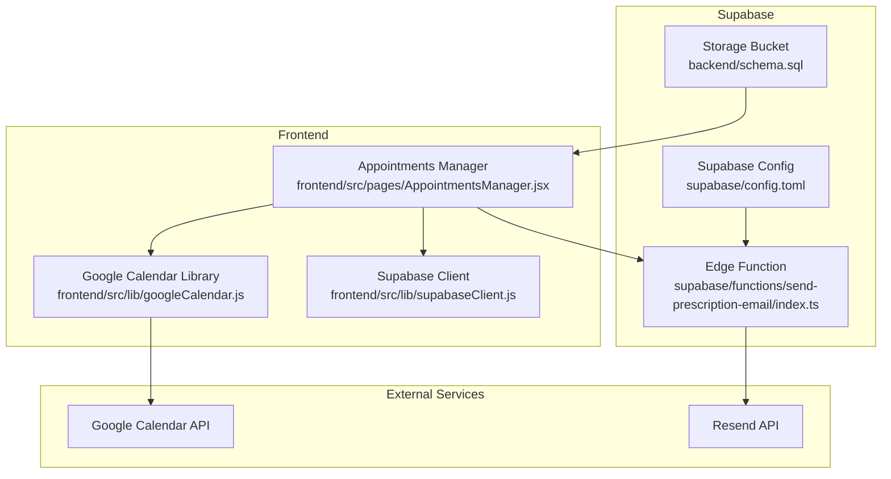
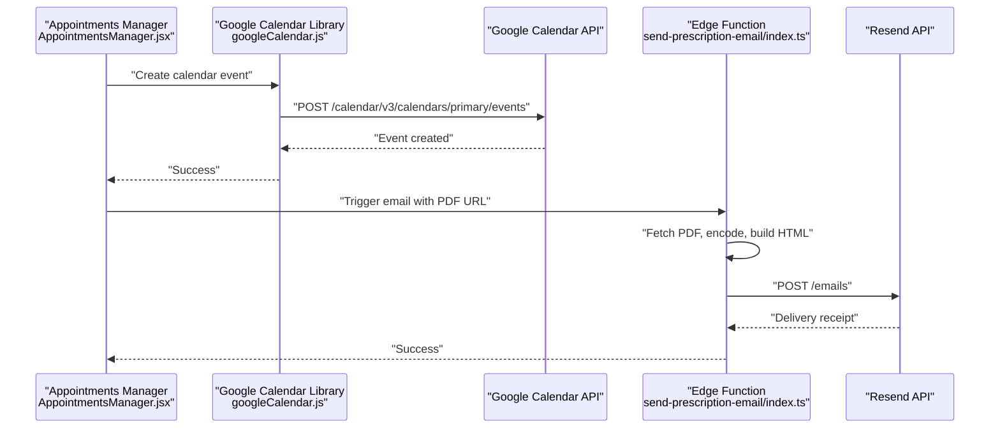
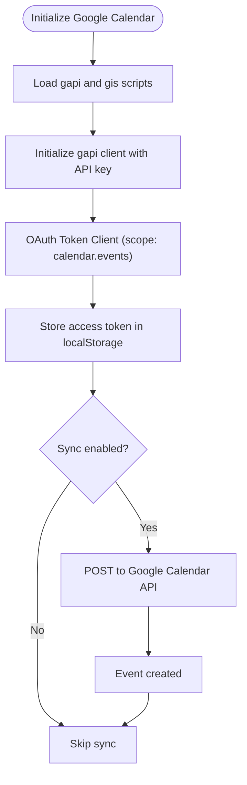
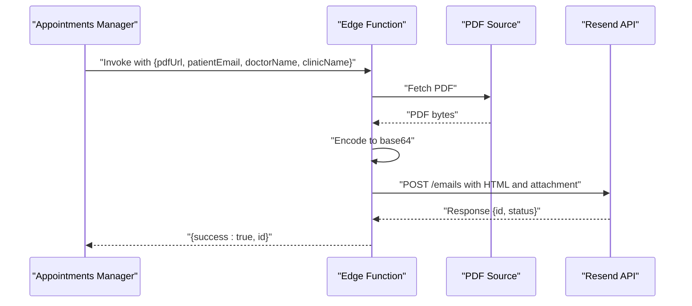
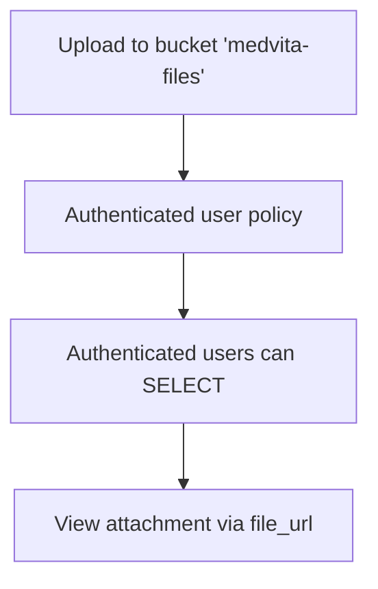
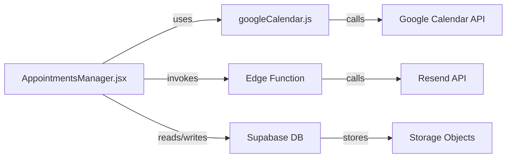

# External Integrations

<cite>
**Referenced Files in This Document**
- [googleCalendar.js](file://frontend/src/lib/googleCalendar.js)
- [GOOGLE_CALENDAR_SETUP.md](file://frontend/GOOGLE_CALENDAR_SETUP.md)
- [AppointmentsManager.jsx](file://frontend/src/pages/AppointmentsManager.jsx)
- [supabaseClient.js](file://frontend/src/lib/supabaseClient.js)
- [send-prescription-email/index.ts](file://supabase/functions/send-prescription-email/index.ts)
- [schema.sql](file://backend/schema.sql)
- [config.toml](file://supabase/config.toml)
- [.env.example](file://frontend/.env.example)
</cite>

## Table of Contents
1. [Introduction](#introduction)
2. [Project Structure](#project-structure)
3. [Core Components](#core-components)
4. [Architecture Overview](#architecture-overview)
5. [Detailed Component Analysis](#detailed-component-analysis)
6. [Dependency Analysis](#dependency-analysis)
7. [Performance Considerations](#performance-considerations)
8. [Troubleshooting Guide](#troubleshooting-guide)
9. [Conclusion](#conclusion)
10. [Appendices](#appendices)

## Introduction
This document explains MedVita’s external integrations for third-party services, focusing on:
- Google Calendar API for appointment synchronization and calendar management
- Email automation via Supabase Edge Functions and the Resend API for transactional emails
- Supabase Storage for document management
- Authentication and configuration mechanisms
- Error handling, rate limiting, and failure recovery strategies
- Monitoring and troubleshooting guidance

## Project Structure
External integrations span the frontend and Supabase Edge Functions:
- Frontend library for Google Calendar OAuth and event creation
- Supabase Edge Function that generates and sends a PDF-based email via Resend
- Supabase Storage bucket for document hosting
- Supabase configuration enabling Edge Runtime and Storage

**Diagram sources**
- [googleCalendar.js](file://frontend/src/lib/googleCalendar.js#L1-L199)
- [AppointmentsManager.jsx](file://frontend/src/pages/AppointmentsManager.jsx#L1-L200)
- [supabaseClient.js](file://frontend/src/lib/supabaseClient.js#L1-L11)
- [send-prescription-email/index.ts](file://supabase/functions/send-prescription-email/index.ts#L1-L193)
- [config.toml](file://supabase/config.toml#L353-L362)
- [schema.sql](file://backend/schema.sql#L226-L238)

**Section sources**
- [googleCalendar.js](file://frontend/src/lib/googleCalendar.js#L1-L199)
- [AppointmentsManager.jsx](file://frontend/src/pages/AppointmentsManager.jsx#L1-L200)
- [supabaseClient.js](file://frontend/src/lib/supabaseClient.js#L1-L11)
- [send-prescription-email/index.ts](file://supabase/functions/send-prescription-email/index.ts#L1-L193)
- [schema.sql](file://backend/schema.sql#L226-L238)
- [config.toml](file://supabase/config.toml#L353-L362)

## Core Components
- Google Calendar Integration: OAuth-based event creation and calendar link generation
- Supabase Edge Function: Receives a PDF URL, fetches and attaches the PDF, composes HTML, and sends via Resend
- Supabase Storage: Hosts documents and enforces access policies
- Supabase Client: Provides Supabase JS SDK initialization and runtime configuration

**Section sources**
- [googleCalendar.js](file://frontend/src/lib/googleCalendar.js#L6-L123)
- [send-prescription-email/index.ts](file://supabase/functions/send-prescription-email/index.ts#L25-L193)
- [schema.sql](file://backend/schema.sql#L226-L238)
- [supabaseClient.js](file://frontend/src/lib/supabaseClient.js#L1-L11)

## Architecture Overview
End-to-end flows for appointment synchronization and email automation:

**Diagram sources**
- [AppointmentsManager.jsx](file://frontend/src/pages/AppointmentsManager.jsx#L163-L171)
- [googleCalendar.js](file://frontend/src/lib/googleCalendar.js#L125-L178)
- [send-prescription-email/index.ts](file://supabase/functions/send-prescription-email/index.ts#L48-L170)

## Detailed Component Analysis

### Google Calendar Integration
- Initialization and OAuth:
  - Loads Google API scripts and initializes the client with API key and discovery doc
  - Uses Google Identity Services token client for OAuth 2.0 with calendar events scope
  - Stores access token in localStorage and toggles sync preference in localStorage
- Event creation:
  - Formats appointment date/time and constructs event payload with reminders
  - Sends a POST request to Google Calendar API with Bearer token
- Fallback link:
  - Generates a Google Calendar “Template” link for manual addition when OAuth fails

**Diagram sources**
- [googleCalendar.js](file://frontend/src/lib/googleCalendar.js#L15-L105)
- [googleCalendar.js](file://frontend/src/lib/googleCalendar.js#L125-L178)

**Section sources**
- [googleCalendar.js](file://frontend/src/lib/googleCalendar.js#L6-L123)
- [GOOGLE_CALENDAR_SETUP.md](file://frontend/GOOGLE_CALENDAR_SETUP.md#L1-L117)
- [AppointmentsManager.jsx](file://frontend/src/pages/AppointmentsManager.jsx#L163-L171)

### Email Automation via Supabase Edge Functions and Resend
- Edge Function responsibilities:
  - Validates configuration (RESEND_API_KEY)
  - Fetches PDF from provided URL and base64-encodes it
  - Builds a modern HTML email with embedded tips and branding
  - Sends via Resend API with proper headers and attachments
  - Returns structured success/error responses
- Frontend trigger:
  - Appointments Manager conditionally triggers the Edge Function after successful appointment creation and when Google Calendar sync is enabled

**Diagram sources**
- [AppointmentsManager.jsx](file://frontend/src/pages/AppointmentsManager.jsx#L163-L171)
- [send-prescription-email/index.ts](file://supabase/functions/send-prescription-email/index.ts#L30-L193)

**Section sources**
- [send-prescription-email/index.ts](file://supabase/functions/send-prescription-email/index.ts#L1-L193)
- [AppointmentsManager.jsx](file://frontend/src/pages/AppointmentsManager.jsx#L163-L171)

### Supabase Storage Integration
- Storage bucket:
  - Creates a bucket named “medvita-files”
  - Enforces policies allowing authenticated users to upload and view files within the bucket
- Frontend usage:
  - Documents can be referenced via URLs stored in the database (e.g., prescriptions)
  - UI components render links to view attachments

**Diagram sources**
- [schema.sql](file://backend/schema.sql#L226-L238)

**Section sources**
- [schema.sql](file://backend/schema.sql#L226-L238)

### Authentication and Configuration
- Google Calendar:
  - Environment variables for client ID and API key
  - OAuth consent screen configured with calendar events scope
- Supabase:
  - Supabase client initialized with URL and anon key
  - Edge Runtime enabled for Supabase Functions
- Resend:
  - API key injected via environment/secrets in the Edge Function

**Section sources**
- [.env.example](file://frontend/.env.example#L1-L9)
- [supabaseClient.js](file://frontend/src/lib/supabaseClient.js#L1-L11)
- [config.toml](file://supabase/config.toml#L353-L362)
- [send-prescription-email/index.ts](file://supabase/functions/send-prescription-email/index.ts#L31-L46)

## Dependency Analysis
- Frontend dependencies:
  - @supabase/supabase-js for Supabase client
  - lucide-react and date-fns for UI and date utilities
- Edge Function dependencies:
  - Uses Deno runtime and standard server utilities
  - No external npm dependencies; relies on built-ins and Resend API

**Diagram sources**
- [googleCalendar.js](file://frontend/src/lib/googleCalendar.js#L125-L178)
- [AppointmentsManager.jsx](file://frontend/src/pages/AppointmentsManager.jsx#L163-L171)
- [send-prescription-email/index.ts](file://supabase/functions/send-prescription-email/index.ts#L151-L170)
- [schema.sql](file://backend/schema.sql#L226-L238)

**Section sources**
- [package.json](file://frontend/package.json#L13-L32)
- [send-prescription-email/index.ts](file://supabase/functions/send-prescription-email/index.ts#L1-L193)

## Performance Considerations
- Google Calendar:
  - Minimize repeated script loads by checking loaded flags
  - Use reminders judiciously to avoid excessive notifications
- Edge Function:
  - PDF fetch and base64 encoding occur synchronously; consider streaming or caching strategies for large documents
  - Keep HTML lightweight to reduce payload sizes
- Supabase:
  - Respect rate limits and consider batching operations where appropriate
  - Monitor Edge Function cold starts and optimize initialization

[No sources needed since this section provides general guidance]

## Troubleshooting Guide
- Google Calendar
  - Symptoms: “Failed to connect to Google Calendar,” “Not authenticated with Google Calendar,” events not appearing
  - Actions:
    - Verify environment variables and API key restrictions
    - Confirm OAuth consent screen and scopes
    - Re-enable sync and retry
    - Use fallback calendar link if automatic sync fails
- Email Automation
  - Symptoms: Function returns configuration or resend errors
  - Actions:
    - Ensure RESEND_API_KEY is present
    - Validate PDF URL accessibility and size limits
    - Inspect Edge Function logs for detailed error messages
- Supabase Storage
  - Symptoms: Cannot view or upload files
  - Actions:
    - Confirm bucket exists and policies allow authenticated uploads/views
    - Verify file_url correctness and access permissions

**Section sources**
- [GOOGLE_CALENDAR_SETUP.md](file://frontend/GOOGLE_CALENDAR_SETUP.md#L83-L117)
- [send-prescription-email/index.ts](file://supabase/functions/send-prescription-email/index.ts#L41-L46)
- [schema.sql](file://backend/schema.sql#L231-L237)

## Conclusion
MedVita integrates external services thoughtfully:
- Google Calendar provides seamless appointment synchronization with robust fallbacks
- Supabase Edge Functions and Resend deliver secure, scalable email automation
- Supabase Storage underpins document management with clear access policies
Future enhancements could include webhook-driven synchronization, advanced delivery tracking, and expanded storage backends.

[No sources needed since this section summarizes without analyzing specific files]

## Appendices

### Integration Setup Checklist
- Google Calendar
  - Enable Google Calendar API
  - Create OAuth 2.0 credentials with calendar.events scope
  - Configure authorized origins and redirect URIs
  - Set environment variables and restart dev server
- Supabase
  - Initialize Supabase client with URL and anon key
  - Enable Edge Runtime
  - Create storage bucket and policies
- Resend
  - Provision API key and configure Edge Function secrets

**Section sources**
- [GOOGLE_CALENDAR_SETUP.md](file://frontend/GOOGLE_CALENDAR_SETUP.md#L10-L62)
- [supabaseClient.js](file://frontend/src/lib/supabaseClient.js#L1-L11)
- [config.toml](file://supabase/config.toml#L353-L362)
- [schema.sql](file://backend/schema.sql#L226-L238)