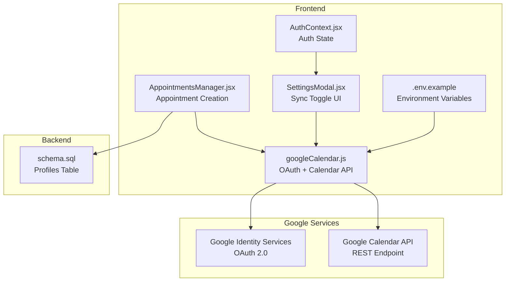
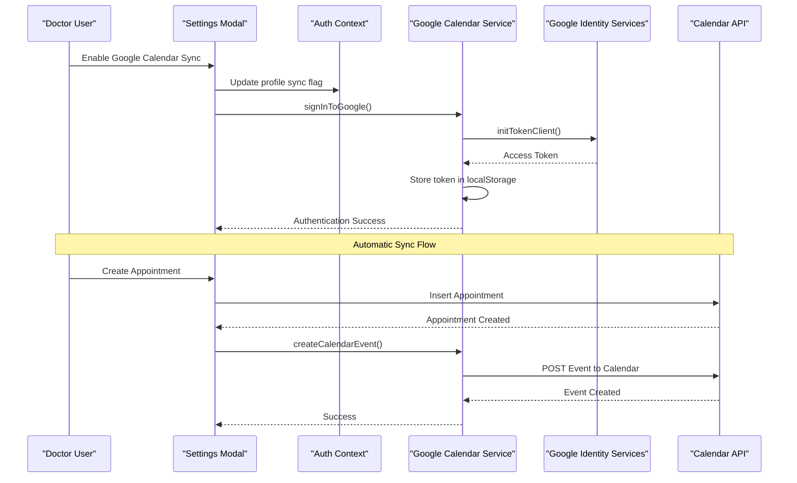
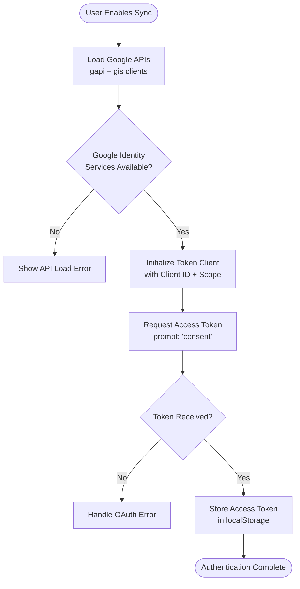
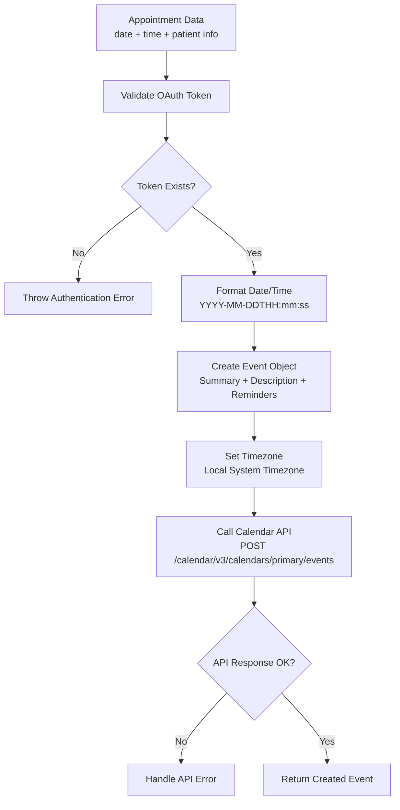
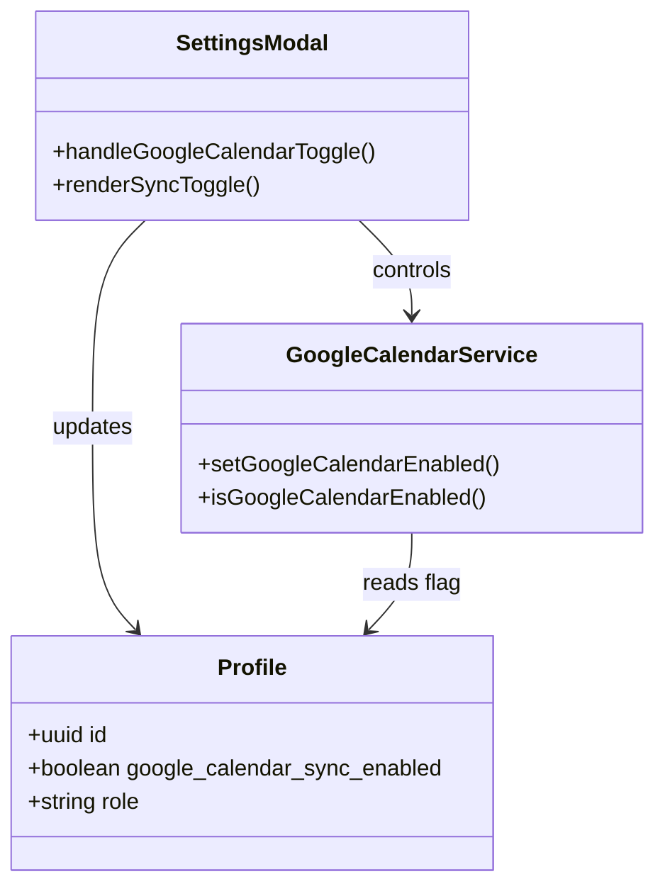
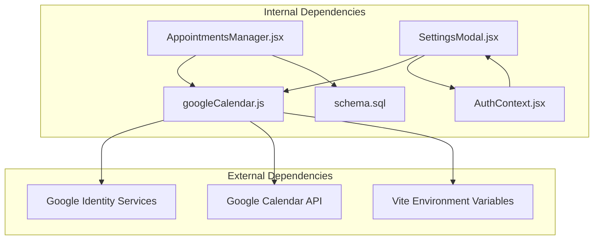
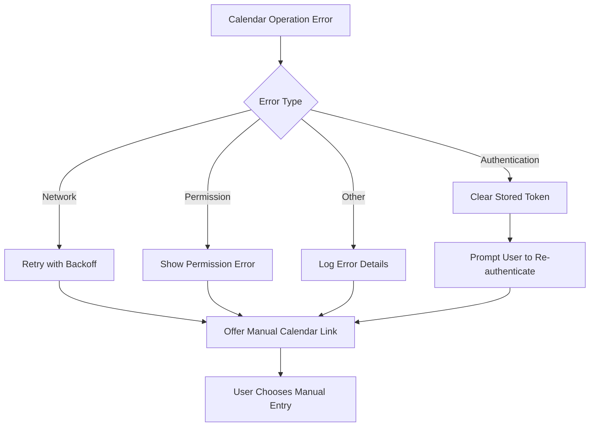

# Google Calendar Integration

<cite>
**Referenced Files in This Document**
- [googleCalendar.js](file://frontend/src/lib/googleCalendar.js)
- [GOOGLE_CALENDAR_SETUP.md](file://frontend/GOOGLE_CALENDAR_SETUP.md)
- [AppointmentsManager.jsx](file://frontend/src/pages/AppointmentsManager.jsx)
- [SettingsModal.jsx](file://frontend/src/components/SettingsModal.jsx)
- [AuthContext.jsx](file://frontend/src/context/AuthContext.jsx)
- [schema.sql](file://backend/schema.sql)
- [.env.example](file://frontend/.env.example)
</cite>

## Table of Contents
1. [Introduction](#introduction)
2. [Project Structure](#project-structure)
3. [Core Components](#core-components)
4. [Architecture Overview](#architecture-overview)
5. [Detailed Component Analysis](#detailed-component-analysis)
6. [Dependency Analysis](#dependency-analysis)
7. [Performance Considerations](#performance-considerations)
8. [Troubleshooting Guide](#troubleshooting-guide)
9. [Conclusion](#conclusion)

## Introduction
This document provides comprehensive documentation for MedVita's Google Calendar integration system. The integration enables automatic synchronization of doctor appointments to Google Calendar through OAuth 2.0 authentication using Google Identity Services. The system supports dual authentication approaches: OAuth-based token management and direct URL generation for manual fallback. The implementation covers environment configuration, authentication flows, calendar event creation, error handling, and token management.

## Project Structure
The Google Calendar integration spans several frontend components and backend schema elements:

- Frontend integration service: `frontend/src/lib/googleCalendar.js`
- Setup and configuration guide: `frontend/GOOGLE_CALENDAR_SETUP.md`
- Appointment management: `frontend/src/pages/AppointmentsManager.jsx`
- Settings UI and toggle: `frontend/src/components/SettingsModal.jsx`
- Authentication context: `frontend/src/context/AuthContext.jsx`
- Backend schema for profile flags: `backend/schema.sql`
- Environment configuration template: `frontend/.env.example`

**Diagram sources**
- [googleCalendar.js](file://frontend/src/lib/googleCalendar.js#L1-L198)
- [AppointmentsManager.jsx](file://frontend/src/pages/AppointmentsManager.jsx#L160-L177)
- [SettingsModal.jsx](file://frontend/src/components/SettingsModal.jsx#L470-L494)
- [AuthContext.jsx](file://frontend/src/context/AuthContext.jsx#L1-L108)
- [schema.sql](file://backend/schema.sql#L11-L12)
- [.env.example](file://frontend/.env.example#L1-L9)

**Section sources**
- [googleCalendar.js](file://frontend/src/lib/googleCalendar.js#L1-L198)
- [GOOGLE_CALENDAR_SETUP.md](file://frontend/GOOGLE_CALENDAR_SETUP.md#L1-L117)
- [AppointmentsManager.jsx](file://frontend/src/pages/AppointmentsManager.jsx#L160-L177)
- [SettingsModal.jsx](file://frontend/src/components/SettingsModal.jsx#L470-L494)
- [AuthContext.jsx](file://frontend/src/context/AuthContext.jsx#L1-L108)
- [schema.sql](file://backend/schema.sql#L11-L12)
- [.env.example](file://frontend/.env.example#L1-L9)

## Core Components
The integration consists of several core components working together:

### Google Calendar Service (`googleCalendar.js`)
- **OAuth Configuration**: Client ID and API key from environment variables
- **Scope Management**: Calendar events scope (`https://www.googleapis.com/auth/calendar.events`)
- **API Initialization**: Loads Google Identity Services and Google API client
- **Authentication Flow**: Uses Google Identity Services token client for OAuth
- **Event Creation**: Formats appointment data into Google Calendar event structure
- **Dual Methods**: Supports both OAuth-based API calls and manual URL generation

### Appointment Manager (`AppointmentsManager.jsx`)
- **Automatic Sync Trigger**: Calls calendar service after successful appointment creation
- **Error Handling**: Provides fallback mechanism using manual calendar link
- **Conditional Execution**: Only executes for doctors with sync enabled

### Settings Modal (`SettingsModal.jsx`)
- **Sync Toggle UI**: Provides user interface for enabling/disabling calendar sync
- **Profile Integration**: Updates doctor profile with sync preferences
- **OAuth Integration**: Initiates OAuth flow when enabling sync

### Backend Schema (`schema.sql`)
- **Profile Flag**: `google_calendar_sync_enabled` boolean field in profiles table
- **Migration Support**: Automatic migration adds the field if missing

**Section sources**
- [googleCalendar.js](file://frontend/src/lib/googleCalendar.js#L6-L9)
- [googleCalendar.js](file://frontend/src/lib/googleCalendar.js#L72-L105)
- [googleCalendar.js](file://frontend/src/lib/googleCalendar.js#L125-L178)
- [AppointmentsManager.jsx](file://frontend/src/pages/AppointmentsManager.jsx#L163-L171)
- [SettingsModal.jsx](file://frontend/src/components/SettingsModal.jsx#L64-L91)
- [schema.sql](file://backend/schema.sql#L11-L12)

## Architecture Overview
The Google Calendar integration follows a two-tier authentication approach with automatic and manual fallback mechanisms:

**Diagram sources**
- [SettingsModal.jsx](file://frontend/src/components/SettingsModal.jsx#L64-L91)
- [googleCalendar.js](file://frontend/src/lib/googleCalendar.js#L72-L105)
- [googleCalendar.js](file://frontend/src/lib/googleCalendar.js#L125-L178)
- [AppointmentsManager.jsx](file://frontend/src/pages/AppointmentsManager.jsx#L163-L171)

## Detailed Component Analysis

### OAuth 2.0 Authentication Flow
The system implements Google Identity Services OAuth 2.0 authentication with the following flow:

**Diagram sources**
- [googleCalendar.js](file://frontend/src/lib/googleCalendar.js#L15-L53)
- [googleCalendar.js](file://frontend/src/lib/googleCalendar.js#L72-L105)

#### Authentication Configuration
- **Client ID**: Loaded from `VITE_GOOGLE_CLIENT_ID` environment variable
- **API Key**: Loaded from `VITE_GOOGLE_API_KEY` environment variable
- **Scopes**: `https://www.googleapis.com/auth/calendar.events`
- **Discovery Docs**: Google Calendar API v3 REST endpoint
- **Token Storage**: Browser localStorage with `google_calendar_token` key

**Section sources**
- [googleCalendar.js](file://frontend/src/lib/googleCalendar.js#L6-L9)
- [googleCalendar.js](file://frontend/src/lib/googleCalendar.js#L15-L53)
- [googleCalendar.js](file://frontend/src/lib/googleCalendar.js#L72-L105)
- [.env.example](file://frontend/.env.example#L3-L4)

### Calendar Event Creation Process
The system creates Google Calendar events with comprehensive formatting:

**Diagram sources**
- [googleCalendar.js](file://frontend/src/lib/googleCalendar.js#L125-L178)

#### Event Formatting Details
- **Date/Time Format**: Combines appointment date and time into ISO format
- **Duration**: Fixed 30-minute appointment slots
- **Timezone Handling**: Uses local system timezone via `Intl.DateTimeFormat().resolvedOptions().timeZone`
- **Reminders**: Configured as 24 hours before (email) and 1 hour before (popup)
- **Event Details**: Includes patient name, appointment status, and formatted title

**Section sources**
- [googleCalendar.js](file://frontend/src/lib/googleCalendar.js#L125-L178)

### Dual Authentication Approach
The system supports two complementary authentication methods:

#### Method 1: OAuth-Based API Calls
- **Primary Method**: Uses access token for programmatic calendar API calls
- **Token Management**: Automatic token storage and retrieval
- **Error Handling**: Comprehensive error catching and user feedback

#### Method 2: Manual URL Generation
- **Fallback Method**: Generates Google Calendar URL for manual addition
- **URL Template**: Uses `action=TEMPLATE` with formatted parameters
- **User Control**: Allows manual calendar entry when automatic sync fails

**Section sources**
- [googleCalendar.js](file://frontend/src/lib/googleCalendar.js#L180-L198)
- [AppointmentsManager.jsx](file://frontend/src/pages/AppointmentsManager.jsx#L163-L171)

### Settings Integration and Profile Management
The integration seamlessly connects with the application's profile system:

**Diagram sources**
- [SettingsModal.jsx](file://frontend/src/components/SettingsModal.jsx#L64-L91)
- [googleCalendar.js](file://frontend/src/lib/googleCalendar.js#L115-L123)
- [schema.sql](file://backend/schema.sql#L11-L12)

**Section sources**
- [SettingsModal.jsx](file://frontend/src/components/SettingsModal.jsx#L64-L91)
- [googleCalendar.js](file://frontend/src/lib/googleCalendar.js#L115-L123)
- [schema.sql](file://backend/schema.sql#L11-L12)

## Dependency Analysis
The Google Calendar integration has several key dependencies and relationships:

**Diagram sources**
- [googleCalendar.js](file://frontend/src/lib/googleCalendar.js#L6-L9)
- [AppointmentsManager.jsx](file://frontend/src/pages/AppointmentsManager.jsx#L163-L171)
- [SettingsModal.jsx](file://frontend/src/components/SettingsModal.jsx#L64-L91)
- [AuthContext.jsx](file://frontend/src/context/AuthContext.jsx#L1-L108)
- [schema.sql](file://backend/schema.sql#L11-L12)

### Environment Configuration
The system requires specific environment variables for proper operation:

| Variable | Purpose | Required | Example Value |
|----------|---------|----------|---------------|
| `VITE_GOOGLE_CLIENT_ID` | OAuth Client ID for Google Identity Services | Yes | `your-client-id.apps.googleusercontent.com` |
| `VITE_GOOGLE_API_KEY` | Google Calendar API Key | Yes | `AIzaSyCdx....` |

**Section sources**
- [.env.example](file://frontend/.env.example#L3-L4)
- [GOOGLE_CALENDAR_SETUP.md](file://frontend/GOOGLE_CALENDAR_SETUP.md#L49-L52)

## Performance Considerations
The Google Calendar integration includes several performance optimizations:

### API Loading Optimization
- **Lazy Loading**: Google API scripts are loaded only when needed
- **Caching**: Script loading state is tracked to prevent duplicate loads
- **Parallel Loading**: Google Identity Services and Calendar API load concurrently

### Token Management Efficiency
- **Local Storage**: Tokens stored locally to avoid repeated authentication
- **Automatic Refresh**: Built-in token refresh capabilities
- **Error Recovery**: Graceful handling of expired or invalid tokens

### Event Creation Optimization
- **Minimal Data Transfer**: Only essential appointment data is sent to Google Calendar
- **Efficient Formatting**: Optimized date/time formatting using native JavaScript methods
- **Batch Operations**: Single API call per appointment creation

## Troubleshooting Guide

### Common Authentication Issues
**Problem**: "Google API failed to load. Please refresh the page."
- **Cause**: Google Identity Services not available or blocked
- **Solution**: Refresh the page, check browser extensions, verify network connectivity

**Problem**: "Not authenticated with Google Calendar"
- **Cause**: Missing or expired access token
- **Solution**: Re-enable sync in settings, check browser storage, clear site data

**Problem**: OAuth consent screen errors
- **Cause**: Incorrect OAuth configuration or scope issues
- **Solution**: Verify OAuth client configuration in Google Cloud Console

### Calendar Sync Issues
**Problem**: Events not appearing in Google Calendar
- **Cause**: Sync disabled or incorrect profile settings
- **Solution**: Check sync toggle in settings, verify calendar permissions

**Problem**: API quota exceeded or rate limiting
- **Cause**: Excessive API calls or quota limits reached
- **Solution**: Implement retry logic with exponential backoff, monitor API usage

### Error Handling and Recovery
The system implements comprehensive error handling:

**Diagram sources**
- [AppointmentsManager.jsx](file://frontend/src/pages/AppointmentsManager.jsx#L163-L171)

### Security Best Practices
- **Environment Variables**: Never commit `.env` files to version control
- **API Key Restrictions**: Restrict API keys to specific Google Calendar API usage
- **OAuth Scopes**: Use minimal required scopes for calendar access
- **Token Storage**: Store tokens securely in browser localStorage with appropriate security headers

**Section sources**
- [GOOGLE_CALENDAR_SETUP.md](file://frontend/GOOGLE_CALENDAR_SETUP.md#L83-L111)
- [AppointmentsManager.jsx](file://frontend/src/pages/AppointmentsManager.jsx#L163-L171)

## Conclusion
The MedVita Google Calendar integration provides a robust, dual-method authentication system that seamlessly synchronizes doctor appointments to Google Calendar. The implementation leverages modern OAuth 2.0 standards through Google Identity Services while maintaining flexibility through manual fallback methods. The system includes comprehensive error handling, performance optimizations, and security best practices to ensure reliable operation in production environments.

Key strengths of the implementation include:
- **Dual Authentication**: OAuth-based automation with manual URL generation fallback
- **Robust Error Handling**: Comprehensive error detection and user-friendly recovery
- **Performance Optimization**: Lazy loading, caching, and efficient API usage
- **Security Compliance**: Proper environment variable management and OAuth scope minimization
- **User Experience**: Seamless integration with existing appointment management workflows

The integration successfully bridges the gap between MedVita's appointment scheduling system and Google Calendar, providing healthcare providers with convenient automated calendar synchronization while maintaining user control and system reliability.