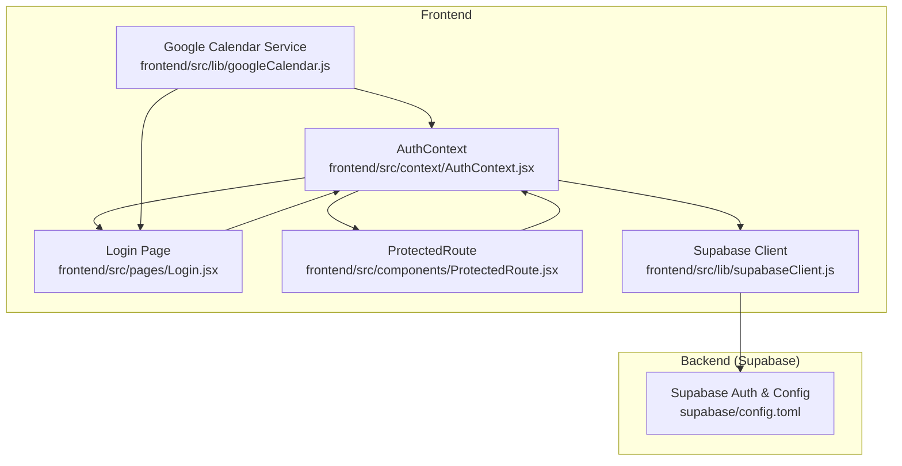
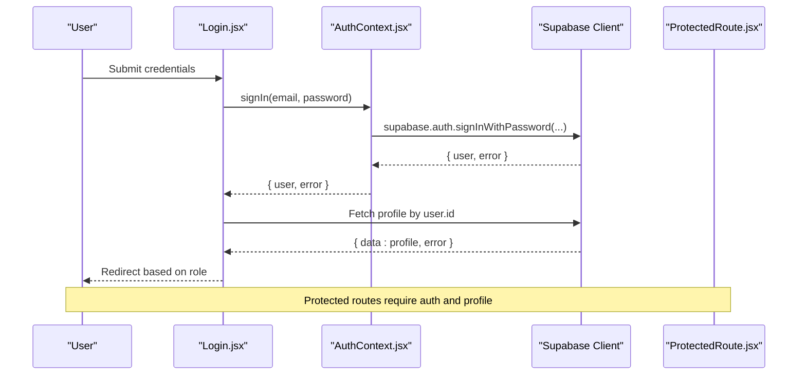
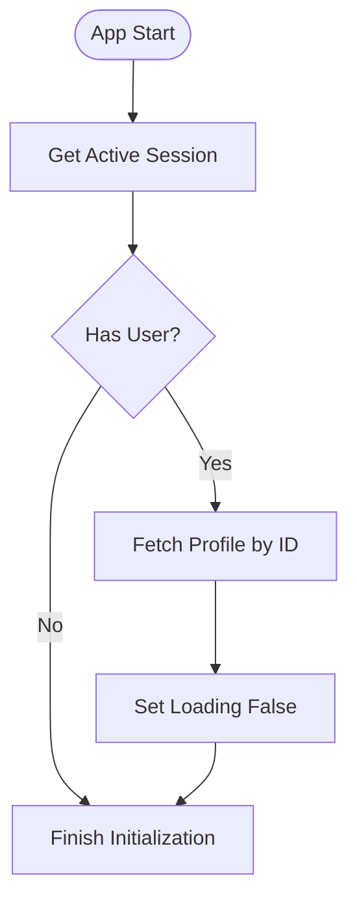
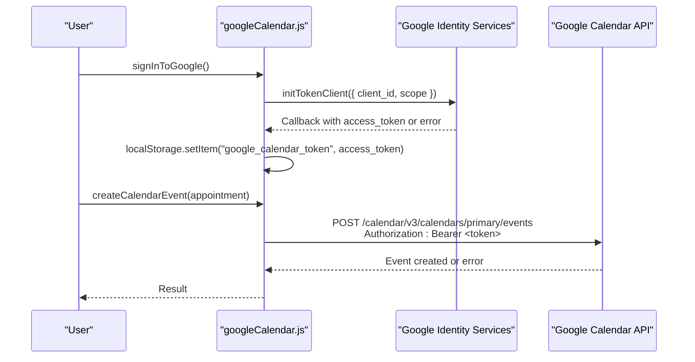
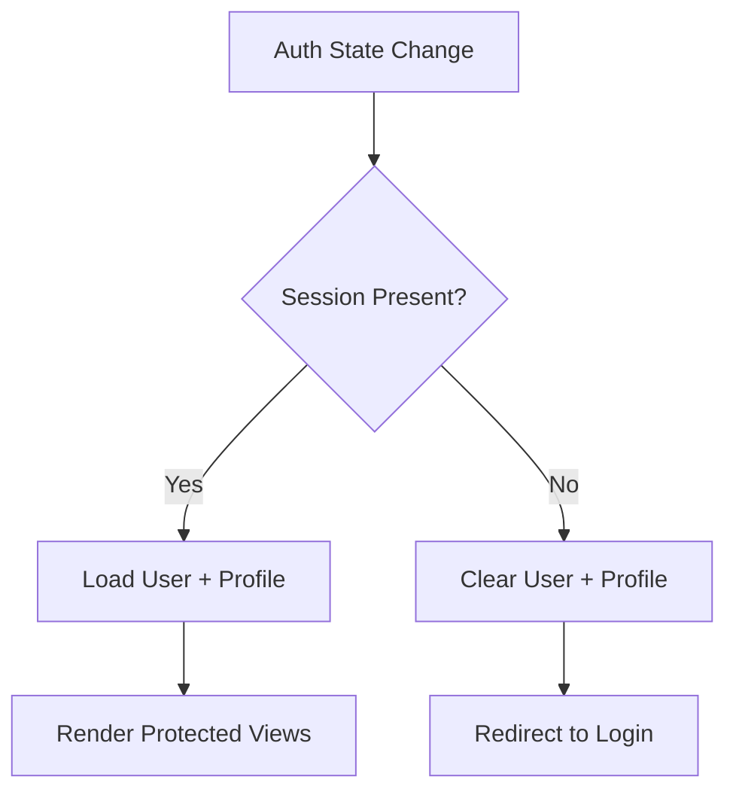
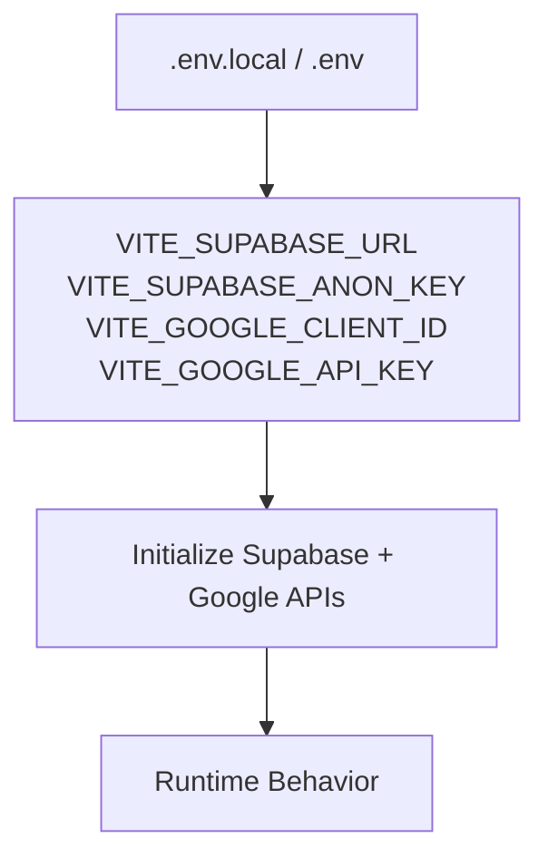
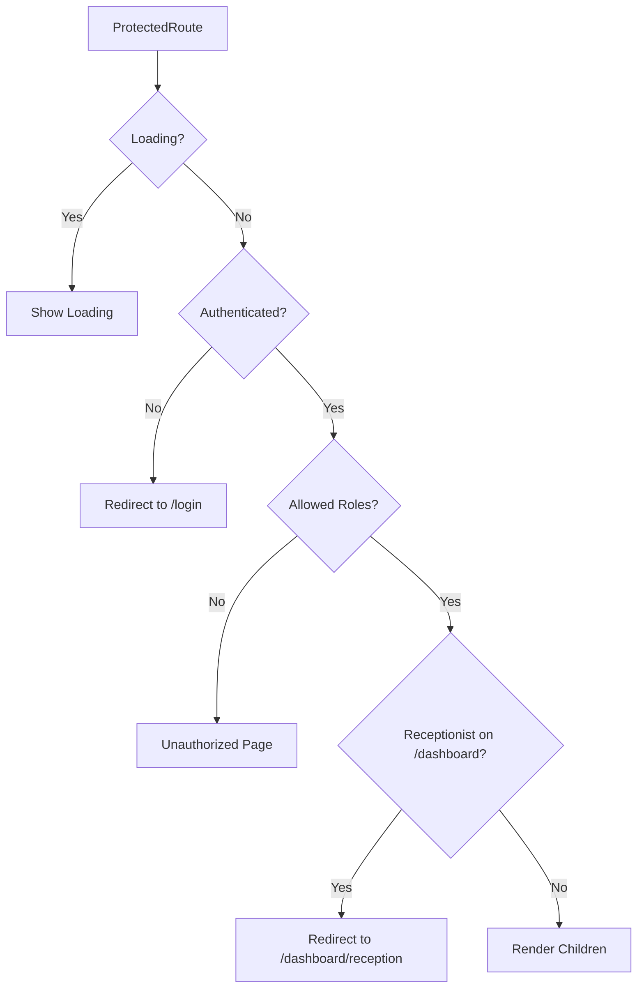
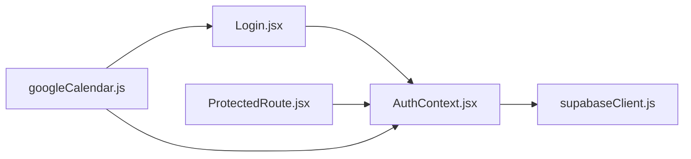

# Third-Party API Authentication

<cite>
**Referenced Files in This Document**
- [AuthContext.jsx](file://frontend/src/context/AuthContext.jsx)
- [googleCalendar.js](file://frontend/src/lib/googleCalendar.js)
- [supabaseClient.js](file://frontend/src/lib/supabaseClient.js)
- [Login.jsx](file://frontend/src/pages/Login.jsx)
- [ProtectedRoute.jsx](file://frontend/src/components/ProtectedRoute.jsx)
- [App.jsx](file://frontend/src/App.jsx)
- [.env.example](file://frontend/.env.example)
- [.env.local](file://frontend/.env.local)
- [GOOGLE_CALENDAR_SETUP.md](file://frontend/GOOGLE_CALENDAR_SETUP.md)
- [config.toml](file://supabase/config.toml)
</cite>

## Table of Contents
1. [Introduction](#introduction)
2. [Project Structure](#project-structure)
3. [Core Components](#core-components)
4. [Architecture Overview](#architecture-overview)
5. [Detailed Component Analysis](#detailed-component-analysis)
6. [Dependency Analysis](#dependency-analysis)
7. [Performance Considerations](#performance-considerations)
8. [Troubleshooting Guide](#troubleshooting-guide)
9. [Conclusion](#conclusion)
10. [Appendices](#appendices)

## Introduction
This document provides comprehensive third-party API authentication documentation for MedVita’s external service integrations, focusing on Google Calendar OAuth 2.0, session and token management, and related security practices. It explains how the frontend authenticates users via Supabase, manages Google Calendar access tokens, and persists preferences. It also covers environment configuration, secrets management, and operational differences between development and production.

## Project Structure
The authentication system spans three primary areas:
- Supabase-based authentication for application login and session management
- Google Calendar OAuth 2.0 integration for calendar synchronization
- Frontend routing and protection for authenticated and role-based access

**Diagram sources**
- [AuthContext.jsx](file://frontend/src/context/AuthContext.jsx#L1-L108)
- [Login.jsx](file://frontend/src/pages/Login.jsx#L1-L204)
- [ProtectedRoute.jsx](file://frontend/src/components/ProtectedRoute.jsx#L1-L108)
- [googleCalendar.js](file://frontend/src/lib/googleCalendar.js#L1-L199)
- [supabaseClient.js](file://frontend/src/lib/supabaseClient.js#L1-L11)
- [config.toml](file://supabase/config.toml#L146-L196)

**Section sources**
- [AuthContext.jsx](file://frontend/src/context/AuthContext.jsx#L1-L108)
- [googleCalendar.js](file://frontend/src/lib/googleCalendar.js#L1-L199)
- [supabaseClient.js](file://frontend/src/lib/supabaseClient.js#L1-L11)
- [Login.jsx](file://frontend/src/pages/Login.jsx#L1-L204)
- [ProtectedRoute.jsx](file://frontend/src/components/ProtectedRoute.jsx#L1-L108)
- [App.jsx](file://frontend/src/App.jsx#L1-L62)

## Core Components
- Supabase Auth Context: Centralizes session retrieval, profile fetching, sign-up/sign-in, and sign-out. It listens to auth state changes and updates user/profile/loading states accordingly.
- Google Calendar Service: Loads Google APIs, performs OAuth 2.0 token acquisition, stores access tokens in local storage, and creates calendar events using the Bearer token.
- Supabase Client: Initializes the Supabase client using Vite environment variables and logs warnings if required variables are missing.
- Login Page: Authenticates users against Supabase, fetches profile data to determine role-based redirection, and displays user-friendly error messages.
- ProtectedRoute: Guards routes by ensuring authentication, profile presence, role checks, and correct home route redirection.

**Section sources**
- [AuthContext.jsx](file://frontend/src/context/AuthContext.jsx#L9-L107)
- [googleCalendar.js](file://frontend/src/lib/googleCalendar.js#L14-L113)
- [supabaseClient.js](file://frontend/src/lib/supabaseClient.js#L1-L11)
- [Login.jsx](file://frontend/src/pages/Login.jsx#L20-L75)
- [ProtectedRoute.jsx](file://frontend/src/components/ProtectedRoute.jsx#L53-L106)

## Architecture Overview
The authentication architecture combines Supabase-managed sessions with Google Calendar OAuth 2.0. Supabase handles application-level authentication and session lifecycle. Google Calendar integration is opt-in and uses OAuth 2.0 with short-lived access tokens stored locally.

**Diagram sources**
- [Login.jsx](file://frontend/src/pages/Login.jsx#L20-L75)
- [AuthContext.jsx](file://frontend/src/context/AuthContext.jsx#L84-L90)
- [supabaseClient.js](file://frontend/src/lib/supabaseClient.js#L1-L11)
- [ProtectedRoute.jsx](file://frontend/src/components/ProtectedRoute.jsx#L57-L106)

## Detailed Component Analysis

### Supabase Authentication Flow
- Session initialization: On app startup, the context retrieves the active session and loads the user’s profile.
- Auth state change listener: Subscribes to Supabase auth events to update user state and profile loading.
- Sign-in/sign-out: Uses Supabase client methods for password-based authentication and logout.
- Profile fetching: Queries the profiles table using the authenticated user ID.

**Diagram sources**
- [AuthContext.jsx](file://frontend/src/context/AuthContext.jsx#L14-L41)

**Section sources**
- [AuthContext.jsx](file://frontend/src/context/AuthContext.jsx#L14-L61)

### Google Calendar OAuth 2.0 Implementation
- Environment configuration: Client ID and API key loaded from Vite environment variables.
- API loading: Dynamically injects Google API and GSI client scripts and initializes the client with discovery docs and API key.
- Authorization flow: Uses Google Identity Services token client to request an access token with calendar events scope. Stores the access token in local storage upon successful callback.
- Event creation: Sends a POST request to Google Calendar API with the stored access token as a Bearer header.
- Logout and toggles: Removes stored token from local storage and disables auto-select for Google Identity Services.

**Diagram sources**
- [googleCalendar.js](file://frontend/src/lib/googleCalendar.js#L72-L113)
- [googleCalendar.js](file://frontend/src/lib/googleCalendar.js#L125-L178)

**Section sources**
- [googleCalendar.js](file://frontend/src/lib/googleCalendar.js#L6-L113)
- [googleCalendar.js](file://frontend/src/lib/googleCalendar.js#L125-L178)

### Authentication State Management
- Session persistence: Supabase manages session persistence server-side; the frontend listens for auth state changes and updates UI state accordingly.
- Token validation: Google Calendar access tokens are validated implicitly by Google Calendar API responses; the integration does not implement explicit token introspection.
- Logout procedures: Supabase sign-out clears the Supabase session; Google Calendar logout removes the stored access token and disables auto-select.

**Diagram sources**
- [AuthContext.jsx](file://frontend/src/context/AuthContext.jsx#L25-L38)

**Section sources**
- [AuthContext.jsx](file://frontend/src/context/AuthContext.jsx#L25-L38)
- [googleCalendar.js](file://frontend/src/lib/googleCalendar.js#L107-L113)

### Environment Variables and Secret Management
- Supabase configuration: Vite variables for Supabase URL and anon key are required for client initialization.
- Google Calendar configuration: Vite variables for client ID and API key are required for OAuth and API calls.
- Local environment: Example and local environment files demonstrate how to define variables for development and local overrides.
- Security notes: The Google Calendar setup guide emphasizes restricting API keys, using production URLs for OAuth, and avoiding committing environment files.

**Diagram sources**
- [.env.example](file://frontend/.env.example#L1-L9)
- [.env.local](file://frontend/.env.local#L1-L5)
- [supabaseClient.js](file://frontend/src/lib/supabaseClient.js#L3-L8)
- [googleCalendar.js](file://frontend/src/lib/googleCalendar.js#L6-L9)

**Section sources**
- [.env.example](file://frontend/.env.example#L1-L9)
- [.env.local](file://frontend/.env.local#L1-L5)
- [supabaseClient.js](file://frontend/src/lib/supabaseClient.js#L3-L8)
- [GOOGLE_CALENDAR_SETUP.md](file://frontend/GOOGLE_CALENDAR_SETUP.md#L44-L62)

### Role-Based Access Control and Routing
- ProtectedRoute enforces authentication, ensures profile availability, validates allowed roles, and redirects users to appropriate dashboards.
- Login page determines role from profile data and navigates accordingly.

**Diagram sources**
- [ProtectedRoute.jsx](file://frontend/src/components/ProtectedRoute.jsx#L57-L106)
- [Login.jsx](file://frontend/src/pages/Login.jsx#L46-L57)

**Section sources**
- [ProtectedRoute.jsx](file://frontend/src/components/ProtectedRoute.jsx#L53-L106)
- [Login.jsx](file://frontend/src/pages/Login.jsx#L20-L75)

## Dependency Analysis
- AuthContext depends on Supabase client for session and profile operations.
- Login page depends on AuthContext for sign-in and on Supabase client for profile queries.
- ProtectedRoute depends on AuthContext for user/profile state and enforces role-based routing.
- Google Calendar service depends on Vite environment variables and local storage for token persistence.

**Diagram sources**
- [Login.jsx](file://frontend/src/pages/Login.jsx#L15-L38)
- [ProtectedRoute.jsx](file://frontend/src/components/ProtectedRoute.jsx#L4-L54)
- [AuthContext.jsx](file://frontend/src/context/AuthContext.jsx#L1-L12)
- [googleCalendar.js](file://frontend/src/lib/googleCalendar.js#L1-L13)
- [supabaseClient.js](file://frontend/src/lib/supabaseClient.js#L1-L11)

**Section sources**
- [App.jsx](file://frontend/src/App.jsx#L26-L58)
- [AuthContext.jsx](file://frontend/src/context/AuthContext.jsx#L1-L12)
- [googleCalendar.js](file://frontend/src/lib/googleCalendar.js#L1-L13)
- [supabaseClient.js](file://frontend/src/lib/supabaseClient.js#L1-L11)

## Performance Considerations
- Minimize repeated profile fetches by leveraging the AuthContext subscription and caching profile data during the session lifecycle.
- Defer Google Calendar API initialization until needed to reduce initial load time.
- Avoid unnecessary re-renders by guarding protected routes and rendering loading spinners while profile data is being fetched.

## Troubleshooting Guide
Common issues and resolutions:
- Not authenticated with Google Calendar
  - Cause: Missing or expired access token in local storage.
  - Resolution: Trigger sign-in again and ensure scopes and permissions are granted.
- Failed to connect to Google Calendar
  - Cause: Incorrect environment variables, disabled API, or misconfigured OAuth consent screen.
  - Resolution: Verify Vite variables, enable Google Calendar API, and ensure authorized origins/redirects match deployment URLs.
- Events not appearing in Google Calendar
  - Cause: Sync disabled, wrong account signed in, or API errors.
  - Resolution: Confirm sync toggle is enabled, sign in with correct account, and inspect browser console for errors.
- Expired tokens or invalid scopes
  - Cause: Access token expiration or insufficient scopes.
  - Resolution: Re-authenticate to obtain a fresh token with required scopes.
- Permission denials
  - Cause: Insufficient or missing delegated permissions.
  - Resolution: Review OAuth consent screen configuration and requested scopes.

Debugging techniques:
- Inspect access tokens: Retrieve stored token from local storage and decode to verify claims (iss, aud, exp).
- Network request analysis: Monitor XHR/Fetch requests to Google Calendar API for 401/403 responses and error bodies.
- Console logs: Use Supabase auth state change logs and Google Calendar service error messages.

**Section sources**
- [googleCalendar.js](file://frontend/src/lib/googleCalendar.js#L125-L178)
- [GOOGLE_CALENDAR_SETUP.md](file://frontend/GOOGLE_CALENDAR_SETUP.md#L83-L117)

## Conclusion
MedVita’s authentication system integrates Supabase for application login and session management with Google Calendar OAuth 2.0 for optional calendar synchronization. The design emphasizes secure environment variable usage, local token persistence for Google Calendar, and robust route protection with role-based access control. Following the documented setup, configuration, and troubleshooting steps ensures reliable third-party API authentication across development and production environments.

## Appendices

### Environment Variable Reference
- Supabase
  - VITE_SUPABASE_URL: Supabase project URL
  - VITE_SUPABASE_ANON_KEY: Supabase anon key
- Google Calendar
  - VITE_GOOGLE_CLIENT_ID: OAuth 2.0 client ID
  - VITE_GOOGLE_API_KEY: Google Calendar API key

**Section sources**
- [.env.example](file://frontend/.env.example#L1-L9)
- [.env.local](file://frontend/.env.local#L1-L5)

### Supabase Auth Configuration Highlights
- JWT expiry: 3600 seconds
- Refresh token rotation: Enabled
- Rate limits: Configured for sign-ups, sign-ins, and token refresh

**Section sources**
- [config.toml](file://supabase/config.toml#L146-L196)