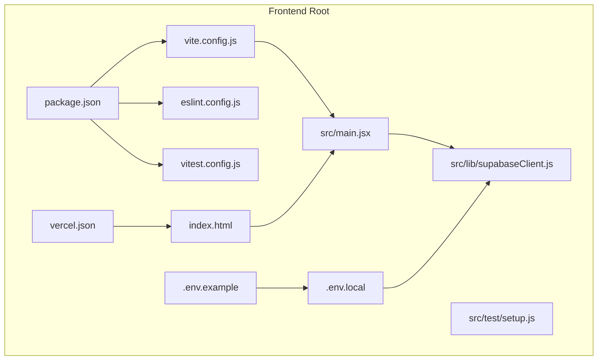
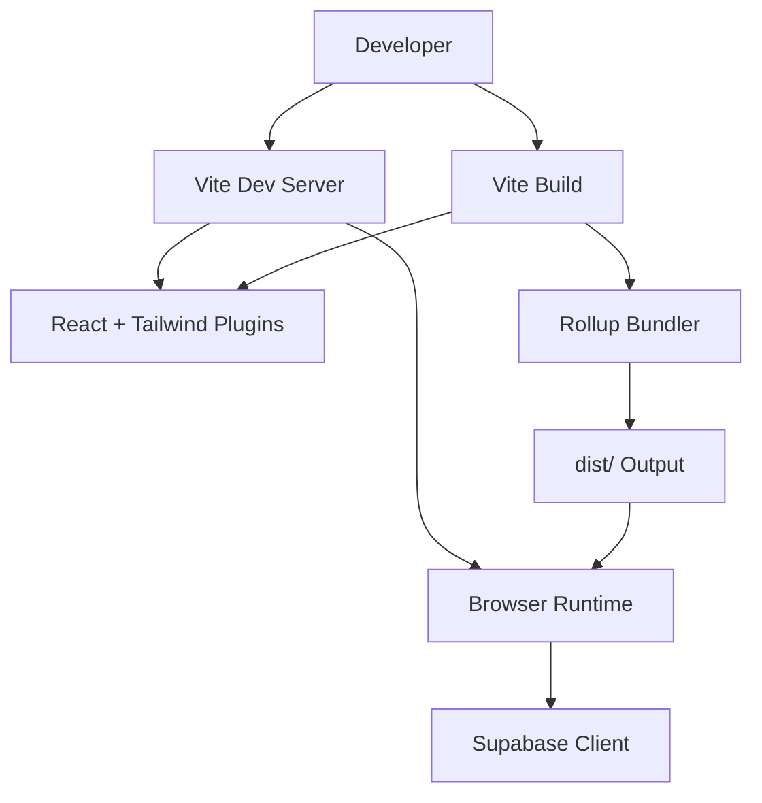
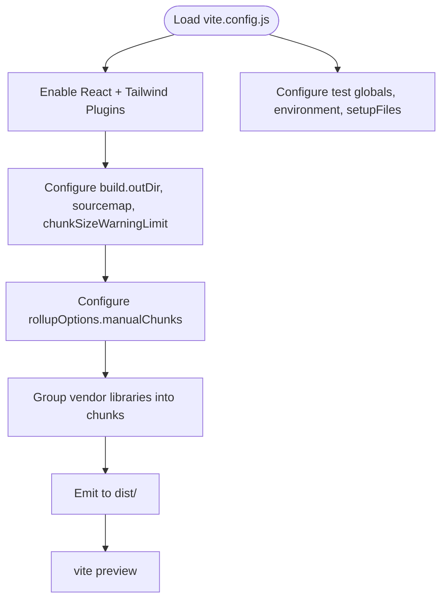
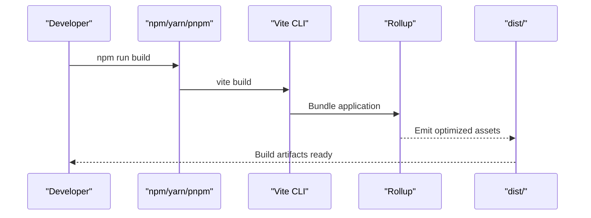
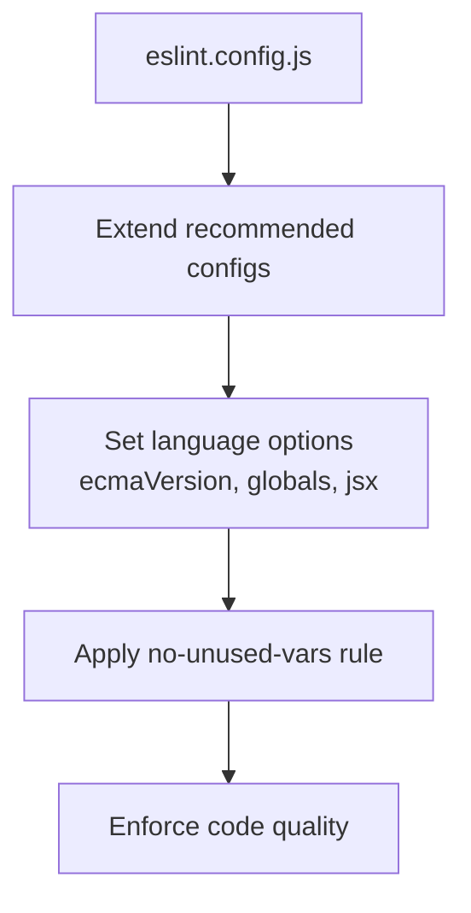
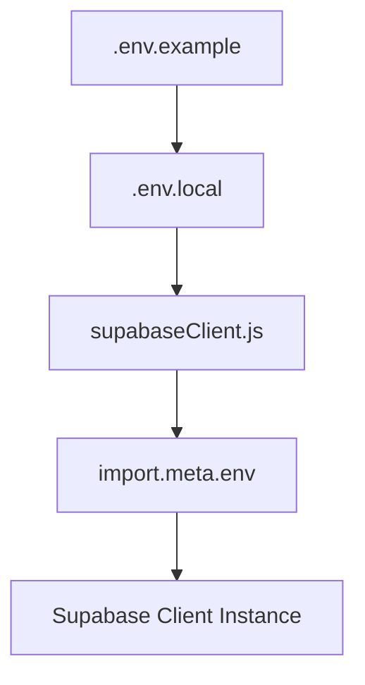
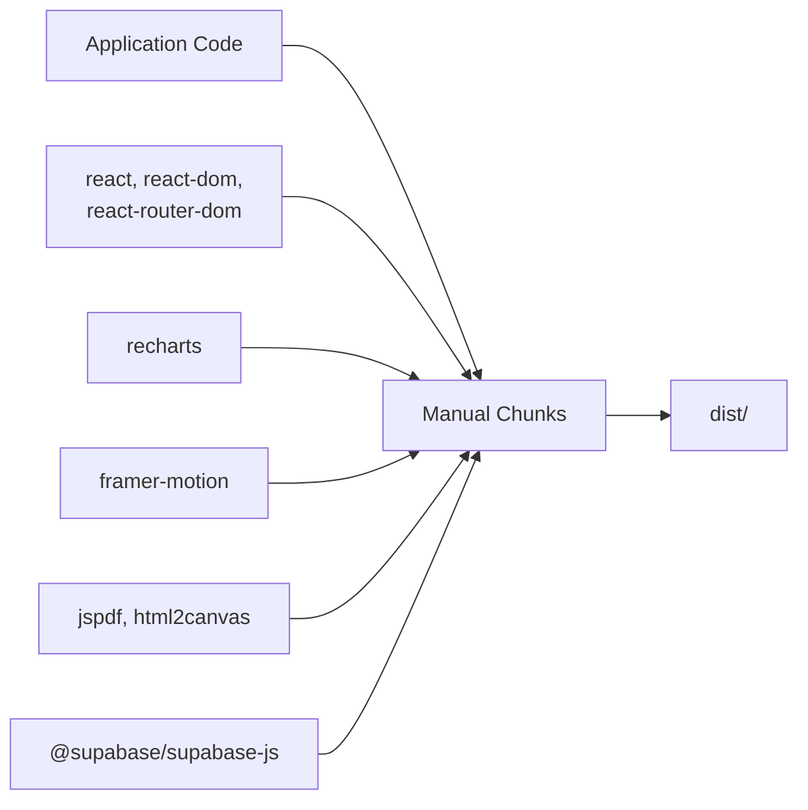
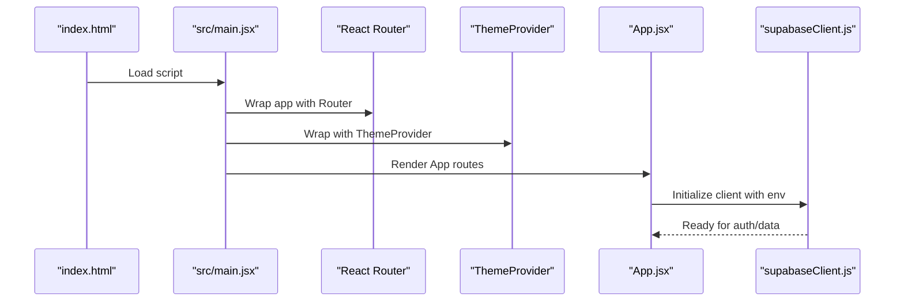
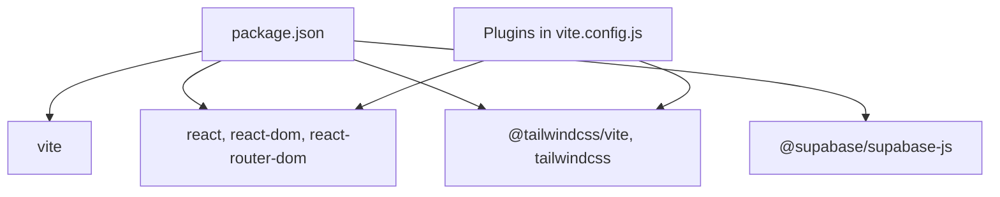

# Build Configuration & Development Workflow

<cite>
**Referenced Files in This Document**
- [vite.config.js](file://frontend/vite.config.js)
- [package.json](file://frontend/package.json)
- [eslint.config.js](file://frontend/eslint.config.js)
- [.env.example](file://frontend/.env.example)
- [.env.local](file://frontend/.env.local)
- [supabaseClient.js](file://frontend/src/lib/supabaseClient.js)
- [main.jsx](file://frontend/src/main.jsx)
- [index.html](file://frontend/index.html)
- [vercel.json](file://frontend/vercel.json)
- [vitest.config.js](file://frontend/vitest.config.js)
- [setup.js](file://frontend/src/test/setup.js)
- [build-report.txt](file://frontend/build-report.txt)
- [lint-report.txt](file://frontend/lint-report.txt)
- [config.toml](file://supabase/config.toml)
</cite>

## Table of Contents
1. [Introduction](#introduction)
2. [Project Structure](#project-structure)
3. [Core Components](#core-components)
4. [Architecture Overview](#architecture-overview)
5. [Detailed Component Analysis](#detailed-component-analysis)
6. [Dependency Analysis](#dependency-analysis)
7. [Performance Considerations](#performance-considerations)
8. [Troubleshooting Guide](#troubleshooting-guide)
9. [Conclusion](#conclusion)
10. [Appendices](#appendices)

## Introduction
This document provides comprehensive build configuration and development workflow documentation for MedVita’s Vite-based frontend. It covers Vite configuration, package scripts, ESLint setup, environment variable management, build optimization, bundle analysis strategies, development server features, and integration with React and Supabase. The goal is to help developers understand how the build pipeline works, how to optimize it, and how to maintain a smooth development experience.

## Project Structure
The frontend is organized around Vite as the build tool and development server, with React powering the UI, Tailwind CSS for styling, and Supabase for authentication and real-time data. Key configuration and runtime files are located under the frontend directory.

**Diagram sources**
- [package.json](file://frontend/package.json#L1-L50)
- [vite.config.js](file://frontend/vite.config.js#L1-L33)
- [eslint.config.js](file://frontend/eslint.config.js#L1-L30)
- [.env.example](file://frontend/.env.example#L1-L9)
- [.env.local](file://frontend/.env.local#L1-L5)
- [vercel.json](file://frontend/vercel.json#L1-L8)
- [index.html](file://frontend/index.html#L1-L16)
- [main.jsx](file://frontend/src/main.jsx#L1-L17)
- [supabaseClient.js](file://frontend/src/lib/supabaseClient.js#L1-L11)
- [vitest.config.js](file://frontend/vitest.config.js#L1-L19)
- [setup.js](file://frontend/src/test/setup.js#L1-L2)

**Section sources**
- [package.json](file://frontend/package.json#L1-L50)
- [vite.config.js](file://frontend/vite.config.js#L1-L33)
- [eslint.config.js](file://frontend/eslint.config.js#L1-L30)
- [.env.example](file://frontend/.env.example#L1-L9)
- [.env.local](file://frontend/.env.local#L1-L5)
- [vercel.json](file://frontend/vercel.json#L1-L8)
- [index.html](file://frontend/index.html#L1-L16)
- [main.jsx](file://frontend/src/main.jsx#L1-L17)
- [supabaseClient.js](file://frontend/src/lib/supabaseClient.js#L1-L11)
- [vitest.config.js](file://frontend/vitest.config.js#L1-L19)
- [setup.js](file://frontend/src/test/setup.js#L1-L2)

## Core Components
- Vite configuration defines plugins, build outputs, chunk splitting, and test environment.
- Package scripts orchestrate development, building, linting, testing, and previewing.
- ESLint enforces code quality and React-specific best practices.
- Environment variables manage Supabase credentials and optional integrations.
- Supabase client initialization uses Vite’s import.meta.env for secure runtime configuration.
- Vercel deployment rewrites ensure SPA routing compatibility.

**Section sources**
- [vite.config.js](file://frontend/vite.config.js#L1-L33)
- [package.json](file://frontend/package.json#L6-L12)
- [eslint.config.js](file://frontend/eslint.config.js#L1-L30)
- [.env.example](file://frontend/.env.example#L1-L9)
- [.env.local](file://frontend/.env.local#L1-L5)
- [supabaseClient.js](file://frontend/src/lib/supabaseClient.js#L1-L11)
- [vercel.json](file://frontend/vercel.json#L1-L8)

## Architecture Overview
The build and runtime architecture integrates Vite, React, Tailwind CSS, and Supabase. Vite compiles JSX, manages assets, and serves the app in development. Production builds leverage Rollup with manual chunking to optimize vendor bundles. Supabase client reads environment variables at runtime, while Tailwind CSS is integrated via a Vite plugin.

**Diagram sources**
- [vite.config.js](file://frontend/vite.config.js#L6-L32)
- [main.jsx](file://frontend/src/main.jsx#L1-L17)
- [supabaseClient.js](file://frontend/src/lib/supabaseClient.js#L1-L11)

## Detailed Component Analysis

### Vite Configuration
- Plugins: React and Tailwind CSS plugins are enabled for JSX transformations and CSS processing.
- Build settings:
  - Output directory is configured to dist/.
  - Source maps are disabled for production builds.
  - Chunk size warning threshold is increased to accommodate larger bundles.
  - Manual chunking groups vendor libraries into dedicated chunks for caching and load optimization.
- Test configuration mirrors Vite’s test setup with jsdom and a setup file.

**Diagram sources**
- [vite.config.js](file://frontend/vite.config.js#L6-L32)

**Section sources**
- [vite.config.js](file://frontend/vite.config.js#L6-L32)

### Package Scripts
- Development: Starts Vite dev server.
- Build: Produces optimized production assets.
- Lint: Runs ESLint across the project.
- Test: Executes Vitest tests.
- Preview: Serves the production build locally for verification.

**Diagram sources**
- [package.json](file://frontend/package.json#L6-L12)
- [vite.config.js](file://frontend/vite.config.js#L11-L26)

**Section sources**
- [package.json](file://frontend/package.json#L6-L12)

### ESLint Configuration
- Uses flat config with recommended rules for JS and React.
- Extends React Hooks and React Refresh presets tailored for Vite.
- Sets browser globals and JSX parsing options.
- Applies a rule allowing uppercase underscore pattern for unused vars.

**Diagram sources**
- [eslint.config.js](file://frontend/eslint.config.js#L7-L29)

**Section sources**
- [eslint.config.js](file://frontend/eslint.config.js#L1-L30)

### Environment Variable Management
- Example environment variables include Google Calendar credentials and Supabase configuration placeholders.
- Local environment variables override defaults and include Supabase URL, anon key, and Gemini API key.
- Supabase client reads VITE_SUPABASE_URL and VITE_SUPABASE_ANON_KEY at runtime.

**Diagram sources**
- [.env.example](file://frontend/.env.example#L1-L9)
- [.env.local](file://frontend/.env.local#L1-L5)
- [supabaseClient.js](file://frontend/src/lib/supabaseClient.js#L3-L10)

**Section sources**
- [.env.example](file://frontend/.env.example#L1-L9)
- [.env.local](file://frontend/.env.local#L1-L5)
- [supabaseClient.js](file://frontend/src/lib/supabaseClient.js#L1-L11)

### Build Optimization Techniques
- Manual chunking separates frequently changing application code from vendor libraries, improving cache hit rates.
- Vendor-specific chunks include React ecosystem, charting, motion, PDF generation, and Supabase client.
- Source maps disabled in production reduce bundle size and improve load performance.
- Increased chunk size warning helps anticipate bundling issues early.

**Diagram sources**
- [vite.config.js](file://frontend/vite.config.js#L15-L25)

**Section sources**
- [vite.config.js](file://frontend/vite.config.js#L11-L26)

### Bundle Analysis Strategies
- Use Vite’s built-in reporter or external tools to inspect dist/ contents and identify oversized chunks.
- Monitor chunkSizeWarningLimit to catch regressions during development.
- Review manualChunks to ensure logical separation of vendor vs. application code.

[No sources needed since this section provides general guidance]

### Development Server Features
- Vite dev server provides fast cold starts, optimized HMR, and a zero-config development experience.
- React plugin enables JSX transforms and React Refresh for instant UI updates without losing state.
- Tailwind plugin processes CSS and supports JIT compilation for rapid styling feedback.

**Section sources**
- [vite.config.js](file://frontend/vite.config.js#L7-L10)

### Debugging Configurations
- Vite dev server supports source maps and HMR by default.
- For advanced debugging, integrate browser devtools and React DevTools.
- Supabase client logs warnings when required environment variables are missing.

**Section sources**
- [supabaseClient.js](file://frontend/src/lib/supabaseClient.js#L6-L8)

### Integration Between Vite, React, and Supabase
- React is bootstrapped in main.jsx with routing and theming providers.
- Supabase client is initialized using Vite’s import.meta.env for environment variables.
- Tailwind CSS is integrated via @tailwindcss/vite for utility-first styling.

**Diagram sources**
- [index.html](file://frontend/index.html#L13-L13)
- [main.jsx](file://frontend/src/main.jsx#L1-L17)
- [App.jsx](file://frontend/src/App.jsx#L1-L62)
- [supabaseClient.js](file://frontend/src/lib/supabaseClient.js#L1-L11)

**Section sources**
- [index.html](file://frontend/index.html#L1-L16)
- [main.jsx](file://frontend/src/main.jsx#L1-L17)
- [App.jsx](file://frontend/src/App.jsx#L1-L62)
- [supabaseClient.js](file://frontend/src/lib/supabaseClient.js#L1-L11)

### Testing Setup
- Vitest is configured with jsdom environment and a setup file to include testing utilities.
- Exclusions avoid running tests against build artifacts and trash directories.

**Section sources**
- [vitest.config.js](file://frontend/vitest.config.js#L4-L18)
- [setup.js](file://frontend/src/test/setup.js#L1-L2)

### Deployment and Routing
- Vercel rewrites all routes to index.html to support client-side routing.
- Ensure the build output directory aligns with deployment expectations.

**Section sources**
- [vercel.json](file://frontend/vercel.json#L1-L8)

## Dependency Analysis
The frontend depends on Vite, React, Tailwind CSS, and Supabase. Dependencies are declared in package.json, while Vite resolves and bundles them according to the configuration.

**Diagram sources**
- [package.json](file://frontend/package.json#L13-L48)
- [vite.config.js](file://frontend/vite.config.js#L7-L10)

**Section sources**
- [package.json](file://frontend/package.json#L13-L48)
- [vite.config.js](file://frontend/vite.config.js#L7-L10)

## Performance Considerations
- Keep chunkSizeWarningLimit tuned to detect large unexpected chunks.
- Prefer manual chunking for stable caching of vendor libraries.
- Disable source maps in production to reduce bundle size.
- Minimize unnecessary dependencies and tree-shake unused exports.

[No sources needed since this section provides general guidance]

## Troubleshooting Guide
- Tailwind utility errors during build indicate invalid class names; review styles and ensure Tailwind is properly configured.
- ESLint errors highlight unused variables and undefined identifiers; resolve reported issues to pass CI checks.
- Missing Supabase environment variables cause warnings at runtime; ensure .env.local is populated.

**Section sources**
- [build-report.txt](file://frontend/build-report.txt#L10-L10)
- [lint-report.txt](file://frontend/lint-report.txt#L6-L73)
- [supabaseClient.js](file://frontend/src/lib/supabaseClient.js#L6-L8)

## Conclusion
MedVita’s Vite-based build system combines efficient bundling, robust development ergonomics, and clear environment management. By leveraging manual chunking, Tailwind integration, and strict ESLint rules, the project maintains a fast, reliable, and maintainable development workflow. Proper environment configuration and deployment rewrites ensure seamless operation across local and hosted environments.

## Appendices
- Supabase local configuration demonstrates service ports and feature toggles for local development.

**Section sources**
- [config.toml](file://supabase/config.toml#L1-L385)