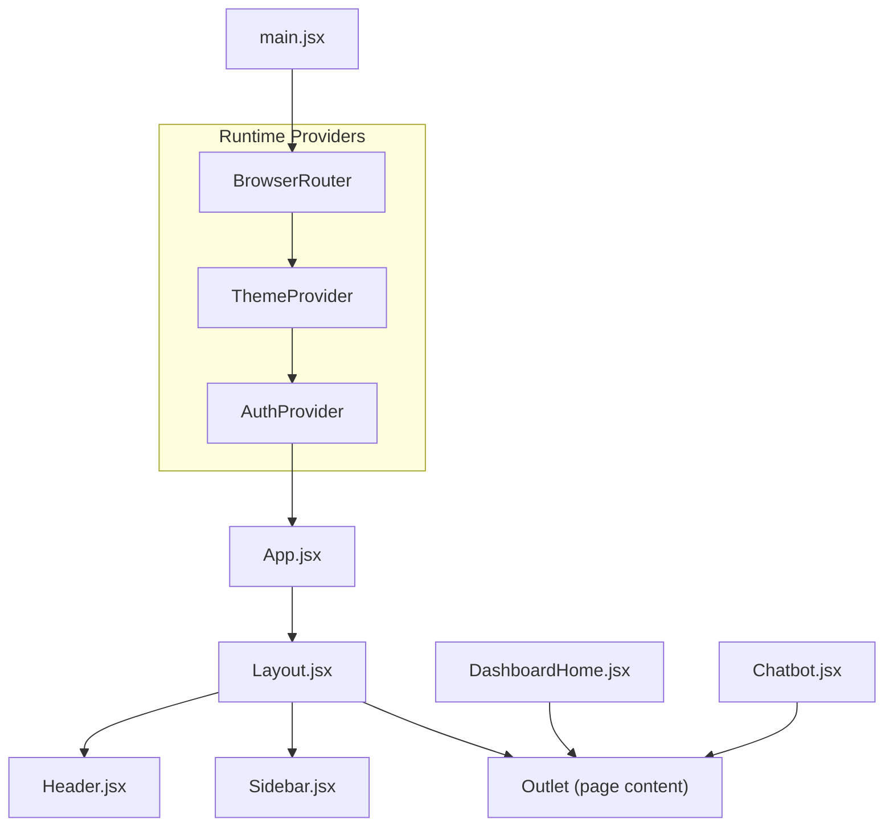
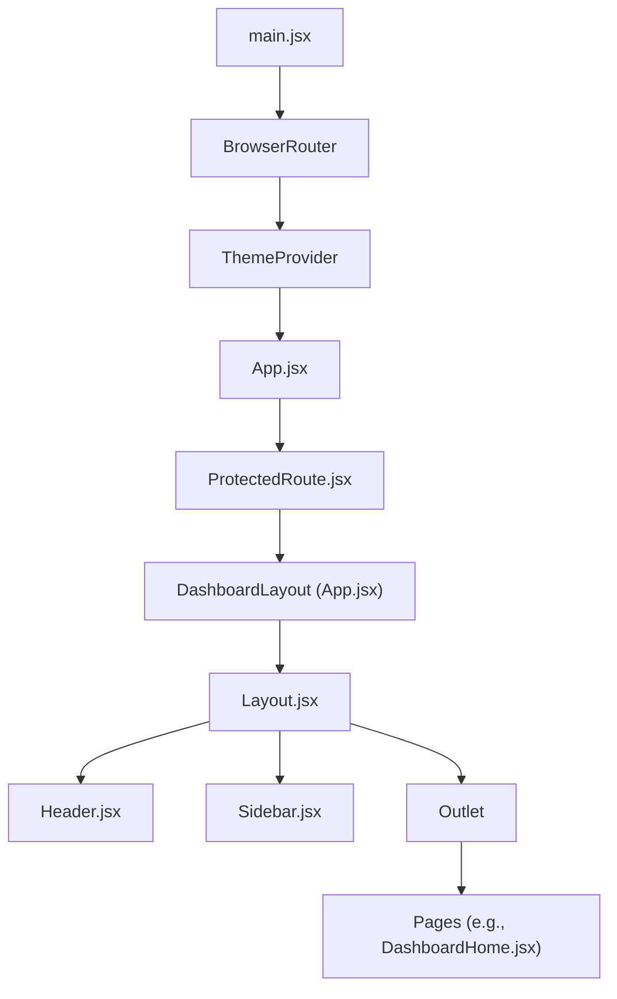
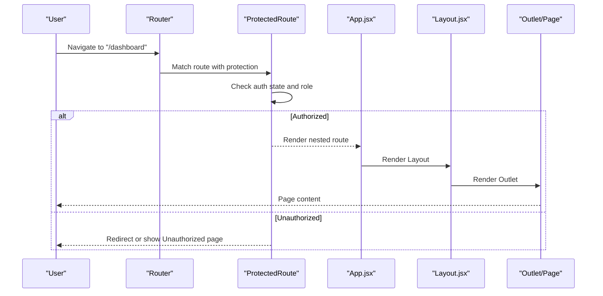
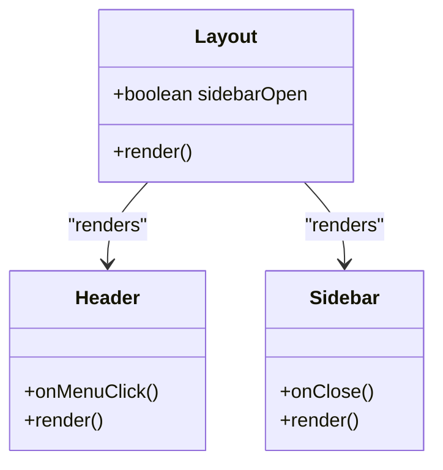
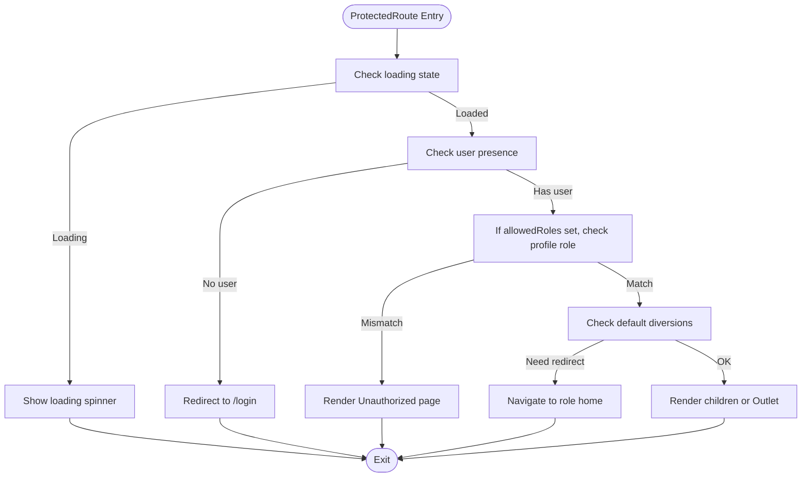
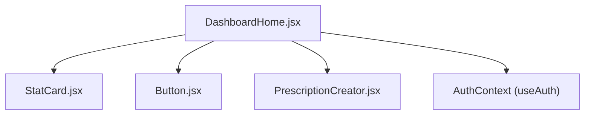
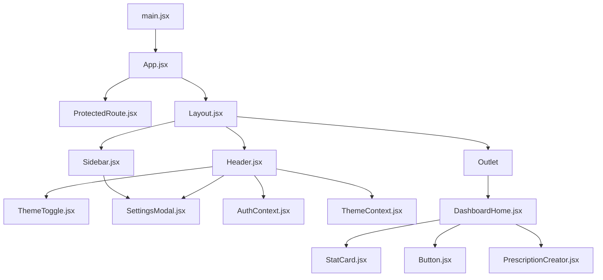

# Component Hierarchy & Composition

<cite>
**Referenced Files in This Document**
- [App.jsx](file://frontend/src/App.jsx)
- [Layout.jsx](file://frontend/src/components/Layout.jsx)
- [Header.jsx](file://frontend/src/components/Header.jsx)
- [Sidebar.jsx](file://frontend/src/components/Sidebar.jsx)
- [ProtectedRoute.jsx](file://frontend/src/components/ProtectedRoute.jsx)
- [DashboardHome.jsx](file://frontend/src/pages/DashboardHome.jsx)
- [Button.jsx](file://frontend/src/components/ui/Button.jsx)
- [StatCard.jsx](file://frontend/src/components/StatCard.jsx)
- [PrescriptionCreator.jsx](file://frontend/src/components/PrescriptionCreator.jsx)
- [SettingsModal.jsx](file://frontend/src/components/SettingsModal.jsx)
- [ThemeToggle.jsx](file://frontend/src/components/ThemeToggle.jsx)
- [AuthContext.jsx](file://frontend/src/context/AuthContext.jsx)
- [ThemeContext.jsx](file://frontend/src/context/ThemeContext.jsx)
- [main.jsx](file://frontend/src/main.jsx)
</cite>

## Table of Contents
1. [Introduction](#introduction)
2. [Project Structure](#project-structure)
3. [Core Components](#core-components)
4. [Architecture Overview](#architecture-overview)
5. [Detailed Component Analysis](#detailed-component-analysis)
6. [Dependency Analysis](#dependency-analysis)
7. [Performance Considerations](#performance-considerations)
8. [Troubleshooting Guide](#troubleshooting-guide)
9. [Conclusion](#conclusion)

## Introduction
This document explains the component hierarchy and composition patterns of the MedVita React application. Starting from the root App.jsx, it details how Layout.jsx orchestrates the overall page structure with Header and Sidebar components. It also covers component composition patterns, strategies to prevent prop drilling, reusability principles, and how page-level components relate to shared UI components. Examples include the protected route pattern and dashboard layouts. Finally, it addresses lifecycle management, performance optimization, and best practices for maintaining clean component hierarchies.

## Project Structure
The application bootstraps inside main.jsx with routing, theming, and authentication providers. App.jsx defines routes and composes page-level components with a shared Layout wrapper. Layout.jsx coordinates the global header and sidebar, while page components render their specific content inside the outlet provided by Layout.

**Diagram sources**
- [main.jsx](file://frontend/src/main.jsx#L1-L17)
- [App.jsx](file://frontend/src/App.jsx#L1-L62)
- [Layout.jsx](file://frontend/src/components/Layout.jsx#L1-L43)
- [Header.jsx](file://frontend/src/components/Header.jsx#L1-L158)
- [Sidebar.jsx](file://frontend/src/components/Sidebar.jsx#L1-L113)
- [DashboardHome.jsx](file://frontend/src/pages/DashboardHome.jsx#L1-L487)

**Section sources**
- [main.jsx](file://frontend/src/main.jsx#L1-L17)
- [App.jsx](file://frontend/src/App.jsx#L1-L62)

## Core Components
- App.jsx: Defines routing, nested routes, and wraps dashboard routes with a shared layout and protection.
- Layout.jsx: Provides the global page container, renders Header and Sidebar, and hosts child content via Outlet.
- Header.jsx: Renders the top navigation bar, user menu, notifications, theme toggle, and settings modal.
- Sidebar.jsx: Renders role-aware navigation links and handles logout and settings actions.
- ProtectedRoute.jsx: Enforces authentication and role-based access control with graceful loading and unauthorized handling.
- DashboardHome.jsx: Page-level component demonstrating composition of reusable UI components and real-time data handling.
- Shared UI: Button.jsx, StatCard.jsx, ThemeToggle.jsx, SettingsModal.jsx, PrescriptionCreator.jsx.

**Section sources**
- [App.jsx](file://frontend/src/App.jsx#L1-L62)
- [Layout.jsx](file://frontend/src/components/Layout.jsx#L1-L43)
- [Header.jsx](file://frontend/src/components/Header.jsx#L1-L158)
- [Sidebar.jsx](file://frontend/src/components/Sidebar.jsx#L1-L113)
- [ProtectedRoute.jsx](file://frontend/src/components/ProtectedRoute.jsx#L1-L108)
- [DashboardHome.jsx](file://frontend/src/pages/DashboardHome.jsx#L1-L487)
- [Button.jsx](file://frontend/src/components/ui/Button.jsx#L1-L51)
- [StatCard.jsx](file://frontend/src/components/StatCard.jsx#L1-L33)
- [ThemeToggle.jsx](file://frontend/src/components/ThemeToggle.jsx#L1-L31)
- [SettingsModal.jsx](file://frontend/src/components/SettingsModal.jsx#L1-L672)
- [PrescriptionCreator.jsx](file://frontend/src/components/PrescriptionCreator.jsx#L1-L303)

## Architecture Overview
The runtime provider stack ensures global state and theming are available to all components. Routing enforces authentication and role checks, while Layout composes the shared shell around page-specific content.

**Diagram sources**
- [main.jsx](file://frontend/src/main.jsx#L1-L17)
- [App.jsx](file://frontend/src/App.jsx#L18-L24)
- [ProtectedRoute.jsx](file://frontend/src/components/ProtectedRoute.jsx#L53-L106)
- [Layout.jsx](file://frontend/src/components/Layout.jsx#L5-L42)
- [Header.jsx](file://frontend/src/components/Header.jsx#L17-L158)
- [Sidebar.jsx](file://frontend/src/components/Sidebar.jsx#L19-L113)
- [DashboardHome.jsx](file://frontend/src/pages/DashboardHome.jsx#L275-L487)

## Detailed Component Analysis

### Root Application and Routing
- App.jsx sets up routes for landing, authentication, staff onboarding, and the dashboard. It defines a nested layout for dashboard routes and applies ProtectedRoute wrappers with role constraints.
- A dedicated DashboardLayout component composes Layout with Outlet, ensuring consistent shell across dashboard pages.

**Diagram sources**
- [App.jsx](file://frontend/src/App.jsx#L35-L53)
- [ProtectedRoute.jsx](file://frontend/src/components/ProtectedRoute.jsx#L53-L106)
- [Layout.jsx](file://frontend/src/components/Layout.jsx#L5-L42)

**Section sources**
- [App.jsx](file://frontend/src/App.jsx#L1-L62)
- [ProtectedRoute.jsx](file://frontend/src/components/ProtectedRoute.jsx#L1-L108)

### Layout Orchestration: Header and Sidebar
- Layout.jsx manages the sidebar state and overlay, rendering Header and Sidebar alongside the main content area. It passes a menu toggle handler to Header and a close handler to Sidebar.
- Header.jsx consumes Auth and Theme contexts, renders user menu, notifications, theme toggle, and settings modal. It initializes Google Calendar for doctors and handles logout.
- Sidebar.jsx filters navigation items by role, tracks active link via location, and triggers close on navigation.

**Diagram sources**
- [Layout.jsx](file://frontend/src/components/Layout.jsx#L5-L42)
- [Header.jsx](file://frontend/src/components/Header.jsx#L17-L158)
- [Sidebar.jsx](file://frontend/src/components/Sidebar.jsx#L19-L113)

**Section sources**
- [Layout.jsx](file://frontend/src/components/Layout.jsx#L1-L43)
- [Header.jsx](file://frontend/src/components/Header.jsx#L1-L158)
- [Sidebar.jsx](file://frontend/src/components/Sidebar.jsx#L1-L113)

### Protected Route Pattern
ProtectedRoute.jsx centralizes authentication and role checks:
- Loading: Waits for session and profile resolution.
- Unauthenticated: Redirects to login with location preservation.
- Role-based access: Validates allowed roles and redirects to role-specific dashboards or unauthorized page.
- Default diversions: Ensures correct home route for specific roles.

**Diagram sources**
- [ProtectedRoute.jsx](file://frontend/src/components/ProtectedRoute.jsx#L53-L106)

**Section sources**
- [ProtectedRoute.jsx](file://frontend/src/components/ProtectedRoute.jsx#L1-L108)

### Dashboard Layout Composition
DashboardHome.jsx demonstrates composition patterns:
- Uses shared StatCard and StatCard-like components to present metrics.
- Integrates reusable UI components like Button.jsx for actions.
- Manages real-time updates via Supabase channels and composes modals like PrescriptionCreator.jsx.
- Demonstrates conditional rendering based on role and dynamic navigation.

**Diagram sources**
- [DashboardHome.jsx](file://frontend/src/pages/DashboardHome.jsx#L1-L487)
- [StatCard.jsx](file://frontend/src/components/StatCard.jsx#L1-L33)
- [Button.jsx](file://frontend/src/components/ui/Button.jsx#L1-L51)
- [PrescriptionCreator.jsx](file://frontend/src/components/PrescriptionCreator.jsx#L1-L303)
- [AuthContext.jsx](file://frontend/src/context/AuthContext.jsx#L1-L108)

**Section sources**
- [DashboardHome.jsx](file://frontend/src/pages/DashboardHome.jsx#L1-L487)
- [StatCard.jsx](file://frontend/src/components/StatCard.jsx#L1-L33)
- [Button.jsx](file://frontend/src/components/ui/Button.jsx#L1-L51)
- [PrescriptionCreator.jsx](file://frontend/src/components/PrescriptionCreator.jsx#L1-L303)

### Shared UI Components and Reusability
- Button.jsx: Centralized button variants and sizing with consistent styling and loader support.
- StatCard.jsx: Reusable metric card with trend indicators and sparkline charts.
- ThemeToggle.jsx: Unified theme switcher integrated into Header.
- SettingsModal.jsx: Comprehensive settings hub for appearance, density, preferences, and doctor-specific integrations.

These components are designed for reuse across pages and roles, minimizing duplication and ensuring consistent UX.

**Section sources**
- [Button.jsx](file://frontend/src/components/ui/Button.jsx#L1-L51)
- [StatCard.jsx](file://frontend/src/components/StatCard.jsx#L1-L33)
- [ThemeToggle.jsx](file://frontend/src/components/ThemeToggle.jsx#L1-L31)
- [SettingsModal.jsx](file://frontend/src/components/SettingsModal.jsx#L1-L672)

### Prop Drilling Prevention and Context Usage
- AuthContext.jsx provides user, profile, and loading state globally, eliminating the need to pass props through multiple layers.
- ThemeContext.jsx manages theme, density, and app style, applied at the root level and consumed by Header and SettingsModal.
- ProtectedRoute.jsx consumes AuthContext to enforce access control without requiring props from parent routes.

Best practices:
- Keep providers near the root (main.jsx).
- Use context for cross-cutting concerns (auth, theme).
- Avoid passing data deeper than necessary; rely on context or higher-order components.

**Section sources**
- [AuthContext.jsx](file://frontend/src/context/AuthContext.jsx#L1-L108)
- [ThemeContext.jsx](file://frontend/src/context/ThemeContext.jsx#L1-L79)
- [ProtectedRoute.jsx](file://frontend/src/components/ProtectedRoute.jsx#L53-L106)
- [main.jsx](file://frontend/src/main.jsx#L1-L17)

### Relationship Between Page-Level and Shared Components
- Pages (e.g., DashboardHome.jsx) depend on shared UI components (Button.jsx, StatCard.jsx) and modals (PrescriptionCreator.jsx, SettingsModal.jsx).
- Layout.jsx composes Header and Sidebar, which themselves consume shared components (ThemeToggle.jsx, Button.jsx).
- ProtectedRoute.jsx acts as a guard for page-level components, ensuring only authorized users reach them.

**Section sources**
- [DashboardHome.jsx](file://frontend/src/pages/DashboardHome.jsx#L1-L487)
- [Layout.jsx](file://frontend/src/components/Layout.jsx#L1-L43)
- [Header.jsx](file://frontend/src/components/Header.jsx#L1-L158)
- [Sidebar.jsx](file://frontend/src/components/Sidebar.jsx#L1-L113)
- [ProtectedRoute.jsx](file://frontend/src/components/ProtectedRoute.jsx#L1-L108)

## Dependency Analysis
The following diagram shows key dependencies among major components:

**Diagram sources**
- [main.jsx](file://frontend/src/main.jsx#L1-L17)
- [App.jsx](file://frontend/src/App.jsx#L1-L62)
- [ProtectedRoute.jsx](file://frontend/src/components/ProtectedRoute.jsx#L1-L108)
- [Layout.jsx](file://frontend/src/components/Layout.jsx#L1-L43)
- [Header.jsx](file://frontend/src/components/Header.jsx#L1-L158)
- [Sidebar.jsx](file://frontend/src/components/Sidebar.jsx#L1-L113)
- [ThemeToggle.jsx](file://frontend/src/components/ThemeToggle.jsx#L1-L31)
- [SettingsModal.jsx](file://frontend/src/components/SettingsModal.jsx#L1-L672)
- [AuthContext.jsx](file://frontend/src/context/AuthContext.jsx#L1-L108)
- [ThemeContext.jsx](file://frontend/src/context/ThemeContext.jsx#L1-L79)
- [DashboardHome.jsx](file://frontend/src/pages/DashboardHome.jsx#L1-L487)
- [StatCard.jsx](file://frontend/src/components/StatCard.jsx#L1-L33)
- [Button.jsx](file://frontend/src/components/ui/Button.jsx#L1-L51)
- [PrescriptionCreator.jsx](file://frontend/src/components/PrescriptionCreator.jsx#L1-L303)

**Section sources**
- [main.jsx](file://frontend/src/main.jsx#L1-L17)
- [App.jsx](file://frontend/src/App.jsx#L1-L62)
- [ProtectedRoute.jsx](file://frontend/src/components/ProtectedRoute.jsx#L1-L108)
- [Layout.jsx](file://frontend/src/components/Layout.jsx#L1-L43)
- [Header.jsx](file://frontend/src/components/Header.jsx#L1-L158)
- [Sidebar.jsx](file://frontend/src/components/Sidebar.jsx#L1-L113)
- [DashboardHome.jsx](file://frontend/src/pages/DashboardHome.jsx#L1-L487)

## Performance Considerations
- Provider placement: Keep ThemeProvider and AuthProvider near the root to minimize re-renders and avoid unnecessary propagation.
- Conditional rendering: ProtectedRoute.jsx prevents rendering heavy page components until auth and profile are resolved.
- Component boundaries: Use Layout.jsx to isolate shell rendering and reduce re-renders of page content.
- Real-time updates: DashboardHome.jsx uses Supabase channels; ensure cleanup in effects to avoid memory leaks.
- Modal composition: SettingsModal.jsx and PrescriptionCreator.jsx are conditionally rendered, reducing DOM overhead when closed.

[No sources needed since this section provides general guidance]

## Troubleshooting Guide
Common issues and resolutions:
- Authentication not resolving: Verify AuthProvider initialization and Supabase session handling in AuthContext.jsx. ProtectedRoute.jsx will show a loading state until both user and profile are available.
- Role mismatch: ProtectedRoute.jsx redirects to an unauthorized page and logs warnings; confirm allowedRoles and profile.role alignment.
- Sidebar not closing: Ensure Layout.jsx passes onClose to Sidebar and that Header’s onMenuClick toggles sidebarOpen.
- Settings not persisting: SettingsModal.jsx writes to localStorage and updates profile; confirm fetchProfile is called after updates.

**Section sources**
- [AuthContext.jsx](file://frontend/src/context/AuthContext.jsx#L1-L108)
- [ProtectedRoute.jsx](file://frontend/src/components/ProtectedRoute.jsx#L53-L106)
- [Layout.jsx](file://frontend/src/components/Layout.jsx#L5-L42)
- [SettingsModal.jsx](file://frontend/src/components/SettingsModal.jsx#L1-L672)

## Conclusion
MedVita’s component hierarchy centers on a robust provider stack, a shared Layout shell, and a ProtectedRoute guard. Composition patterns emphasize reusable UI components, centralized context usage, and role-aware routing. By structuring components with clear boundaries, leveraging context to prevent prop drilling, and applying lifecycle-aware patterns, the application maintains a clean, scalable, and performant architecture.