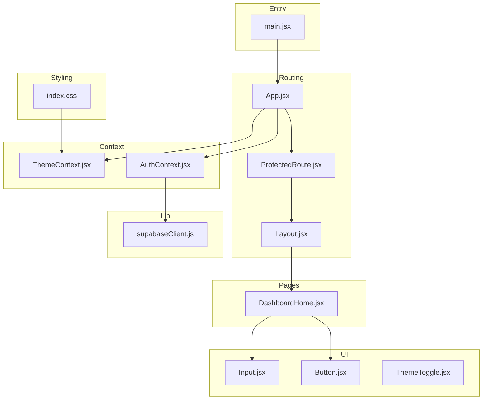
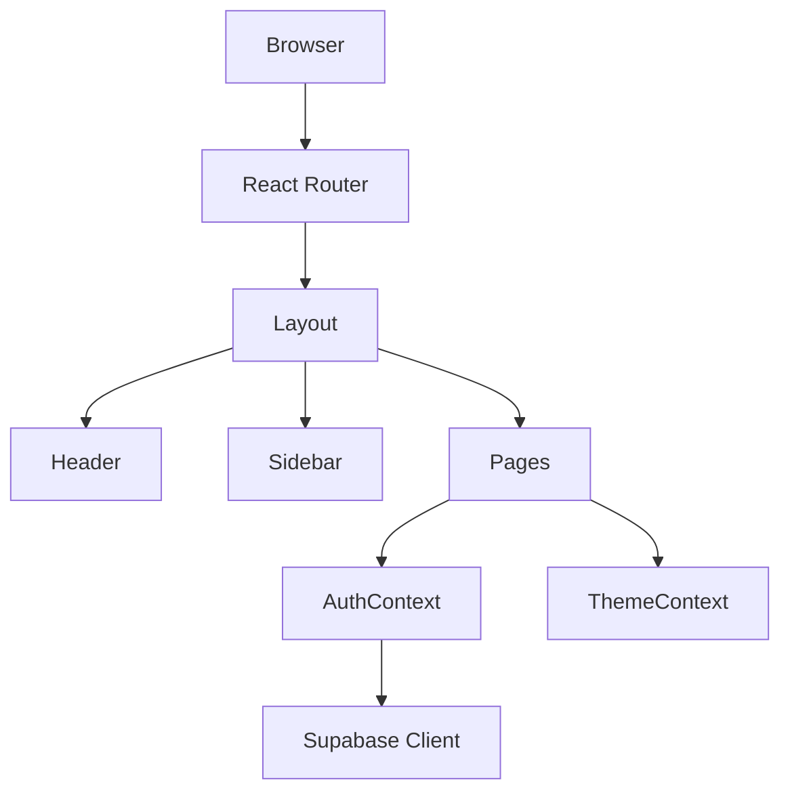
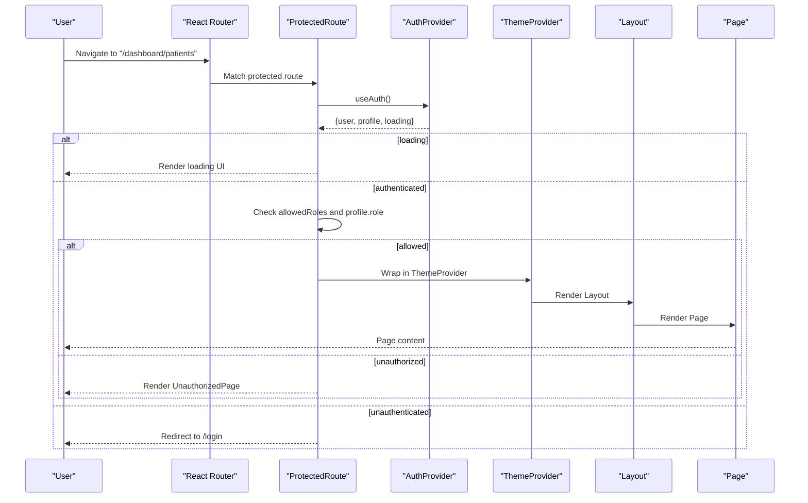
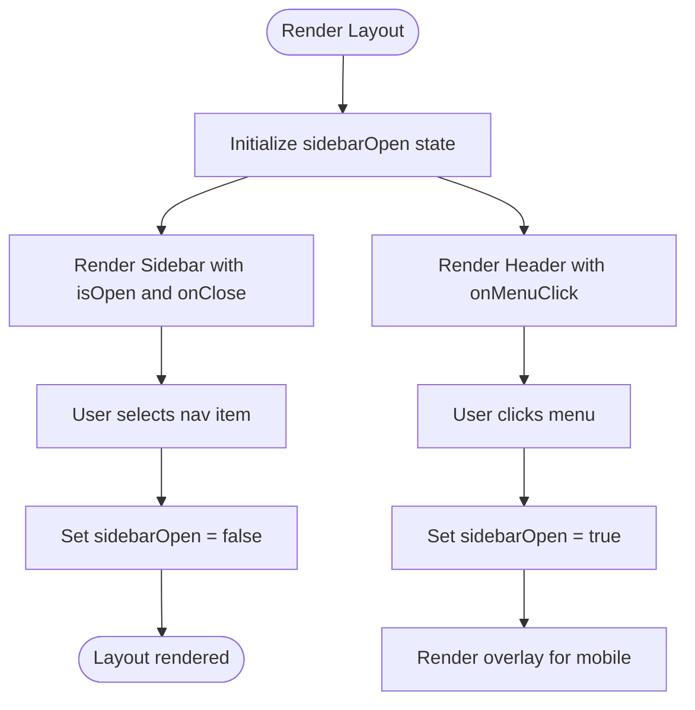
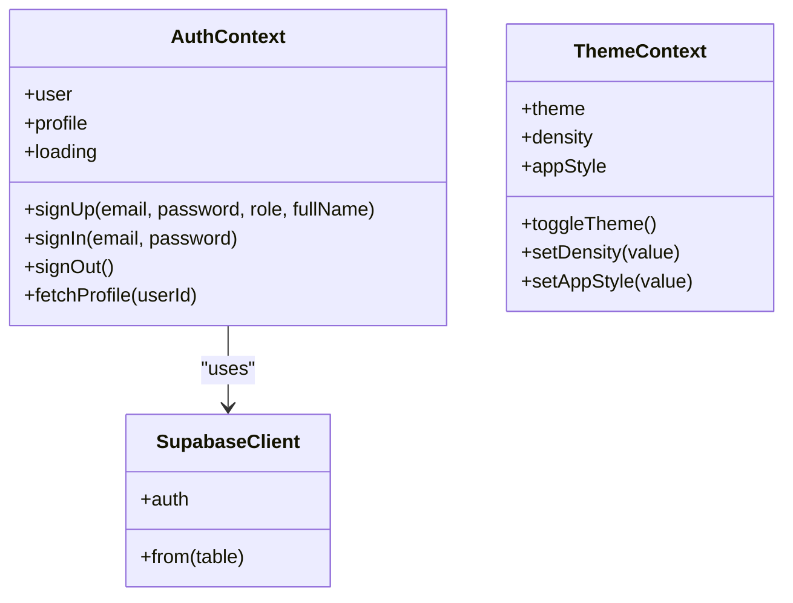
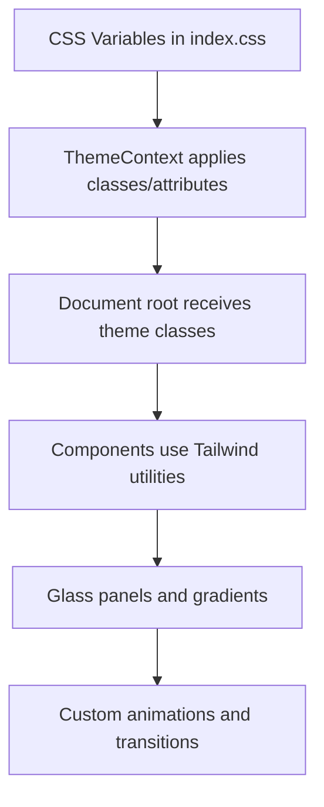
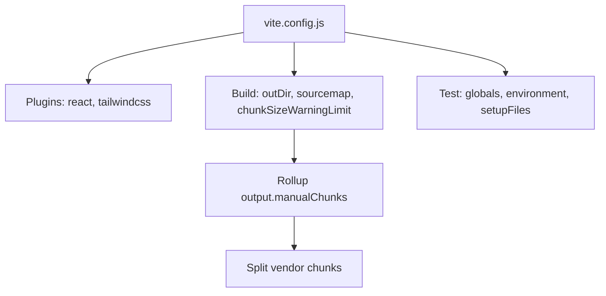
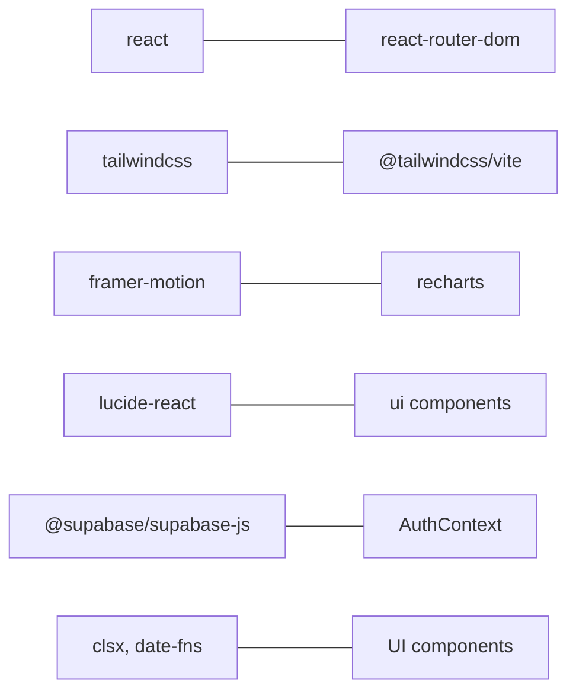

# Frontend Architecture

<cite>
**Referenced Files in This Document**
- [main.jsx](file://frontend/src/main.jsx)
- [App.jsx](file://frontend/src/App.jsx)
- [Layout.jsx](file://frontend/src/components/Layout.jsx)
- [Header.jsx](file://frontend/src/components/Header.jsx)
- [Sidebar.jsx](file://frontend/src/components/Sidebar.jsx)
- [ProtectedRoute.jsx](file://frontend/src/components/ProtectedRoute.jsx)
- [ThemeContext.jsx](file://frontend/src/context/ThemeContext.jsx)
- [AuthContext.jsx](file://frontend/src/context/AuthContext.jsx)
- [supabaseClient.js](file://frontend/src/lib/supabaseClient.js)
- [Button.jsx](file://frontend/src/components/ui/Button.jsx)
- [Input.jsx](file://frontend/src/components/ui/Input.jsx)
- [ThemeToggle.jsx](file://frontend/src/components/ThemeToggle.jsx)
- [DashboardHome.jsx](file://frontend/src/pages/DashboardHome.jsx)
- [index.css](file://frontend/src/index.css)
- [vite.config.js](file://frontend/vite.config.js)
- [package.json](file://frontend/package.json)
</cite>

## Table of Contents
1. [Introduction](#introduction)
2. [Project Structure](#project-structure)
3. [Core Components](#core-components)
4. [Architecture Overview](#architecture-overview)
5. [Detailed Component Analysis](#detailed-component-analysis)
6. [Dependency Analysis](#dependency-analysis)
7. [Performance Considerations](#performance-considerations)
8. [Troubleshooting Guide](#troubleshooting-guide)
9. [Conclusion](#conclusion)
10. [Appendices](#appendices)

## Introduction
This document describes the frontend architecture of the MedVita React application. It covers the component hierarchy, routing configuration with React Router, state management patterns using React Context API, layout and theme systems, design system and styling conventions, build configuration with Vite, and development workflow. It also provides guidance for extending the architecture and adding new features.

## Project Structure
The frontend is organized around feature-based and layer-based patterns:
- Entry point initializes providers and router.
- Pages represent top-level routes.
- Components encapsulate UI and layout.
- Context modules manage global state (authentication and theme).
- UI primitives live under a dedicated ui directory.
- Styling leverages Tailwind CSS with a custom design system and CSS variables.

**Diagram sources**
- [main.jsx](file://frontend/src/main.jsx#L1-L17)
- [App.jsx](file://frontend/src/App.jsx#L1-L62)
- [ProtectedRoute.jsx](file://frontend/src/components/ProtectedRoute.jsx#L1-L108)
- [Layout.jsx](file://frontend/src/components/Layout.jsx#L1-L43)
- [DashboardHome.jsx](file://frontend/src/pages/DashboardHome.jsx#L1-L487)
- [Button.jsx](file://frontend/src/components/ui/Button.jsx#L1-L51)
- [Input.jsx](file://frontend/src/components/ui/Input.jsx#L1-L63)
- [ThemeToggle.jsx](file://frontend/src/components/ThemeToggle.jsx#L1-L31)
- [AuthContext.jsx](file://frontend/src/context/AuthContext.jsx#L1-L108)
- [ThemeContext.jsx](file://frontend/src/context/ThemeContext.jsx#L1-L79)
- [supabaseClient.js](file://frontend/src/lib/supabaseClient.js#L1-L11)
- [index.css](file://frontend/src/index.css#L1-L781)

**Section sources**
- [main.jsx](file://frontend/src/main.jsx#L1-L17)
- [App.jsx](file://frontend/src/App.jsx#L1-L62)
- [package.json](file://frontend/package.json#L1-L50)

## Core Components
- Providers and Root: The application bootstraps with React Router and wraps the app in ThemeProvider and AuthProvider.
- Routing: Nested routes with a shared dashboard layout and protected routes gated by role.
- Layout: A responsive layout with a collapsible sidebar and header.
- Authentication: Session management, profile fetching, and role-aware navigation.
- Theming: Theme, density, and app style persisted in localStorage and applied to the document root.
- UI Primitives: Reusable Button and Input components with variants and sizes.
- Styling: Tailwind-based design tokens and CSS custom properties for theme variants.

**Section sources**
- [main.jsx](file://frontend/src/main.jsx#L1-L17)
- [App.jsx](file://frontend/src/App.jsx#L1-L62)
- [Layout.jsx](file://frontend/src/components/Layout.jsx#L1-L43)
- [Header.jsx](file://frontend/src/components/Header.jsx#L1-L158)
- [Sidebar.jsx](file://frontend/src/components/Sidebar.jsx#L1-L113)
- [ProtectedRoute.jsx](file://frontend/src/components/ProtectedRoute.jsx#L1-L108)
- [AuthContext.jsx](file://frontend/src/context/AuthContext.jsx#L1-L108)
- [ThemeContext.jsx](file://frontend/src/context/ThemeContext.jsx#L1-L79)
- [Button.jsx](file://frontend/src/components/ui/Button.jsx#L1-L51)
- [Input.jsx](file://frontend/src/components/ui/Input.jsx#L1-L63)
- [index.css](file://frontend/src/index.css#L1-L781)

## Architecture Overview
The architecture follows a layered pattern:
- Presentation Layer: Pages and components.
- Routing Layer: React Router with nested layouts and protected routes.
- State Management Layer: React Context for theme and auth.
- Data Access Layer: Supabase client for authentication and real-time data.
- Styling Layer: Tailwind CSS with a custom design system and CSS variables.

**Diagram sources**
- [main.jsx](file://frontend/src/main.jsx#L1-L17)
- [App.jsx](file://frontend/src/App.jsx#L1-L62)
- [Layout.jsx](file://frontend/src/components/Layout.jsx#L1-L43)
- [Header.jsx](file://frontend/src/components/Header.jsx#L1-L158)
- [Sidebar.jsx](file://frontend/src/components/Sidebar.jsx#L1-L113)
- [AuthContext.jsx](file://frontend/src/context/AuthContext.jsx#L1-L108)
- [ThemeContext.jsx](file://frontend/src/context/ThemeContext.jsx#L1-L79)
- [supabaseClient.js](file://frontend/src/lib/supabaseClient.js#L1-L11)

## Detailed Component Analysis

### Routing and Navigation
- Top-level routes include landing, login, signup, staff signup, and dashboard subroutes.
- Dashboard routes are wrapped in a ProtectedRoute that enforces authentication and role-based access.
- A nested Layout composes Header and Sidebar around page content.
- ProtectedRoute handles loading, unauthenticated, unauthorized, and redirection scenarios.

**Diagram sources**
- [App.jsx](file://frontend/src/App.jsx#L1-L62)
- [ProtectedRoute.jsx](file://frontend/src/components/ProtectedRoute.jsx#L1-L108)
- [AuthContext.jsx](file://frontend/src/context/AuthContext.jsx#L1-L108)
- [ThemeContext.jsx](file://frontend/src/context/ThemeContext.jsx#L1-L79)
- [Layout.jsx](file://frontend/src/components/Layout.jsx#L1-L43)

**Section sources**
- [App.jsx](file://frontend/src/App.jsx#L1-L62)
- [ProtectedRoute.jsx](file://frontend/src/components/ProtectedRoute.jsx#L1-L108)

### Layout System and Composition
- Layout manages a responsive sidebar with a mobile overlay and animated transitions.
- Header integrates search, notifications, theme toggle, and user menu.
- Sidebar renders role-specific navigation items and provides settings and logout actions.

**Diagram sources**
- [Layout.jsx](file://frontend/src/components/Layout.jsx#L1-L43)
- [Header.jsx](file://frontend/src/components/Header.jsx#L1-L158)
- [Sidebar.jsx](file://frontend/src/components/Sidebar.jsx#L1-L113)

**Section sources**
- [Layout.jsx](file://frontend/src/components/Layout.jsx#L1-L43)
- [Header.jsx](file://frontend/src/components/Header.jsx#L1-L158)
- [Sidebar.jsx](file://frontend/src/components/Sidebar.jsx#L1-L113)

### State Management with React Context
- AuthContext: Centralizes session state, profile fetching, sign-up/sign-in/sign-out, and loading state. It subscribes to Supabase auth state changes and persists profile data.
- ThemeContext: Manages theme (light/dark), density (compact/normal/spacious), and app style (modern/minimal). Applies CSS classes and attributes to the document root and saves preferences to localStorage.

**Diagram sources**
- [AuthContext.jsx](file://frontend/src/context/AuthContext.jsx#L1-L108)
- [ThemeContext.jsx](file://frontend/src/context/ThemeContext.jsx#L1-L79)
- [supabaseClient.js](file://frontend/src/lib/supabaseClient.js#L1-L11)

**Section sources**
- [AuthContext.jsx](file://frontend/src/context/AuthContext.jsx#L1-L108)
- [ThemeContext.jsx](file://frontend/src/context/ThemeContext.jsx#L1-L79)
- [supabaseClient.js](file://frontend/src/lib/supabaseClient.js#L1-L11)

### Design System and Styling Conventions
- Tailwind CSS is configured via the Tailwind plugin for Vite.
- index.css defines a custom design system using CSS variables for brand colors, backgrounds, shadows, and animations.
- Theme variants include light/dark modes, density variants, and app style variants (modern/minimal).
- Components leverage utility classes and custom glass-like panels with backdrop filters.

**Diagram sources**
- [index.css](file://frontend/src/index.css#L1-L781)
- [ThemeContext.jsx](file://frontend/src/context/ThemeContext.jsx#L1-L79)

**Section sources**
- [index.css](file://frontend/src/index.css#L1-L781)
- [ThemeToggle.jsx](file://frontend/src/components/ThemeToggle.jsx#L1-L31)

### Build Configuration with Vite
- Plugins: React and Tailwind CSS plugins.
- Build: Outputs to dist, disables source maps, increases chunk size warning limit, and splits vendor bundles for React, charts, motion, PDF generation, and Supabase.
- Test: Vitest configuration with jsdom and setup file.

**Diagram sources**
- [vite.config.js](file://frontend/vite.config.js#L1-L33)

**Section sources**
- [vite.config.js](file://frontend/vite.config.js#L1-L33)
- [package.json](file://frontend/package.json#L1-L50)

## Dependency Analysis
- Runtime dependencies include React, React Router, Tailwind CSS, Framer Motion, Recharts, Lucide icons, clsx, date-fns, html2canvas, jspdf, react-to-print, and @supabase/supabase-js.
- Dev dependencies include Vite, React plugin, Tailwind plugin, ESLint, Vitest, and related testing libraries.

**Diagram sources**
- [package.json](file://frontend/package.json#L1-L50)

**Section sources**
- [package.json](file://frontend/package.json#L1-L50)

## Performance Considerations
- Bundle splitting: Vendor chunks separate React, charts, motion, PDF generation, and Supabase to improve caching and load performance.
- Source maps: Disabled in production builds to reduce bundle size.
- Chunk size warnings: Increased limit to accommodate larger bundles during development.
- Lazy loading: Consider React.lazy and Suspense for heavy pages to defer loading until navigation.
- Image optimization: Use modern formats and appropriate sizes; leverage Vite’s asset handling.
- CSS optimization: Purge unused styles with Tailwind’s purge configuration if enabled; keep utility usage scoped to components.
- Real-time updates: Use Supabase channels judiciously; unsubscribe on unmount to prevent leaks.

[No sources needed since this section provides general guidance]

## Troubleshooting Guide
- Authentication state changes: AuthContext listens to Supabase auth events; ensure environment variables are present and profile fetching succeeds.
- ProtectedRoute redirects: Verify allowedRoles and profile.role; unauthorized users are redirected to an access-denied page.
- Theme persistence: ThemeContext reads/writes localStorage; confirm browser supports localStorage and clears cache if stale values appear.
- Styling anomalies: Check CSS variable overrides for app style and density; ensure Tailwind plugin is loaded and CSS is imported.

**Section sources**
- [AuthContext.jsx](file://frontend/src/context/AuthContext.jsx#L1-L108)
- [ProtectedRoute.jsx](file://frontend/src/components/ProtectedRoute.jsx#L1-L108)
- [ThemeContext.jsx](file://frontend/src/context/ThemeContext.jsx#L1-L79)
- [index.css](file://frontend/src/index.css#L1-L781)

## Conclusion
MedVita’s frontend employs a clean, layered architecture with React Router for navigation, React Context for global state, and Tailwind CSS for a flexible design system. The build pipeline is optimized for performance with strategic vendor chunking. The layout system and UI primitives promote composability and consistency. Following the best practices outlined here will help maintain scalability and developer productivity as the application evolves.

[No sources needed since this section summarizes without analyzing specific files]

## Appendices

### Component Library Structure
- ui: Reusable primitives (Button, Input) with variants and sizes.
- Layout: Shared layout with Header and Sidebar.
- Pages: Feature-specific views under dashboard and public routes.
- Context: Auth and Theme contexts for global state.
- Lib: Supabase client initialization and Google Calendar helpers.

**Section sources**
- [Button.jsx](file://frontend/src/components/ui/Button.jsx#L1-L51)
- [Input.jsx](file://frontend/src/components/ui/Input.jsx#L1-L63)
- [Layout.jsx](file://frontend/src/components/Layout.jsx#L1-L43)
- [Header.jsx](file://frontend/src/components/Header.jsx#L1-L158)
- [Sidebar.jsx](file://frontend/src/components/Sidebar.jsx#L1-L113)
- [AuthContext.jsx](file://frontend/src/context/AuthContext.jsx#L1-L108)
- [ThemeContext.jsx](file://frontend/src/context/ThemeContext.jsx#L1-L79)
- [supabaseClient.js](file://frontend/src/lib/supabaseClient.js#L1-L11)

### Development Best Practices
- Keep components pure and declarative; centralize side effects in hooks or context.
- Use TypeScript or PropTypes for type safety if adopted later.
- Write unit tests for components and context logic; use Vitest and Testing Library.
- Enforce linting rules and organize imports consistently.
- Document complex logic in components and context modules with comments and diagrams.

[No sources needed since this section provides general guidance]