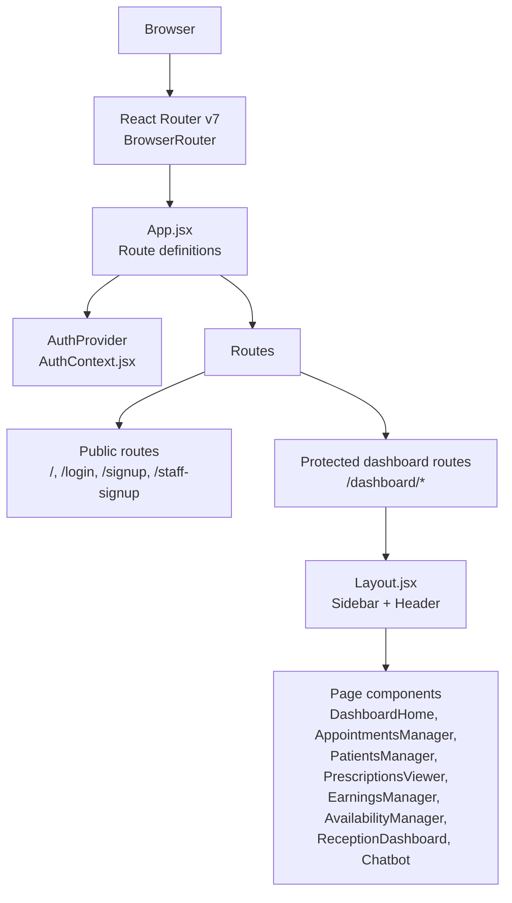
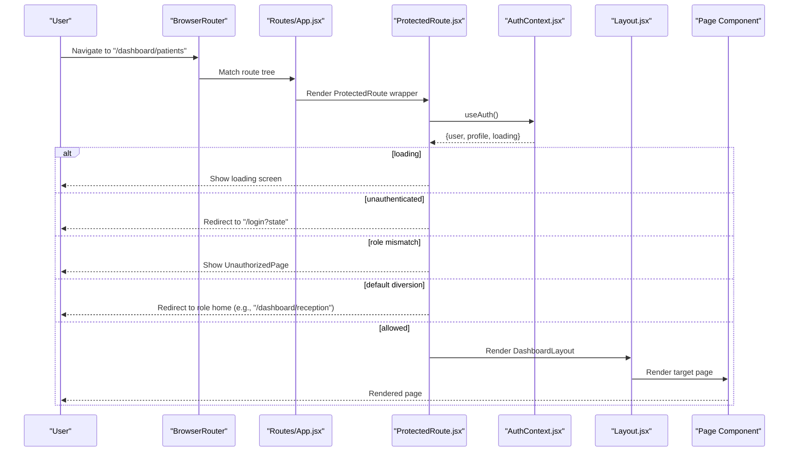
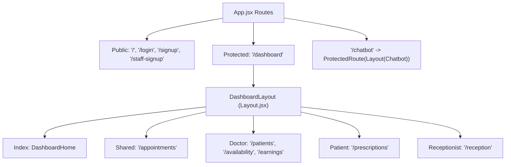
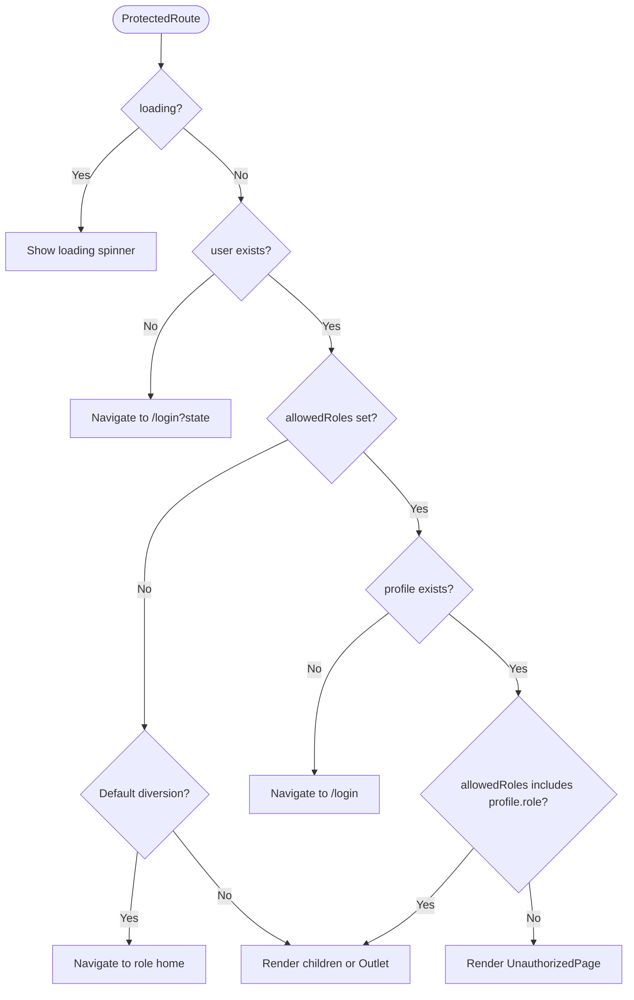
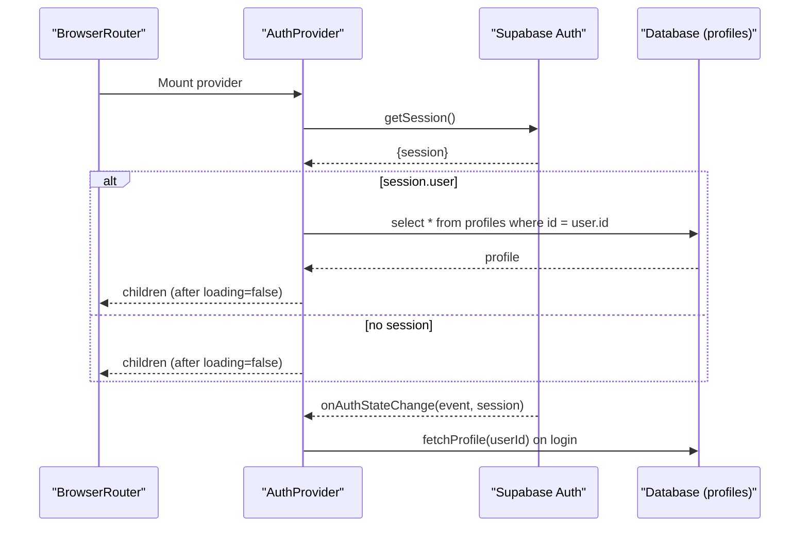
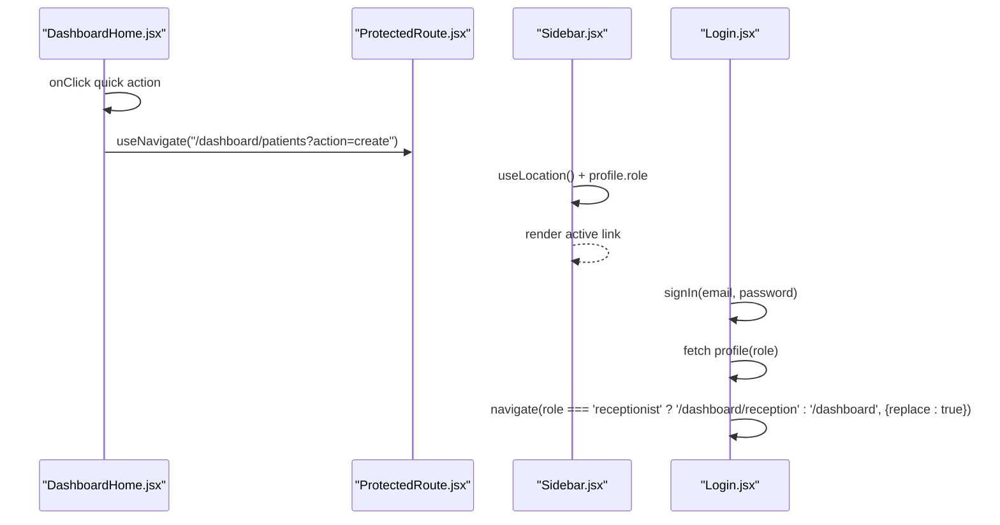
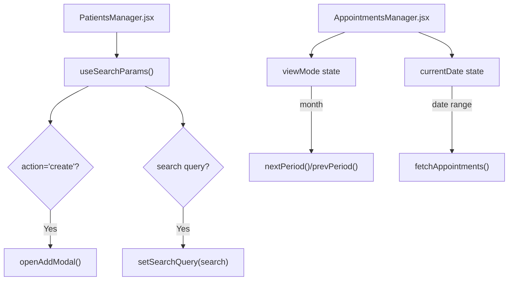
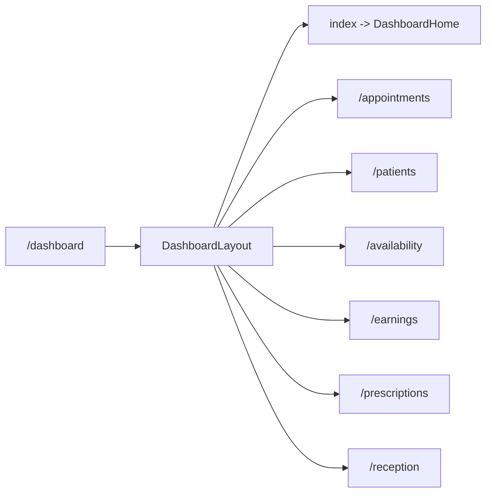
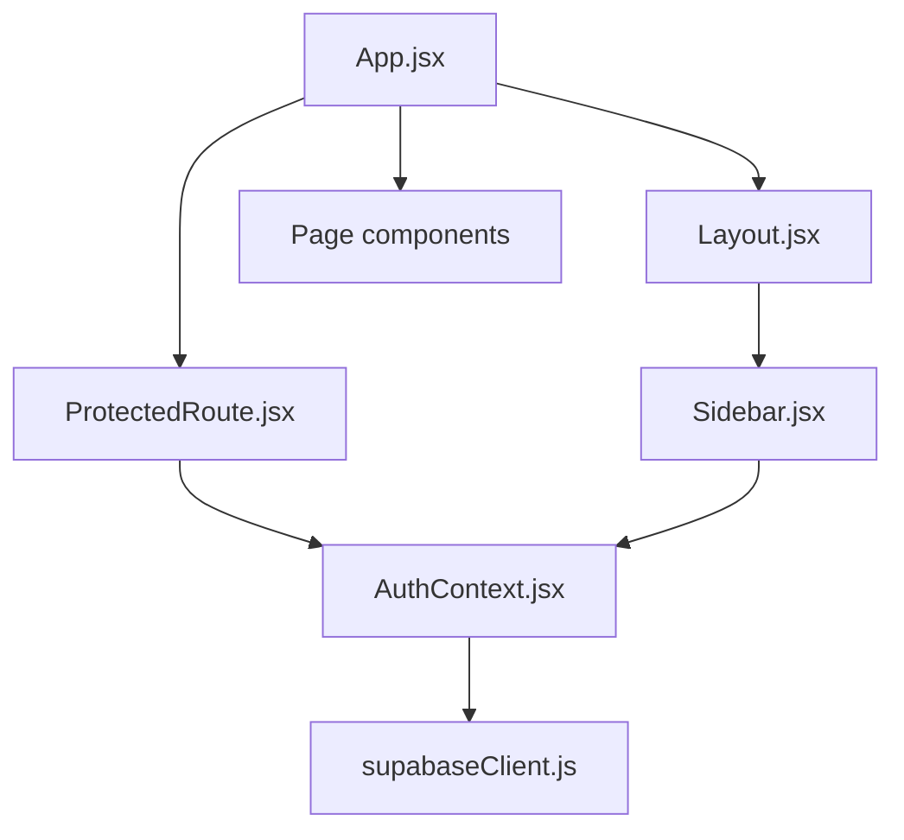

# Routing System & Navigation

<cite>
**Referenced Files in This Document**
- [App.jsx](file://frontend/src/App.jsx)
- [ProtectedRoute.jsx](file://frontend/src/components/ProtectedRoute.jsx)
- [AuthContext.jsx](file://frontend/src/context/AuthContext.jsx)
- [main.jsx](file://frontend/src/main.jsx)
- [Layout.jsx](file://frontend/src/components/Layout.jsx)
- [Sidebar.jsx](file://frontend/src/components/Sidebar.jsx)
- [DashboardHome.jsx](file://frontend/src/pages/DashboardHome.jsx)
- [Login.jsx](file://frontend/src/pages/Login.jsx)
- [PatientsManager.jsx](file://frontend/src/pages/PatientsManager.jsx)
- [AppointmentsManager.jsx](file://frontend/src/pages/AppointmentsManager.jsx)
- [supabaseClient.js](file://frontend/src/lib/supabaseClient.js)
- [package.json](file://frontend/package.json)
</cite>

## Table of Contents
1. [Introduction](#introduction)
2. [Project Structure](#project-structure)
3. [Core Components](#core-components)
4. [Architecture Overview](#architecture-overview)
5. [Detailed Component Analysis](#detailed-component-analysis)
6. [Dependency Analysis](#dependency-analysis)
7. [Performance Considerations](#performance-considerations)
8. [Troubleshooting Guide](#troubleshooting-guide)
9. [Conclusion](#conclusion)

## Introduction
This document explains MedVita’s client-side routing system built with React Router v7. It covers route definitions, nested layouts, role-based access control via a ProtectedRoute wrapper, programmatic navigation, and integration with authentication flows. It also documents navigation patterns, route parameters handling, and best practices for maintainable routing and navigation state management.

## Project Structure
MedVita’s routing is configured at the application root and composed with shared layout and navigation components. The router is initialized in the application entry point and wraps the entire app with providers for authentication and theme.

**Diagram sources**
- [main.jsx](file://frontend/src/main.jsx#L8-L16)
- [App.jsx](file://frontend/src/App.jsx#L26-L59)
- [AuthContext.jsx](file://frontend/src/context/AuthContext.jsx#L9-L107)
- [Layout.jsx](file://frontend/src/components/Layout.jsx#L5-L42)

**Section sources**
- [main.jsx](file://frontend/src/main.jsx#L1-L17)
- [App.jsx](file://frontend/src/App.jsx#L1-L62)

## Core Components
- App.jsx: Declares all routes, including public pages and nested protected dashboard routes with a shared layout.
- ProtectedRoute: Enforces authentication and role-based access control, with dedicated unauthorized handling and default diversions.
- AuthProvider/AuthContext: Centralizes authentication state, profile retrieval, and auth state change subscriptions.
- Layout: Provides a shared dashboard shell with sidebar and header.
- Sidebar: Renders role-aware navigation links and highlights active routes.
- Page components: Implement route-specific logic and programmatic navigation.

**Section sources**
- [App.jsx](file://frontend/src/App.jsx#L26-L59)
- [ProtectedRoute.jsx](file://frontend/src/components/ProtectedRoute.jsx#L53-L106)
- [AuthContext.jsx](file://frontend/src/context/AuthContext.jsx#L9-L107)
- [Layout.jsx](file://frontend/src/components/Layout.jsx#L5-L42)
- [Sidebar.jsx](file://frontend/src/components/Sidebar.jsx#L19-L112)

## Architecture Overview
The routing architecture enforces authentication and role checks at the route level. ProtectedRoute ensures users are authenticated, have a profile, and belong to allowed roles. It also redirects users to role-appropriate dashboards and displays a tailored unauthorized page when access is denied.

**Diagram sources**
- [App.jsx](file://frontend/src/App.jsx#L35-L53)
- [ProtectedRoute.jsx](file://frontend/src/components/ProtectedRoute.jsx#L53-L106)
- [AuthContext.jsx](file://frontend/src/context/AuthContext.jsx#L9-L107)
- [Layout.jsx](file://frontend/src/components/Layout.jsx#L5-L42)

## Detailed Component Analysis

### Route Definitions and Nested Layouts
- Root-level public routes: landing, login, signup, staff signup.
- Protected dashboard routes under /dashboard with nested children:
  - Index route renders the dashboard home.
  - Shared routes: appointments.
  - Doctor-only routes: patients, availability, earnings.
  - Patient-only routes: prescriptions.
  - Receptionist-only route: reception dashboard.
- Additional protected route: /chatbot guarded by ProtectedRoute and wrapped in Layout.

**Diagram sources**
- [App.jsx](file://frontend/src/App.jsx#L26-L59)
- [Layout.jsx](file://frontend/src/components/Layout.jsx#L5-L42)

**Section sources**
- [App.jsx](file://frontend/src/App.jsx#L26-L59)

### ProtectedRoute Implementation
ProtectedRoute orchestrates:
- Authentication gating: redirects unauthenticated users to login with state preservation.
- Profile loading: waits for profile resolution before deciding access.
- Role-based access: compares profile.role against allowedRoles.
- Unauthorized handling: renders a themed unauthorized page with a link to the user’s home route.
- Default diversions: ensures receptionists are directed to their specific dashboard.

**Diagram sources**
- [ProtectedRoute.jsx](file://frontend/src/components/ProtectedRoute.jsx#L53-L106)

**Section sources**
- [ProtectedRoute.jsx](file://frontend/src/components/ProtectedRoute.jsx#L53-L106)

### Authentication Integration and AuthProvider
- Initializes session state and subscribes to auth state changes.
- Fetches user profile from the database upon login or session restoration.
- Exposes sign-in/sign-up/sign-out and profile refresh utilities.
- Provider conditionally renders children only after loading completes.

**Diagram sources**
- [AuthContext.jsx](file://frontend/src/context/AuthContext.jsx#L9-L107)
- [supabaseClient.js](file://frontend/src/lib/supabaseClient.js#L1-L11)

**Section sources**
- [AuthContext.jsx](file://frontend/src/context/AuthContext.jsx#L9-L107)
- [supabaseClient.js](file://frontend/src/lib/supabaseClient.js#L1-L11)

### Navigation Patterns and Programmatic Navigation
- Programmatic navigation:
  - DashboardHome uses navigation to quick actions and lists to drive users to relevant sections.
  - Login performs deterministic redirects based on role after successful sign-in.
- Link-based navigation:
  - Sidebar renders role-aware links and highlights active routes.
  - ProtectedRoute preserves the from location for seamless post-login redirection.

**Diagram sources**
- [DashboardHome.jsx](file://frontend/src/pages/DashboardHome.jsx#L275-L380)
- [Sidebar.jsx](file://frontend/src/components/Sidebar.jsx#L19-L112)
- [Login.jsx](file://frontend/src/pages/Login.jsx#L20-L75)
- [ProtectedRoute.jsx](file://frontend/src/components/ProtectedRoute.jsx#L53-L106)

**Section sources**
- [DashboardHome.jsx](file://frontend/src/pages/DashboardHome.jsx#L275-L380)
- [Sidebar.jsx](file://frontend/src/components/Sidebar.jsx#L19-L112)
- [Login.jsx](file://frontend/src/pages/Login.jsx#L20-L75)

### Route Parameters Handling
- PatientsManager reads query parameters (e.g., action=search) to control UI behavior and filtering.
- AppointmentsManager manages view modes and date navigation via local state and date helpers.

**Diagram sources**
- [PatientsManager.jsx](file://frontend/src/pages/PatientsManager.jsx#L15-L55)
- [AppointmentsManager.jsx](file://frontend/src/pages/AppointmentsManager.jsx#L14-L66)

**Section sources**
- [PatientsManager.jsx](file://frontend/src/pages/PatientsManager.jsx#L15-L55)
- [AppointmentsManager.jsx](file://frontend/src/pages/AppointmentsManager.jsx#L14-L66)

### Dynamic Routing and Nested Routes
- Nested routes under /dashboard share a single layout via Outlet and DashboardLayout.
- Conditional rendering of routes based on allowedRoles ensures role-specific navigation.
- Default diversions ensure users land on the correct dashboard when visiting generic paths.

**Diagram sources**
- [App.jsx](file://frontend/src/App.jsx#L35-L53)
- [Layout.jsx](file://frontend/src/components/Layout.jsx#L5-L42)

**Section sources**
- [App.jsx](file://frontend/src/App.jsx#L35-L53)

### Route Guards and Unauthorized Handling
- UnauthorizedPage provides a clear, branded message and a link back to the user’s appropriate dashboard.
- Role mismatches are logged for debugging, and users are redirected to the unauthorized page.

**Section sources**
- [ProtectedRoute.jsx](file://frontend/src/components/ProtectedRoute.jsx#L16-L47)
- [ProtectedRoute.jsx](file://frontend/src/components/ProtectedRoute.jsx#L89-L92)

### Relationship Between Routing and Component Rendering
- ProtectedRoute controls whether a page component renders or navigates away.
- Layout composes page components with shared UI (sidebar, header).
- AuthProvider ensures components can safely access user and profile data.

**Section sources**
- [ProtectedRoute.jsx](file://frontend/src/components/ProtectedRoute.jsx#L53-L106)
- [Layout.jsx](file://frontend/src/components/Layout.jsx#L5-L42)
- [AuthContext.jsx](file://frontend/src/context/AuthContext.jsx#L9-L107)

### Lazy Loading Strategies
- Current implementation loads all page components synchronously.
- Recommended strategy: Use React.lazy and Suspense around route components to defer loading until navigation occurs. This reduces initial bundle size and improves perceived performance.

[No sources needed since this section provides general guidance]

## Dependency Analysis
- App.jsx depends on ProtectedRoute, Layout, and page components.
- ProtectedRoute depends on AuthContext and react-router-dom’s Navigate/Outlet/useLocation.
- AuthProvider depends on Supabase client for session and profile management.
- Sidebar depends on useLocation and profile role to render role-aware navigation.

**Diagram sources**
- [App.jsx](file://frontend/src/App.jsx#L26-L59)
- [ProtectedRoute.jsx](file://frontend/src/components/ProtectedRoute.jsx#L53-L106)
- [AuthContext.jsx](file://frontend/src/context/AuthContext.jsx#L9-L107)
- [Layout.jsx](file://frontend/src/components/Layout.jsx#L5-L42)
- [Sidebar.jsx](file://frontend/src/components/Sidebar.jsx#L19-L112)
- [supabaseClient.js](file://frontend/src/lib/supabaseClient.js#L1-L11)

**Section sources**
- [package.json](file://frontend/package.json#L27-L31)

## Performance Considerations
- Bundle size: Consider code-splitting route components to reduce initial load.
- Navigation: Prefer shallow routing and avoid unnecessary re-renders by leveraging stable refs and memoization in page components.
- Auth state: Keep profile fetching minimal and cache where appropriate to avoid redundant network calls.

[No sources needed since this section provides general guidance]

## Troubleshooting Guide
- Stuck on loading during auth:
  - Verify AuthProvider resolves session and profile before rendering children.
  - Check Supabase keys and network connectivity.
- Redirect loops after login:
  - Confirm login flow fetches profile and navigates deterministically by role.
- Access denied page appears unexpectedly:
  - Ensure profile.role matches allowedRoles in ProtectedRoute.
  - Check default diversion logic for role-specific homes.
- Sidebar navigation incorrect:
  - Validate role-aware nav items and active link detection logic.

**Section sources**
- [AuthContext.jsx](file://frontend/src/context/AuthContext.jsx#L9-L107)
- [Login.jsx](file://frontend/src/pages/Login.jsx#L20-L75)
- [ProtectedRoute.jsx](file://frontend/src/components/ProtectedRoute.jsx#L53-L106)
- [Sidebar.jsx](file://frontend/src/components/Sidebar.jsx#L19-L112)

## Conclusion
MedVita’s routing system combines React Router’s nested routing with a robust ProtectedRoute guard and a centralized AuthProvider. The design cleanly separates authentication, authorization, and navigation concerns, enabling role-aware experiences and predictable user flows. Adopting code splitting and refining navigation state management will further enhance performance and maintainability.